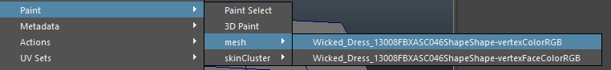
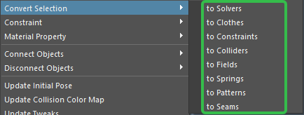
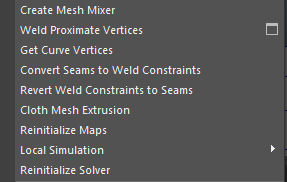

# 清除速度和截断缓存

- 清除速度：清除布料的惯性速度
- 截断缓存：将当前帧之后的缓存截断并清除，常用语解决穿插问题
# 更新姿势

- 更新初始姿势：更新与布料物体具有相同拓扑结构的物体的初始姿势:(先选择布料物体，再加选具有相同拓扑结构的物体，执行命令。
- 更新碰撞颜色贴图：调整布料与布料的碰撞结果(相同颜色，才能产生碰撞)
	- 开启自碰撞，在布料输出模型上点右键，绘制顶点颜色，两个布料顶点颜色相同才会产生碰撞
	- 
- 更新调整：物体有缓存后，可以调整物体的形状，然后再开始模拟(先截断缓存，再调整形态，最后执行命令)
	- 先截断缓存，再调整布料形态，最后执行命令。常用于调整穿插和布料形状。
- 清除缓存：清除缓存。
# 转换选择与显示应力
## 改变解算器

- 改变布料对象的结算器
## 转换选择

- 选择与对象相关联的节点
	- 到解算器
	- 到布料
	- 到约束（如果有多个约束，会选择最后一个）
	- 到碰撞（如果有多个碰撞，会选择最后一个）
	- 到场（如果有多个场，会选择最后一个）
	- 到弹簧
	- 到模式
	- 到接缝
# 显示隐藏应力

- 显示和隐藏布料对象被拉伸或压缩的颜色。
## 使用快速播放和全局设置

- 使用快速播放
	- 勾选后布料不再结算
- 选择用于模拟的线程数
	- 官方解释：将此值应用在默认值之上会带来性能损失。
# 其他选项

1. 创建网格混合：多个布料物体的形态混合成一个物体;
2. 焊接接近顶点：早期的焊接功能,现在替换成焊接约束了;
3. 获得曲线顶点：获得创建模型的曲线顶点;
4. 转换接缝到焊接约束：将创建的接缝转换到焊接约束;
5. 还原焊接约束到接缝：还原转换的焊接约束回创建的接缝;
6. 布料网格挤出：模拟虚拟的挤出效果,不影响结果;
7. 重新初始化贴图：清除布料绘制图;
8. 局部模拟：不滑动时间滑块的模拟,一般是用于制作初始形态的
	- 开始;
	- 结束;
9. 重新初始化解算器：除了绘制的贴图外,将布料的所有属性恢复成刚开始创建布料的状态;