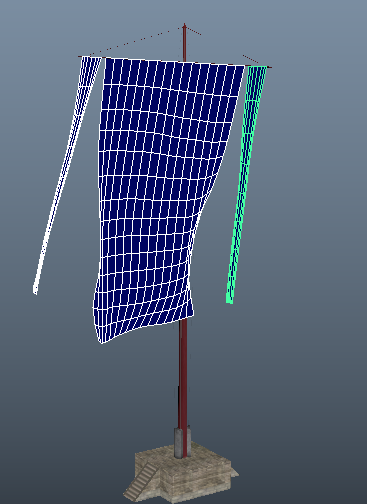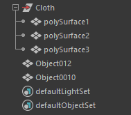
- 如图所示，我们有一个旗帜的模型，我们将需要结算布料的模型复制一份，组名称为Goal并隐藏
- 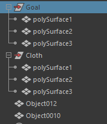
- 我们为Cloth组下的模型分别创建布料
- 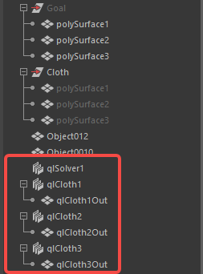
- 我们将布料输出模型分别 Goal约束 Goal组下的模型
- 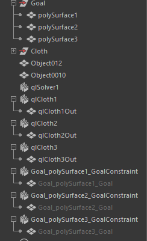
- 并将三个约束节点属性调整为Constraint
- 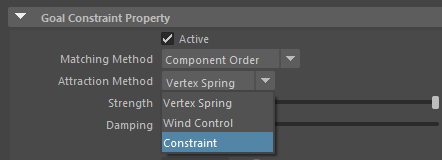
- 然后我们开始进行约束权重绘制，选择约束输出模型（末尾为_Goal），选择菜单中的Paint Attributes--GoalConstraintAttributes--StrengthMap
- 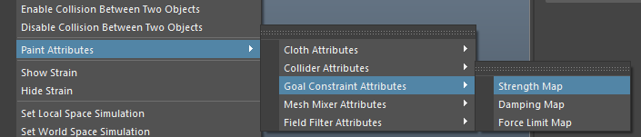
- 权重为1的点（白色）将被约束，权重为0的点（黑色）将结算布料
- 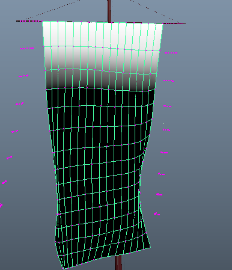
- 打开解算器属性，将FrameSample属性设置为5，提高结算精度
- 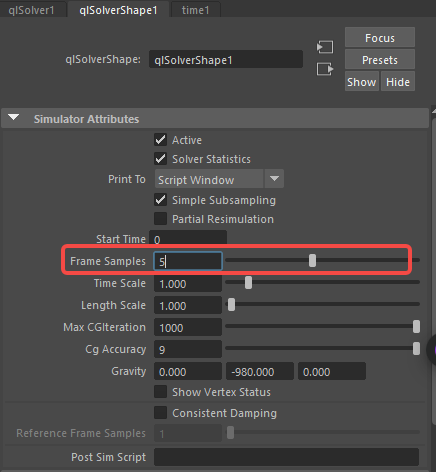
- 选择旗杆和解算器创建碰撞，碰撞节点属性的offset改为0.1
- 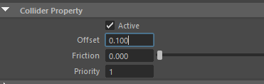
- 调整布料节点属性
- 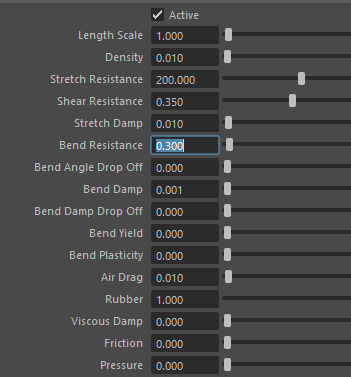