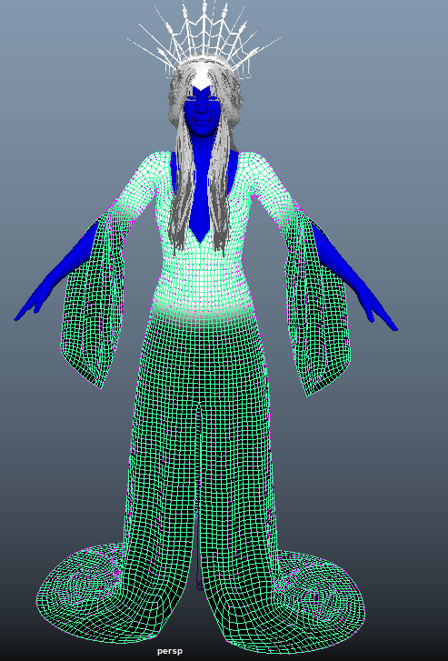
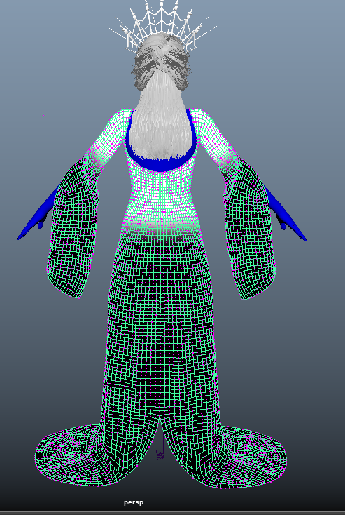
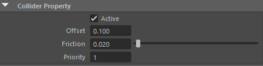
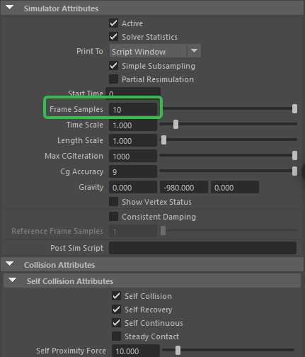
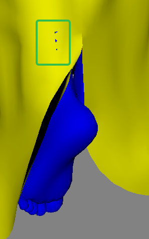
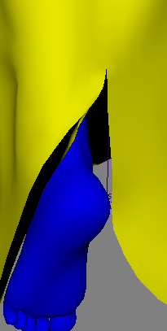

# 模型检查
- 动画文件保证服装与身体不会穿插
- 检查身体肘关节，腋窝，大腿根，膝关节变形后是否有穿插
- 结算角色布料的时候首帧要是绑定姿态，动画要从绑定自态到动画姿态再播放动画
# 结算流程
- 首先复制一份要结算的服装模型，并重命名为cloth_xxx
- 为模型创建布料
- 为布料模型和原模型创建Goal约束，设置权重类型为Constraint并绘制约束权重。
- 
- 选择角色身体模型和解算器节点创建碰撞，地面也同样创建碰撞。参数：
- 
# 布料参数调优
- 调整解算器期参数
- 
# 调整布料穿插
- 在结算过程中我们发现布料出现穿插，可以通过TruncatCatche（截断缓存）来调整布料穿插
- 在第12帧发现穿插
- 
- 直接调整布料顶点位置，修复穿插
- 
- 然后在第12帧，选中布料节点，点击TruncateCache命令，将后面的解算缓存截断并移除，然后点击播放重新解算后面的布料
# 创建缓存并导出缓存