# 前期准备
1. 导出ABC缓存
2. 布料模拟
3. 输出ABC缓存
# 制作流程
- 复制一套简模，重命名（`_sim`）之后来结算布料
- 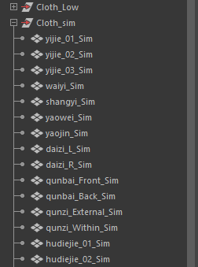
- 先结算裙子，其他模型隐藏
	- 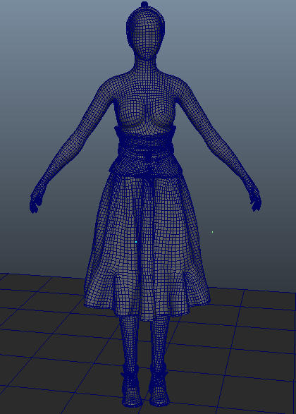
- 选择裙子创建布料，更改布料节点名称
- 
- 选择裙子布料输出模型和身体创建碰撞，调整碰撞厚度为0.1
- 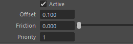
- 选中裙子输出模型最上方顶点和身体模型创建附加约束，约束节点取消勾选使用碰撞
- 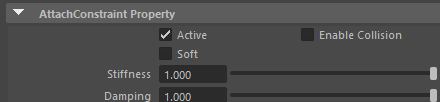
- 设置裙子布料属性
- 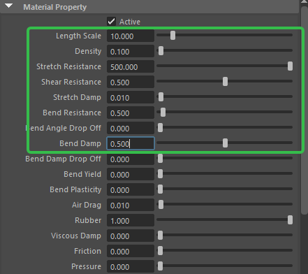
- 缓存属性
- 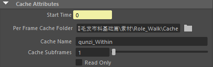
- 然后选中布料输出模型，设置局部空间模拟
- 
- 场景中有一个locator，他记录了角色的位移数据，使用这个locator点约束布料输出模型
- 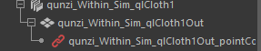
- 然后在解算器中将局部空间模拟的缩放值降低
- 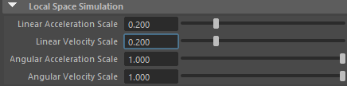
- 属性调优
	- 解算器
	- 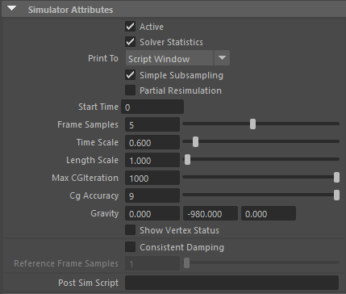
	- 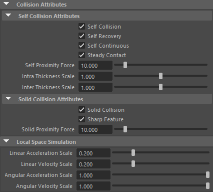
- 布料
	- 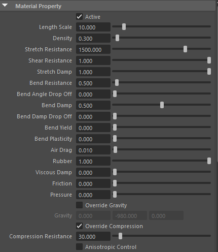
	- 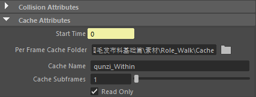
	- 计算完成后记得勾选缓存的只读，防止被误删缓存
	- 