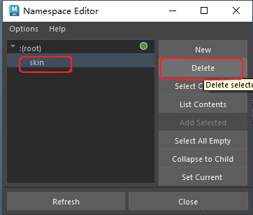
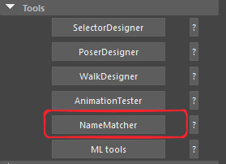
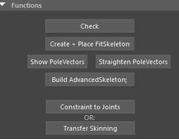
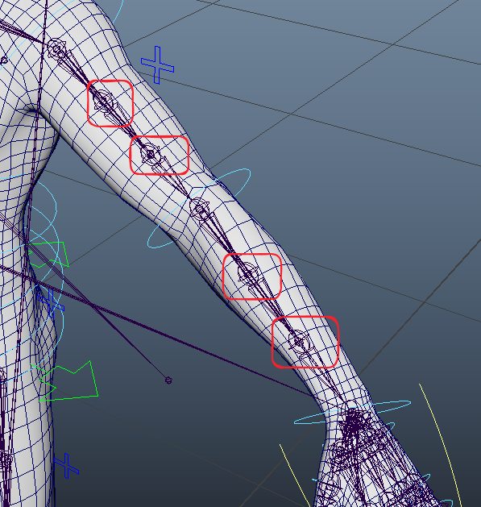

# 骨骼模型导入maya
- 场景设为Y轴向上，然后导入模型

# 移除空间名称
- 会发现我们的骨骼名称可能带有名称空间，要去掉名称空间

- 打开空间名称编辑器

- 删除空间名称

- 在弹出窗口选择合并到根

# 绑定
- 使用advanced skeleton插件的NameMatcher工具进行绑定

- 模板选择Unreal 5

- 点击下面的check按钮，会弹出提示，所有提示一律点击OK。

- 然后点击Create + Place FitSkeleton，插件会生成对位骨骼
- 然后点击BuildAdvancedSkeleton，创建绑定
- 最后点击ConstraintToJoints，绑定到骨骼
# 后续
- 因为插件的原因，手臂和腿的扭转骨骼并没有约束，需要手动实现约束

- 需要用下面一套骨骼的扭曲骨骼父子约束上面一套骨骼的扭曲骨骼

- 腿部也一样，只不过只约束大腿扭曲骨骼就可以了
