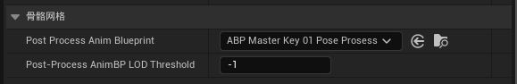
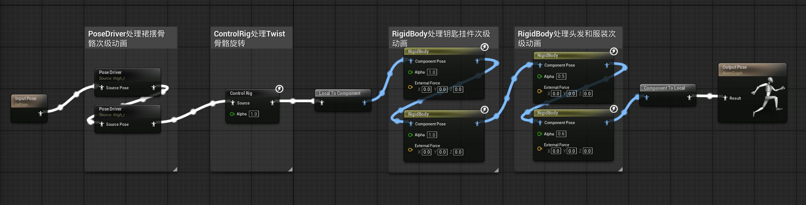
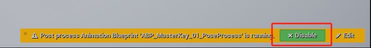
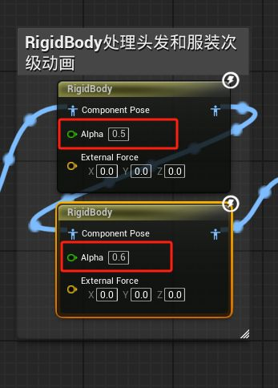

--

# Overview

Thank you very much for giving me the opportunity to complete the Technical Animation Test, and I truly appreciate the time you and your team spent reviewing my work.

After receiving your feedback, I went back to review my test submission. I realized that I had not included a presentation video or an English documentation file — this was my oversight.

I’m concerned that there may have been some misunderstandings, or that certain implementation details were not clearly demonstrated in the submitted files. To better explain my design decisions and the results of the test, I’ve recorded a short video walkthrough highlighting the key features and final outcome.

If possible, I would greatly appreciate it if you could take a moment to review the video. While I understand that a decision has already been made, I hope this supplemental material can offer a clearer view of my capabilities and thought process.

Here is the video file name:  
**Test_Instruction_Video.mp4**

---

# Clarifications

## Issue 1

- For the secondary motion of the test character, I used an ** Post Process Anim Blueprint** applied to the skeletal mesh. This approach might differ from your production workflow, but the logic used in the post process can be easily transferred to the main Animation Blueprint if needed.
    
- The Post Process Animation Blueprint can be found at:  
    `/Game/character/MasterKey/PoseProsess/ABP_MasterKey_01_PoseProsess`
    

 
 - Another point I’d like to clarify is that once the ** Post Process Anim Blueprint** is enabled on a Skeletal Mesh, its pose may appear different from the skinned bind pose. This is **not caused by skinning errors**.
- The discrepancy occurs because the Skeletal Mesh begins simulating the Post Process Animation Blueprint, within which the **physics asset** starts to take effect. As a result, the mesh is influenced by real-time physics.
- To accurately inspect the bind pose or skinning result, the Animation Post Process needs to be **disabled temporarily**.

---

## Issue 2

- In the same  Post Process Anim Blueprint, I used a **RigidBody** node to drive the secondary motion of the clothing using the physics asset. In order to reduce the intensity of the simulation, I adjusted the **Alpha** value of the node.
    
- This might have made the cloth simulation appear too subtle when the character is being manipulated, and thus harder to notice.
    
- However, this does not affect the animation’s effectiveness. In our usual workflow, we often use this method. That said, if this approach is not acceptable, I can alternatively adjust the **angular limits of the constraint** and the **angular damping** of the physics Asset to achieve similar results.

## Issue 3

- I acknowledge that there are still some issues with the skinning and the details of the secondary animation. There is definitely room for improvement, and I believe I can do better.
    

---

# Final Note

Thank you once again for your time and consideration throughout the process. I remain highly interested in opportunities at Epic Games, and would sincerely appreciate any feedback you may have.

---
