# rigging of Master Key
## feedback
- 眉毛模型Eyebrows_LOD0和眼睛模型Eyes_LOD0并未按照要求将模型冻结变换，其旋转属性仍有数值
- 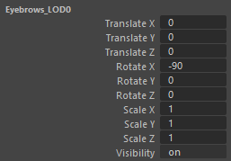   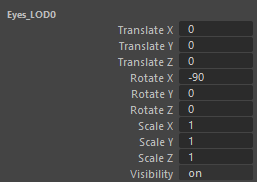 
- 因此导致其局部旋转轴也是错误的并非跟世界坐标一致
- 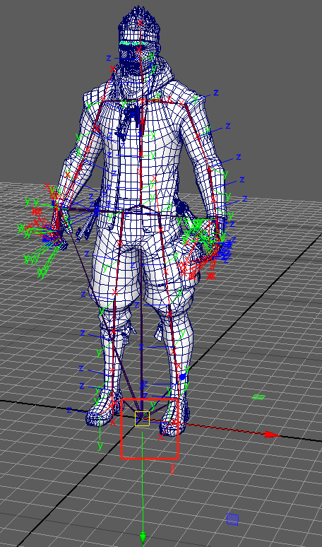
- 身体模型在关节转折处有过多的星状点和三角面，可能会影响变形效果
- 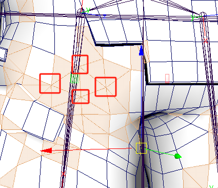
- 提供的base_skeletono.fbx参考骨骼，对位基本是正确的，大腿关节thigh位置稍微偏上，但是在可以接受的范围内。但是根据大腿小腿和脚部骨骼向量计算出来的极向量位置偏向外侧，需要轻微向内调整膝盖关节位置。
- 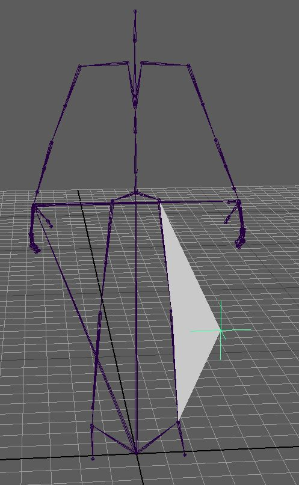
- 计算极向量脚本
```python
import pymel.core as pm


def get_pole_vector_position(jnt1, jnt2, jnt3, pv_ctrl, ctrl_length_scale=1.0):
    """
    利用向量来计算极向量约束控制器的位置
    Args:
        jnt1 (nt.Joint): 第一节骨骼名称
        jnt2 (nt.Joint): 第二节骨骼名称
        jnt3 (nt.Joint): 第三节骨骼名称
        pv_ctrl (nt.Transform): 极向量控制器名称
        ctrl_length_scale (float): 极向量控制器和骨骼距离的缩放值

    Returns: Vector

    """
    # 获取参数，并转换为Pymel对象
    jnt1_vec = jnt1.getTranslation(ws=True)
    jnt2_vec = jnt2.getTranslation(ws=True)
    jnt3_vec = jnt3.getTranslation(ws=True)
    # 获取胯骨指向脚的向量
    leg_foot_vec = jnt3_vec - jnt1_vec
    # 获取胯骨指向膝盖的向量的向量
    leg_knee_vec = jnt2_vec - jnt1_vec
    # 将胯膝向量向腿脚向量投影，获得该投影位置
    knee_projection_vec = leg_knee_vec.projectionOnto(leg_foot_vec)
    # 将投影向量移动到腿上，之前向量起点为原点
    mid_position = jnt1_vec + knee_projection_vec
    # 获得投影点指向膝盖点的向量，再乘以一个缩放系数，得到极向量，再将极向量移动到膝盖点
    ctrl_position = jnt2_vec + (jnt2_vec - mid_position) * ctrl_length_scale
    # 设置控制器位置
    pv_ctrl.setTranslation(ctrl_position)
    return ctrl_position


if __name__ == '__main__':
    """依次选择三个骨骼对象和一个控制器对象，然后执行脚本，
    控制器就被摆放在正确的位置上,通过ctrl_length_scale数值来调整控制器和骨骼距离。
    """
    jnt_1, jnt_2, jnt_3, ctrl_pv = pm.selected()
    get_pole_vector_position(jnt_1, jnt_2, jnt_3, ctrl_pv, 15)
```
- 提供的base_skeletono.fbx参考骨骼，ik_foot_l和ik_foot_r上仍有动画帧未清理
- 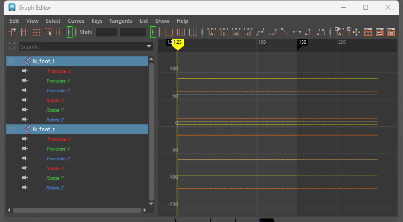
## workflow
### 概述
- 根据测试需求的描述，Master Key模型可以使用熟悉的工具进行绑定，主要考察关节放置和变形效果。为了节省时间，不再采用手工绑定的模式。
- 我熟悉的绑定工具有mGear绑定框架和Advanced Skeleton绑定插件。而mGear绑定框架绑定的模型必须在安装该框架的maya环境中才能使用，所以这里使用Advanced Skeleton绑定插件进行绑定。
- maya软件版本为2024.2，轴向为Y轴向上，单位为厘米。Advanced Skeleton绑定插件版本为Advanced Skeleton-6.574。蒙皮工具为ngSkinTools-2.4.0。
### 添加次级动画骨骼
- 添加次级动画骨骼并调整骨骼朝向
- 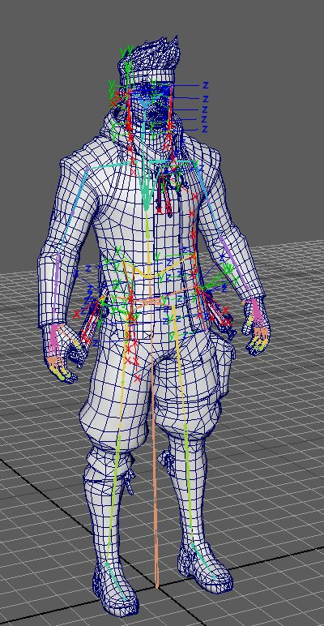
### 蒙皮
- 采用ngSkinTools进行蒙皮
- 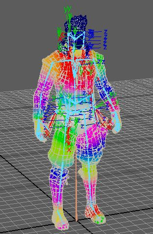
### 进行绑定
- 使用Advanced Skeleton绑定插件进行绑定，可以使用其NameMatcher工具生成绑定。
- 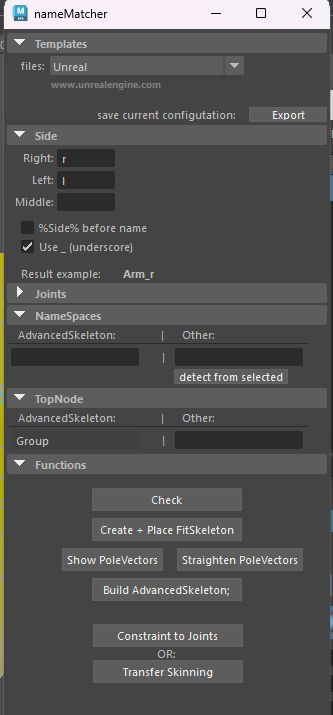
### 导入引擎
- 将模型导入引擎
- 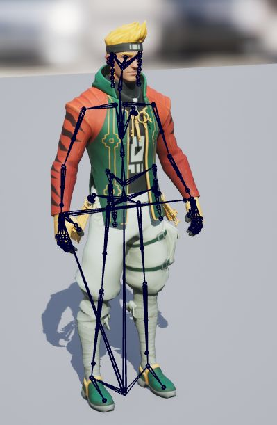
- 设置骨骼平移重定向选项
- 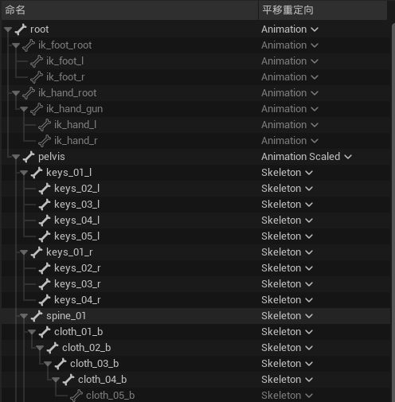
- 设置角色主物理资产
- 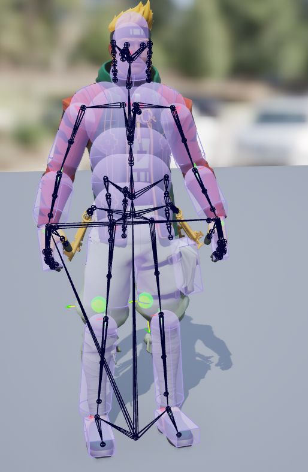
### 处理次级动画
- 处理次级动画在这里使用SkeletalMesh动画后处理的方式来实现
- 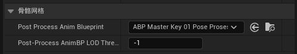
- 添加ControlRig来处理扭曲（Twist）骨骼的旋转
- 
- 使用代理布料来处理服装的飘动效果
- 
- 使用RigidBody节点和物理资产来处理钥匙挂件和头发的次级运动
- 

# rigging of Minigun
## feedback
## workflow
# Simulate Physics In-Engine
## workflow