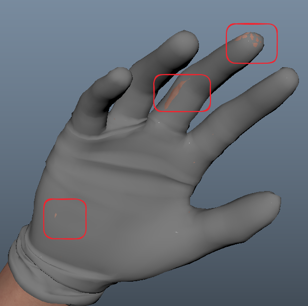

# 制作环境
- 本测试使用软件为： maya 2024.2
- 使用插件有：
	- ngSkinTools（用于蒙皮）
	- MetaHumanForMaya（PoseEditor用于RBF结算）
	- 自定义脚本 ConnectTwistSwing（用于骨骼扭转和摆动计算）
# 模型问题
- 手套模型与手掌模型存在穿插，且手套模型关节位置拓扑与手掌模型差别较大，因此单靠调整权重难以规避穿插，需要调整顶点位置。
- 想要手套与手掌完美贴合需要手套关键部位的布线与手掌一致。通过复制权重的方法使其完美贴合。
