# 快捷键
- 这里的快捷键基于maya模式
- 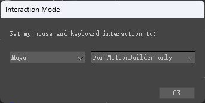
- TRS分别对应位移旋转和缩放
- F5和F6对应局部旋转和世界选转
- 空格+鼠标右键点击骨骼=选择骨骼链
- K键打帧
- X+LMB + 视图内拖拽菜单：用于实现两个对象父子关系或对齐（MB模式快捷键为Alt+LMB)。先选中要操作的对象，然后执行X+LMB + 视图内拖拽菜单，拖拽最终指向驱动对象，弹出菜单。此操作在示意图中也可以使用。
- 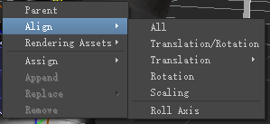

- Ctrl+W：示意图
- Ctrl +E：透视图
- Ctrl+F：前视图，再次执行为后视图
- Ctrl+R：右视图，再次执行为左视图
- Ctrl+T：顶视图，再次执行为底视图
- Ctrl+2、3、4：多视图显示
- Alt+Z：摄影机撤销
- Alt+Y：摄影机重做

- 故事板模式操作：点右键Insert-Character Animation Track,选择角色，点右键Insert Current Take.两个片段整合过度，点眼睛，然后点match,并选择match部位。片段修改完成后，Plot Whole Scene To Current Take.

# 界面
## Property
- 在界面中经常会看到K或者A的图标，这里的“K”表示Kayable，"A"表示Animatable，可以设置是否开启。
- 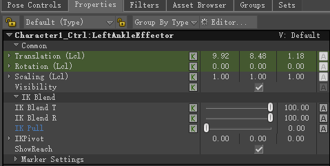

- 点击Editor 可以进行属性自定义
- 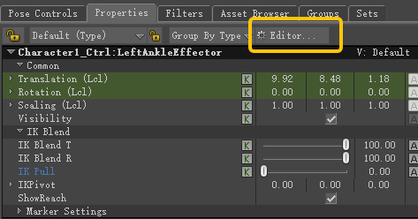
- 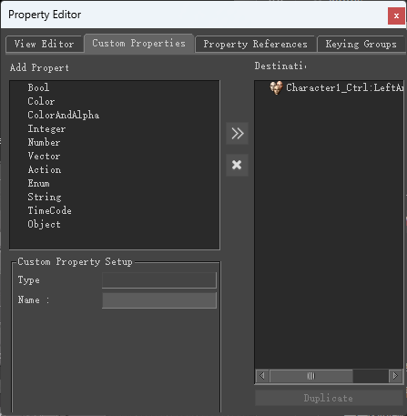
## Groups
- motionbuilder中的groups相当于maya软件中的sets(集合)
- 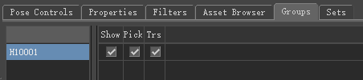
	- Show：为对象显示
	- Pick：为对象选择
	- Trs：为对象变换
## Scripts
- 编写的python脚本可以放入路径：
`C:\Program Files\Autodesk\MotionBuilder 2019\bin\config\Scripts\ActionScript`
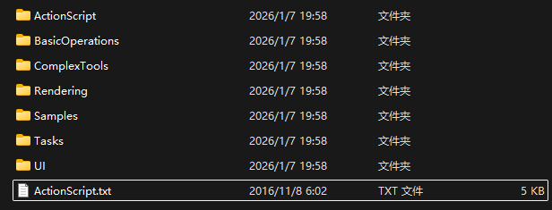
- 然后在`C:\Program Files\Autodesk\MotionBuilder 2019\bin\config\Scripts\ActionScript.txt`文档中添加
- 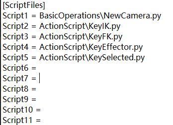
- 可以在`C:\Program Files\Autodesk\MotionBuilder 2019\bin\config\Keyboard\MotionBuilder.txt`中设置快捷键执行
- 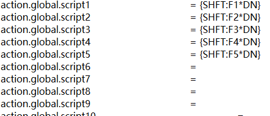
# 操作
- MB的选转有两个选项
- 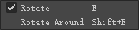
- RotateAround需要选择两个对象，使对象A绕着对象B为轴进行旋转。
- SnapRotation
- 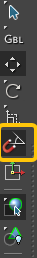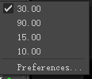
# 摄像机
## 创建摄像机
- 可以在Navigator中创建
- 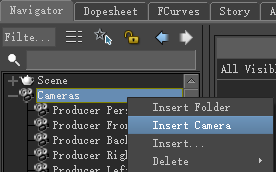
- 也可以在AssetBrowser中拖入
- 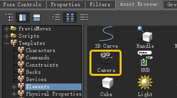
## 进入摄像机视图
- 选中摄像机，Ctrl+E，即可进入该摄像机视图
# 约束
## 基础用法
- 可以在Navigator中创建约束节点
- 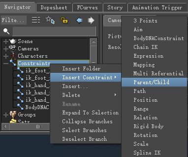
- 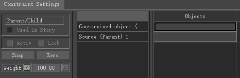
- 然后载入驱动对象和被驱动对象，在视口中和示意图中选中对象，X+LMB拖动对象载入，激活并锁定（无法修改偏移）。可以选择吸附和归零（偏移归零）操作。
- 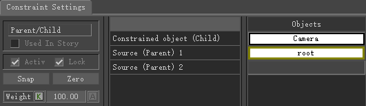
- 约束属性
- 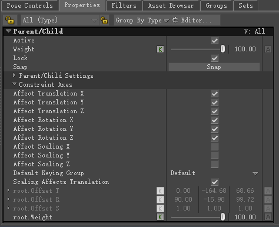
# 属性
## 添加属性
- 选中要添加属性的对象，点击Property中的Editor
- 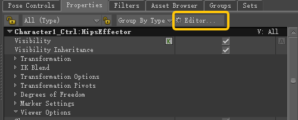
- 在propertyEditor中选择CustomProperties选项，为其添加属性
- 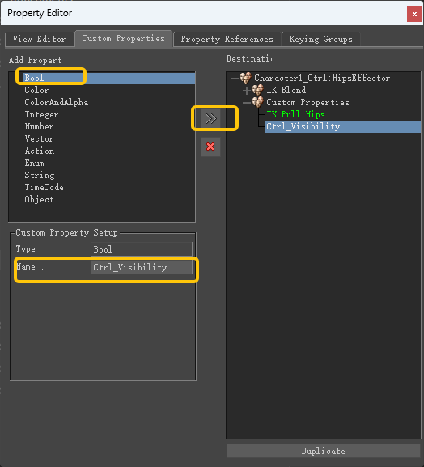
- 在属性栏中，将其设为Animatable，这样便可以链接该属性
- 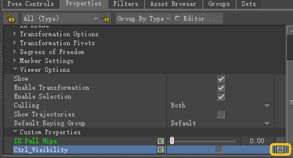
- 创建RelationConstraint，用来连接属性
- 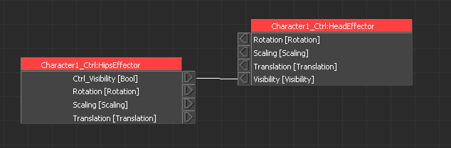
## 传递属性
- 选中要传递属性的控制器们，然后打开PropertyEditor，进入PropertyEditor选项卡
- 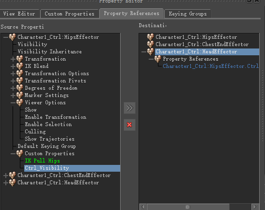
- 可以将选中对象的任一控制器的属性传递给其他控制器