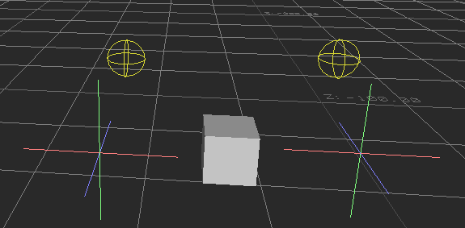
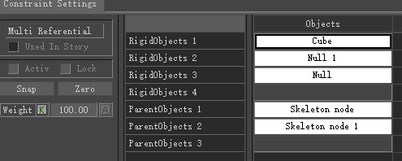
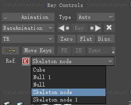
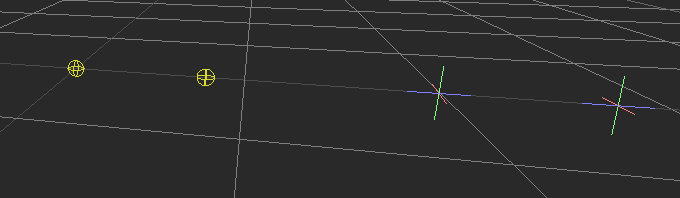
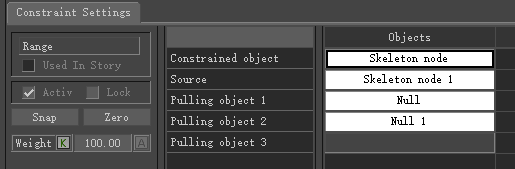
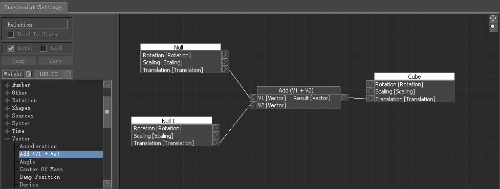

## 节点分类
### 1. Parent/Child（父子约束）

- 类似“临时建立父子关系”
- 子物体会跟随父物体的位移和旋转
---

### 2. Position Constraint（位置约束）

- 只影响位置，不影响旋转
- 可设置多个源对象（Source）进行混合
---

### 3. Rotation Constraint（旋转约束）

- 只影响旋转
- 可用于控制朝向（比如头看向目标）
---
### 4. Aim Constraint（朝向约束）

- 让一个物体始终“看向”目标
- 可以设置：
    - Aim Axis（朝向轴）
    - Up Vector（防止翻转）
### 5. Path Constraint（路径约束）

- 让物体沿着曲线运动
- 可通过百分比控制位置
### 6. Expression Constraint（表达式约束）

- 用数学公式驱动属性
- 类似简单节点/脚本系统
### 8. 3Points Constraint（3点约束）

**3 Points Constraint（三点约束）** 是一个用来根据三个参考点来确定一个物体位置和朝向的约束工具。它常用于绑定道具、角色附着、或通过多个点来稳定控制一个对象的空间关系。

#### 📌 核心逻辑

三点约束是一种旋转约束，其中利用三个物体的位置来约束另一个物体的旋转。
- Origin
- Target
- Up

三个点在空间中可以唯一确定一个平面：

- 点 A → 定义主位置（通常作为基准）
- 点 B → 定义一个方向（比如前向）
- 点 C → 与 A、B 一起定义一个平面，从而确定“上方向”

通过这三个点，可以计算出：

- 位置（通常跟随某个点或三点的平均）
- 旋转（由向量关系决定）

---
#### 📌工作方式（简化理解）

假设三个点为 A、B、C：

- 向量1：B - A
- 向量2：C - A

通过叉积得到法线：

N=(B−A)×(C−A)N=(B−A)×(C−A)

然后构建一个局部坐标系：

- X轴：B - A
- Y轴：法线 N
- Z轴：X × Y

这个坐标系就用来驱动被约束对象的旋转。

---
#### 📌 常见用途

1. **道具绑定**
    
    - 比如把一个物体（如盾牌）稳定地绑定在角色身体某个区域
    - 三点比单点或双点更稳定，不容易翻转
2. **头部/胸腔稳定**
    
    - 用三个marker确定一个刚性区域的方向
3. **动作捕捉（MoCap）**
    
    - 从三个marker重建一个“虚拟骨骼”或参考节点
4. **避免翻转（Flip）问题**
    
    - 两点只能确定一条线，会缺少“扭转信息”
    - 三点提供完整的朝向（类似一个局部坐标系）

---

### 9. Multi Referential Constraint（多参考约束）

**Multi Referential Constraint（多参照约束）** 在 MotionBuilder 里本质上是一个“**可切换父级的约束**”。它允许一个对象在多个参考对象之间**无缝切换跟随关系**，而不会产生跳动（pop）。
#### 核心概念

普通 Parent/Position 约束通常只有一个参考对象，而 Multi Referential Constraint 支持：

- 多个 Reference（参考目标）
- 动态切换当前跟随的对象
- 切换时保持当前世界空间位置（不跳）
#### 应用
- 在场景中创建两个骨骼，用于模拟左右手
- 创建一个盒体模拟枪，两个虚拟体模拟枪口和枪托

- 创建Multi Referential Constraint约束，将骨骼设置为ParentObject，将盒体和虚拟体设置为RigidObject

- 在使用的时候可以在KeyCtrls面板选择父对象和切换父对象

- 而盒体和两个虚拟体都可以控制枪支，作为Pivot使用，非常牛逼。

---

### 10. Chain IK Constraint（链式IK约束）

#### 📌 功能

- 给一条骨骼链创建 IK 行为
- 类似 Maya 的 IK Handle

---

#### 📌 用途

- 手臂 / 腿 IK
- 快速搭建控制系统

---

### 11. Single Chain IK Constraint

- 更简单版本的 IK
- 控制单一链条
- 适合基础 rig 或 mocap 修正

---

### 13. Range Constraint（范围约束）

#### 📌 功能

MotionBuilder 中的 Range Constraint（范围约束） 是一种特殊的约束类型，主要用于限制物体的移动范围，通过一个或多个“拉动对象”（Pulling Object）来影响被约束对象（Constrained Object），防止它超出指定的距离范围。

- 例如创建一个骨骼和两个定位器

- 添加RangeConstraint节点，约束对象为左起第二个骨骼，源对象为左起第一个骨骼，两个定位器为拉动对象
- 
- 两个定位器的拉动，向右可以无限远，但是向左无法超过第一个骨骼。
---

### 14. Mapping Constraint

#### 概述

**Mapping Constraint（映射约束）** 是 MotionBuilder 中一种强大的约束类型，用于将一个角色或对象的动画数据**映射**到另一个角色或对象上，实现动作的重定向（Retargeting）和数据传递。

---

#### 核心概念

Mapping Constraint 本质上建立了一种**源（Source）→ 目标（Destination）**的映射关系，允许你定义：

- 哪些骨骼/节点对应哪些骨骼/节点
- 数据如何从源传递到目标
- 传递过程中的权重和偏移

---

#### 主要用途

#### 1. 角色动作重定向

将一个角色的动画应用到骨骼结构不同的另一个角色上，是最常见的使用场景。

#### 2. 不同骨骼层级之间的数据传递

当源角色和目标角色的骨骼命名、数量、比例不一致时，通过 Mapping 建立对应关系。

#### 3. 辅助骨骼驱动

用主骨骼的动画数据驱动辅助骨骼或控制器。

#### 四个核心参数

##### 1. ConstraintObject（约束对象）

**目标对象** —— 即被驱动、接受约束结果的对象。

- 这是约束的**接收端**
- 它的变换（位移/旋转/缩放）将被约束所控制
- 通常是你想要"被驱动"的骨骼或节点

---

##### 2. Reference（参考对象）

**目标参考空间** —— 为 ConstraintObject 提供**局部坐标参考系**。

- 定义 ConstraintObject 的运动是在**哪个空间**下被计算的
- 类似于"目标对象的父空间参照"
- 如果为空，通常默认使用世界空间
- 例如：当你希望目标骨骼的运动相对于某个父骨骼来解算时，就将该父骨骼设为 Reference

---

##### 3. SourceObject（源对象）

**源对象** —— 提供动画数据的对象，即**驱动端**。

- 约束从这里**读取**变换信息
- 对应 ConstraintObject 的数据来源
- 通常是动画已经做好的骨骼或控制器

---

##### 4. SourceReference（源参考对象）

**源参考空间** —— 为 SourceObject 提供**局部坐标参考系**。

- 定义读取 SourceObject 数据时所在的**坐标空间**
- 是 SourceObject 的"父空间参照"
- 与 Reference 对应，只不过作用在源这一侧
---

### 15. Relation Constraint

MotionBuilder 中的 Relation Constraint（关系约束） 是最强大、最灵活的约束类型之一。它不像 Position、Parent/Child 等固定约束那样，只能做简单跟随，而是允许你通过节点图（Relations Pane）自定义任意数学/逻辑关系，实现复杂的驱动逻辑。
#### 核心特点

- **节点式图形编程**：类似 Maya 的 Set Driven Key 或简单的表达式编辑器，但更直观、可视化。
- 由三类元素组成：
    - **Sender（发送者）**：提供输入数据的对象（骨骼、属性、自定义参数等）。
    - **Operator（运算符）**：数学、逻辑、转换等运算节点（加减乘除、插值、曲线映射、条件判断等）。
    - **Receiver（接收者）**：接收计算结果并应用到目标对象（通常是物体的位置、旋转、缩放、可见性、自定义属性等）。
- 可以实现**一对一、一对多、多对一**的复杂驱动关系。
- 支持**实时计算**，常用于 rigging、Set Driven Key、Faux Physics（假物理）、空间切换、IK/FK 混合等。

#### 常用 Operators（运算符）分类

- **Arithmetic**：Add、Subtract、Multiply、Divide、Clamp 等。
- **Vector**：Vector Add、Dot Product、Normalize 等。
- **Function**：Sin、Cos、Power、FCurve（曲线映射，非常强大！）。
- **Boolean / Logic**：If、Greater Than、And、Or 等。
- **Converter**：Rotation to Direction、Position to Rotation 等。
- **Special**：Time、System（当前帧、播放状态）、Dampening（阻尼）、Delay 等。