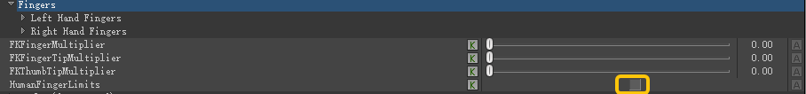
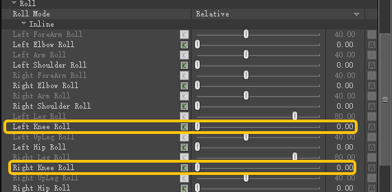

# 设置Tpose
- 设置Tpose时，F6将旋转设为世界旋转,然后将肩膀上臂、前臂、大腿、小腿，手腕和手指的旋转值设置为整数（90、-90、180、-180），使其成为Tpose。大拇指根据情况自定义，使其并拢手掌并伸直。脚掌复制之前的旋转即可
# 角色设置
- 导航器中选中角色，进入character setting
	- fingers：取消勾选HUmanFingerLimits
	- 
	- Roll：将Left/Right Knee Roll设置为0，否则脚掌左右旋转会影响到膝盖的左右旋转
	- 
	- 