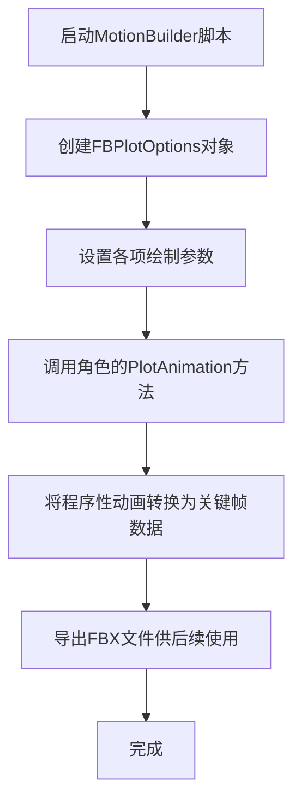
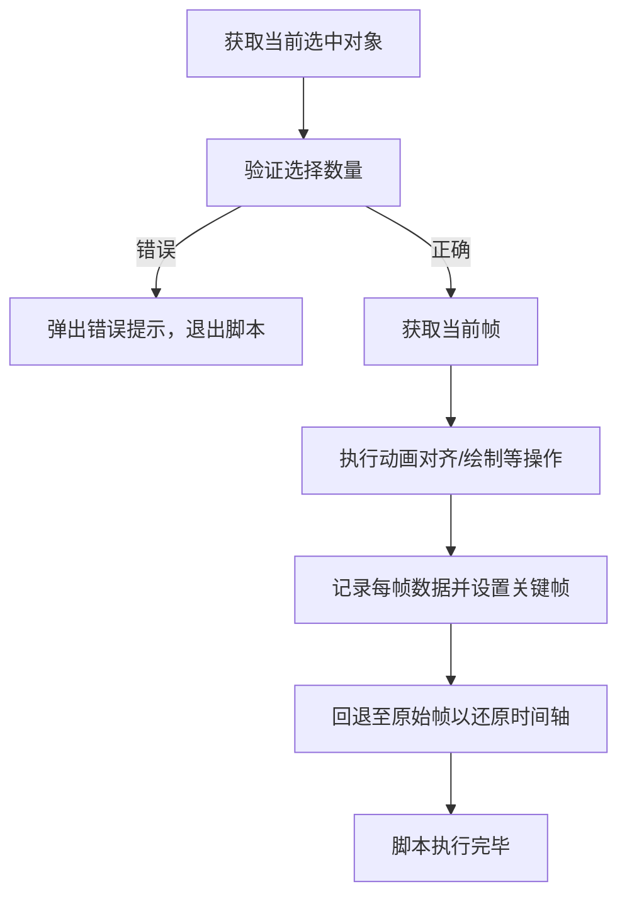

## 目录

1. 引言
2. MotionBuilder 2019中的Python API概述
3. 常用功能实践  
     3.1 动画绘制与关键帧操作  
     3.2 对象选择与节点操作  
     3.3 帧控制与时间管理  
     3.4 动画对齐与实时关键帧设置  
     3.5 批处理与自动化脚本  
     3.6 用户界面创建与工具开发
4. MotionBuilder与其他DCC软件功能对比
5. 编程中的注意事项与最佳实践
6. 结论

---

## 1. 引言

MotionBuilder 2019是一款专为动作捕捉制作和实时角色动画而设计的专业工具，其独特的节点约束驱动系统、实时数据处理能力以及与Autodesk生态系统和各类动作捕捉设备的紧密集成，使其成为游戏、电影以及虚拟制作领域的核心软件之一。近年来，随着动画数据量和多任务处理要求的不断提升，利用Python API对MotionBuilder进行功能扩展和自动化处理已成为工作流程的重要组成部分。本文主要围绕MotionBuilder 2019中的Python API进行深入探讨，重点介绍其常用功能实践，包括动画数据处理、角色控制、关键帧绘制以及场景节点管理。同时，文章还详细总结了在编程过程中常见的注意事项及最佳实践，以期为开发者提供一份全面的技术参考和实践指南。

---

## 2. MotionBuilder 2019中的Python API概述

MotionBuilder 2019为开发人员提供了一个功能强大的Python开发环境，其SDK（软件开发工具包）能够访问软件的内部对象模型和场景结构，支持动画数据的批量处理、角色映射、关键帧操作以及自定义工具窗口的构建。利用pyfbsdk库，开发者可以轻松调用诸如FBPlotOptions、FBSystem、FBPlayerControl等类来实现具体功能。例如，利用Python API，用户能够将动作捕捉数据与角色控制装置关联，并通过“绘制”过程将IK驱动的动画转换为传统的关键帧数据，进而导出为FBX文件，用于其他三维软件或游戏引擎中。此外，Python脚本还可以用于批处理大规模场景数据、进行复杂运算以及实现各种自定义动画效果，是实现流程自动化的重要手段。

---

## 3. 常用功能实践

### 3.1 动画绘制与关键帧操作

动画绘制（Plot Animation）是将MotionBuilder内部程序驱动的动画转换为显式关键帧数据的过程，这一过程是制作可导出动画数据的关键步骤。在MotionBuilder中，通过FBPlotOptions类可以精准配置绘制选项。常见的参数包括是否使用常量关键帧缩减（ConstantKeyReducer）、是否对所有镜头进行绘制（PlotAllTakes）以及绘制帧的时间间隔（PlotPeriod）。以下是一个典型的动画绘制示例代码片段，并配有详细注释说明各参数的作用：

```python
from pyfbsdk import *  
# 获取当前选择的角色  
lCharacter = FBApplication().CurrentCharacter  
# 定义绘制选项  
PlotCtrlRigTakeOptions = FBPlotOptions()  
PlotCtrlRigTakeOptions.ConstantKeyReducerKeepOneKey = False   # 是否保留一个关键帧  
PlotCtrlRigTakeOptions.PlotAllTakes = False                   # 是否对所有Take进行绘制  
PlotCtrlRigTakeOptions.PlotOnFrame = True                     # 是否在每帧绘制  
PlotCtrlRigTakeOptions.PlotPeriod = FBTime(0, 0, 0, 1)          # 绘制间隔设置为1帧  
PlotCtrlRigTakeOptions.PlotTranslationOnRootOnly = False      # 绘制是否只针对根节点  
PlotCtrlRigTakeOptions.PreciseTimeDiscontinuities = False     # 是否重建精确时间不连续性  
PlotCtrlRigTakeOptions.RotationFilterToApply = FBRotationFilter.kFBRotationFilterUnroll   # 旋转过滤器设置  
PlotCtrlRigTakeOptions.UseConstantKeyReducer = False          # 是否使用常量关键帧缩减  

# 调用角色对象的绘制方法，将当前动画绘制到控制装置上  
lCharacter.PlotAnimation(FBCharacterPlotWhere.kFBCharacterPlotOnControlRig, PlotCtrlRigTakeOptions)  
```

上述代码展示了如何通过设置FBPlotOptions对象各参数，进而调用角色的PlotAnimation方法进行动画数据的绘制。由于关键帧绘制是确保动画数据在导出前转换为稳定关键帧的重要手段，因此必须在导出FBX文件之前完成该过程，以保证动画在其他软件中显示正确。

### 3.2 对象选择与节点操作

在MotionBuilder中，场景通常由多个节点（例如角色、摄像机、模型等）构成。通过Python API，开发者可以轻松地获取当前选中的模型、按长名称检索指定对象等操作。常用函数包括：

- **FBGetSelectedModels**：用于获取当前选中的模型列表。实际应用中，开发者常将该函数与自定义封装的GetSelModels函数结合，确保用户正确选择对象。
- **FBFindModelByLabelName**：用于根据对象的长名称（LongName）来检索特定模型，这在需要精确定位并操作特定节点时非常有用。

下面给出一个示例代码，展示如何获取并判断当前是否只选择了一个对象：

```python
def GetSelModels():  
    lSelModels = []  
    modelList = FBModelList()  
    FBGetSelectedModels(modelList, None, True)  
    for model in modelList:  
        if model.Selected == True:  
            lSelModels.append(model)  
    if len(lSelModels) != 1:  
        FBMessageBox("对象选择错误", "请只选中一个对象", "确定")  
        return None  
    else:  
        return lSelModels  
```

该方法确保用户在调用操作前仅选择一个对象，避免程序由于多选或无选导致错误，从而提高脚本的鲁棒性与用户体验。

### 3.3 帧控制与时间管理

动画制作中，精确控制时间和帧非常关键。MotionBuilder的Python API中提供了直接获取当前帧和跳转到指定帧的方法，其核心函数包括：

- **FBSystem().LocalTime.GetFrame()**：该函数返回当前时间滑块所在的帧数，方便开发者进行时间计算和帧同步操作。
- **FBPlayerControl().Goto()**：该函数可将时间滑块定位到指定帧，以便在脚本运行过程中快速切换时间段。

示例代码如下：

```python
def GetCurrentFrame():  
    return FBSystem().LocalTime.GetFrame()  

def GotoFrame(frame):  
    t = FBTime(0, 0, 0, frame, 0)  
    FBPlayerControl().Goto(t)  
```

此组合函数在动画对齐、渐变操作及批量关键帧设置中起到重要作用，能够让开发者在时间轴上精确控制动画效果。

### 3.4 动画对齐与实时关键帧设置

在动画制作中，常需要将一个对象在某段时间内跟随另一个对象的运动，这通常称为动画对齐（Animated Alignment）。在MotionBuilder中，通过FBVector3d类可以获取或设置对象的三维位移和旋转信息，其典型操作包括：

- 使用`FBVector3d()`创建向量实例，存储对象的平移（Translation）和旋转（Rotation）数据
- 利用对象的`GetVector`方法传入相应参数获取数据
- 在指定的帧内依次设置目标对象的平移及旋转，并使用`Key()`方法记录关键帧

下面是一段实现动画对齐的示例代码：

```python
def AnimatedAlign(obj, source, start, end):  
    orgFrame = GetCurrentFrame()  # 保存原始帧  
    GotoFrame(start)  
    for t in range(start, end + 1):  
        # 获取当前帧数据  
        sourceTrans = FBVector3d()  
        sourceRot = FBVector3d()  
        source.GetVector(sourceTrans, FBModelTransformationMatrix.kModelTranslation, False)  
        source.GetVector(sourceRot, FBModelTransformationMatrix.kModelRotation, False)  
        
        # 将目标对象的位置和旋转设置为源对象一致，并记录关键帧  
        obj.Translation = sourceTrans  
        obj.Translation.Key()  
        obj.Rotation = sourceRot  
        obj.Rotation.Key()  
        
        # 跳转下一帧  
        GotoFrame(t + 1)  
    
    # 恢复原始帧，提升用户体验  
    GotoFrame(orgFrame)  
```

这段代码展示了如何在指定帧范围内逐帧对齐两个对象，实现平滑而连续的动画过渡。通过这种方法，动画师可以在保持数据精度的同时实现高效的动画制作和调整。

### 3.5 批处理与自动化脚本

对于处理大量动作捕捉数据或场景节点，批处理和自动化脚本尤为重要。MotionBuilder的Python API允许开发者遍历场景中所有Take、自动清洗数据、提取根运动以及进行动画循环提取等操作。正如MoCap Online中提到的，批量处理不仅可以大大提高效率，还能统一动作数据的格式和质量。

例如，在批处理操作中，开发者可以通过遍历`FBSystem().Scene.Takes`列表，对所有选择的Take执行统一的操作：

```python
for take in FBSystem().Scene.Takes:  
    if take.Selected == True:  
        print(take.Name)  
```

这样的代码段便于用户判断和筛选场景中符合条件的Take，并可结合其他自动化操作对数据进行降噪、去除冗余关键帧等处理。利用Python API，开发者还可以调用MotionBuilder内置的过滤器（如Butterworth降噪、Resample重采样、Constant Key Reducer关键帧缩减）进行数据清理，进一步提升动画数据的质量。

### 3.6 用户界面创建与工具开发

在MotionBuilder中，开发者不仅能编写功能性脚本，还可以构建自定义工具窗口以提供图形化用户交互界面（GUI）。例如，利用`FBCreateUniqueTool`方法可以创建一个独立的工具窗口，并通过添加按钮、编辑框、标签等控件，实现自定义动画绘制、对象对齐等功能。

以下是一个基于Python构建的工具窗口的代码片段，展示了如何创建UI并添加各类控件：

```python
import pyfbsdk as fb  
import pyfbsdk_additions as fbaf  

def PopulateTool(t):  
    # 添加目标对象标签和编辑框  
    x = fb.FBAddRegionParam(25, fb.FBAttachType.kFBAttachNone, "")  
    y = fb.FBAddRegionParam(15, fb.FBAttachType.kFBAttachNone, "")  
    w = fb.FBAddRegionParam(270, fb.FBAttachType.kFBAttachNone, "")  
    h = fb.FBAddRegionParam(20, fb.FBAttachType.kFBAttachNone, "")  
    t.AddRegion("lTarget", "lTarget", x, y, w, h)  
    
    # 设置控件属性（以下内容省略具体细节）  
    # 可根据需要添加更多按钮、输入框和标签  

def CreateTool():  
    t = fbaf.FBCreateUniqueTool("Animated Align Tool v1.0")  
    t.StartSizeX = 400  
    t.StartSizeY = 420  
    PopulateTool(t)  
    fb.ShowTool(t)  

CreateTool()  
```

通过上述代码，开发者不仅可以快速构建自定义工具，还可以将业务逻辑与用户交互完美结合，在MotionBuilder的工作流程中实现更高效的操作。此类UI工具常用于快速调用动画对齐、批处理操作以及自动化数据清理等功能，使得动画制作流程更加便捷和直观。

---

## 4. MotionBuilder与其他DCC软件功能对比

MotionBuilder在大规模动作捕捉数据处理和实时动画绘制方面具有明显优势，但在复杂角色造型、渲染及精细调整方面往往需要与其他DCC软件（如Maya）配合。下表比较了MotionBuilder与Maya在动画处理中的若干关键方面：

|功能模块|MotionBuilder|Maya|
|---|---|---|
|实时捕捉与流媒体|原生实时捕捉，具备高效批处理与自动化脚本能力|需要插件支持，实时性稍差|
|动作重定向|高效的角色映射与约束驱动系统，可批量处理大量Take|通过图形界面精细调整，但处理大量数据较为繁琐|
|数据清洗与降噪|内置多种数据滤波器及FCurve编辑器，使用Python自动化处理|精细化编辑能力更强，但耗时较多|
|用户界面和工具开发|支持自定义工具窗口和Python脚本编程，便于流程自动化|MEL与Python结合，UI自定义能力较强|
|结果导出|需通过“绘制”过程将动画烘焙为关键帧，导出FBX文件|直接支持高级渲染和动画输出，适合最终动画制作流程|

**表格 1：MotionBuilder与Maya在动画制作中功能对比**

该对比表显示出MotionBuilder在处理批量动作捕捉数据、实时动画绘制、以及自动化脚本方面拥有明显优势，而Maya则在复杂角色造型和精细化渲染方面更为出色。因而在现代动画与虚拟制作工作流程中，通常采用MotionBuilder进行初步数据捕捉、处理和重定向，随后借助Maya进行最后的修饰与渲染。

---

## 5. 编程中的注意事项与最佳实践

在开发MotionBuilder Python脚本时，除了熟悉API功能外，还应注意以下几个关键点，以确保开发过程稳健、高效并具有良好维护性。

### 5.1 FBX文件加载与数据合并

在导入FBX文件时，务必使用“Merge”功能而非“Open”，否则会导致现有场景被全部替换。这一点在MoCap Online的相关文档中多次强调，应严格遵守以确保场景数据的完整性。

### 5.2 绘制动画前的准备工作

绘制动画（Plot Animation）是将程序性动画转换为固定关键帧动画的必要步骤。在导出至其他软件（如Maya、Unreal、Unity）之前，必须通过“绘制”过程将所有约束驱动的数据烘焙为传统关键帧数据。如果未进行此操作，导出的动画可能会因缺少有效关键帧而导致错误或不连续的动画表现。

### 5.3 性能优化与实时性考虑

由于MotionBuilder设计用于实时处理动作捕捉数据，因此Python脚本的编写应尽量高效，避免不必要的循环和大量冗余数据操作。对于大规模数据批处理，建议利用内置的高性能滤波器和并行化批处理方法，以保持实时响应性。

### 5.4 错误处理与用户提示

在脚本编写过程中，应尽可能预判并处理各类潜在错误（例如对象选择不当、帧数输入错误等）。如在对象选择函数中，若未能符合预期条件，则应通过FBMessageBox弹出错误信息，以便及时提醒用户修正操作。这一最佳实践不仅能提高脚本的鲁棒性，还能大大提升用户体验。

### 5.5 参考API文档的必要性

MotionBuilder 2019的Python API参考指南（pyfbsdk）包含了大量核心类和函数的详细信息，开发者在编写复杂脚本时，应随时查阅最新版本的API文档，以确保对各类函数和数据结构的正确理解和调用。

### 5.6 用户界面设计的实用建议

自定义工具窗口的开发可以大大简化重复性工作，但用户界面设计需要注意布局、交互逻辑及控件反馈。例如在构建Animated Align Tool时，合理设置标签、按钮的位置，并提供清晰的提示信息，可以帮助用户迅速掌握工具的使用方法，提高工作效率。

---

## 6. 结论

本文围绕MotionBuilder 2019 Python API的应用实践进行了全面探讨，重点论述了以下几个方面的内容：

- 通过FBPlotOptions与PlotAnimation方法实现动画绘制，将程序性驱动动画转换为传统关键帧数据以便导出和后期使用。
- 利用FBGetSelectedModels与FBFindModelByLabelName等方法实现对象选择与场景节点的精准操作，确保脚本调用数据准确可靠。
- 结合FBSystem().LocalTime.GetFrame()与FBPlayerControl().Goto()等函数，实现帧控制与时间管理，保障动画操作的精准性。
- 实现动画对齐，通过FBVector3d获取和设置对象的位移与旋转信息，并逐帧记录关键帧，达到目标对象跟随效果。
- 借助Python API支持的批处理和自动化功能，对大量动作捕捉数据进行降噪、根运动提取和关键帧优化，从而提高动画数据的质量和处理效率。
- 通过自定义工具窗口开发，实现对常用脚本的封装，并与用户界面无缝集成，提升动画师的操作效率和使用体验。
- 强调在编程实践过程中的注意事项，包括FBX文件加载的正确方法、动画绘制前的预处理、性能优化、错误处理，以及参考官方API文档的重要性。

下面以图表和流程图的形式进一步展示主要功能模块与操作流程。

### 图 1：动画绘制与关键帧操作流程图



_图 1描述了利用Python API进行动画绘制和关键帧转换的具体操作流程，这一过程对于确保动画数据稳定性和可导出性至关重要。_

### 表 2：MotionBuilder与Maya在动画制作中的功能对比

|功能模块|MotionBuilder|Maya|
|---|---|---|
|实时捕捉与流媒体|原生实时捕捉，支持高效批处理与自动化脚本|依赖插件支持，实时性较弱|
|动作重定向与关键帧绘制|通过约束驱动和绘制将程序性动画转换为关键帧数据|直接基于图形界面编辑，适合精细化调整|
|数据清洗与降噪|内置FCurve编辑器和Python自动化处理，支持批量数据滤波|利用Graph Editor进行手工精调，耗时较长|
|用户界面与工具开发|支持自定义工具窗口，通过Python构建交互式UI，便于流程自动化|利用MEL和Python结合构建UI，但学习曲线较陡|
|导出与后期整合|必须“绘制”后导出FBX文件，保证数据准确性|提供完整渲染管线和后期整合工具|

_表 2中清晰展示了MotionBuilder与Maya在动画制作中的各自优势，其中MotionBuilder在批量数据处理和自动化脚本方面具有明显优势，而Maya则在细节修饰和渲染输出上表现更优。_

### 图 3：MotionBuilder Python脚本结构流程图



_图 3展示了MotionBuilder Python脚本的基本结构流程，从对象获取、验证到具体操作和时间轴恢复，每一步均体现了对错误处理和实时效率的重视。_

---

## 结论

通过本文章的详细介绍，我们可以得出以下主要结论：

- MotionBuilder 2019的Python API提供了丰富的功能模块，使得动画数据处理、角色映射、关键帧绘制和场景节点管理变得更加灵活和高效。
- 动画绘制是将程序性动画烘焙为关键帧数据的重要步骤，同时也是保证导出数据稳定性及跨平台兼容性的关键。
- 对象选择、帧控制和动画对齐等功能均通过简单但高效的API调用得以实现，这为批量处理动作捕捉数据和自动化流程提供了坚实的基础。
- 利用Python脚本构建自定义工具窗口，不仅能够大幅提升工作效率，还能为动画师提供更直观、灵活的操作体验。
- 在编程过程中，必须重视FBX文件加载方式、性能优化、错误处理以及参考官方API文档等关键注意事项，以确保脚本的鲁棒性和高效性。
- MotionBuilder与Maya各有优势，在现代动画制作流程中，二者通常互补使用：MotionBuilder负责捕捉、重定向和批量数据处理，而Maya负责细节修饰和渲染输出。

**主要发现总结：**

- 动画绘制功能依托于FBPlotOptions和角色的PlotAnimation方法，保障了关键帧数据的准确性。
- 对象选择与节点操作需确保正确性，推荐使用FBGetSelectedModels和FBFindModelByLabelName方法。
- 帧控制功能通过获取当前帧和跳转至指定帧函数实现，确保动画同步与编辑精度。
- 动画对齐操作利用FBVector3d类进行平移和旋转数据的匹配，并在指定帧范围内建立连续关键帧。
- 批处理与自动化方面，MotionBuilder Python API支持遍历场景所有Take并调用内置滤波器进行数据清洗。
- 自定义UI工具能够大幅提升工作效率，减少重复性任务，建议开发者深入学习并利用该功能。
- 在开发过程中，必须注意FBX文件导入方式、数据绘制前的预处理、性能优化和全面的错误处理。

总之，MotionBuilder 2019的Python API为动画制作提供了强大且灵活的脚本编写平台，能够有效简化复杂的动画数据处理流程，并通过自动化和工具开发大幅提高生产效率。开发者在使用该平台进行定制开发时，应始终关注官方文档、遵循最佳实践，同时结合自身项目需求，不断完善和优化脚本，实现高效、稳定及用户友好的工作流程。

参考文献均来自MotionBuilder 相关文档、MoCap Online文章及实际的Python脚本实践示例（见）。

---

以上即为关于MotionBuilder 2019 Python API功能实践与注意事项的完整研究报告，旨在为动画制作与自动化流程开发提供具体技术指导和实践参考。