# 创建Character蓝图和PlayerController蓝图
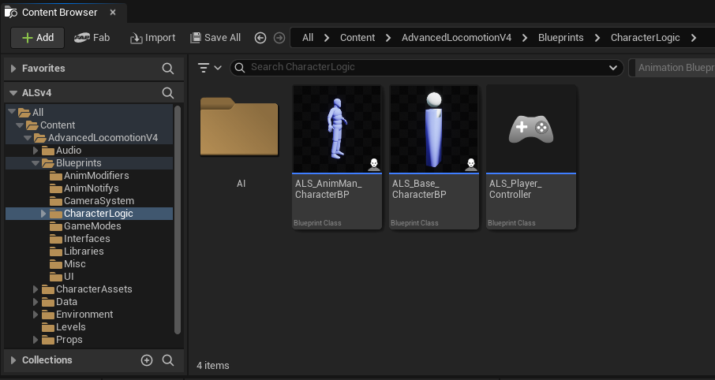
- 其中ALS_AnimMan_CharacterBP是ALS_Base_CharacterBP的子类，用于重写覆盖层代码和手持物体代码
# 创建ALS枚举类和完成State Event事件
## 继承蓝图接口

- 在ALS_Base_CharacterBP蓝图Class Setting中继承两个Blueprint Interface：ALS_Camera_BPI，ALS_Character_BPI
- **Blueprint Interface** 是一种非常强大的工具，用于实现不同蓝图类之间的通信，尤其是当这些类彼此之间并没有直接的继承关系时。它通过定义一个通用接口来允许多个类实现统一的行为，从而简化代码设计，提高模块化和可扩展性。
- 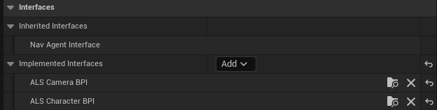
- 两个接口中的函数分别是：
- 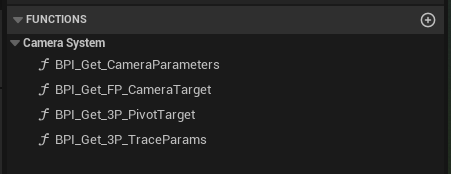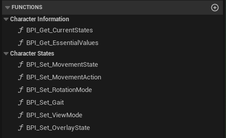
- 然后在ALS_Base_CharacterBP蓝图的interface里面就可以看到我们继承的接口了
- 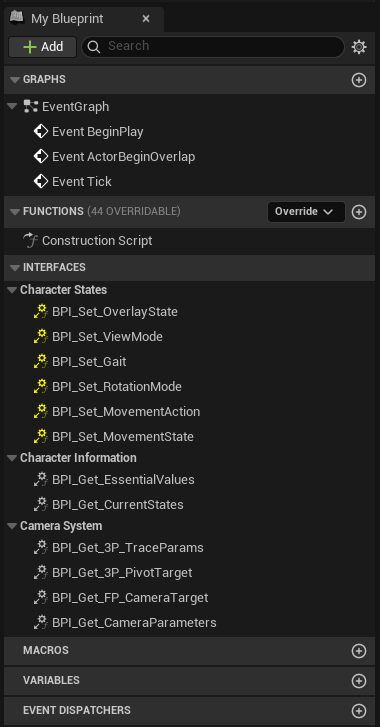
## 枚举类型
- 枚举ALS_MovementState，表示运动状态（持久的状态），包含：在地面，在空中，在攀爬，在倒地
- 枚举ALS_MovementAction，表示运动行为（当前在做什么），包含：翻墙，翻滚，起立
- 枚举ALS_RotationMode，表示旋转模式：速度方向（WASD控制面向方向），摄像机方向（摄像机控制方向），瞄准方向（摄像机控制方向）
- 枚举ALS_Gait，表示步幅：走，跑，冲刺
- 枚举ALS_ViewMode，表示视角：第一人称，第三人称。
- 枚举ALS_OverlayState，表示叠加态：持枪，受伤，抬举等。
- 枚举ALS_Stance，表示姿态：蹲伏、站立。
## 实现蓝图接口
### 所需的宏和函数
- 所有的宏都储存在：ALS_MacroLibrary，是一个Blueprint Macro Library
- 第一个宏为：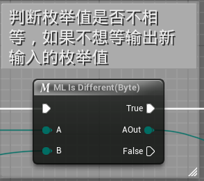
- 宏实现：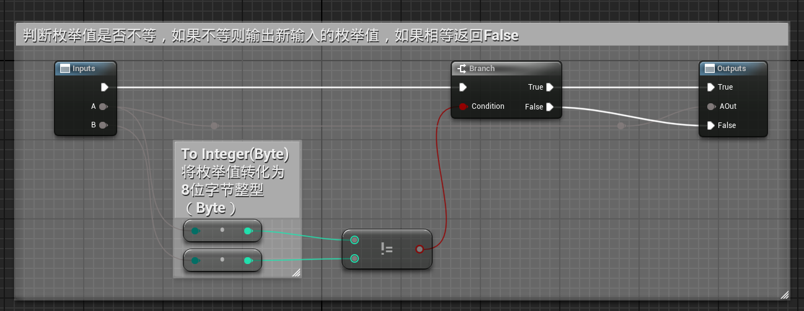
- 第二个宏为：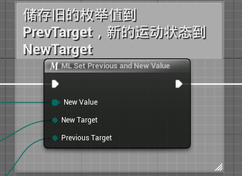
- 实现：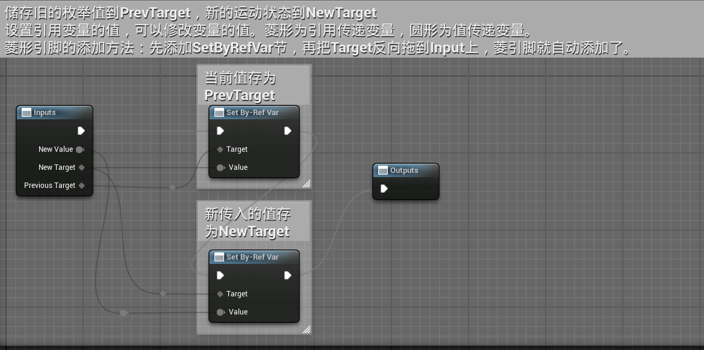
- 所需的函数为：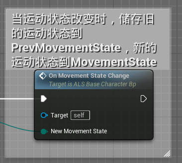，储存在ALS_Base_Character_Bp
- 函数实现：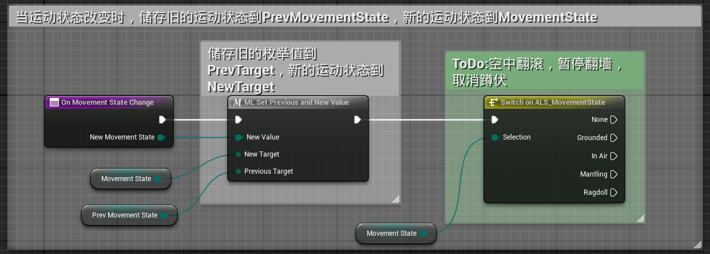
### ALS_Base_Character_Bp事件蓝图
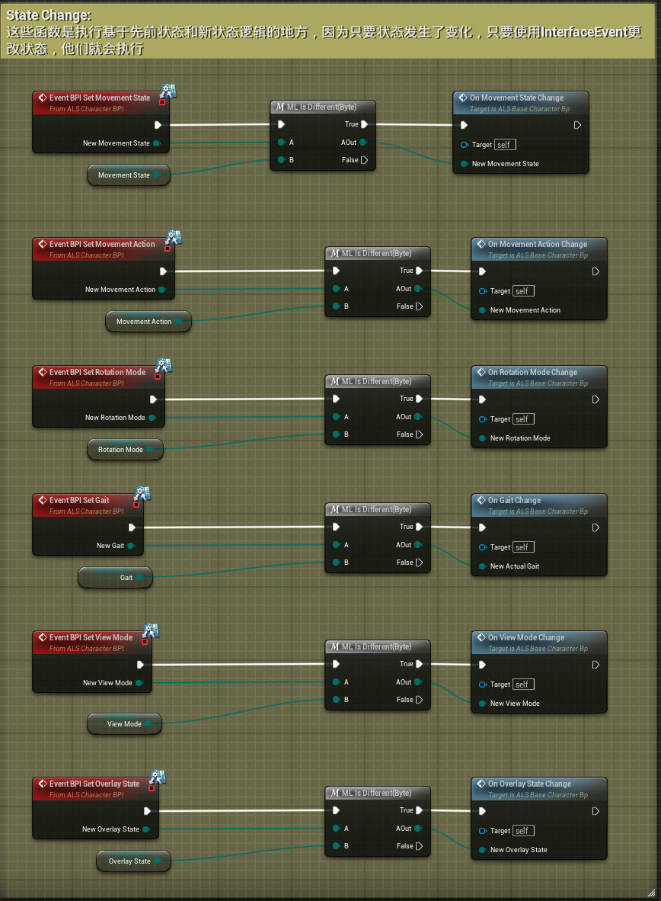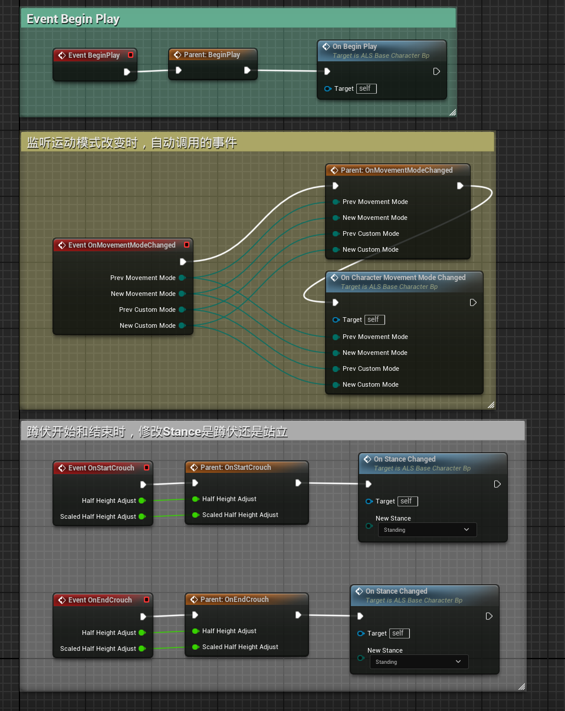