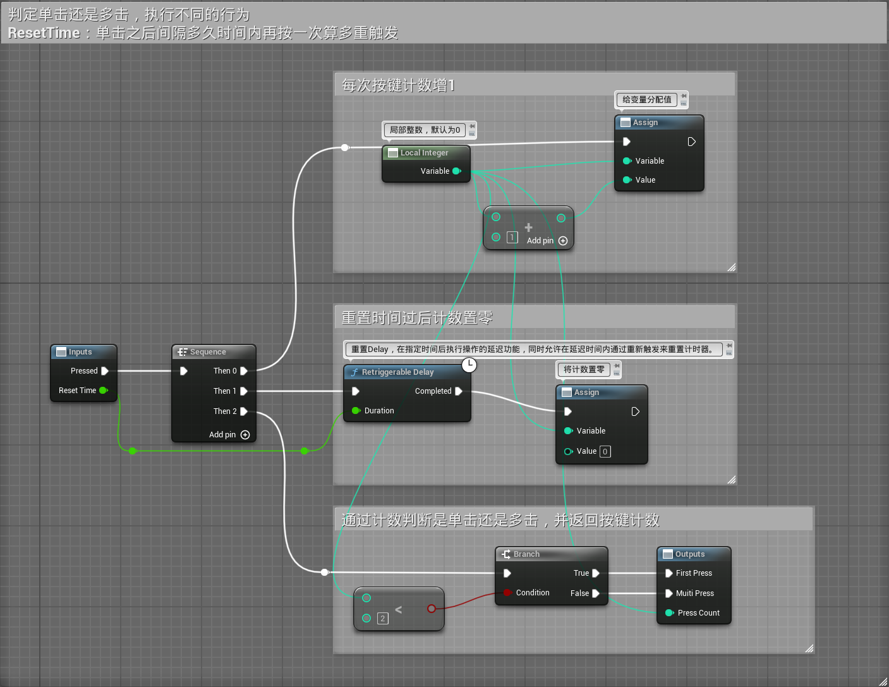
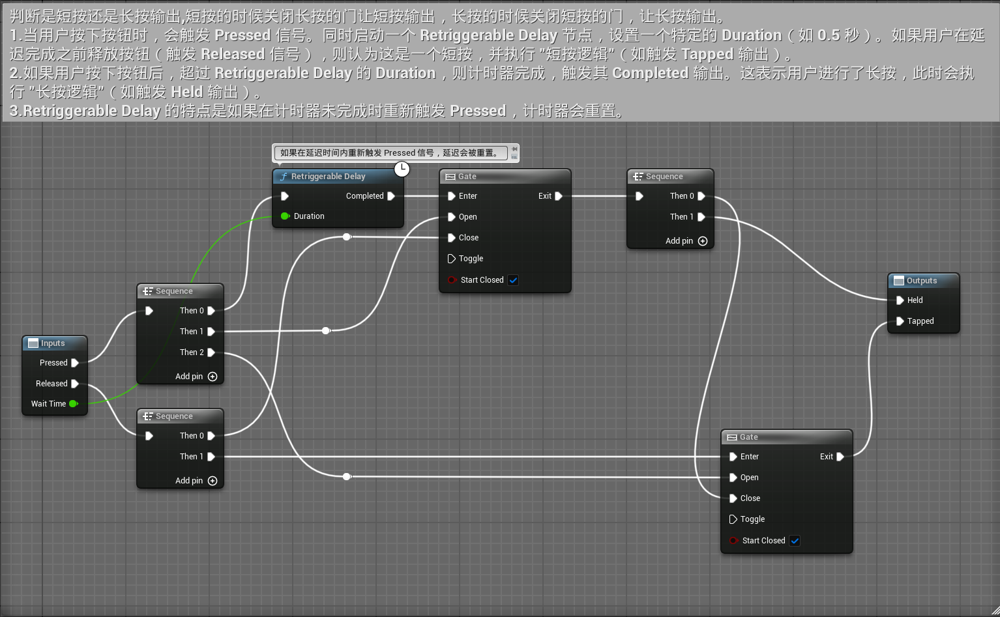
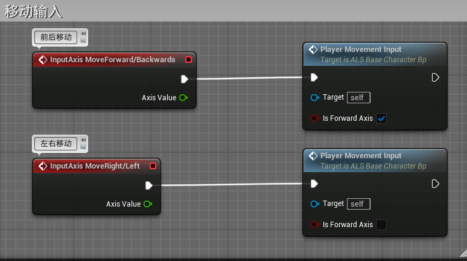
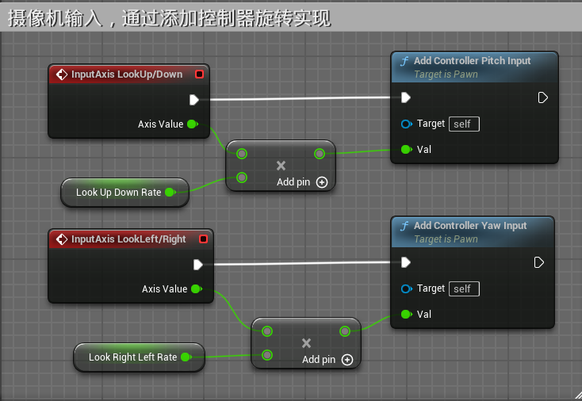
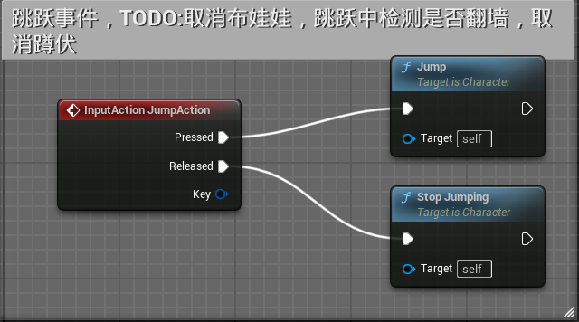
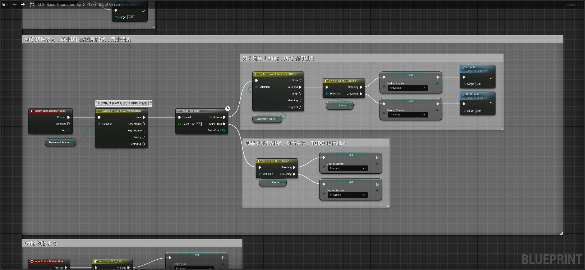
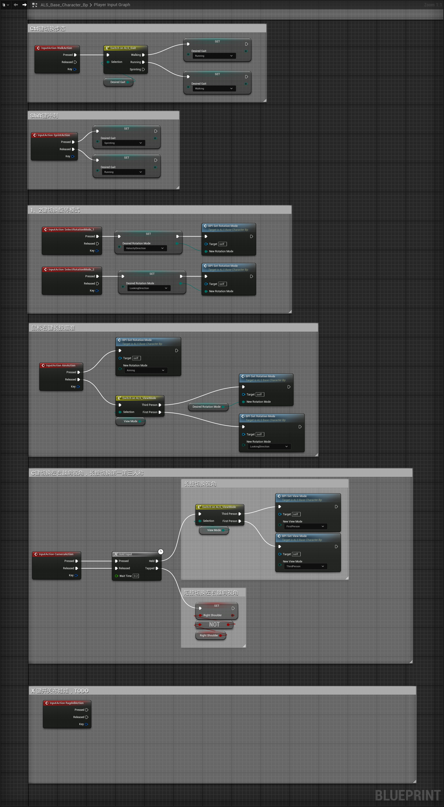

# 两个辅助宏
## 判断单击还是多击宏

## 判断短按还是长按宏

## 关键节点Retriggerable Delay

在 **Unreal Engine** 中，[Retriggerable Delay](../基础知识/2.0-Retriggerable%20Delay.md)是一个用于蓝图系统的节点，提供了一种在指定时间后执行操作的延迟功能，同时允许在延迟时间内通过重新触发来重置计时器。

# 玩家输入

