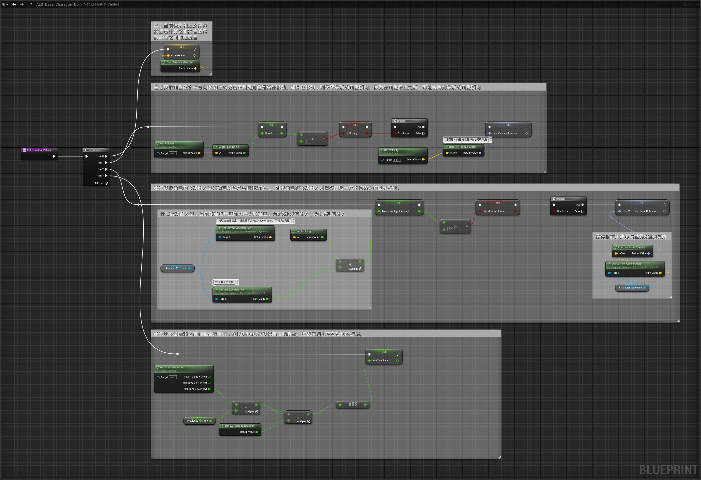

# Essential Value（基本参数）
## 蓝图

## 解释
- 其中的 IsMoving 和 HasMovementInput 之间的区别
	- IsMoving是表示角色是否在移动
	- HasMovementInput表示是否有移动输入，键盘是否摁下。
	- 有这种可能，就是键盘按下了，但是角色被挤在墙角无法移动，此时HasMovementInput 为true，但是 IsMoving 为false。
- LastMovementInputRotation 和 LastVelocityRotation 之间的区别
	- LastMovementInputRotation 是通过运动组件获取加速度计算得到的，玩家按键输入后会立刻变化。
	- LastVelocityRotation是通过获取角色速度向量计算得到的，玩家按键输入后不会立刻变化，而是过渡变化。
	- 玩家按键输入后LastMovementInputRotation会立刻变化，LastVelocityRotation会慢慢过渡到LastMovementInputRotation
# 四种Gait之间的关系
