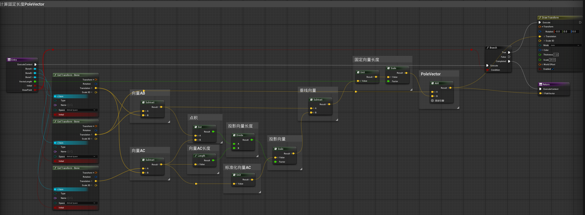

# 概述
- FKIK切换，因为虚幻引擎ControlRig是基于事件驱动的，所以我们可以执行实时的IKFK吸附。简言之，就是当处于FK模式时IK控制器跟随骨骼，当处于IK模式时FK控制器跟随骨骼。
# IK状态
- IK状态比较简单，只是在IK启用的时候让FK控制器跟随骨骼即可

其中的ABC分别是

# FK状态

- FK状态下需要IK控制器跟随骨骼，首先是脚部IK控制器和极向量控制器
- 
- 请注意这里的计算极向量函数并非引擎自带的CalculatePoleVector函数，CalculatePoleVector函数计算出的极向量长度不是固定的，而是会随着骨骼的位移变化而变化，在FKIK切换的时候不方便。
- 我们需要一个计算指定长度PoleVector函数，因为FKIK切换的时候需要指定长度的PoleVector，函数为
- 
- 同样我们在在ConstructionEvent中，也要使用这个函数来定位PoleVector的位置
- 脚部IK控制器跟随骨骼
- 
- 此时我们发现，调整脚部IK控制器Roll属性会导致编译报错，索性删除这个属性和逻辑，直接用IK控制器来实现Roll效果。