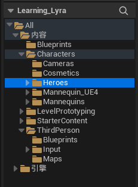
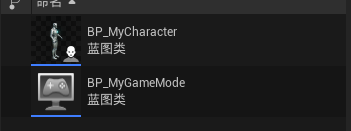
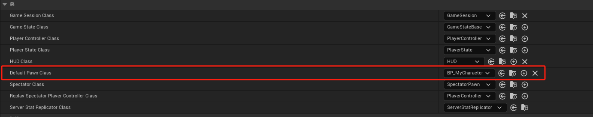
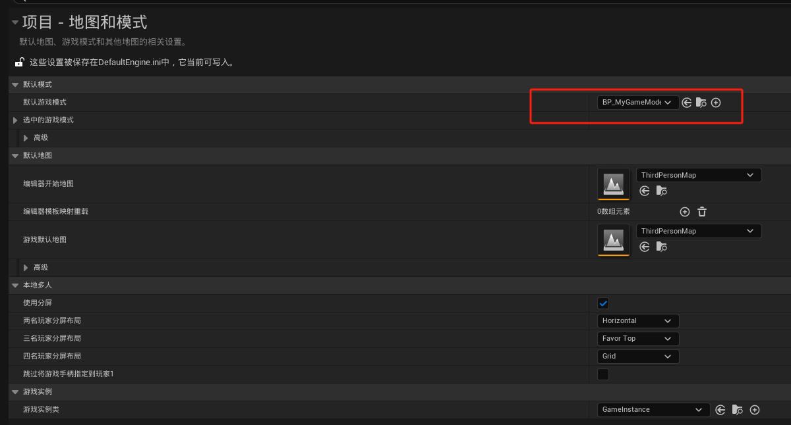
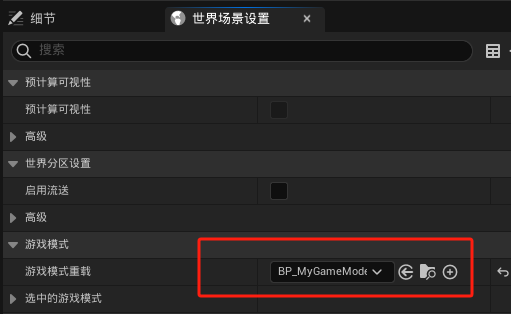

# 概述
- 设置项目
# 内容
- 创建空的的第三人称项目，并将Lyra项目动画资产Heros文件夹迁移到新项目Characters文件夹下
- 
- 创建Blueprints文件夹，并制作GameMode类和BP_MyCharacter角色类
- 
- 在GameMode类中添加角色类
- 
- 在项目设置中，设置GameMode
- 
- 在世界场景设置中游戏模式重载设为我们的GameMode
- 
- 在插件管理其中启用 AnimationLocomotionLibrary和AnimationWarping，然后重启项目
- 
- 