# Lyra中的动画

关于Lyra中动画系统的概述

**Lyra** 的角色动画几乎完全是利用虚幻引擎5对[动画蓝图](https://dev.epicgames.com/documentation/zh-cn/unreal-engine/animation-blueprints-in-unreal-engine)系统的改进在 **蓝图** 中创建的。系统设置受到Paragon和Fortnite的启发，它们通过使用自定义C++功能实现了类似的结果。

# 资产概述

**AnimBP_Mannequin_Base** 动画蓝图包含[AnimGraph](https://dev.epicgames.com/documentation/zh-cn/unreal-engine/graphing-in-animation-blueprints-in-unreal-engine)窗口，你可以使用该窗口查看[动画节点](https://dev.epicgames.com/documentation/zh-cn/unreal-engine/animation-blueprint-nodes-in-unreal-engine)的架构，动画节点会影响角色人体模型的最终输出姿势。 点击 **内容侧滑菜单（Content Drawer）** > **角色（Characters）** > **主角（Heroes）** > **Mannequin** > **动画（Animations）** > **AnimBP_Mannequin_Base** ，你可以找到此动画蓝图。

[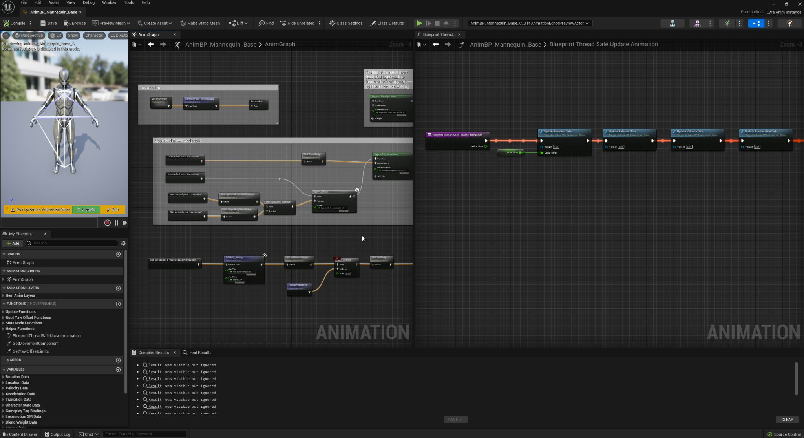](https://d1iv7db44yhgxn.cloudfront.net/documentation/images/46349ab1-361a-4812-98a7-58aa300c2f30/baseoverview.png)

人体模型基础动画蓝图的AnimGraph和蓝图线程安全更新动画（Blueprint Thread Safe Update Animation）函数。

设置AnimBP_Mannequin_Base，以便支持在Lyra游戏的示例武器和[游戏技能](https://dev.epicgames.com/documentation/zh-cn/unreal-engine/abilities-in-lyra-in-unreal-engine)中使用的常用方法。

### 蓝图线程安全更新动画

在为你的角色类开发动画时，需要注意一些做法，以确保你的动画以最佳性能运行。在Lyra中，我们使用[多线程动画](https://dev.epicgames.com/documentation/zh-cn/unreal-engine/animation-optimization-in-unreal-engine)来计算动画值，而不是使用[事件图表](https://dev.epicgames.com/documentation/zh-cn/unreal-engine/animation-blueprint-event-nodes-in-unreal-engine)。

**动画快速路径（Animation Fast Path）** 可帮助你将值计算进程保留在游戏线程之外。若要从编辑器中启用此功能，请找到 **编辑（Edit）** > **项目设置（Project Settings）** > **引擎（Engine）** > **通用设置（General Settings）** > **动画蓝图（Anim Blueprints）** ，然后启用 **允许多线程动画更新（Allow Multi Threaded Animation Update）** 。

[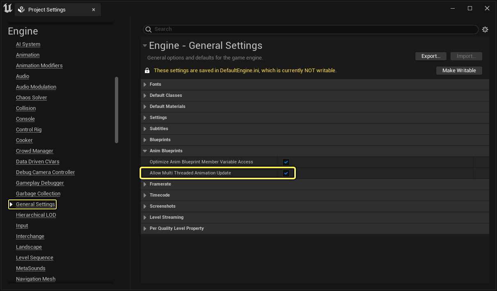](https://d1iv7db44yhgxn.cloudfront.net/documentation/images/54aae168-5604-408f-9b83-2268ed60ad60/multithreadsettings.png)

打开 **AnimBP_Mannequin_Base** 的 **类默认值（Class Defaults）** ，然后找到 **我的蓝图（My Blueprint）** > **函数（Functions）** 类别，并点击 **BlueprintThreadSafeUpdateAnimation** 函数，你可以查看负责收集动画数据和处理这类计算的函数。

[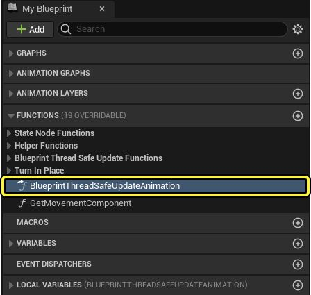](https://d1iv7db44yhgxn.cloudfront.net/documentation/images/8531e7e6-4b67-4083-b145-14723400874c/bpthreadfunction.png)

使用线程安全函数时，你无法像在事件图表（Event Graph）中那样直接从游戏对象访问数据。例如，如果你尝试为角色的速度复制Gameplay浮点值，则此操作不会被视为线程安全，因此我们建议使用属性访问（Property Access）来就这些情况进行调整。

[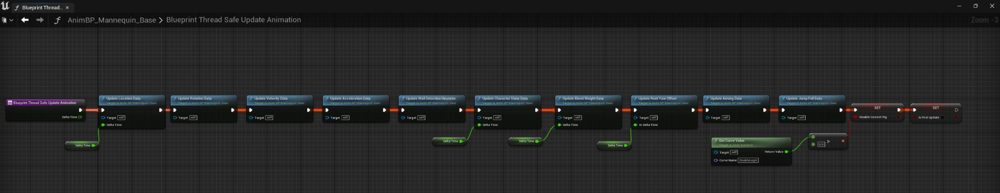
- 属性访问（Property Access）

- 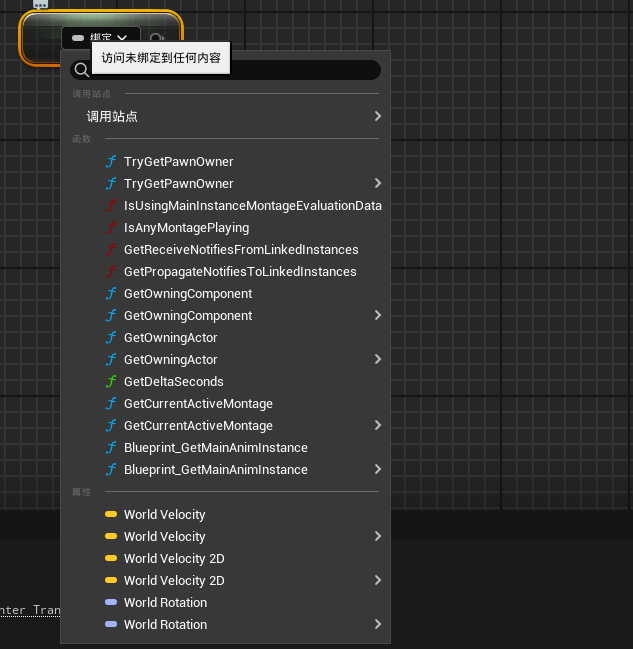
- 
### 动画节点函数

在Lyra中，需要使用动画节点函数来创建状态特定逻辑。这有利于保持动画逻辑的有序性。如果你需要在角色处于空闲动画状态时计算值，那么你可以将该逻辑置于空闲（Idle）状态。要查看示例，请按照以下步骤操作：

1. 找到 **AnimBP_Mannequin_Base** > **动画图表（Anim Graph）** ，并双击 **LocomotionSM** 状态机，打开显示运动（Locomotion）状态的窗口。
    
    [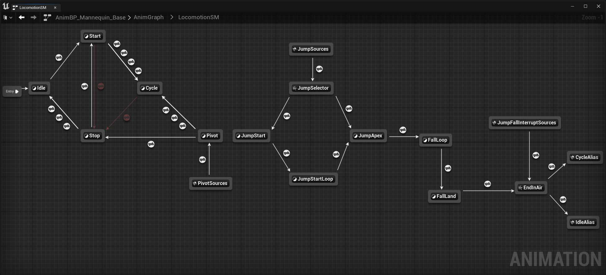](https://d1iv7db44yhgxn.cloudfront.net/documentation/images/4a141a8b-e6d9-4ca3-a7d9-0a0e41602caf/statemachine.png)
    
    运动状态机包括用于在不同动画状态之间过渡的状态别名。
    
2. 你可以双击 **空闲（Idle）** 状态并选择 **Output Animation Pose** 节点，然后在 **函数（Functions）** 的 **细节（Details）** 面板下，你可以看到动画节点函数，这些函数提供了设置我们节点的初始值。
    
    [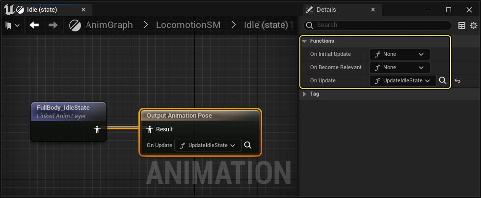](https://d1iv7db44yhgxn.cloudfront.net/documentation/images/4d3c3d83-9dc5-42f5-b65b-01ba2d4e9965/functionnode.png)
    
    在我们的示例图像中，我们打开了空闲（Idle）状态机，以便查看在其输出动画姿势中使用的动画节函数。
    
    |函数|说明|
    |---|---|
    |**On Initial Update**|在首次更新节点之前调用。|
    |**On Become Relevant**|当节点变为相关时调用。|
    |**On Update**|更新节点时调用。|
    
3. 找到 **我的蓝图（My Blueprint） > 函数（Functions） > 状态节点函数（State Node Functions）** ，并双击 **UpdateIdleState** 函数，以便查看用于计算空闲状态（Idle State）运动节点最终输出姿势的逻辑。
    
    [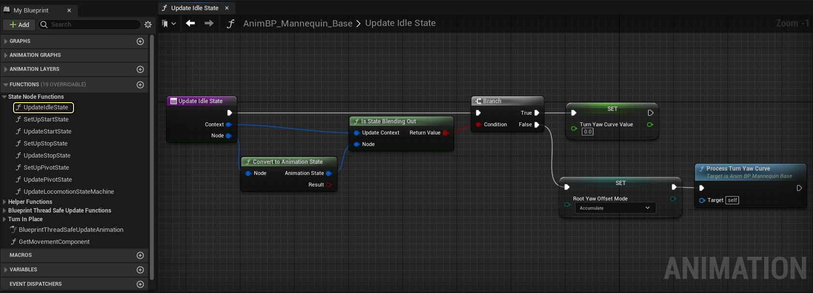](https://d1iv7db44yhgxn.cloudfront.net/documentation/images/fac0bcd5-22c9-4f5e-8167-7ac0fc34ea8c/statenodefunction.png)
    
    在以前的引擎版本中，旧版状态机事件会在动画更新后触发。
    

### 状态别名

随着你的项目规模开始扩大，你的角色可能需要过渡到多个动画状态。这可能会导致状态机具有多条过渡线，从而难以在图表中查看。状态别名用于简化过渡逻辑，同时就状态间每个单独过渡提供控制。在Lyra中，找到 **AnimBP_Mannequin_Base** > **动画图表（Anim Graph）** > **LocomotionSM** 图表，你可以查看所使用的状态别名的示例，然后选择 **JumpSources** 状态节点。

[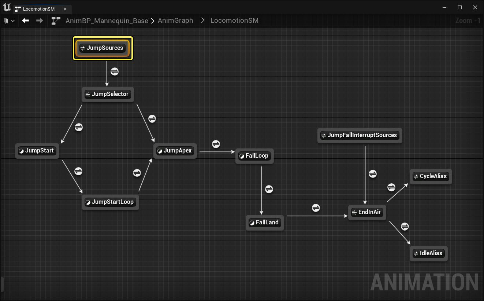](https://d1iv7db44yhgxn.cloudfront.net/documentation/images/e3b887f4-db3a-4e47-a58c-adae8525a923/jumpsources.png)

运动状态机（Locomotion State Machine）图表突出显示了Jump Sources节点，可以查看可用的状态别名。

在细节（Details）面板中，你可以查看可以直接过渡到跳跃（Jump）状态的运动状态（Locomotion States）。

[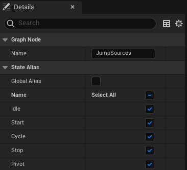](https://d1iv7db44yhgxn.cloudfront.net/documentation/images/6b47ecd4-64ac-4830-8cce-3355fac62620/detailspanel.png)

当Lyra角色处于空闲（Idle）状态时，玩家使用跳跃（Jump）动作时，Lyra角色将进入跳跃状态。最终，角色将过渡为下落状态，然后重新进入循环或空闲状态。

### 上/下身体分层

[BlendNodes](https://dev.epicgames.com/documentation/zh-cn/unreal-engine/animation-blueprint-blend-nodes-in-unreal-engine)用于将动画混合在一起。Lyra中使用的大部分运动动画都是全身的，这意味着动画是基于整个骨骼播放（如 **jog_fwd** 动画），然后再与玩家可以随时使用的各种上半身动作（例如武器射击或填弹动画）结合。

这通过使用 **Layered blend per bone** 节点来实现，若要查看该节点，打开 **AnimBP_Mannequin_Base** > **AnimGraph** ，然后找到上身/下身（Upperbody/lowerbody）分离注释。

[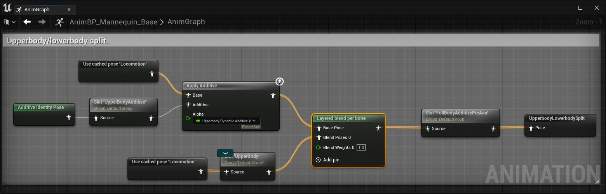](https://d1iv7db44yhgxn.cloudfront.net/documentation/images/0873daa8-b9aa-4477-bfa9-c1505a4142f3/layeredblend.png)

当你选择Layered blend per bone节点时，你可以查看包含了混合遮罩（Blend Masks）的细节面板，这些遮罩将针对与混合相关的单个骨骼的权重提供显式控制。

[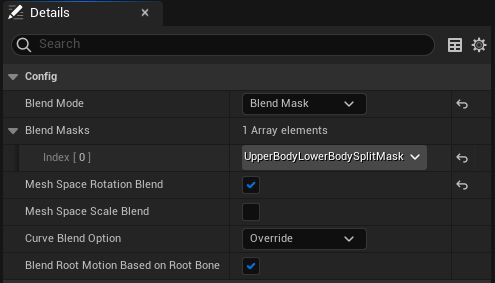](https://d1iv7db44yhgxn.cloudfront.net/documentation/images/3dac853a-a26e-4de7-98e7-2f1a70b14d8b/blendmask.png)

## 链接的图层动画蓝图

[动画蓝图链接](https://dev.epicgames.com/documentation/zh-cn/unreal-engine/using-animation-blueprint-linking-in-unreal-engine)系统可以在动画图表的不同子分段之间动态切换。主动画蓝图上有多个地方可供你通过链接的图层动画蓝图（Linked Layer Animation Blueprints）覆盖姿势。 在Lyra中，这意味着根据玩家持有的武器，你可以拥有不同的运动行为、动画资源或姿势校正。你可以将它们的功能分开，并允许多个用户同时处理动画，或者降低资产之间的依赖性，同时仍然共享相同的核心功能。

### 动画层接口

**ALI_ItemAnimLayers** 是一个动画层接口，用于指定你可以在动画蓝图中覆盖动画的位置。在Lyra中，除了用于瞄准和骨骼控制的图层之外，还针对运动状态执行此操作。

[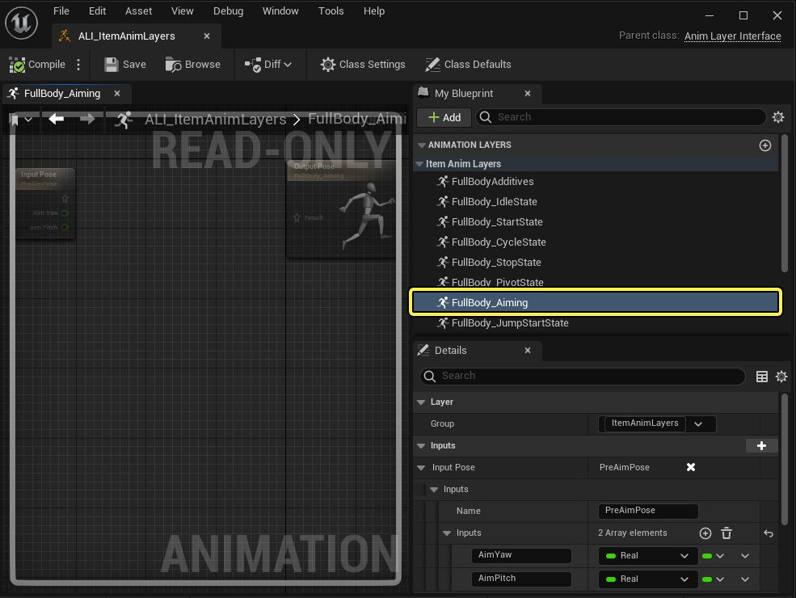](https://d1iv7db44yhgxn.cloudfront.net/documentation/images/ebeaf2cd-88f3-4af0-8762-ffb2b6e172f3/fullbodyaiming.png)

FullBody_Aiming 动画层是 项目动画层（Item Anim Layers） 接口的一部分。

**ABP_ItemAnimLayersBase** 是所有武器使用的基础链接层动画蓝图。你可以从 **内容（Content）** > **角色（Characters）** > **英雄（Heroes）** > **人体模型（Mannequin）** > **动画（Animations）** > **LinkedLayers** 访问此蓝图。

### 从主AnimBP访问数据

在 **ABP_ItemAnimLayersBase** 动画蓝图中，有一个自定义函数 **Get Main Anim BPThreadSafe** ，用于获取对主动画蓝图（ **AnimBP_Mannequin_Base** ）的引用。

[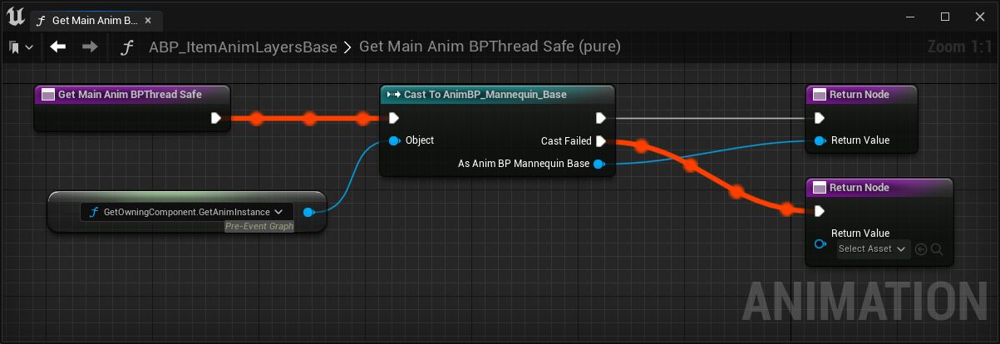](https://d1iv7db44yhgxn.cloudfront.net/documentation/images/01084c74-b9a2-40b6-9a05-6aa1d25a8c33/mainthreadsafe.png)

显示在项目动画层基础动画蓝图（Item Anim Layers Base Animation Blueprint）中的Get Main Anim BPThreadSafe函数

这实现了使用属性访问（Property Access）来访问其所有数据，并避免了重新计算链接的图层可能使用的值，如 **加速度（Acceleration）** 或 **速度（Velocity）** 。

[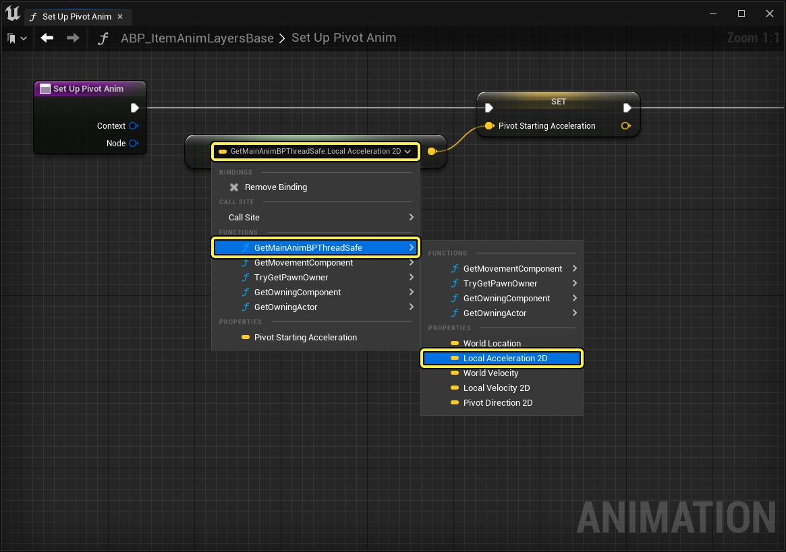](https://d1iv7db44yhgxn.cloudfront.net/documentation/images/9cb2fe54-f944-4386-9472-33b589afd837/propertyaccess.png)

### 使用动画节点函数选择动画

在Lyra中，**链接的动画图层（Linked Anim Layers）** 使用 **属性访问（Property Access）** 和动画节点函数，在动画更新时（On Update）或变为相关时（On Become Relevant）运行逻辑。

[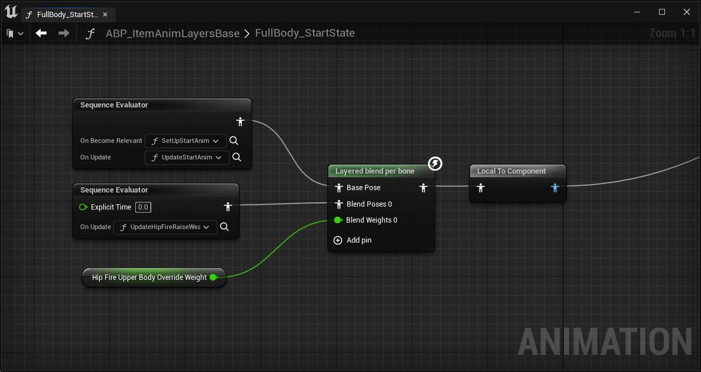](https://d1iv7db44yhgxn.cloudfront.net/documentation/images/ee860b83-fca2-4782-94a2-b03fb1be137b/animlayers.png)

在下面的示例中，每次动画变为相关时，我们都会选择一个定向开始动画。

[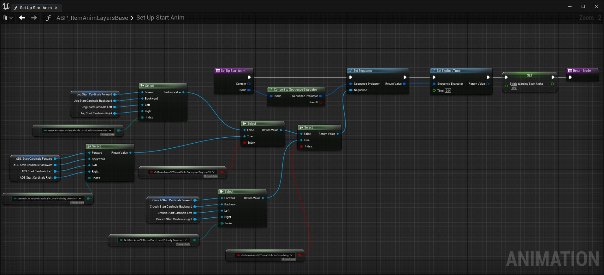](https://d1iv7db44yhgxn.cloudfront.net/documentation/images/0aedee8a-0ab9-47c0-bc8d-66bfc11e4a4b/setupstart.png)

### 链接的图层子动画蓝图

在Lyra中，每个武器都有从 **ABP_ItemAnimLayersBase** 继承的子动画蓝图。动画师可以插入动画，并编辑每个武器的所有变量，如下图 **ABP_PistolAnimLayers** 动画蓝图所示。

[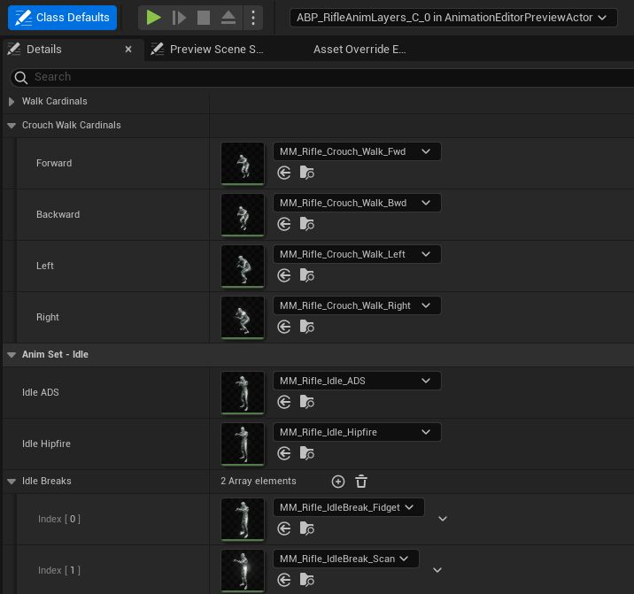](https://d1iv7db44yhgxn.cloudfront.net/documentation/images/ad8c680f-9379-4a60-9582-869217340371/layerchild.png)

## 距离匹配和步幅适配

若难以在动画资产和Gameplay之间匹配运动，则可使用 **距离匹配（Distance Matching）** 调整动画的播放速率，例如开始、停止和着陆动画等运动动画资产。

[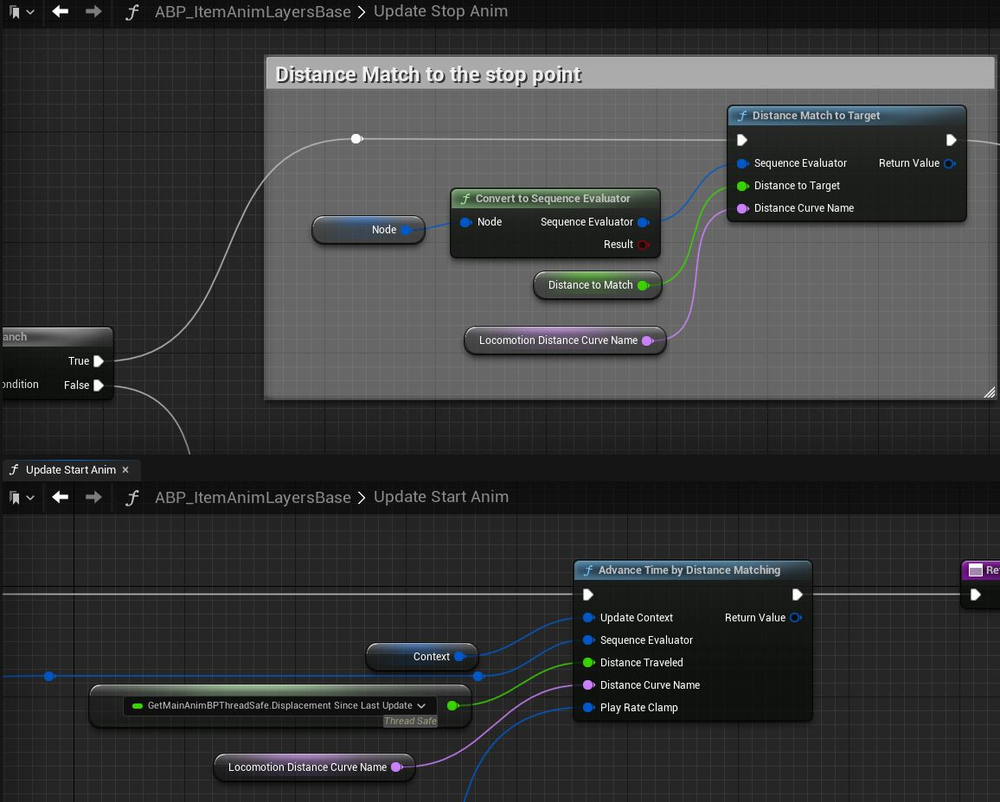](https://d1iv7db44yhgxn.cloudfront.net/documentation/images/dc63e8d9-f62c-4270-9ee9-d501c2fe110f/distancematching.png)

步幅适配（Stride Warping）用于动态调整角色的步幅长度，这适用于不调整播放速率的情况，例如角色进入慢跑（Jog）状态时。

|   |   |
|---|---|
|[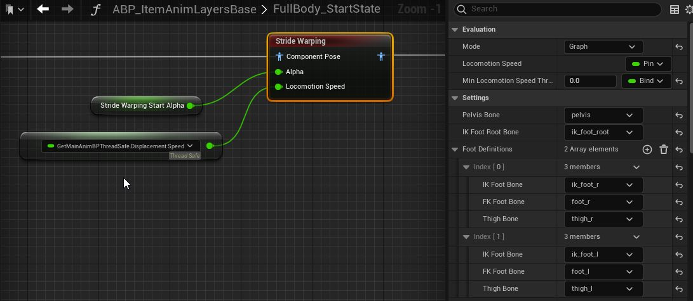](https://d1iv7db44yhgxn.cloudfront.net/documentation/images/e540fe6d-c678-4d38-a2ef-f514e51aba67/stridewarping.png)|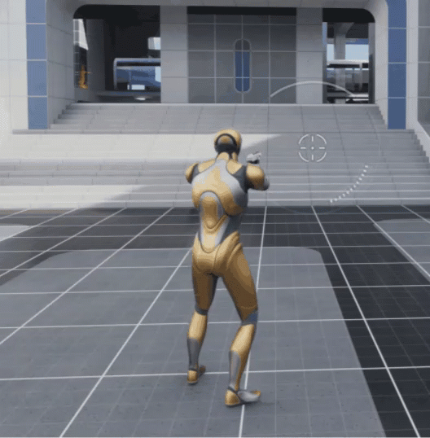|

结合这两种方法之后，你可以动态地选择侧重于其中一种方法。在开始状态期间，我们首先使用距离匹配（Distance Matching）来保留姿势，然后在接近慢跑（Jog）状态时使用步幅适配（Stride Warping）来混合。

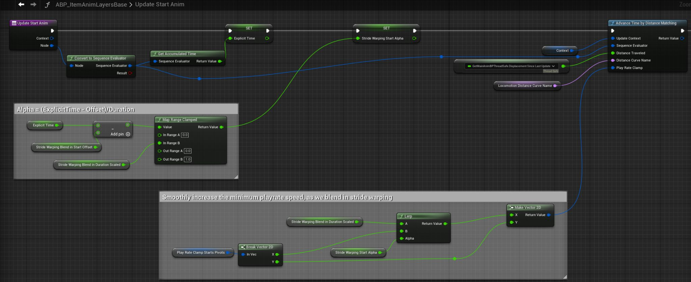

## 方向适配

方向适配（Orientation Warping）可以与角色移动的根骨骼运动角度一起使用，并弯曲角色的下半身以便匹配角度。在Lyra中，Strafe动画是为四个基本方向创建的，因为玩家可以360度自由移动，我们使用方向适配（Orientation Warping）来程序化地调整姿势。这种方法在开始时使用，因为我们的动画覆盖的范围有限。

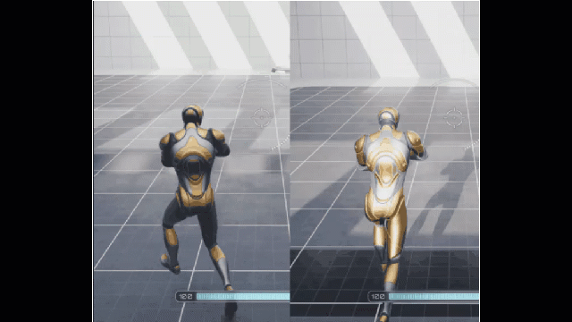

## 原地转身

在Lyra的基础链接动画蓝图的空闲状态机中，完成原地转身动画选择。基于转身角度的不同动画以及玩家在触发它们之前的等待时长，你可以在子动画蓝图的每个武器动画集分段中自定义，方法是找到 **类默认值（Class Defaults）** > **动画集（Anim Set）- 原地转身（Turn In Place）** > **原地转身过渡（Turn In Place Transitions）** 。

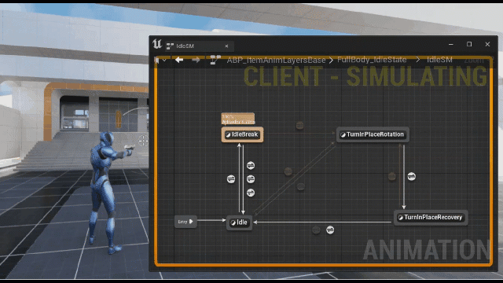

在Lyra中，角色Actor将朝向控制器的偏转角。为了最大限度地减少滑步，Rotate Root Bone节点将使用旋转计数器，并根据根骨骼偏转偏移（Root Yaw Offset）来偏移。

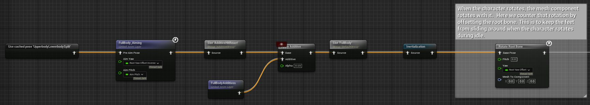

当将偏转值传递给全身瞄准（FullBody Aiming）层中的瞄准偏移（Aim Offset）时，会使用此附加偏移。根据玩家正在执行的操作，我们需要允许根骨骼偏转偏移（Root Yaw Offset）将其模式更改为下表中的以下状态之一。

|偏移模式|说明|
|---|---|
|**累加（Accumulate）**|在空闲期间，累加将完全抵消Actor的旋转。|
|**保持（Hold）**|在开始时，保持模式会保留此动画开始时的原始偏移|
|**充分混合（Blend Out）**|进入慢跑循环时，充分混合模式将平滑地混合它，并遵循默认的"朝向控制器"行为。|

这是通过 **Request Root Yaw Offset Mode** 函数完成的，每种状态都可以在需要时调用该函数。

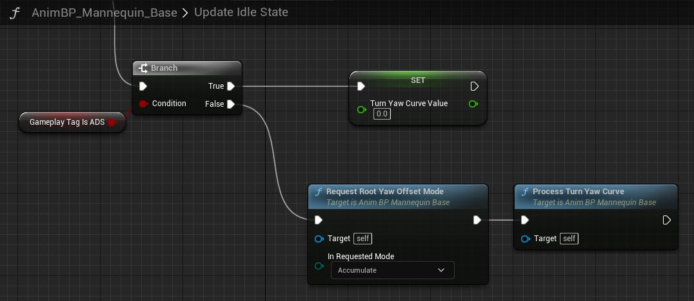

当角色处于空闲状态且偏移模式设置为累加（Accumulate）时，我们需要将动画的根骨骼旋转应用于根骨骼偏转偏移（Root Yaw Offset）。使用 **转身偏转动画修饰符（Turn Yaw Anim Modifier）** 将此信息烘焙到曲线中，并且它要求源动画启用根骨骼运动（Root Motion）。

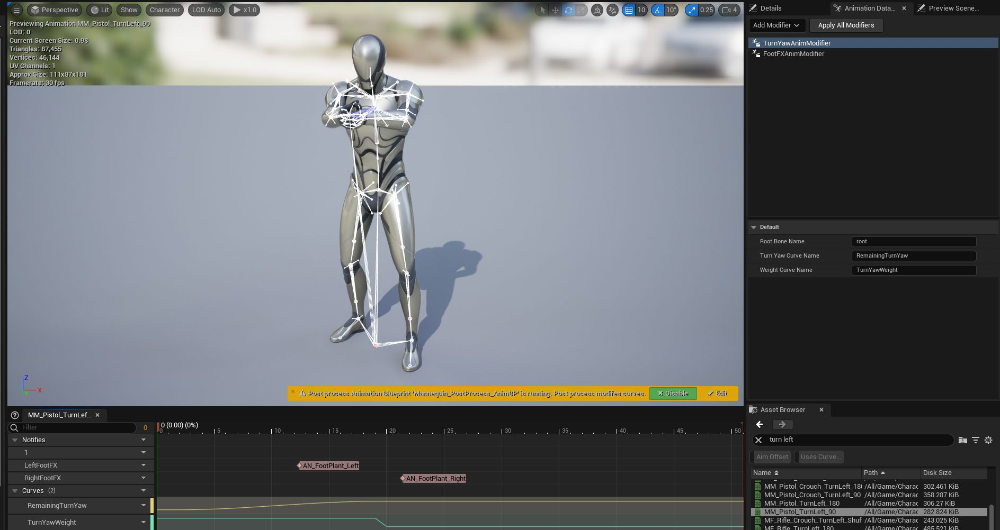

## 附加说明

### Gameplay标签绑定

Lyra使用[Gameplay技能系统](https://dev.epicgames.com/documentation/zh-cn/unreal-engine/gameplay-ability-system-for-unreal-engine)来完成大部分的玩家动作。你可以使用Gameplay标签绑定（Gameplay Tag Bindings）在动画蓝图中响应这类事件。你可以从 **类默认值（Class Defaults）** > **细节（Details）** > **Gameplay标签（Gameplay Tags）** > **Gameplay标签属性贴图（Gameplay Tag Property Map）** ，找到 **AnimBP_Mannequin_Base** 蓝图中的Gameplay标签（Gameplay Tags）。

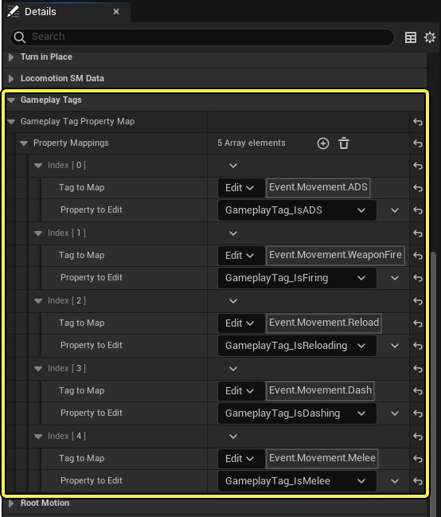

### 蒙太奇

蒙太奇已更新，现支持[混合描述（Blend Profiles）](https://dev.epicgames.com/documentation/zh-cn/unreal-engine/blend-masks-and-blend-profiles-in-unreal-engine#blendprofiles)和[惯性化](https://dev.epicgames.com/documentation/zh-cn/unreal-engine/animation-blueprint-blend-nodes-in-unreal-engine#inertialization)。

5.0目前不支持同时启用两者

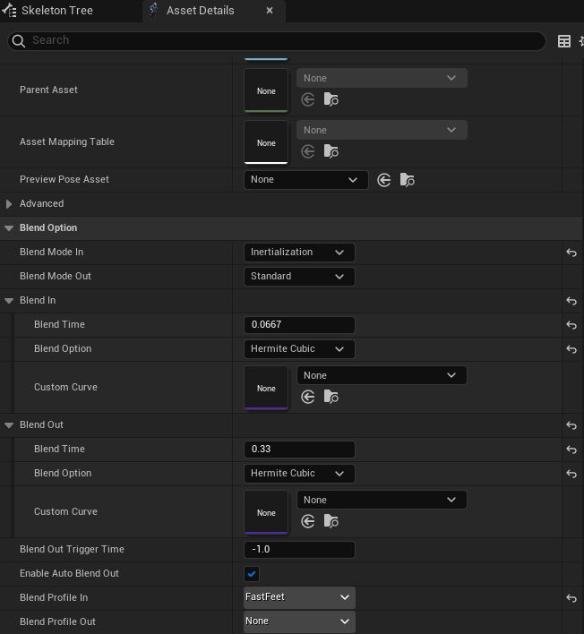

### 通知

其他动画通知（Additional Animation Notify）信息已公开给状态机过渡。在Lyra中，我们可以使用它控制何时可以过渡到特定状态的精确时间。

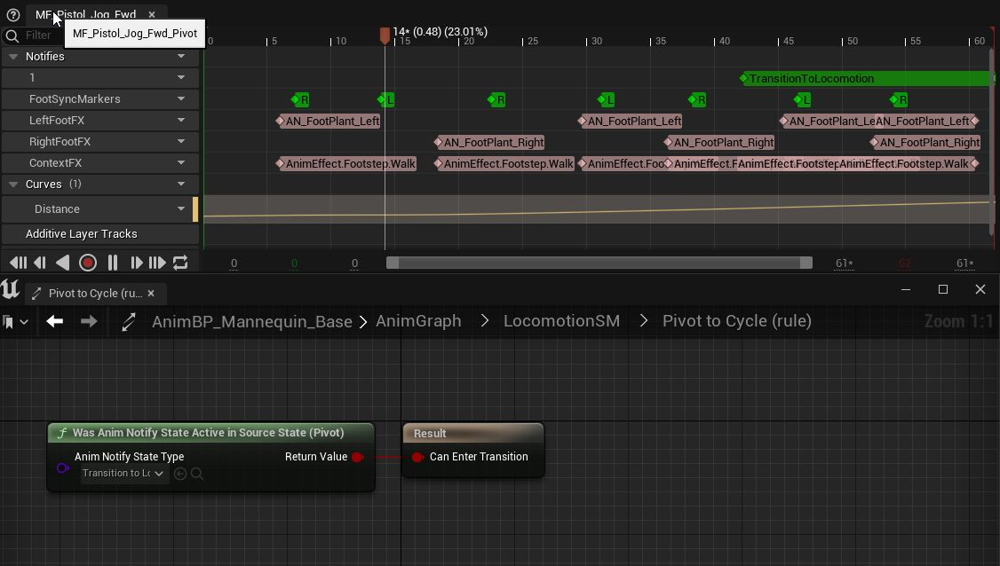

### 调试

你可以使用姿势观察管理器（Pose Watch Manager），将姿势观察添加到图表上的特定点，以便检查运行时姿势，并快速找到它们。你可以找到 **窗口（Window）** > **姿势观察管理器（Pose Watch Manager）** ，以便打开姿势观察管理器（Pose Watch Manager）。

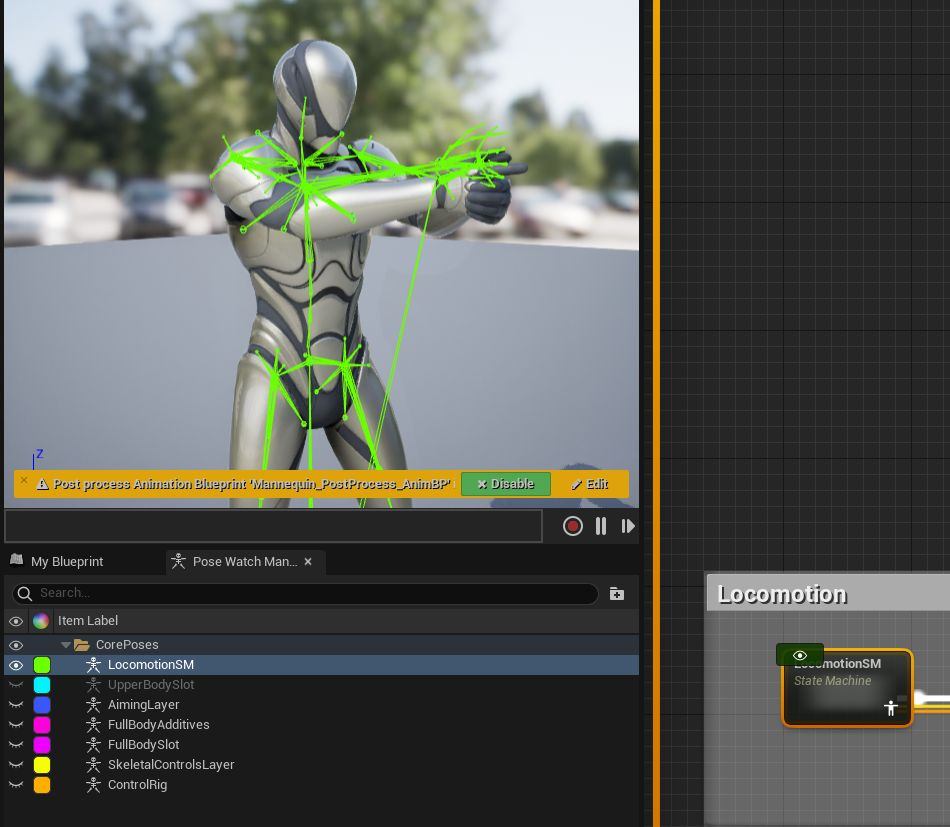

对于调试，除了位于[动画效率提示和技巧](https://dev.epicgames.com/documentation/zh-cn/unreal-engine/animation-shortcuts-and-tips-unreal-engine)页面上的提示和技巧之外，你还可以使用[倒回调试器](https://dev.epicgames.com/documentation/zh-cn/unreal-engine/animation-rewind-debugger-in-unreal-engine)。