# 概述
- 搭建基础动画框架
# 动画蓝图
## 数据函数
- 创建动画蓝图ABP_MyAnimation_Base
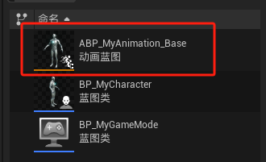
- 并将动画蓝图添加到角色蓝图
- 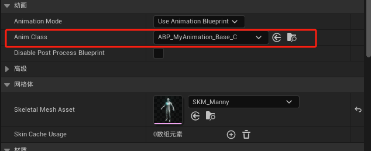
- 创建函数Update Rotation Data，Update Velocity Data， Get Movement Component， Update Acceleration Data
- 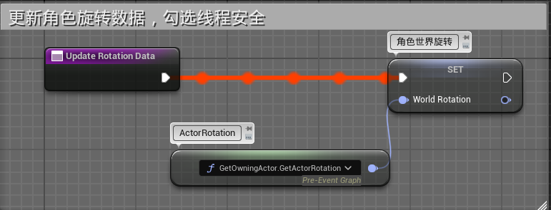
- 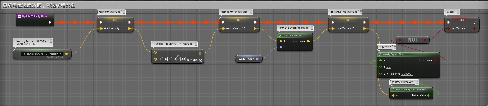
- 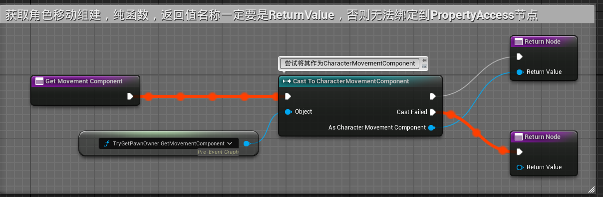
- 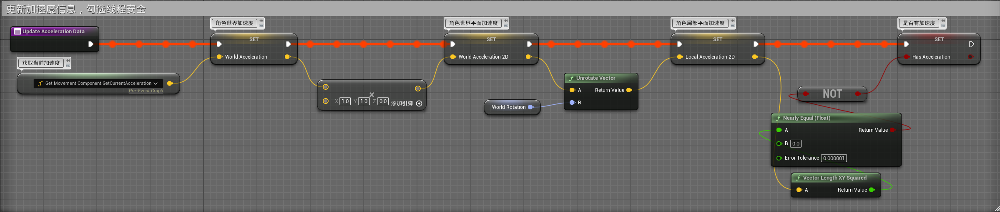
- 在动画蓝图中重载 *蓝图线程安全更新动画*  函数，此函数
- 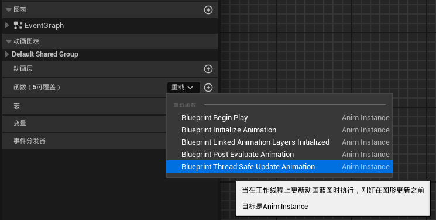
- 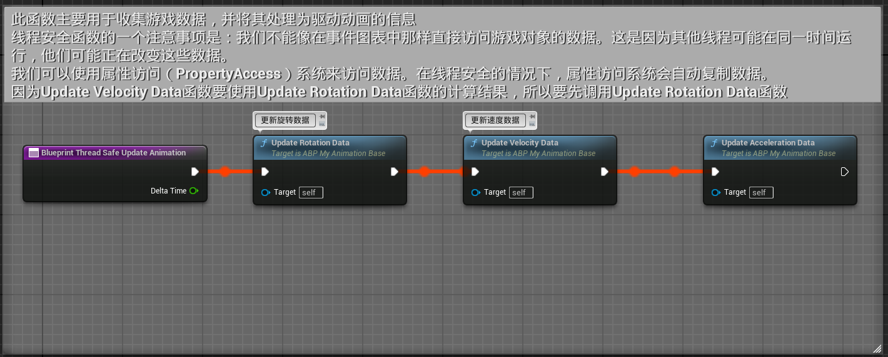
## 动画层接口
- 创建动画层接口ALI_MyAnimLayerInterface
- 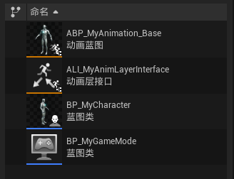
- 在接口文件内创建动画层
- 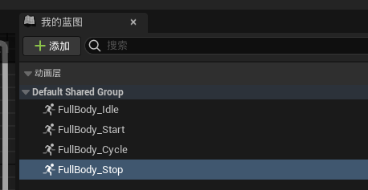
- 在动画蓝图类设置中继承动画层接口
- 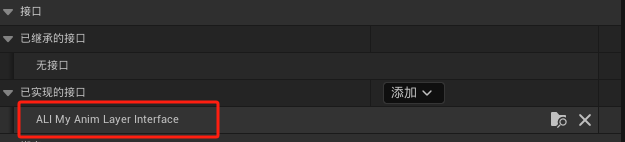
- 然后就可以看到动画层了
- 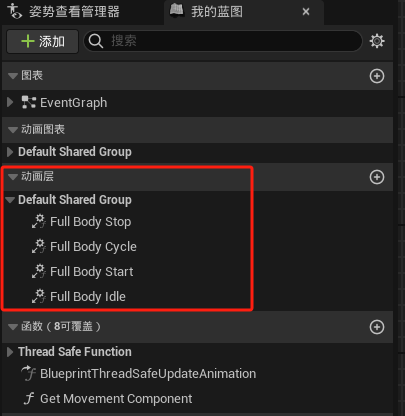
## 动画图表

- 创建状态机
- 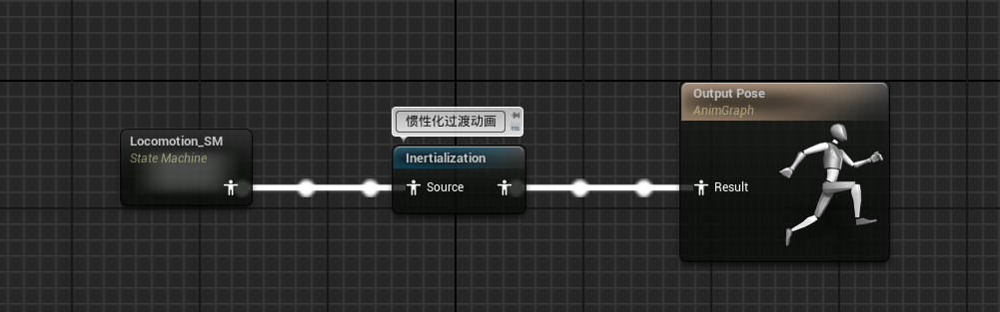
- 在状态机Locomotion_SM中
- 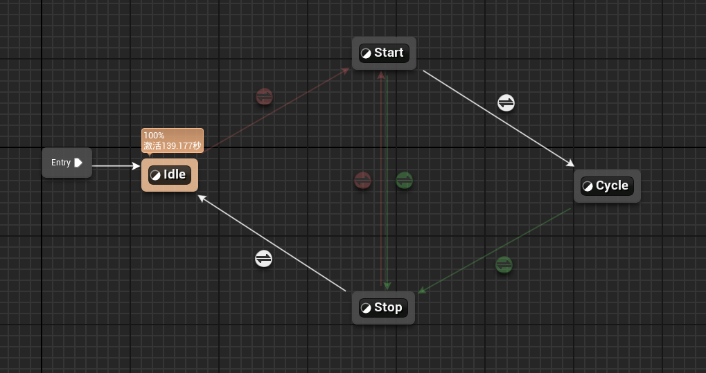
### 过渡条件

- 动画开始进入Idle状态
	- 如果有加速度，进入Start状态，混合配置为FastFeet，此条件提升为共享条件ToStart
	- 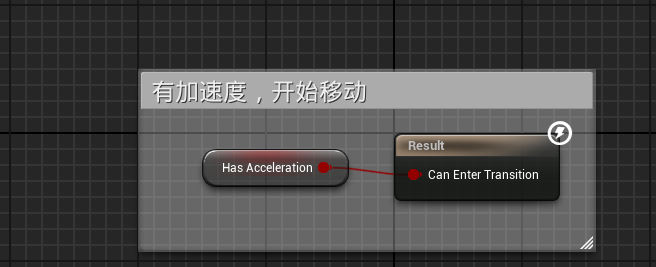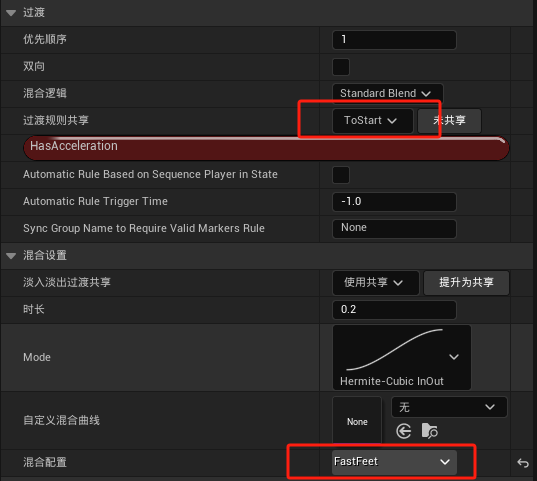
- Start状态
	- 如果没有加速度，切换到Stop状态，此条件提升为共享条件ToStop
	- 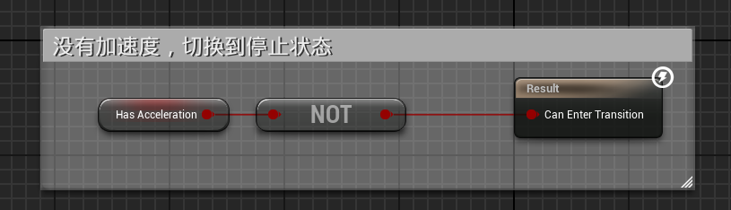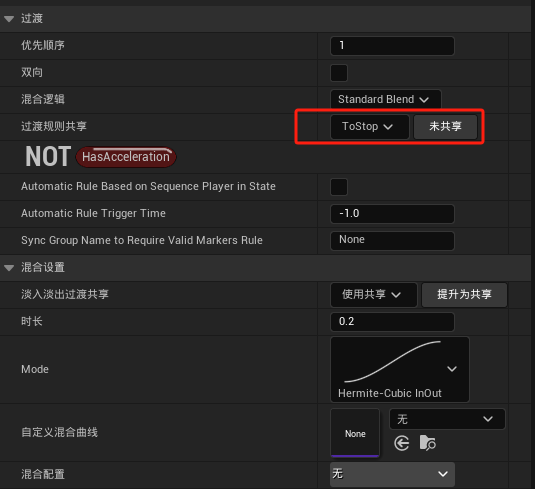
	- 自动条件切换到Cycle状态，混合时长为1
	- 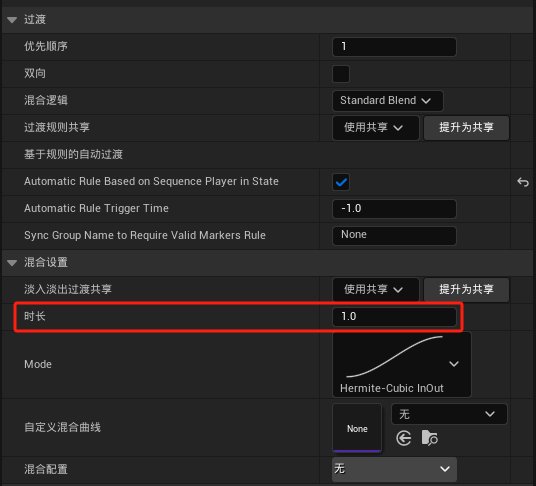
- Cycle状态，
	- 调用ToStop条件切换到Stop状态
- Stop状态
	- 调用ToStart状态切换到Start状态
	- 自动规则切换到Idle状态
	- 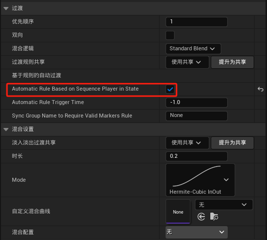
### 状态逻辑
- 将动画层接口中的动画层链接到状态中
- 依次为Idle，Start，Cycle，Stop状态
- 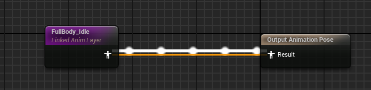
- 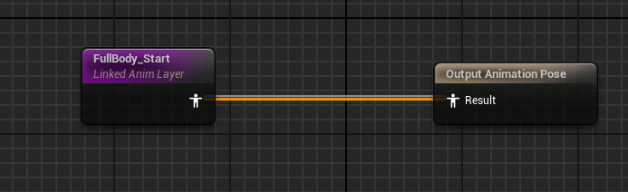
- 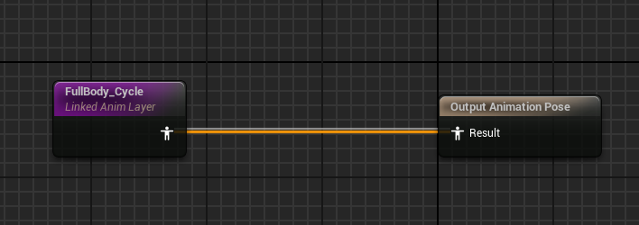
- 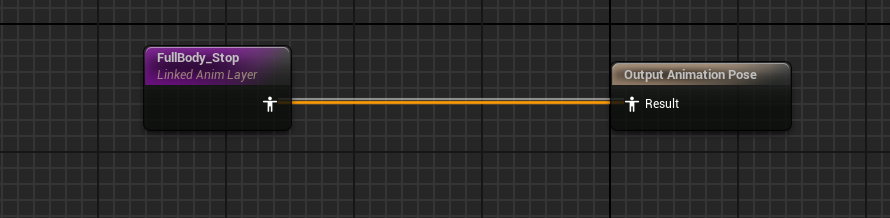
## 实现动画层接口
### 动画蓝图ABP_MyItemLayerBase
- 创建动画蓝图ABP_MyItemLayerBase，类设置中继承动画层接口ALI_MyAnimLayerInterface
- 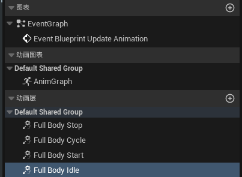
#### 实现FullBodyIdle动画层
- 创建四个变量类型为AnimSequence，不设置具体值
- 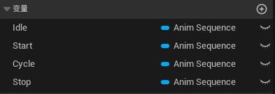
- 双击动画层来实现动画层逻辑，以此为idle，Start，Cycle， Stop，用序列播放器来播放动画序列变量
- 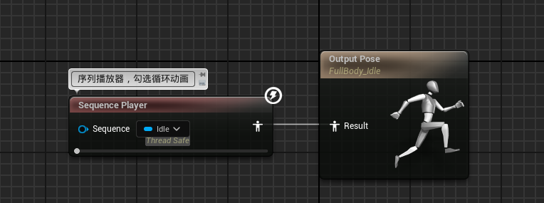
- 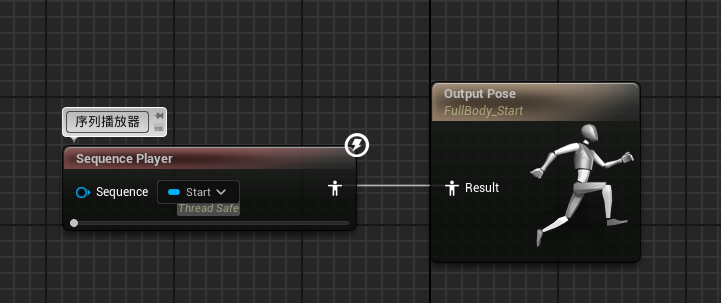
- 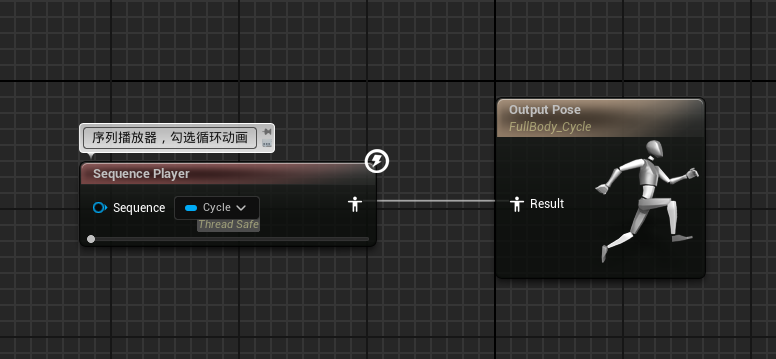
- 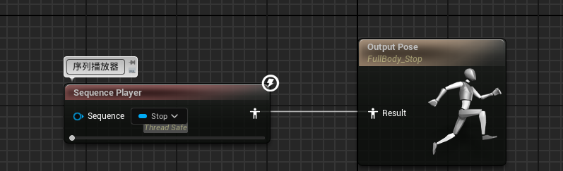
### 动画蓝图ABP_MyPistolLayer_Child
- 创建动画蓝图ABP_MyItemLayerBase的子蓝图ABP_MyPistolLayer_Child
- 在该蓝图类默认值中写入要播放的动画
- 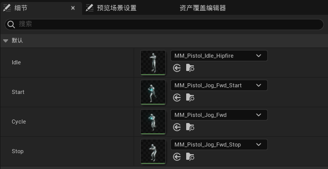
# 角色蓝图
- 在角色蓝图BP_MyCharacter事件图表中链接动画蓝图
- 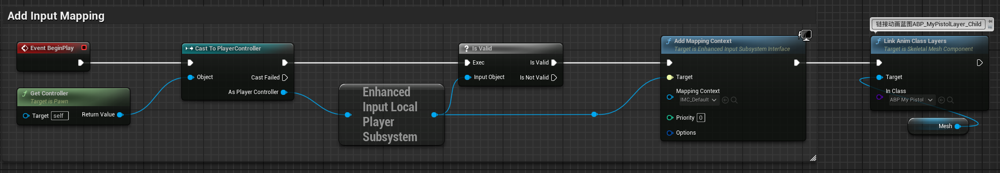
- 这样游戏中就可以看到动画了
# 基础逻辑
- 主动画蓝图ABP_MyAnimationBase处理数据和逻辑，接收动画层的处理结果
- 动画蓝图ABP_MyItemLayerBase用于实现动画层接口的逻辑，只不过动画资产用变量填充
- 动画蓝图ABP_MyItemLayerBase的子蓝图ABP_MyPistolLayer_Child，用于给动画层添加动画资产到变量而已
- 他们都继承了动画层接口ALI_MyAnimLayerInterface
- 角色蓝图BP_MyCharacter的Mesh组件上挂在了主动画蓝图ABP_MyAnimationBase
- 当角色蓝图在事件图表中链接子动画蓝图ABP_MyPistolLayer_Child时，会将动画资产添加到父类ABP_MyItemLayerBase，通过动画层接口传递到ABP_MyAnimationBase供角色调用。
总之，一个动画蓝图用于接收动画层的结果，一个动画蓝图用于实现动画层逻辑，他们都继承了动画层接口，以动画层接口为管道传递动画。