# 距离匹配

通过一个示例工作流程实现，深入探讨虚幻引擎中的距离匹配。

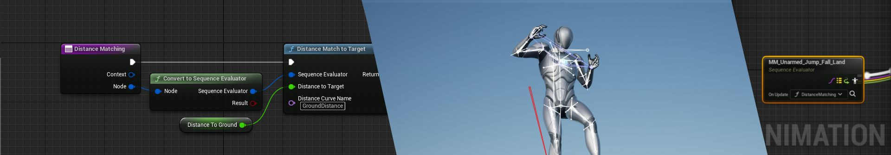

借助 **距离匹配（Distance Matching）** ，[动画序列](https://dev.epicgames.com/documentation/zh-cn/unreal-engine/animation-sequences-in-unreal-engine)可以基于计算得出的距离变量，而非基于时间的线性播放来驱动。本文介绍了距离匹配的概念，并演示了一个工作流程示例。

#### 先决条件

- 启用 **动画移动库（Animation Locomotion Library）** [插件](https://dev.epicgames.com/documentation/zh-cn/unreal-engine/working-with-plugins-in-unreal-engine)。在 **菜单栏（Menu Bar）** 中找到 **编辑（Edit） > 插件（Plugins）** 并找到 **动画（Animation）** 分段中的 **动画移动库（Animation Locomotion Library）** ，或使用 **搜索栏** 。启用插件并重启编辑器。

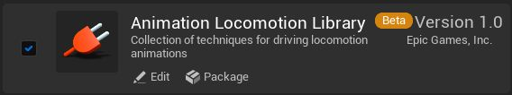

- 拥有一个动画序列。
    
- 拥有有一个浮点变量，用来解算到某个点的距离。
    
- 距离匹配依赖[动画蓝图](https://dev.epicgames.com/documentation/zh-cn/unreal-engine/animation-blueprints-in-unreal-engine)和[动画节点函数](https://dev.epicgames.com/documentation/zh-cn/unreal-engine/graphing-in-animation-blueprints-in-unreal-engine#%E8%8A%82%E7%82%B9%E5%87%BD%E6%95%B0)，因此需要这两方面的基础知识。
    

## 概述

通过距离匹配，你可以使用角色到目标或目标到角色的距离驱动动画序列。动画序列[曲线](https://dev.epicgames.com/documentation/zh-cn/unreal-engine/animation-curves-in-unreal-engine)在动画蓝图逻辑中用于根据特定距离值而不是时间置换所需的姿势，对动画关键帧绘制图形并进行选择。

下面是动画序列编辑器的示例，其中带有时间轴中高亮显示的曲线。

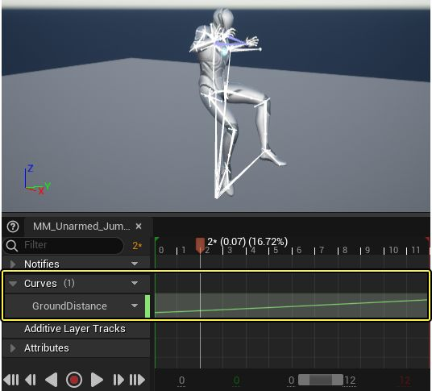

双击曲线，在[曲线编辑器](https://dev.epicgames.com/documentation/zh-cn/unreal-engine/animation-curve-editor-in-unreal-engine)中打开。在曲线编辑器中，你可以访问有关曲线以及用于微调或调整曲线的编辑工具的详细信息。

下面的示例显示了地面距离曲线，它绘制了在x轴上动画序列的姿势，以及y轴上的垂直置换单位，其中y = 0是关卡的地面。在示例曲线中，表示关键帧的三角形总是沿曲线轨迹（绿线）置换。但是，你可以在轨迹上的任意点选择姿势，而不仅仅是关键帧相交处。使用距离匹配，[动画蓝图](https://dev.epicgames.com/documentation/zh-cn/unreal-engine/animation-blueprints-in-unreal-engine)会搜索动画曲线来查找建立了索引的值（由距离变量表示），并输出对应的动画姿势。

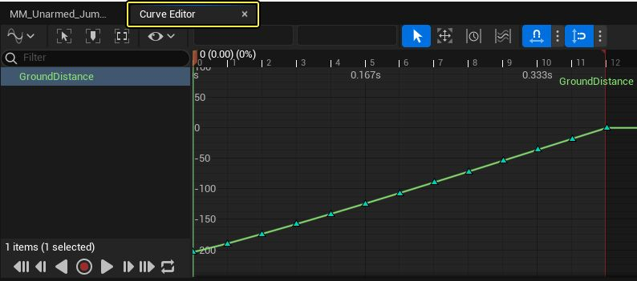

下面是该过程的手动演示。给定离地面-100单位的距离值，姿势位于曲线上大约第6个关键帧处，并选择播放。

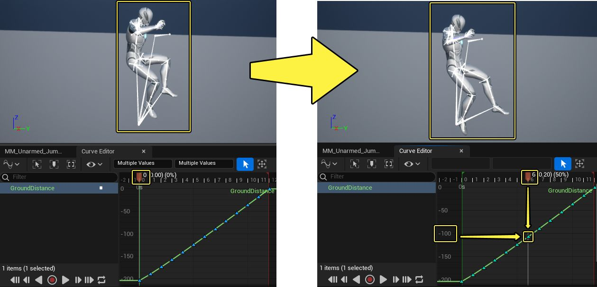

[距离匹配节点](https://dev.epicgames.com/documentation/zh-cn/unreal-engine/distance-matching-in-unreal-engine#%E8%B7%9D%E7%A6%BB%E5%8C%B9%E9%85%8D%E8%8A%82%E7%82%B9%E5%BC%95%E7%94%A8)将使用动画距离曲线来选择动画姿势，以调整动画序列播放。通过距离匹配，动画播放速度可以加快来匹配角色移动速度，从而减少微调动画的需要，并可在不干扰动画播放的情况下改变角色速度。

下面是正在运行的距离匹配的实际实现，位于[Lyra示例项目](https://dev.epicgames.com/documentation/zh-cn/unreal-engine/lyra-sample-game-in-unreal-engine)中。

# 距离匹配工作流程

此工作流程示例演示了距离匹配的基本实现。使用 **Sequence Evaluator** 节点对着陆动画求值，距离匹配会使用 **动画距离曲线（Animation Distance Curve）** 基于从角色位置到地面的剩余距离来选择动画姿势。

### 曲线生成

距离匹配需要动画曲线使用到目标的距离或从目标出发的距离绘制动画姿势的图形。你可以引用该曲线来根据动态距离变量调整动画播放姿势。

例如，第9个关键帧不是基于时间单位阈值过渡到第10个关键帧，而是会基于距离单位阈值发生过渡。

该曲线可以从启用[根骨骼运动](https://dev.epicgames.com/documentation/zh-cn/unreal-engine/root-motion-in-unreal-engine)的动画序列生成。

要生成曲线，请在动画序列编辑器中打开动画序列。找到 **菜单栏（Menu Bar） > 窗口（Windows）**，并在 **资产编辑器（Asset Editor）** 分段中选择 **动画数据修饰符（Animation Data Modifiers）** 以打开窗口。

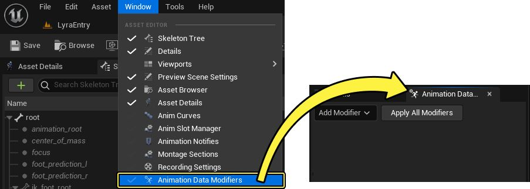

选择 **添加修饰符（Add Modifier）** 并从下拉菜单选择 **距离曲线修饰符（Distance Curve Modifier）** 选项。

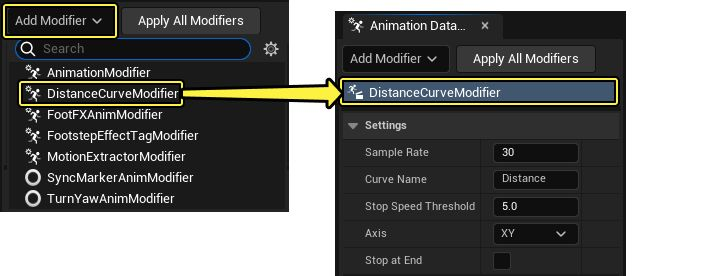

在 **距离曲线修饰符设置（Distance Curve Modifier Settings）** 中，设置生成曲线的参数。

下面是 **距离曲线修饰符属性（Distance Curve Modifier Properties）** 及其函数的列表。

|属性|说明|
|---|---|
|**取样率（Sample Rate）**|确定要为序列生成多少曲线取样。值越大，取样越多且距离曲线精度越高。值为30时，可覆盖大部分用例。|
|**曲线名称（Curve Name）**|定义生成的曲线的名称。|
|**停止速度阈值（Stop Speed Threshold）**|定义角色停止移动或到达动画结束点时的阈值。默认值为0，但角色有时不会在动画完成之前到达0。该属性可用于微调结束阈值，以实现更平滑的过渡。  例如，在枢轴点动画中，角色会改变方向，但可能永远不会完全停止。微调该阈值可指定角色必须慢到什么程度才会"停止"。|
|**轴（Axis）**|确定要考虑的一个或多个运动轴。"Z"很适合着陆动画。"XY"很适合移动过渡（停止、开始、沿枢轴点旋转）。|
|**在结束时停止（Stop at End）**|如果启用，曲线仅声明角色在动画序列的最后一帧上停止了。如果角色已经或可以在动画序列最后一帧之前停止，请启用该属性。|

作为演示，将 **轴属性（Axis property）** 更改为 **Z** 轴，因为动画是根据高度变化匹配的距离。

启用 **在结束时停止（Stop at End）** 设置。

使用 **曲线名称（Curve Name）** 属性命名你的曲线，供以后引用。

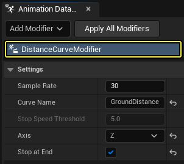

将其他设置保留为默认选项。

点击窗口顶部的 **应用所有修饰符（Apply All Modifiers）** 以生成新曲线。

现在你有了动画距离曲线，就可以使用曲线编辑器窗口中的播放头沿曲线来回移动，查看从目标出发的不同距离值处的动画姿势输出。对于本演示，角色会伸长腿部来接触接近的地面。

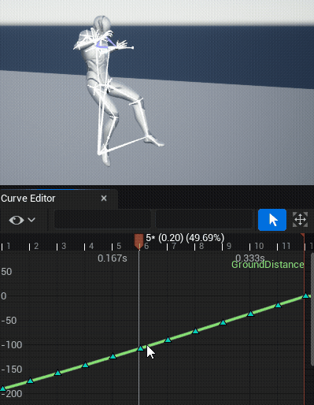

### 压缩

对动画序列进行距离匹配时，需要一个 **统一可索引动画压缩设置（Uniform Indexable Animation Compression Setting）** 资产来取代默认压缩方法，以在运行时读取距离曲线。

要应用该压缩，请创建新的 **动画压缩设置资产（Animation Compression Settings Asset）** 。在 **内容浏览器（Content Browser）** 中右键点击，找到 **创建高级资产（Create Advanced Asset）** 下的 **动画（Animation）** 下拉菜单，然后选择 **曲线压缩设置（Curve Compression Settings）** 。

双击该新 **压缩资产（Compression Asset）** 打开 **细节（Details）** 面板。在 **压缩（Compression）** 下，选择 **统一可索引（Uniform Indexable）** 作为 **编码解码器（Codec）** 选项。

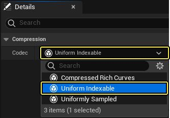

在你进行距离匹配的动画序列中，在 **细节（Details）** 面板中的 **压缩（Compression）** 下分配新的 **曲线压缩设置（Curve Compression Settings）** 资产。

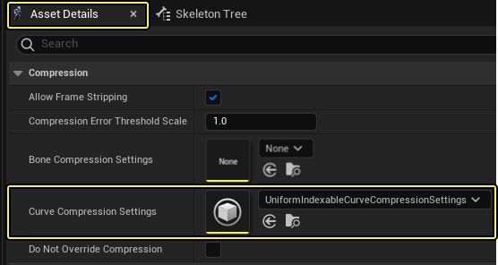

### 动画蓝图

在角色的动画蓝图 **AnimGraph** 中，创建 **Sequence Evaluator** 节点并将其连接到 **Output Pose** 节点。

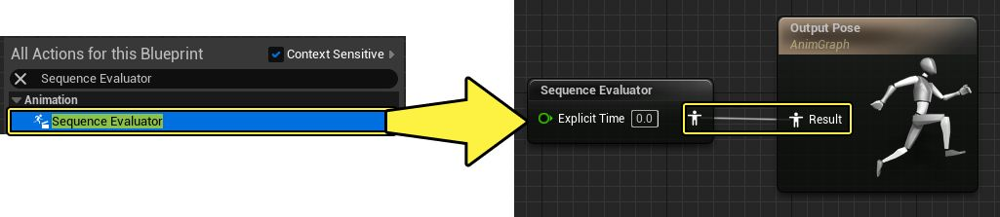

打开Sequence Evaluator节点的 **细节（Details）** 面板，定义要进行距离匹配的动画。

接下来，在 **显式时间（Explicit Time）** 属性中，打开引脚的 **下拉菜单**，并切换 **引脚（Pin）** 类别中的 **动态值（Dynamic Value）** 选项。通过切换 **动态值（Dynamic Value）** 选项，你可以使用动画节点函数设置值。你可以安全地在蓝图中隐藏该引脚。

禁用 **应该循环（Should Loop）** 和 **传送到显式时间（Teleport to Explicit Time）** 。

将 **开始位置（Start Position）** 设置为0，并将 **重新初始化行为（Reinitialization Behavior）** 设置为依赖 **显式时间（Explicit Time）** 。

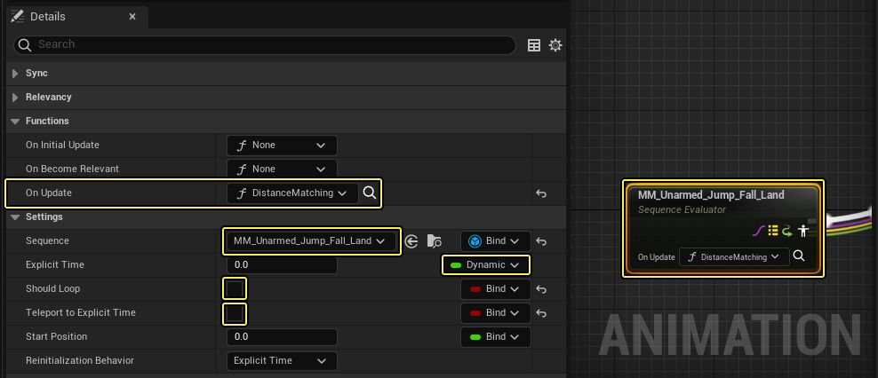

定义Sequence Evaluator节点的属性后，在Sequence Evaluator节点上创建[动画节点函数](https://dev.epicgames.com/documentation/zh-cn/unreal-engine/graphing-in-animation-blueprints-in-unreal-engine#%E8%8A%82%E7%82%B9%E5%87%BD%E6%95%B0)来驱动逻辑。要创建该内部函数，请找到Sequence Evaluator节点的 **细节（Details）** 面板中的 **函数（Functions）** 分段。在 **更新时（On Update）** 属性中，打开 **下拉菜单** 并选择 **+创建绑定（+Create Binding）** 。

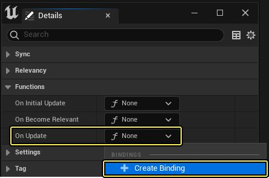

你可以在 **细节（Details）** 面板中重命名该函数。在此示例中，函数命名为"Distance Matching"。

该函数将在 **蓝图编辑器视口（Blueprint Editor Viewport）** 窗口中的新选项卡中打开。

在函数的 **In** 和 **Out** 节点之间，创建 **Distance Match to Target** 节点。

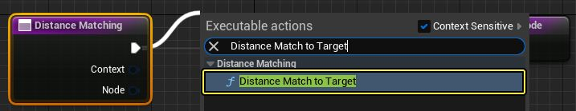

接下来，拖移 **Distance Match to Target**节点的 **节点输出引脚（Node output pin）** ，并创建 **Convert to Sequence Evaluator** 浮点函数（绿色）节点。

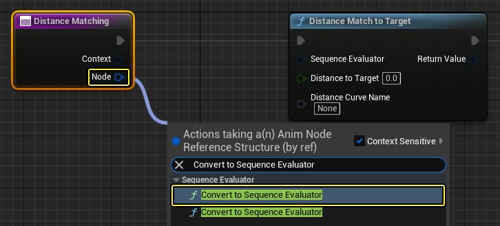

将 **Convert** to **Sequence Evaluator** 节点的 **序列求值器（Sequence Evaluator）** **输出引脚** 连接到 **Distance Match** **To Target** 的 **序列求值器（Sequence Evaluator）输入引脚** 。

调用 **浮点变量（Float Variable）** 的实例，以计算从目标出发的距离。在此示例中，该变量测量从角色到地面的距离，称为 **到地面的距离（Distance to Ground）** 。

在 **Distance Match to Target** 节点上，定义你的 **距离曲线名称（Distance Curve Name）** 。

**保存（Save）** 并 **编译（Compile）** 蓝图，现在你可以在 **动画预览视口（Animation Preview Viewport）** 中看到距离匹配的结果。

### 结果

运行动画时，在 **视口设置（Viewport Settings）** 的 **场景设置（Scene Setup）** 分段中，你可以调整 **地板高度偏移（Floor Height Offset）** 属性以显示正在运行的距离匹配。在启用并实现距离匹配后，随着你改变角色和地面之间的距离，Sequence Evaluator节点将从曲线选择动画姿势。这将创建更自然的着陆动画，其中角色对接近的地面做出动态反应。动画序列还可以通过距离匹配做出调整，以适应角色的坠落速度变化，而无需重新制作序列的动画来匹配调整的坠落速度。

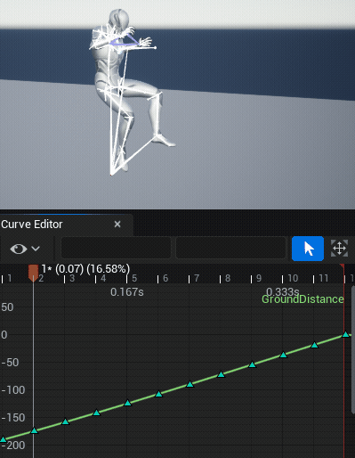

下面是示例工作流程中用于实现Sequence Evaluator节点中的距离匹配的完整动画节点函数蓝图。

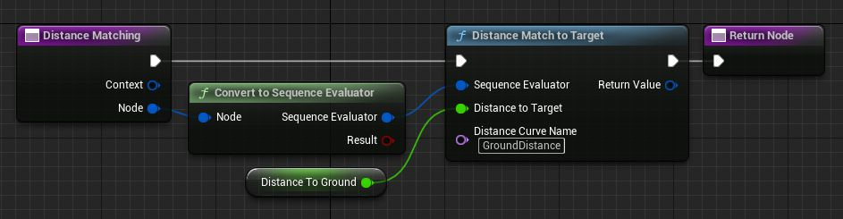

## 距离匹配节点引用

下面是在动画节点函数中运行的距离匹配节点的列表。

### 距离匹配到目标
**Distance Match To Target**  一般用于停止过渡动画，节点将使用动画资产移动曲线和预测的目标点距离来选择动画姿势，以缩放动画播放速度来匹配角色速度。

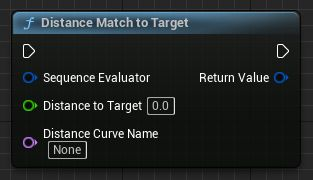

在工作流程演示的[动画蓝图](https://dev.epicgames.com/documentation/zh-cn/unreal-engine/distance-matching-in-unreal-engine#%E5%8A%A8%E7%94%BB%E8%93%9D%E5%9B%BE)小节下，动画节点函数中实现了Distance Match To Target节点。

### 按距离匹配推进时间

**Advance Time By Distance Matching**，一般用于开始过渡动画， 节点将按角色每帧行进的距离将连接的 **Sequence Evaluator** 节点向前推进。

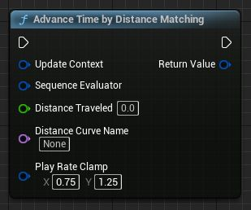

该节点需要动画距离曲线绘制根骨骼行进距离的图形，以从中选择动画姿势，还需要一个变量来测量行进距离。

### 设置播放速度以匹配速度

**Set Playrate to Match Speed** 节点一般用于循环动画，将设置 **Animation Sequence Player** 节点的播放速度，以使动画的速度匹配角色的移动速度，假定角色的移动速度保持不变。

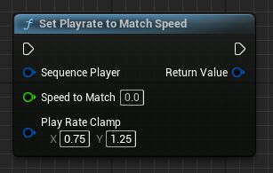
