# 概述
- 添加距离匹配、步幅匹配和同步组
- 所有调用的动画资产都要用动画修改器DistanceCurveModifier（继承自Animation Locomotion Library插件）生成Distance曲线
- 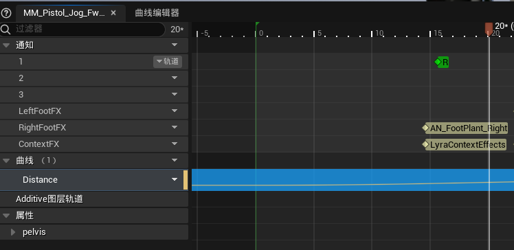
- 动画资产的曲线压缩设置要设置为UniformIndexableCurveCompressionSettings
- 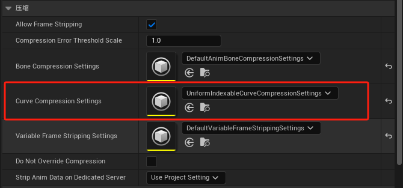
- 创建该曲线压缩设置文件，动画动画资产设定好压缩设置后，在曲线压缩设置文件点击压缩
- 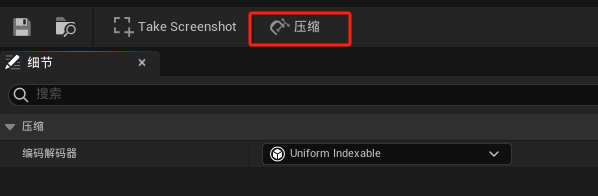
- 具体内容查看[1.1.0-距离匹配原理](1.1.0-距离匹配原理.md)
# 动画蓝图
## ABP_MyAnimationBase
- 创建函数Update Location Data
- 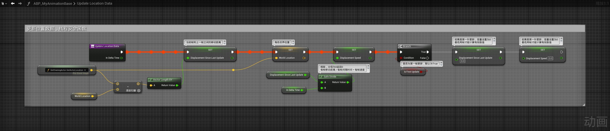
- 在BlueprintThreadSafeUpdateAnimation函数中调用
- 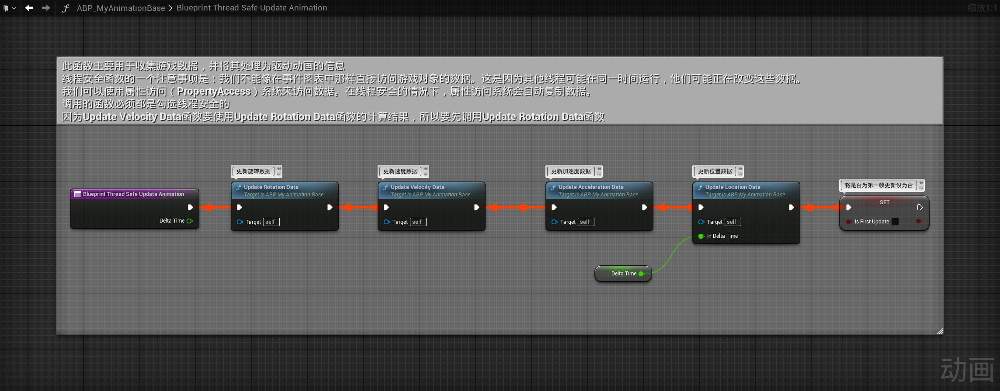
## ABP_MyItemLayerBase
- 创建函数Get Main ABPThread Safe来获取主动画蓝图实例
- 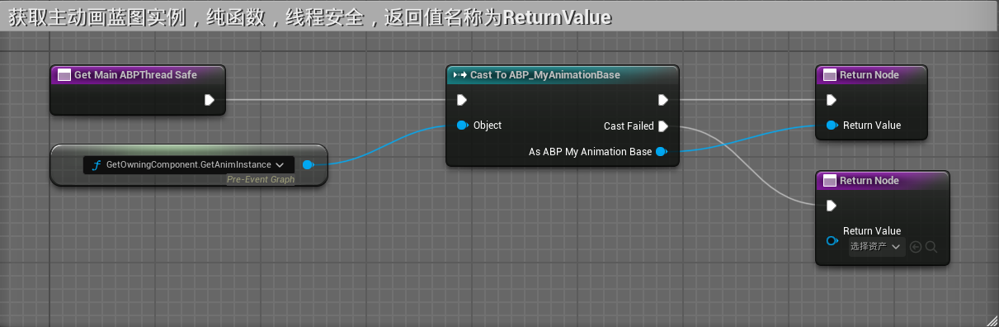
### FullBodyStart动画层
- 在FullBodyStart动画层中，将之前的序列播放器替换为序列求值器，按照动画资产的距离曲线（DIstance）来播放动画帧而非动画时间
- 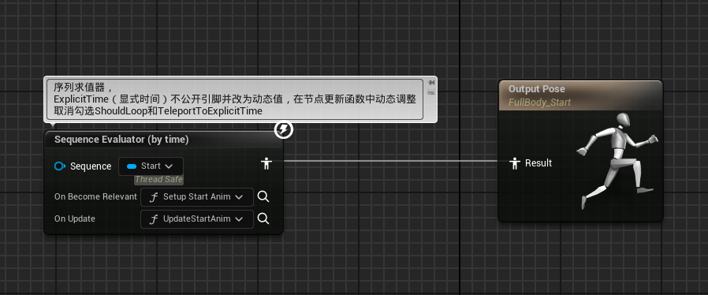
- 节点设置
- 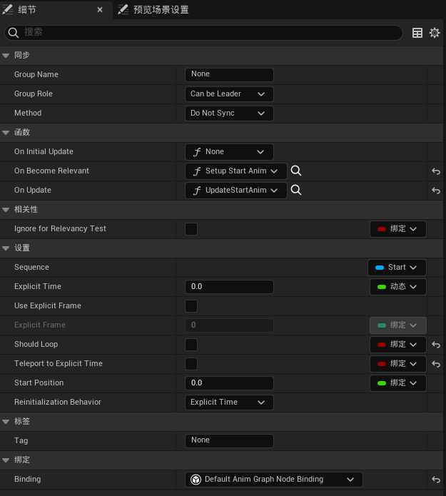
	- ExplicitTime（显式时间）不公开引脚并改为动态值，在节点更新函数中动态调整
	- 取消勾选ShouldLoop和TeleportToExplicitTime
	- 在OnBecameRelevant（当节点相关时，即节点权重0-1时）绑定函数Setup Start Anim
	- 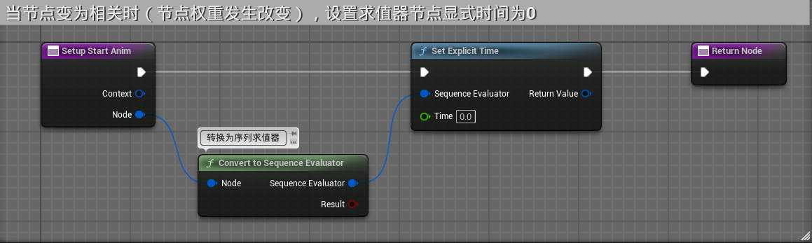
	- 在OnUpdate绑定函数UpdateStartAnim
	- 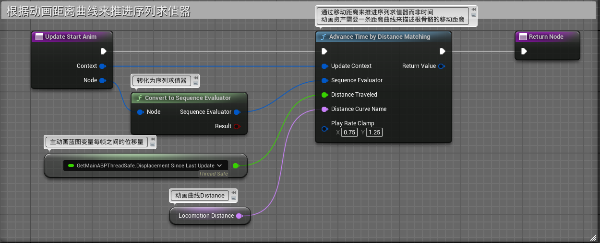
### FullBodyCycle动画层
- Cycle状态是一个循环动画，因此根据距离曲线调整播放时间是不行的，要调整播放速率。因此使用序列播放器，勾选循环动画，play rate设为动态值，在函数中更新
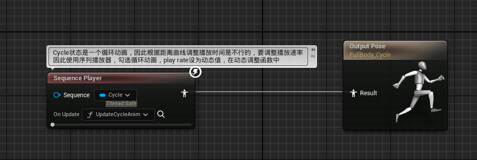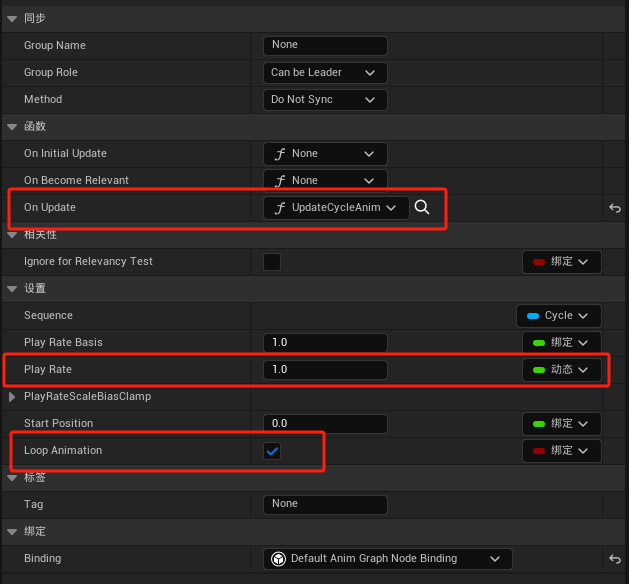
- OnUpdate函数Update Cycle Anim
- 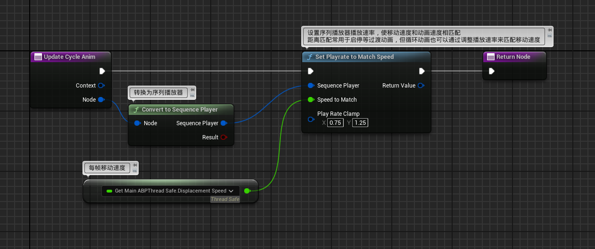
### FullBodyStop动画层
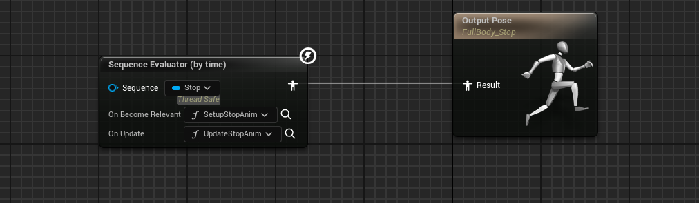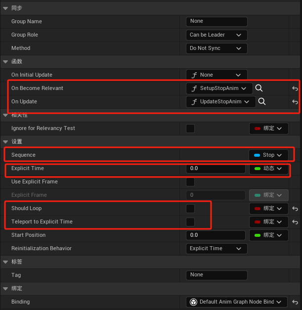
- 其中在OnBecameRelevant（当节点相关时，即节点权重0-1时）绑定函数Setup Stop Anim
- 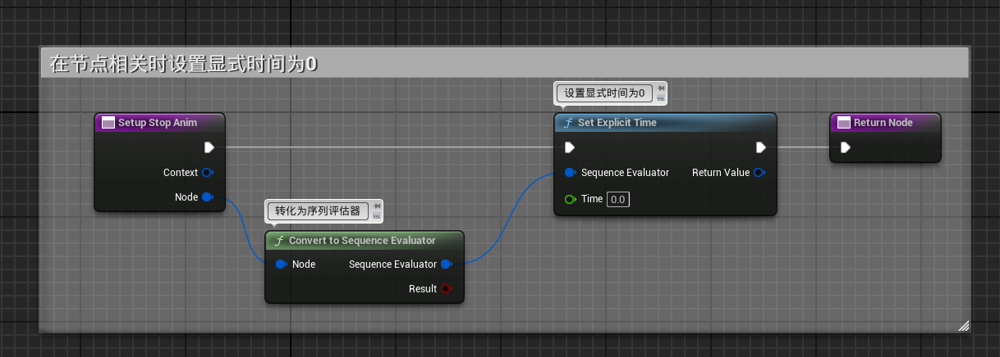
- OnUpdate函数Update Stop Anim
- 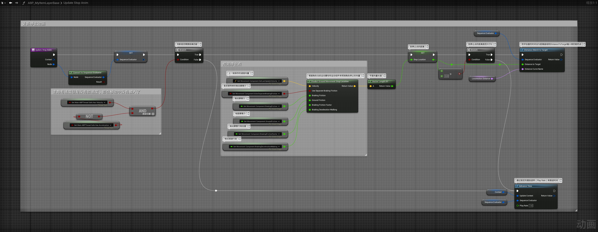