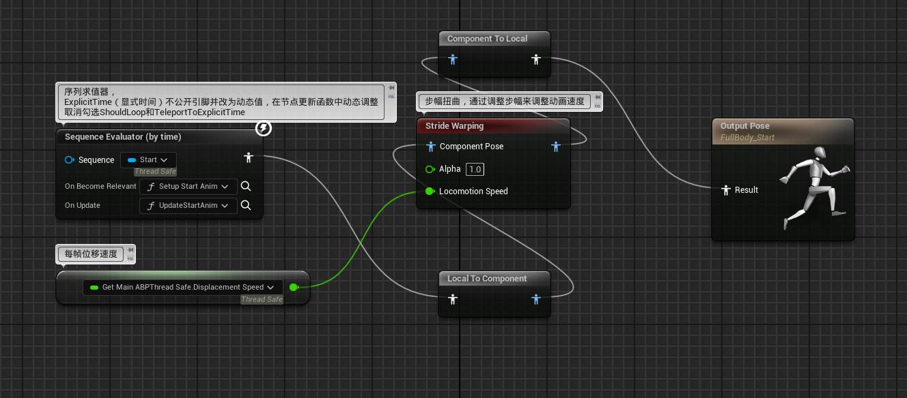
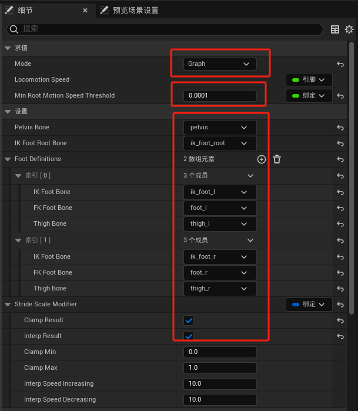
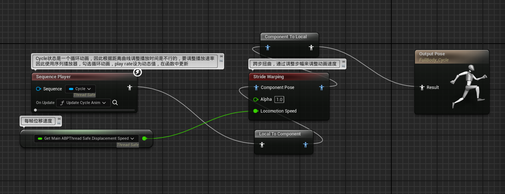
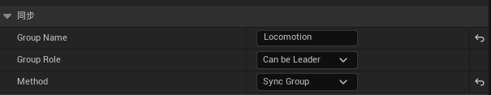

# 概述
- 步幅匹配，使用Stride Warping（步幅扭曲）节点动态调整角色的动画步幅来匹配胶囊体移动速度
- 同步组用于不同动画资产之间脚步的匹配
# 步幅匹配
## ABP_MyItemLayerBase
- 在FullBodyStart动画层中添加StrideWarping节点
- 
- 节点设置，由图表驱动计算而非手动，最小根动画移动阈值为0.0001，以及其他的骨骼设置，开启限制和插值
- 
- 在FullBodyStart动画层中添加StrideWarping节点
- 
- 节点设置同FullBodyStart动画层
# 同步组
- ABP_MyItemLayerBase
- 所有要同步的动画资产都要打上同步标识，使用SyncMarkerAnimModifier动画修改器
- 在FullBodyStart动画层和FullBodyCycle动画层中添加同步组
- 