# 概述
- 使用Orientation Warping（朝向扭曲）节点来实现八向移动。Orientation Warping节点会将方向性补偿扭曲应用于运行中的动画。使用此节点，你可以隔离并扭曲动画姿势的腿部IK骨骼，以契合根骨骼运动的动态更新移动方向。该姿势还将沿指定轴扭转脊柱骨骼，以维持面向角度。也就是下半身朝向输入方向，上半身维持面向角度。
# BP_MyCharacter
- 在角色蓝图中设置Movement Component的属性，取消勾选OrientRotationToMovement，不让角色旋转朝向运动方向
- 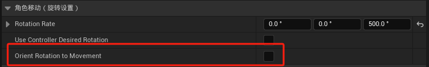
- 在类默认值中勾选UseControllerRotationYaw，使用控制器（鼠标输入）来控制角色Yaw轴旋转
- 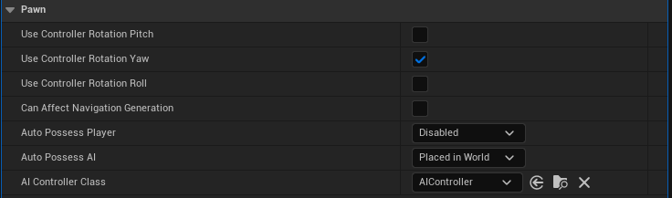
# ABP_MyAnimationBase
- 更新Update Velocity Data函数，添加上一帧是否移动变量
- 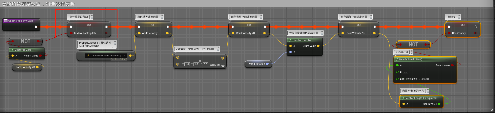
- 创建函数Select Cardinal Direction from Angle，根据速度向量（输入方向）和角色旋转的夹角判断移动方向
- 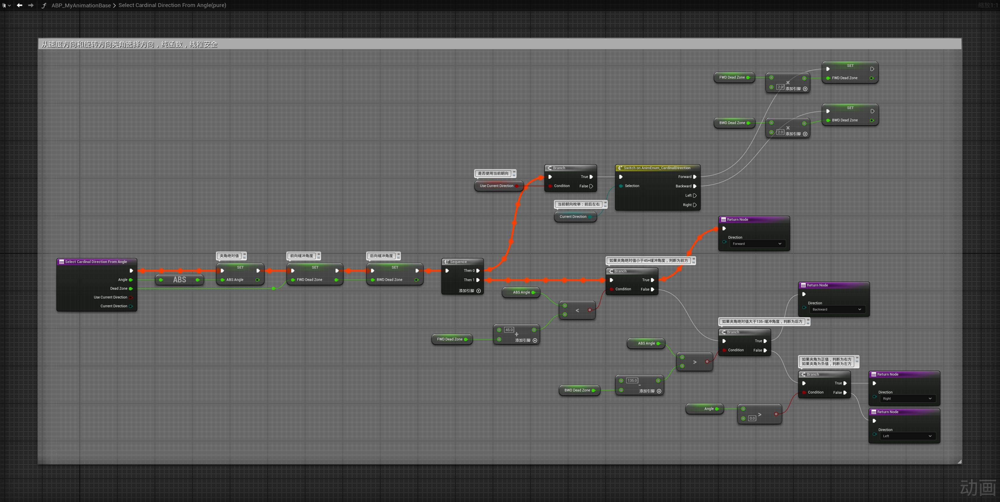
- 其原理为
- 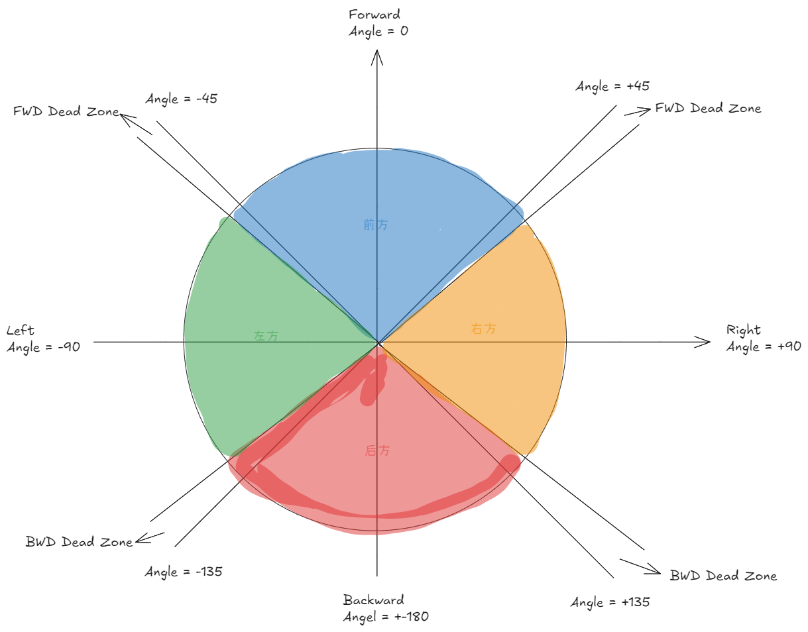
	- 如果夹角绝对值小于45+缓冲角度，判断为前方
	- 如果夹角绝对值大于135-缓冲角度，判断为后方
	- 如果夹角为正值，判断为右方
	- 如果夹角为负值，判断为左方
	- 如果角色正在移动中，就要使用当前朝向，则缓冲区 * 2，放大缓冲区
- 创建函数Update Cardinal Direction From Velocity，根据速度向量和角色旋转更新基数方向
- 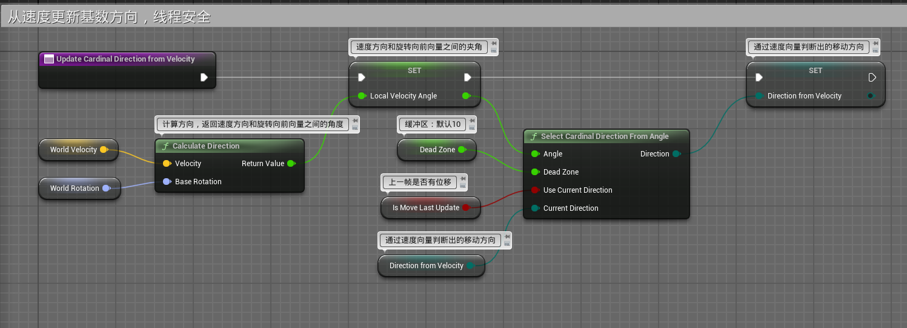
- 在BlueprintThreadSafeUpdateAnimation函数中调用
- 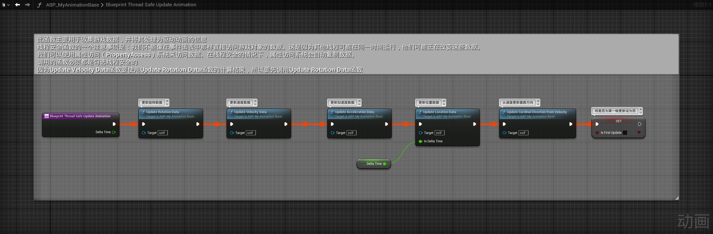
# ABP_MyItemLayerBase
- FullBodyStart动画层中，将序列求值器的序列清除，设为动态值，我们要根据移动方向动态的调整动画
- 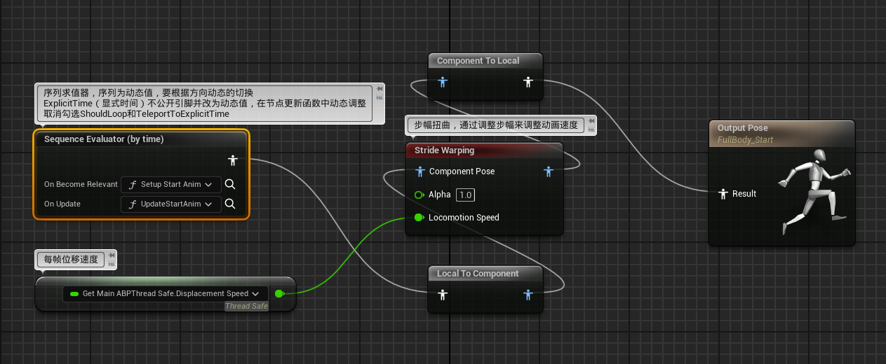
- 序列求值器设置
- 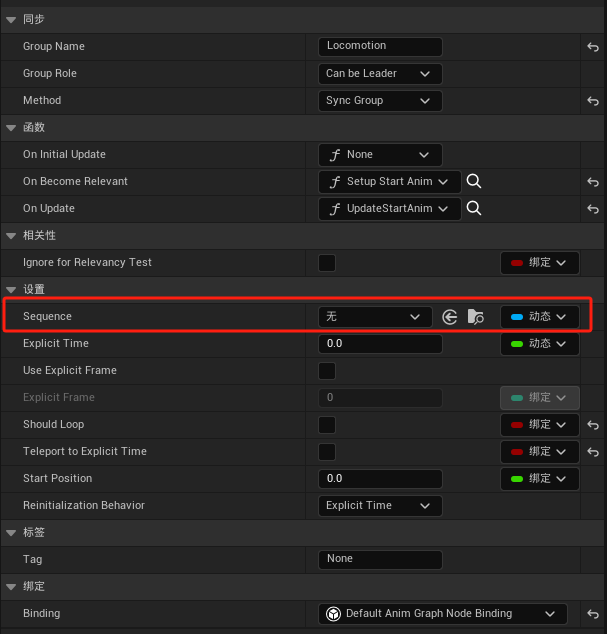
- 更新OnBecameRelevant绑定的Setup Start Anim函数
- 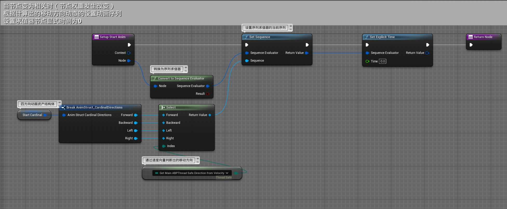
- FullBodyCycle动画层中，将序列求值器的序列清除，设为动态值，我们要根据移动方向动态的调整动画
- 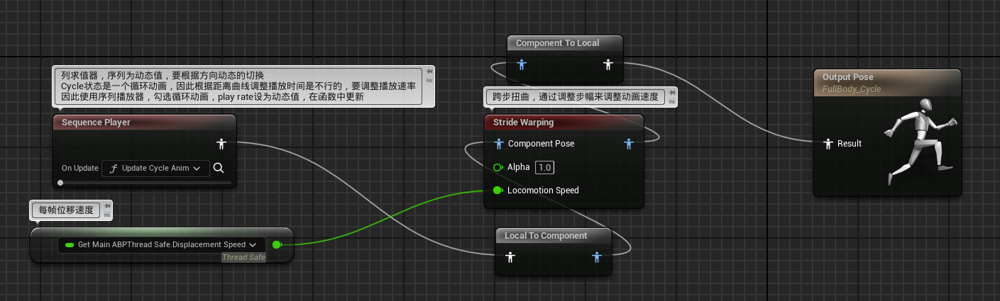
- 序列求值器设置
- 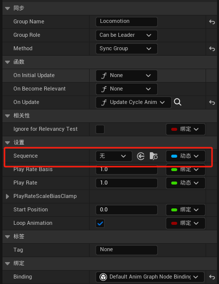
- 在OnUpdate绑定函数UpdateCycleAnim中
- 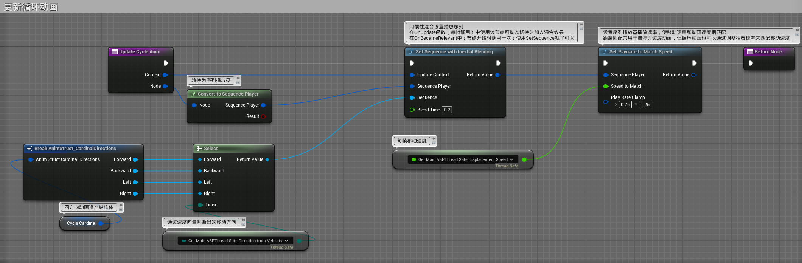
- FullBodyStop动画层中，将序列求值器的序列清除，设为动态值，我们要根据移动方向动态的调整动画
- 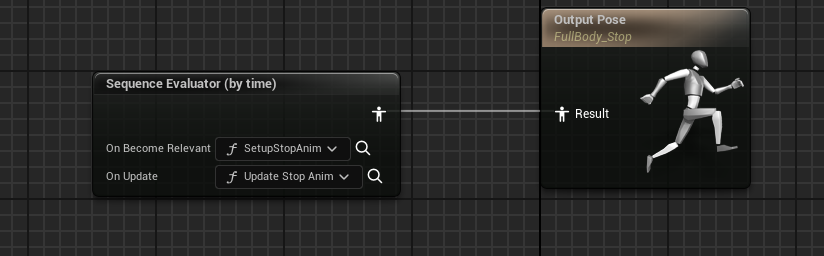
- 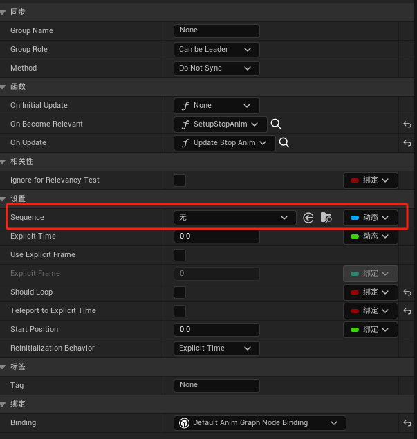
- 在更新OnBecameRelevant绑定的Setup Stop Anim函数
- 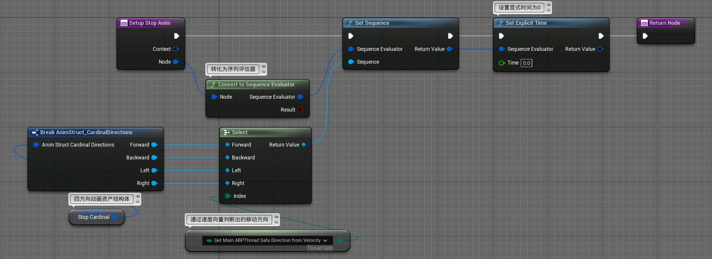
# ABP_MyPistolLayer_Child
- 在子蓝图类默认值中配置动画资产
- 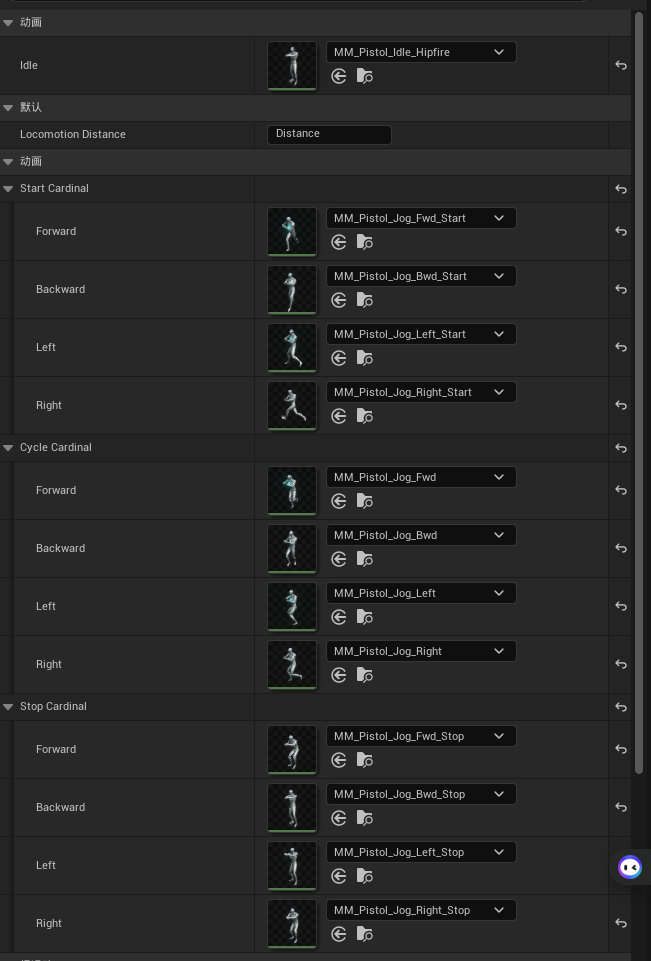
# 四向移动变八向移动
- 通过OrientationWarping（朝向扭曲）节点将四向移动变为八向移动
## ABP_MyItemLayerBase
- 在FullbodyStart动画层中添加OrientationWarping（朝向扭曲）节点
- 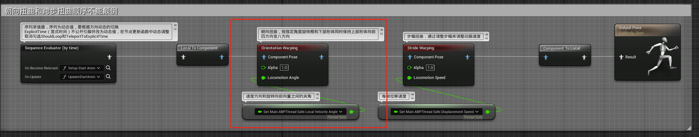
- 节点设置
- 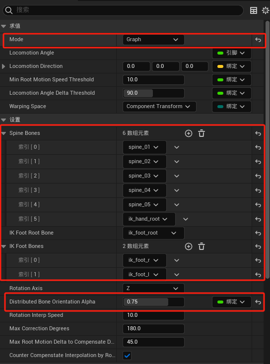
- 在FullbodyCycle动画层中如法炮制
- 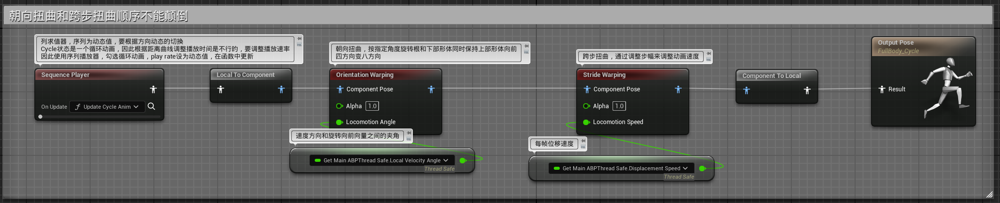
- 这样八向移动就制作完成了，运行一下试试吧！比心！