本文基于：
- https://dev.epicgames.com/documentation/en-us/metahuman/metahuman-documentation
# 安装MetaHuman创建器核心数据和插件
- 在虚幻引擎的选项中[Open: 8.0-MetaHuman For Maya-1763959247766.png](../../MAYA/Rigging/常用算法和问题/attachments/95ca4183a06982291f6784d8a1b146a1_MD5.jpg)
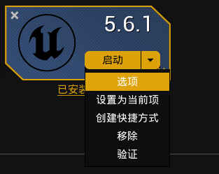
- 勾选MetaHumanCreatorCoreData
- [Open: 8.0-MetaHuman For Maya-1763959291673.png](../../MAYA/Rigging/常用算法和问题/attachments/e3c981878add001107375b11ec2b2f99_MD5.jpg)

- 启动引擎后勾选所有关于MetaHuman的插件
- [Open: 8.0-MetaHuman For Maya-1763959341225.png](../../MAYA/Rigging/常用算法和问题/attachments/f6f24d74f64f404796e221a51a033cc8_MD5.jpg)
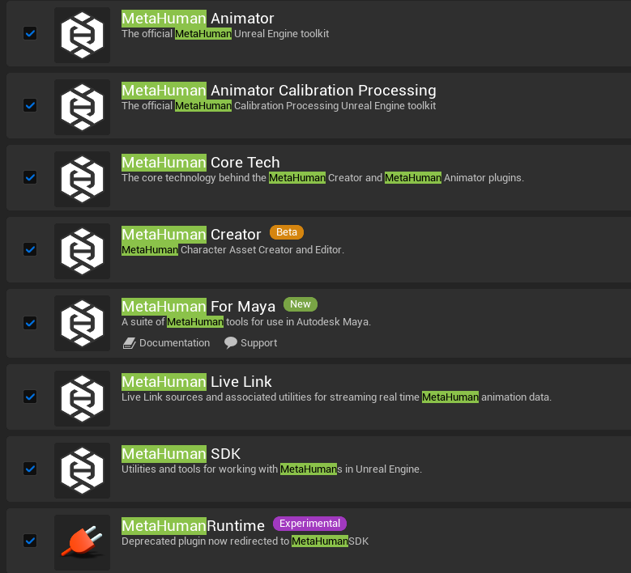
- 其中MetaHumanForMaya需要Fab上下载安装
- [Open: 8.0-MetaHuman For Maya-1763959422481.png](../../MAYA/Rigging/常用算法和问题/attachments/804631b4ab6e4d7b293c1aee9fa8022a_MD5.jpg)
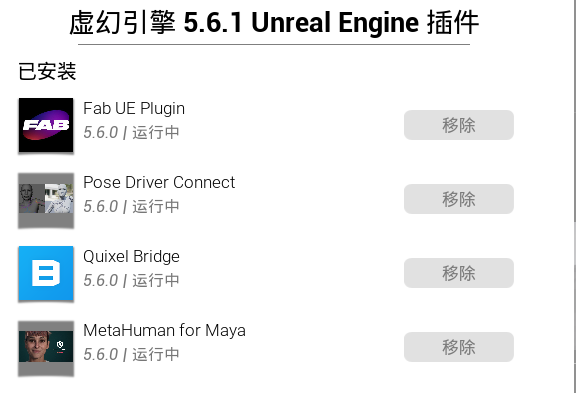
- 在maya中安装MetaHumanForMaya，并启用插件
	- H:\EpicGames\UE_5.6\Engine\Plugins\Marketplace\MetaHumanForMaya_5.6\Content\MetaHumanForMaya-v1.1.14.msi
	- 不建议在同一会话中使用Quixel Bridge Maya插件（`MayaUERBFPlugin.mll`和`embeddedRL4.mll`）和MetaHuman for Maya。
# 从Quixel Bridge下载Metahuman（旧方法）
- Metahuman资产如果下载缓慢，最好开梯子。如果超过三小时下载项目会被停止，不会续传。
- 下载开始一段时间之后，点击
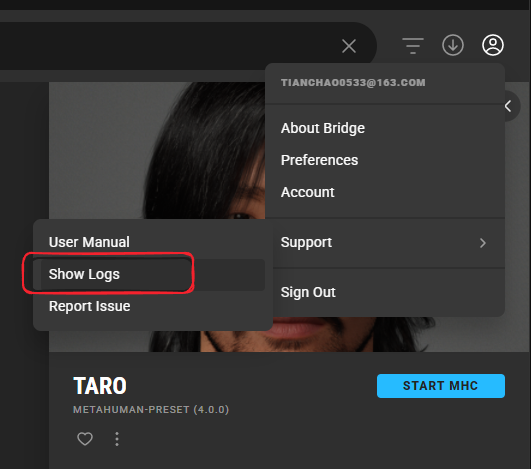

- 
- 打开log文件查找metahuman的名称，名称在downloaded-assets文件夹内

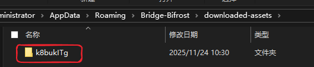

- 一直查找下一个，直到找到下载网址，将网址粘贴进浏览器进行下载，有两个网址，一个是图片PNG一个是压缩包ZIP，可以都下载
- 
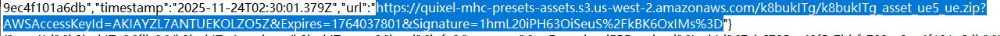
- 资产下载完成之后打开Quixel Bridge的preference选项找到下载目标地址
- 
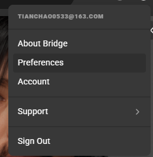[Open: 8.0-MetaHuman For Maya-1763953039464.png](../../MAYA/Rigging/常用算法和问题/attachments/b7495eb886d23e31aabc51245885fda1_MD5.jpg)
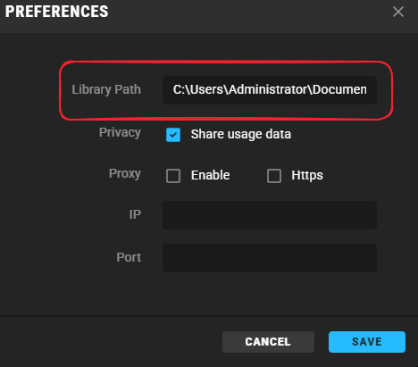
- 在路径下重新按照官方要求布置文件夹
- Megascans Library\Downloaded\UAssets\metahuman角色编号\Tier0\asset_ue\压缩包解压内容
[Open: 8.0-MetaHuman For Maya-1763955447767.png](../../MAYA/Rigging/常用算法和问题/attachments/e1917abc309999ed683465cefb708efc_MD5.jpg)
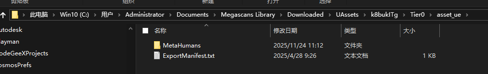
- 在k8bukITg文件夹下放置图片和一个json文件（查看之前的怎么写的，改一下就行）
- [Open: 8.0-MetaHuman For Maya-1763954944364.png](../../MAYA/Rigging/常用算法和问题/attachments/324153b6252f4b9236b3f9acac38a3d2_MD5.jpg)
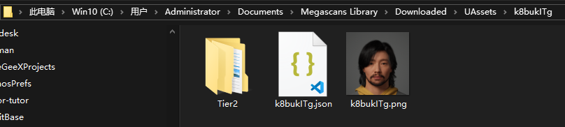
```json
{
    "name": "Taro",
    "preview": "C:\\Users\\Administrator\\Documents\\Megascans Library\\Downloaded\\UAssets\\k8bukITg\\k8bukITg.png",
    "previews": {
        "images": {
            "aspectRatio": 1,
            "preview": "C:\\Users\\Administrator\\Documents\\Megascans Library\\Downloaded\\UAssets\\k8bukITg\\k8bukITg.png",
            "thumb": "C:\\Users\\Administrator\\Documents\\Megascans Library\\Downloaded\\UAssets\\k8bukITg\\k8bukITg.png",
            "thumbJpg": "C:\\Users\\Administrator\\Documents\\Megascans Library\\Downloaded\\UAssets\\k8bukITg\\k8bukITg.png",
            "thumbRetina": "",
            "thumbRetinaJpg": ""
        }
    },
    "missingLODs": false,
    "isDHIAsset": true,
    "points": 0,
    "createdAt": 1655258579.148,
    "updatedAt": 1655278765.807,
    "id": "k8bukITg",
    "asset": "k8bukITg",
    "type": "metahuman",
    "assetType": "metahuman",
    "categories": [],
    "category": "",
    "subCategory": "",
    "objectID": "k8bukITg",
    "contains": [],
    "theme": [],
    "descriptive": [],
    "href": {
        "pathname": "",
        "search": ""
    },
    "pack": null,
    "tags": [],
    "environment": {
        "biome": "",
        "region": ""
    },
    "version": 1,
    "averageColor": "",
    "properties": [],
    "revision": 0,
    "meta": [
        {
            "key": "",
            "name": "",
            "value": ""
        }
    ],
    "semanticTags": {
        "assetCategories": {
            "metahuman": {}
        },
        "subject_matter": "",
        "name": "Taro",
        "latin_name": [],
        "asset_type": "metahuman",
        "contains": [],
        "theme": [],
        "descriptive": [],
        "environment": [],
        "season": [],
        "interior_exterior": [],
        "architectural_style": {},
        "state": [],
        "country": "",
        "region": "",
        "industry": [],
        "3d_mesh": "",
        "resolution": "",
        "locations": {},
        "maxSize": "",
        "minSize": ""
    }
}
```
- 点击Add按钮，弹出选项中选择迁移
- [Open: 8.0-MetaHuman For Maya-1763957687382.png](../../MAYA/Rigging/常用算法和问题/attachments/e63605c44277673049cc4bbb1e0ff3d0_MD5.jpg)

- 会将MetaHuman的资产迁移至虚幻引擎
- [Open: 8.0-MetaHuman For Maya-1763965970002.png](../../MAYA/Rigging/常用算法和问题/attachments/8028418dad5e51134bfc17d34c165b90_MD5.jpg)
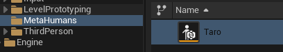
# 在unreal engine中创建MetaHuman（新方法）
- 创建一个Metahuman Character资产
- [Open: 8.0-MetaHuman For Maya-1764037436021.png](../../MAYA/Rigging/常用算法和问题/attachments/fa55470b1f68792c47fc75ef26700aa6_MD5.jpg)

- 打开资产，场景内会有一个预设角色，自定义即可，在自定义中可使用自定义模型来组装MetaHuman
	- 源身体网格体采用标准的MetaHuman拓扑。
	- 源身体网格体拓扑具有标准的MetaHuman UV布局。
	- 如果导入关节，你必须保留原始的关节层级和命名规范。
- 要适配没有标准MetaHuman拓扑的身体网格体，例如不同的顶点顺序、三角剖分的多边形或不同的顶点数量，请启用**_按UV匹配顶点_（Match Vertices by UVs）**。
- 从UE将MetaHuman骨骼网格体导出为`.fbx`将导致非标准的MetaHuman拓扑（在UV边界进行三角剖分、分割顶点）。 要使用这些网格体进行适配，你必须启用_"按UV匹配顶点（Match Vertices by UVs）"_选项。
- 选择身体模型
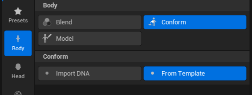
- 选择头部模型，需要四个模型：头部，左眼，右眼，牙齿
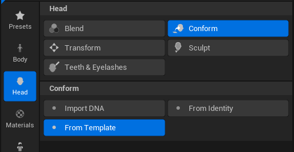
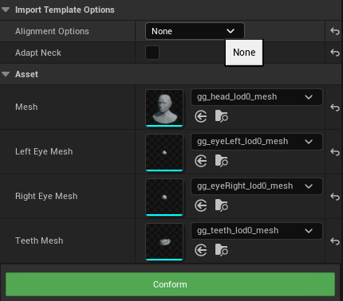
- 最后可组装为DCC导出或UE内使用
- [Open: 8.0-MetaHuman For Maya-1764038398700.png](../../MAYA/Rigging/常用算法和问题/attachments/eeb7a20c0f656133d354eb6a6345904b_MD5.jpg)
- 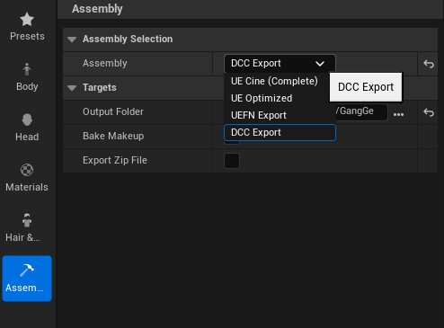
	- **UE电影级（UE Cine）**是指unreal engine Cinema高质量组装，用于对质量要求高于性能的离线电影级渲染和实时渲染。
	- **UE优化版（UE Optimized）** 是指可自定义质量组装，此组装管线提供高、中、低三种优化级别。
	- UEFN Export是指UEFN堡垒之夜编辑器导出
	- DCC Export 是指3D软件导出，可供Maya、Houdini等第三方DCC软件直接使用。
# 载入metahuman,导出DNA文件

- 双击打开资产，并点击左上角的CreateFullRig，需要挂梯子链接服务器
- [Open: 8.0-MetaHuman For Maya-1763966070168.png](../../MAYA/Rigging/常用算法和问题/attachments/cb2074fc9936955d6822515f75210bdf_MD5.jpg)

- 点击DownloadTextureSource，下载材质贴图
- [Open: 8.0-MetaHuman For Maya-1763966387976.png](../../MAYA/Rigging/常用算法和问题/attachments/099c4fc3d667818d5ce774698cde17b5_MD5.jpg)

- 之后进入组装（Assemble）菜单，进行设置组装为DCC导出，并设置导出路径
- [Open: 8.0-MetaHuman For Maya-1763966599837.png](../../MAYA/Rigging/常用算法和问题/attachments/871bc817f6a18a8b56c6fc5e4d70eaab_MD5.jpg)
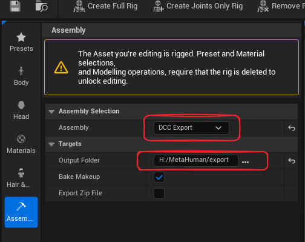
- 然后点击最下方的绿色组装（Assemble）按钮
