- 自定义模型要组装为MetaHuman，要实现与MetaHuman角色相同的拓扑和UV结构，有两种方法
# 使用**MetaHuman Identity**：
- https://dev.epicgames.com/documentation/zh-cn/metahuman/from-mesh
- 导入自定义模型或扫描模型，给头部一个材质和颜色贴图
- [Open: 2.0-自定义模型-1764144482586.png](attachments/81802af2e4921bd6801f30747e374caf_MD5.jpg)
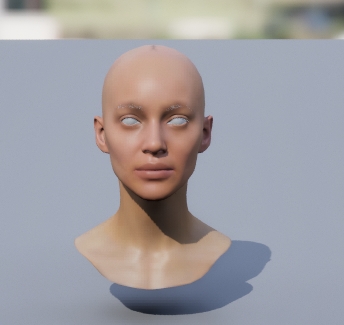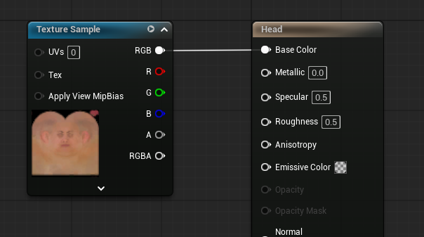

- 创建一个**MetaHuman Identity**文件并打开
- [Open: 2.0-自定义模型-1764144613972.png](attachments/45e49064ba7c75f2a04e90b9d98730af_MD5.jpg)
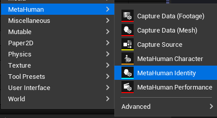
- 点击创建组件，加载扫描模型
- [Open: 2.0-自定义模型-1764144757008.png](attachments/9212a74cd9f607e08d528ca5ef239f0b_MD5.jpg)
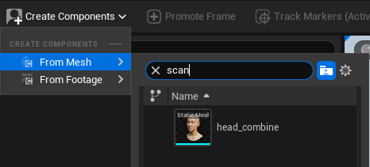
- 推荐使用无光照（Unit），FOV设为20
- 点击主工具栏中的提升帧（Promote Frame），或底部工具栏的 + 号按钮。
- [Open: 2.0-自定义模型-1764145055845.png](attachments/d8cf1cc4283e8b41a5f3c7b92d41db32_MD5.jpg)

- 在下方蓝色帧中右键选择自动追踪
- [Open: 2.0-自定义模型-1764145142044.png](attachments/a71f7a4cf6fc7eb0486732871d8d7275_MD5.jpg)
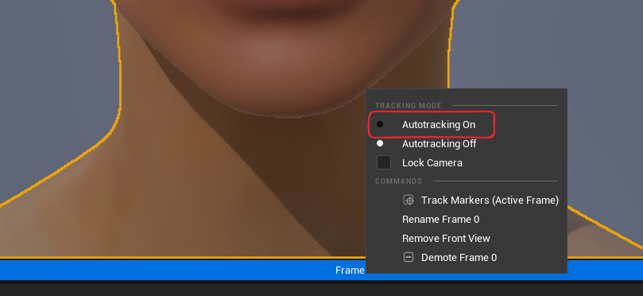
- 然后开始调整追踪位置
- [Open: 2.0-自定义模型-1764145163203.png](attachments/ff726ddac3df1a6d7bc7e0b8c48f72d6_MD5.jpg)
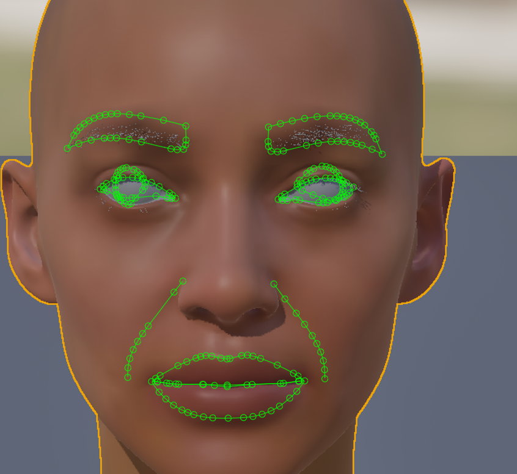
- 追踪结果满意后，在下方蓝色帧中右键选择锁定摄像机
- [Open: 2.0-自定义模型-1764145763326.png](attachments/acee888429cef325a852d70909a34a35_MD5.jpg)
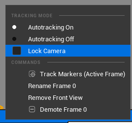
- 可以点击track markers开始自定义修改定位器
- [Open: 2.0-自定义模型-1764145883754.png](attachments/189f066df930980397573ba1881d87fd_MD5.jpg)
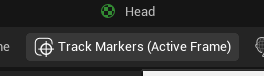
- 最终修改满意后点击Metahuman Identity Solve
- [Open: 2.0-自定义模型-1764147270422.png](attachments/a35c7f6201710b8c7ad67f7cd15dac93_MD5.jpg)
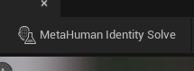
- 可以观察效果
- [Open: 2.0-自定义模型-1764147715512.png](attachments/b164b34762fe785600857fd0570dad38_MD5.jpg)
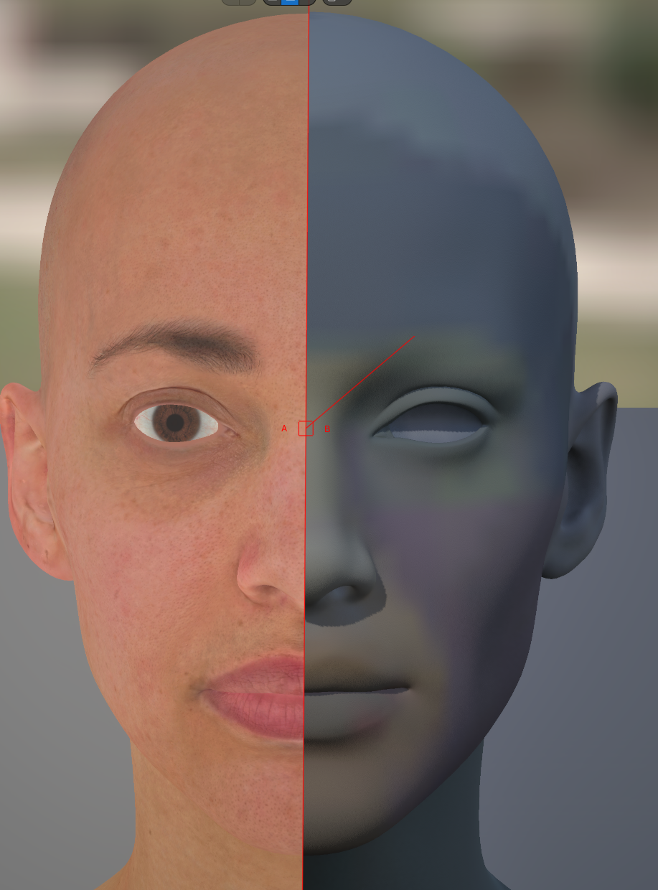
- 最后点击AutoRigMetaHumanIdentity，场景内会生成一个新的skeletalMesh
- [Open: 2.0-自定义模型-1764147769271.png](attachments/63195148be42040c03781285fb3a1a77_MD5.jpg)

- 创建一个MetaHumanCharacter资产，在head的部分载入新创建的MetaHumanIdentity
- [Open: 2.0-自定义模型-1764148251273.png](attachments/cd154fc6e951ff682de96ecf45c67306_MD5.jpg)
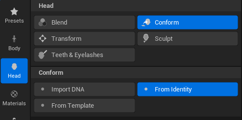[Open: 2.0-自定义模型-1764148291948.png](attachments/bddcca7f4db065c4282d2b7a5bacf2a0_MD5.jpg)
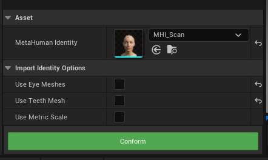
- 然后可以再次修改模型
- [Open: 2.0-自定义模型-1764148494766.png](attachments/cc71ea3f24adb8825d8f46d13c5b4acd_MD5.jpg)
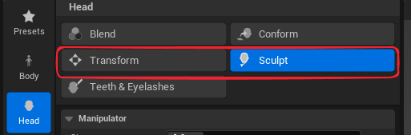
- 设置材质颜色
- [Open: 2.0-自定义模型-1764148522517.png](attachments/4d55e9de382c63dcf5152cbfe0ea999a_MD5.jpg)
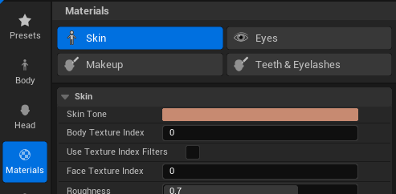
- 设置身体
- [Open: 2.0-自定义模型-1764148921583.png](attachments/5ac26b1e5ea33b5425432acf6f0db4a1_MD5.jpg)
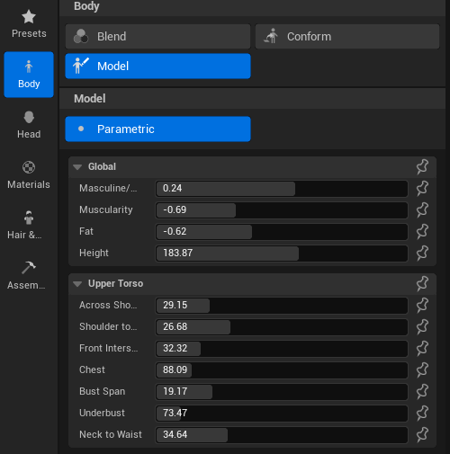
- 最后创建绑定，下载贴图，导出DNA
# 使用Wrap4D
[Open: 8.0-MetaHuman For Maya-1763975107174.png](../../MAYA/Rigging/常用算法和问题/attachments/52a1feca07d6fa675103de7a9a17b8ef_MD5.jpg)
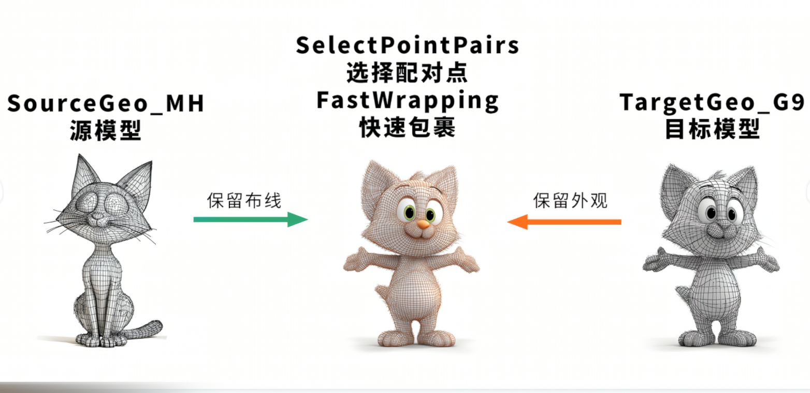
- 可以依赖Wrap4D软件来实现一个模型：拥有MetaHuman的布线，拥有自定义模型的外观，
- 其原理是用MetaHuman的模型来包裹自定义模型，节点图如下
- [Open: 8.0-MetaHuman For Maya-1763975229529.png](../../MAYA/Rigging/常用算法和问题/attachments/db6d0f214e5889788fd0a129ac5b4b90_MD5.jpg)
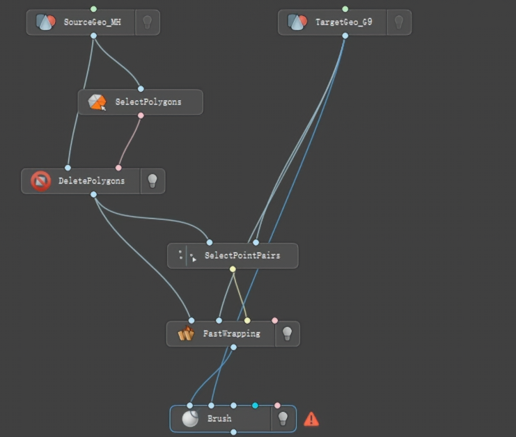

- 在maya中传递点顺序，先依次选择源模型的三个点，再选择目标模型的对应三个点，实现点顺序从源模型到目标模型传递
- [Open: 8.0-MetaHuman For Maya-1763975751024.png](../../MAYA/Rigging/常用算法和问题/attachments/8b507ec0dc6ea480891628972d4dd509_MD5.jpg)
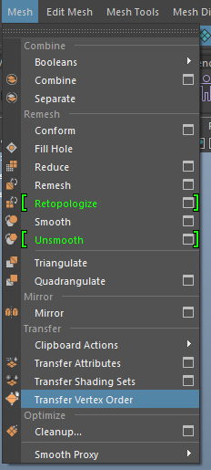
