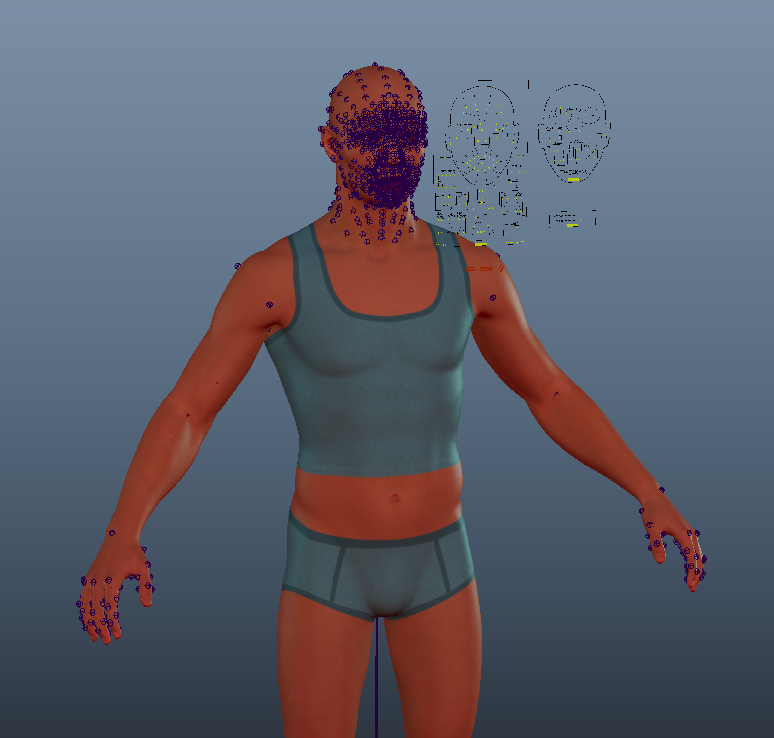
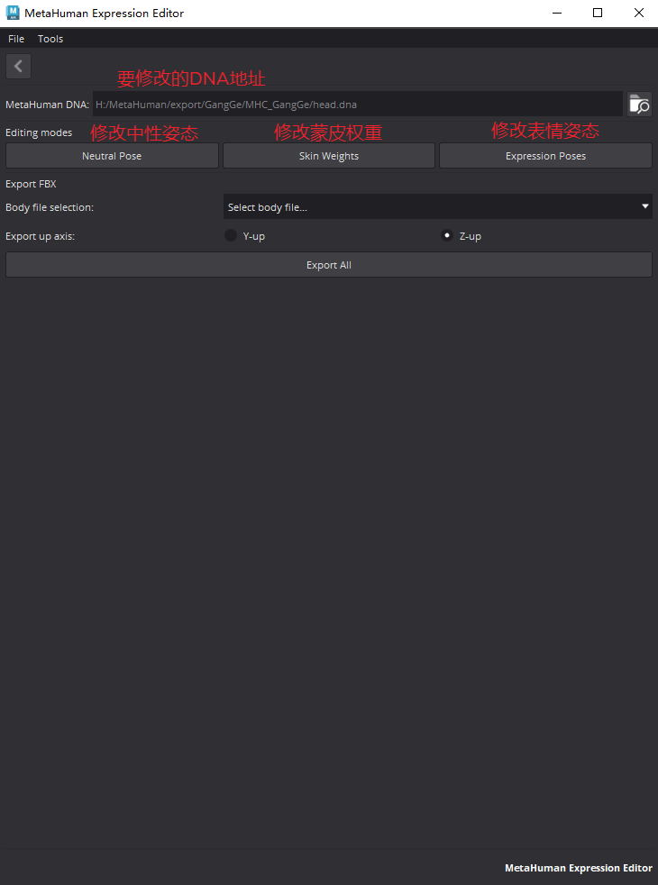
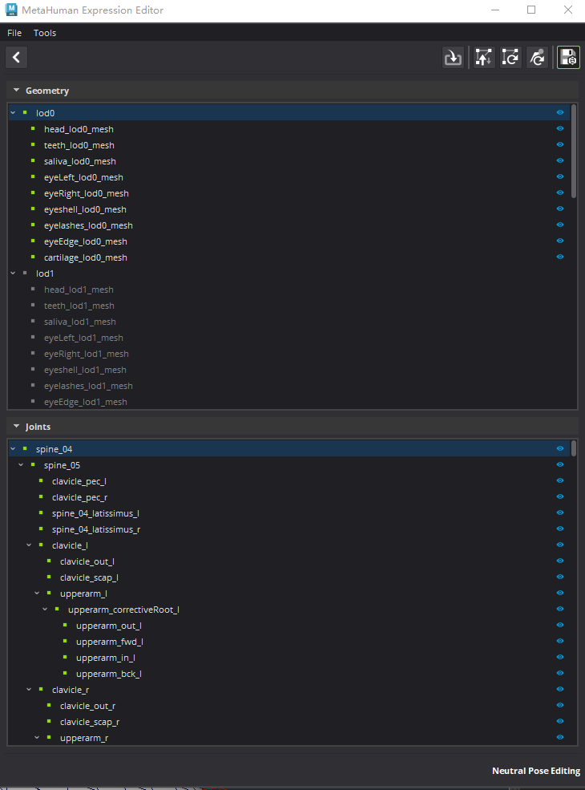
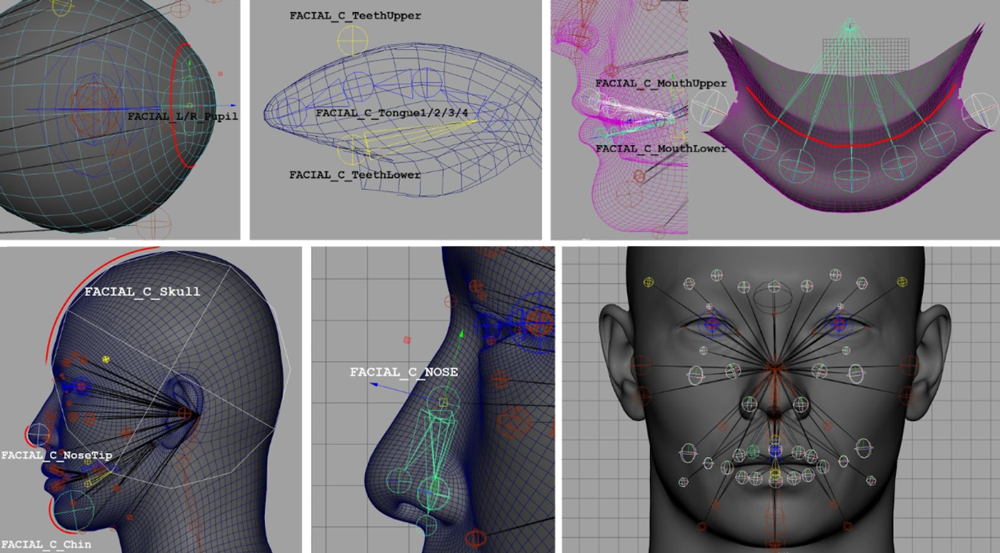
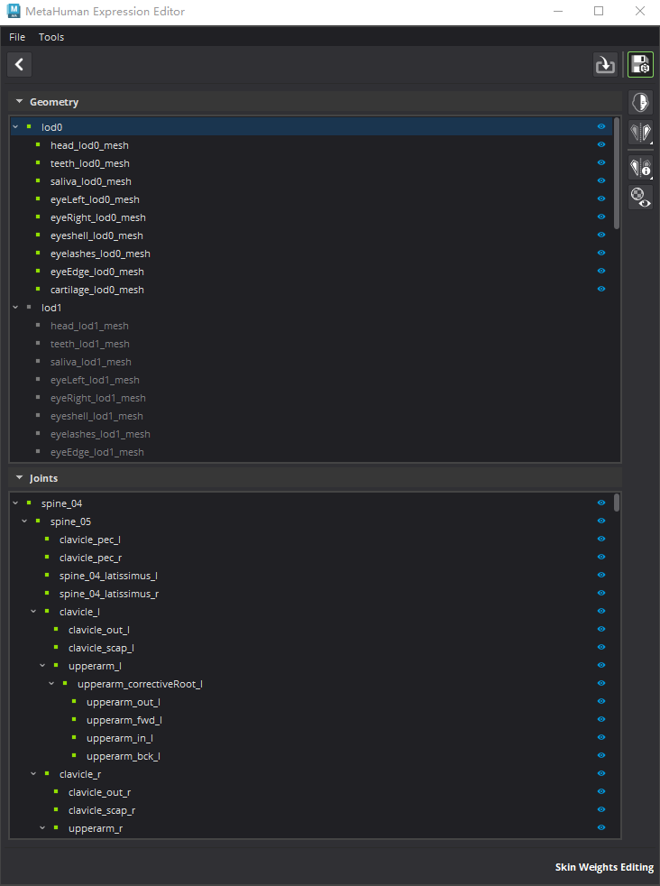
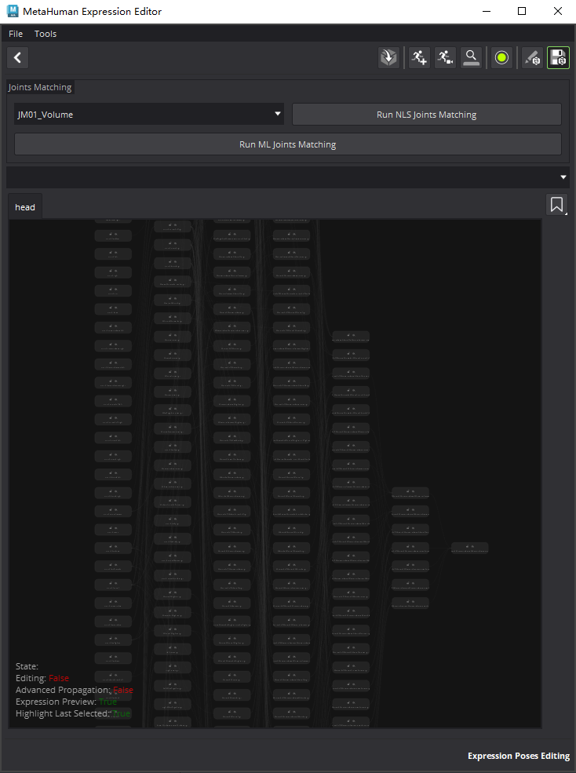

> 本篇记录插件三大工具（CharacterAssembler / ExpressionEditor / PoseEditor）的**交互式**用法。把这套 conform 流程脚本化的自研工具分析见 [6.0-MhRigCreator-从Mesh构建MetaHuman绑定](6.0-MhRigCreator-%E4%BB%8EMesh%E6%9E%84%E5%BB%BAMetaHuman%E7%BB%91%E5%AE%9A.md)。

# Maya操作

[Open: 8.0-MetaHuman For Maya-1763968355254.png](attachments/8ee26422baa7f155ae88c0e6560a4248_MD5.jpg)

## CharacterAssembler角色组装器
- 用于载入整个角色
- [Open: 8.0-MetaHuman For Maya-1763969149987.png](attachments/f5854c8a1963eff98c679d1c11028ff0_MD5.jpg)

- 选择导出的资产路径，选择要处理的角色，点击组装Assemble
- [Open: 8.0-MetaHuman For Maya-1763969781552.png](attachments/a8106e2033f7062bb4bbac48c7120d27_MD5.jpg)

## ExpressionEditor（表情编辑器）
- 用于编辑表情效果
- [Open: 8.0-MetaHuman For Maya-1764056748413.png](attachments/ad697b9610803dba292f907f8d950bf3_MD5.jpg)

### 中性姿势
- 用于修改模型绑定姿态时的顶点位置和骨骼位置
- [Open: 8.0-MetaHuman For Maya-1764057043941.png](attachments/7fbbb0722abd0d84f3897c49a28feeec_MD5.jpg)

- 右上角功能按钮依次为
	- 组装选中的LOD，一般为选择LOC0
	- 传递顶点位置，修改模型后点击
	- 更新顶点，会根据最新的顶点位置计算骨骼位置
	- 更新骨骼，会更新子定位的骨骼位置，你可能修改眼球骨骼位置和嘴唇骨骼位置
	- 保存DNA，会从LOD0向下计算保存DNA
- 骨骼位置，MetaHuman中有一些骨骼在姿势更新时会自动定位的，有一些骨骼更新时不会自动定位的。以下关节在绑定姿势更新时不会自动定位的体积关节：

|                                                                                                                                                                                                                              |                                                                                                                                                                                                                                        |                                                                                                                                                                                                                                                     |
| ---------------------------------------------------------------------------------------------------------------------------------------------------------------------------------------------------------------------------- | -------------------------------------------------------------------------------------------------------------------------------------------------------------------------------------------------------------------------------------- | --------------------------------------------------------------------------------------------------------------------------------------------------------------------------------------------------------------------------------------------------- |
| FACIAL_C_Skull<br><br>FACIAL_L_EyelidUpperB<br><br>FACIAL_R_EyelidUpperB<br><br>FACIAL_L_EyelidUpperA<br><br>FACIAL_R_EyelidUpperA<br><br>FACIAL_L_Eye<br><br>FACIAL_L_EyeParallel<br><br>FACIAL_L_Pupil<br><br>FACIAL_R_Eye | FACIAL_R_EyeParallel<br><br>FACIAL_R_Pupil<br><br>FACIAL_L_EyelidLowerA<br><br>FACIAL_R_EyelidLowerA<br><br>FACIAL_L_EyelidLowerB<br><br>FACIAL_R_EyelidLowerB<br><br>FACIAL_C_Nose<br><br>FACIAL_C_NoseTip<br><br>FACIAL_C_MouthUpper | FACIAL_C_TeethUpper<br><br>FACIAL_C_LowerLipRotation<br><br>FACIAL_C_MouthLower<br><br>FACIAL_C_TeethLower<br><br>FACIAL_C_Tongue1<br><br>FACIAL_C_Tongue2<br><br>FACIAL_C_Tongue3<br><br>FACIAL_C_Tongue4<br><br>FACIAL_C_Jaw<br><br>FACIAL_C_Chin |
- 上表中，下列两个关节还具有额外的区别特征：`FACIAL_L_Pupil`以及`FACIAL_R_Pupil`。 只有这两个关节会动态地改变缩放组件以影响网格体。
- 最后，以下三个身体关节需要始终保持原样：`FACIAL_C_Neck1Root`、`FACIAL_C_Neck2Root`以及`FACIAL_C_FacialRoot`。 这三个关节需要始终匹配身体，并且依赖身体绑定的选择。
- 举例说明
	- 睛可以简单地与眼球的体积相匹配（注意不要意外移动它们的子项，这些子项将通过表面定位放置在网格体的正确区域上）。以左眼为例：`FACIAL_L_EyelidUpperB`、`FACIAL_L_EyelidUpperA`、`FACIAL_L_EyelidLowerA`、`FACIAL_L_EyelidLowerB`、`FACIAL_L_Eye`以及`FACIAL_L_EyeParallel`都会被移动到眼球网格体中间环的几何体中心位置。
	- 
	- 嘴巴与眼睛相似，但它有几个需要分组处理的关节，其定位虽然直观，但需要根据嘴唇肉质部分的体积进行目测。
	- 
	- [Open: 8.0-MetaHuman For Maya-1764062772259.png](attachments/316b8e9a8b3f31feeeb188d83470fce4_MD5.jpg)

- 编辑骨骼位置脚本
```python
import maya.cmds as cmds

# 调整骨骼位置 主要体积骨骼
# 眼球
cmds.select('FACIAL_L_EyelidLowerB', 'FACIAL_L_EyelidUpperA','FACIAL_L_EyelidUpperB', 'FACIAL_L_EyelidLowerA', 'FACIAL_L_Eye', r=1)
cmds.select("FACIAL_L_Pupil", r=1)

# 鼻子
cmds.select("FACIAL_C_Nose", r=1)
cmds.select("FACIAL_C_NoseTip", r=1)
cmds.select("FACIAL_L_Nostril", r=1)
cmds.select("FACIAL_C_NoseLower", r=1)

#上牙
cmds.select("FACIAL_C_TeethUpper", r=1)

#下牙+舌头
cmds.select("FACIAL_C_TeethLower", r=1)

#嘴部
cmds.select("FACIAL_C_MouthUpper", "FACIAL_C_MouthLower", r=1)

#下巴
cmds.select("FACIAL_C_Jaw", "FACIAL_C_LowerLipRotation", r=1)

#镜像体积骨骼
for i in cmds.ls("FACIAL_L_*", type="joint"):
    if len(i.split("_")) == 3 and cmds.listRelatives(i):
        pos = cmds.xform(i, q=1, t=1, ws=1)
        cmds.xform(i.replace("_L_", "_R_"), t=[-pos[0], pos[1], pos[2], ws=1)
```
###  蒙皮权重
[Open: 8.0-MetaHuman For Maya-1764057751638.png](attachments/54b6d030d1cd0932433b481b13edccaf_MD5.jpg)

- 蒙皮全中的修改不会自动计算DNA，需要手工逐个修改
- 左上方两个按钮为：
	- 组装选中的LOD
	- 保存DNA
- 左侧四个按钮为：
	- 选择镜像方向（从左到右或者从右到左）
	- 镜像蒙皮全中，可以是整个模型也可以是选中的顶点
	- 分析蒙皮镜像数据
	- 开关顶点着色
### 表情姿势
[Open: 8.0-MetaHuman For Maya-1764058570203.png](attachments/abb2d1b317e2b63d0fff7e515d3b1619_MD5.jpg)

- 图表中有七列表情节点，他们有上下游的依赖关系，第二列表情会依赖第一列表情，以此类推，最后一列会依赖前面六列中的表情
- 每个节点上会有一把锁，当节点被锁定后，修改其上游节点将不会影响被锁定的下游节点，否则将会传播影响。
- 右上按钮功能依次是：
	- 组装场景
	- 载入faceboard测试动画，插件自带：
	- C:\Users\dalaotian\Documents\maya\modules\MetaHumanForMaya\lib\mh_expression_editor\2.11.6\mh_expression_editor\res\gui_technical_rom.fbx
	- 载入RigLogic 原始动画，插件自带：
	- "C:\Users\dalaotian\Documents\maya\modules\MetaHumanForMaya\lib\mh_expression_editor\2.11.6\mh_expression_editor\res\raw.fbx"
	- 分析表情帧
	- 编辑表情
	- 从场景中更新DNA
	- 保存DNA 
- 右侧是一个标签按钮，保存常修改的节点位置
- 当你点击编辑表情之后，会进入编辑模式
- [Open: 8.0-MetaHuman For Maya-1764061558655.png](attachments/ee828bd190f58c403c43d32c25efd9e9_MD5.jpg)

- 右侧有一列功能按钮
- 前三个用于创建和移除预览表情模型
- 下三个用于镜像变形和骨骼
- 下两个用于反转选择
- 下两个用于传递顶点位置和删除模型历史
- 下两个用于重置模型和骨骼
- 下两个用于重置模型和骨骼到DNA描述的状态
- 下两个用于拷贝和粘贴骨骼状态
- 最后一个就厉害了，ML Joints Matching利用机器学习根据模型修改来修正骨骼位置，也可以在修改全部完成后点击上面的大按钮Run ML Joints Matching