# 导出身体模型
- 打开MetaHumanCharacter文件，在MetaHumanCharacter菜单中选择Export Outfit Body Skel Mesh
- 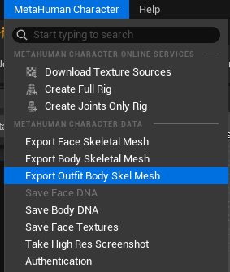
- 便获得了一个全身的SkeletalMesh文件
# 导入服装模型
- 导入服装模型时不必挂在在任何骨骼上，可生成一套新骨骼
# 服装创建模式
- MetaHuman的服装创建模式有两种
	- OutfitClothing
	- SkeletalClothing
- 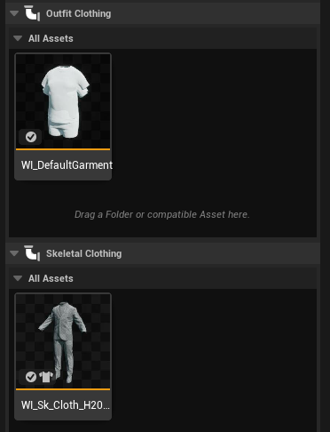
- OutfitClothing支持ChaosCloth和服装自适应（resize）身体
- SkeletalClothing不支持布料和服装自适应
# 创建SkeletalClothing
- 直接拖拽你的服装SkeletalMesh到MetaHuman的SkeletalClothing界面槽位
- 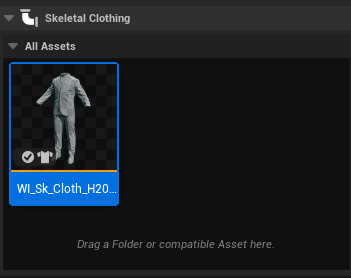
- 系统将自动创建MetaHuman Wardrobe Item（WI_xxx）。
- 然后选中Wardrobe点击Accessory Properties（配件属性），即可设置Wardrobe
- 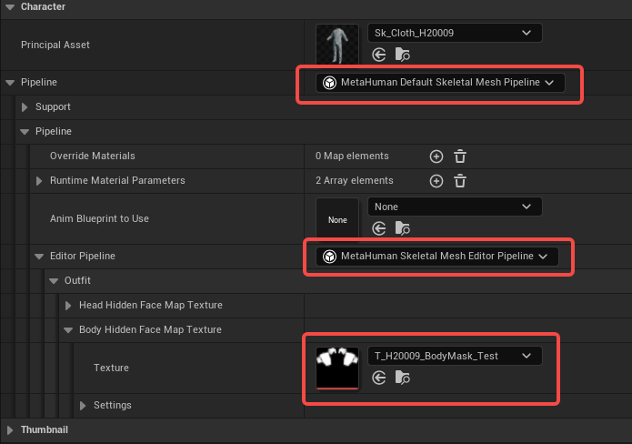
- 第三个红框便是 mask 贴图，该图需要放置在特定路径，可根据提示放置，最后点击保存。
- 回到MetaHumanCharacter文件，点击RefreshPreview按钮，即可看到遮罩效果
# 创建OutfitClothing
1. 创建ChaosClothAsset
2. 创建OutfitAsset
3. Outfit Asset 拖到 Cloth Outfits 槽位。
4. 系统创建 Wardrobe Item，支持自动适配不同 body shape。
## 创建ChaosClothAsset
- 点击右键创建ClothAsset
- 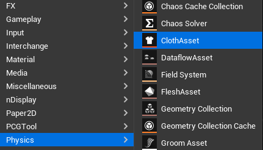
- 先删除所有节点，只创建SkeletalMeshImport和ClothAssetTerminal节点即可，将服装模型载入SkeletalMeshImport节点
- 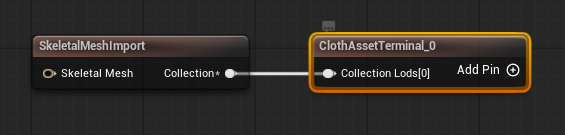
- ChaosCloth的内容不在本次讲解范围以内，想要了解请查看[2.0-Chaos Cloth](../布料/2.0-Chaos%20Cloth.md)

## 创建OutfitAsset
- 点击右键创建服装资产
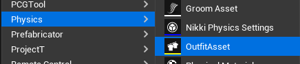
- 创建之后会让你选择模板，如果没有自适应尺寸需求就选择SimpleOutfit
- 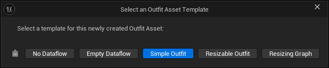
- 在OutfitAsset，将之前的ChaosClothAsset载入节点
- 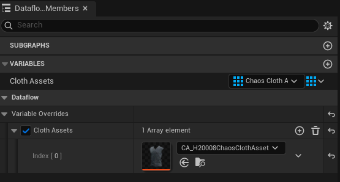
- 如果选择了ResizableOutfit模板，还需要载入主角身体模型
- 然后将OutfitAsset拖拽到MetaHuman的SkeletalClothing界面槽位
- 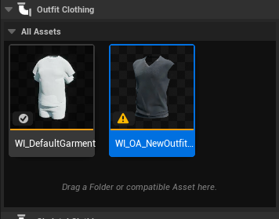

- 然后选中Wardrobe点击Accessory Properties（配件属性），即可设置Wardrobe
- 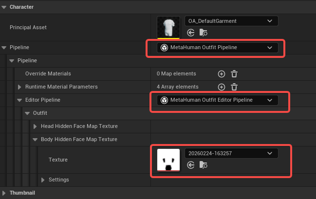
- 第三个红框便是 mask 贴图，该图需要放置在特定路径，可根据提示放置，最后点击保存。
- 回到MetaHumanCharacter文件，点击RefreshPreview按钮，即可看到遮罩效果