# 概述

# 蒙皮修改
- MetaHuman的头部蒙皮修改要使用MetaHumanForMaya插件进行
- 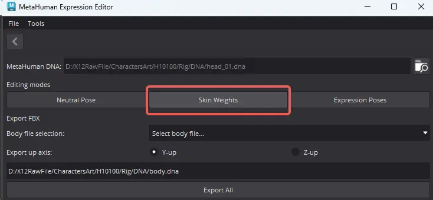
- 然后逐个LOD进行蒙皮修改，每个LOD的蒙皮修改完成之后都要保存DNA
- 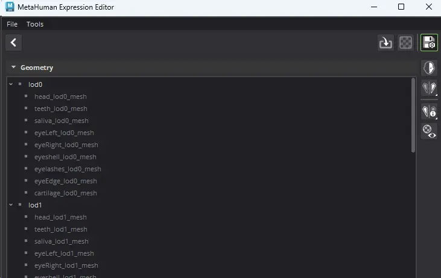
- 蒙皮修改完成之后要使用插件保存FBX文件，导出时需要选择身体DNA和maya朝向
- 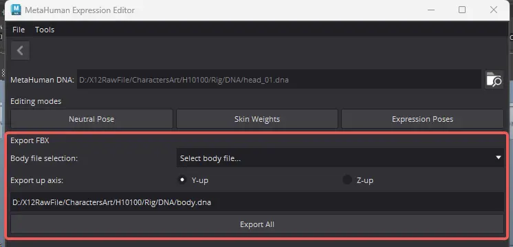
- 导出文件如下，包含DNA和每个LOD的模型
- 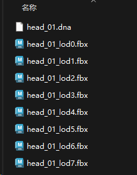
## 插件BUG
- 注意：插件导出的文件表情骨骼层级关系是错的，如下图，脖子的修形骨骼放在头部骨骼层级之下，而头部的修形骨骼放置在了脖子的层级之下：
- 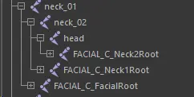
- 正确的骨骼层级应该为：
	- FACIAL_C_FacialRoot 在 head 之下
	- FACIAL_C_Neck2Root 在neck_02之下
	- FACIAL_C_Neck1Root 在neck_01之下
- 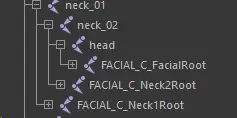
- 请逐文件修改骨骼层级并重新导出
- 还可能有其他的蒙皮问题，请仔细检查每个LOD文件
# 引擎设置
- 在编辑器偏好设置中勾选重导入时显示导入对话框
- 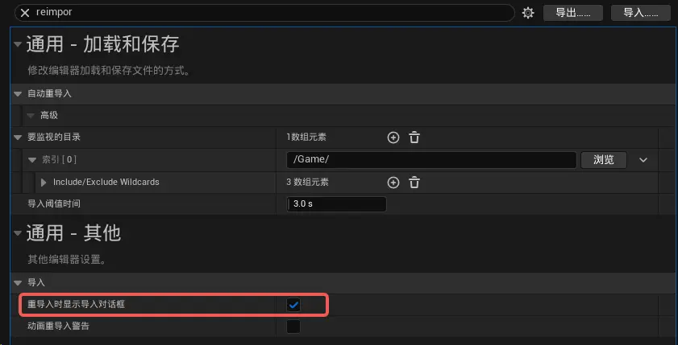
- 打开要重新导入的网格体，设置其filepath为导出的LOD0模型
- 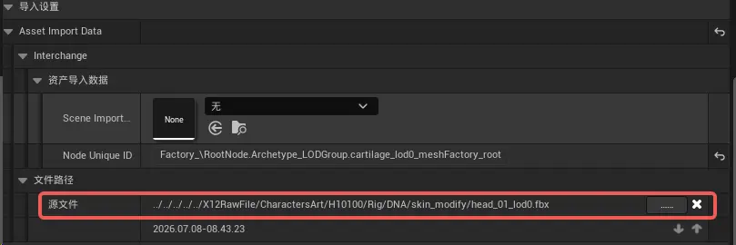
- 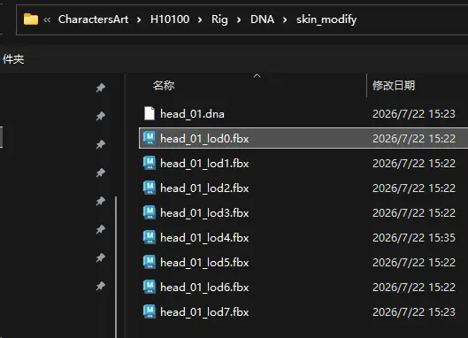
# 导入设置
## 执行重新导入
- 执行使用新文件重新导入网格体
- 
- 导入LOD文件
- 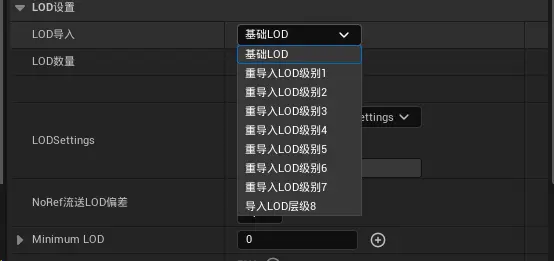
## CommonMeshes
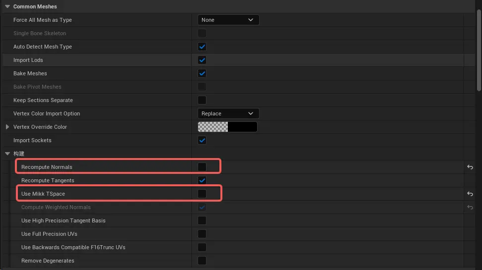
- 取消勾选
	- RecomputeNormals：重新计算法线
	- UseMikkTSpace：使用MikkTSpace重新计算切线
## SkeletalMeshes
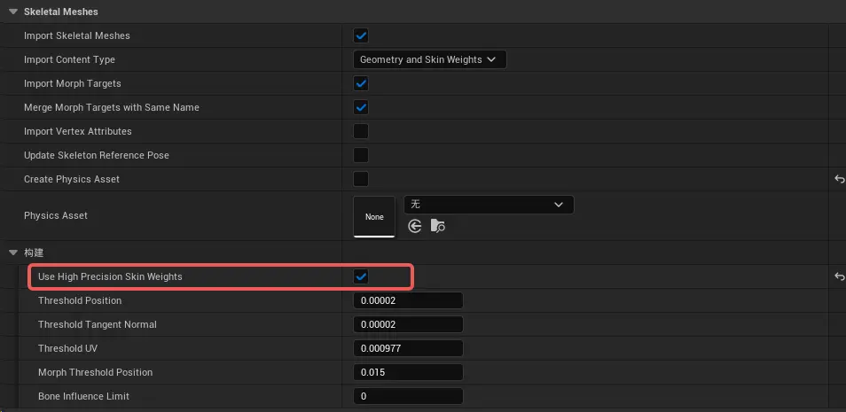
- 勾选
	- ImportMophTargets：导入混合变形
	- UseHighPrecisionSkinWeights：使用高精度蒙皮权重，蒙皮权重使用16位而非8位。
# 资产设置
- 导入后要逐个LOD设置主材质的切线更新方式
- MetaHuman存在一个常见的问题，即面部的阴影有时会很奇怪；眼部周围尤其明显。 这与切线存在更新或切线缺少更新有关。 Metahuman本应将顶点颜色贴图设置为绿色，以控制这种行为。 表情编辑器会导出该贴图，但你还必须确保在变形过程中导入并妥善处理该贴图。
- 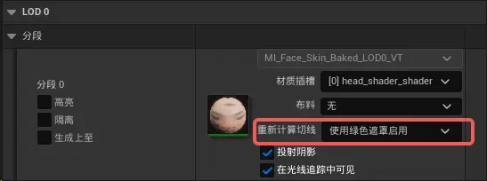
- 启用蒙皮缓存
- 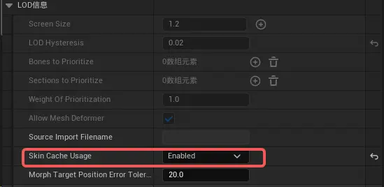
- 检查项目设置中的蒙皮选项
- 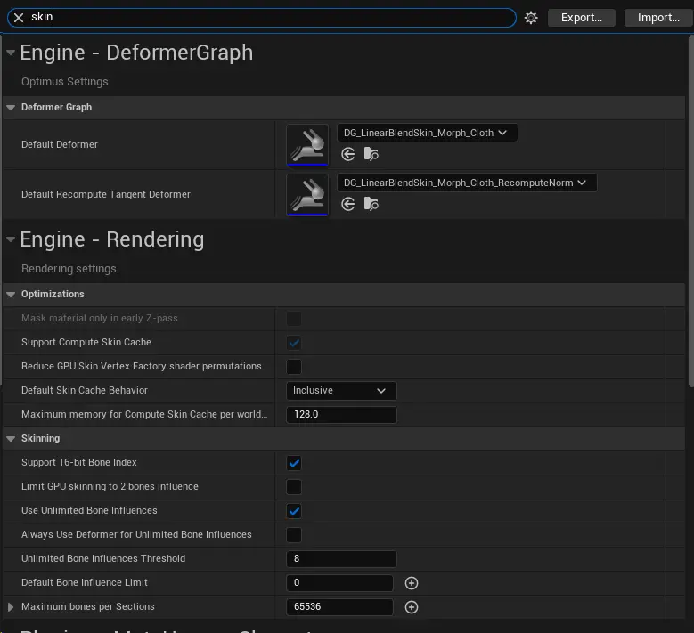