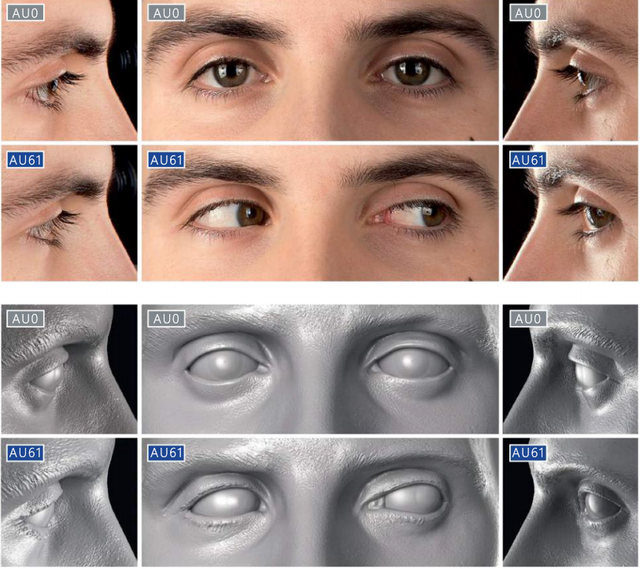
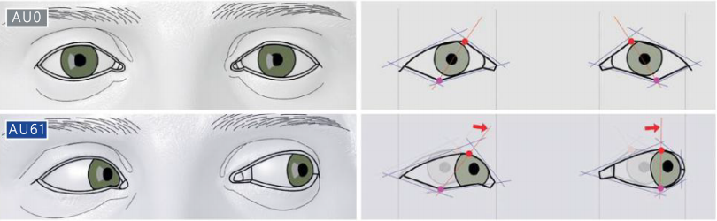
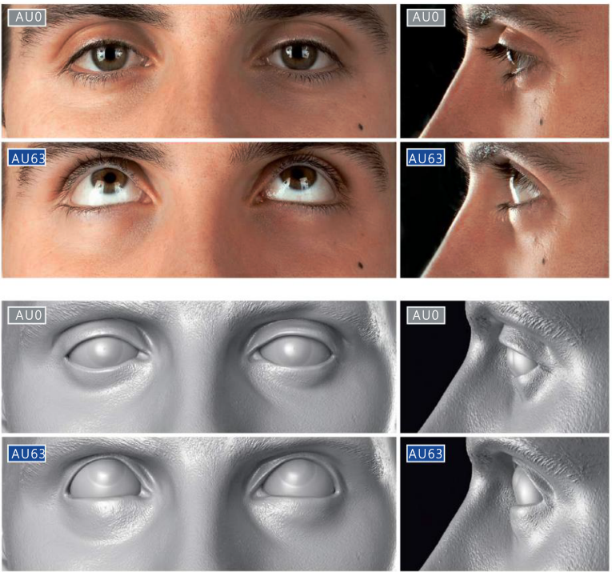
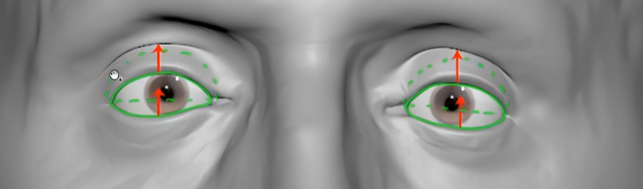
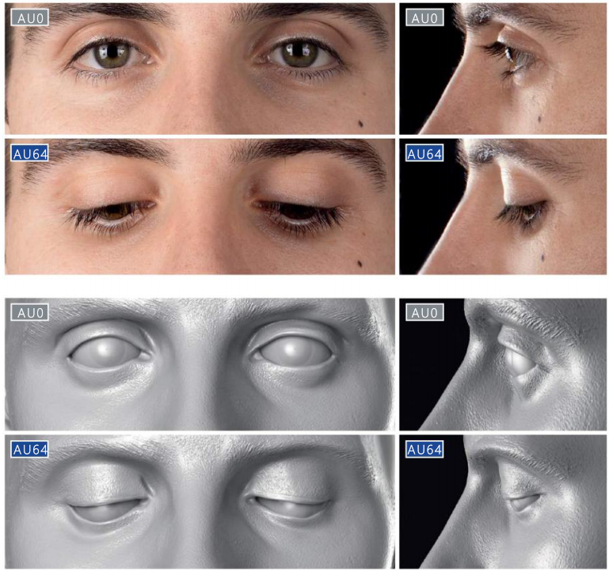
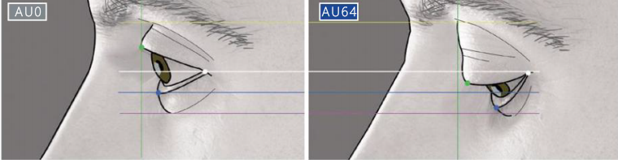
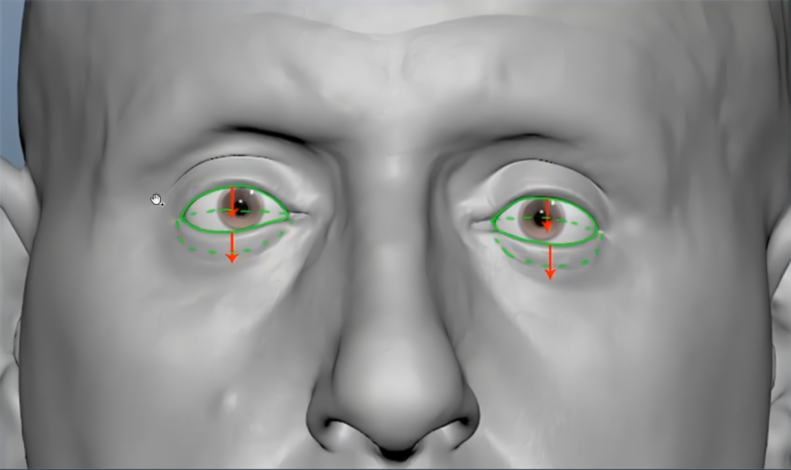
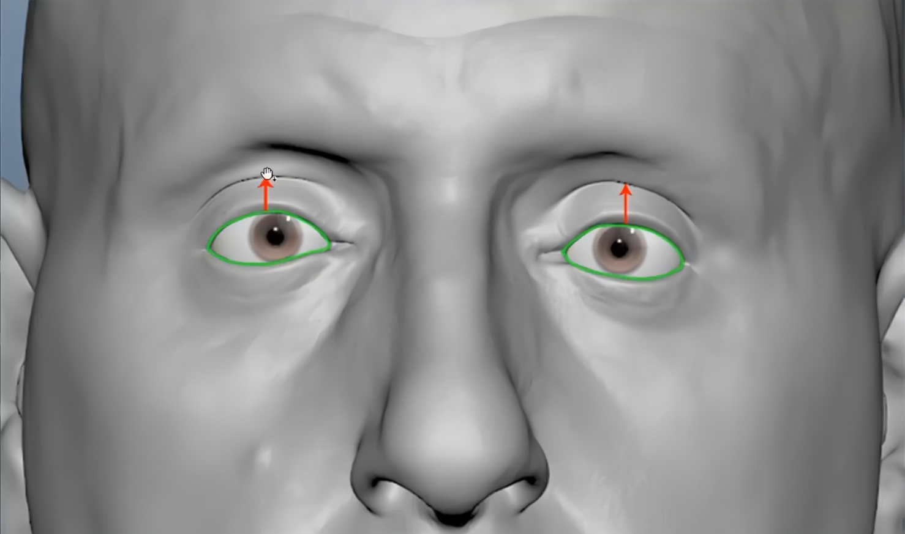
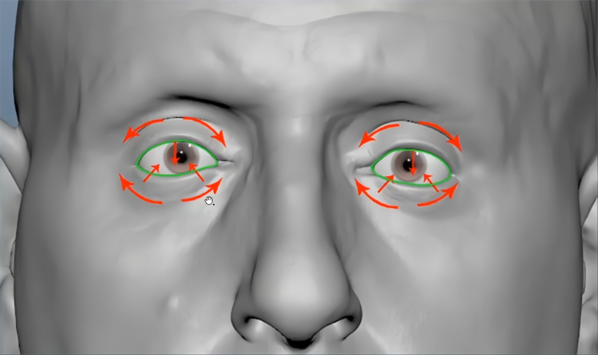
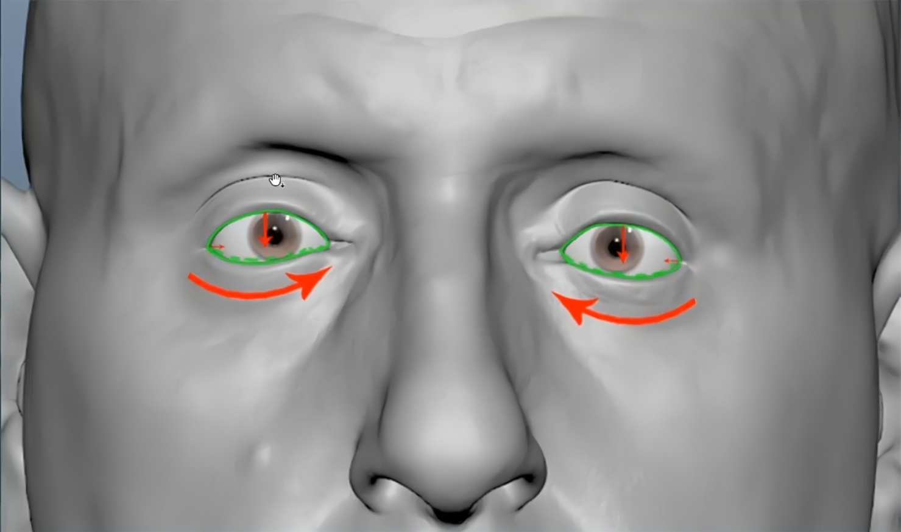

https://www.bilibili.com/video/BV12q4y1R7vC/?vd_source=0f765d25b29efef66dd4ff586509e026
# 眼睛变形

## Look Left/Right

[Open: 4.4-制作FACS的混合变形-1766555096228.png](attachments/dd3d3b7fe6c85698fabbd8ef64c668cd_MD5.jpg)
[Open: 4.4-制作FACS的混合变形-1766483000777.png](attachments/987e357c200e35e7c744c9e5b68eec64_MD5.jpg)

- 当眼睛往左看时，左眼高点要移动幅度大一些，低点移动幅度小一些，左眼最高点和最低点大约在一条垂直线上
## Look Up
[Open: 4.4-制作FACS的混合变形-1766555065755.png](attachments/523c33556b3d05f96572e3e0017a7b8c_MD5.jpg)

- 向上看时下眼睑抬平，上眼睑抬起成弧形
## Look Down
[Open: 4.4-制作FACS的混合变形-1766555313321.png](attachments/6bcc5013241263caf8f6af7affa8186d_MD5.jpg)

- 向下看时上眼睑压平，下眼睑下压成弧形
## Upper Lid Raiser
[Open: 4.4-制作FACS的混合变形-1764744531424.png](attachments/82088380af32679e852697d351461f06_MD5.jpg)

- 上眼皮抬起
## Lid Tightener
[Open: 4.4-制作FACS的混合变形-1764744667317.png](attachments/8afc8ce4df955e6f937fb43e74e6c5da_MD5.jpg)

- 眯起眼睛
## Eyes Closed
[Open: 4.4-制作FACS的混合变形-1764744736443.png](attachments/304f311123699ef45a54de9778b3a327_MD5.jpg)

- 闭上眼睛，上眼睑下拉盖住眼睛，外眼角稍稍内收，整个下眼睑轻微内旋