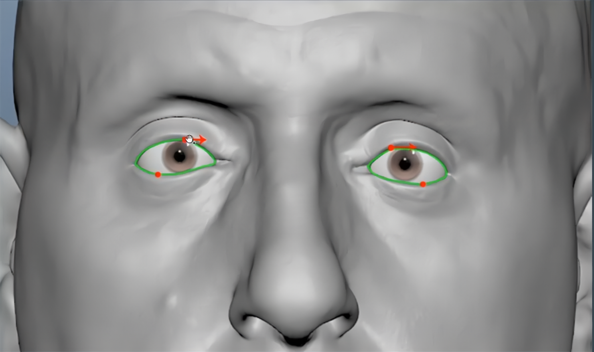
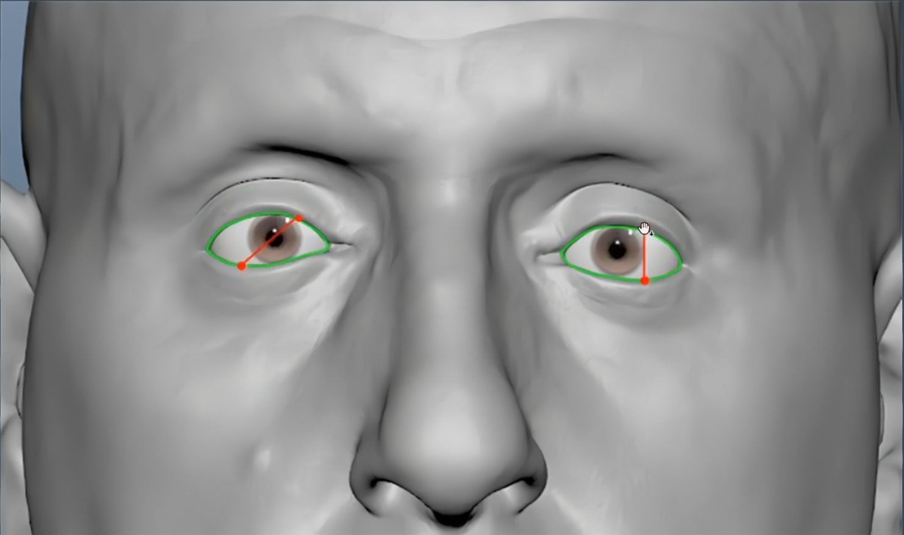
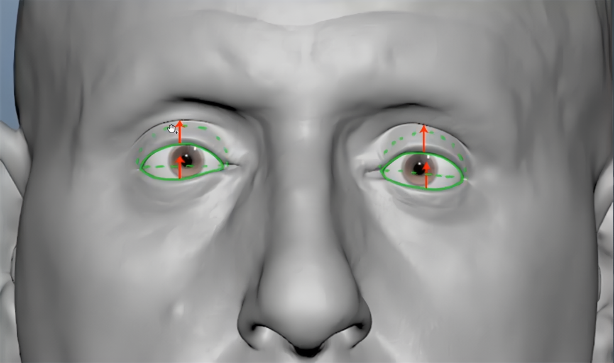

# 眼睛变形

## Look Left/Right
[Open: 4.4-制作FACS的混合变形-1764744040335.png](attachments/b15647fe0a2e3da86fb4057e685c2667_MD5.jpg)

- 如图所示，绿圈为眼睑轮廓。红点为眼睑最高点和最低点
[Open: 4.4-制作FACS的混合变形-1764747166733.png](attachments/e7b4a278e38bad1cd162e0b1e6024361_MD5.jpg)

- 当眼睛往左看时，左眼高点要移动幅度大一些，低点移动幅度小一些，左眼最高点和最低点大约在一条垂直线上
## Look Up
[Open: 4.4-制作FACS的混合变形-1764744304032.png](attachments/baaff33d0e9a083323f5abd93b5b64d2_MD5.jpg)

- 向上看时下眼睑抬平，上眼睑抬起成弧形
## Look Down
[Open: 4.4-制作FACS的混合变形-1764744426259.png](attachments/f0653fde48d5d82b75e0f3efb2e82b65_MD5.jpg)

- 向下看时上眼睑压平，下眼睑下压成弧形
## Upper Lid Raiser
[Open: 4.4-制作FACS的混合变形-1764744531424.png](attachments/82088380af32679e852697d351461f06_MD5.jpg)

- 上眼皮抬起
## Lid Tightener
[Open: 4.4-制作FACS的混合变形-1764744667317.png](attachments/8afc8ce4df955e6f937fb43e74e6c5da_MD5.jpg)

- 眯起眼睛
## Eyes Closed
[Open: 4.4-制作FACS的混合变形-1764744736443.png](attachments/304f311123699ef45a54de9778b3a327_MD5.jpg)

- 闭上眼睛，上眼睑下拉盖住眼睛，外眼角稍稍内收，整个下眼睑轻微内旋