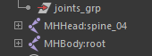
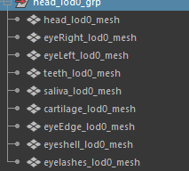
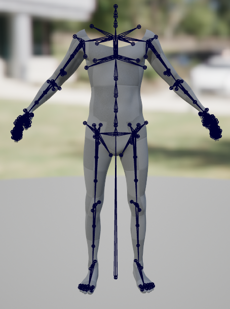
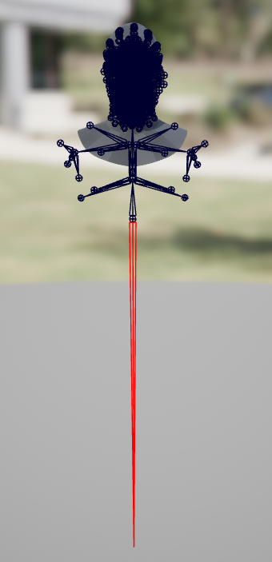

# maya
- 推荐使用SuperRigging插件来构建绑定
- 使用`match_mh_main_jnts`脚本来对齐骨骼
- 导出时，将两套骨架放置于世界层级之下
- 
- 导出身体时选中身体模型和身体骨架导出当前选择
- 
- 导出头部时选中头部模型和头部骨架导出当前选择
- 
# Unreal
- 引擎中导入身体模型和头部模型，分别生成骨架，其中头部骨骼从spine_04开始
- 
- 在MHC中载入模型，依次点击三个绿色按钮
- 
- 