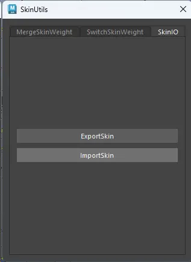

> 本篇是**手工对位**流程。脚本化的自动对位方案（6 级策略几何拟合，实测 870 根骨骼平均误差 0.0073 cm）见 [6.0-MhRigCreator-从Mesh构建MetaHuman绑定](6.0-MhRigCreator-%E4%BB%8EMesh%E6%9E%84%E5%BB%BAMetaHuman%E7%BB%91%E5%AE%9A.md)。

# maya
- 推荐使用SuperRigging插件来构建绑定
- 绑定构建完成后，使用SkinUtils工具导出蒙皮权重（支持名称空间），移除蒙皮
- 
- 使用`match_mh_main_jnts`脚本来对齐骨骼

![[image.png|289x153]]
- 对齐主骨骼之后，导入蒙皮权重
- 导出模型时，将两套骨架放置于世界层级之下
- 
- 导出身体时选中身体模型和身体骨架导出当前选择
- 
- 导出头部时选中头部模型和头部骨架导出当前选择
- 
# Unreal
- 引擎中导入身体模型和头部模型，分别生成骨架，其中头部骨骼从spine_04开始
- 
- 在MHC中身体部分载入模型，依次点击三个绿色按钮
- 
- 在MHC头部部分载入头部模型
- 