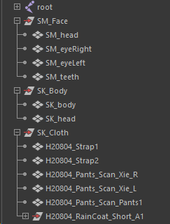
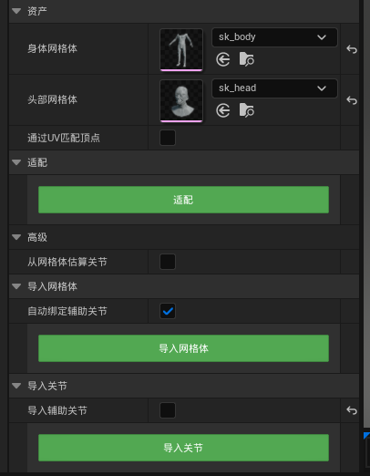
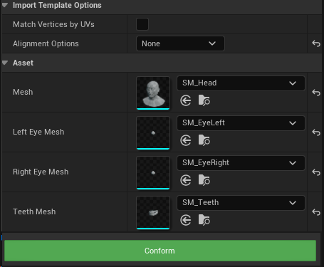

> 本篇是**手工对位**流程。脚本化的自动对位方案（6 级策略几何拟合，实测 870 根骨骼平均误差 0.0073 cm）见 [6.0-MhRigCreator-从Mesh构建MetaHuman绑定](6.0-MhRigCreator-从Mesh构建MetaHuman绑定.md)。

# maya
- 传递顶点顺序，确保所有模型符合MetaHuman顶点顺序
- 导入想要对位骨骼，骨骼只保留MetaHuman原生骨骼，任何自定义骨骼都要删除，包含IK骨骼、Weapon骨骼和其他自定义骨骼。
- 为身体和头部模型和服装模型蒙皮，无需修改蒙皮效果，不会使用这里的蒙皮信息
- 需要产出的资产
	- 头部、身体模型骨骼网格体
	- 头部模型、左右眼模型、牙齿模型静态网格体
	- 任意一件服装的骨骼网格体，主要用于遮罩裁剪身体模型。
- 
# Unreal
## 身体
- 引擎中导入身体模型和头部骨骼网格体，可以挂在同一骨架之下
- 在MHC中载入模型，依次点击三个绿色按钮
- 
## 头部
- 使用静态模型来生成头部
- 
## 导出
- 绑定，组装，导出即可。。。
