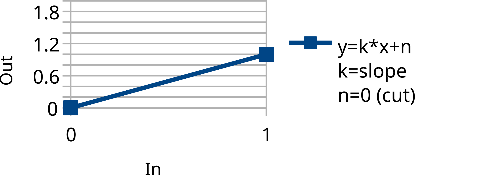
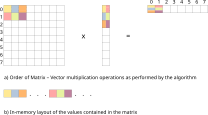
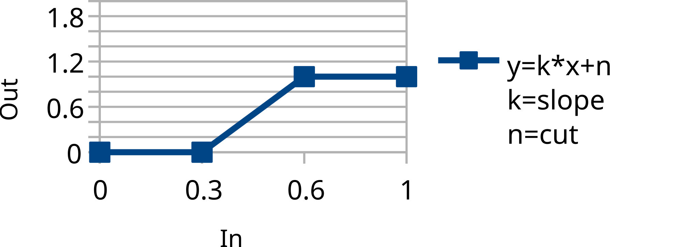
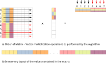
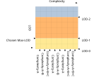

# RigLogic 架构设计解析（OpenRigLogic）

> 来源：Epic 官方 [OpenRigLogic](https://github.com/EpicGames/OpenRigLogic) 仓库 `docs/design/design.md`（MIT 开源，2026-06 发布）。
> 本地克隆：`D:\Code\OpenRigLogic`（5.8 分支），已编译好 Maya 2024 可用的 Python 绑定（`dist\py310\`）。
> 相关笔记：[编译指南](5.2-OpenRigLogic编译指南.md)、[使用指南](5.3-OpenRigLogic编译结果使用指南.md)、[MetaHuman For Maya](3.0-MetaHuman%20For%20Maya.md)、[MetaHuman基础知识](0.0-MetaHuman基础知识.md)

## RigLogic 是什么

RigLogic 是可嵌入游戏引擎和 DCC 工具的**运行时绑定求解组件**，核心任务一句话概括：

$$\text{输入（表情控制值）} \xrightarrow{\ \text{RigLogic}\ } \text{输出（变形数据）}$$

- **输入**：高层表情控制器的值（Maya 里是面板 2D 控制器；引擎里由动画系统程序化驱动），即 raw controls（如 `CTRL_expressions.jawOpen`）
- **输出**：三类相对中立姿态（neutral pose）的**增量值**：
  1. **关节变换**（joint transformations，每关节 9 个 float：平移/旋转/缩放增量）
  2. **BlendShape 权重**
  3. **动态遮罩乘数**（animated map multipliers，驱动皱纹贴图等）

输入输出数量不对等（MetaHuman 头部约 263 个输入 → 870 关节 × 9 + 782 BS 通道的输出）。

## 求解管线：三个阶段

### 1. PSD 计算（Pose Space Deformation）

PSD 表示**组合表情的修型**——定义多个表情同时激活时如何组合。这一阶段把输入向量**扩充**：根据原始控制值计算出"组合表情"的激活值，追加到输入向量尾部，供下一阶段使用。

核心逻辑（Alg.1）：每个 PSD 行是若干输入的**乘积**（并对每项做 clamp）：


```cpp
// 每个组合表情的激活值 = 参与表情的控制值连乘
float psdVal = 1.0f;
for (每个参与的输入) {
    psdVal *= min(PSD_MAX_VALUE, psd系数 * 输入值);
}
inputPsd[i] = psdVal;
```

> 直觉理解：对应 Maya 里 combo 修型（如 jawOpen + mouthSmile 的组合修正 target），只有两个表情同时非零时乘积才非零。

### 2. 线性输出求解（占绝大多数数据量）

线性矩阵里存的本质是 **SDK（Set Driven Keys）**——描述所有可能的表情对输出的线性影响；输入向量（含 PSD 扩充部分）决定哪些表情以何强度参与：



旧版 CRS 矩阵布局（v4 中被替换，见下文）：



算法就是标准 **SpMV（稀疏矩阵×向量）**：`输出 = 矩阵 × 输入向量`。这是整个 RigLogic 的性能热点，v4 的核心改进都在这里（下文）。


### 3. 条件输出求解（<3% 数据量）

Conditional 处理**序列化表情**（链式表情，一个输入值的不同区间对应不同行为）。定义方式是**分段斜截式**（slope-intercept form）：每个输入区间 `(from, to]` 配一组 `slope`、`cut` 参数：



```cpp
if (inValue > fromValue && inValue <= toValue)
    outputs[outputId] += slope * inValue + cut;
```

主要用于**遮罩乘数**（mask multipliers，动态皱纹贴图权重）。


## 旧版（v3）的四大瓶颈

| 瓶颈 | 说明 |
|---|---|
| **LOD 数据重复** | 各 LOD 独立存一份数据，而高 LOD 逻辑上是低 LOD 的子集 → 内存浪费严重 |
| **CRS 格式缓存不友好** | 旧版用 CRS（Compressed Row Storage）稀疏矩阵，取输入向量值要经过大量间接寻址 → cache miss 是最大热点 |
| **难以向量化** | CRS 按行主序存非零值：填充 SIMD 寄存器低效，每行末尾还要做横向 reduction |
| **GeneSplicer 合并矩阵开销大** | 混血/融合角色需要合并多个矩阵，但各角色稀疏结构不同，必须先转稠密矩阵 → 内存爆炸 |

## v4 的解法

### 数据层面三板斧

1. **矩阵剪枝（Matrix pruning）**：不是简单按阈值清理，而是**基于语义**——每个 joint group 不允许包含影响其职责区域之外的数据。既减数据又修正错误影响。
2. **按数据类型拆分**：旧版把关节、BS、遮罩乘数混在同一个线性矩阵里。观察发现 BS 永远在矩阵底部形成**对角子矩阵** → 抽出来变成简单的**单射映射**（injective mapping，这就是为什么 DNA API 里 BS 通道是独立的 input→output index 映射）；遮罩乘数并入条件矩阵；**线性矩阵里只剩 joint groups**。
3. **新数据结构**：剪枝+拆分后，稀疏矩阵可划分为**稠密子矩阵**（每个子矩阵=一个 joint group）。放弃 CRS，改用**可变块稀疏矩阵**（variable-block sparse matrix）。

### BlockSparseMatrix 结构

稠密子矩阵按**块分区、列主序**存储（块大小 4 = SSE 寄存器宽度，行数不足 4 的倍数补零，实测 padding 开销仅 ~2.5%）：

```cpp
struct BlockSparseMatrix {
    float*    values;         // 所有非零值（连续存储）
    Extent*   subMatrices;    // 各稠密子矩阵的尺寸 (rows, cols)
    uint16_t* inputIndices;   // 子矩阵列 -> 输入向量下标
    uint16_t* outputIndices;  // 子矩阵行 -> 输出向量下标
    ...
};
```

新版矩阵布局：



列主序 + 分块的收益：

- **消除每行的 reduction**（列主序下部分和直接累加在向量寄存器里）
- 改善流水线
- 结果支持**批量写出**（一次 store 4 个输出）

向量化实现（Alg.4）：8 路循环展开 + 4 宽 SSE，每次迭代处理 4行×8列 的块，**比旧版快约 6 倍**。子矩阵之间天然可并行（多线程按子矩阵范围切分）。


### joint group 位置固定的额外收益

各角色的线性矩阵中，joint group 子矩阵**位置统一** → 可建立"控制器 ↔ joint group"的**持久映射**；GeneSplicer 合并矩阵时不再需要稀疏转稠密，直接按块混合。

> 这也解释了 DNA 文件 behavior 层的组织方式：`jointGroup` 的 LODs / inputIndices / outputIndices / values 就是 BlockSparseMatrix 的序列化形态。给 DNA 添加新关节时必须维护这些索引的一致性，正是难点所在。

## LOD 策略（v4 新增）

- **约定**：LOD0 最精细；高层级 LOD 的 joint group 必须是低层级的**严格子集**（这要求关节层级组织上配合）
- **存储**：LOD 在矩阵中**垂直分层**——整个矩阵 = LOD0，在预定位置**垂直切片**即得到更低精度 LOD（见下图）
- **收益**：运行时切 LOD 只是**指针/边界操作**，几乎零开销
- **Max-LOD 优化**：加载前声明最高只用到 LOD n，可跳过更精细数据 → 大幅加快加载；但事后要访问未加载的 LOD 必须完整重载（昂贵）



## Complexity（复杂度参数）

Complexity = **控制器接口数量**（输入维度）。矩阵视角：每列 = 一个控制器，增减复杂度 = 增删任意列。与 LOD 不同，控制器**没有可切片的天然排序**，所以改变 Complexity 是**昂贵操作**，只应在初始化阶段做，绝不能在性能敏感路径上做。

> 对应实践：RigInstance 构造时可指定 LOD；而 raw control 数量在 RigLogic 构建后即固定。

## 对 TA 的实践启示

1. **理解 DNA behavior 层**：joint group 的 input/output indices 直接对应 BlockSparseMatrix 的索引数组——手工修改 DNA（加关节/加 BS）时要维护的就是这套映射
2. **BS 通道为什么"便宜"**：BS 在 v4 里只是单射映射（输入值直通输出），不走矩阵乘法——所以给 DNA 加 BS 通道比加受控关节简单得多
3. **组合表情（combo）的实现原理**：PSD 乘积模型，与 Maya 的 combinationShape 节点思路一致
4. **自研面部绑定运行时可借鉴的套路**：语义剪枝 → 数据类型拆分 → 块稀疏列主序 + SIMD → LOD 垂直切片
5. **Python 绑定使用**（本机已验证，Maya 2024 内实测通过）：

```python
import sys
sys.path.insert(0, r"D:\Code\OpenRigLogic\dist\py310")
import dna, riglogic

stream = dna.FileStream(path, dna.FileStream.AccessMode_Read, dna.FileStream.OpenMode_Binary)
reader = dna.BinaryStreamReader(stream, dna.DataLayer_All)
reader.read()
rig = riglogic.RigLogic(reader)       # 直接吃 dna reader
inst = riglogic.RigInstance(rig)
inst.setRawControl(idx, 1.0)          # 设置控制器值
rig.calculate(inst)                   # 三阶段求解
inst.getJointOutputs()                # 关节增量（每关节9个float）
inst.getBlendShapeOutputs()           # BS 权重
inst.getAnimatedMapOutputs()          # 遮罩乘数
```

> ⚠️ 注意：装有官方 MetaHumanForMaya 插件的 Maya 中，`import dna/riglogic` 会优先拿到官方插件注入的旧版模块，需先清 `sys.modules` 缓存才能用自编版本。
