 Locomotion System V4） 拆解 文档 教程

莉莉丝のLilith

2021年01月11日 16:38

收录于文集

 UE4 · 2篇

UE4的动画控制系统资产“ Advanced Locomotion System V4”（ALSv4）已**永久免费**，任何人都可以使用！

由于ALSv4的高功能性，首次使用它时可能很难理解其实现。

我们将发布已汇编为个人备忘的文档，因此希望对您有用！

商场链接：https://www.unrealengine.com/marketplace/zh-CN/product/advanced-locomotion-system-v1

本文翻译自：https://soramame-games.com/als_v4

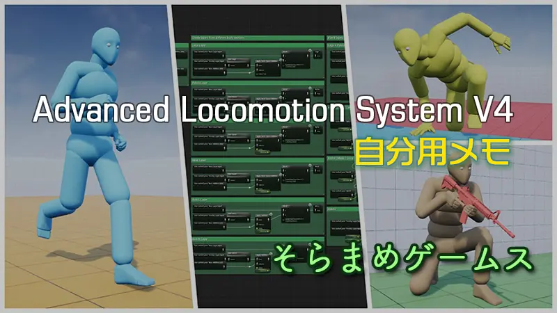

**重要提示：我们强烈建议您对蓝图有很好的理解，并且熟悉在您购买此款游戏之前如何进行游戏动画制作。这不是一个即插即用的游戏系统，如果您是UE4的新手，可能会感到困惑。**

**主要特点**

- 简单而灵活的**Base_Character BP**，采用曲线驱动的方法进行运动和旋转（无根运动，除滚动外所有运动**均由**代码驱动）。
- 强大的数据驱动**AnimBP**，具有智能的**运动混合**方法和强大的**分层系统**，可轻松添加游戏状态和变化，而不会产生大量额外的动画。其他功能包括**冲刺冲动**，**附加倾斜**，**着陆预测**，**就地旋转/旋转**，**IK脚**等等。
- 完全动态的**Mantling系统**，使用简单的轨迹来检查可攀爬的几何形状。曲线资产用于平滑的位置/旋转对齐和移动。

**次要特征**

- 实验数据驱动**摄像机系统**使用动画实例来搭载状态机功能，以便通过状态，混合和动画曲线轻松，详细地控制摄像机行为。
- 基本但功能齐全的**布娃娃混合**系统，可在布娃娃状态之间进行无缝**混合**。主要是为了好玩;）

**技术细节**

**主要的东西**

- 1个**Base_Character BP，**带有1个孩子。
- 1个**AnimBP**用于所有动画。
- 1个**播放器控制器**和3**个小部件**，可轻松进行调试。
- 1个**Player Camera Manager**，以及用于摄像机系统的附加AnimBP
- 4个**接口**，可在所有主要系统之间轻松通信。
- 1**数据表**以及整个系统中使用的多个**曲线**，**结构**和**枚举**。
- 1个新的**AnimMan**角色网格， 具有随附的物理资源，非常适合进行原型制作，并具有易于着色的功能（在子bp内）。
- 超过100个具有关键帧的**动画示例，**包括循环，姿势过渡等。

**次要的东西**

- 许多较小且非必要的内容，例如**AnimModifiers**，**AI示例**，**材质道具**以及一些简单的**BP，可**用于创建外观良好的测试级别：）

**第一章 名词讲解：**

**你可以跳过这一章，直接看第二章动画图（第一章只是基础节点知识）**

**1 虚拟骨骼****（Virtual Bones）**

概述能让您在编辑器中添加IK或动画约束关节的虚拟骨骼。

文档：https://docs.unrealengine.com/zh-CN/AnimatingObjects/SkeletalMeshAnimation/Persona/VirtualBones/index.html

在骨架编辑器 中，您可以使用骨架树将 **虚拟骨骼（Virtual Bones）** 添加到网格体的现有骨架中。这样有助于缩短迭代时间，使您能够从编辑器内部更改用于瞄准或IK（逆向运动学）的目标关节层级。在此之前，您必须在该编辑器之外的3D建模软件中添加这些骨骼，然后重新导入所有动画，将新关节包含在内以修复动画数据。

虚拟骨骼本质上是不可以添加皮肤的，并且可以约束在骨架层级中的两个现有骨骼之间使用，它们会自动为各个动画生成数据。 例如，您可以添加一个关节作为手部的子资源，但它将受到手掌关节的限制。与骨臼不同的是，该关节可以在动画蓝图 中用作目标，例如IK目标或&[#34;注视&#](https://search.bilibili.com/all?keyword=34%3B%E6%B3%A8%E8%A7%86%26)34;目标。甚至可以在动画蓝图中修改虚拟骨骼以供将来使用。

ALS骨架中包含VB开头的虚拟骨骼

**2 IK FK**

**逆向运动学（Inverse Kinematics）**（**IK**）提供一种从末端执行器的位置处理关节旋转的方法，而不是通过直接关节旋转。在实践中，您提供一个执行器的位置，然后IK解决方案解决旋转，使最终的关节尽可能与该位置重合。这可以用来让角色的脚停留在不平坦的地面上，并以其他方式与世界场景产生可信的互动。

虚幻引擎使用双骨骼IK系统，这对手臂和腿来说是一个完美的系统。

在虚幻引擎中，大多数动画骨架都是由直接旋转数据驱动，这些数据直接输入到角色的骨骼或骨架网格体中。这可以被视为是正向运动学，或旋转直接应用于关节或骨骼。下图说明了这个概念：

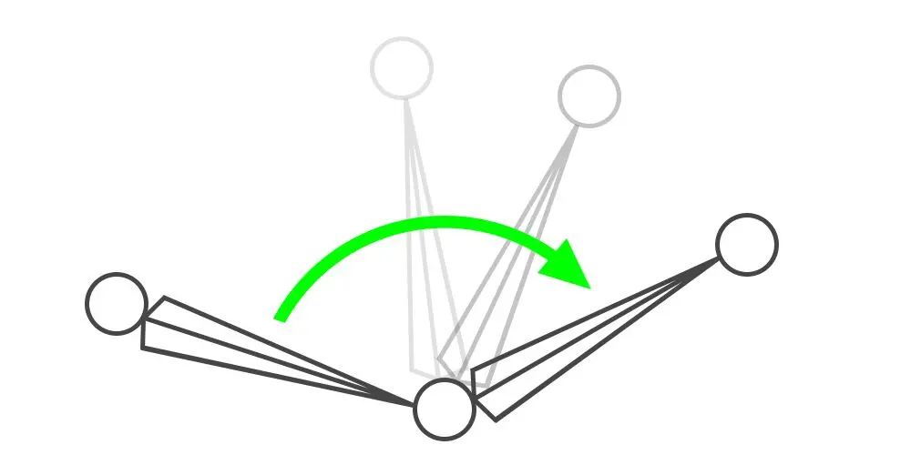

FK

顾名思义，逆向运动学的方向是相反的。我们不是对骨骼进行旋转，而是给骨骼链一个目标（也称末端执行器），提供骨骼链末端应该尝试达到的位置。用户或动画师移动执行器，IK解算器（IK系统中驱动旋转的算法）旋转骨骼，使链中的最终骨骼在目标位置结束。在下图中，末端执行器由红十字指定。

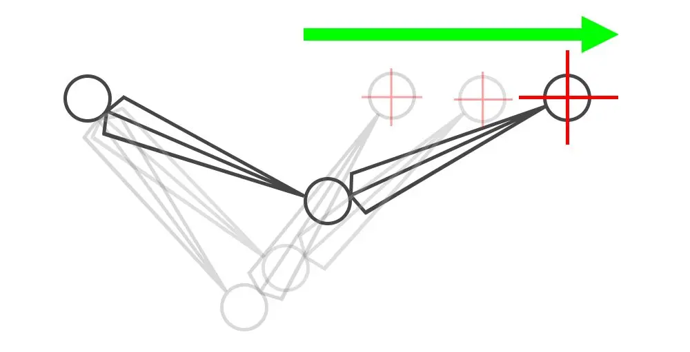

ik

**3 Animation Insights**

UE4.25新功能：Animation Insights，可以对动画进行详细的抓帧拆解分析

https://docs.unrealengine.com/zh-CN/TestingAndOptimization/PerformanceAndProfiling/UnrealInsights/AnimationInsights/index.html

编辑器拥有 **Animation Insights** 插件，可显示gameplay状态和实时动画行为。用户可以使用Animation Insights记录追踪信息，使用以下功能显示动画行为：

- 通道过滤，选择写至记录数据集的追踪数据
- 源过滤，选择输出追踪数据的gameplay对象
- 姿势、曲线、混合权重、动画图表、蒙太奇和动画通知轨迹
- 包含实时更新的动画图表原理视图，用于替换 showdebug animation 系统。

**4 转换规则 --惯性混合**

转换规则

用于控制状态机转换的规则指南

https://docs.unrealengine.com/zh-CN/AnimatingObjects/SkeletalMeshAnimation/StateMachines/TransitionRules/index.html

4.1惯性混合

惯性混合是一种混合类型，但惯性化系统本身并不从源动画采样。相反，开始切换到新动画时，运动中固有的速度和加速度将被用于推进运动。

惯性混合是UE4.24中添加的新混合方法。

在通过常规混合进行动画过渡时，权重从A转移到B，同时计算了动画A和B，但在惯性混合的情况下**，动画的计算立即从A转换为B，仅保留播放A时的运动惯性。**结果，在混合A的余辉的同时播放B，因此似乎可以在抑制处理负荷的同时执行自然的动画过渡。

立即使用此功能可实现ALS的某些部分。

对于要使用惯性混合的过渡，将“混合逻辑”设置为“惯性化”。

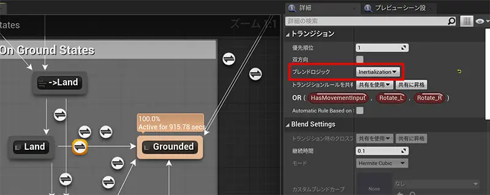

需在使用惯性化（Inertialization）节点指定惯性混合在AnimGraph中发生的位置。

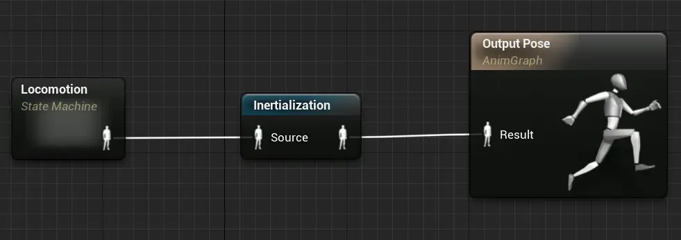

**5混合节点**

https://docs.unrealengine.com/zh-CN/AnimatingObjects/SkeletalMeshAnimation/NodeReference/Blend/index.html#%E6%83%AF%E6%80%A7%E5%8C%96

**混合节点（Blend Node）** 用于将多个动画混合起来。此类节点只能放置在动画蓝图的 **动画图（Anim Graph）** 中。每个混合节点获取多个姿势和一个阿尔法或权重值，这个值用来计算每个姿势在最终输出中的权重。一些混合节点可能更为复杂，且需要更多输入数据。

**5.1应用递增（Apply Additive）**

应用递增（Apply Additive） 和 应用网格体空间递增（Apply Mesh Space Additive） 节点根据阿尔法值向基本普通动画姿势添加递增姿势。

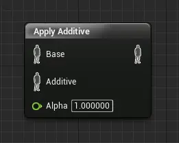

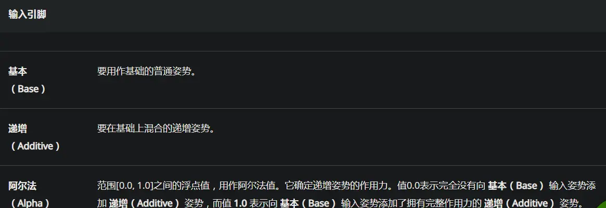

**5.2****混合（Blend）** 

**标准的** **混合（Blend）** **节点就是两个输入姿势根据阿尔法值的混合结果。**

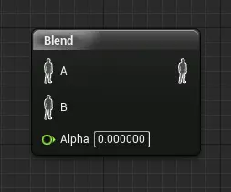

**5.3按布尔值混合姿势**

**按布尔值混合姿势（Blend Poses by bool）** 节点使用布尔值作为键，基于时间混合两个姿势。当布尔值为true时，使用与true输入引脚相连的姿势；当布尔值为false时，使用false姿势。每个姿势都有一个浮点值&[#34;混合时间（Blend Time）&#](https://search.bilibili.com/all?keyword=34%3B%E6%B7%B7%E5%90%88%E6%97%B6%E9%97%B4%EF%BC%88Blend%20Time%EF%BC%89%26)34;，用来控制混入这个姿势所需的时间。

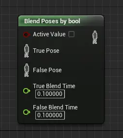

**5.4按整数值混合姿势**

**按整数值混合姿势（Blend Poses by Int）** 节点使用整数值作为键，基于时间混合任意数量的姿势。对于每个输入整数值，将使用与该值输入引脚关联的姿势。例如，当整数设为0时，将使用与&[#34;混合姿势0（Blend Pose 0）&#](https://search.bilibili.com/all?keyword=34%3B%E6%B7%B7%E5%90%88%E5%A7%BF%E5%8A%BF0%EF%BC%88Blend%20Pose%200%EF%BC%89%26)34;相连的姿势。每个姿势都有一个浮点值&[#34;混合时间（Blend Time）&#](https://search.bilibili.com/all?keyword=34%3B%E6%B7%B7%E5%90%88%E6%97%B6%E9%97%B4%EF%BC%88Blend%20Time%EF%BC%89%26)34;，用来控制混入这个姿势所需的时间。

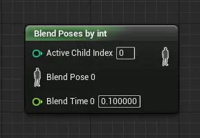

**5.5按列举混合姿势**

**按列举混合姿势（Blend Poses by Enum）** 节点将列举值用作键，并基于时间在姿势间进行混合。可使用默认姿势，也可通过 **活跃列举值（Active Enum Value）**，在连接列举中添加已辨识值的额外姿势。此外，各姿势均具有用于控制混合到姿势所需时长的浮点值&[#34;混合时间&#](https://search.bilibili.com/all?keyword=34%3B%E6%B7%B7%E5%90%88%E6%97%B6%E9%97%B4%26)34;。

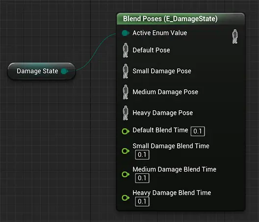

**5.6按骨骼分层混合**

**按骨骼分层混合（Layered blend per bone）** 节点执行遮掩混合，这种混合方式仅影响骨架中的一小部分特定骨骼。例如，如果您只想对一个角色腰部以上的部位应用动画，可以使用 **按骨骼混合（Blend Per Bone）** 来实现。

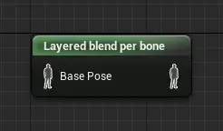

**5.7插槽**

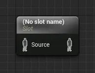

**插槽（Slot）** 节点显示来自给定动画插槽的结果动画。

**5.8 惯性化**

惯性混合是传统动画淡入淡出的高性能替代方案，可生成后期处理的自然过渡。激活惯性混合后将不再计算源姿势。相反，传统混合在过渡期间会计算源姿势和目标姿势，将其组合成混合姿势。动画图表必须包含 **Inertialization** 节点方可使用惯性混合。

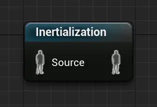

在图表中，Inertialization节点位于惯性混合请求源 之后 的位置。Inertialization节点追踪姿势运动和曲线变化，以便在激活惯性混合后继续向目标动画移动。此节点由流入源姿势的惯性混合请求来激活。**状态机过渡**、**混合节点**、**链接动画图表**、**链接动画层** 均可触发惯性混合

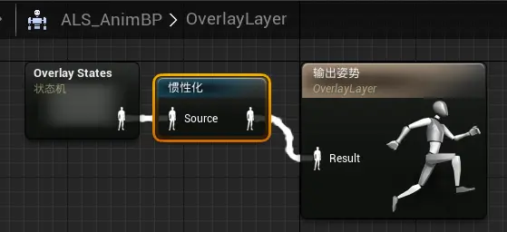

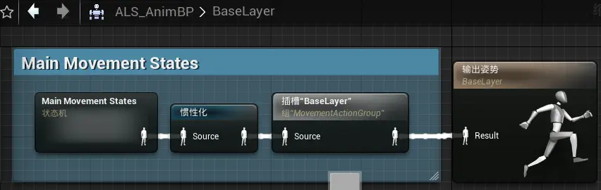

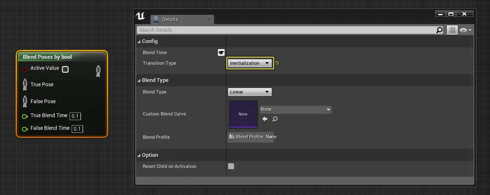

上图中，**Blend Poses by bool** 节点的过渡类型设为惯性化（Inertialization）。要使用惯性混合，在动画图表中，Inertialization节点必须放置在Blend Poses by bool节点之后的位置。

下图中两个 **转换规则（Transition Rules）** 的 **混合逻辑（Blend Logic）** 已设为使用惯性化。要使用惯性混合，在动画图表中，Inertialization节点必须放置在包含此类过渡的 **State Machine** 节点之后的位置。

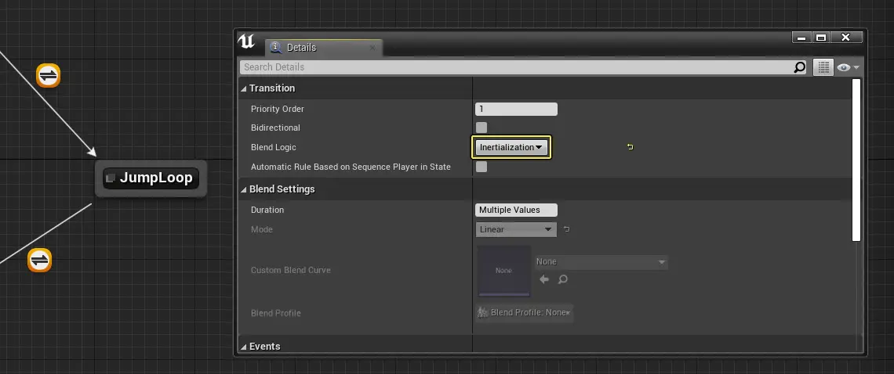

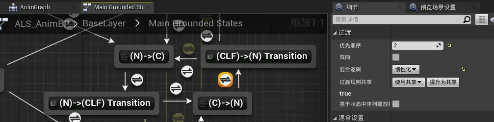

ALS

**6 惯性化 基于惯性的动画混合**

在GDC2018上，微软作了题为“惯性化：&[#39;战争机器&#](https://search.bilibili.com/all?keyword=39%3B%E6%88%98%E4%BA%89%E6%9C%BA%E5%99%A8%26)39;中的高性能动画过渡”的演讲。这是一次实用且不错的演讲，所以我会解释一下。

https://www.gdcvault.com/play/1025331/Inertialization-High-Performance-Animation-Transitions

https://hogetatu.hatenablog.com/entry/2018/06/02/185613

- 传统的交叉渐变动画由于融合在，融合，有必要评估两个动画，有一个问题是，跳跃是由游戏的状态瞬时处理成本。
- 在进行动画过渡混合后进行后处理时，混合中的《战争机器》动画退出了对两个动画进行评估的评估。
- 混合可以在开始时保持关节速度，甚至可以在过渡动画自然混合之前停止评估。

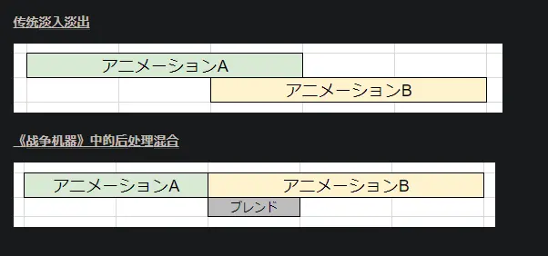

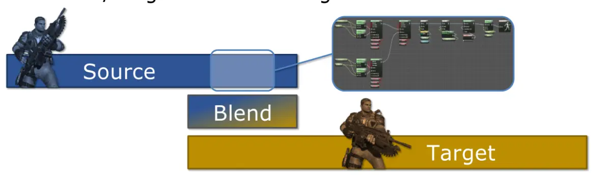

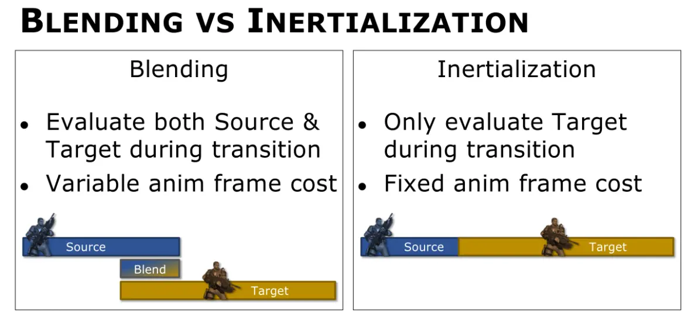

anim frame 动画帧

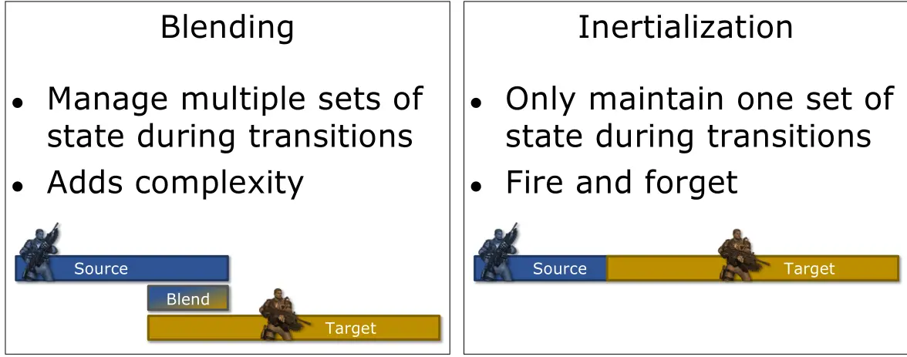

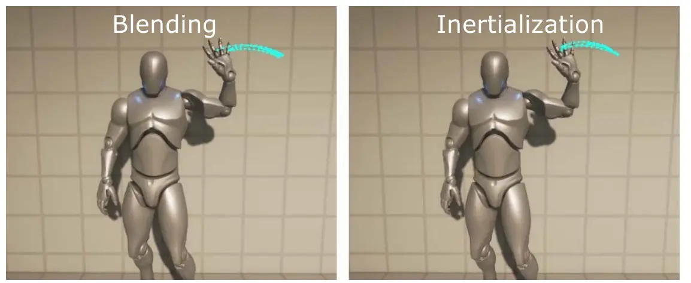

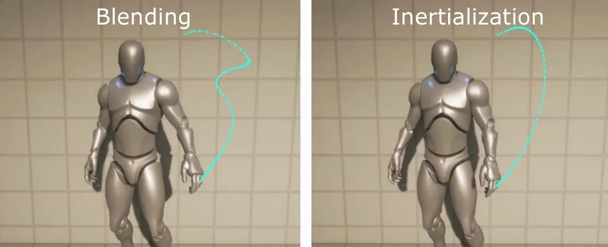

**7动画压缩**

在UE4中，当从FBX等导入动画时，在所有帧中内部烘焙关键点以创建中间数据（uasset）。但是，这会增加运行时处理的资产大小，因此我们使用一种从编辑器或cmdlet压缩烘焙密钥并在采样时将其解压缩的方法。

在打包和简化时，但是如果在编辑器上使用uaset，则数据与压缩DDC有关，如果共享，DDC不需要为每个工作机执行压缩。

https://hogetatu.hatenablog.com/entry/2018/12/05/000944

**8 Control Rig**

虚幻引擎4中的Control Rig是一个基于蓝图的可编脚本绑定系统，主要用于控制属性来驱动动画。

https://docs.unrealengine.com/zh-CN/AnimatingObjects/SkeletalMeshAnimation/ControlRig/index.html

虚幻引擎4中的Control Rig是一个基于蓝图的可编脚本绑定系统，主要用于控制属性来驱动动画。然而与蓝图不同，Control Rig不依赖于蓝图虚拟机（VM），而使用其自身的轻量级VM来转化代码（通常为复制和执行）。Control Rig使用一个基于图表的节点接口，在此处将节点（其为代码的可执行部分，称为 **Rig Units**）连接起来，实现并驱动由Rig Unit网络和属性所定义的动画。

导入一个骨架网格体将生成一个层级，以便用户使用Rig Units来驱动和设置骨架网格体中骨骼的动画。**层级（Hierarchy）** 可以是到Rig Units的输入或输出，与正在被输入或输出到动画蓝图中动画节点的姿势相似。层级自身可被导入，关节可被添加、移除、甚至被重命名。Control Rig并非只绑定到骨架网格体，因为用户可以通过Rig Units提供并应用变换属性，从而使用蓝图actor或对静态网格体设置动画（例如移动平台）。 

需要完成过程化绑定、在引擎中设置动画，或设置重定向或完整形体IK解决方案时，均可在项目中使用Control Rig。不使用引擎中的Control Rigs也可完成重定向和完整形体IK；然而较之于其他方法，Control Rigs整合度更高、自定义程度更高，脚本编辑性也更高。

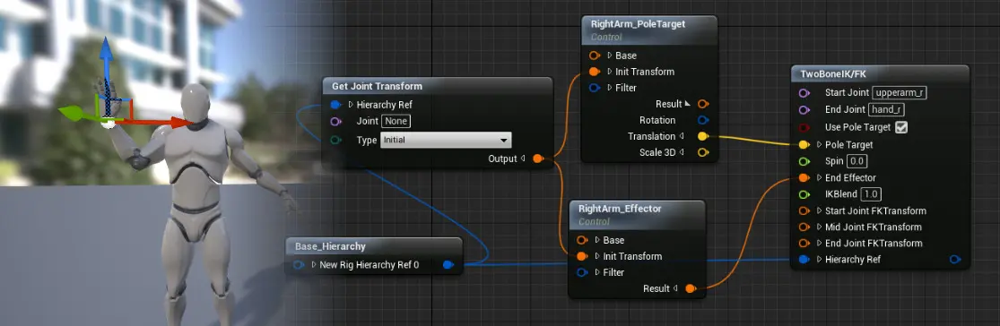

**9Anim Modifier  动画修改器**

动画修改器可以让用户为特定动画序列或骨架定义一个动作序列。

https://docs.unrealengine.com/zh-CN/AnimatingObjects/SkeletalMeshAnimation/AnimModifiers/index.html

**动画修改器（Anim Modifier）** 是一种原生或蓝图类 ，让用户可以对动画序列 或骨架 资源应用一系列动作。 例如，精确定位左脚或右脚踩到地面时的帧来创建自动脚部同步标记（等诸如此类的各种应用）。通过使用该信息，可以将 **动画同步标记** 添加到脚部骨骼处于最低点（或接触地面）时的帧。

**10同步组 Sync Group**

**通过同步组，你可以让长度不一的动画保持同步。**

https://docs.unrealengine.com/zh-CN/AnimatingObjects/SkeletalMeshAnimation/SyncGroups/index.html

**同步组** 使相关的动画相互保持同步，即使它们长度不一也不例外。例如，可以制作要混合在一起的行走循环和跑步循环，使角色能够流畅地加速或减速。但是，同一个角色的行走循环通常会明显比跑步循环长。在这种情况下，直接将两者混合会产生不自然的结果，比如脚部动画切换时会有很难看的&[#34;节拍&#](https://search.bilibili.com/all?keyword=34%3B%E8%8A%82%E6%8B%8D%26)34;动作。

同步组解决这个问题的办法是将一个主要动画节点指定为 **领导者**，并调整所有相关动画的长度，使其与领导者的长度匹配。通常领导者就是具有最大混合权重的节点。随着权重混合，跟随者的权重超过领导者的权重，跟随者就会成为领导者。通过这种方式，两种动画可以流畅地相互配合，提供从一种动作到另一种动作的无缝转换。

但是请注意，由于动画的时长改变，需要考虑某些动画方面的因素。以行走循环和跑步循环的混合为例，两种动画都应该在同一只脚上开始和结束。及早建立这些标准将有助于使所有动画的混合难度大大降低！

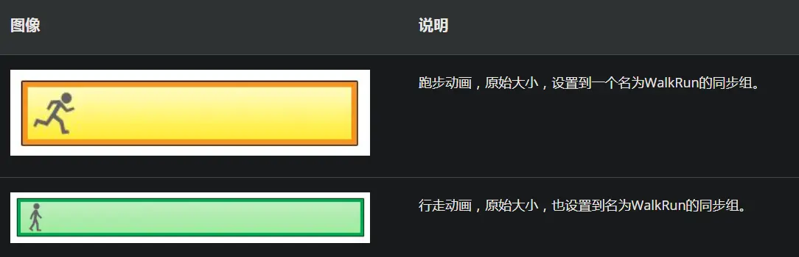

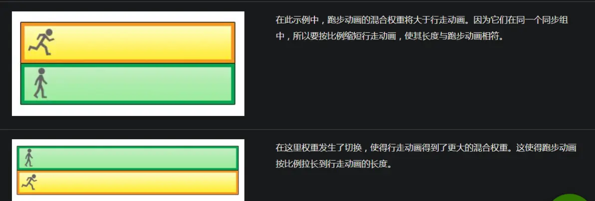

**设置同步组**

要设置同步组，请选择&[#34;动画图（AnimGraph）&#](https://search.bilibili.com/all?keyword=34%3B%E5%8A%A8%E7%94%BB%E5%9B%BE%EF%BC%88AnimGraph%EF%BC%89%26)34;中的动画节点，然后查看 **细节（Details）** 面板。你将会看到&[#34;同步组（Sync Group）&#](https://search.bilibili.com/all?keyword=34%3B%E5%90%8C%E6%AD%A5%E7%BB%84%EF%BC%88Sync%20Group%EF%BC%89%26)34;属性。

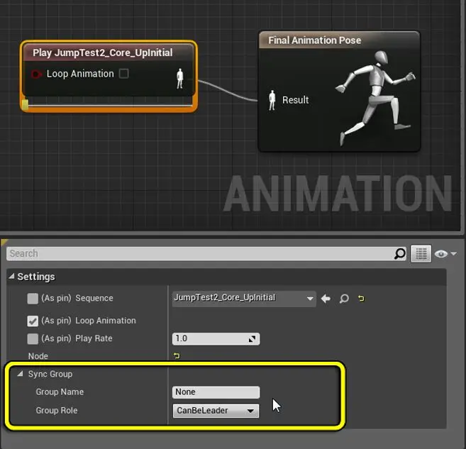

**基于标记的动画同步**

除了同步组以外，还可以在动画中使用标记来同步动画。

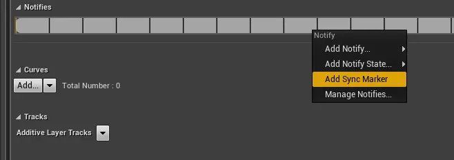

要添加同步标记，在动画序列的 动画通知（通知） 轨迹中，右键单击并选择 **添加同步标记（Add Sync Marker）**。

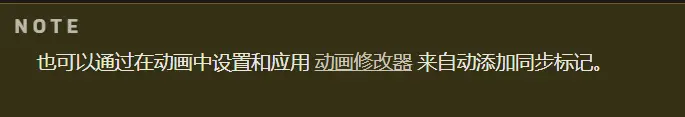

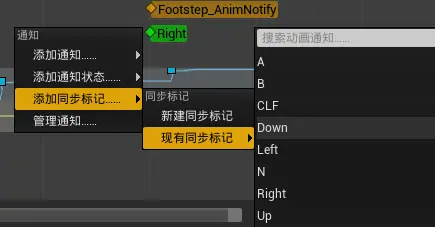

ALS

上图绿色的是ALS的同步标记。

**11 动画通知（通知）****AnimNotifies**

通知是一个系统，其在动画序列中设置和接收事件，以执行外部操作。

**动画通知**（**AnimNotifies** 或 **通知**）为动画程序员提供了一种方式，以便设置事件在 **动画序列** 中的特定点上发生。通知常用于在行走或跑步动画中添加脚步声之类的效果，或在动画中生成粒子系统。它们用途广泛，系统可随自定义通知类型进行延展，以满足各种游戏的需求。

不同类型的通知会导致不同事件被触发。举例而言，相机效果、粒子效果、音效均可借助通知在动画中的任意点进行触发。在动画中需要触发通知的点上右键点击 **通知** 轨迹，选择通知类型，即可完成通知的添加。

**11.1骨架通知**

**骨架通知** 全面负责美术师在动画中特定点上 **动画蓝图** 中执行的操作。在通知轨迹上点击右键，从快捷菜单中选择 **添加通知**，然后选择 **新建通知**。

创建的所有骨架通知都将显示在 **骨架通知** 菜单下。

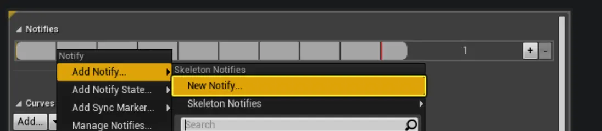

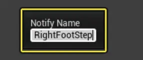

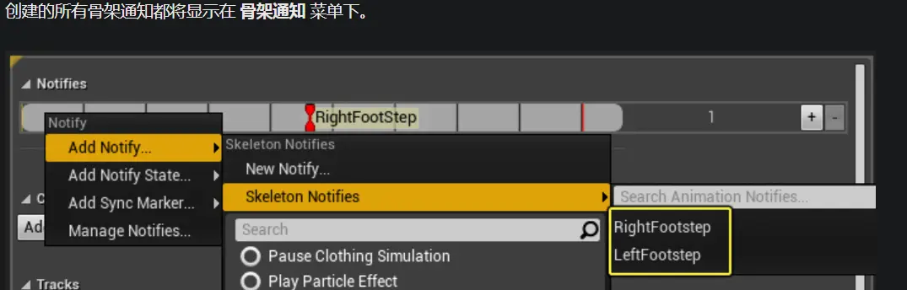

**11.2添加通知状态**

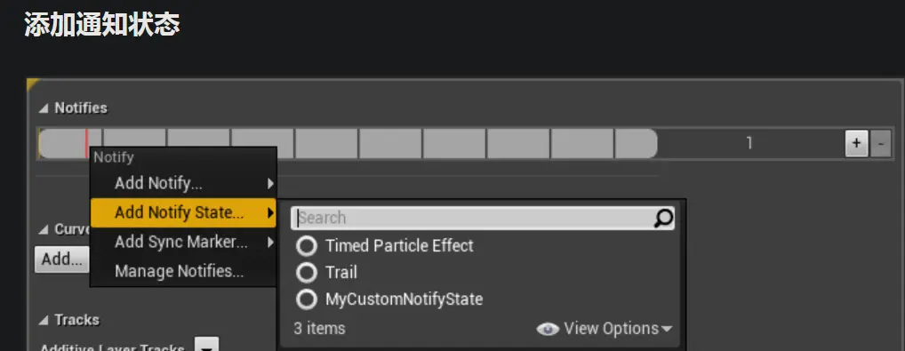

**动画通知状态**（**通知状态**）与上方的标准通知相同。它们拥有3个独特事件：一个开始、一个tick，以及一个结束。它们将直接开始，在通知开始和结束时触发，其中的 **事件图表** 到达动画中特定时间时也会触发。每次动画更新均会触发tick，直到命中结束事件。普通通知和通知状态之间的主要差异是通知状态为自含式蓝图 。

使用通知状态时需要注意的其他事项： 

- 必定以通知开始（Notify Begin）事件作为开始。
- 必定以通知结束（Notify End）事件作为结束。
- 必定将通知Tick包裹在在通知开始和通知结束事件之间。
- 不同动画通知（普通或状态）之间的排序并非固定。如将两个动画通知状态放置在一起，第一个结束之后第二个并不一定会开始。只可将此用于不依赖于其他通知的单个操作。
- 支持负播放率。但仍会首先调用Notify Begin，最后调用Notify End。

如果每帧进行修改，则应使用通知状态的Tick蓝图。如果需要在tick命中之前将变量、标签或属性设为一定的值，则应使用Begin蓝图。最后，在最终tick命中后可使用End蓝图来修改变量、标签或属性。

**自定义通知状态**

创建自定义通知状态（其与原生通知状态相同，但却是自定义蓝图，可提供动画中需要发生的逻辑）的方法与添加常规通知相同。在使用自定义通知状态之前，必须首先为动画通知状态类创建蓝图类 。创建后，右键点击动画的 **通知轨迹** 并选择 **添加通知状态**，然后选择自定义通知。

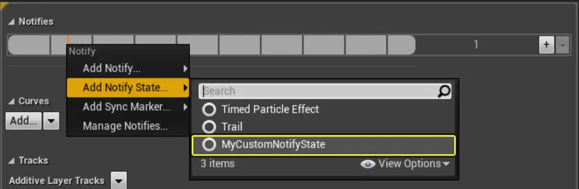

**添加同步标记**

可将同步组 用于同步关联动画。也可使用关联动画中的 **同步标记（Sync Markers）** 来同步动画。右键点击&[#34;通知轨迹（Notifies Track）&#](https://search.bilibili.com/all?keyword=34%3B%E9%80%9A%E7%9F%A5%E8%BD%A8%E8%BF%B9%EF%BC%88Notifies%20Track%EF%BC%89%26)34;窗口并选择 **添加同步标记（Sync Markers）** 即可添加同步标记。

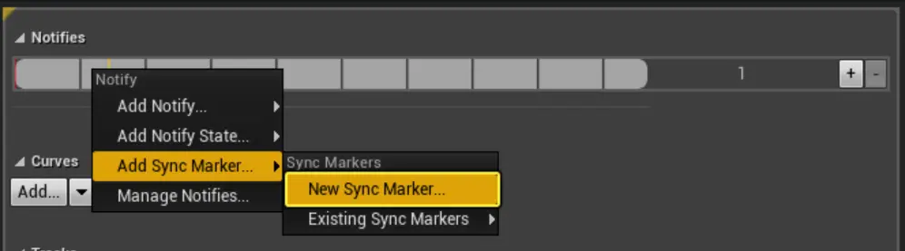

**12  动画曲线**

**用于在整个动画播放过程中驱动变形目标和材质的曲线系统。**

**动画曲线（Animation Curves）** 提供一种在动画播放时更改材质参数值或变形目标值的方法。它们的工作流要求您指定要修改的资源（材质或变形目标），相应地命名曲线，然后在动画的持续时间内调整关键帧值。

当您通过FBX将变形目标动画导入UE4时，系统将自动为该动画序列生成变形目标曲线。但是，在默认情况下，它们呈隐藏状态。如此处理是特意设计的；隐藏可能是许多不同的变形目标曲线可以防止编辑器放慢速度。

应注意的是，为变形目标调整曲线的功能不仅很有用，同时也比其他任何功能都更加方便。当您正在处理一个非常复杂的变形目标动画时，如果您在导出原始变形目标的3D动画包中执行该动画，那么您可能会轻松得多。

在 **骨架编辑器（Skeleton Editor）** 或 **动画编辑器（Animation Editor）** 中打开 **动画曲线（Anim Curves）** 面板：

- 单击 **窗口（Window）** 菜单，然后从下拉菜单中选择 **动画曲线（Anim Curves）**。

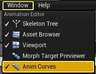

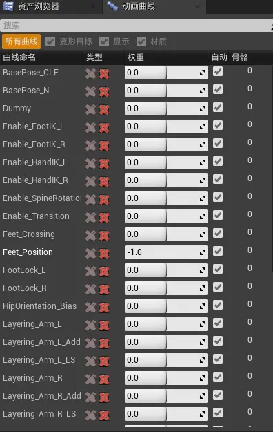

ALS动画曲线

**动画曲线（Anim Curves）** 面板显示选定骨架的 **变形目标（Morph Target）**、**属性（Attribute）** 和 **材质（Material）** 曲线的曲线值。 您可以在此处删除和重命名曲线，以及预览曲线数据。 您可以通过单击 **所有曲线（All curves）** 取消选中它来过滤可见曲线，从而只显示活动曲线，这也使得您可以使用复选框来按 **变形目标（Morph Target）**、**属性（Attribute）** 和 **材质（Material）** 曲线进行过滤。 此外，您可以定义材质曲线 ，使您能够驱动材质参数或变形曲线。

**12.1 通过动画曲线进行混合控制**

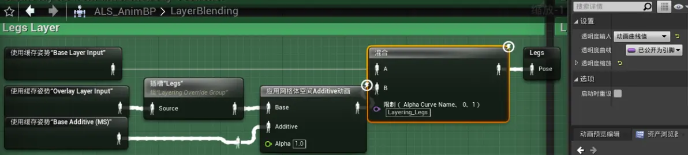

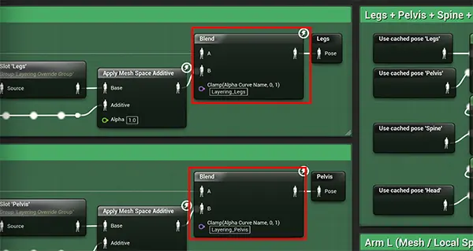

指定混合权重时，ALSv4在许多地方使用动画曲线变量。

动画序列资产最初具有添加变形和材质参数曲线的能力。

作为一个易于理解的示例，让我们研究将枪支姿势与角色的普通动画混合的过程。

首先，如果您查看枪械姿势的动画序列，则有动画会切换每一帧的姿势。 此外，还添加了许多动画曲线，并为所有帧设置了关键帧。

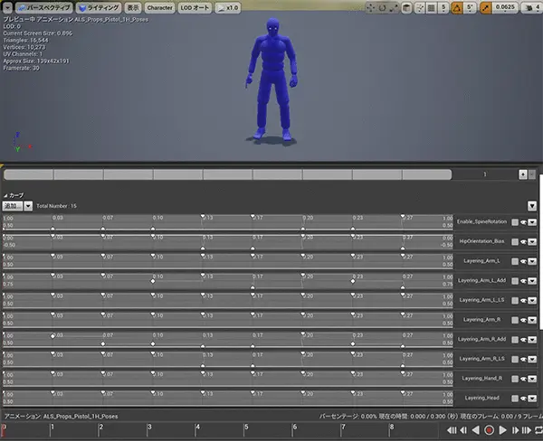

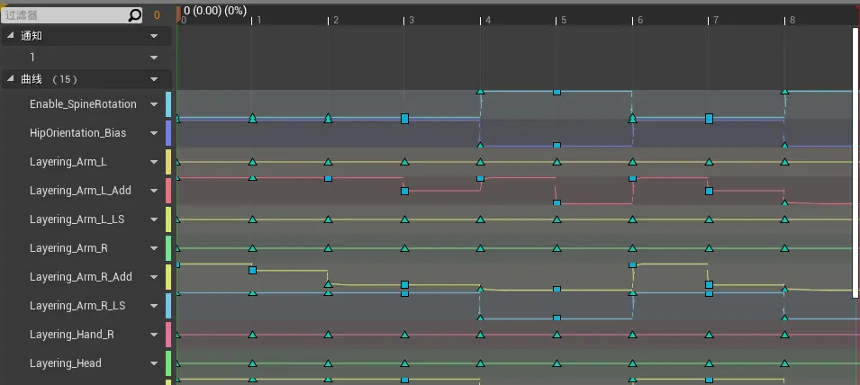

接下来，我们来看看使用这个姿势的地方。

看一下通常动作和混合的地方，就能知道是根据身体部位混合而成的。

通过使用与各部位相对应的动画曲线的值作为权重，可以决定要混合哪个部位。

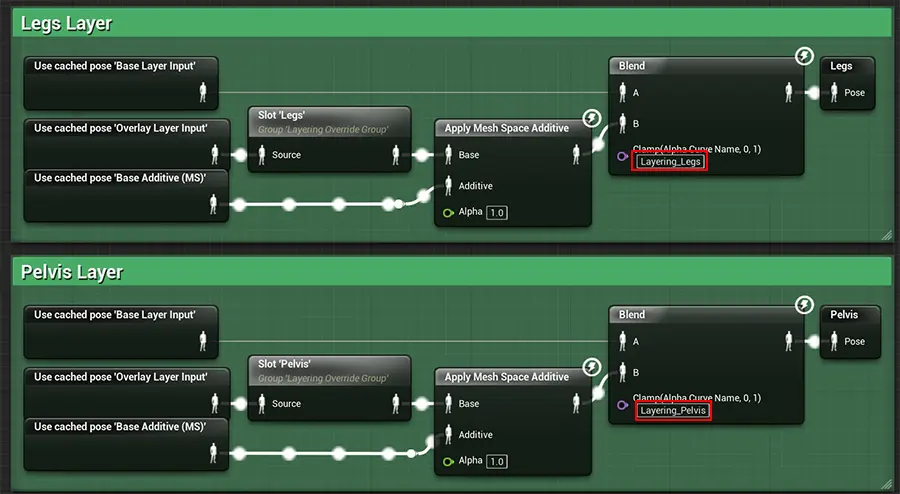

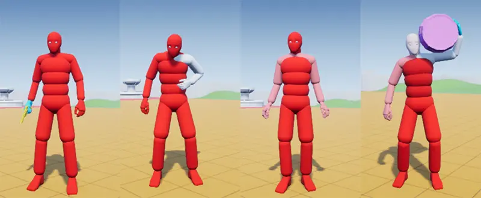

使用动画曲线管理混合哪些部位

同样，姿势在动画序列的每个时间都不同的原因似乎是通过指定时间来根据当前姿势选择要引用的姿势。

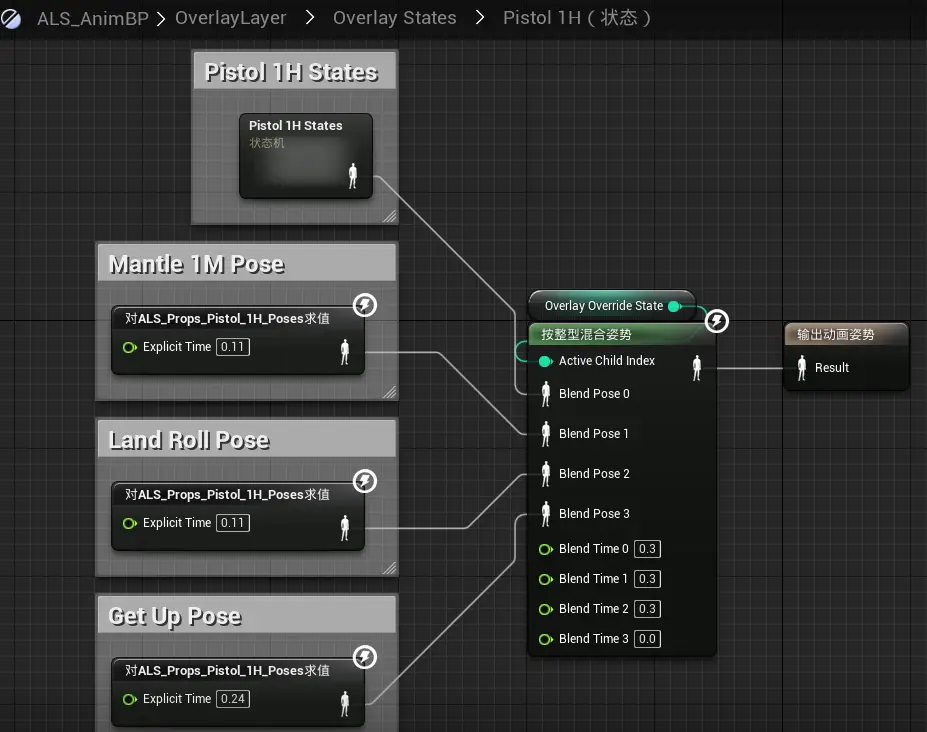

**13 动画蓝图链接**

**动画蓝图链接** 系统是子动画实例 的扩展。它支持在动画图表上动态切换子部分，因而支持多用户协作，而且由于动画蓝图不再加载未使用的动画，因而还可节约内存。

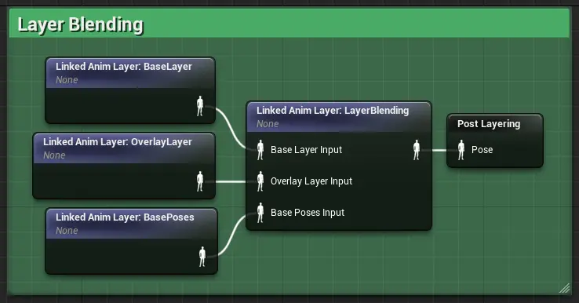

动画蓝图链接也是UE4.24中添加的功能。

在UE4.22之前，“我的动画蓝图”被分为事件图和动画图的[Graph]部分，但是从UE 4.23开始，“动画图”被划分为[Animation Graphs]部分。还有一个附加部分称为[动画层]。

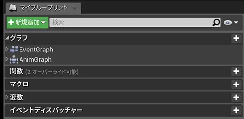

在UE4.22之前，将EventGraph和AnimGraph组合在一起

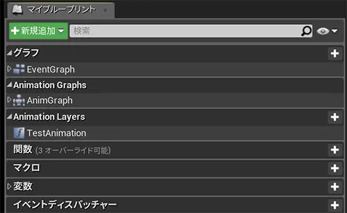

UE 4.23和更高版本具有新的“动画层”部分

动画层是类似于函数的AnimGraph版本的图像，该图像划分并重用了节点网络，并且似乎是Sub Anim Instance先前提供的函数的扩展版本。在这里，为了区别起见，在动画层中实现的节点网络称为**layer**。

动画蓝图链接调用并使用添加到此动画层中的层，就像一个函数一样。

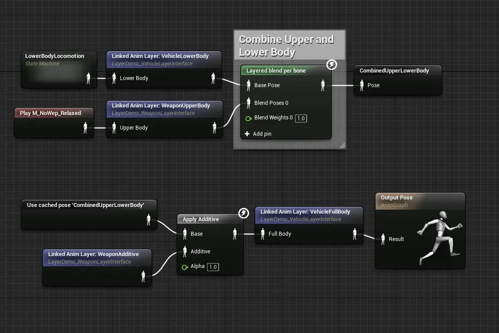

在堡垒之夜的使用示例（引自UE4官方文件）

我写道，它的用法类似于函数，但实现本身类似于创建接口，实际上，除了直接在“我的蓝图”中实现之外，**它还继承了作为动画层接口资产实现的接口并实现了内容**在文档中以这种方式对此进行了描述。

https://docs.unrealengine.com/zh-CN/AnimatingObjects/SkeletalMeshAnimation/AnimHowTo/LinkedAnimBP/index.html

**第二章 动画图** **AnimGraph**

**一 概述**

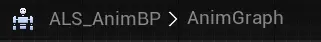

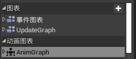

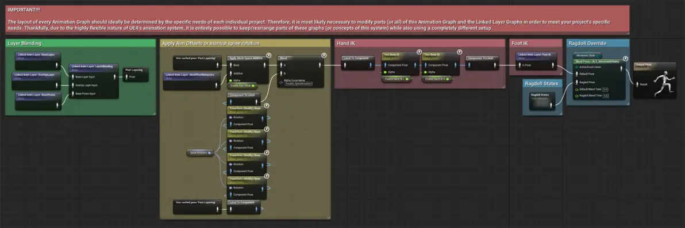

理想情况下，所有动画图的布局应由单个项目的特定需求确定。因此，**此动画和链接层图的某些（或全部）将需要修改以满足项目的特定需求。**值得庆幸的是，UE4的动画系统非常灵活，您可以使用完全不同的设置，同时保留/重新排列其中一些图形（或该系统的概念）。

ALS指出，应根据项目需求自由重写此图。为此，您需要了解每个过程在做什么。

查看实际的处理过程，我们将按顺序查看它们，因为它们是根据其一般角色按颜色分组的。

**1 图层融合**

**在“图层混合”组中**，将三个动画层（称为BaseLayer，OverlayLayer和BasePoses）与动画层（称为LayerBlending）混合，并保存在名为“ Post Layering”的缓存中。

**在此绿色组中完成了基于动画资产的计算。**

**2 应用“目标偏移”或手动脊椎旋转**

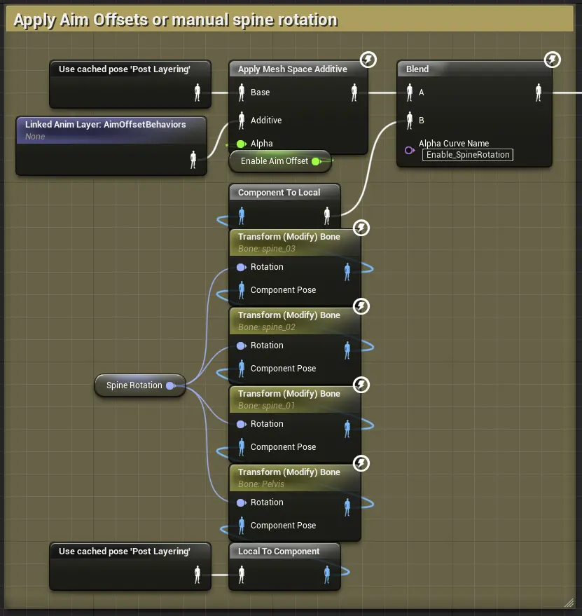

**在“应用目标偏移”或“手动脊柱旋转”组中**，基于在绿色组中确认的动画，**计算通过瞄准操作进行**的**身体定向操作和****手动脊柱旋转****。**

**3手部IK和脚部IK**

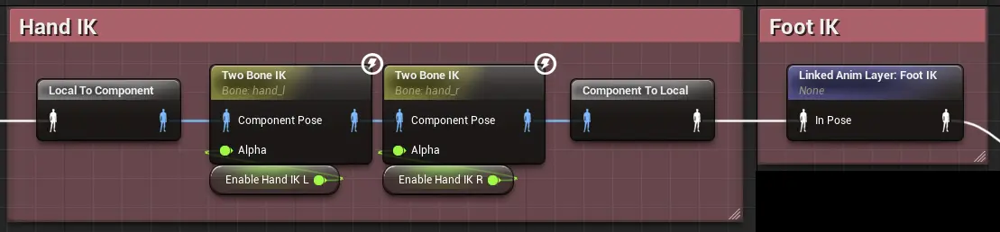

Hand IK组和Foot IK组计算手的IK和脚的IK。

**4Radgdoll重写**

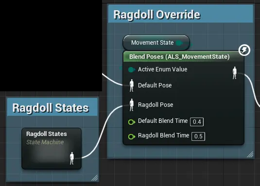

**布娃娃组****计算**的**rugdoll并覆盖动画。**

**二 图层混合组**

引用文章：https://zhuanlan.zhihu.com/p/159646345

本节介绍“图层混合”的内容，它是AnimGraph顶层节点网络中的绿色组。

LayerBlending组将BaseLayer、overlayer、BasePoses这三个层混合在一起，称为LayerBlending。

混合使用了Animation Blueprint Linking的功能。这里只要把它当成函数就可以了。

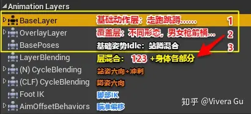

**1 BaseLayer**

**BaseLayer****确定**角色的**常规动画**。

例如，如果角色具有在角色拿着武器或受伤时会改变动画的规格，则不在此处计算。

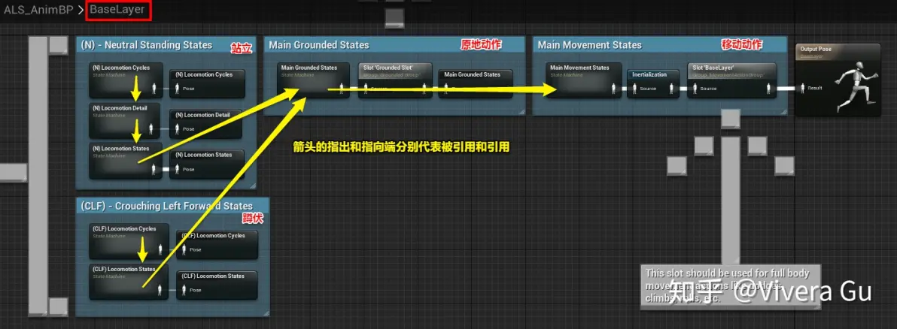

BaseLayer由四组组成。下面，我们将研究每个组。

**1.1自然站立状态和蹲伏的左前状态**

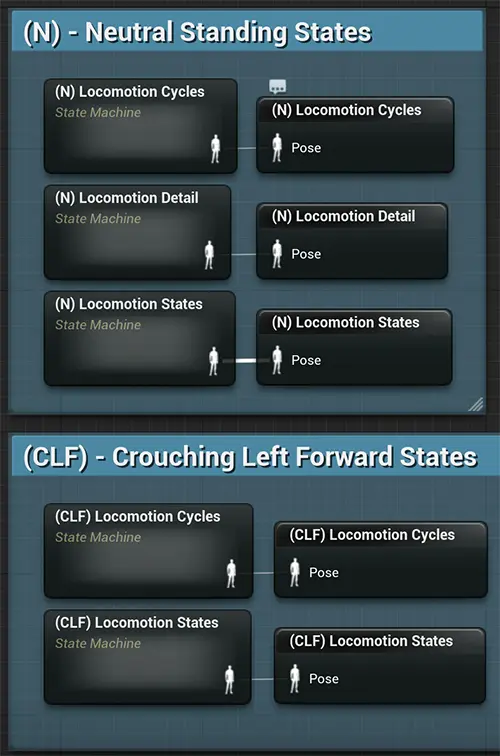

BaseLayer左侧的两个是确定站立和坐姿基本姿势的组。

让我们看一看(Neutral Standing States自然站立状态。从低端状态机比较容易理解，因此让我们从(N) Locomotion States状态开始。

参考文章 ：https://zhuanlan.zhihu.com/p/159646345

**1.1.-1****站立运动循环（N）Locomotion Cycles：**

**https://zhuanlan.zhihu.com/p/159646345**

**1.1.0****站立运动细节（N）Locomotion Detail**

https://zhuanlan.zhihu.com/p/159646345

**1.1.1****站立运动状态（N）Locomotion States**

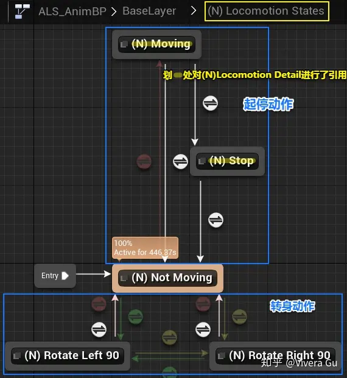

有Not Moving(待机)，Moving(移动)，Stop(停止)，Rotate Left/Right 90(朝向90度移动)的状态，这个状态机的结果是基本姿势。

**1.1.1.1(N) Not Moving**

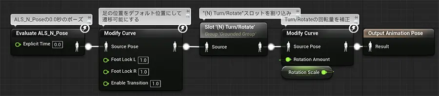

在待机状态下，将播放站立姿势。

旋转相机时，会在[（N）旋转/旋转]插槽中插入改变现场方向的“就地旋转”动画。通过使用[修改曲线]节点校正“旋转量的动画曲线”，可以使角色正确地对准摄像机。

通过TurnInPace函数执行更改这些方向的判断处理。

**1.1.1.2(N) Moving**

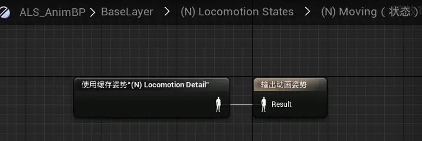

如果在UpdateGraph侧出现ShoudMove标志，则转移到移动中的状态。

其内容是接受“(N) Locomotion Detail”的姿势。

**1.1.1.3(N) Stop**

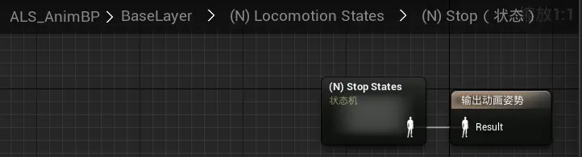

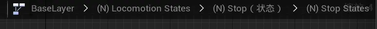

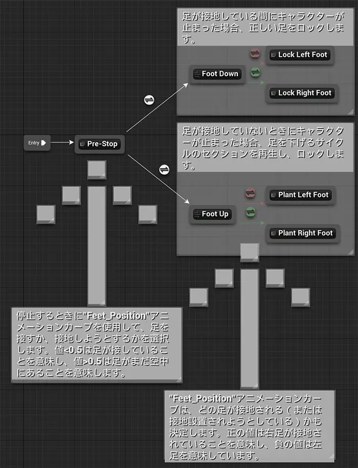

在停止状态下，动画的状态根据停止时脚是否在地面上而变化。

行走时，动画中将包括称为“ Feet_Position”的动画曲线，并且该值会更改，以使两只脚接触时变为0.0，举起右脚时变为1.0，举起左脚时为-1.0。 ..

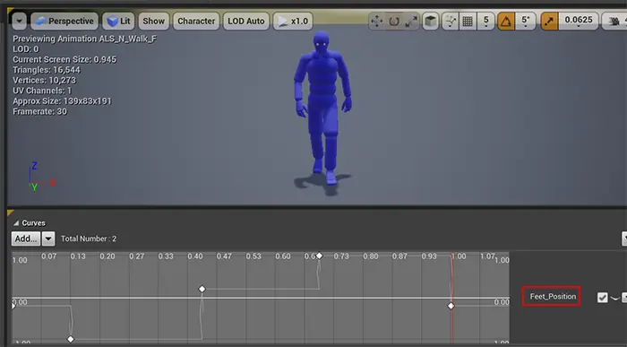

分支的一端是脚接地时的“Lock Left Foot”和“Lock Right Foot”的情况下，一边使用“(N) Locomotion Detail”的姿势，一边设定接地的那一端的“Foot Lock L(R)”的Anim Curves。

如果脚在地面上时分支目标是“锁定左脚”和“锁定右脚”，则在使用“&#39;（N）运动细节”的姿势时会使用地面上的脚。设置动画曲线，称为“ Foot Lock L（R）”。

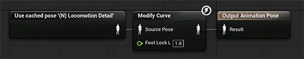

下一个分支的尽头是脚不接地时的“Plant Left Foot”和“Plant Right Foot”，就像下图一样。

如果脚不与地面接触时下一个分支目标是“Plant左脚”和“Plant右脚”，则如下图所示。

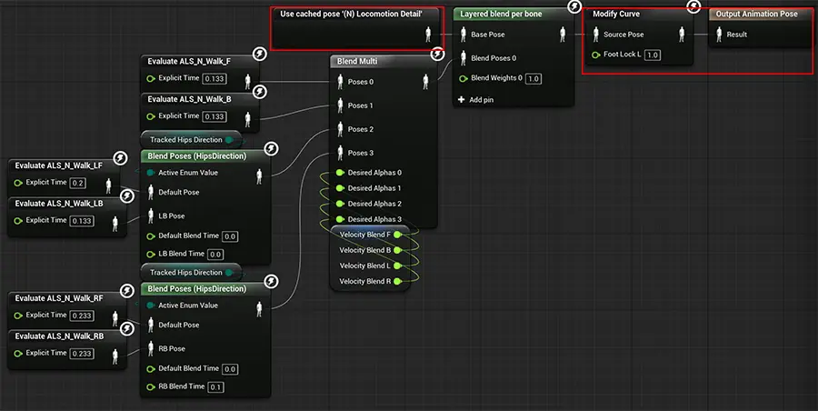

红线包围的部分与“左脚锁定”相同，但是增加了在空中漂浮的脚的混合过程。

**1.2** **蹲姿运动**

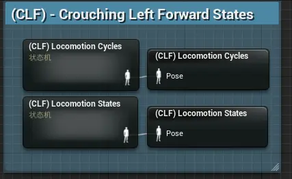

**1.2 .1****蹲姿运动循环（CLF）Locomotion Cycles：**

**https://zhuanlan.zhihu.com/p/159646345**

**1.2.2** **蹲姿运动状态（CLF）Locomotion States：**

https://zhuanlan.zhihu.com/p/159646345

**1.3 主地面状态 Main Grounded States：**

**1.4 主运动状态 Main Movement States：**

**2叠加层** **OverlayLayer**

**OverlayLayer**是**一层，用于确定用于覆盖**由BaseLayer确定的原始状态的动作的状态的动画**。**

根据角色的状况，您可能希望将特定的身体部位摆成不同的姿势。例如，当您拥有枪支时，想要像将枪支握在胸前一样固定双臂，而当左臂受伤时，左手垂下，右手覆盖左臂。您可以想到这样的姿势。

ALS的默认动画蓝图提供了许多叠加状态作为示例，可以使用Enum（枚举类型）进行切换。

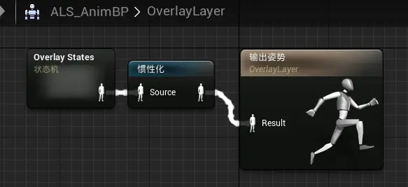

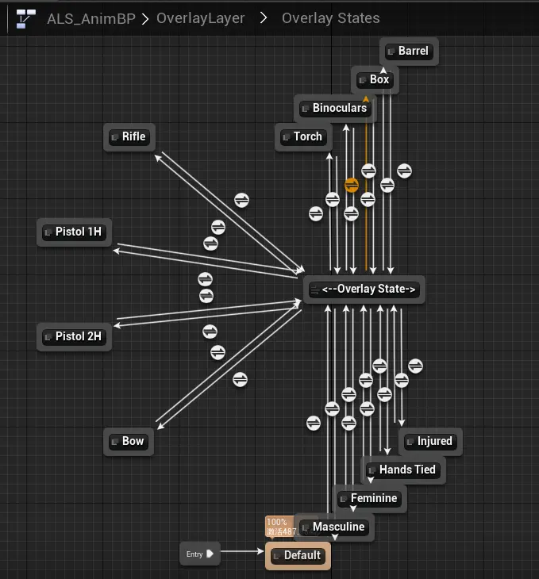

因此，**如果要根据游戏中角色的状态混合姿势和动画，则将动画添加到“叠加层”中。**

**3 基本姿势BasePoses**

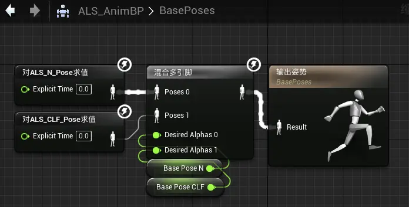

ALS _n_pose是正常的站立状态，ALS _clf_pose左脚直立的蹲伏状态。

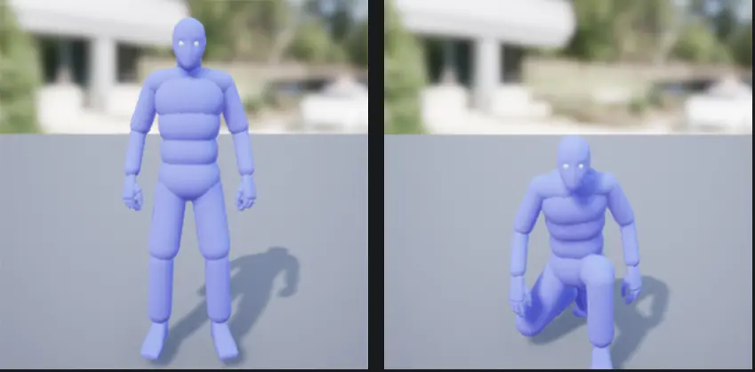

**4 层混合 LayerBlending**

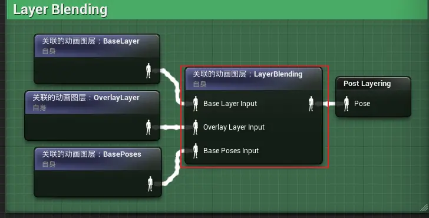

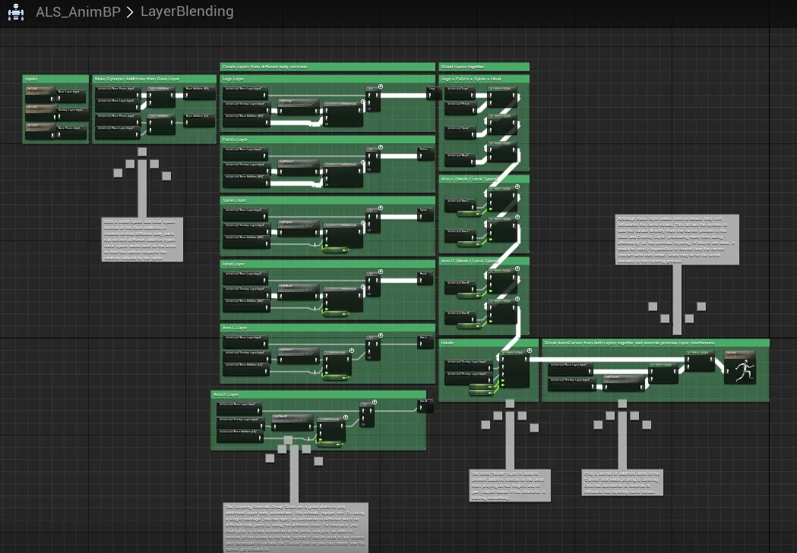

**4.1 输入项**

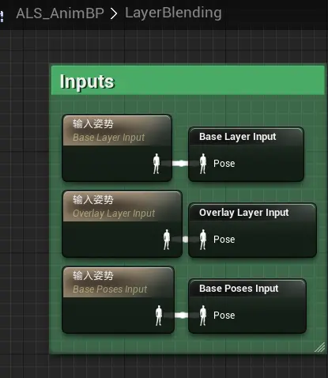

首先，以上123 三层动画将作为输入出现。

**4.2 Make Dynamic Additives from Base Layer**

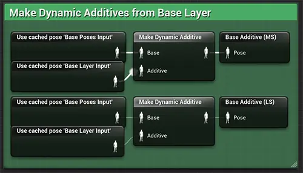

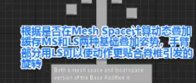

通过BasePoses和BaseLayer来创建加法姿势。这个时候先制作网格空间版和本地空间版，每个部位选择使用哪个，

局部空间是为了在持枪的时候控制手臂的方向而使用的。

**4.3从不同的身体部位创建图层**

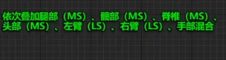

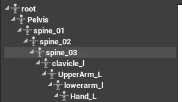

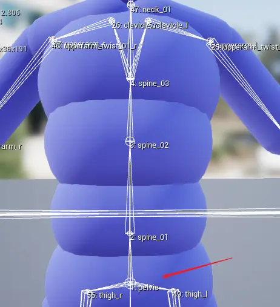

Legs Layer  腿层

Pelvis Layer  骨盆层

Spine Layer 脊柱层

Head Layer 头层

Arm Left Layer 左臂层

Arm right Layer 右臂层

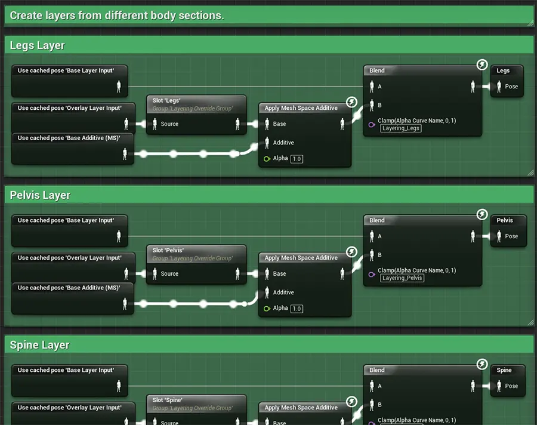

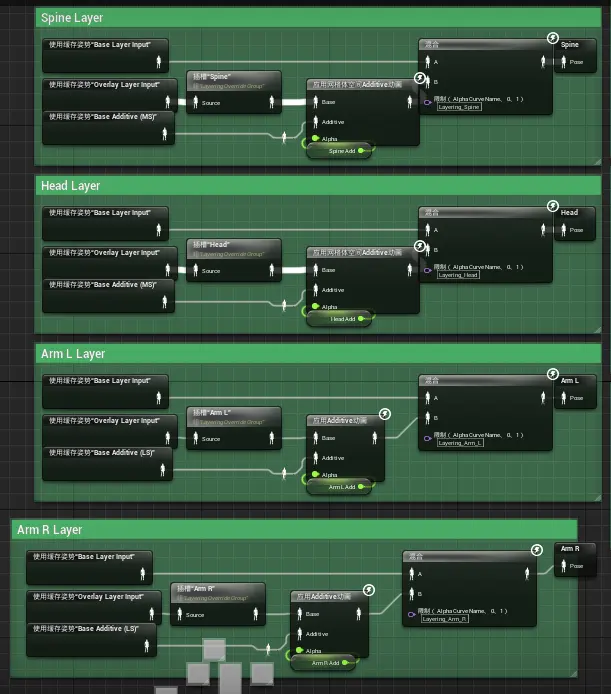

**技巧：根据动画序列中设置的动画曲线切换是否使用“图层动画”。**

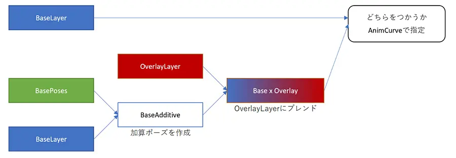

如果你不使用LayerAnimation，就直接使用BaseLayer的动画。

当动画曲线的值被设置为使用LayerAnimation时，将刚才在[Make Dynamic Additives from Base Layer]中创建的加法姿势混合到OverlayLayer中，并使用其结果。

**知识点回顾 Additive**

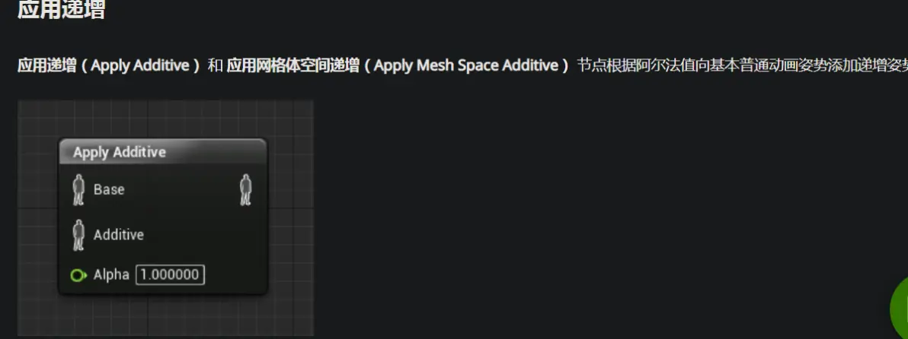

**4.4 将图层融合在一起**

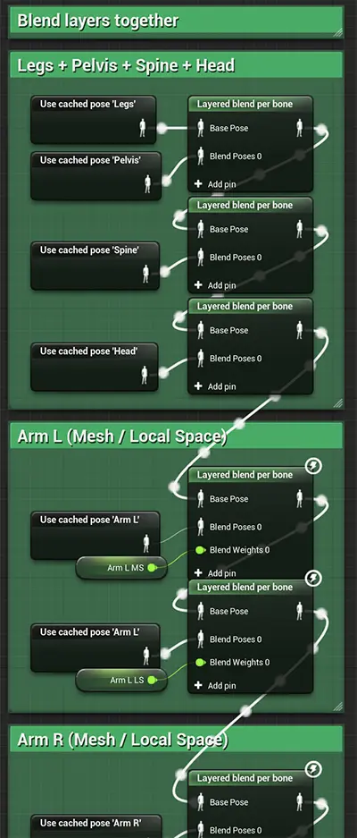

我将融合我创建的每个部分的姿势，

但是，如前所述，对于手臂，有时候会受到角色方向而不是姿势的影响，例如握枪时。在这种情况下，请对局部空间（而不是网格空间）使用加法姿势。

**4.5 将两个图层的AnimCurves融合在一起，并覆盖上一层的干扰**

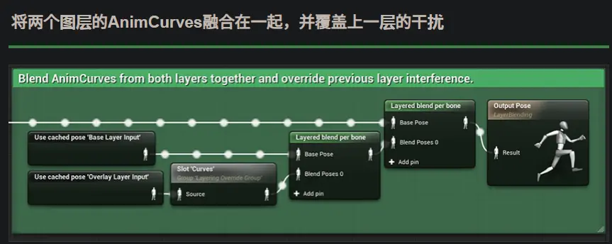

在LayerBlending的末尾，将BaseLayer和OverlayLayer混合为特定的骨骼。

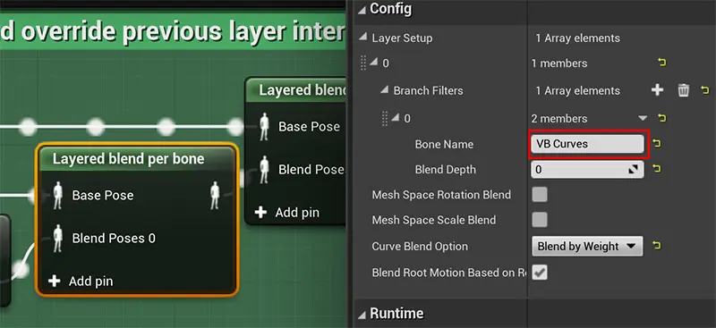

骨骼的名称是[ **VB Curves** ]，它是直接添加到骨骼资产根目录下的虚拟骨骼。

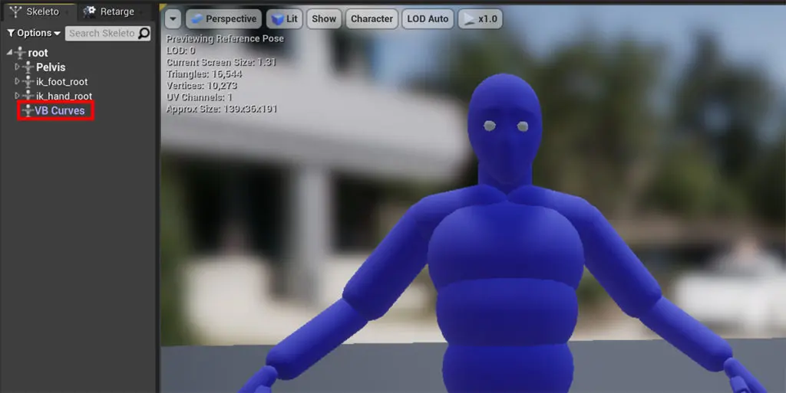

该虚拟骨骼是与角色动画无关的虚拟骨骼，但它混合了此骨骼的BaseLayer和OverlayLayer动画曲线的值。

之所以需要这样的处理，是因为在每个部分的混合过程中各层之间会相互干扰，并且无法获得动画曲线。似乎您可以通过覆盖图层的值来正确引用动画曲线。

似乎您听不懂，但是如果删除此过程，行为将如下图所示，因此可能是这种情况！

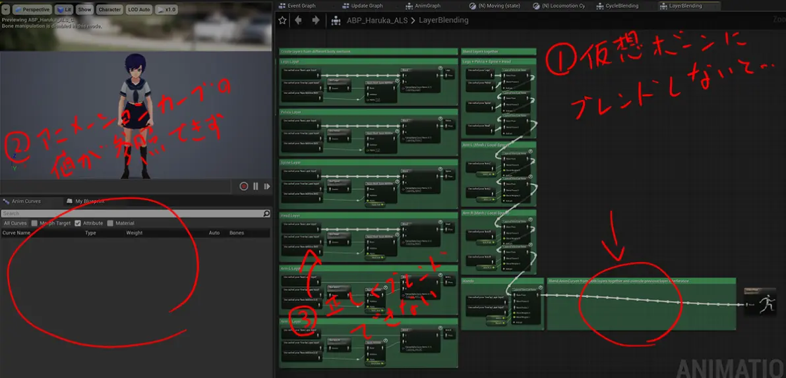

**重要的是****，如果要通过****这种机制****使用自己的骨架资产****，则****需要添加一个名为[VB Curve]的虚拟骨骼。**

注释翻译1

“分层覆盖组”插槽是播放其他上半身动画（如重新加载，装备等）的好地方。通过使用单个蒙太奇，您可以使用不同的插槽以不同的方式将动画应用于不同的身体部位。 例如，您可以在手臂上播放重载动画，并在身体上播放重载的additive加性版本，以便可以在任何姿势下使用它。 只要记住包括“ Curves”插槽，就可以控制如何混合曲线。

注释翻译2

额外的“手”层是用来防止手臂上的附加运动影响手指和ik枪/物体骨骼(如果角色持有某物)。

注释翻译3

在播放“ Layering Override”动画以覆盖或影响分层曲线值时，在“曲线”（Curves）槽中播放普通动画或附加动画。

注释翻译4

尽管这些层节点没有骨骼，但它们仍会影响曲线值。 这使系统可以直接从“基础层”和“叠加层”中存在的曲线中获取值，从而防止它们受到之前所有分层的影响。 如果不这样做，则几乎不可能控制曲线之间的交互方式，因为它们会在分层过程中驱动混合量。

**第三章UpdateGraph**

UpdateGraph是一个EventGraph，它将“事件蓝图更新动画”事件与其他事件分开。

**1让我们看看正在执行哪种更新过程。**

**1.1仅当角色有效时更新**

首先，检查您是否可以获得角色。

**1.2每一帧**

ALS_AnimBP每帧调用4个函数来获取并计算用于更新动画的参数。

**1.2.1更新角色信息功能**

在此功能中，从角色蓝图获得基本值和玩家的状态（当前状态）并将其设置在变量中。

角色蓝图**ALS_Character_BPI**必须实现接口，才能通过该接口将参数传递给AnimBP。

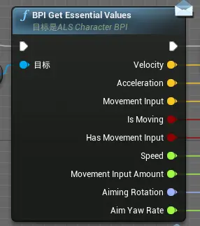

**1.2.2更新瞄准值功能**

瞄准时更新参数。在您自己的游戏中使用Aim时，我认为基于此实现对其进行修改是一个好主意。

**1.2.3更新图层值功能**

在AnimBP一侧混合每个动画层时，更新权重值。

似乎它是根据AnimCurve的参数设置的。

**1.2.4更新Foot IK功能**

**1.3检查运动模式**

使用较早之前通过UpdateCharacterInfo函数获得的变量“ Movement State”，执行专用于Grounded（地面），In Air（空中）和Ragdoll（地毯娃娃状态）的更新处理。

**第四章 角色蓝图**

**1.ALS_Base_CharacterBP：**

**2.ALS_AnimMan_CharacterBP:**

是ALS_Base_CharacterBP的子类，包括绘制debug、装备持有物，同时Override一些ALS_Base_CharacterBP中的函数来更新相机目标信息以及根据当前overlay状态设置对应的蒙太奇。

建议阅读以下更多大佬文章：

https://zhuanlan.zhihu.com/p/159646345

https://zhuanlan.zhihu.com/p/339422628