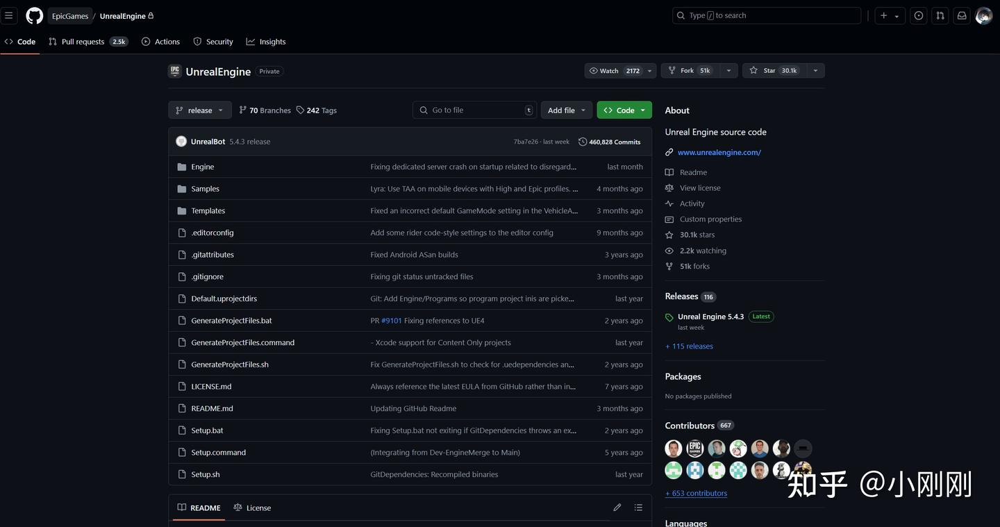
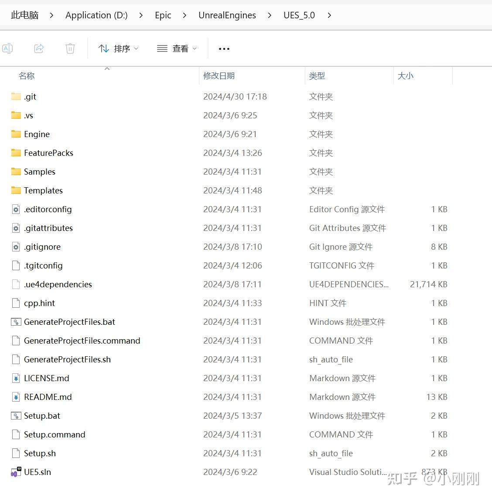
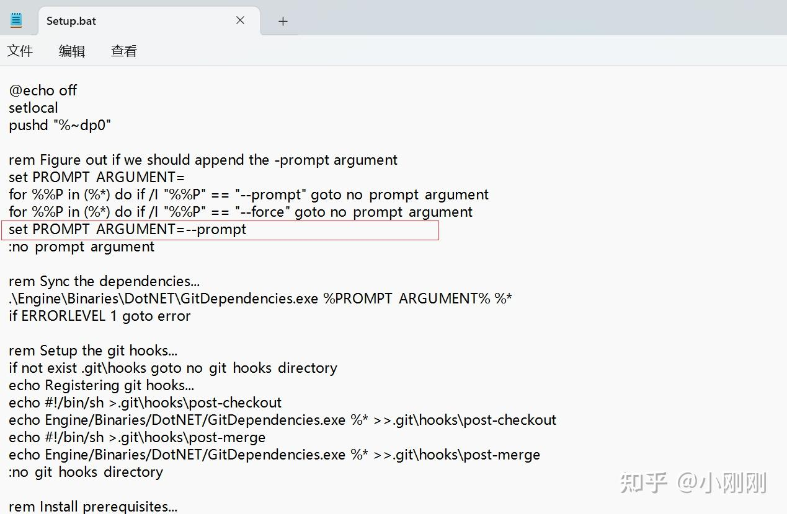
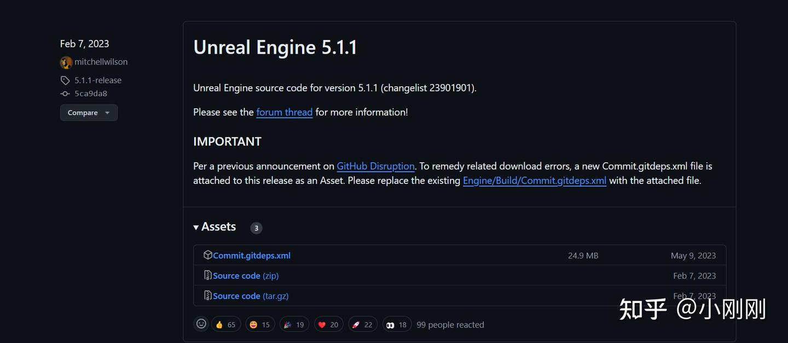
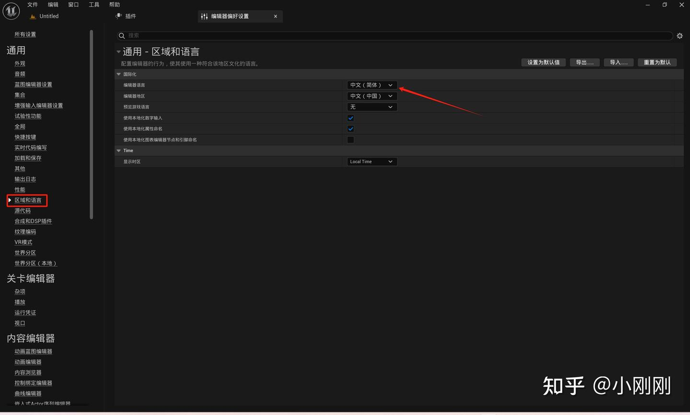
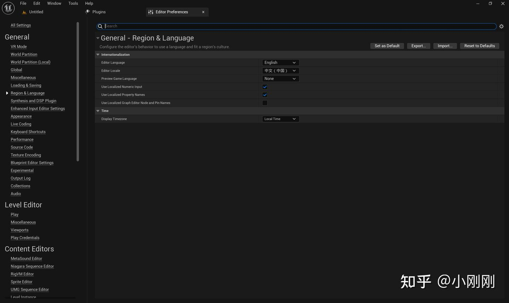
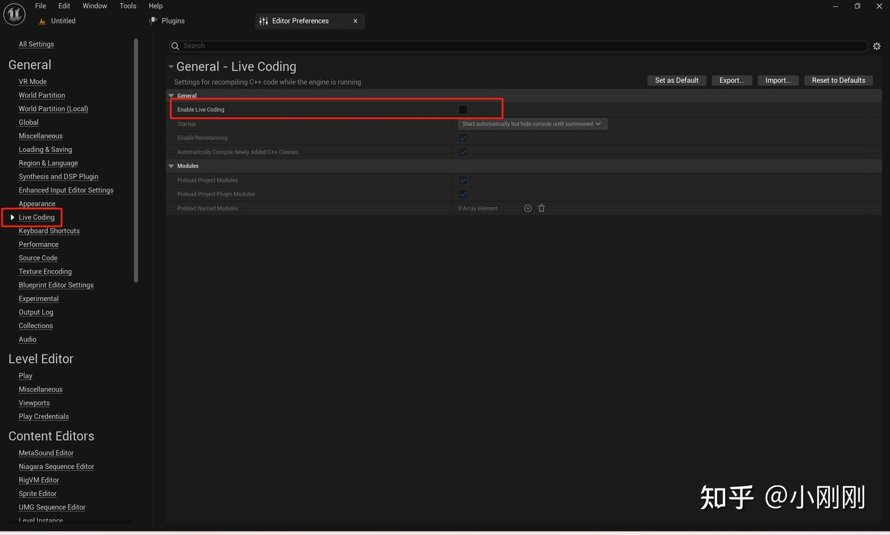
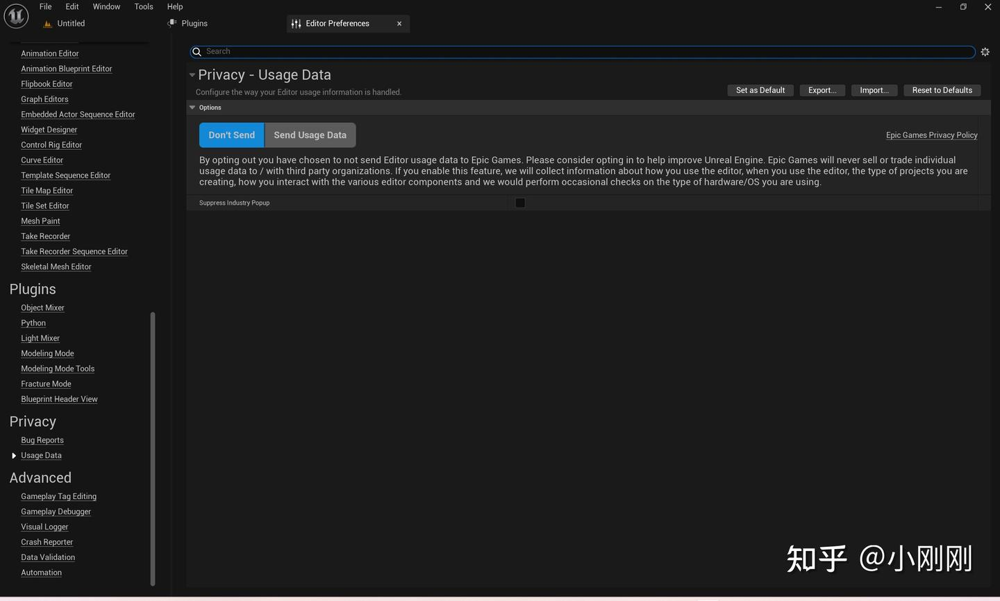
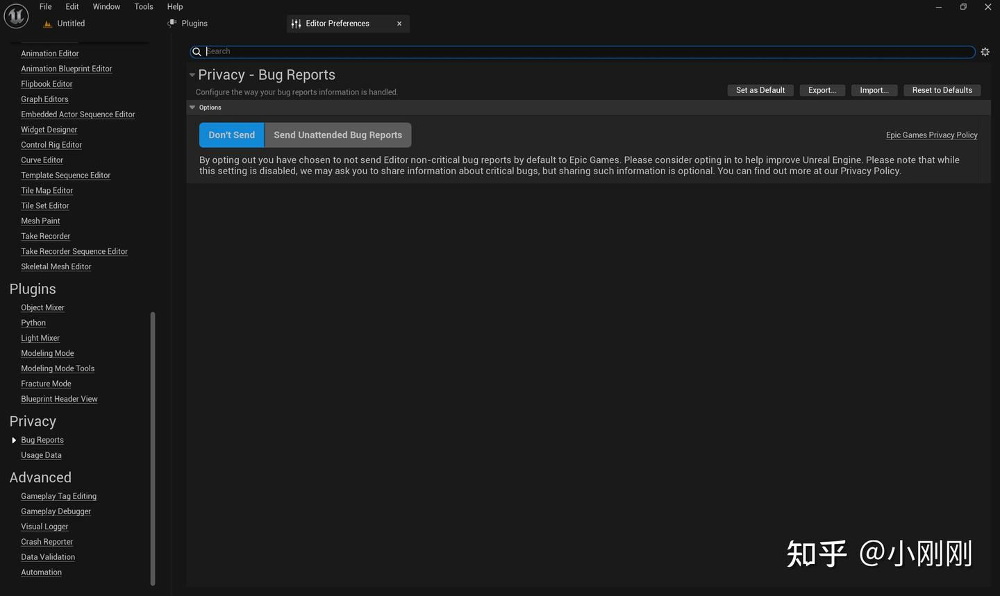
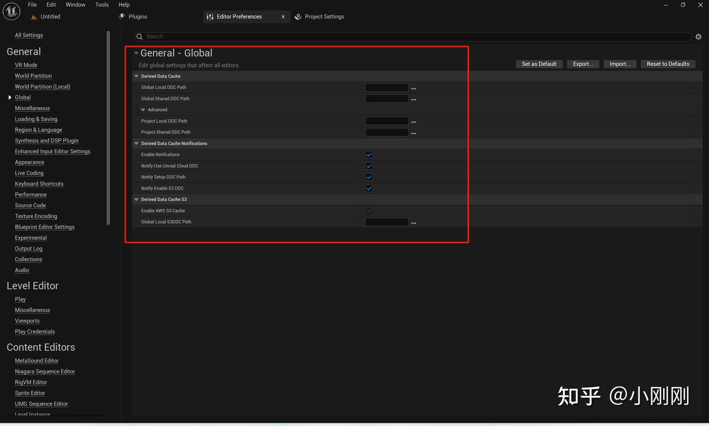

# 1.安装Epic启动器
# 2.安装虚幻引擎
- 安装完成后，点击下拉菜单，选择选项
- 
- 
	- 初学者内容、模板和功能包和引擎源代码一般时必须勾选的.
	- 初学者内容提供了一些便于上手的资产,如音频、材质和网格体等.
	- 模板和功能包提供了一些各行各业的简化启动模板,这么模板工程导入了示意的插件和设置等内容.
	- 引擎源代码提供了引擎的编译源代码,该代码不允许被修改,当然这是发布版本引擎,你改了也没用.
	- 调试符号非常重要,但是占用的硬盘空间也非常大.
	- 它可以帮助你调试引擎,如打断点看一下引擎代码的执行过程,查看堆栈调用过程.它在我们手上没有该引擎版本源码时的提供的帮助非常大!
# 安装安装源码版本虚幻引擎

源码版本虚幻引擎非常强大!

它可以支持我们任意修改引擎,打包Dedicated Server(专属服务器),编写我们自定义独立程序等等.

然后大部分时候,我们都用不到它.实际开发中,发布版引擎+调试符号已经满足了我们大部分需求了.但是,作为一名虚幻引擎工程师,这是你应该掌握且必须掌握的内容.

此处先贴一份官方文档索引:

[下载虚幻引擎源代码 | 虚幻引擎 5.4 文档 | Epic Developer Community (epicgames.com)](https://link.zhihu.com/?target=https%3A//dev.epicgames.com/documentation/zh-cn/unreal-engine/downloading-unreal-engine-source-code)

此处贴出源码仓库地址备用:

[EpicGames/UnrealEngine: Unreal Engine source code (github.com)](https://link.zhihu.com/?target=https%3A//github.com/EpicGames/UnrealEngine)

附图如下:



随后,补充个人理解如下:

### 安装流程:

1. 注册Github账号
2. 关联Github账号及Epic账号
3. 申请虚幻引擎源码仓库访问权限
4. 下载源代码并编译

### 下载技巧:

Git克隆仓库

你可以直接克隆整个仓库, 受限于网速,可能会失败.好处时,克隆之后可以实时获取最新源代码更新.

下载所需版本zip

你可以直接下载所需版本的zip,受限于网速,你的zip可能会下载不全.我曾经下载的时候基本整个zip包在300MB以上.你可能会下载出几十MB大小的zip.这个大小的压缩包明显是不正常的,你需要重新下载几次即可.

### 编译技巧:

当你下载完成后,你应当有如下文件夹.此处可能些许不同,因为这是我已经编译之后的文件夹.



编译源码流程:

1. 双击Setup.bat下载第三方依赖:  
    你可以开启多线程下载加快,右键笔记本打开Setup.bat修改该行代码,但可能会导致下载失败.如果下载过程中卡住了,你可以关闭后重新打开,支持断点续传.下载时间可能稍长,但是你只要观察后台有网速在跑,耐心等待即可.  
    下载完成后该命令行会自动关闭,你可以双击再次打开验证是否验证完毕,不会重复下载.  
    源码下载时开启多线程:  
    set PROMPT_ARGUMENT=--prompt --threads=1000  
    



  
修复下载错误  
在部分源码引擎版本中会出现下载错误,这是因为历史原因,网络地址变动等导致的.你需要手动更新依赖描述文件.具体参考如下:  



  
此处贴出该访问地址:  
[Releases · EpicGames/UnrealEngine (github.com)](https://link.zhihu.com/?target=https%3A//github.com/EpicGames/UnrealEngine/releases%3Fpage%3D1)  
刷新引擎工程,生成vs文件  
点击GenerateProjectFiles.bat会生成UE5的vs工程文件.  
你需要安装符合版本的vs及其组件包!  
编译引擎源码工程  
右键选中UE5工程,设置从该工程启动,并编译它即可.  
通常主要编译项目从4000-5000不等,并随引擎版本升级而增多.通常前两千个项目编译较慢,后面的较快.同时还有若干独立程序.每个约几百个编译项目可能也随之编译.  
你需要选定解决方案平台,否则会引发重编.例如Develop和Debug是不同的方案设置.此处不详细展开,详见后文.  
编译时间随电脑配置不同而变化,i9-12900K(16核心,24线程)编译时间约为40分钟.  
编译工程中会出现错误.基本均可自行百度问题解决.我称述我遇到的错误如下:  
某个引擎版本,需要改一个模块的Build,cd文件中的一行.  
不同的msvc和vs版本会导致不同引擎版本编译不过.如常见的vs2017,vs2019,vs2022.我使用vs2022最新版本(17.10)编译引擎源码5.0会报错.具体需要参考官方文档.  
此处列出UE5.4的官方参考规格文档:  
[虚幻引擎的硬件和软件规格 | 虚幻引擎 5.4 文档 | Epic Developer Community (epicgames.com)](https://link.zhihu.com/?target=https%3A//dev.epicgames.com/documentation/zh-cn/unreal-engine/hardware-and-software-specifications-for-unreal-engine)  
# UnrealBuildTool设置

- MSVC和Windows SDK版本正确的话，不必设置

可以指定自己所需的编译环境,具体方式如下:  
在该路径下修改XML文件:  
"C:\Users\Administrator\AppData\Roaming\Unreal Engine\UnrealBuildTool\BuildConfiguration.xml"

```xml
<?xml version="1.0" encoding="utf-8" ?>
<Configuration xmlns="https://www.unrealengine.com/BuildConfiguration">
	<BuildConfiguration>
		<MaxParallelActions>20</MaxParallelActions>
	</BuildConfiguration>
	<WindowsPlatform>
		<WindowsSdkVersion>10.0.22621.0</WindowsSdkVersion>
		<CompilerVersion>14.38.33130</CompilerVersion>
	</WindowsPlatform>
</Configuration>
```

  - 其中WindowsSdkVersion：Windows SDK 的版本
  - CompilerVersion： VS编译器版本
  - MaxParallelActions： 最大并行操作数，当设备内存容量过低时出现CPU核心调用不足减小数值

此处贴出UBT的详细参考,注意该技巧为高级开发技巧,后面再进行论述  
[虚幻引擎的构建配置 | 虚幻引擎 5.4 文档 | Epic Developer Community (epicgames.com)](https://link.zhihu.com/?target=https%3A//dev.epicgames.com/documentation/zh-cn/unreal-engine/build-configuration-for-unreal-engine)
# **编辑器设置调优**
1. 修改编辑器语言设置为英文  
    在编辑菜单中打开编辑器偏好设置,在通用-区域和语言中设置编辑器语言为英语.  
    请务必使用英语开发编辑器,这是程序员必须掌握的技能,这将决定你的上限!  
    此处列出附图如下.  
    



  



  
关闭LiveCoding  
请务必关闭LiveCoding,该项功能会带来一些潜在的问题,我们的项目在编码后全部统一从VS界面启动.  



  
关闭用户数据发送  
我们不需要发送用户数据,这会导致http发送不可达的黄色警告.  



  
关闭bug发送  
同样,我们也不需要发送bug或者Crash报告.  



  
修改Shader缓存位置  
我们不需要修改该储存位置.我们的系统盘将会保留1T的空间.  



  
此处贴出修改该缓存的详细讲解链接:  
[在虚幻引擎中使用派生数据缓存 | 虚幻引擎 5.4 文档 | Epic Developer Community (epicgames.com)](https://link.zhihu.com/?target=https%3A//dev.epicgames.com/documentation/zh-cn/unreal-engine/using-derived-data-cache-in-unreal-engine)