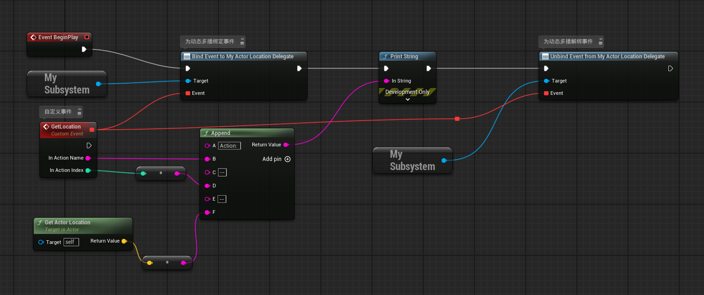
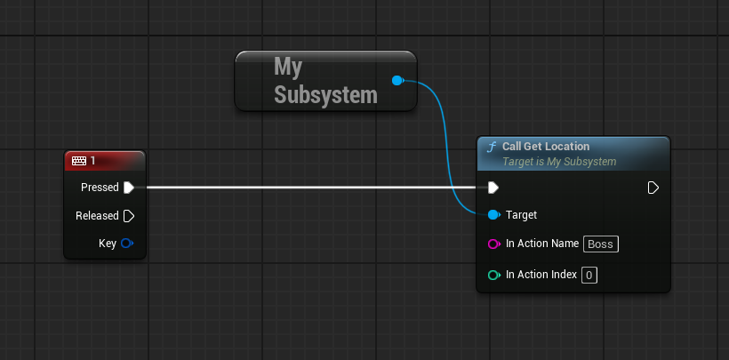

# MySubsystem.h
```cpp


#pragma once

#include "CoreMinimal.h"
#include "Subsystems/GameInstanceSubsystem.h"

#include "MySubsystem.generated.h"

/**编程子系统与动画多播
 * 
 */

//声明动态多播
DECLARE_DYNAMIC_MULTICAST_DELEGATE_TwoParams(FMySubsysActorLocation, FString, InActionName, int32, InActionIndex);

UCLASS()
class QUICKSTART_API UMySubsystem : public UGameInstanceSubsystem
{
	GENERATED_BODY()

public:
	//是否应当创建子系统，有可能服务器不需要子系统
	virtual bool ShouldCreateSubsystem(UObject* Outer) const override;
	//初始化子系统示例，FSubsystemCollectionBase 是一个基础类，用于管理子系统（Subsystem）的注册和依赖。
	virtual void Initialize(FSubsystemCollectionBase& collection) override;
	//取消子系统实例的初始化
	virtual void Deinitialize() override;

public:
	//定义动态多播,可在蓝图中分配事件
	UPROPERTY(BlueprintAssignable)
	FMySubsysActorLocation MyActorLocationDelegate;

	//调用动态多播
	UFUNCTION(BlueprintCallable, Category = "MySubSys")
	void CallGetLocation(FString InActionName, int32 InActionIndex);

	//获取生命值纯函数
	UFUNCTION(BlueprintCallable, BlueprintPure, Category = "MySubSys")
	int32 GetHealth() const;

	//添加生命值
	UFUNCTION(BlueprintCallable, Category = "MySubSys")
	void AddHealth(int InHealthToAdd);
	 
private:
	int32 CurrHealth = 100;

};

```
# MySubsystem.cpp
```cpp


#include "MySubsystem.h"


bool UMySubsystem::ShouldCreateSubsystem(UObject* Outer) const
{
	return true;
}

void UMySubsystem::Initialize(FSubsystemCollectionBase& collection)
{
	Super::Initialize(collection);
}

void UMySubsystem::Deinitialize()
{
	Super::Deinitialize();
}

void UMySubsystem::CallGetLocation(FString InActionName, int32 InActionIndex)
{
	MyActorLocationDelegate.Broadcast(InActionName, InActionIndex);
}

int32 UMySubsystem::GetHealth() const
{
	return CurrHealth;
}

void UMySubsystem::AddHealth(int InHealthToAdd)
{
	CurrHealth += InHealthToAdd;
}

```
# 引擎操作
- 创建Actor，MyWorkActor，并在其时间蓝图中绑定动态多播
- 
- 在场景中放入数个MyWorkActor实例，并在场景蓝图中编写
- 
- 这样场景蓝图中调用`CallGetLocation()`方法，该方法调用动态多播执行`MyActorLocationDelegate.Broadcast(InActionName, InActionIndex);`，动态多播执行MyWorkActor事件蓝图中绑定的事件GetLoaction，打印拼接的字符串。