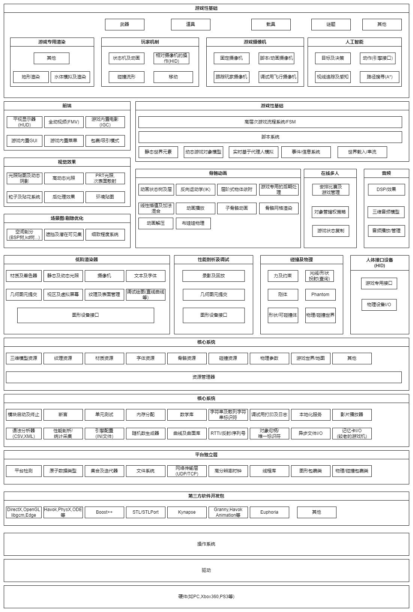
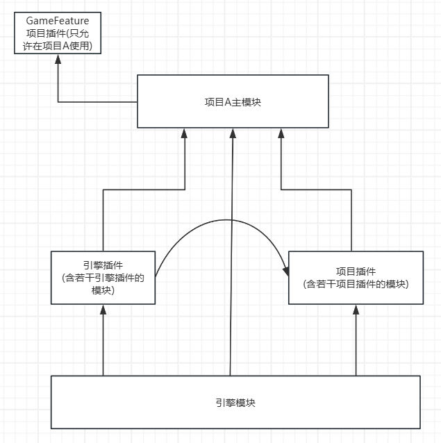
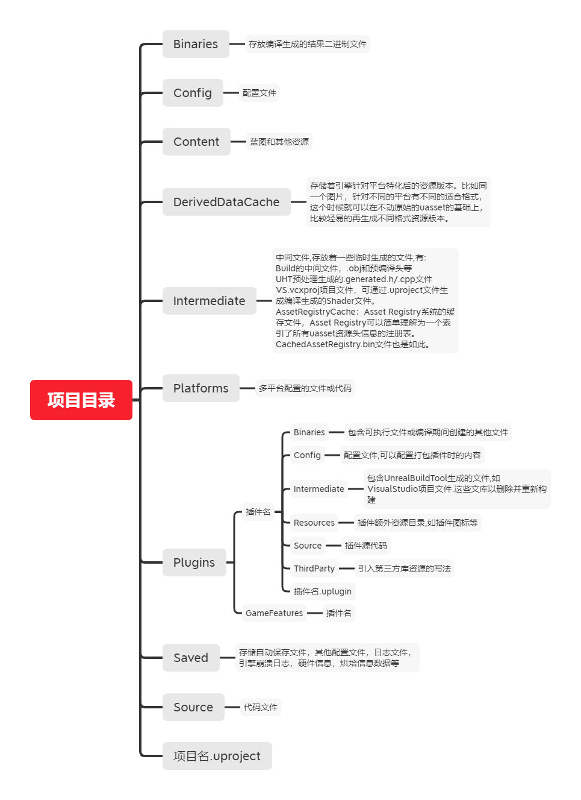
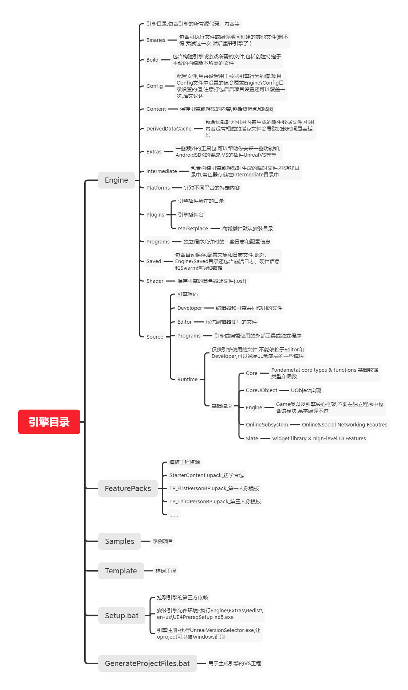
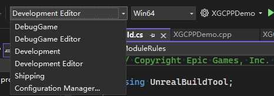
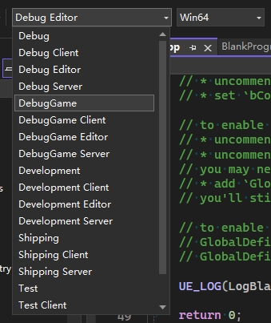

# 游戏引擎基本架构

# 虚幻引擎架构
## 模块（Modules）
[虚幻引擎模块 | 虚幻引擎 5.5 文档 | Epic Developer Community | Epic Developer Community](https://dev.epicgames.com/documentation/zh-cn/unreal-engine/unreal-engine-modules)
在 Unreal Engine 5（UE5）中，**模块**是构建游戏和工具的核心组件。模块是一个可独立编译和加载的代码单元，它们帮助你将项目的功能拆分成多个可管理的部分。每个模块都是一个独立的 C++ 项目，可以被其他模块引用或在不同的平台和配置下单独构建。模块化设计使得项目更加高效、灵活，并且能够支持多人开发、快速迭代以及更好的性能管理。

### 1. **什么是模块？**

在 UE5 中，**模块**是游戏或工具的功能块，负责实现具体的游戏机制、编辑器扩展、资源管理等。每个模块都有自己的源代码、头文件和编译设置，并且可以与其他模块进行交互。

### 2. **模块的类型**

UE5 中的模块分为以下几种类型，每种类型有不同的目的和用途：

#### 1) **游戏模块（Game Module）**

- 游戏模块是指在游戏项目中包含的主要模块，负责游戏的核心逻辑。
- 每个游戏项目至少有一个主模块，通常是项目名对应的模块。例如，如果你的项目名称是 `MyGame`，那么它会有一个名为 `MyGame` 的模块。
- 游戏模块通常包含 `GameMode`、`Actor`、`Pawn`、`Component`、`AI` 等相关的游戏代码。

#### 2) **引擎模块（Engine Module）**

- 引擎模块是 Unreal Engine 自带的模块，包含了引擎核心功能。你通常不会修改这些模块，但可以利用它们的功能来构建自己的项目。
- 例如，`Engine` 模块是 Unreal Engine 的核心模块，包含了图形渲染、物理模拟、输入处理等引擎功能。

#### 3) **编辑器模块（Editor Module）**

- 编辑器模块是为了扩展 Unreal 编辑器功能而创建的模块，通常用于开发插件、工具、编辑器窗口和自定义功能。
- 编辑器模块可以让你为 Unreal 编辑器添加新的工具、UI 界面，或修改编辑器的行为。例如，如果你要创建一个自定义的编辑器插件或一个新的工作流，通常会创建一个编辑器模块。

#### 4) **插件模块（Plugin Module）**

- 插件模块通常是可选的功能模块，可以在项目中启用或禁用。插件通常实现特定的功能或扩展，像是第三方集成、工具链、图形效果等。
- 插件模块可以包含游戏、编辑器或工具等功能，甚至可以包含跨项目共享的功能。

#### 5) **第三方模块（Third-party Module）**

- 第三方模块是引擎中集成的外部库和工具。你可以添加外部库（如物理引擎、AI库等）作为模块，集成到项目中。
- 这些模块有时在 Unreal Engine 的源码中已经存在，有时则由开发者手动集成。

### 3. **如何在UE5中创建模块？**

在 UE5 项目中创建模块非常简单，你可以通过修改项目文件（`.uproject`）来添加模块，也可以通过编辑 `Build.cs` 文件来配置模块。

#### 1) **模块的定义**

模块通常通过修改 `.uproject` 文件中的模块列表来进行定义。比如：

```json
{
  "FileVersion": 3,
  "EngineAssociation": "5.4.4",
  "Modules": [
    {
      "Name": "MyGame",
      "Type": "Runtime",
      "LoadingPhase": "Default"
    },
    {
      "Name": "MyEditorPlugin",
      "Type": "Editor",
      "LoadingPhase": "Default"
    }
  ]
}
```

在这个例子中，`MyGame` 是一个游戏模块，`MyEditorPlugin` 是一个编辑器模块。

#### 2) **`Build.cs` 文件**

每个模块都会有一个 `.Build.cs` 文件，用于指定模块的构建设置。这些设置定义了模块的依赖关系、包含的头文件、编译规则等。例如：

```cpp
using UnrealBuildTool;

public class CPP_Learning : ModuleRules
{
	public CPP_Learning(ReadOnlyTargetRules Target) : base(Target)
	{
		PCHUsage = PCHUsageMode.UseExplicitOrSharedPCHs;

		// 添加该模块的依赖路径
		PublicIncludePaths.AddRange(new string[] { "CPP_Learning" });
        // 添加该模块依赖的公共模块
        PublicDependencyModuleNames.AddRange(new string[] { "Core", "CoreUObject", "Engine", "InputCore", "EnhancedInput" });
        // 添加该模块依赖的私有模块
        PrivateDependencyModuleNames.AddRange(new string[] {  });

        // 定义模块是否支持插件
        if (Target.Type == TargetType.Editor)
        {
            PrivateDependencyModuleNames.Add("UnrealEd");
        }

        // Uncomment if you are using Slate UI
        // PrivateDependencyModuleNames.AddRange(new string[] { "Slate", "SlateCore" });

        // Uncomment if you are using online features
        // PrivateDependencyModuleNames.Add("OnlineSubsystem");

        // To include OnlineSubsystemSteam, add it to the plugins section in your uproject file with the Enabled attribute set to true
    }
}
```

这个文件做了以下几件事：
- **PCHUsage**：设置预编译头文件的使用方式，通常为 `UseExplicitOrSharedPCHs`。
- **PrivateDependencyModuleNames** 和 **PublicDependencyModuleNames**：指定当前模块依赖的其他模块。比如 `Core`, `Engine` 等。
- **目标类型检查**：如果是编辑器目标，添加对 `UnrealEd` 模块的依赖。
#### 2.5）`Target.cs` 文件
在 Unreal Engine 5 (UE5) 中，`Target.cs` 文件是用于定义和配置 **构建目标** 的关键文件。构建目标（Build Target）指定了如何编译和构建游戏、编辑器、测试、插件等不同的模块和执行文件。这个文件定义了不同的目标类型及其相关配置，它在 Unreal Build System（UBT，Unreal 构建系统）中起着至关重要的作用。

### 1. **什么是 Target.cs 文件？**

`Target.cs` 文件是 C# 脚本文件，用于定义一个特定目标（如游戏、编辑器、插件等）的构建规则。它为 Unreal Engine 项目的编译过程提供了必要的设置和配置信息，指示 Unreal Build System 如何处理和构建目标文件。每个目标文件通常对应一个构建输出，比如一个可执行文件（`.exe`）、一个静态库（`.lib`）、一个动态链接库（`.dll`）等。

### 2. **Target.cs 文件的用途**

`Target.cs` 文件定义了以下内容：

- **目标类型**：指定构建的目标类型，例如游戏、编辑器、测试等。
- **目标平台**：定义该目标将要构建的平台，如 Windows、Mac、Linux、iOS、Android 等。
- **构建配置**：指定该目标的构建配置，如 Debug、Development、Shipping 等。
- **模块依赖**：定义该目标需要依赖的模块，确保正确加载并编译所需的模块。
- **构建设置**：配置额外的编译选项，如预处理器宏、编译器参数等。

### 3. **Target.cs 文件的结构**

一个典型的 `Target.cs` 文件通常包含以下几个部分：

- **命名空间**：`Target.cs` 文件使用 C# 脚本编写，因此需要使用 `UnrealBuildTool` 命名空间。
- **目标类**：继承自 `TargetRules` 类，所有的目标文件都需要继承自这个基类，并重写其中的构建规则。

#### 4. **目标类型和构建配置**

Unreal Engine 使用 `Target.cs` 文件来定义多个目标类型。每个目标类型都会定义不同的构建设置和目标平台。

#### 常见的目标类型：

- **Game Target**（游戏目标）：这是用于构建游戏的目标。通常会在 `Game.Target.cs` 中定义。
- **Editor Target**（编辑器目标）：这是用于构建 Unreal 编辑器的目标。
- **Server Target**（服务器目标）：用于构建多玩家游戏的服务器端。
- **Program Target**：用于构建外部工具和程序。
- **Plugin Target**：用于构建插件目标。

每个目标都有一个或多个配置设置，用于指定不同的构建阶段和功能。

#### 目标配置：

- **Debug**：用于调试模式，包含调试信息，通常较慢，但便于调试。
- **Development**：开发模式，编译速度较快，包含足够的调试信息，适合开发过程中使用。
- **Shipping**：最终发布模式，编译出来的版本是优化过的，去除了调试信息。

#### 5. **一个典型的 Target.cs 文件示例**

以下是一个 `Target.cs` 文件的示例，它定义了一个用于构建游戏目标的设置：

```csharp
using UnrealBuildTool;
using System.Collections.Generic;

public class CPP_LearningTarget : TargetRules
{
	public CPP_LearningTarget(TargetInfo Target) : base(Target)
	{
        // 目标类型：游戏
        Type = TargetType.Game;
        // 设置平台支持，通常包括 Windows、Mac、Linux 等
        DefaultBuildSettings = BuildSettingsVersion.V5;
		IncludeOrderVersion = EngineIncludeOrderVersion.Unreal5_4;
        // 配置该目标所依赖的模块
        ExtraModuleNames.Add("CPP_Learning");
	}
}
```

在这个例子中：

- **Type = TargetType.Game**：指定这个目标是一个游戏目标。
- **DefaultBuildSettings = BuildSettingsVersion.V2**：使用第二版本的构建设置。
- **bUseUnityBuild = false**：禁用 Unity 构建，这意味着每个源文件都单独编译。
- **bUsePCHFiles = true**：启用预编译头文件（PCH）来加快编译速度。
- **ExtraModuleNames.AddRange(new string[] { "MyGame" })**：指定该目标依赖的模块，这里表示 `MyGame` 模块。

#### 6. **Target.cs 的主要属性和方法**

- **Type**：指定目标类型（`Game`、`Editor`、`Server`、`Program` 等）。
- **bUseUnityBuild**：是否启用 Unity 构建，Unity 构建可以合并多个源文件进行编译，提高编译速度，但可能会引入一些调试问题。
- **bUsePCHFiles**：是否使用预编译头文件（PCH）。启用可以加速编译过程，尤其在大型项目中非常有用。
- **DefaultBuildSettings**：指定构建设置版本，通常为 `V1` 或 `V2`，`V2` 支持更多的功能和优化。
- **ExtraModuleNames**：指定目标所依赖的模块列表。每个目标可以依赖多个模块，通过这个属性来配置。
- **TargetPlatform**：指定目标平台，如 `Windows`, `Mac`, `Linux` 等。如果没有明确指定，默认构建所有平台。
- **bShouldCompileAsDLL**：决定是否编译为动态链接库（DLL），适用于插件或工具目标。

#### 7. **构建目标与平台的关系**

在 Unreal Engine 中，目标类型和目标平台是相互独立的。一个目标可以用于多个平台。例如，你可以为同一个游戏目标创建多个不同的 `Target.cs` 文件，以支持 Windows 和 Linux 平台，分别为它们定义不同的构建设置。

```csharp
public MyGameTarget(TargetInfo Target) : base(Target)
{
    if (Target.Platform == UnrealTargetPlatform.Win64)
    {
        // Windows 64位平台的特殊构建设置
    }
    else if (Target.Platform == UnrealTargetPlatform.Linux)
    {
        // Linux平台的特殊构建设置
    }
}
```


#### 3) **模块目录结构**

一个典型的模块目录结构如下：

```
MyGame/
│
├── Source/
│   ├── MyGame/
│   │   ├── MyGame.Build.cs
│   │   ├── MyGame.cpp
│   │   └── MyGame.h
│
├── MyGame.uproject
```

- `Source/MyGame/`：模块源代码所在的目录。
- `MyGame.Build.cs`：模块的构建规则文件。
- `MyGame.cpp` 和 `MyGame.h`：模块的实现代码。

### 4. **模块加载阶段**

Unreal Engine 中的模块会在不同的阶段加载。每个模块可以通过 **`LoadingPhase`** 来指定何时加载。常见的加载阶段有：

- **Default**：模块会在引擎初始化时加载。
- **PostEngineInit**：在引擎完全初始化之后加载。
- **PreLoadingScreen**：在加载屏幕显示之前加载模块。
- **PostConfigInit**：在配置文件读取完成后加载模块。

### 5. **模块的使用**

一旦模块创建并配置好后，可以在项目中通过 `#include` 指令来使用该模块中的类和函数。例如：

```cpp
#include "MyGame/MyGame.h"
```

### 6. **模块化设计的好处**

- **组织性强**：模块化的设计使得项目更易于管理和扩展。每个模块专注于一个功能或一组相关功能。
- **并行开发**：不同的开发人员可以独立开发不同的模块，避免了代码冲突和开发瓶颈。
- **灵活性和可扩展性**：可以轻松地启用或禁用模块、替换模块的实现、或者在项目中添加新的模块。
- **性能优化**：引擎能够根据需求加载模块，减少了不必要的资源消耗。

### 总结

在 Unreal Engine 5 中，**模块**是组织和管理游戏代码、工具和引擎功能的基本单元。模块化设计不仅增强了项目的可扩展性和灵活性，还优化了开发过程，使得多个开发人员能够并行工作。通过理解模块的概念和应用，你可以更高效地组织你的 UE5 项目，并创建功能强大的游戏和工具。
### 模块的加载时机

Module有不同的加载时机和不同的使用环境.Module的定义描述器在以下位置:

E:\Epic\UE\UE_5.4\Engine\Source\Runtime\Projects\Public\ModuleDescriptor.h

模块的加载时机:根据你需要让该模块尽早的加载,或者尽量晚的加载.因为一个模块A可以调用另一个模块B.如果模块B的加载时机晚于模块A,这就带来一系列问题.同时,严禁出现模块A依赖模块B,模块B依赖于模块A,这将导致循环依赖.你应当提取通用模块C,让模块A和B都依赖于C即可.

加载时机的定义：
```cpp
/**
 * Phase at which this module should be loaded during startup.
 * 启动时应加载此模块的阶段。
 */
namespace ELoadingPhase
{
	enum Type
	{
		/** As soon as possible - in other words, uplugin files are loadable from a pak file (as well as right after PlatformFile is set up in case pak files aren't used) Used for plugins needed to read files (compression formats, etc) */
		//尽快加载，uplugin 文件可以从 pak 文件加载（以及在设置 PlatformFile 之后，如果不使用 pak 文件时）。用于需要读取文件的插件（压缩格式等）
		EarliestPossible,

		/** Loaded before the engine is fully initialized, immediately after the config system has been initialized.  Necessary only for very low-level hooks */
		//在引擎完全初始化之前加载，紧接着配置系统初始化之后。仅对非常低级的钩子是必要的
		PostConfigInit,

		/** The first screen to be rendered after system splash screen */
		//系统启动画面后渲染的第一个屏幕
		PostSplashScreen,

		/** Loaded before coreUObject for setting up manual loading screens, used for our chunk patching system */
		//在coreUObject之前加载，用于设置手动加载屏幕，适用于我们的块补丁系统
		PreEarlyLoadingScreen,

		/** Loaded before the engine is fully initialized for modules that need to hook into the loading screen before it triggers */
		//在引擎完全初始化之前加载，适用于需要在加载屏幕触发之前钩入的模块
		PreLoadingScreen,

		/** Right before the default phase */
		//在默认阶段之前
		PreDefault,

		/** Loaded at the default loading point during startup (during engine init, after game modules are loaded.) */
		//在启动时（在引擎初始化后，游戏模块加载后）默认加载点加载
		Default,

		/** Right after the default phase */
		//默认阶段之后
		PostDefault,

		/** After the engine has been initialized */
		//引擎初始化后
		PostEngineInit,

		/** Do not automatically load this module */
		//不要自动加载此模块
		None,

		// NOTE: If you add a new value, make sure to update the ToString() method below!
		//注意：如果您添加一个新值，请确保更新下面的ToString()方法！
		Max
	};

	/**
	 * Converts a string to a ELoadingPhase::Type value
	 *
	 * @param	The string to convert to a value
	 * @return	The corresponding value, or 'Max' if the string is not valid.
	 */
	PROJECTS_API ELoadingPhase::Type FromString( const TCHAR *Text );

	/**
	 * Returns the name of a module load phase.
	 *
	 * @param	The value to convert to a string
	 * @return	The string representation of this enum value
	 */
	PROJECTS_API const TCHAR* ToString( const ELoadingPhase::Type Value );
};
```
### 模块的使用环境
- 不同的模块使用的环境不同,我们最常用的是Runtime,其次是Editor.前者适用于大部分时候,包括打包后以一个程序运行和在编辑器中进行运行,但不能应用在Program(独立程序)中.后者只允许在编辑器下进行使用.

此处明确指出,严禁在游戏主模块(放在项目里面的模块,指定了它是老大且必须要有它,所以我们叫它游戏主模块)中包含Editor模块!这会导致你工程打包失败.因为Editor模块在打包的时候会被剥离出去!

模块环境的枚举：
```cpp
/**
 * Environment that can load a module.
 * 可以加载模块的环境
 */
namespace EHostType
{
	enum Type
	{
		// Loads on all targets, except programs.
		//在所有目标上加载，除了程序。
		Runtime,
		
		// Loads on all targets, except programs and the editor running commandlets.
		//在所有目标上加载，除了程序和运行命令的编辑器。
		RuntimeNoCommandlet,
		
		// Loads on all targets, including supported programs.
		//在所有目标上加载，包括支持的程序。
		RuntimeAndProgram,
		
		// Loads only in cooked games.
		//仅在已烘焙的游戏中加载。
		CookedOnly,

		// Only loads in uncooked games.
		//仅在未烘焙的游戏中加载
		UncookedOnly,

		// Deprecated due to ambiguities. Only loads in editor and program targets, but loads in any editor mode (eg. -game, -server).
		//由于模糊性而弃用。仅在编辑器和程序目标中加载，但在任何编辑模式下加载（例如 -game, -server）
		// Use UncookedOnly for the same behavior (eg. for editor blueprint nodes needed in uncooked games), or DeveloperTool for modules
		//使用UncookedOnly以获得相同的行为（例如，用于未烹饪游戏中所需的编辑器蓝图节点），或使用DeveloperTool用于模块
		// that can also be loaded in cooked games but should not be shipped (eg. debugging utilities).
		//也可以在已烹饪的游戏中加载，但不应随附（例如，调试工具）。
		Developer,

		// Loads on any targets where bBuildDeveloperTools is enabled.
		//在启用bBuildDeveloperTools的任何目标上加载。
		DeveloperTool,

		// Loads only when the editor is starting up.
		//仅在编辑器启动时加载。
		Editor,
		
		// Loads only when the editor is starting up, but not in commandlet mode.
		//仅在编辑器启动时加载，而不在命令模式下加载。
		EditorNoCommandlet,

		// Loads only on editor and program targets
		//仅在编辑器和程序目标上加载
		EditorAndProgram,

		// Only loads on program targets.
		//仅在程序目标上加载。
		Program,
		
		// Loads on all targets except dedicated clients.
		//除专用客户端外，所有目标均可加载。
		ServerOnly,
		
		// Loads on all targets except dedicated servers.
		//除专用服务器外，所有目标均可加载。
		ClientOnly,

		// Loads in editor and client but not in commandlets.
		ClientOnlyNoCommandlet,
		
		//~ NOTE: If you add a new value, make sure to update the ToString() method below!
		//如果您添加一个新值，请确保更新下面的 ToString() 方法！
		Max
	};

	/**
	 * Converts a string to a EHostType::Type value
	 *
	 * @param	The string to convert to a value
	 * @return	The corresponding value, or 'Max' if the string is not valid.
	 */
	PROJECTS_API EHostType::Type FromString( const TCHAR *Text );

	/**
	 * Converts an EHostType::Type value to a string literal
	 *
	 * @param	The value to convert to a string
	 * @return	The string representation of this enum value
	 */
	PROJECTS_API const TCHAR* ToString( const EHostType::Type Value );
};
```

## 插件（Plugin）
- Plugin(插件)应至少包含一个模块,它将聚合多个模块,定义了模块的LoadingPhase(加载时机)、(Type)使用类型、作者等信息
- 插件分为引擎插件,项目插件,GameFeature(特殊的项目插件).
- 简而言之,引擎插件就是放在引擎里面的插件,项目插件就是放在项目里面的插件.
- 插件通常情况下只允许引用引擎的内容(含引擎插件和引擎模块).
- GameFeature是一个非常特殊的项目插件,它可以引用项目的内容,而普通插件不允许.
- 插件之间可以互相依赖,但是需要遵循一定的规则,模块严禁互相依赖.
- 引用思路是:凡是引擎的均不允许引用项目的.
## 工程（Project）
- Project(工程)应当至少包含一个模块,且该模块为游戏主模块.
- 项目可以引用引擎插件的模块和引擎模块,也可以引用项目插件的模块,但是不能引用GameFeature插件的内容.
## 独立程序（Program）

- Program(独立程序)应当至少包含一个模块,且该模块为应用主模块.独立程序一般只使用引擎模块和引擎插件的模块.

- 独立程序需要源码版本的引擎可以编写使用.
## 引用关系论述


1. 引擎绝对不会引用项目写的任意内容(除非你做成插件上传到引擎审核通过,那么这部分内容就是引擎插件了,其他引擎插件有需要就可以引用).

2. 项目及项目插件可以引用引擎的任意内容(引擎开发的所有内容都是给你用的,你想怎么用就怎么用,没有人限制你).

3. 两个项目之间不会互相引用,但是他们可以共用一个项目插件(这个很好理解吧,A项目和B项目都不是一个开发团队,他们之间怎么可能有关系了,但是如果他们的老大是同一个,说你们必须按这套规范进行开发,那么这套规范就可以抽取为一个项目插件S,项目C也可以使用它).

4. 项目插件严禁引用项目的内容(这个也很好理解,规范S如果引用了项目A的开发内容,那么团队B和C怎么可以忍受这个事情,本来有个老大就已经很受掣肘了, 还要受到竞争对手指指点点).

5. GameFeature项目插件可以引用项目内容(GameFeature这个插件只允许在这个项目使用,并且随开随关,那么这个引用关系当然是合理的.意思就是项目A团队基于规范S开发了规范X插件,这个X插件只适配他们自己的项目,是他们内部的事情,当然他们想怎么处理就怎么处理)

- 大佬文章：
- [UE 插件与工具开发：基础概念 | 循迹研究室](https://imzlp.com/posts/75405/)
## 编排层次
[《InsideUE4》基础概念 - 知乎 (zhihu.com)](https://zhuanlan.zhihu.com/p/22814098)
### 项目文件夹层次结构
[目录结构 | 虚幻引擎 5.4 文档 | Epic Developer Community (epicgames.com)](https://dev.epicgames.com/documentation/zh-cn/unreal-engine/unreal-engine-directory-structure)

蓝图的工程：

C++工程：

- 注意上图纯净工程未开启项目插件.如果项目需要使用项目插件,此处会有Plugins目录.

- `*.uproject`是极其重要的文件,描述了我们的项目信息,并且掌握切换版本,生产vs文件等功能.

- 通常情况下项目层级下的`.vs`，`Binaries`，`DerivedDataCache`， `Intermediate`，`Saved`， `.vsconfig`，`*.sln`文件可以被忽略并删除.

- 通常情况下的项目插件层级下的`Binaries,Intermediate`也可以被忽略或删除.但有些预编译插件,即未提供源码的插件不可执行该操作,会导致项目编译失败,必须上传相关文件.

以下给出个人使用的.gitignore和.gitattributes文件仅供参考:

.gitignore：
```gitignore
# UE Project Base
.vs/
Binaries/
DerivedDataCache/
Intermediate/
Saved/
DerivedDataCache/
Build/
.vsconfig
*.sln
# XG Package
PackageTest/
# lfs
hooks/
lfs/
```
.gitattributes文件:
```
# UE Project Files
*.uasset filter=lfs diff=lfs merge=lfs -text
*.umap filter=lfs diff=lfs merge=lfs -text
*.pak filter=lfs diff=lfs merge=lfs -text
*.dll filter=lfs diff=lfs merge=lfs -text
*.lib filter=lfs diff=lfs merge=lfs -text
*.exe filter=lfs diff=lfs merge=lfs -text
*.pdb filter=lfs diff=lfs merge=lfs -text
# doc 
*.pdf filter=lfs diff=lfs merge=lfs -text
*.docx filter=lfs diff=lfs merge=lfs -text
*.pptx filter=lfs diff=lfs merge=lfs -text
# zip
*.zip filter=lfs diff=lfs merge=lfs -text
*.7z filter=lfs diff=lfs merge=lfs -text
*.rar filter=lfs diff=lfs merge=lfs -text
# Img
*.png filter=lfs diff=lfs merge=lfs -text
*.webp filter=lfs diff=lfs merge=lfs -text
*.jpg filter=lfs diff=lfs merge=lfs -text
*.bmp filter=lfs diff=lfs merge=lfs -text
*.jpeg filter=lfs diff=lfs merge=lfs -text
# PS
*.psd filter=lfs diff=lfs merge=lfs -text
# Audio
*.amr filter=lfs diff=lfs merge=lfs -text
*.pcm filter=lfs diff=lfs merge=lfs -text
*.speex filter=lfs diff=lfs merge=lfs -text
*.wav filter=lfs diff=lfs merge=lfs -text
```
以下给出顶级案例项目Lyra层级结构:


以下给出各层级结构的思维导图:

###  引擎文件夹层次结构

在安装后源码版本引擎并编译通过后,给出源码引擎文件夹示意图:


在安装发布版本引擎后,给出发布版本引擎文件夹示意图:


结构思维导图：

### VS编译类型
以下先给出官方文档引导:

[编译虚幻引擎C++游戏项目 | 虚幻引擎 5.4 文档 | Epic Developer Community (epicgames.com)](https://dev.epicgames.com/documentation/zh-cn/unreal-engine/compiling-game-projects-in-unreal-engine-using-cplusplus?application_version=5.4)

UE支持多个平台,主要通过UBT和UHT来实现各种情况下的编译.简而言之,别去改你的VS设置了,每次都会重新生成.直接修改UBT配置即可.

#### UBT和UHT工具

- UnrealBuildTool（UBT，C#）：UE4的自定义工具，来编译UE4的逐个模块并处理依赖等。我们编写的Target.cs，Build.cs都是为这个工具服务的。
- UnrealHeaderTool （UHT，C++）：UE4的C++代码解析生成工具，我们在代码里写的那些宏UCLASS等和#include "*.generated.h"都为UHT提供了信息来生成相应的C++反射代码。

说白了，UBT会先调用UHT会先负责解析一遍C++代码，生成相应其他代码。然后开始调用平台特定的编译工具(VisualStudio,LLVM)来编译各个模块。最后启动Editor或者是Game.

- 其中UBT主要读取*.build.cs文件和*.target.cs文件.前者定义了它链入哪些模块,访问路径是什么这些.后者决定了要打什么样的包出来.
- 其中UHT会去代码里面读取你写宏标记,帮你生成各类自定义代码.

接下来,给出编译选项.

先给出发布引擎版本的编译选项:

 

再给出源码引擎版本的编译选项:

 

- 注意,我们默认使用DevelopmentEditor,会出现看不到变量,断点断不到,代码执行顺序乱飘的情况,即编辑器优化了我们的代码.你可以切换编译模型的debug,或者在代码文件中输入防止优化的宏,或者在*.build.cs文件中进行模块是否优化的设置等处理.

- 该编译配置有两个关键字控制,前则表明引擎及游戏项目的状态,后则表明正在编译的目标.

初学者可能会很迷惑.这是因为虚幻编辑的编译目标包含了网络模式,即客户端和服务器是同一套代码进行开发控制的.同时也包含了编辑器.请不要在VS中直接允许Server,一般情况下允许不起来,你可以采取特殊操作让它允许,但是没必要且不应当.