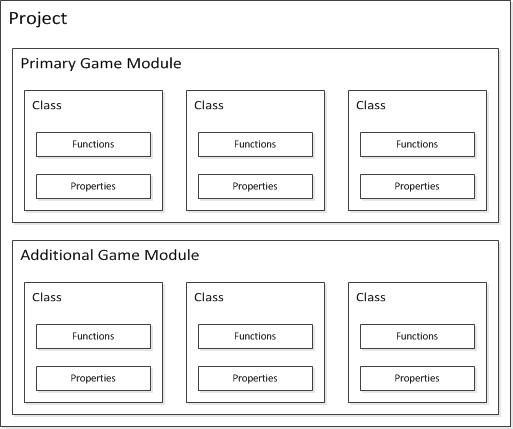

# 虚幻引擎反射系统
[虚幻引擎中的反射系统 | 虚幻引擎 5.5 文档 | Epic Developer Community | Epic Developer Community](https://dev.epicgames.com/documentation/zh-cn/unreal-engine/reflection-system-in-unreal-engine)
**虚幻引擎反射系统** 使用宏为提供引擎和编辑器各种功，封装你的类。在使用 **虚幻引擎（**UE**）** 时，可以使用标准的C++类、函数和变量。

- 虚幻中对象的基类是 [UObject](https://dev.epicgames.com/documentation/zh-cn/unreal-engine/objects-in-unreal-engine)。每个类都新定义了一个用于[Actor](https://dev.epicgames.com/documentation/zh-cn/unreal-engine/actors-in-unreal-engine)或对象（Object）的模板。
    
- 你可以使用 `UCLASS` 宏来标记从 `Uobject` 派生的类，以便[UObject处理系统](https://dev.epicgames.com/documentation/zh-cn/unreal-engine/unreal-object-handling-in-unreal-engine)可以注意到这些类。
    
- [TSubclassOf](https://dev.epicgames.com/documentation/zh-cn/unreal-engine/typed-object-pointer-properties-in-unreal-engine)是模板类，提供 `Uclass` 类型保险。 它在分配从特定类型派生出来的类时很有效。例如，你可以把这个变量公开给蓝图，设计者可以为玩家角色指定生成的武器类别。
    
- 类可以包含[结构体](https://dev.epicgames.com/documentation/zh-cn/unreal-engine/structs-in-unreal-engine)。结构体是帮助组织和操控其相关相关属性的数据结构。结构体可以使用 `USTRUCT()` 宏来单独定义。
    
- [虚幻智能指针库](https://dev.epicgames.com/documentation/zh-cn/unreal-engine/smart-pointers-in-unreal-engine)为C++11智能指针的自定义实现，旨在减轻内存分配和追踪的负担。该实现包括行业标准[共享指针](https://dev.epicgames.com/documentation/zh-cn/unreal-engine/shared-pointers-in-unreal-engine)，[弱指针](https://dev.epicgames.com/documentation/zh-cn/unreal-engine/weak-pointers-in-unreal-engine)，**唯一指针（Unique Pointers）**，和[共享引用](https://dev.epicgames.com/documentation/zh-cn/unreal-engine/shared-references-in-unreal-engine)，此类引用的行为与不可为空的共享指针相同。
    
- [接口](https://dev.epicgames.com/documentation/zh-cn/unreal-engine/interfaces-in-unreal-engine) 提供可以在多个或不同的类中实现函数和额外的游戏行为。 你的玩家角色可以与世界中的各种Actor互动。 每个这些互动都能引起对一个事件的不同反应。
    
- [Metadata说明符](https://dev.epicgames.com/documentation/zh-cn/unreal-engine/metadata-specifiers-in-unreal-engine)控制类、接口、结构体、列举、函数，或属性与引擎和编辑器各方面的交互方式。每一种类型的数据结构或成员都有自己的元数据说明符列表。
    
- [UFUNCTION](https://dev.epicgames.com/documentation/zh-cn/unreal-engine/ufunctions-in-unreal-engine)，以及[UPROPERTY](https://dev.epicgames.com/documentation/zh-cn/unreal-engine/unreal-engine-uproperties)宏使UE注意到新的类、函数和变量。这些宏由引擎进行垃圾收集。 在说明宏时, 你可以在虚幻编辑器中编辑和显示它们。

在Unreal Engine 5（UE5）中，C++ 编程中有一个非常强大的反射系统，称为 **UE4/UE5反射系统**。它允许你在运行时动态地查询、操作和修改对象的属性和方法，而无需直接访问它们的内存位置。这个系统在UE5中尤为重要，因为它支持多种引擎功能，如蓝图（Blueprints）、序列化、网络复制、编辑器界面生成等。

### 1. **反射系统的基本概念**

反射本质上是通过对象类型和元数据提供对对象的“自我描述”。UE5的反射系统支持以下几种操作：

- **获取类信息**：通过反射可以动态地获取一个类的属性、方法、构造函数等信息。
- **访问和修改属性**：反射可以用来读取和修改对象的成员变量。
- **动态调用函数**：可以通过反射机制动态调用对象的方法，避免静态链接。

### 2. **核心组件**

在UE5中，反射系统的核心由 `UClass`、`UProperty` 和 `UFunction` 等类组成，它们提供了对类、属性和方法的访问。

- **UClass**：表示一个类的元数据，包括类的名称、父类、构造函数等信息。每个UClass实例代表一个C++类或者蓝图类的定义。
- **UProperty**：表示类中一个成员变量的元数据。它定义了该成员的类型、名称、默认值、序列化信息等。
- **UFunction**：表示一个函数的元数据。它定义了函数的签名、参数类型、返回类型等信息。

### 3. **反射宏**

UE5 提供了一些宏，方便开发者在C++类中标记哪些内容需要参与反射。常用的反射宏包括：

- `UCLASS()`：用来标记一个C++类需要参与反射。它定义了类的一些元数据。
- `UPROPERTY()`：用来标记类的成员变量，告诉反射系统该属性需要参与序列化和反射。这些属性可以是公开的或私有的，也可以支持编辑器中的显示与修改。
- `UFUNCTION()`：用来标记类的方法，告诉反射系统该方法是可以在蓝图或其他系统中调用的。
- `UPROPERTY()` 和 `UFUNCTION()` 支持多种参数，例如 `EditAnywhere`、`BlueprintCallable`、`Transient` 等，用于控制属性或方法在编辑器中的可见性、调用方式等。

#### 示例代码：
```cpp
UCLASS()
class MYGAME_API AMyActor : public AActor
{
    GENERATED_BODY()

public:
    AMyActor();

    // 一个可以在编辑器中修改的属性
    UPROPERTY(EditAnywhere, BlueprintReadWrite, Category="My Category")
    int32 Health;

    // 一个可通过蓝图调用的函数
    UFUNCTION(BlueprintCallable, Category="My Functions")
    void TakeDamage(int32 DamageAmount);
};
```

在这个例子中：
- `UCLASS()` 宏标记了 `AMyActor` 这个类需要参与反射。
- `UPROPERTY()` 宏标记了 `Health` 属性，表明它可以在编辑器中修改，并且可以被蓝图读取和写入。
- `UFUNCTION()` 宏标记了 `TakeDamage()` 函数，允许在蓝图中调用。
- `GENERATED_BODY()`宏是 Unreal Engine 中用于宏生成代码的一个重要部分，尤其是在涉及到类的反射和生命周期管理时。它并不是一个普通的函数或方法，而是一个特殊的宏，用于在 Unreal Engine 中自动生成和注册与类相关的一些底层代码。主要负责
	- **生成构造函数**：
	    - 对于继承自 `UObject` 或其派生类（如 `AActor`, `UActorComponent` 等）的类，`GENERATED_BODY()` 宏会自动生成默认构造函数以及其他与反射系统、序列化、垃圾回收等相关的代码。
	- **启用反射系统**：
	    - 它告诉 Unreal Engine 这个类需要支持反射，因此引擎会自动为这个类生成必要的元数据和函数，这些代码支持蓝图可见性、属性编辑、函数调用、网络复制等功能。
	- **初始化引擎所需的内部机制**：
	    - `GENERATED_BODY()` 宏还会初始化一些用于 Unreal Engine 内部机制的代码，包括类的注册、初始化与销毁的管理等。
汇总一下，GENERATED_BODY宏给一个简单的自定类加了下面这些东西：

1. 添加了一个静态函数`static void StaticRegisterNativeUMyObject();`
2. 声明结构体`struct Z_Construct_UClass_UMyObject_Statics;`为friend
3. 添加了一个public构造函数`UMyObject(const FObjectInitializer& ObjectInitializer = FObjectInitializer::Get());`
4. 通过声明`private: UMyObject(UMyObject&&); UMyObject(const UMyObject&&);`禁用move和copy
5. 通过声明`private: UMyObject& operator=(UMyObject&&); UMyObject& operator=(const UMyObject&&);`禁用赋值动作
6. 增加一个静态函数`static UClass* GetPrivateStaticClass();`
7. 内部枚举`enum {StaticClassFlags=};`
8. 内部类型定义Super，表示父类
9. 内部类型定义ThisClass，表示该类的UClass对象
10. 添加静态函数`staic UClass* StaticClass();`，用来返回当前类的UClass对象
11. 添加静态函数`static const TCHAR* StaticPackage();`，返回当前类所属的包名
12. 添加静态函数`inline static EClassCastFlags StaticClassCastFlags()`，放回当前类静态转型标记
13. 重载operator new函数（如果有机会后面分享到UE4对象的内存管理在来详细分析）

### 4. **反射系统的应用**

UE5反射系统的核心优势在于能够与引擎的其他系统（如蓝图、编辑器、网络、序列化等）无缝集成。常见应用场景包括：

- **蓝图与C++结合**：使用反射系统，C++类的属性和方法可以暴露给蓝图，蓝图开发者可以更方便地使用C++代码中的功能。
- **编辑器支持**：UE5允许你在编辑器中通过反射动态修改类的属性。比如，可以在属性面板中调整一个 `UProperty` 标记的变量，而无需重新编译代码。
- **网络复制**：反射系统支持自动化网络复制，它能识别类的属性，并自动处理它们的同步。
- **自定义序列化**：使用反射，开发者可以定义如何序列化和反序列化对象的数据，而无需手动编写代码。
- **动态加载与创建对象**：反射还可以用于动态加载和创建对象，例如，通过类名或其它描述符来创建特定类型的对象。

### 5. **性能考虑**

虽然反射系统非常强大，但它在某些情况下可能引入一定的性能开销。特别是在频繁使用反射进行动态类型查询、方法调用时，性能可能会受到影响。因此，在性能敏感的代码路径中，应谨慎使用反射功能。

### 6. **总结**

UE5的反射系统通过强大的宏和类系统，简化了开发过程，尤其是在与蓝图、编辑器和网络功能等集成时。通过反射，C++代码不仅能灵活地与引擎其他系统交互，还能提升开发效率和灵活性。

如果你对某个具体的反射特性或功能有更多问题，随时可以继续讨论！
# 创建一个C++类
- 在编辑器中创建
- 在IDE中创建
## 注意事项
- 为了避免`#include”../../../../***.h”`这种极其难看且冗余的包含路径,我们可以在build.cs里面进行配置包含路径来避免这个问题
CPP_Learning.Build.cs
```C#
using UnrealBuildTool;

public class CPP_Learning : ModuleRules
{
	public CPP_Learning(ReadOnlyTargetRules Target) : base(Target)
	{
		PCHUsage = PCHUsageMode.UseExplicitOrSharedPCHs;

		//添加CPP_Learning路径
		PublicIncludePaths.AddRange(new string[] { "CPP_Learning" });
	
		PublicDependencyModuleNames.AddRange(new string[] { "Core", "CoreUObject", "Engine", "InputCore", "EnhancedInput" });

		PrivateDependencyModuleNames.AddRange(new string[] {  });

		// Uncomment if you are using Slate UI
		// PrivateDependencyModuleNames.AddRange(new string[] { "Slate", "SlateCore" });
		
		// Uncomment if you are using online features
		// PrivateDependencyModuleNames.Add("OnlineSubsystem");

		// To include OnlineSubsystemSteam, add it to the plugins section in your uproject file with the Enabled attribute set to true
	}
}
```
- 头文件：注意看这个导出宏`CPP_LEARNING_API`(模块名+”_API”,全大写)，当我们写的代码需要跨模块使用的时候一定要记得导出宏。否则你没办法在别的模块通过C++代码调用该类或该类的方法。还有UCLASS里面的元数据MinimalAPI也经常干坏事,你需要知道!
MyObject.h
```cpp
#pragma once

#include "CoreMinimal.h"
#include "UObject/NoExportTypes.h"
#include "MyObject.generated.h"

/**
 * 
 */
UCLASS()
class CPP_LEARNING_API UMyObject : public UObject
{
	GENERATED_BODY()
	
};
```
- 源文件：此时你右键编译项目或者启动是完全没有问题的.记得关闭编辑器再编译。同时如果你创建错位置了。直接去删掉资源管理器中的文件然后刷新项目即可，不要在VS中删除。
MyObject.cpp
```cpp
#include "Test/MyObject.h"
```
# 介绍C++类

我们可以使用原生的C++类实现功能,这点毫无疑问.但是一旦涉及到了引擎功能,我们必须使用虚幻引擎的宏进行标记改造,方可支持被引擎感知使用.

注意:一旦该头文件包含了以下反射宏信息,其头文件必须在文件首部include的最后一行,写入`[#include “文件名.generated.h”]`,该文件是虚幻UBT帮我们生成的反射文件.有很多很重要的内容.同时如果需要包含带反射的结构体,请不要前向声明,直接包含该结构体的头文件即可.

常见的宏如下:

- `UCLASS()`:标记类反射到引擎,与 `GENERATED_BODY()`连用,

- `UENUM()`:标记枚举反射到引擎,可与`UMETA()`连用,增加更多元数据定义

- `USTRUCT()`:标记结构体反射到引擎,与`GENERATED_BODY()`,也可以使用`GENERATED_USTRUCT_BODY()`.

- `UINTERFACE()`:标记接口反射到引擎,与`GENERATED_UINTERFACE_BODY()`连用,需要同时申明一个U类和一个I类,其中接口写在I类.

- `UPROPERTY()`:标记变量反射到引擎,可以在类和结构体体中使用.

- `UPARAM()`:用于C++函数中的入参变量暴露给蓝图.

查看此图:

 

在我们工程中有很多类,他们实现了很多功能,具有若干属性和方法.C++和class和struct没什么不同,除了默认的权限不一样外.

而在UE中,我们主要使用U类去实现功能逻辑,而F类的结构体常用于属性组织和操作数据结构.

同时F类的结构体不能使用UFUNCTION将方法暴露给蓝图,如果需要蓝图中调用结构体的方法需要进行特殊操作.

此处贴出参考的官方文档:

[Programming with CPP in Unreal Engine | 虚幻引擎 5.4 文档 | Epic Developer Community (epicgames.com)](https://dev.epicgames.com/documentation/zh-cn/unreal-engine/programming-with-cpp-in-unreal-engine)

# 问题
## Unreal Engine C++编程中generated.h是如何产生的

在Unreal Engine中，`generated.h`是由Unreal的构建系统（特别是**Unreal Build System (UBT)**）和**Unreal Header Tool (UHT)**自动生成的头文件。它是Unreal C++编程中的一个核心部分，尤其是在使用`UCLASS`, `USTRUCT`, `UPROPERTY`, `UFUNCTION`等宏时。

### 1. **`generated.h`是什么？**

`generated.h`是一个包含了Unreal Engine所需自动生成代码的头文件。在每个使用了Unreal反射系统（比如使用了`UCLASS`, `USTRUCT`, `UPROPERTY`, `UFUNCTION`等宏的类或结构体）时，都会自动包含该头文件。

这个头文件会包含由Unreal Header Tool (UHT) 生成的C++代码，这些代码实现了反射、序列化、虚函数支持等功能。

具体来说，`generated.h`文件由UHT根据C++源文件中的类定义（以及相关宏）生成，包含了诸如：

- **元数据**：类的属性、方法、类型等信息。
- **反射代码**：类和其成员的反射信息，支持蓝图、序列化、网络同步等。
- **辅助代码**：如构造函数、析构函数、虚函数等，用于保证类与引擎的交互正常工作。

### 2. **生成过程概述**

生成`generated.h`文件的关键步骤如下：

#### a. **编译器预处理**

当你在Unreal Engine中编写C++代码并使用诸如`UCLASS`, `USTRUCT`, `UPROPERTY`, `UFUNCTION`等宏时，Unreal的构建系统会将源代码传递给**Unreal Header Tool (UHT)**。

#### b. **Unreal Header Tool (UHT)**

UHT是Unreal构建系统的一部分，它会扫描所有包含了`UCLASS`, `USTRUCT`, `UPROPERTY`, `UFUNCTION`等宏的头文件，然后：

1. 解析这些类、结构体、函数和属性，提取元数据和类型信息。
2. 生成包含这些元数据的代码，这些代码会被插入到类中以实现反射、序列化、网络同步等功能。
3. **自动生成`generated.h`文件**，这个文件包含了引擎需要的辅助代码和反射数据。`generated.h`文件的生成过程是自动化的，并且依赖于源文件中的宏定义。

#### c. **代码生成和文件组织**

UHT根据头文件中包含的`UCLASS`, `USTRUCT`, `UPROPERTY`, `UFUNCTION`等宏，生成相应的C++代码，并将其放入生成的`generated.h`文件中。这个文件通常会包含每个类的反射所需的数据结构、辅助函数、元数据等。

例如，假设你有一个如下的类定义：

```cpp
UCLASS()
class MYGAME_API AMyActor : public AActor
{
    GENERATED_BODY()

public:
    UPROPERTY(EditAnywhere, BlueprintReadWrite, Category = "Health")
    int32 Health;

    UFUNCTION(BlueprintCallable)
    void MyFunction();
};
```

在构建过程中，UHT会生成一个与此类相关的`generated.h`文件，文件内容大致类似于：

```cpp
// 自动生成的代码
class AMyActor : public AActor
{
    GENERATED_BODY()

    // 类的成员、反射数据、序列化代码等
};
```

这个`generated.h`文件会由`#include`指令包含在类的头文件中。

#### d. **`generated.h`的作用**

- **包含反射信息**：例如类的元数据、属性的类型信息、函数签名等。这样，Unreal引擎就能在运行时获取这些信息，用于蓝图访问、属性序列化、网络同步等。
- **生成辅助代码**：如默认构造函数、虚函数支持、对象生命周期管理等。
- **集成到构建系统**：`generated.h`文件与其他引擎生成的代码一起编译，形成完整的C++代码模块。

### 3. **如何使用`generated.h`**

当你在类中使用了如`UCLASS`, `USTRUCT`, `UPROPERTY`等宏时，通常需要在头文件的顶部包含`generated.h`：

```cpp
#include "CoreMinimal.h"
#include "GameFramework/Actor.h"
#include "MyActor.generated.h"  // 这个文件是由UHT自动生成的

UCLASS()
class MYGAME_API AMyActor : public AActor
{
    GENERATED_BODY()

public:
    UPROPERTY(EditAnywhere, BlueprintReadWrite, Category = "Health")
    int32 Health;

    UFUNCTION(BlueprintCallable)
    void MyFunction();
};
```

这里的`#include "MyActor.generated.h"`语句是关键，它会包含由UHT生成的文件，使得`AMyActor`类能够与Unreal的反射系统、蓝图等功能正确交互。

### 4. **`generated.h`文件的生成与更新**

- `generated.h`文件通常是在编译时自动生成的，而不是手动编写的。当你添加新的类、属性或函数，并使用了Unreal宏时，UHT会在下次构建时自动更新这些文件。
- 在某些情况下，如果你修改了头文件或添加了新的UCLASS、USTRUCT等，需要重新生成该文件，或者在Unreal编辑器中重新编译项目。

### 5. **`generated.h`中的常见内容**

一个典型的`generated.h`文件会包含如下内容：

- **`UClass`元数据**：包含关于类、属性、函数的元数据，例如类型、类别、访问修饰符等。
- **构造函数和析构函数**：确保正确初始化和销毁对象。
- **虚函数支持**：使得类能够正常使用Unreal的虚拟机系统。
- **序列化和网络同步**：支持在不同机器之间同步属性。
- **支持蓝图和编辑器**：自动暴露类和属性，使其可以在蓝图和编辑器中进行访问和修改。

### 6. **总结**

`generated.h`是Unreal Engine中的一个自动生成的头文件，它由Unreal Header Tool (UHT)根据类的定义生成。这个文件包含了引擎所需的反射信息、序列化支持、虚拟函数等代码。开发者不需要手动编写这些代码，只需在类中使用特定的宏（如`UCLASS`, `UPROPERTY`, `UFUNCTION`等），UHT会自动生成所需的`generated.h`文件并包含在代码中，确保类能够与Unreal引擎的其他系统正确交互。

## generated.h和GENERATED_BODY()之间是什么关系
`generated.h` 和 `GENERATED_BODY()` 是 Unreal Engine 中的宏和头文件，主要用于自动生成代码和支持反射系统。

1. **`generated.h`**:
   - 这是由 Unreal Header Tool (UHT) 自动生成的文件。它包含了类的元数据和反射信息，通常与 `.cpp` 文件一起使用。
   - 每当你定义一个新的类或结构体并使用 UHT 时，都会生成一个对应的 `generated.h` 文件。

2. **`GENERATED_BODY()`**:
   - 这是一个宏，通常在类的定义中使用，特别是在 `UCLASS()` 和 `USTRUCT()` 之前。它的作用是插入必要的代码，以便支持 Unreal 的反射系统。
   - 它会引入一些用于序列化、复制、垃圾回收等功能的代码。

### 关系
- `GENERATED_BODY()` 宏通常会在类定义中使用，并且依赖于 `generated.h` 中的内容。具体来说，`GENERATED_BODY()` 会生成与类相关的必要代码，确保类能够正确地与 Unreal 的系统交互。
- 当你编写一个类并添加 `UCLASS()` 和 `GENERATED_BODY()` 时，UHT 会处理这些宏并生成相应的 `generated.h` 文件，以确保类的元数据被正确处理。

总之，`generated.h` 和 `GENERATED_BODY()` 是紧密相关的，前者是自动生成的文件，后者是用来在类中插入必要代码的宏。