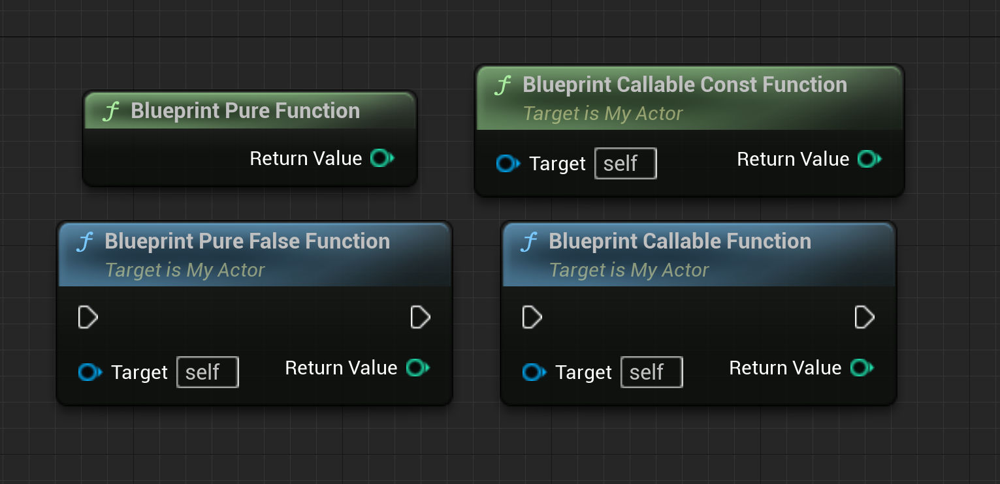

[虚幻引擎UFunction | 虚幻引擎 5.5 文档 | Epic Developer Community | Epic Developer Community](https://dev.epicgames.com/documentation/zh-cn/unreal-engine/ufunctions-in-unreal-engine)
## UFunction声明

**UFunction** 是虚幻引擎（UE）反射系统可识别的C++函数。`UObject` 或蓝图函数库可将成员函数声明为UFunction，方法是将 `UFUNCTION` 宏放在头文件中函数声明上方的行中。宏将支持 **函数说明符** 更改虚幻引擎解译和使用函数的方式。

```cpp
UFUNCTION([specifier1=setting1, specifier2, ...], [meta(key1="value1", key2, ...)])
ReturnType FunctionName([Parameter1, Parameter2, ..., ParameterN1=DefaultValueN1, ParameterN2=DefaultValueN2]) [const]; 
```

可利用函数说明符将UFunction对[蓝图可视化脚本](https://dev.epicgames.com/documentation/zh-cn/unreal-engine/blueprints-visual-scripting-in-unreal-engine)图表公开，以便开发者从蓝图资源调用或扩展UFunction，而无需更改C++代码。在类的默认属性中，UFunction可绑定到[委托](https://dev.epicgames.com/documentation/zh-cn/unreal-engine/delegates-and-lamba-functions-in-unreal-engine)，从而能够执行一些操作（例如将操作与用户输入相关联）。它们还可以充当网络回调，这意味着当某个变量受网络更新影响时，用户可以将其用于接收通知并运行自定义代码。用户甚至可创建自己的控制台命令（通常也称 _debug_、_configuration_ 或 _cheat code_ 命令），并能在开发版本中从游戏控制台调用这些命令，或将拥有自定义功能的按钮添加到关卡编辑器中的游戏对象。
### 函数说明符

声明函数时，可以为声明添加 **函数说明符**，以控制函数相对于引擎和编辑器的各个方面的行为方式。

| 函数说明符                           | 效果                                                                                                                        |     |
| ------------------------------- | ------------------------------------------------------------------------------------------------------------------------- | --- |
|  `BlueprintAuthorityOnly`       | 如果在具有网络权限的机器上运行（服务器、专用服务器或单人游戏），此函数将仅从蓝图代码执行。                                                                             |     |
|  `BlueprintCallable`            | 此函数可在蓝图或关卡蓝图图表中执行。                                                                                                        |     |
|  `BlueprintCosmetic`            | 此函数为修饰性的，无法在专用服务器(client)上运行。                                                                                             |     |
|  `BlueprintImplementableEvent`  | 声明该函数不在C++中实现而是在蓝图中实现。                                                                                                    |     |
|  `BlueprintNativeEvent`         | 此函数旨在被蓝图覆盖掉，但是也具有默认原生实现。用于声明名称与主函数相同的附加函数，但是末尾添加了`_Implementation`，是写入代码的位置。如果未找到任何蓝图覆盖，该自动生成的代码将调用 `_Implementation` 方法。 |     |
|  `BlueprintPure`                | 此函数不对拥有它的对象产生任何影响，可在蓝图或关卡蓝图图表中执行。早默认情况下，带有 `const` 标记的函数将作为纯函数公开。要将常量函数变成非纯函数，你可以做以下声明：`BlueprintPure=false`              |     |

```cpp
	/*BlueprintPure 表示该函数是纯函数（Pure Function），不会修改对象的状态，也不会依赖于其他随时间变化的外部状态。因此，它不会产生副作用，只读取数据或计算值。*/
	UFUNCTION(BlueprintPure)
	float  BlueprintPureFunction();
	
	/*BlueprintCallable 表示该函数可以在蓝图中调用，并且可以修改对象状态。
	* 与 BlueprintPure 不同，BlueprintCallable 函数在蓝图中会有执行引脚（Execution Pin），可以执行特定的逻辑和改变对象的状态。*/
	UFUNCTION(BlueprintCallable)
	float BlueprintCallableFunction();
	
	/*这是一个 BlueprintCallable 函数，但带有 const 修饰，表示它不会修改对象的状态。
	*在蓝图中，这个函数可以调用，但编译器会确保该函数不会改变对象的任何成员变量。这在需要查询对象信息但不改变其状态时非常有用。*/
	UFUNCTION(BlueprintCallable)
	int32 BlueprintCallableConstFunction() const;
	
	/*虽然显式设置了 BlueprintPure = false，这实际上和 BlueprintCallable 等效。
	*BlueprintPure = false 与 BlueprintCallable 的行为相同。因为函数是 const，所以它仍然不能改变对象状态。
	* 这种写法在一些特殊情况下（例如逻辑一致性或代码风格上）可能更清晰，但在实际功能上没有区别。*/
	UFUNCTION(BlueprintPure = fasle)
	int32 BlueprintPureFalseFunction() const;

	/*BlueprintImplementableEvent说明符声明了一个事件，可以在蓝图中实现其逻辑。在 C++ 代码中定义时不需要实现该函数，蓝图中可以重写此函数并实现其逻辑。*/
	UFUNCTION(BlueprintCallable, BlueprintImplementableEvent)
	int32 BPOnlyOverride(int32 MyInt);

	/*和 BlueprintImplementableEvent 类似，但允许函数在 C++ 中定义默认实现，蓝图中可以选择性地重写该函数。
	*函数实现的时候要在函数名末尾加`_Implementation`，如果引擎未找到任何蓝图覆盖，将调用 _Implementation 方法。*/
	UFUNCTION(BlueprintCallable, BlueprintNativeEvent)
	int32 BPCPPOverride(int32 MyInt);
```


该函数不会以任何方式影响拥有对象，并且可以在蓝图或关卡蓝图图表中执行。默认情况下，标记为 const 的函数将被暴露为纯函数。要使 const 函数不是纯函数，可以声明：BlueprintPure=false

| `CallInEditor`                               | 可通过细节（Details）面板中的按钮在编辑器中的选定实例上调用此函数。                                                                      |
| -------------------------------------------- | ---------------------------------------------------------------------------------------------------------- |
| `Category = "TopCategory\|SubCategory\|Etc"` | 在蓝图编辑工具中显示时指定函数的类别。使用 \| 运算符定义嵌套类别                                                                         |
| `Client`                                     | 此函数仅在拥有在其上调用此函数的对象的客户端上执行。用于声明名称与主函数相同的附加函数，但是末尾添加了`_Implementation`。必要时，此自动生成的代码将调用 `_Implementation` 方法。 |
| `CustomThunk`                                | `UnrealHeaderTool` 代码生成器将不为此函数生成thunk，用户需要自己通过 `DECLARE_FUNCTION` 或 `DEFINE_FUNCTION` 宏来提供thunk。           |
| `Exec`                                       | 此函数可从游戏内控制台执行。仅在特定类中声明时，Exec命令才有效。                                                                         |
| `NetMulticast`                               | 此函数将在服务器上本地执行，也将复制到所有客户端上，无论该Actor的 `NetOwner` 为何。                                                         |
| `Reliable`                                   | 此函数将通过网络复制，并且一定会到达，即使出现带宽或网络错误。仅在与`Client`或`Server`配合使用时才有效。                                               |
| `SealedEvent`                                | 无法在子类中覆盖此函数。`SealedEvent`关键词只能用于事件。对于非事件函数，请将它们声明为`static`或`final`，以密封它们。                                  |
| `ServiceRequest`                             | 此函数为RPC（远程过程调用）服务请求。这意味着 `NetMulticast` 和 `Reliable`。                                                      |
| `ServiceResponse`                            | 此函数为RPC服务响应。这意味着 `NetMulticast` 和 `Reliable`。                                                              |
| `Server`                                     | 此函数仅在服务器上执行。用于声明名称与主函数相同的附加函数，但是末尾添加了 `_Implementation`，是写入代码的位置。必要时，此自动生成的代码将调用 `_Implementation` 方法。     |
| `Unreliable`                                 | 此函数将通过网络复制，但是可能会因带宽限制或网络错误而失败。仅在与`Client`或`Server`配合使用时才有效。                                                |
| `WithValidation`                             | 用于声明名称与主函数相同的附加函数，但是末尾需要添加`_Validate`。此函数使用相同的参数，但是会返回`bool`，以指示是否应继续调用主函数。                                |

## 元数据说明符

声明类、接口、结构体、列举、列举值、函数，或属性时，可添加 **元数据说明符** 来控制其与引擎和编辑器各方面的相处方式。每一种类型的数据结构或成员都有自己的元数据说明符列表。

Metadata只存在于编辑器中。请不要编写能够访问到Metadata的游戏逻辑。

|函数元标签|效果|
|---|---|
|`AdvancedDisplay="Parameter1, Parameter2, .."`|以逗号分隔的参数列表将显示为高级引脚（需要UI扩展）。|
|`AdvancedDisplay=N`|用一个数字替代 `N` ，第N之后的所有参数将显示为高级引脚（需要UI扩展）。举例而言：'AdvancedDisplay=2' 将把前两个之外的所有参数标记为高级。|
|`ArrayParm="Parameter1, Parameter2, .."`|说明 `BlueprintCallable` 函数应使用一个Call Array Function节点，且列出的参数应被视为通配符数组属性。|
|`ArrayTypeDependentParams="Parameter"`|使用 `ArrayParm` 时，此说明符将指定一个参数，其将确定 `ArrayParm` 列表中所有参数的类型。|
|`AutoCreateRefTerm="Parameter1, Parameter2, .."`|如列出参数（由引用传递）的引脚未连接，其将拥有一个自动创建的默认项。这是蓝图的一个便利功能，经常在数组引脚上使用。|
|`BlueprintAutocast`|仅能由来自蓝图函数库的静态 `BlueprintPure` 函数使用。Cast节点将根据返回类型和函数首个参数的类型来自动添加。|
|`BlueprintInternalUseOnly`|此函数是一个内部实现细节，用于实现另一个函数或节点。其从未直接在蓝图图表中公开。|
|`BlueprintProtected`|此函数只能在蓝图中的拥有对象上调用。其无法在另一个实例上调用。|
|`CallableWithoutWorldContext`|用于拥有一个 `WorldContext` 引脚的 `BlueprintCallable` 函数，说明函数可被调用，即使其类不实现 `GetWorld` 函数也同样如此。|
|`CommutativeAssociativeBinaryOperator`|说明 `BlueprintCallable` 函数应使用Commutative Associative Binary节点。此节点缺少引脚命名，但拥有一个创建额外输入引脚的 **添加引脚（Add Pin）** 按钮。|
|`CompactNodeTitle="Name"`|说明 `BlueprintCallable` 函数应在压缩显示模式中显示，并提供在该模式中显示的命名。|
|`CustomStructureParam="Parameter1, Parameter2, ..")`|列出的参数都会被视为通配符。此说明符需要 `UFUNCTION`-level specifier、`CustomThunk`，而它们又需要用户提供自定义的 `exec` 函数。在此函数中，可对参数类型进行检查，可基于这些参数类型执行合适的函数调用。永不应调用基础 `UFUNCTION`，出现错误时应进行断言或记录。<br><br>要声明自定义 `exec` 函数，使用语法 `DECLARE_FUNCTION(execMyFunctionName)`，`MyFunctionName` 为原函数命名。|
|`DefaultToSelf`|用于 `BlueprintCallable` 函数，说明对象属性的命名默认值应为节点的自我情境。|
|`DeprecatedFunction`|蓝图对此函数进行引用时将引起编译警告，告知用户函数已废弃。可使用 `DeprecationMessage` 元数据说明符添加到废弃警告消息（如提供说明如何替代已废弃的函数）。|
|`DeprecationMessage`="Message Text"|如果函数已废弃，尝试编译使用此函数的蓝图时，其将被添加到标准废弃警告。|
|`DeterminesOutputType="Parameter"`|函数的返回类型将根据连接到命名参数引脚的输入动态更改。该参数应该是一个模板类型，比如 `TSubClassOf<X>` 或 `TSoftObjectPtr<X>`，其中函数的原始返回类型是 `X*` 或带有 `X*` 作为值类型的容器，比如 `TArray<X*>`。|
|`DevelopmentOnly`|被标记为 `DevelopmentOnly` 的函数只会在Development模式中运行。这适用于调试输出之类的功能（但其不应存在于发布产品中）。|
|`DisplayName="Blueprint Node Name"`|此节点在蓝图中的命名将被此处提供的值所取代，而非代码生成的命名。|
|`ExpandEnumAsExecs="Parameter"`|用于 `BlueprintCallable` 函数，说明应为参数使用的 `列举` 中的每个条目创建一个输入执行引脚。命名参数必须是引擎通过 `UENUM` 标签识别的一个列举类型。|
|`ForceAsFunction`|将没有来自事件的返回值的 `BlueprintImplementableEvent` 更改为函数。|
|`HidePin="Parameter"`|用于 `BlueprintCallable` 函数，说明参数引脚应从用户视图中隐藏。注意：使用此方式每个函数只能隐藏一个参数引脚。|
|`HideSelfPin`|隐藏用于指出函数调用所处对象的self引脚。self引脚在与调用蓝图的类兼容的 `BlueprintPure` 函数上为自动隐藏状态。这通常与 `DefaultToSelf` 说明符共用。|
|`InternalUseParam="Parameter"`|与 `HidePin` 相似，这将在用户视图中隐藏命名参数的引脚，只能用于一个函数的一个参数。|
|`KeyWords="Set Of Keywords"`|指定在搜索此函数时可使用的一套关键词，例如合适放置节点在蓝图图表中调用函数。|
|`Latent`|说明一个延迟操作。延迟操作拥有类型为 `FLatentActionInfo` 的一个参数，此参数由 `LatentInfo` 说明符命名。|
|`LatentInfo="Parameter"`|用于延迟 `BlueprintCallable` 函数，说明哪个参数是LatentInfo参数。|
|`MaterialParameterCollectionFunction`|用于 `BlueprintCallable` 函数，说明应使用材质覆盖节点。|
|`NativeBreakFunc`|用于 `BlueprintCallable` 函数，说明函数应以标准Break Struct节点的方式进行显示。|
|`NotBlueprintThreadSafe`|只在蓝图函数库中有效。此函数将被视为拥有类的整体 `BlueprintThreadSafe` 元数据的一个例外。|
|`ShortToolTip="Short tooltip"`|完整提示文本过长时使用的简短提示文本，例如父类选取器对话。|
|`ToolTip="Hand-written tooltip`|覆盖从代码注释自动生成的提示文本。|
|`UnsafeDuringActorConstruction`|在Actor构造时调用此函数并非安全操作。|
|`WorldContext="Parameter"`|由 `BlueprintCallable` 函数使用，说明哪个参数决定运算正在发生的World。|
|`ScriptName="DisplayName"`|在将此类、属性或函数导出到脚本语言时使用的名称。可以包含以启用的名称作为以分号分隔的额外条目。|

### 函数参数说明符

|参数说明符|描述|
|---|---|
|Out|声明由引用传递的参数，使函数对其进行修改。|
|Optional|通过任选关键词可使部分函数参数变为任选，便于调用。任选参数的数值（调用方未指定）取决于函数。例如，`SpawnActor` 函数使用任选位置和旋转，默认为生成的 Actor 根组件的位置和旋转。添加 `= [value]` 参数可指定任选参数的默认值。例如：`function myFunc(optional int x = -1)`。在多数情况下，如无数值被传递到任选参数，将使用变量类型的默认值或零（例如 0、false、""、none）。|
`UPARAM(ref)` 是 Unreal Engine 中用于参数传递的宏，主要用于将函数参数按引用传递给蓝图。这在蓝图调用 C++ 函数时非常有用，可以允许蓝图直接修改传入的变量值。
## UPARAM(ref)

**`UPARAM` 是 `Unreal Parameter` 的缩写，用于表示 Unreal Engine 中的参数修饰符。**
### 用途与作用
- **按引用传递**：`UPARAM(ref)` 用于将参数按引用传递，从而允许函数修改该参数的值。函数执行后，这些修改会反映在原始变量上。
- **蓝图交互**：通常，蓝图中的函数参数默认按值传递，不会修改原始变量。使用 `UPARAM(ref)` 可以在蓝图中传递变量，并在函数内直接修改它，适用于需要在蓝图中进行输出或反馈的函数。

### 使用方法
在 C++ 函数声明中，通过 `UPARAM(ref)` 将参数按引用传递。此宏需配合 `BlueprintCallable` 或 `BlueprintPure` 等函数说明符一起使用，使其能在蓝图中调用。

### 例子
下面是 `UPARAM(ref)` 的一个示例，展示如何在 C++ 中声明一个蓝图可调用的函数，并使用按引用传递的参数：

```cpp
// 声明一个蓝图可调用的函数，将输入的值翻倍后存回
UFUNCTION(BlueprintCallable, Category = "Math")
void DoubleValue(UPARAM(ref) int32& Value);
```

在实现中，该函数会直接修改传入的 `Value` 参数：

```cpp
void YourClass::DoubleValue(int32& Value)
{
    Value *= 2;
}
```

### 蓝图中的调用效果
在蓝图中调用 `DoubleValue` 函数时，可以将一个变量作为 `Value` 参数传入，函数执行后，传入的变量值会被直接修改。例如，如果传入的 `Value` 为 `5`，函数执行后，变量的值会变成 `10`。

### 注意事项
- **只能用于非 `const` 类型参数**：`UPARAM(ref)` 只能用于可修改的变量，因此参数不能是 `const`。
- **必须使用 `&`（引用）符号**：参数类型必须是引用类型（如 `int32&`），以便 C++ 和蓝图都能正确地进行引用传递。

### 总结
`UPARAM(ref)` 允许蓝图传递参数按引用传递，使函数可以在蓝图中直接修改输入变量，非常适用于需要返回多个值的函数。
## 委托

请参见[Delegates](https://dev.epicgames.com/documentation/zh-cn/unreal-engine/delegates-and-lamba-functions-in-unreal-engine)页面查看更多参考和使用信息。

## 定时器

**定时器** 可用于在一段延迟后执行某个动作，或在一段时间内执行动作。比如，你可以让玩家在获得某个物品后保持无敌10秒，并在10秒后失去无敌效果。或者，让玩家在进入毒气场景后每秒受到伤害。这类效果都可以通过定时器实现。

请参见[Gameplay Timers](https://dev.epicgames.com/documentation/zh-cn/unreal-engine/gameplay-timers-in-unreal-engine)页面查看更多参考和使用信息。