多年来，动画技术与创意始终扮演着行业先锋的角色，致力于创造独一无二的娱乐体验。

  

**介绍**  

本教程将帮助您熟悉虚幻引擎中的运动匹配(Motion Match)。由于使用的动画非常有限，因此完成的项目预计不会达到可交付的质量。但是，我们介绍的方法和原则应该可以帮助您使用自己的资产实现这一点。

  

### **先决条件**

在开始本教程之前，请下载Lyra Starter Game项目，因为我们将使用其中的一些资产。您还需要基于第三人称模板创建一个新项目，然后确保启用以下插件：

- 姿势搜索
    
- 选择器
    
- 动画洞察
    
- 动画变形
    

如果您只是想了解如何在现有项目中设置运动匹配，请跳转到设置运动匹配资源。

  

**入门**

从第三人称模板创建新项目后，您将需要一些资源才能开始。打开 Lyra Starter Game 项目，选择以下动画序列，然后使用内容浏览器中的 r 单击迁移工具将它们迁移到新项目。

确保将所有依赖资产（包括网格、控制装置等）迁移到新项目。

  

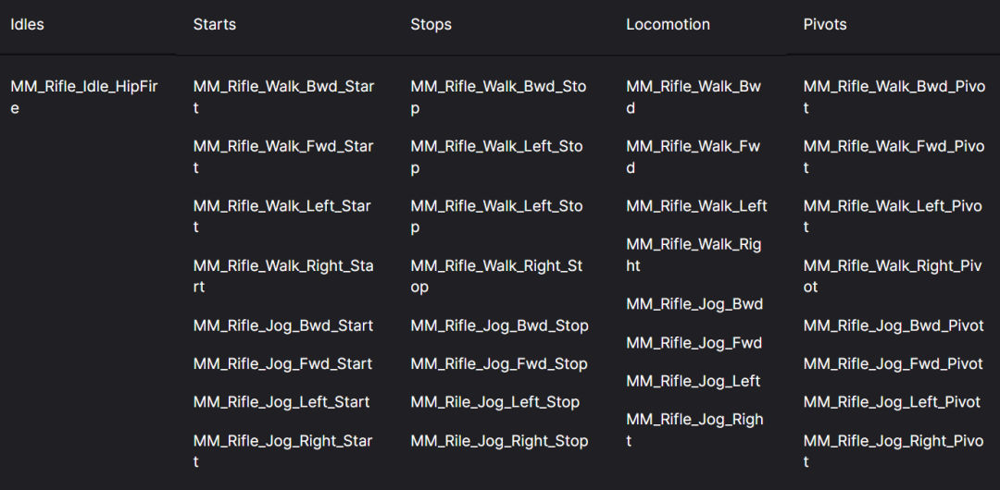

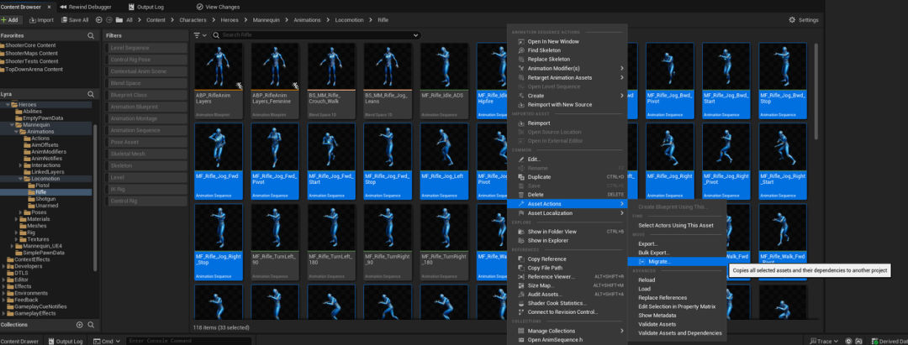

这是少量的动画。我们对步行和慢跑动画的运动覆盖范围最小。即使在处理稀疏数据集时，完整的运动匹配设置预计也将具有比这更多的动画覆盖范围。

  

**角色蓝图**  

现在您已经迁移了动画资源，您可以打开新项目了。在本教程中，我们将重新利用 BP_ThirdPersonCharacter 作为我们的玩家角色。您将在项目内容目录的 /Content/ThirdPerson/Blueprints 中找到该蓝图：

  

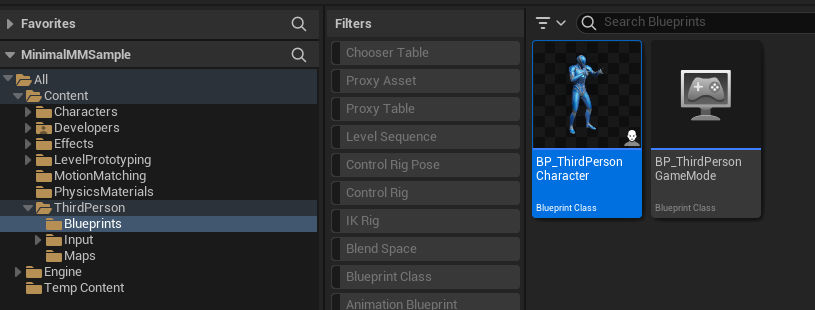

####   

#### **组件设置**

打开角色蓝图后，进行以下更改。

1. 选择骨架网格体组件，将网格体改为 SKM_Manny
    
      
    
    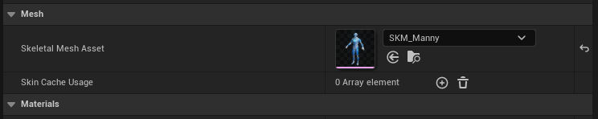
    
      
    
2. 在组件列表中选择BP_ThirdPersonCharacter，并设置使用控制器旋转偏航
    
      
    
    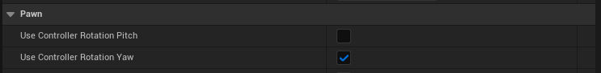
    
      
    
3. 选择角色移动组件并更改以下值：
    

1. 设置最大加速度 = 800.0
    
2. 最大行走速度 = 600.0
    
    最小模拟步行速度 = 300.0
    
      
    
    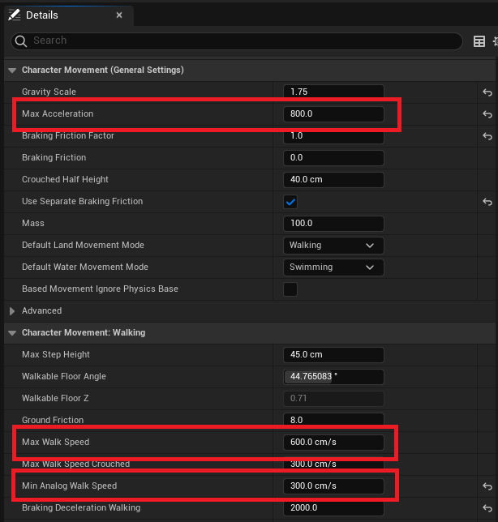
    
      
    
3. 禁用“定向旋转至运动”
    
      
    
    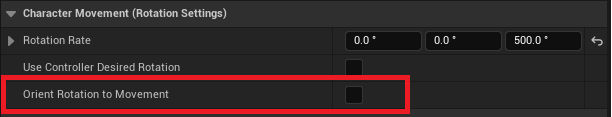
    
      
    

#### **设置输入**

接下来，我们需要确保角色的控制器输入为我们提供的运动与我们拥有的动画覆盖范围相匹配。

##### **输入映射**

返回内容浏览器，找到 IMC_Default 输入映射上下文资产。它位于 /ThirdPerson/Input/  

  

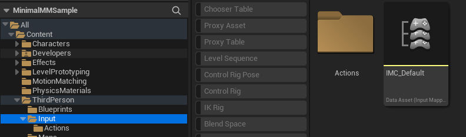

  

打开输入映射上下文后，展开游戏手柄左摇杆 2D 轴部分，然后展开修改器。在第二个索引中，将标量值更改为 1,1,1，以便为角色提供更离散的输入比例变化，我们将能够将其重新映射到动画的速度。

  

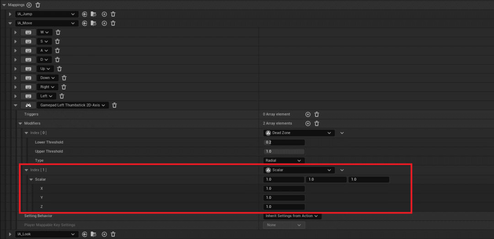

#####   

##### **事件图**

回到BP_ThirdPersonCharacter，转到事件图。进行以下更改：

1. 删除跳转功能，因为这与本教程无关
    
2. 添加三个变量，我们将使用这些变量来限制来自控制器的输入比例
    

1. 一个名为 RunScale 的浮点变量。将其设置为 1.0
    
2. 第二个浮点变量名为 WalkScale。将其设置为 0.5
    
3. 名为 RunScaleThreshold 的最终浮点变量。将其设置为 0.75
    
      
    
    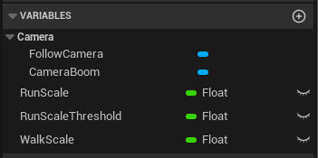
    
      
    

4. 添加一个名为 ClampInputScale 的函数。我们将使用此函数来限制来自控制器的输入比例。当输入比例高于 RunScaleThreshold 时，我们将限制为 RunScale，当低于 RunScale 时，我们将限制为 WalkScale。
    

1. 该函数应采用 Vector2D 变量作为输入。将此命名为“InputScale”。
    
2. 它还应该输出一个名为 ReturnValue 的 Vector2D。
    
3. 函数图应如下所示：
    
      
    
    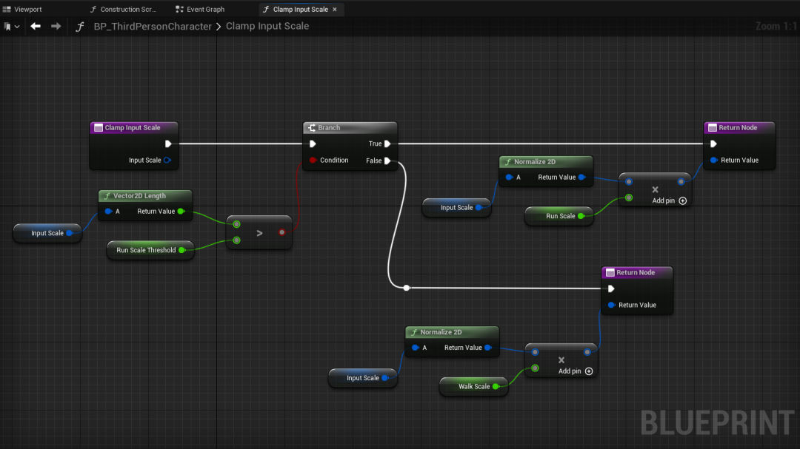 
    
4. 回到事件图的顶层，将 ClampInputScale 函数连接到 IA_Move 事件：
    
      
    
    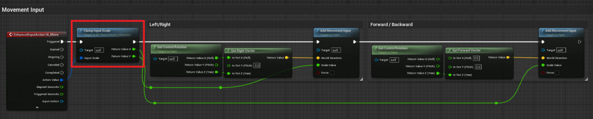 
    

  

对组件和事件图的这些更改提供了一个尽可能接近我们的动画覆盖范围的运动模型。我们的行走动画以 300 厘米/秒的速度移动，慢跑以 600 厘米/秒的速度移动，因此我们在运动组件上设置了相应的值。将输入比例限制为 0.5 或 1.0 会强制角色以 300 厘米/秒或 600 厘米/秒的速度移动。虽然运动匹配不需要限制输入比例 - 您的角色仍然可以具有离散速度 - 但这样做可以产生更好的结果，特别是在动画覆盖范围有限的情况下。

  

### **设置运动匹配资产**

#### **模式**

我们现在将设置您将用于角色的架构和数据库。

为运动匹配资源创建新文件夹后，创建姿势搜索架构。该资源包含姿势搜索算法用于分析动画序列的规则。

将我们从 Lyra 项目迁移的 Mannequin 骨架设置为目标骨架。将资产命名为 PSS_Mannequin  

  

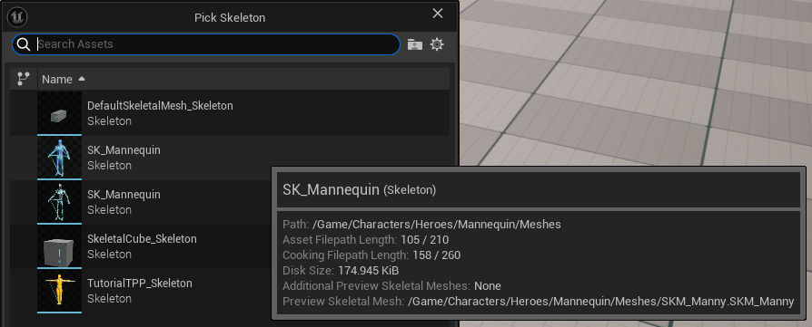

  

模式包含用于分析数据库内动画的规则。在此示例中，我们将保留默认值，这应该有利于一般运动。

  

#### **数据库**

##### **散步**

接下来，创建第一个姿势搜索数据库。以刚刚创建的模式为目标，并将资产命名为 PSD_Walks。

  

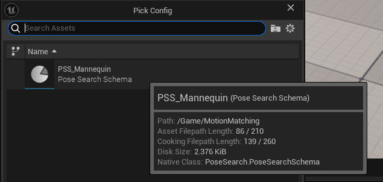

  

该数据库将仅包含您的步行周期和等效枢轴动画。我们将为慢跑创建另一个数据库，并为空闲 + 停止和启动创建单独的数据库。像这样拆分数据库有助于指导运动匹配系统在处理稀疏数据集时选择正确的动画帧。

在内容浏览器中，选择 MM_Rifle_Walk_Fwd 以及 Bwd、Left、Right 和等效 Pivot 行走的变体。这总共应该有八个序列。将它们放入数据库的资产列表中。

  

数据库应根据架构中列出的通道自动分析序列。如果您在资产列表中选择剪辑，它们应在数据库视口中播放。

现在在数据库中进行以下更改：

1. 将非枢轴动画设置为循环。为此，您可能需要在动画编辑器中打开动画序列（双击数据库中的资源将打开动画序列）。
    
2. 禁用非枢轴动画上的“重新选择姿势”标志
    
3. 将循环成本偏差设置为 -0.01。这降低了运动匹配系统从循环动画中选择帧的成本。换句话说，它使选择枢轴动画的可能性降低。
    

  

您的 PSD_Walks 数据库现在应如下所示：  

  

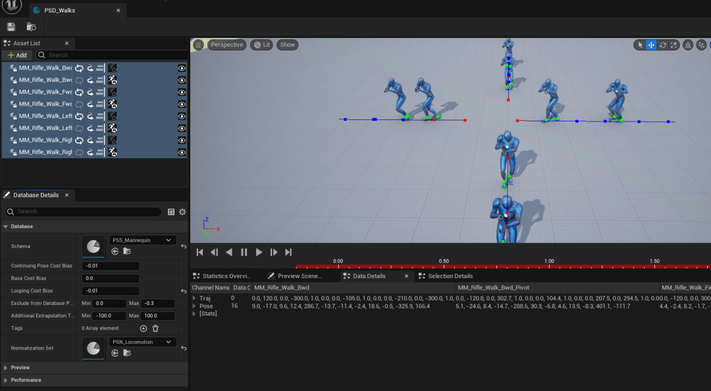

  

##### **慢跑**

现在，创建第二个数据库，并将其命名为 PSD_Jogs。然后，对等效的点动和点动枢轴动画重复上述过程。确保再次设置姿势标志的循环和重新选择。您的数据库应如下所示：  

  

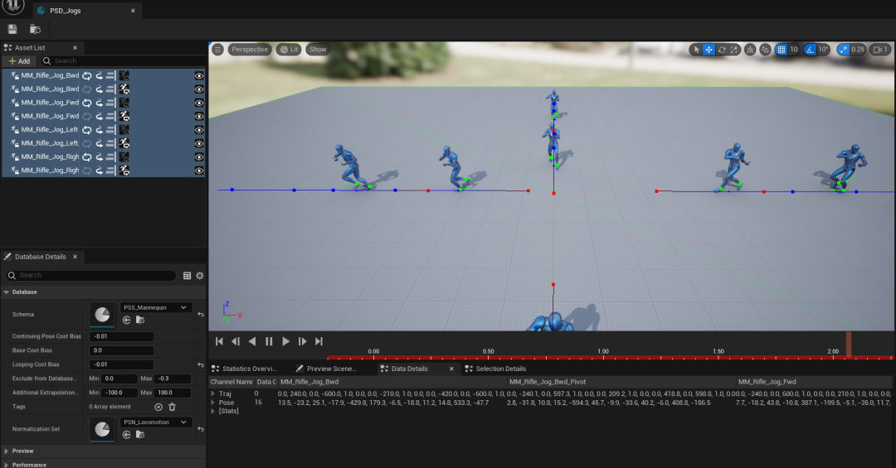

  

##### **怠速和停止**

现在创建第三个数据库，将其命名为 PSD_IdleAndStops。将“空闲”动画和所有“停止”变体放入数据库中。

设置与以前相同的标志和属性，以便数据库看起来像这样：  
  

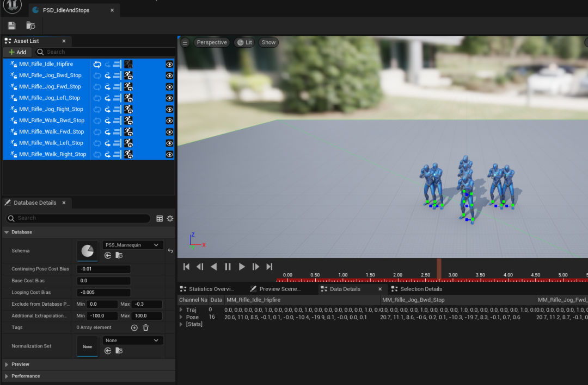

  

创建最终数据库并将其命名为 PSD_Starts。放入所有开始变体动画。

再次设置标志和属性，使数据库如下所示：  
  

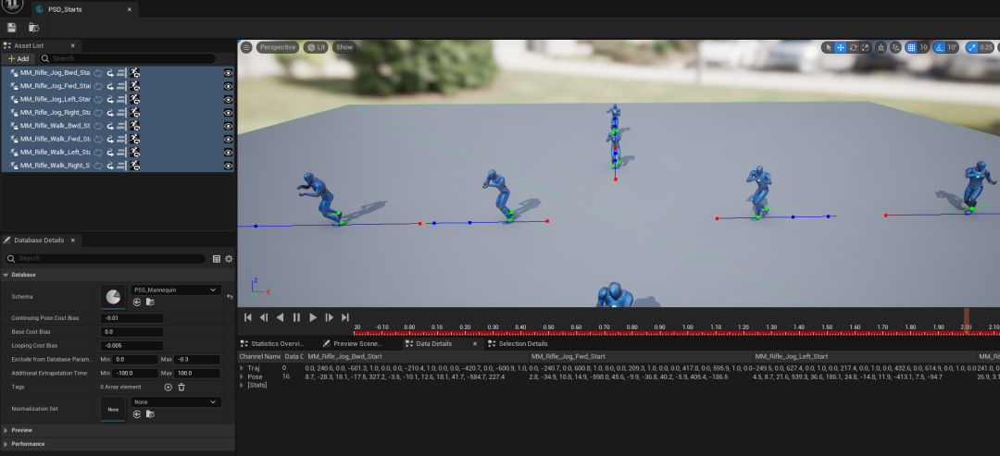

  

#### **正常化**

最后，我们需要创建一个姿势搜索规范化资产。如果您希望动态切换活动数据库，则应使用此资产，我们将在稍后进行设置。

创建标准化资产后，将其命名为 PSN_Locomotion，并将所有现有数据库添加到其中。注意：您还需要打开每个数据库并在其上设置标准化资产。

  

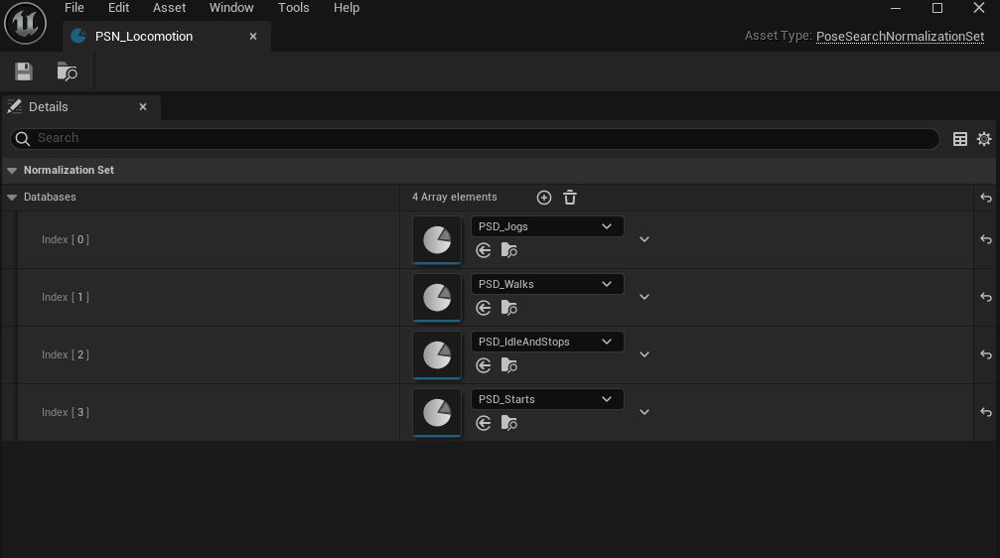

###   

### **设置动画蓝图**

现在您已经设置了运动匹配资产，是时候在动画蓝图中使用它们了。

创建一个新的动画蓝图并将其命名为 ABP_Mannequin。将目标骨架设置为我们从 Lyra Starter Project (SK_Mannequin) 迁移的人体模型骨架。

返回角色蓝图（BP_ThirdPersonCharacter）并在骨架网格组件上设置新的动画蓝图。

  

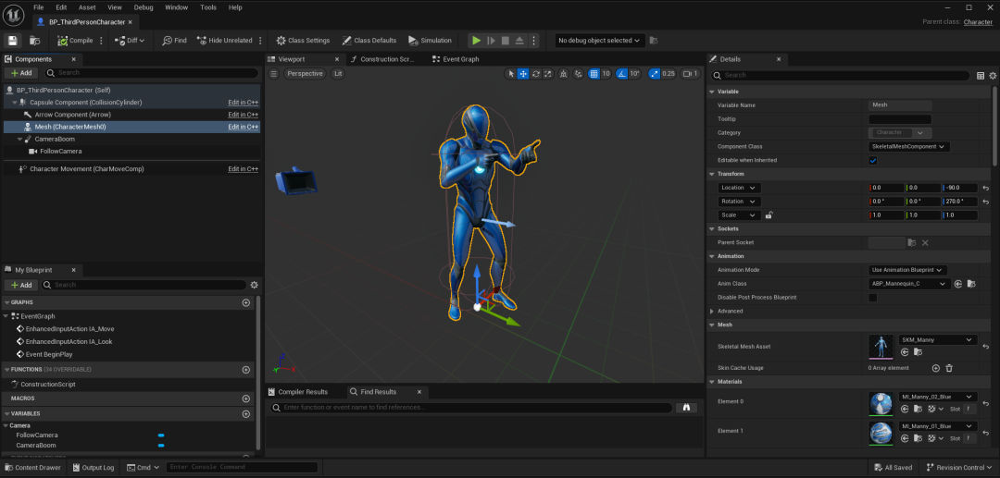

  

#### **运动匹配节点**

返回动画蓝图，转到动画图表并放入运动匹配节点。在数据库输入引脚上，指定 PSD_IdleAndStops 作为数据库。

  

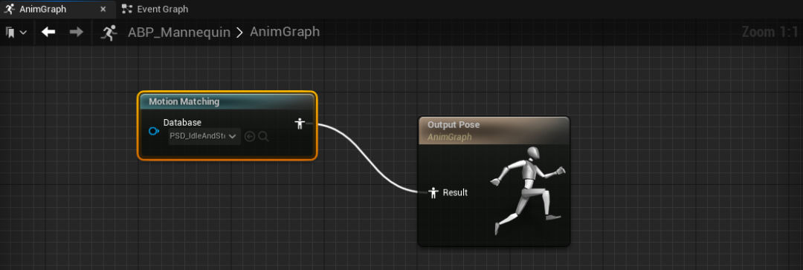

  

运动匹配节点是任何运动匹配实现的核心。该节点将执行分析以确定动画数据的哪一帧与轨迹输入最匹配。

  

#### **姿势历史节点**

接下来，我们需要添加一个姿势历史节点。

  

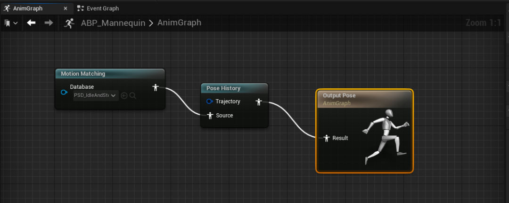

  

#### **生成轨迹数据**

现在我们需要生成一些可以提供给 Pose History 节点的轨迹数据。

向您的动画蓝图中添加一个类型为“Pose Search Query Trajectory”的变量，并将其命名为“Trajectory”：

  

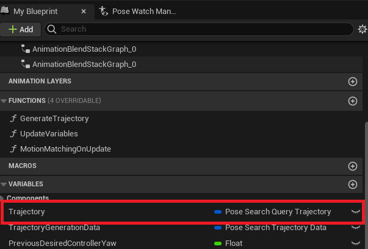

  

现在，创建一个名为 GenerateTrajectory 的新函数。我们将使用它来收集轨迹数据。放入 Pose Search Generate Trajectory 节点，然后按如下方式连接它：

1. 将你的轨迹变量连接到 In Out Trajectory
    
2. 从“轨迹数据”引脚创建一个变量，并将其重命名为“轨迹生成数据”
    
3. 将 In Delta Time 引脚连接到 Get Delta Seconds 函数
    
4. 将动画实例连接到自身节点
    
5. 从 In Out Desired Controller Yaw Last Update 引脚创建一个变量，并将其命名为 PreviousDesiredControllerYaw
    
6. 连接其余函数并设置轨迹变量
    

  

您的GenerateTrajectory 函数现在应如下所示：  
  

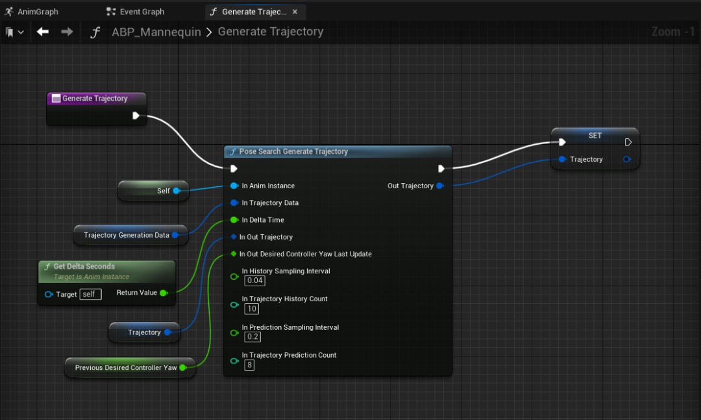

  

您可以避免通过 Pose Search Generate Trajectory 节点生成轨迹，而是通过“Generate Trajectory”属性直接在 Pose History 节点上执行此操作。这目前是一项实验性功能。

  

现在，在动画蓝图的事件图中，将生成轨迹函数连接到事件蓝图更新动画。  
  

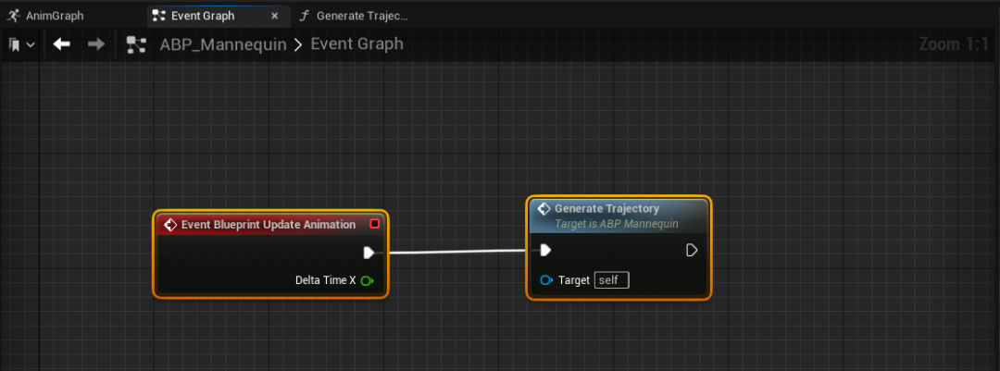

  

返回动画图表，在“姿势历史记录”节点上设置“轨迹”引脚以使用“轨迹”变量。  

  

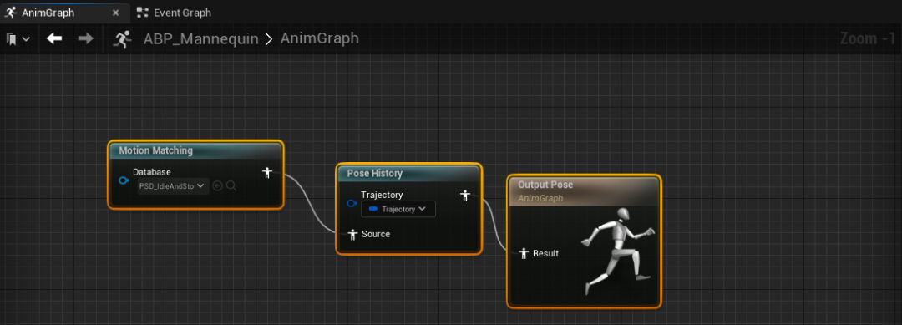

  

### **选择数据库**

  

我们现在要设置一些逻辑，这些逻辑将根据玩家角色的移动切换传入运动匹配节点的活动数据库。但首先，让 PIE 查看我们当前设置的状况。

  

，时长00:07

您应该看到 Lyra 网格正在播放空闲动画。运动匹配节点已从 PSD_IdleAndStops 数据库中的数据中选择动画。这在我们闲置时非常棒，但是一旦我们移动角色，很明显我们需要将数据库交换到包含我们的运动动画的数据库。

  

#### **选择器表**

我们将使用选择器表来交换提供给运动匹配节点的数据库。选择器允许我们根据一系列输入在上下文中切换资产。它们类似于数据资产，但包含指示输出哪个资产的内部逻辑。

在内容浏览器中创建一个选择器表（右键单击 > 其他 > 选择器表）并将其命名为 CHT_PoseSearchDatabases。

打开选择器后，转到表设置：

1. 将 Fallback Result 设置为 Asset type，并指定 PSD_IdleAndStops
    
2. 将条目添加到上下文数据，指定上下文对象类型类并输入您的动画蓝图 (ABP_Mannequin)。这允许选择器从动画蓝图中提取数据。
    
3. 输出对象类型应为 PoseSearchDatabase。这是我们希望选择器输出的资产类型
    

  

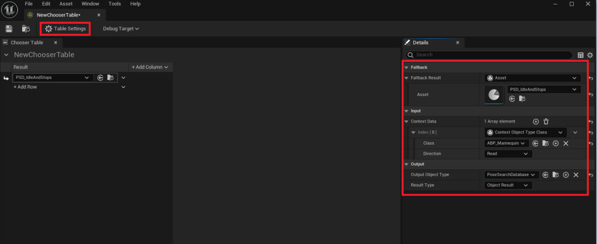

  

现在添加四个资产行，并指定每个数据库。这里的顺序很重要。当与多行关联的条件为真时，将返回顶行的资产。

  

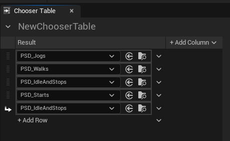

  

#### **收集一些状态数据**

现在，我们的动画蓝图中需要一些变量来使用它们来确定从选择器输出哪个数据库。

返回动画蓝图并添加一个类型为 Character Movement Component 的变量，并将其命名为 CharacterMovement。在 Event Graph 中，按如下方式设置 CharacterMovement：

  

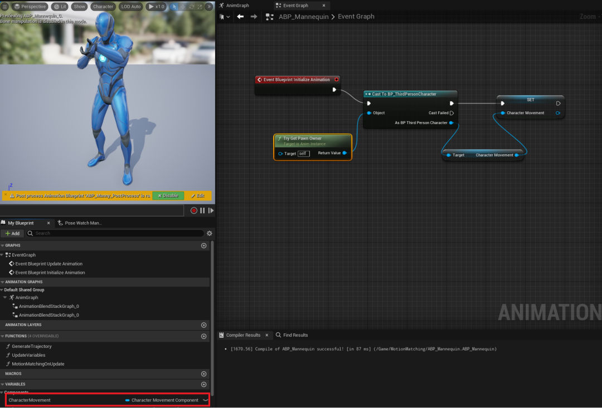

  

**现在添加以下变量：**

1. 两个布尔变量，StartedMoving、HasAcceleration
    
2. 三个浮点变量：Acceleration、LastFrameAcceleration 和 Speed
    

  

接下来，添加一个名为 UpdateVariables 的函数。我们将在此处设置已添加的所有变量。将浮点输入添加到名为 DeltaTime 的函数。

1. 设置 Acceleration 和 LastFrameAcceleration 如下：
    
      
    
    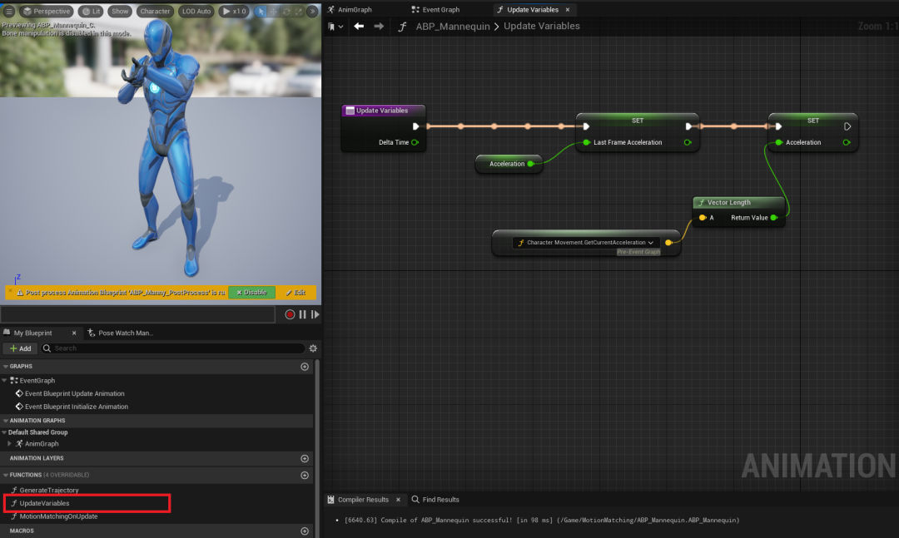
    
      
    
2. 现在计算 HasAcceleration 和 StartedMoving 如下：
    
      
    
    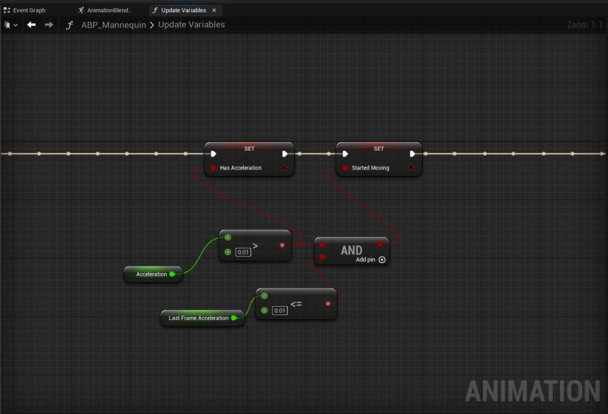
    
      
    
3. 最后设置速度如下：
    
      
    
    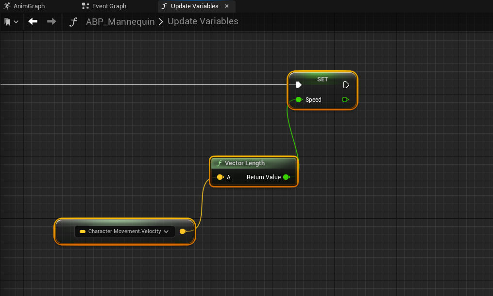
    
      
    

在上面的步骤 1 中，PropertyAccess 节点用于在 CharacterMovement 上直接调用 GetCurrentAcceleration。

  

返回事件图并连接更新变量函数。  

  

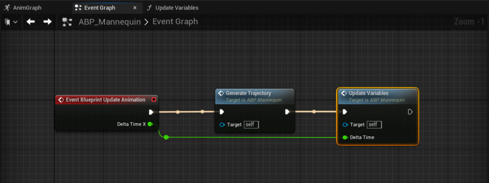

  

#### **完成选择器设置**

现在我们可以完成选择器中的设置。返回选择器资产并执行以下操作：

1. 添加两个 Bool 列并将它们绑定到 StartedMoving 和 HasAcceleration 变量
    
2. 添加 Float Range 列并将其绑定到 Speed 变量
    
3. 设置值如下：
    
      
    
    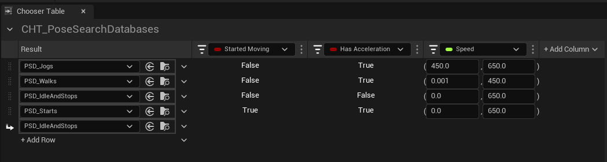
    
      
    
4. 这里的想法是让选择器在角色没有加速（即停止或停止）时选择 IdleAndStops 数据库，在角色开始移动的帧上选择 Starts 数据库，并在指定范围内移动时选择 Walks 或 Jogs 数据库的速度。行走动画的速度约为 300 厘米/秒，因此当角色在 0 到 450.0 厘米/秒之间移动时，这些动画是我们最接近的匹配。当角色移动速度超过 450.0cm/s 时，慢跑是最接近的匹配。  
    

  

#### **设置数据库**

最后，我们要设置在运动匹配节点上选择器所选择的数据库。

返回到顶层动画图并选择“运动匹配”节点。从详细信息面板中，选择“更新时”功能并单击“创建绑定”。这将创建一个新的动画节点函数，每次运动匹配节点更新时都会调用该函数。重命名函数 MotionMatchingOnUpdate：  

  

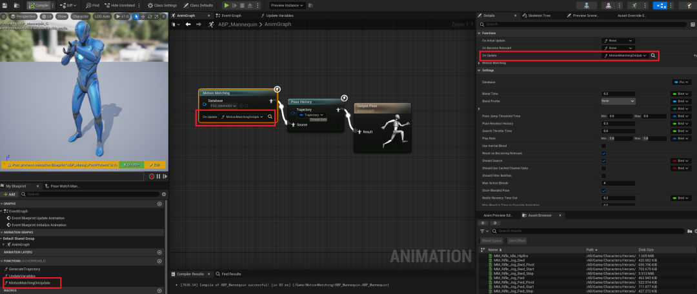

  

在函数内部，您可以设置逻辑以从选择器表中获取运动匹配节点的活动数据库。请注意，我们现在将中断模式设置为强制中断并使持续姿势无效；我们将回到这一点。  

  

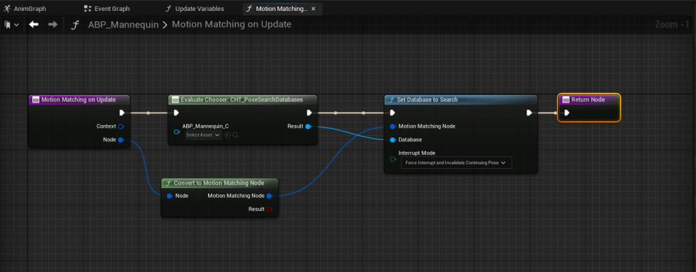

  

现在，让我们测试一下根据上下文设置活动数据库的工作结果。点击 PIE 并移动角色。您应该看到，当我们从 PSD_IdleAndStops 移动到 PSD_Starts，然后移动到 PSD_Walks 或 PSD_Jogs 时，运动匹配节点的输入数据库会发生切换，具体取决于角色的速度。然而，还有很多工作要做。

  

### **中断模式**

我们之前简要讨论了“设置数据库以搜索”节点上的中断模式。此属性控制运动匹配系统如何处理数据库中的更改 - 前一帧（和数据库）中的连续姿势对于此帧的继续选择是否仍然有效，或者之前的选择是否无效并且仅使用新数据库中的动画是否考虑当前帧的姿势？

为了改善运动匹配输出的外观，我们只想在回到空闲状态时强制中断，因为我们不想在此时继续播放运动剪辑。

返回动画蓝图并转到 MotionMatchingOnUpdate 函数。

  

将中断模式引脚提升为变量：  

  

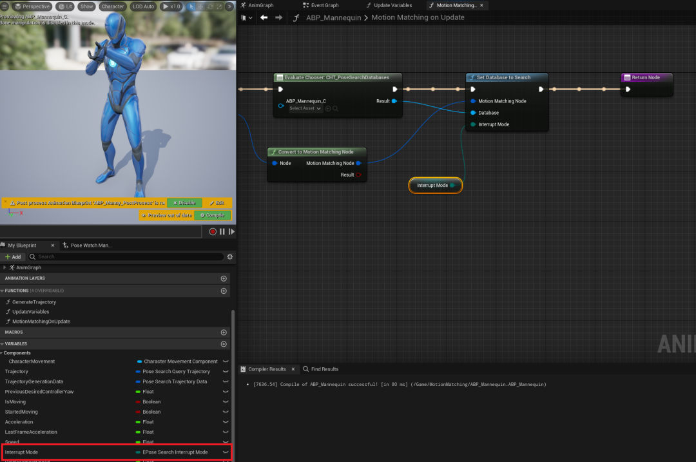

  

现在转到您的 UpdateVariables 方法并添加以下逻辑，根据角色是否具有加速度（即是否移动）来设置中断模式：  

  

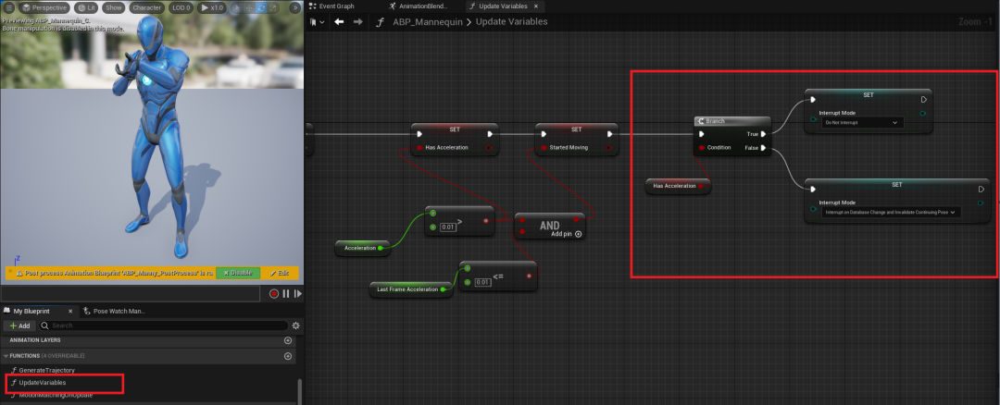

  

如果您返回 PIE，您现在应该会发现运动数据库之间的切换更加无缝。当角色停止时，空闲和停止动画会立即触发。

  

### **使用动画扭曲修复覆盖范围**

现在，我们已经设置并运行了运动匹配。但是，运动动画提供的覆盖范围对于我们的运动模型来说还不够。我们只有两种不同的速度设置（步行和慢跑）以及每种速度的四个基本方向。我们可以通过使用动画扭曲节点来填补空白。

  

#### **方向扭曲**

首先，我们将解决基本方向（向前、向后、向左和向右）之外的覆盖范围不足的问题。方向扭曲动画节点允许我们通过程序修改角色的方向和脚的位置来生成在这些基本方向之间定向的姿势来实现此目的。

返回动画图的顶层，双击 Motion Matching 节点。这将打开 Motion Matching 节点下的子图。  

与其他混合堆栈节点类型一样，运动匹配节点包含一个可以自定义以修改输入变换的子图。目前，子图设置为输出运动匹配算法的输入变换，无需任何修改，但我们可以在此处执行程序修复。

将 Orientation Warping 节点放入图表中，连接它并指定所需的骨骼：  

  

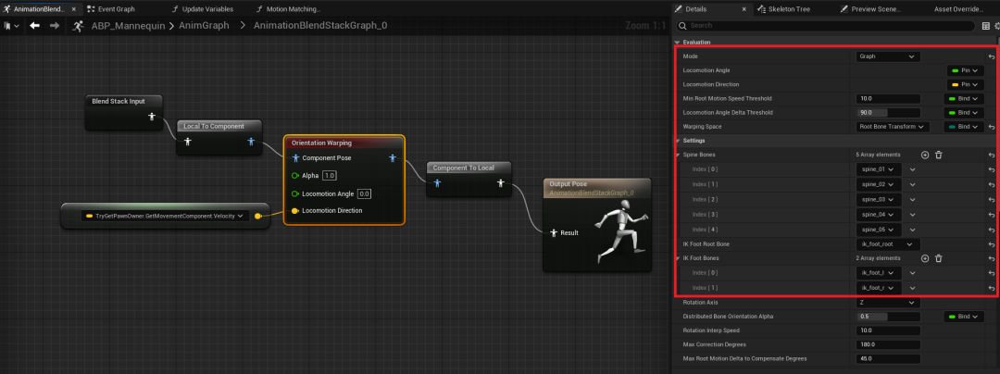

  

在 Orientation Warping 节点后放置一个 Reset Root Transform 节点。此节点将重置根骨骼上的变换，以防止方向扭曲影响下一帧的姿势搜索计算。  

  

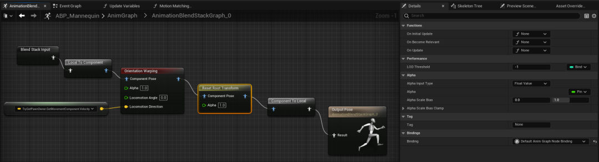

  

回到动画图的顶层，在运动匹配节点后放置一个 Leg IK 节点。这将应用 IK 将 FK 脚骨位置修复到方向扭曲节点设置的 IK 脚骨位置。  

  

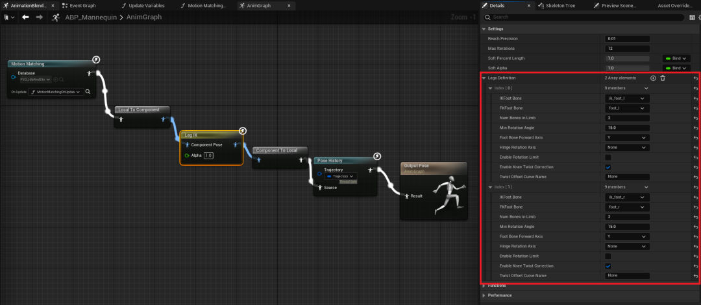

现在您可以再次使用 PIE 查看方向扭曲的效果。

现在您应该看到动画扭曲正在生成偏离前/后、左/右轴的运动的中间姿势。

如果您需要调试方向扭曲，您可以启用“a.AnimNode.OrientationWarping.Debug”cvar

####   

#### **步幅扭曲**

尽管我们限制了角色移动的速度，但在某些时候我们仍然可能会出现脚滑的情况 - 当角色在步行和慢跑之间开始、停止或加速或再次返回时。为了解决这个问题，我们可以使用 Stride Warping 节点。

返回动画蓝图中运动匹配节点内的子图。

在 Reset Root Transform 节点之后，放入 Stride Warping 节点并进行如下设置：  

  

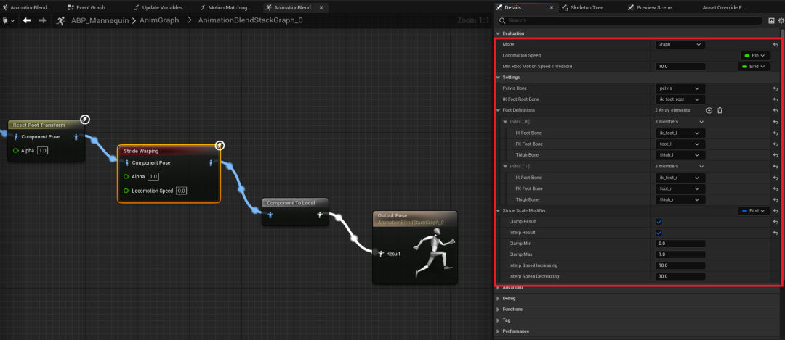

  

我们需要一个变量来驱动步幅比例输入，因此添加一个名为“位移速度”的新浮点变量。为了计算位移速度，我们还需要一个名为 WorldLocation 的新向量变量。

在更新变量函数中，设置位移速度和世界位置，如下所示：

  

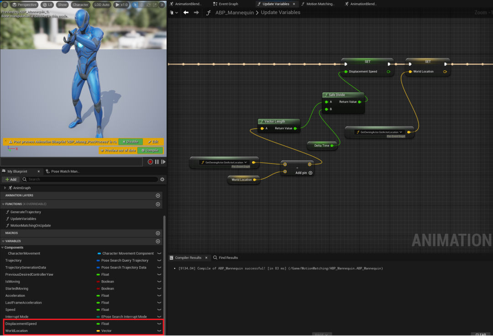

  

返回 PIE。您现在应该看到腿部的步幅与胶囊的速度更加接近。

如果你需要调试步幅扭曲，那么 'a.AnimNode.StrideWarping.Debug` cvar 会很有用

  

### **细化动画选择**

如果您使用 PIE，您应该会看到运动匹配设置看起来相当不错。我们有一个角色，可以流畅地从静止状态移动到运动状态，从步行到慢跑，改变方向，然后返回静止状态。

但是，如果您在步行和慢跑动画之间切换时或偶尔在角色旋转并返回运动时仔细观察，您会发现姿势存在一些不连续性。此Rewind Debugger捕获显示了在播放 Walk_Left_Pivot 动画后如何错误地选择 Jog_Left_Pivot 动画。

  

，时长00:08

#### **通过倒带调试器识别问题**

倒带调试器拥有丰富的工具，可用于调试运动匹配设置的问题。在本例中，我们想要了解为什么在枢轴完成后选择 Jog_Left_Pivot 动画。

我们可以对记录的缓冲区做的第一件事是选择“姿势搜索”行。然后，“倒带调试器”详细信息面板将显示与主面板中所选帧的动画选择相关的姿势搜索数据。我们想要了解为什么选择 Jog_Left_Pivot，以便我们可以拖动到序列处于活动状态的第一帧。

  

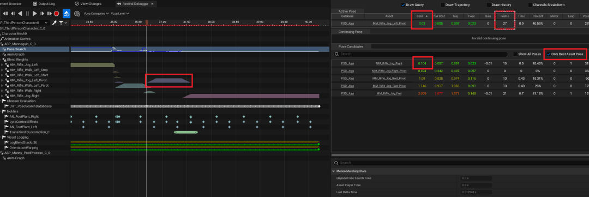

  

当您第一次选择“姿势搜索”行时，您将在详细信息面板中看到大量数据。在这种情况下，我们对动画而不是帧选择感兴趣，因此您可以选择“仅最佳资产姿势”来减少我们正在查看的数据集。

旋转后，我们的角色加速回到慢跑速度。但是，我们并没有像期望的那样过渡到 Jog_Right 动画，而是在旋转发生后（第 27 帧，我们在调试中可以看到）过渡到 Jog_Left_Pivot 动画的部分。这是因为此选择的成本为 0.03，而 Jog_Right 动画的成本为 0.104。

我们可以通过多种方式来解决这个问题。其中一个例子可能是减少姿势搜索数据库中的循环成本偏差，以降低选择 Jog_Right 动画的成本，因为它是一个循环动画，而枢轴不是。或者我们可以修改架构以添加额外的通道来优化选择。

然而，在这种情况下，我们知道我们永远不想在枢轴发生后过渡到枢轴动画的一部分。切勿选择枢轴动画来提供连续的行走或慢跑动画；为此，我们有稳态步行和慢跑。为此，我们可以在枢轴动画中标记我们不想通过“姿势搜索：块转换”状态通知转换到的区域。

打开 Jog_Left_Pivot 动画并添加新的 Notify 轨道。然后在枢轴发生之前和之后向剪辑添加“姿势搜索：块过渡”通知。然后，运动匹配将仅允许在通知未激活的帧上过渡到此剪辑。

  

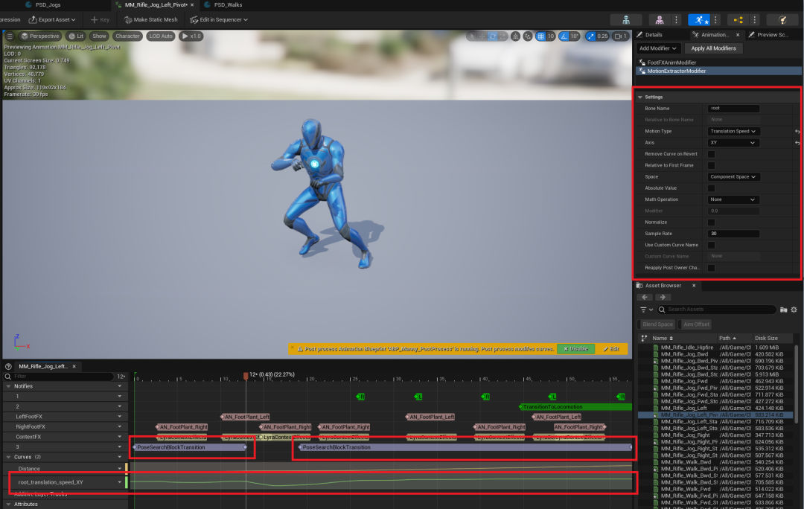

  

为了帮助放置，您可以添加 MotionExtractorModifier 动画修改器来分析动画的速度。这将显示动画中枢轴运动发生的位置。然后，您可以阻挡该点之前和之后。动画覆盖级别越低，您可能需要对此采取更积极的措施。

  

现在对 Walk 和 Jog 数据库中的其他每个枢轴动画重复此过程。

  

### **总结**

此时，您应该拥有一个功能性的运动匹配设置。我们已经了解了如何设置角色蓝图、如何设置运动匹配资源、如何在动画蓝图中使用相关节点以及动画变形。我们还简要介绍了一些可用的调试工具。这些为您提供了在您自己的项目中开始构建运动匹配设置的知识