原创 虚幻引擎 虚幻引擎

 _2024年11月07日 13:12_ _上海_

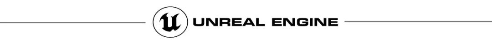

**前言**

在最新的虚幻5.4版本更新中，万众期待的游戏动画案例工程隆重推出，为大家带来了运动匹配系统使用的优秀范本。今天我们将通过这个案例，介绍运动匹配系统的一些使用知识与技巧，帮助大家能在未来能陆续使用上这个系统制作自然且优质的人物动画。

该文章出自https://www.youtube.com/watch?v=tNw9lD2PW3U，讲者为Jose Villarroel。

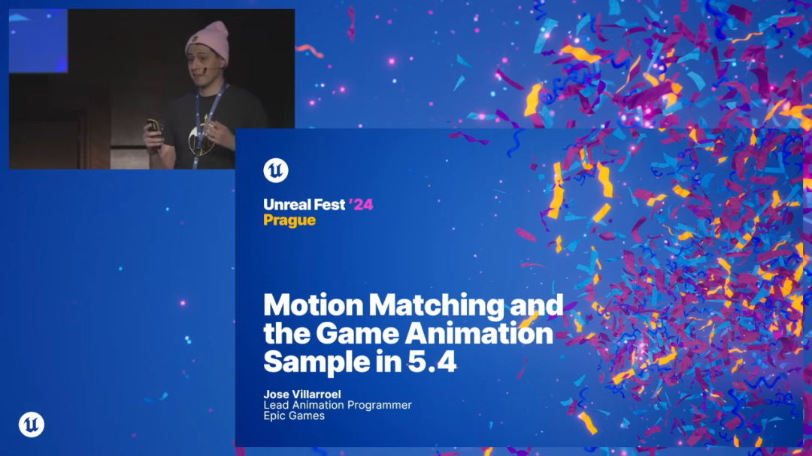

**正文**

**一、运动匹配是什么**

运动匹配是一套基于查询的动画选择系统，这个系统主要分三部分。

首先是**查询**，查询会做两件事，第一件事是**获取游戏中人物的运动轨迹**作为查询目标，第二件事是**获取当前运动匹配动画所对应的人物运动轨迹**。如下图，蓝色线为目标运动轨迹，黄色线是当前动画所对应的运动轨迹。

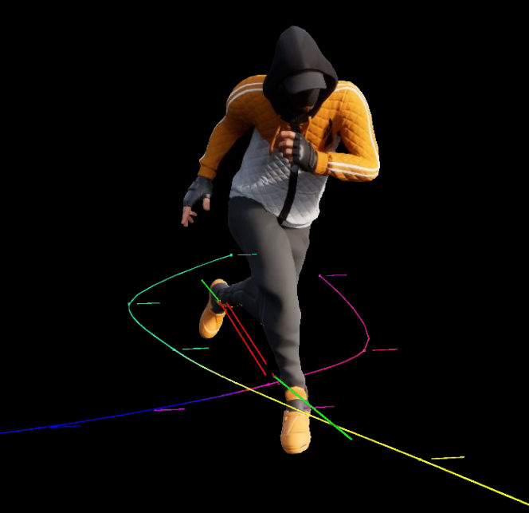

其次是**动画数据库**，我们需要收集很多动画，然后设定他们的参数，系统会根据当前目标轨迹选择最接近的动画。

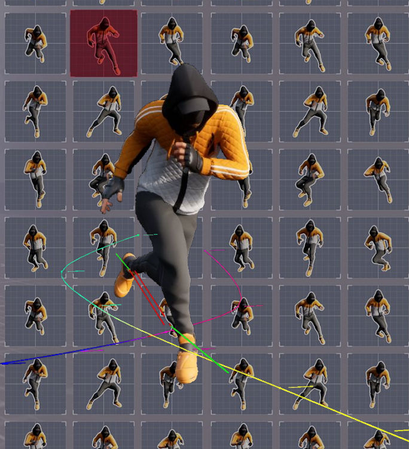

最后**输出结果**。

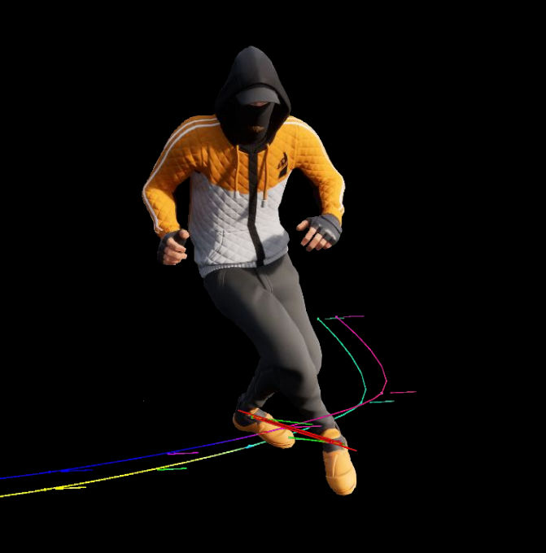

**二、游戏动画案例工程**

Game Animation Sample是一个高质量游戏动画的演示用例工程，这个工程跟随5.4发布，现在可以在虚幻商城免费获取。链接如下：

https://www.unrealengine.com/marketplace/en-US/product/game-animation-sample

这个工程会随着引擎的主要版本更新而更新，带来一些新的内容。Epic Games注重创造高质量的动画，那些社区的教程和文档可以帮助您了解到大约70%有关动画的知识与技能，而剩下的30%在这个优秀的案例工程和这次分享中。不过需要注意的是，这个工程并不是一个完整的游戏，没有UI，没有打怪升级，没有华丽的特效，我们会专注于探讨游戏动画方面的内容。最后我们希望这个工程是灵活且高可塑性的，并且我们已经发现其实有很多开发者已经在自己的项目中使用这个工程内的一部分内容了。

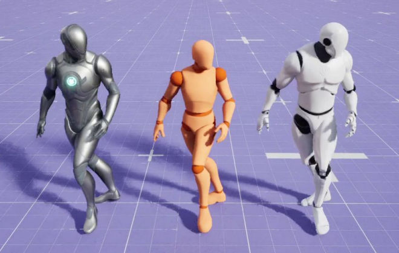

**三、现场演示**

**3.1 自己设置一个运动匹配**

首先我们创建一个动画蓝图，搞两个节点，Motion Matching（运动匹配）和Pose History（姿势历史记录），并且在姿势历史记录节点中打开Generate Trajectory（生成轨迹）。

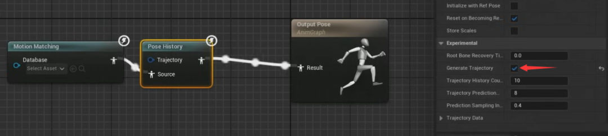

然后新建一个Pose Search Schema（姿势搜索模式）。这个资产是用于定义运动匹配系统是根据什么参数去选择匹配的动画的。

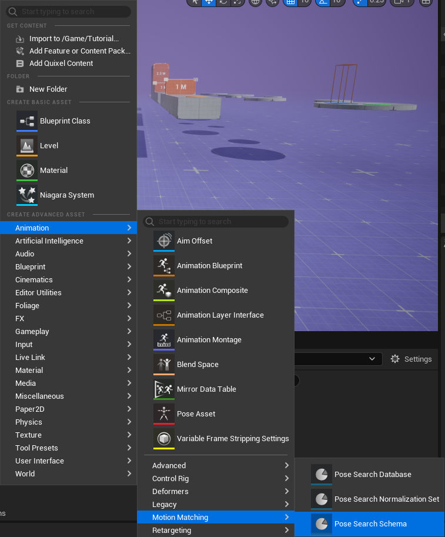

在界面中我们可以看到，这个默认的搜索模式是根据运动轨迹与脚的速度与位置进行动画的选择。

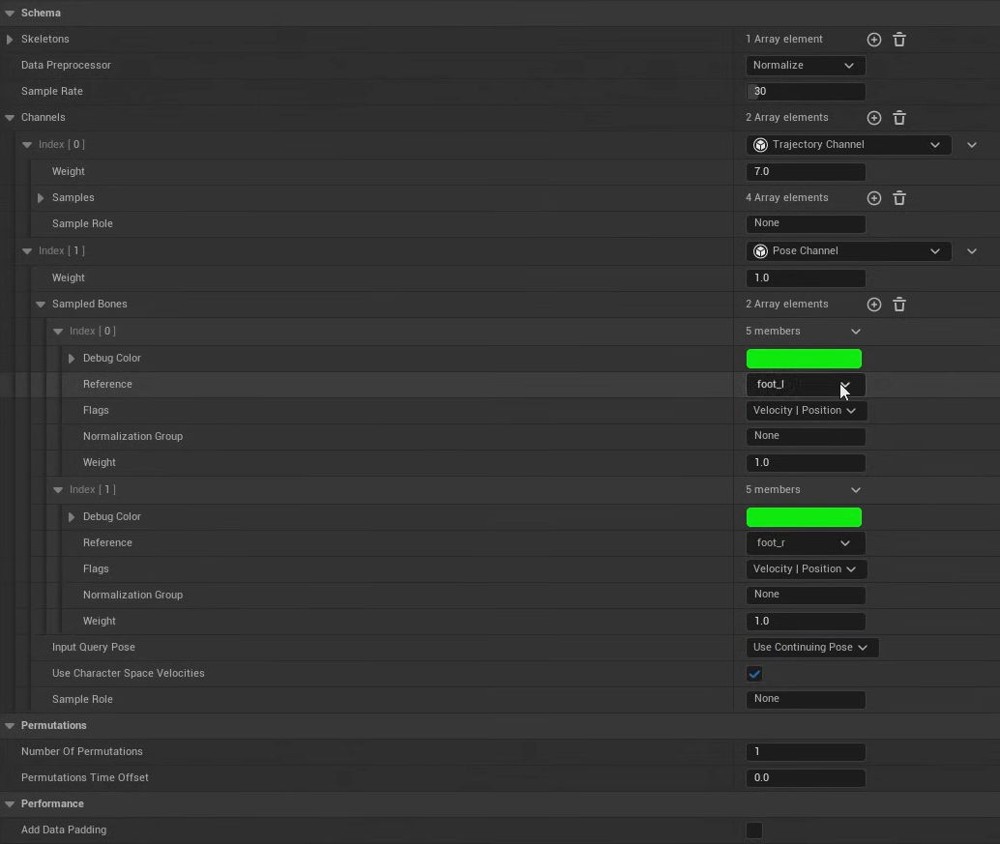

然后我们使用这个新建的搜索模式新建一个数据库，把蹲伏动画丢进去（别忘了Idle动画）。

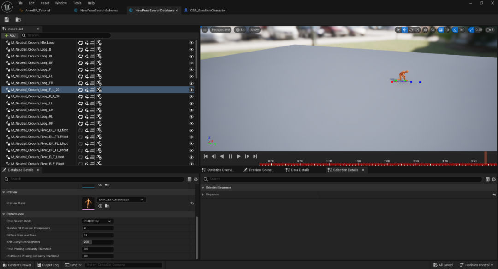

接着找到我们控制的角色CBP_SandboxCharacter，给角色Mesh设置新建的动画蓝图，并且在动画蓝图中设置好运动匹配的Database，然后就可以在PIE中看看效果。效果还是自己体验与观察最好，所以我们十分推荐您跟着我们的文章进行设置，一步步了解该案例工程中一些好玩的东西。

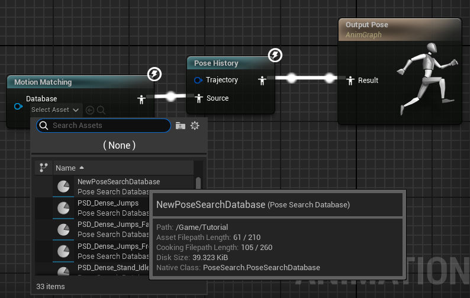

在下一步中，我们将会还原工程原来使用的动画蓝图，研究其中的一些东西。

**3.2 Rewind Debugger**

这个案例工程中，角色可以跳跃，可以翻越障碍，可以目视前方移动，也可以朝向速度移动等等。我们在Debug这些动画时，一般会用到Rewind Debugger（倒回调试器）。这个工具可以在Tools → Debug中找到。如图，戳开这两个按钮，这个工具就会在PIE启动时自动录制，在退出时自动停止，并且第一次选择好的被观察的对象在下一次启动时会自动选择并录制。

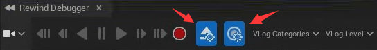

我们在PIE运行时可以选择物体进行倒带录制，然后暂停，通过拖动这个Rewind进度条可以达到倒带的效果。可以看到红框处显示了角色正在使用哪些动画，并且我们可以在红框左侧的动画列表中直接点进对应的资产编辑器。

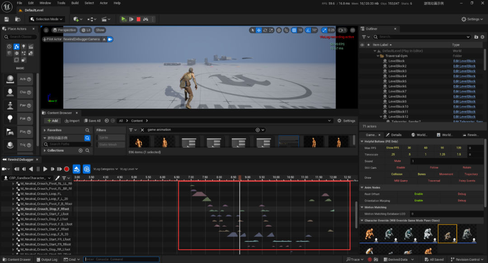

如果进入对应的动画蓝图，我们还会发现，这个动画蓝图里显示的姿势也是和现在倒带状态中的一模一样。这样就很方便我们调试我们的运动匹配动画了。

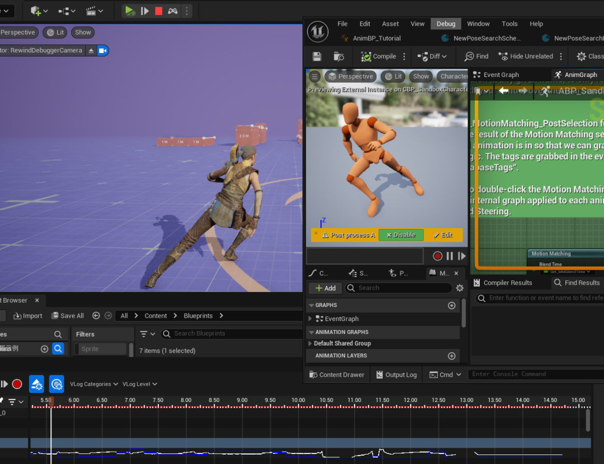

**3.3 一些动画节点与函数**

我们可以看到在姿势历史记录节点，它收集这些骨骼的信息去为动画做过渡平滑等工作。

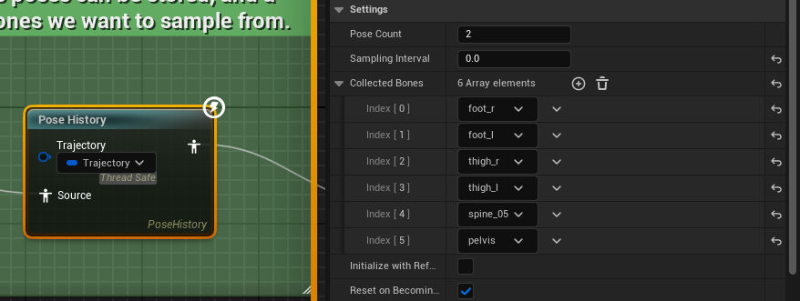

我们可以在工程示例动画蓝图中看到一个函数Generate Trajectory，这个函数是手动生成轨迹用的。刚刚我们在使用Pose History的时候是启用了Generate Trajectory的，也就是说这个节点会帮我们自动生成轨迹。而手动生成就意味着我们可以修改轨迹，让输入轨迹与动画轨迹进行适当的混合，即便是在没有太多动画数据的情况下也能做出很棒的效果。我们还可以通过世界碰撞生成运动轨迹，这个可以帮助我们处理跳跃在空中与落地时的运动匹配。

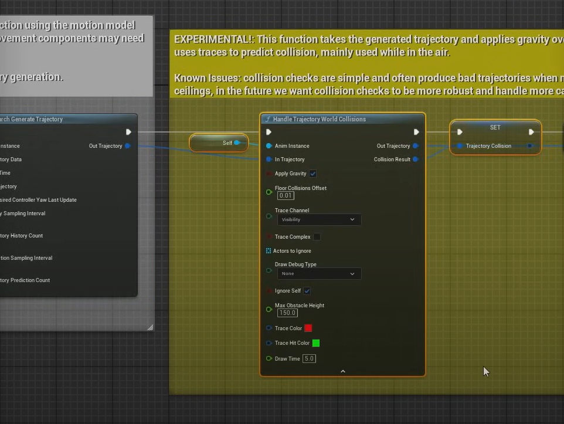

这个可以帮助我们获取轨迹信息存起来，在动画蓝图的其他地方使用。比如混合移动、停止和转身。

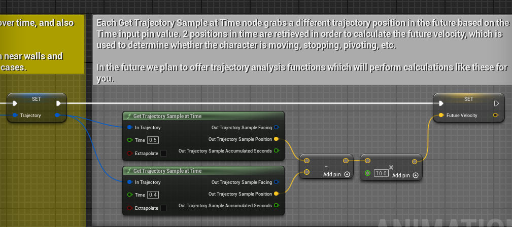

接下来我们回到那个Motion Matching蓝图节点，我们会发现这里有一个可以调整Blend Time的接口。这个接口是用来根据不同情况进行混合速度调整的，比如我们希望在空中角色能更快地混合到下一个动画，就会调整对应的混合时间。在以后的Motion Matching更新中，将会加入运动匹配的状态机，允许开发者直接调整混合时间，或者从一个运动匹配数据库混合到另一个数据库。

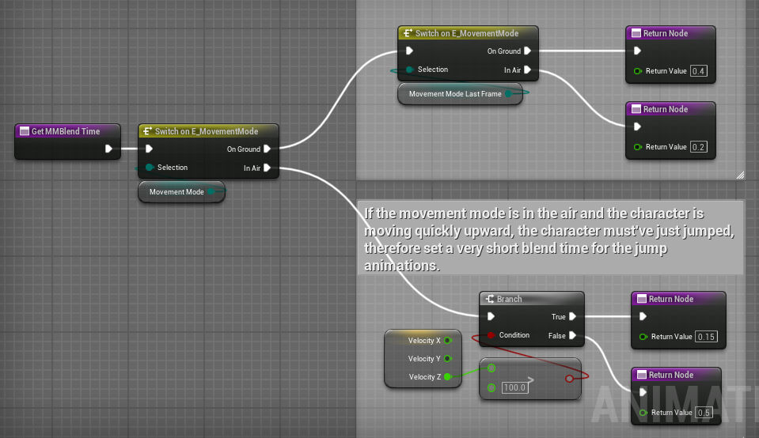

我们再看看这个Motion Matching节点，这里有一个执行函数叫做On Motion Matching State Updated，会在Motion Matching找到适合的动画时执行。在这个函数中，我们能获取当前选择的动画的相关数据，然后给其他地方使用。比如我们可以获取当前运动匹配的动画速度，让我们的蒙太奇配合它的速度混合与播放；或者获取当前Data Base并判断我们是否需要在这个状态下使用IK或其他一些东西。

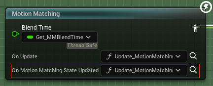

别忘了看看上面那个On Update函数，这个可以帮助我们实时更新当前Motion Matching所使用的Data Base。在这个示例工程中使用了Chooser来对Data Base进行选择。

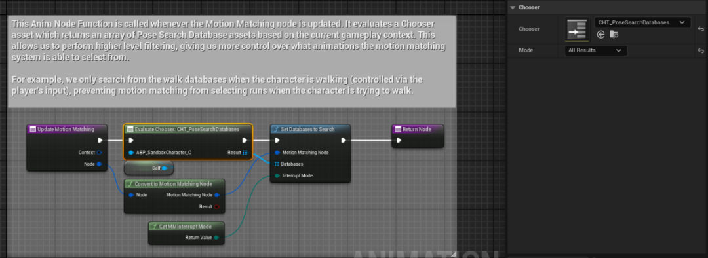

**3.4 Chooser**

顺带一提，Chooser是虚幻5.4的Beta插件，他可以帮助我们根据输入进来的参数进行判断与选择。Chooser还可以再叠Chooser，根据需求输入参数，根据参数进行选择。

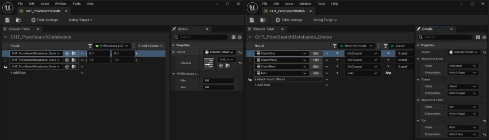

并且最重要的是Chooser适配上述提到的Rewind Debugger，也就是说我们可以在倒带中知道Chooser的选择情况。

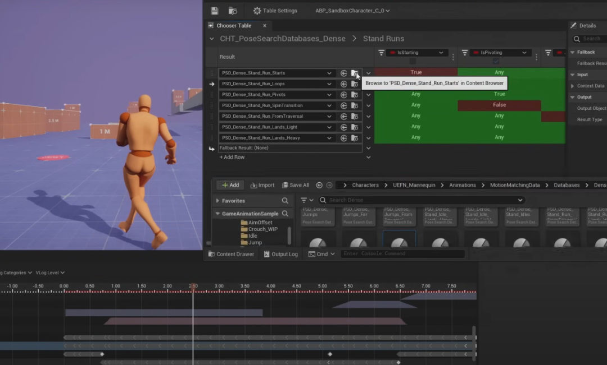

**3.5 为什么要做多个Data Base**

Chooser会帮助我们选择对应的Data Base，但是我们为什么要搞很多个Data Base然后再选择呢，Motion Matching不是已经帮我们选动画了吗？是的，Motion Matching的工作只是帮我们选动画，而我们需要决定什么时候播放动画，播放什么类型的动画。比如《堡垒之夜》这种游戏，我们需要角色是非常敏捷的，角色的响应速度就必须很快，而Chooser可以让Data Base快速切换并播放。

而另一个我们需要搞很多个Data Base的好处就是，我们可以根据数据库设置不同的动画搜索模式。比如我们在地面上移动时更希望着重注意脚的位置与速度，在空中就不一定了。并且设置搜索模式参数的过程很“艺术性”，意思就是我们没办法通过一种很数学的方式去得出很棒的参数，我们需要不断反复观察与实验找到一个适合自己项目的参数。还是再次推荐各位读者能够自己摸索与实验这个示例工程中的各种工具与参数。

**3.6 Pose Search过程**

在Rewind Debugger中，我们可以看到Motion Matching选择动画时所对应的Cost，然后选择Cost最低的那个动画播放。并且在勾选了Channels Breakdown我们就可以看到不同通道贡献的Cost多少，方便对搜索模式进行参数调整。

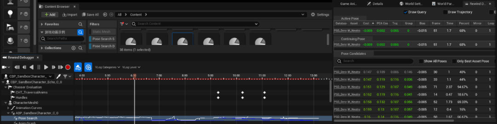

运动匹配擅长通过轨迹进行动画选择，但是如果我们希望在特定情况下更愿意使用某个动画，而不受轨迹的影响，我们可以在动画序列中加入一个Notify State叫Pose Search Override Continuing Pose Cost Bias的调整Cost的偏移。即便这个调整过的动画不太匹配当前的运动轨迹，但还是可能会选择这个动画。

我们还有一个Notify State叫Pose Search Exclude From Data Base，这个意味着数据库永远不会搜索这一段动画。

还有一个叫Pose Search Block Transition，这个意味着数据库将不会过渡进这一段动画，但是可以从这一段动画过渡到其他动画。

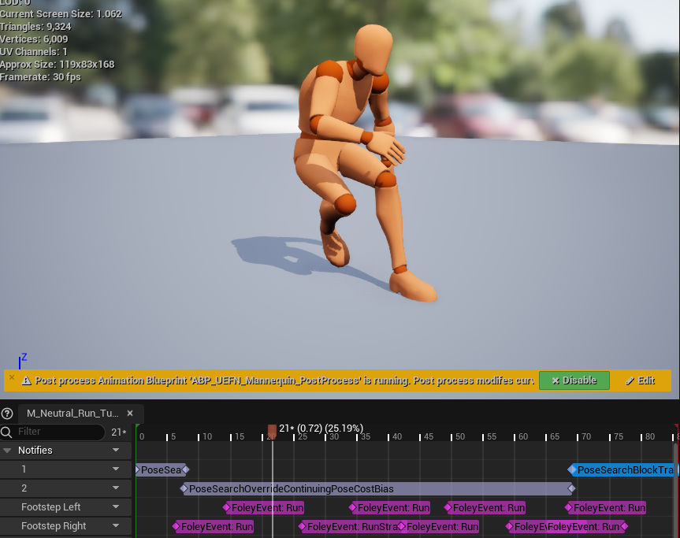

**3.7 跨越障碍**

跨越障碍会根据现在的移动状态选择不同的跨越障碍动画，行走、小跑或者快跑都会播放不同的蒙太奇动画。蒙太奇也和普通的动画一样，也是可以构建动画匹配的数据库的。图中有一个给Gameplay蓝图用的Motion Matching节点，除动画蓝图外的其他蓝图也可以使用Motion Matching选择动画。

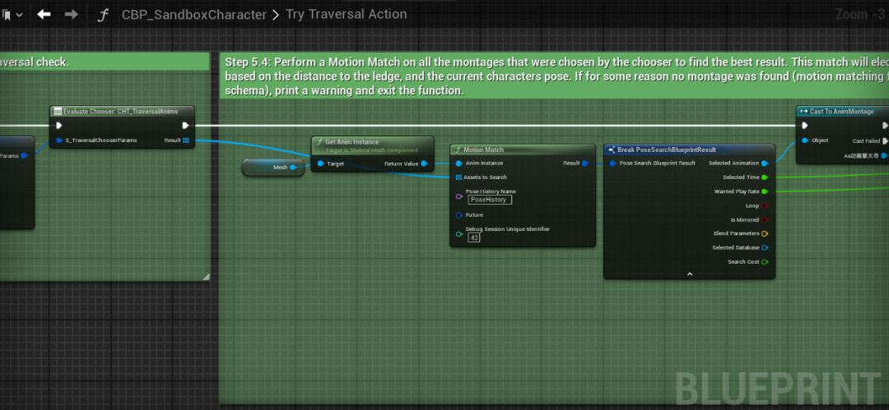

上图Chooser中就是根据自己的项目情况做跨越障碍的检测了。在这个示例工程中是一种基于样条线的边缘检测，感兴趣的小伙伴可以自行在这个函数中对这种检测方式一探究竟。

我们打开这个跨越障碍数据库中的一个蒙太奇资产，我们又会发现一些新的Notify State：Pose Search Motion Matched Branch In。这个State将会标记这段动画为：其他动画可以在这段动画中做混入。然后我们就可以使用Motion Warping调整翻越障碍时所需要的根运动，所以这个工程是不止使用了Motion Matching的，还有一些UE5动画工作流生态中的其他东西。

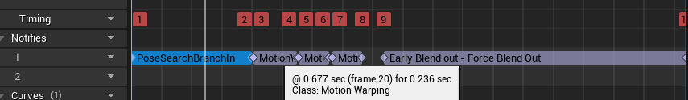

在做翻越动画时，肯定需要碰到一个东西的边缘点，而这个边缘点也是可以喂到Pose Search Schema（姿势搜索模式）中的。我们可以通过接口将信息传到自定义的Heading Channel和Position Channel中，让Pose Search干剩下的工作即可。

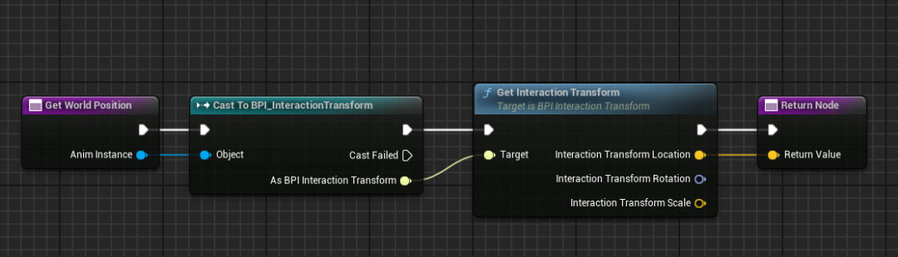

**3.8 混合堆栈**

混合堆栈实际上很像一个状态机，但混合堆栈更像，一个状态混合到下一个状态，再混合到下一个状态，前面已经混合完成的动画就会被自动去除，一层一层推进。我们十分推荐您在自己的项目中试试混合堆栈，可以通过Blend Stack和Chooser Player两个节点构建一个简单的混合堆栈。

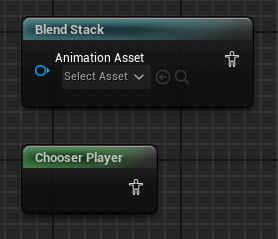

假如我们双击Motion Matching节点，也会发现它也是一个混合堆栈。我们可以在里面执行一些动画处理操作，比如根据当前动画获取曲线值，决定是否启用Orientation Warping。

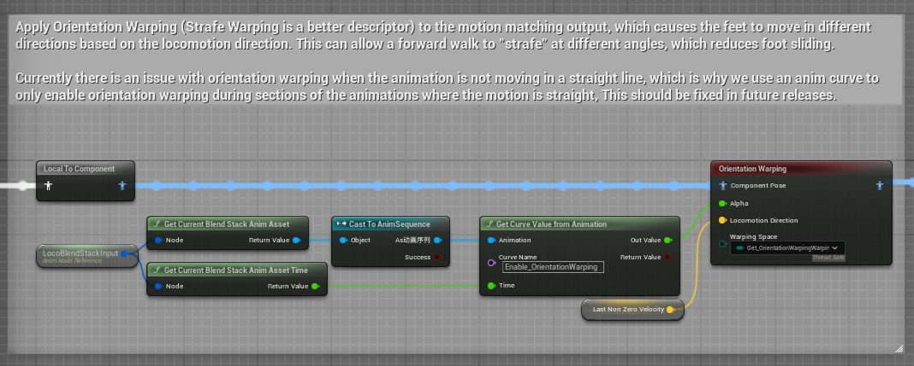

我们还可以调整角色的朝向，我们将会通过提供的朝向值（这个朝向值来自于运动轨迹预测）修改Root Motion中的旋转朝向。Steering有插值，所以可以做缓慢的旋转动作。这个节点适合用在一些运动转向与原地转身的情况，不过这个节点还是实验性的，可能会导致一些意想不到的问题。

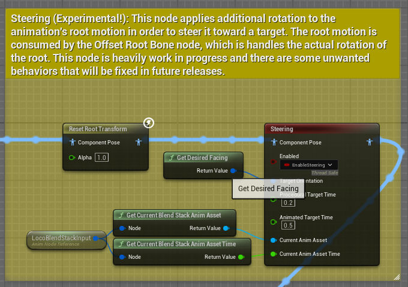

关于Root Bone偏移，有一个实验性节点叫Offset Root Bone。这个节点可以对角色的根骨骼进行一定的偏移，以适应落脚点，但是不会影响胶囊体，这就意味着角色在某些情况会穿模到墙壁中。

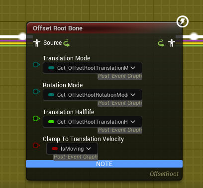

**3.9 运行时重定向**

运行时重定向已经出了有一段时间了，这个功能还没有完善，所以我们在使用自己的角色尝试这个功能时可能会出现问题。关于如何在这个示例工程使用自己的角色，我们只需要仿照工程内的其他重定向角色的IK重定向资产以及角色蓝图制作自己的资产即可。

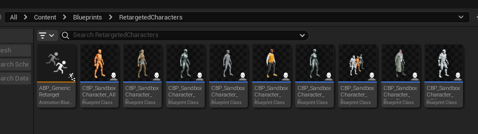

**四、未来的一些计划**

1.**混合Root Motion**。我们可以混合Root Motion和非Root Motion，比如有一些Root Motion我们是希望驱动角色胶囊体的，而有一些则不希望是驱动胶囊体的，只在网格体中偏移。这个功能会在未来更新与完善。

2.**动画缝合**。我们未来可以为Motion Matching提供更复杂的游戏信息去进行动画选择，比如我希望在0.5秒之后，一个挥拳动画的拳头能到敌人的脸上。

3.**多角色的Motion Matching**。我们希望角色之间有互动，比如格斗游戏中的投技，合作游戏中拖着其他玩家等，都需要考虑多角色之间的关系与其中的游戏信息。

4.**轨迹生成工具**。我们希望能够用一种简单的方式帮助用户分析轨迹，包括在Rewind Debugger中记录根运动和实时调整参数查看运动情况，而不需要重新运行PIE。

5.**更好的工具去进行源数据匹配**。我们希望制作一套新的工具去帮助我们编辑动画，以方便开发者能更效率地将动画修改到我们在运动匹配中所需的样子。

6.**提高可用性体验**。我们将会永远专注于对于动画工具集的更新，我们会倾听来自社区的不同意见改进我们的各种内容与工具。

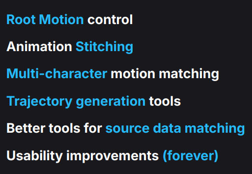

**结语**

Epic Games开发团队专注于提供高质量的游戏内容与工程案例，这次的游戏动画案例工程也不例外。希望5.4推出的Motion Matching工具与文章分享的相关知识能够帮助到您制作出高质量的动画与游戏。最后还是再次推荐您前往Epic Launcher下载这个游戏动画案例工程进行体验、学习、研究与实践。祝创作愉快，工作顺利。