原创 虚幻引擎 虚幻引擎 _2024年11月05日 14:35_ _上海_

**前言**

与虚幻4相比，虚幻5增加了许多动画工具，这些动画工具大大加快了我们制作高质量动画的工作效率。Control Rig帮助我们制作程序动画、Deformer帮助我们制作物体形变动画等等。在这次的分享中将带领大家探索虚幻5.4中这些下一代动画工具的用法以及示例。

本文出自[Exploring the Next-Generation Animation Tools in UE 5.4 | Unreal Fest 2024 - YouTube](https://www.youtube.com/watch?v=WZqeVU09h_A)，讲者是Chase Cooper。

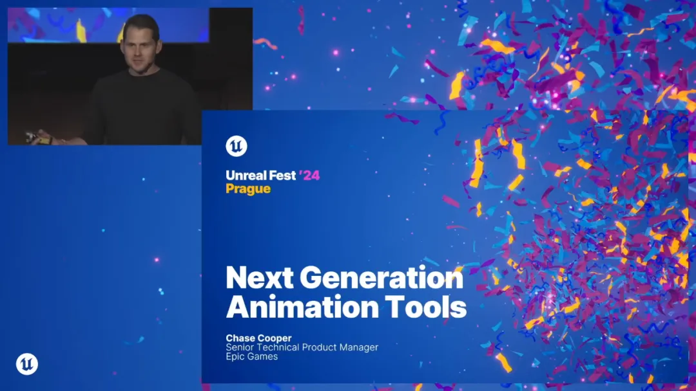

**正文**

**一、混剪演示**

虚幻引擎做的动画怎么样？看看下面这个动画混剪：[Unreal Engine Animation Sizzle Reel 2023](https://www.youtube.com/watch?v=KPq7a8INxyI)。

怎么说，看上去很酷吧！这些来自第三方工作室以及部分第一方作品中的动画片段都运用到了虚幻引擎动画生态系统中的各种工具，第一方作品中比如堡垒之夜、MetaHuman以及最近的堡垒之夜乐高模式。其中堡垒之夜乐高模式是一个动画工具发展的里程碑，许多动画工具因这个模式而诞生。在Epic中大约有15名动画师制作游戏与影视动画，而在今年会涨到超过85人，以确保制作并运用超过800+个表情与动画。

**二、动画理念**

平时接触动画比较多的小伙伴估计都知道，之前想在虚幻引擎中制作动画需要在DCC与引擎之间来回切换。改个骨骼、调整权重、调整UV等等工作都需要在DCC内完成，然后再通过Pipeline传回引擎，好麻烦！所以我们希望给动画创作者们一个更灵活方便的工具集，让他们能够按照自己喜欢的工作流程制作动画，使工作更方便快捷。

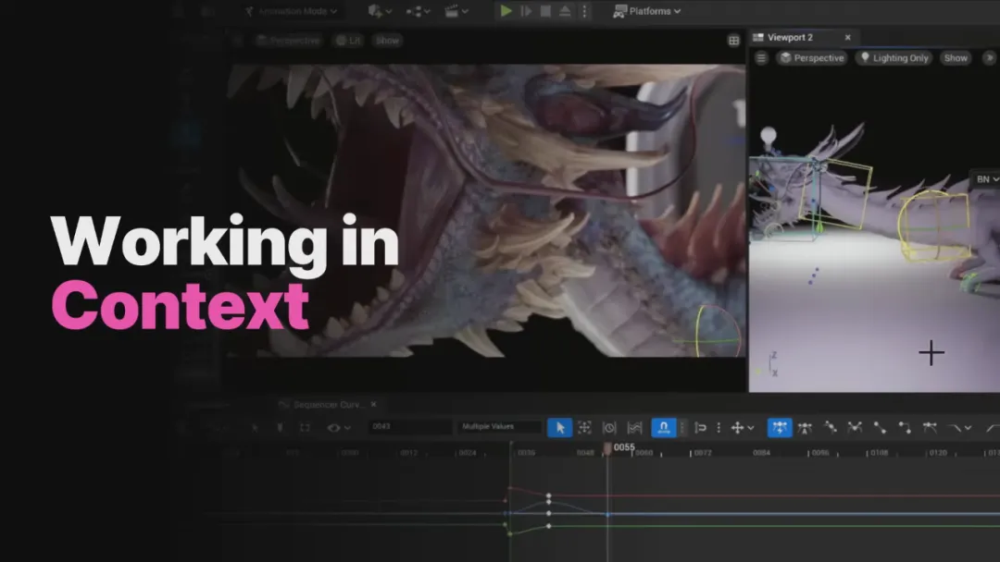

我们坚持以人为本，开发一些对模型艺术家更加友好的功能，让引擎内编辑更加方便。例如骨骼网格体编辑插件等。

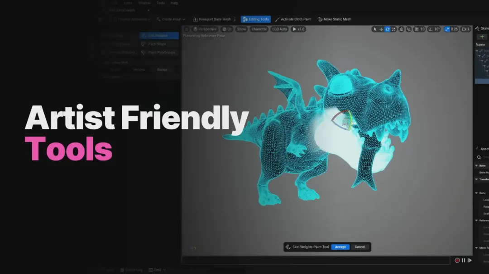

我们也都知道，制作流程需要不断加速，所以我们尽可能让动画创作更快捷简单。比如我们正在开发的模块化Control Rig。

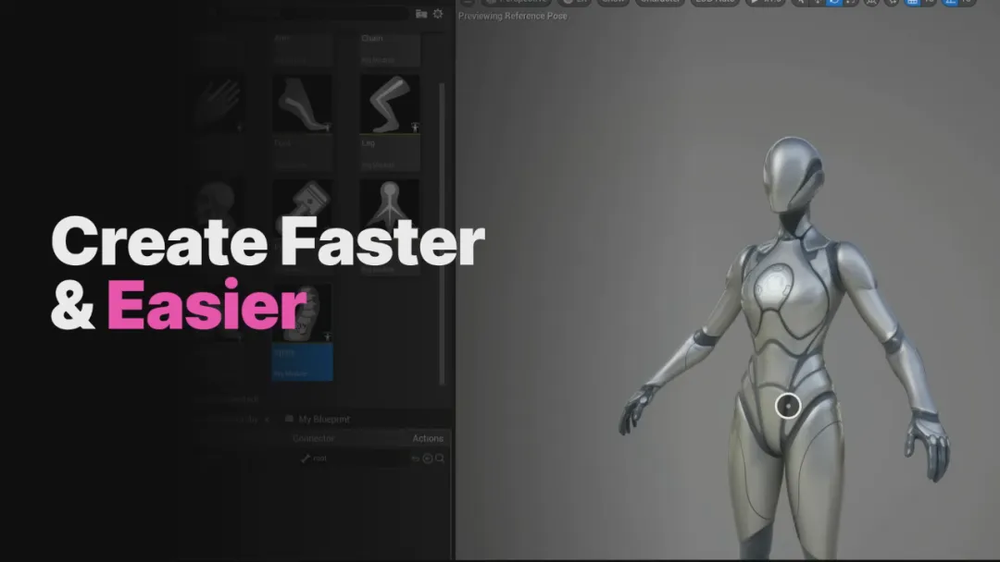

这三点理念下来，我们现在开发出来的工具产生了一个闭环。用Sequencer K动画；Control Rig可以制作强大的程序动画，并结合重定向在各种骨架中重复利用动画，满足绑定与动画的需求；用Deformer做顶点变形，用Skeletal Editor做骨骼网格体的修改，包括创建骨骼、刷权重等功能，满足网格体变形表现的需求。

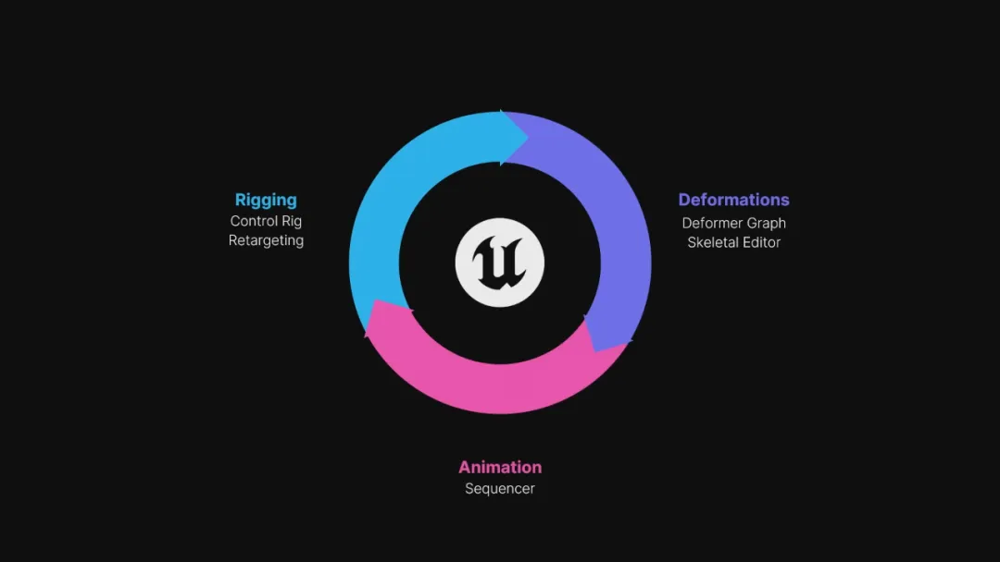

在虚幻5.4中，动画工具有很大的更新，但我们要制作的动画工具还远不止这些。

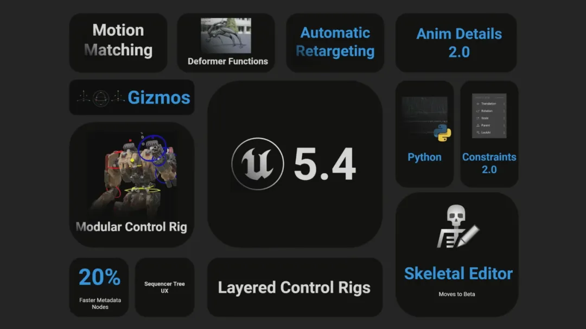

刚才也提到，在引擎与DCC之间来回切换调整内容的过程是很痛苦的，所以我们要尽可能减少这个过程中的往返，并减少这个过程中的数据丢失。

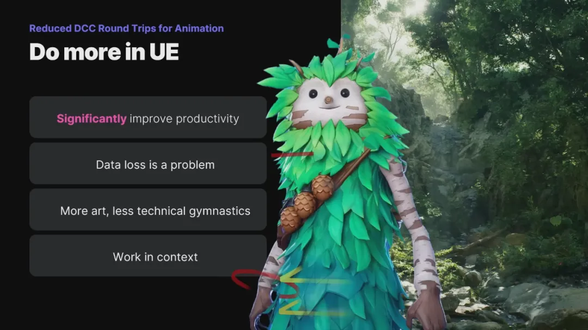

**三、Sequencer与动画模式**

**3.1 Sequencer**

Sequencer是虚幻引擎中用于K动画的工具之一，我们可以将Control Rig放入Sequencer中直接制作动画。我们可以直接拉着控制点就位，在时间轴上加关键帧，调整曲线等等。这些工作和DCC很像，但都能在引擎内完成，并且直接看到结果，有渲染有画面，一切都可视！并且Sequencer在5.4更新后有了更多自定义的选项，帮助动画师能够按照自己更熟悉的界面去K动画，包括隐藏一些图标，调整界面布局等。

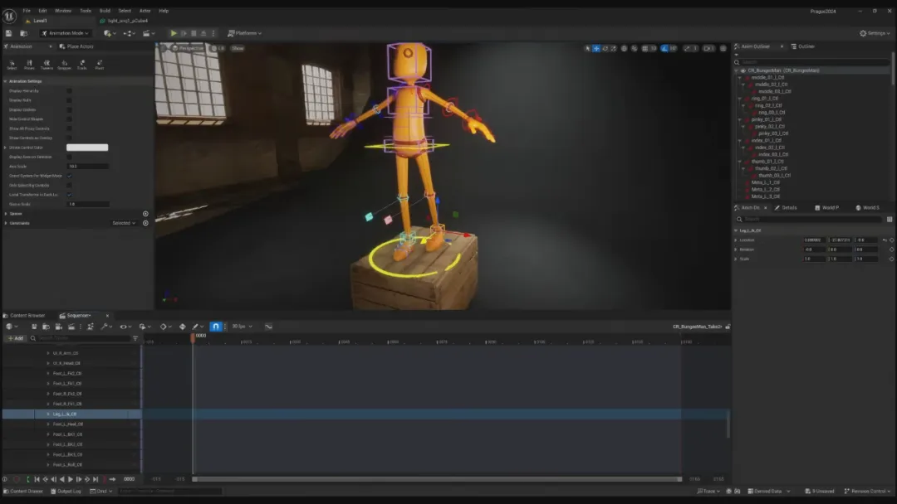

并且我们还可以给这套Control Rig读取动画，并且在动画的基础上修改出自己想要的动画。

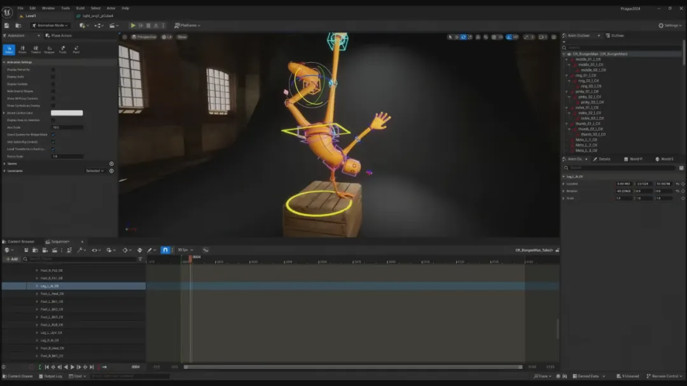

**3.2 新款Gizmo**

并且为了方便动画师K帧更方便更有熟悉感，我们做了一个新Gizmo插件，可以在编辑器偏好中打开New Gizmo选项就能使用这款Gizmo调整变换。大部分动画师应该不能没有这款Gizmo，因为我们可以在选中之后，按住鼠标中键就能在屏幕内任何一个地方移动来调整物体的变换。

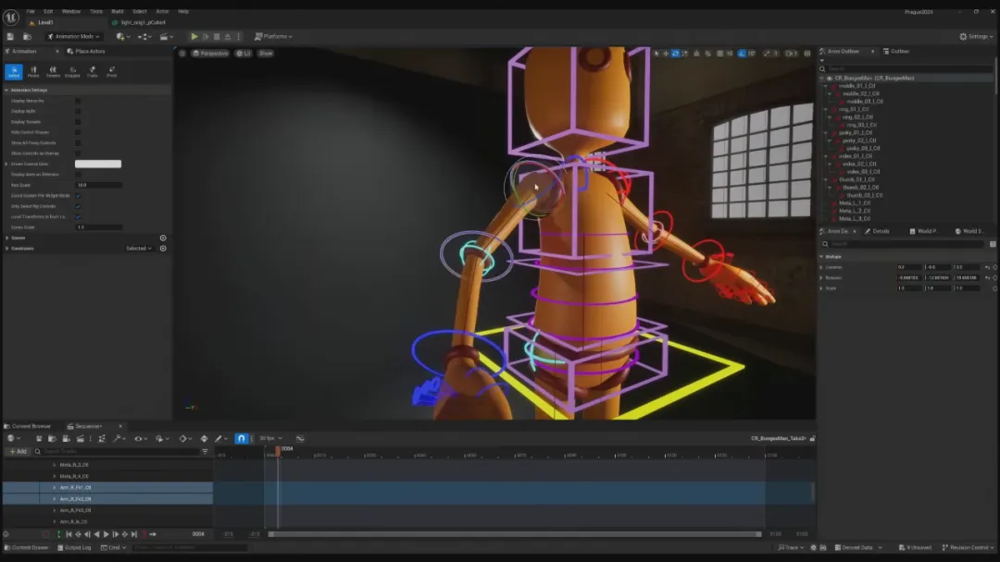

**3.3 轴曲线独立**

调整骨骼，加关键帧，调整骨骼，再加关键帧，很多动画师都熟悉K帧的流程。但现在我要介绍一个看起来很方便的功能，在Sequencer中我们可以单独选定某个轴然后在动画曲线编辑器中调整它的曲线。这样我们就不用在曲线中找半天我们希望调整的轴曲线了。

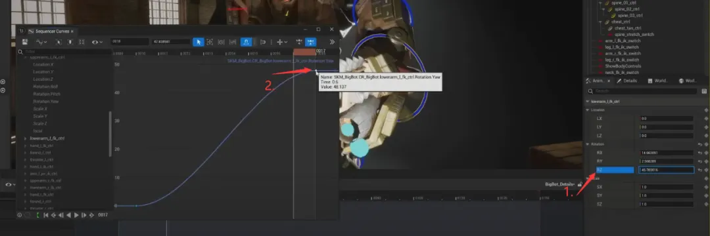

**3.4 约束2.0**

早在虚幻5.1中我们就在动画模式加入了约束功能，帮助我们K帧时将骨骼或者物体约束于另一个骨骼或者物体上。但在虚幻5.4中，这个约束功能迎来了一次大升级，现在我们可以选择约束的方式。

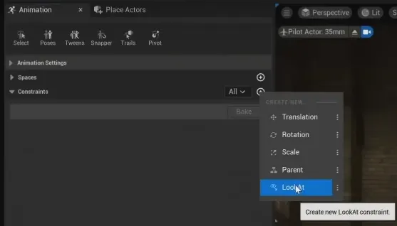

然后给小恐龙添加一个Look At的约束动画。并且这个约束可以在Sequencer中K“是否启用约束”关键帧或者“Look At物体选择”关键帧等等。除了这些以外，我们的约束功能现在能通过关卡序列带到别的关卡中，之前的约束是受关卡限制的，并且没有一个约束管理器去管理各种约束。

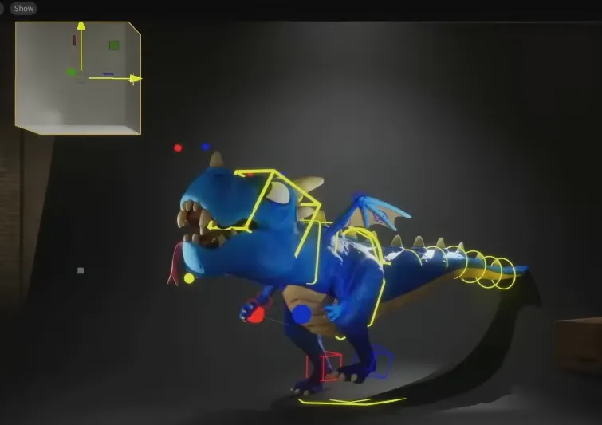

**3.5 其他动画工具**

现在我们有Pose Library（姿势库）、Tween Tool（补间工具）、Snapper Tool（对齐工具）、Motion Trail（运动轨迹）、Pivot（临时中心点）、空间切换、Animation Layer（动画层）等等，并且我们会在虚幻5.5中发布更多的动画工具。

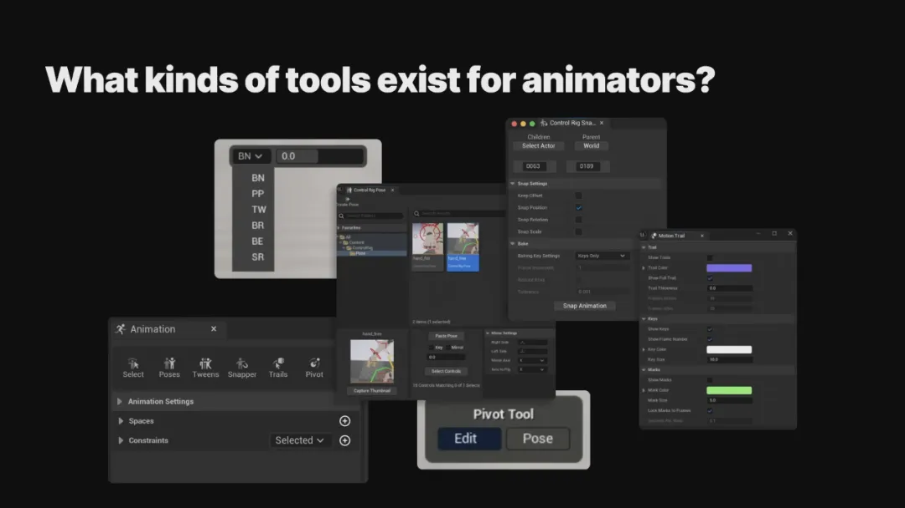

**3.6 偏好选项与热键**

在这个网站中，我们可以了解到更多动画相关的偏好设置以及热键，帮助小伙伴们将编辑器调整成自己更熟悉的样子。

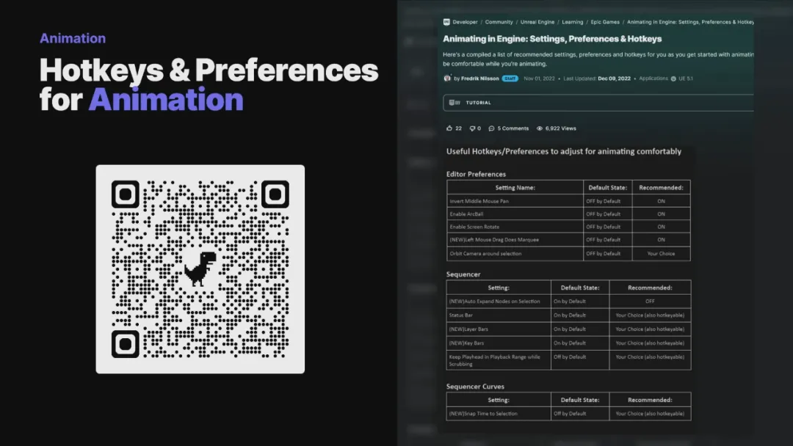

**四、用Control Rig做绑定**

俗话说“好Rig配好动画”，只有Rig够强大，才能K出更好看的动画。在虚幻引擎中我们使用Control Rig做绑定，Control Rig是基于节点的绑定系统，它是一个独立的轻量VM，用来跑动画的运算。只要把节点连在一起就能自动计算各种骨骼变换。

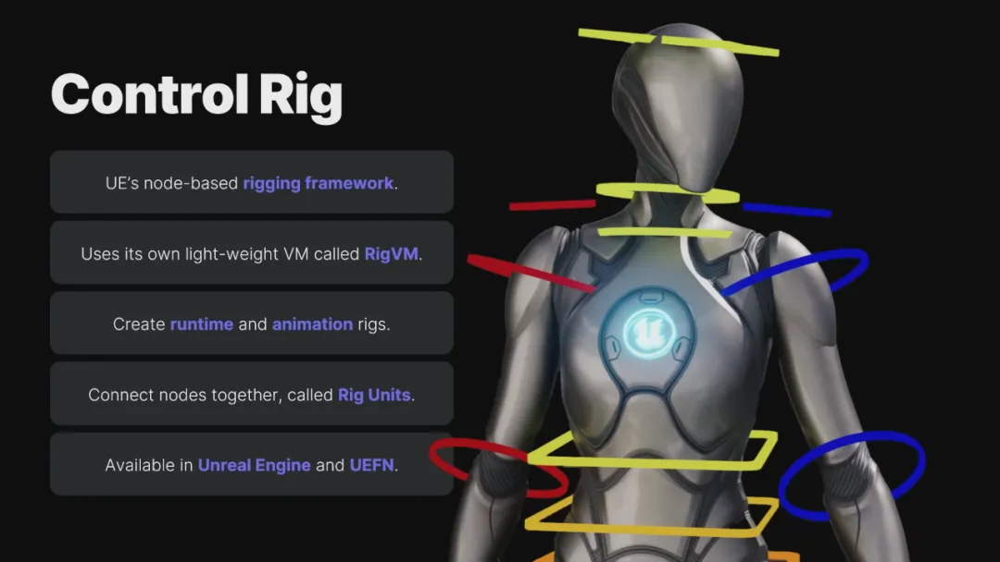

**4.1 动态结构层级**

Control Rig真的非常强大，假设我们现在想绑定一个魔方，我们肯定是希望在引擎中K魔方能和现实生活中一样简单。所以我们做了个这样的Control Rig，它能在我们用户调整完旋转之后（或者之前），重新分配这些小方块的父项，让下次旋转时一个面的小方块都能跟着那个面的父项旋转。这种就是动态的结构层级，没有固定结构层级的烦恼。

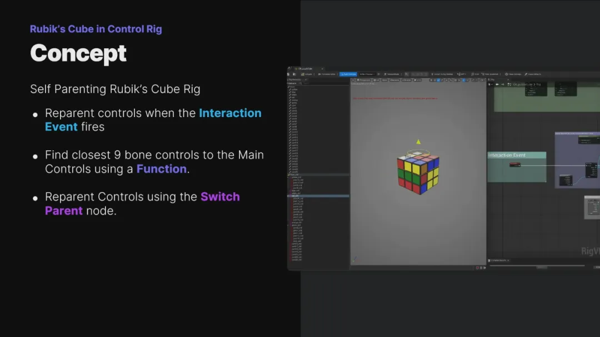

接下来看看这个魔方是怎么绑定的，好像没什么好说的，就是一个根骨骼加各种小方块的骨骼。

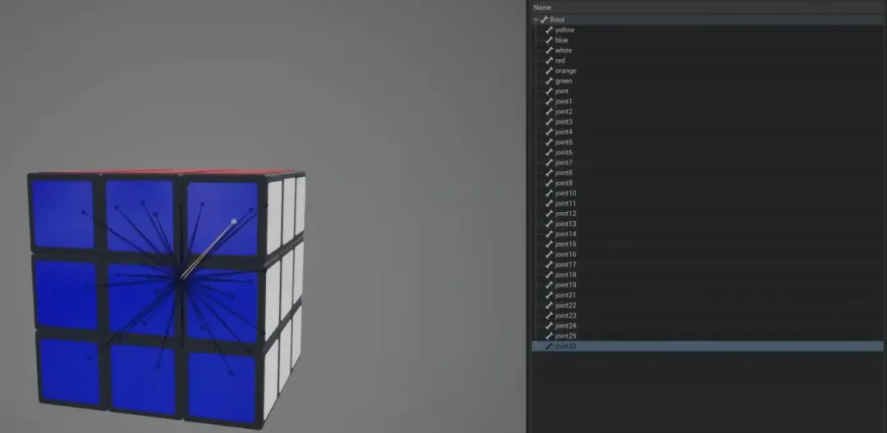

再来看看Control Rig，这里我们使用了Interaction Event去处理我们的动态结构层级，并且我们使用了一个叫做Find Closest Control的函数，这个稍后会解释。

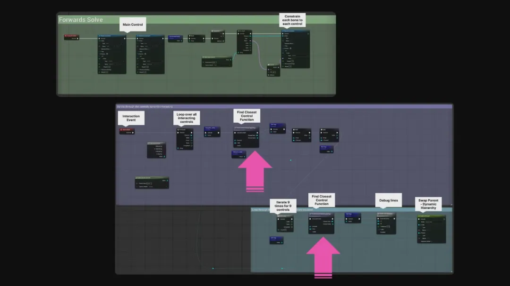

这个Find Closest Control函数的基本逻辑就是找一个离控制点最近的九个小方块骨骼，然后将他们约束在控制点上，实现动态结构层级。利用这个Interaction Event，我们其实可以做很多很强大的动画效果。

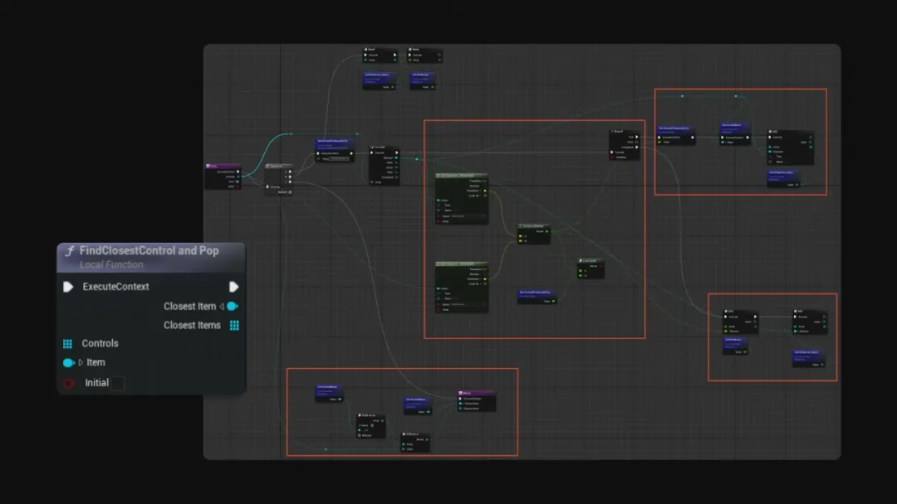

Debug不能少。这个例子中就是简单的画线连到要控制的骨骼上。

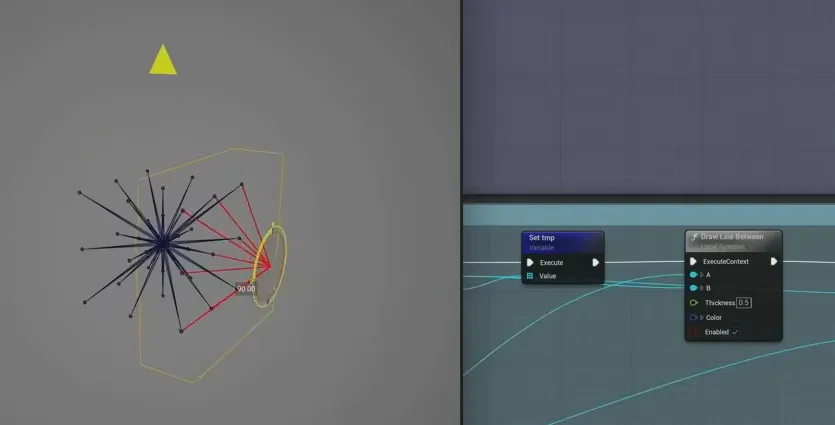

我们还可以将控制器变成我们想要的形状。这个魔方例子中，我们用了一个不可见的方块来当我们的控制器形状。在堡垒之夜乐高模式中，动画团队用了很多这样的自定义控制器形状来确保K动画时不会被其他要素分心。

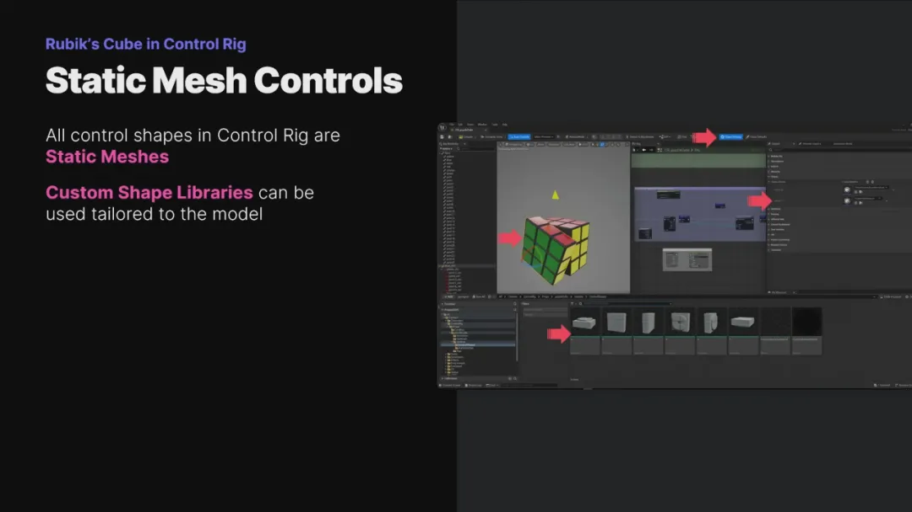

**4.2 弹簧动画**

Control Rig中的Spring Interpolate节点可以帮助我们制作像弹簧一样的条状物体形变，就像UEFN示例项目中的那条龙一样。我们只需要移动一个控制器，整个身体的控制器就能跟着并且像一根绳子一样移动。这个二维码可以进入一个网站，用来教您如何自己实现这个效果。并且这条龙能够在Control Rig Sample Pack中找到，感兴趣的小伙伴们可以自行查看与研究，传送门：https://www.unrealengine.com/marketplace/en-US/product/control-rig-samples-pack。

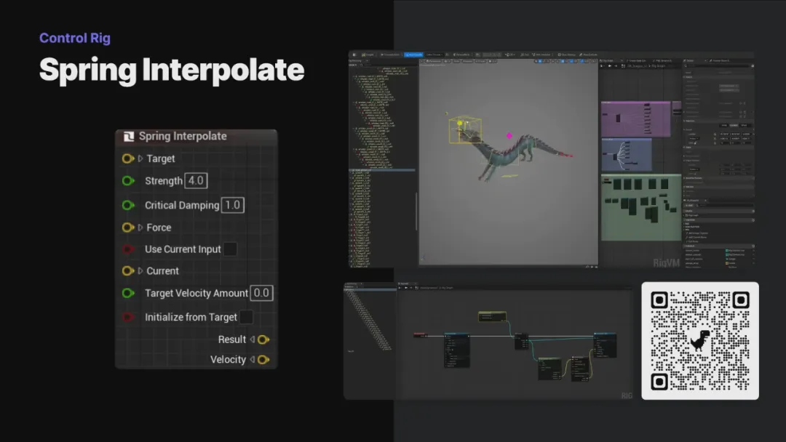

下面这个游戏中状态的龙其实并没有动画，所有都是Control Rig驱动的。

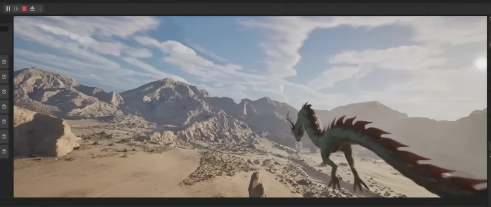

**4.3 模块化Control Rig**

模块化Control Rig在虚幻5.4是实验性的动画功能，在5.5中将进入Beta阶段。这个功能可以让不熟悉Control Rig构建的用户体验到Rig的乐趣，通过让Control Rig构建者根据颗粒度的不同制作不同的Control Rig模块，然后让K动画的人自己决定角色的绑定。通过填入Socket决定这个模块Control Rig中所需要的输入骨骼，然后通过模块Control Rig中暴露的参数进行调整，确保每一个骨架都能正常工作。

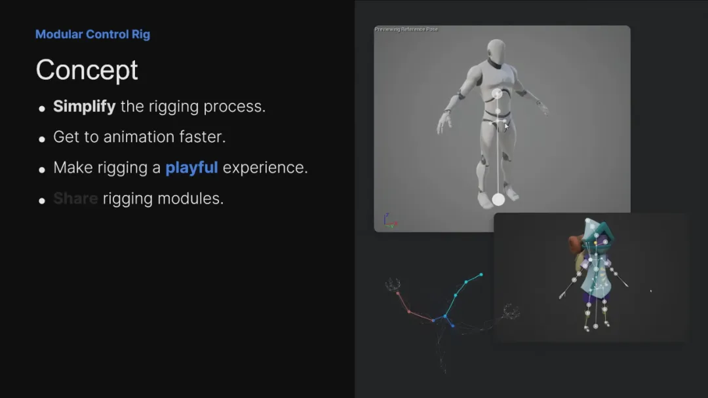

接下来是小演示，笔者强烈建议观看原视频中的这一部分（19:00~23:30），可以帮助我们更直观地了解如何装配模块化Control Rig。这段演示中，我们可以通过拖入不同类型的模块Control Rig到对应的Socket中，设置各自所需的骨骼与参数，当这些模块Control Rig都齐了，就能像普通的Control Rig一样K动画了。这样的话，Rig一个角色便充满了乐趣，我们只需要将模块Control Rig拖到对应的地方就能搞定Rig工作。

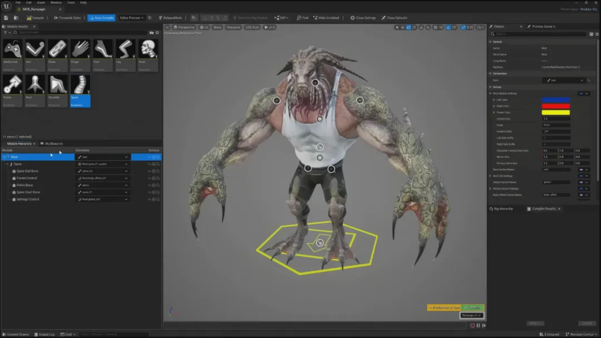

我们绑定好一个骨架之后，如果另一个骨架有相似的结构层级，只需要在右下角切换对应的骨骼网格体，这些模块Control Rig就会自动适应现在的骨架，非常的方便！

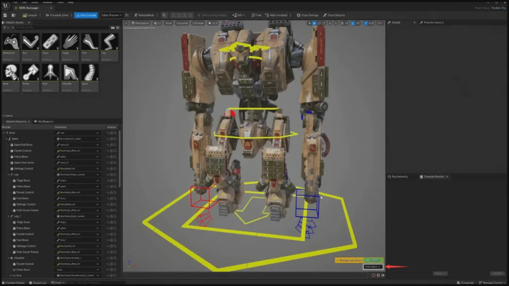

甚至刚刚提到的魔方也能做成模块Control Rig。三阶、四阶等等，不管多少阶，都能用这个模块Control Rig直接搞定。

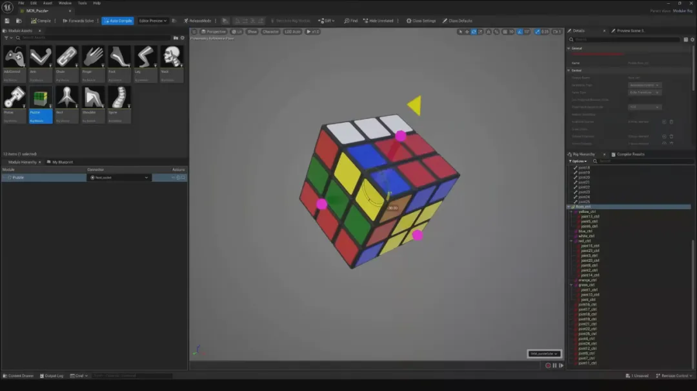

**五、快速重定向**

右键动画序列，打开重定向窗口，我们可以选择目标网格体，并且我们可以预览动画的效果。然后我们选择要导出的动画，点击导出即可，非常简单，点几个按钮就能完成重定向。但我们也可以再制作IK Retarget资产完成IK相关的设置。

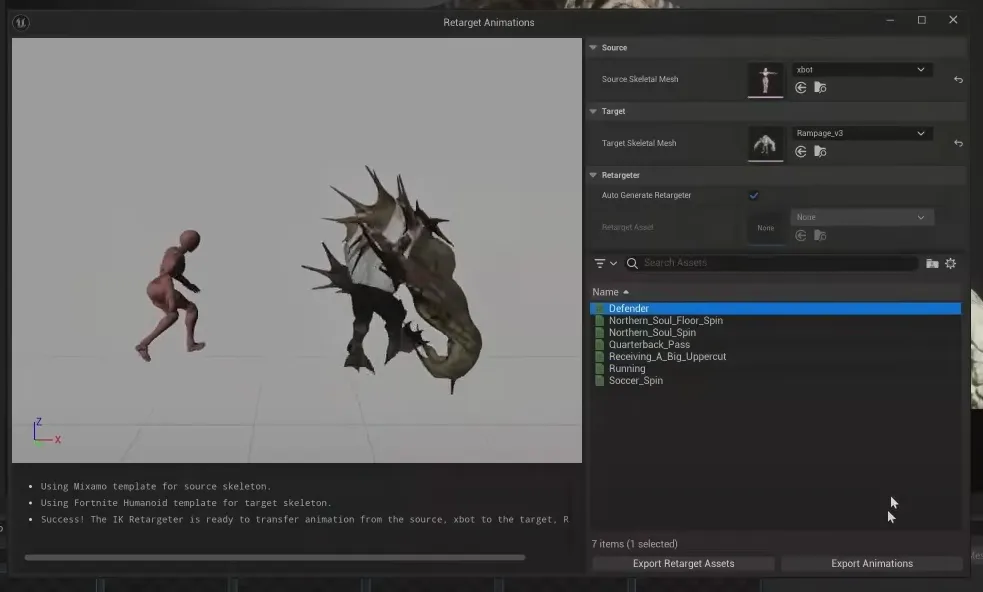

**六、分层Control Rig**

在我们完成重定向之后，我们能够在Sequencer中使用这些动画。但是角色们的身材可能会不同，导致动画看起来很奇怪，这时候我们需要分层Control Rig调整动画。首先我们需要向这些网格体加入Control Rig。

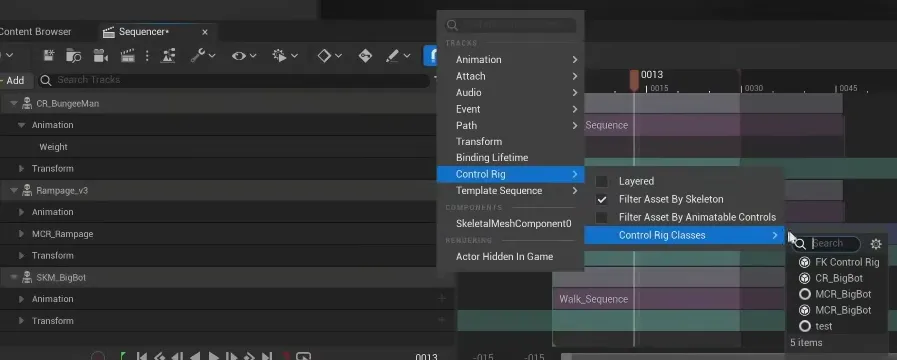

然后在Control Rig中启用Convert To Layered。

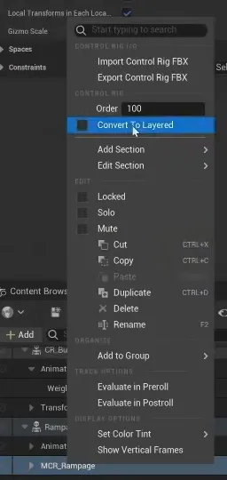

然后角色的Control Rig就会跟着动画动，这时候我们只要根据场景调整Control Rig的控制器即可让我们的动画按照现在Control Rig变换。这些控制器跟着骨骼动其实就是逆向求解事件的功劳，逆向求解是让骨骼驱动控制器，而正向求解自然就是让控制器控制骨骼。

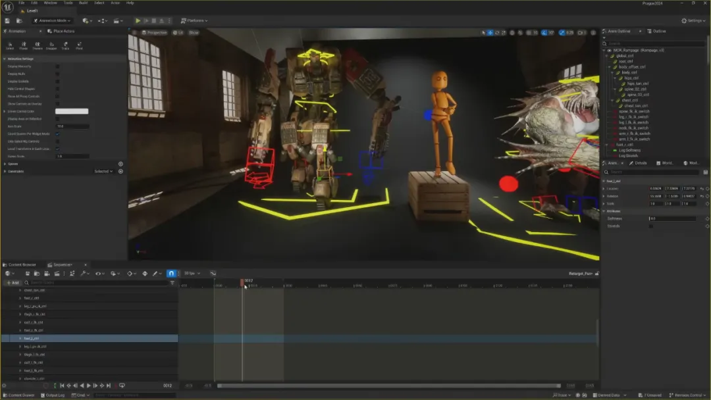

**七、Deformer**

**7.1 Control Rig与Deformer**

我们可以用Deformer Graph实现骨骼网格体的实时变形。这个轮胎例子，除了自动滚动以外，还会根据地面产生形变。

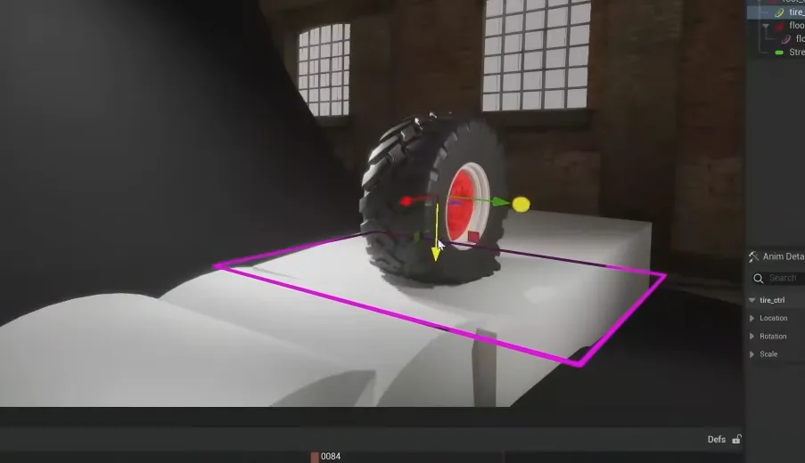

在Control Rig中，我们可以使用Sphere Trace检测地面碰撞，获得一个Deformer需要用到的平面。为了能够让Control Rig和Deformer之间能够互相发信息，我们还有一个节点叫Set Animation Attribute。

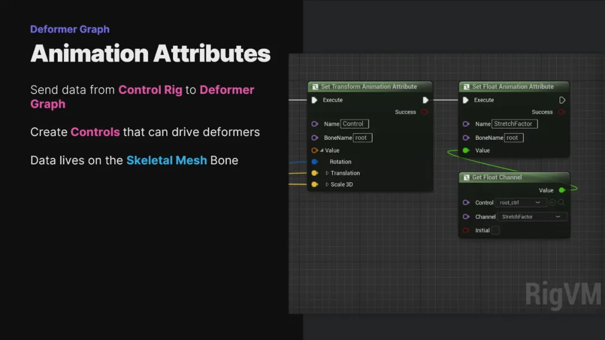

在Deformer中，我们的流程如下。粉色箭头所指的节点正是接收Control Rig数据的节点，这个节点将平面的变换信息传递到变形器中使用。利用这个传递信息的节点我们可以混合使用Control Rig和Deformer，实现一些有意思的动画效果。

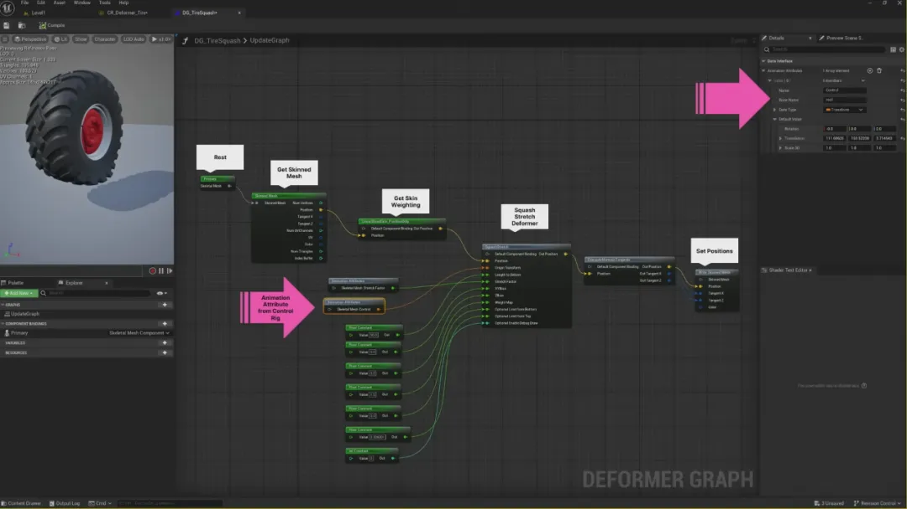

**7.2 绘制区域**

我们有时候不希望Deformer会影响整个网格体，只希望某些部分产生形变，这时候Paint Map就派上用场了。这个Paint Map会以类似于顶点遮罩的形式传递到Deformer中使用。

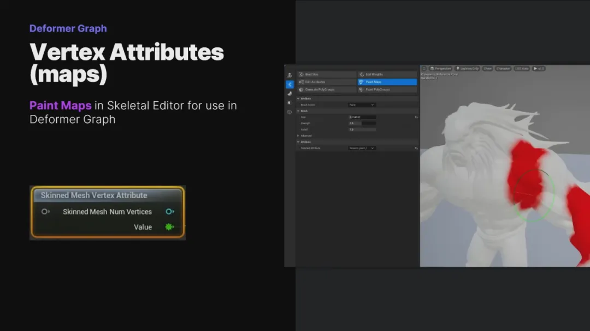

在Skeletal Editor中我们可以新建一个Weight Map，然后像刷权重一样将遮罩刷在顶点上，然后我们再在Deformer中读取这个遮罩信息，就能使用Deformer进行对应的变形。

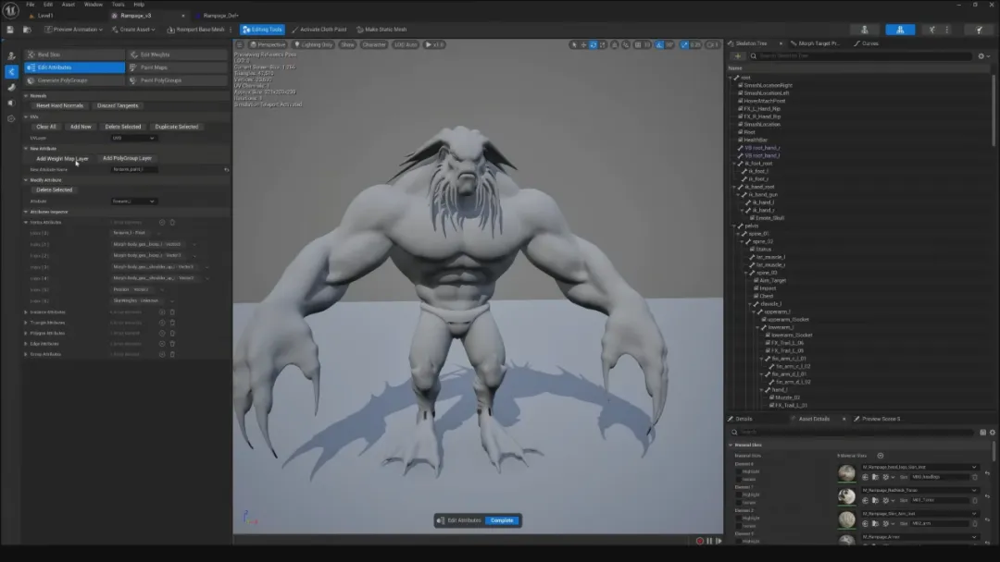

在这个例子中，我们将尝试修复手臂形变的问题，将四元数骨骼形变混合到线性骨骼形变中。

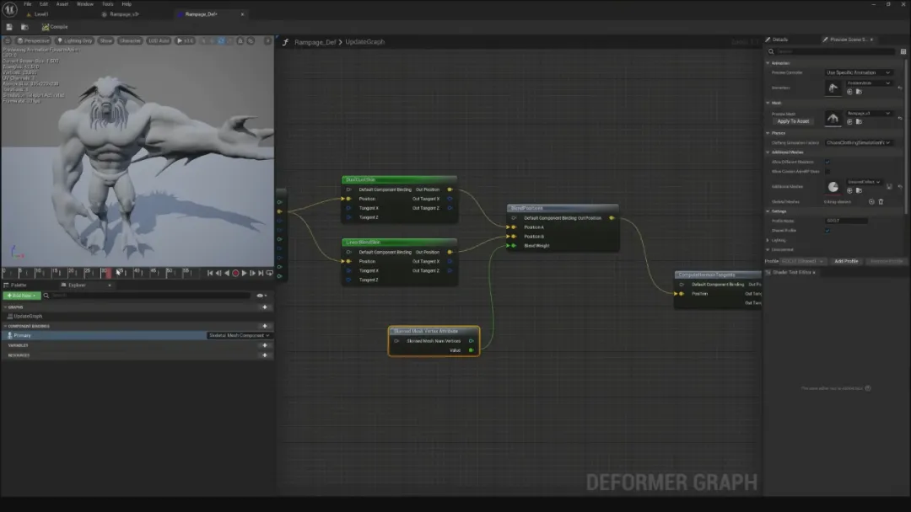

**八、骨架编辑器**

骨架编辑器在虚幻5.4中处于Beta，我们正在努力让这个编辑器变得更好用。通常在创意的最后百分之十的阶段中，创作者会十分痛苦，因为要修复一些细节上的问题。这时候在引擎与DCC之间往返又比较浪费时间，小问题就可以直接在骨架编辑器内解决即可。

我们想要用的工具虚幻里也有。除了能够直接修改骨骼和权重的优势外，我们还能直接在游戏内看到对应的变化，做到真正快捷与实时。并且我们在刷权重的工具中加了一些类似于延展与放松的功能，让权重向外延伸或者平滑，使骨骼形变更自然。

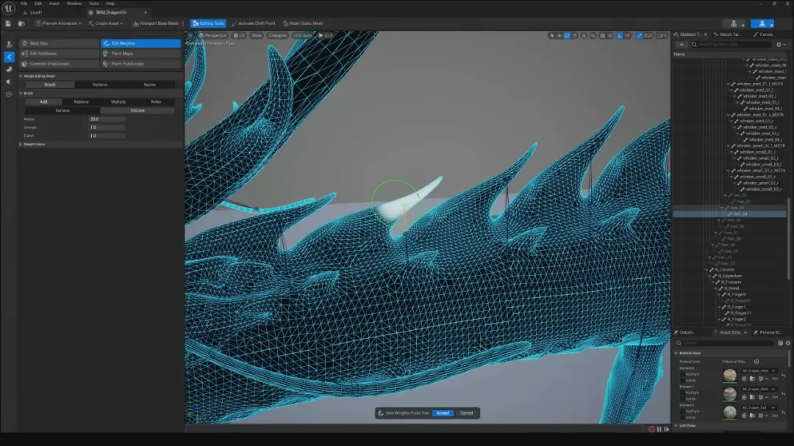

这些新建出来的头发骨骼就能在Control Rig中添加物理效果。顺带一提，虚幻5.4中的Control Rig多了很多预设置好的Control Rig函数，我们能够直接使用这些函数做一些很酷的动画效果。

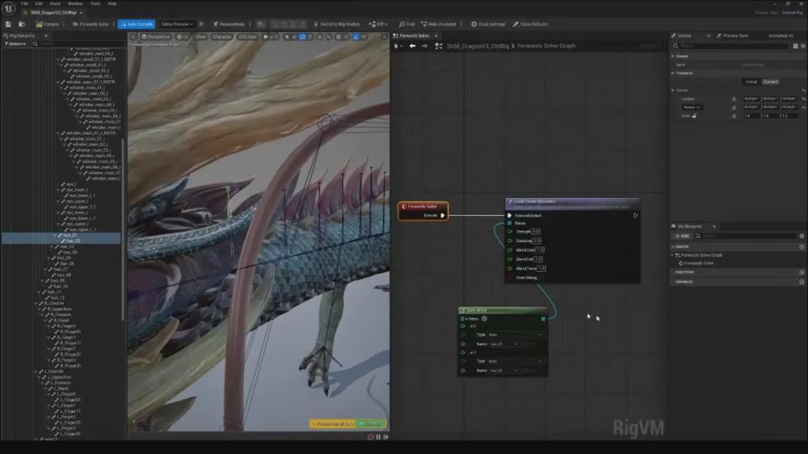

**九、路线图**

**9.1 Animation Deformers**

未来将支持把Deformer直接拉进Sequencer中使用K帧。

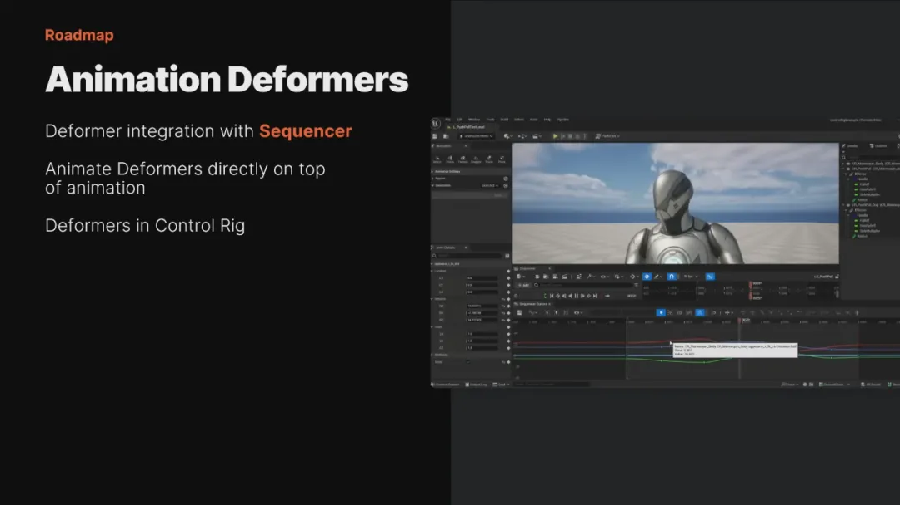

**9.2 模块Control Rig的迭代**

未来模块Control Rig将推出升级工具以及替换模块的功能。

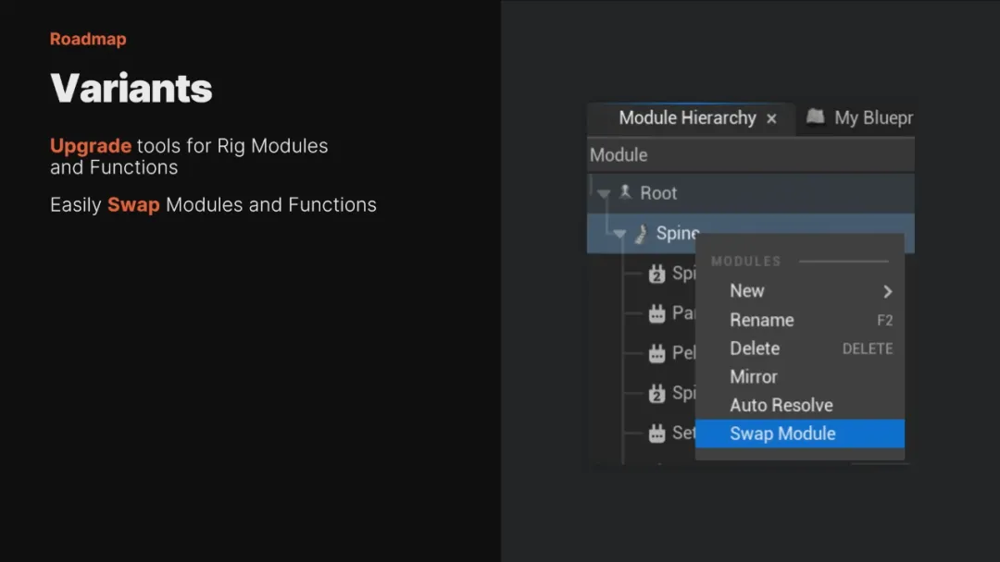

**9.3 骨架编辑器**

未来骨架编辑器将支持隐藏面来刷权重，并且推出更多更方便的功能。

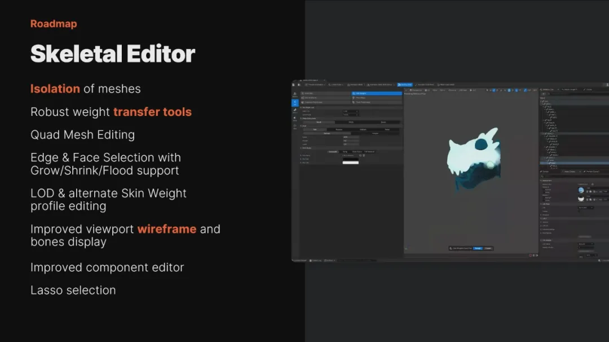

**9.4 Control Rig物理**

未来我们将为Control Rig做出更多物理上的支持，并实现程序化的角色物理动画。

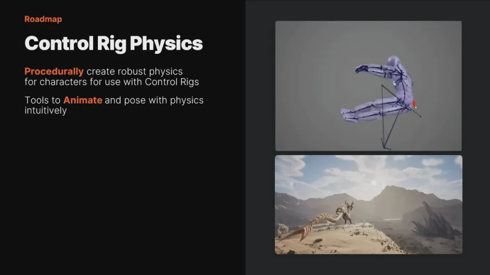

**结语**

以上便是虚幻5.4中动画生态系统中各种工具的介绍与示例，希望能够对小伙伴们的动画创作有所帮助。祝创作愉快，工作顺利！