# **前言**

在虚幻引擎旗下有一个工具叫MetaHuman Creator，我们利用这个工具可以轻松制作一个写实的人类模型，然后导入虚幻引擎使用。再配合动作捕捉与Live Link Face，我们可以很方便快捷地创作出一段使用了MetaHuman的动画。这篇文章将带领读者深入了解MetaHuman，了解更多MetaHuman的使用技巧与案例。

本文出自**https://www.youtube.com/watch?v=Vzt1enBQeUE**，由Alex Coulombe分享。

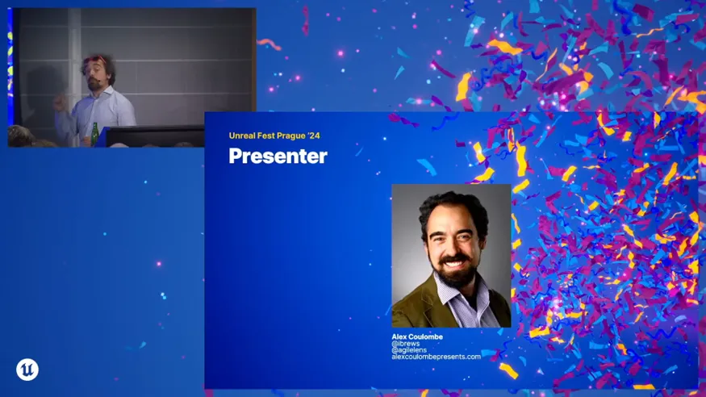

本文中分享的知识并非官方承认，但是对于Alex与其公司十分有用，希望这些知识也能对大家有所帮助。

**目录**

一、初识MetaHuman创建器

二、使用自定义模型创建MetaHuman步骤

    2.1. 创建角色模型并导出

    2.2. 创建MetaHuman Identity资产

    2.3. 打开资产，添加模型，生成追踪点

    2.4. 调整追踪点并运行解算，检查差异

    2.5. 选择身体，调整好后运行自动绑定流程

    2.6. 最后在MetaHuman创建器中进行更多调整

三、MetaHuman面部动画制作

    3.1. 建个工程，打开MetaHuman插件

    3.2. 用iPhone打开Live Link Face软件进行设置

    3.3. 将素材发送到电脑上

    3.4. 创建新的Identity文件

    3.5. 输出MetaHuman的表演文件

    3.6. 通过表演文件的后续工作

四、DNA校准库（DNA Calibration）

五、通过Quixel Bridge下载MetaHuman

六、降低纹理的大小

七、MetaHuman身体动画

八、MetaHuman优化

    8.1. LOD

    8.2. 头发的优化

    8.3. 材质的优化

    8.4. 网格体的优化

    8.5. 一些有用的控制台指令

九、一些小问题与修复方案

    9.1. Lumen光影噪点

    9.2. 恐怖的脸部变形

    9.3. 与引擎版本不匹配的MetaHuman

    9.4. 因为LOD导致的恐怖面部变形

    9.5. 身体模型有奇怪的动画表现

    9.6. 使用了不兼容骨架的动画

十、VR全身追踪

十一、附加提示

结语

## **一、初识MetaHuman创建器** 

首先我们先简单了解一下MetaHuman Creator，这很像一个“捏脸”工具，我们可以通过网页直接访问它。为了在网页上呈现MetaHuman十分写实的渲染，这里采用的是像素流送技术。

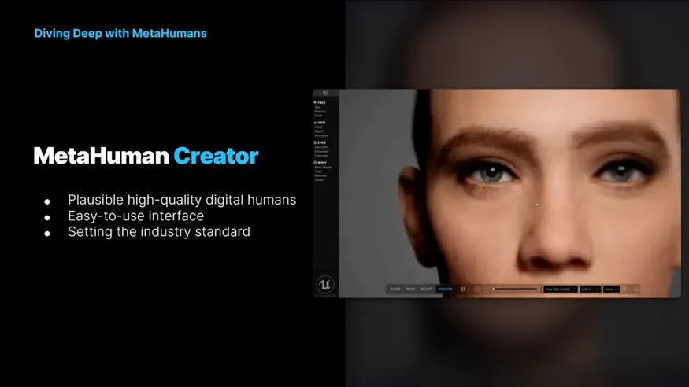

在虚幻5.4之前，这个MetaHuman Creator有个小毛病。当我们将镜头拉远的时候，我们捏的MetaHuman就会变成秃。现在的Creator修复了这个问题，并且我们还可以随时切换面片头发和Groom头发，这样我们就能保证在任何平台上，我们的角色都能有差不多的外观。

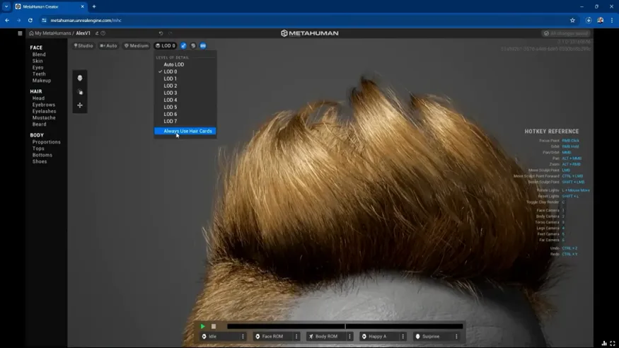

我们可以将任何一个3D人脸模型转换为MetaHuman，甚至是没有绑定的人脸模型。这样的话，我们就可以直接获得一个绑定好了的，带各种Morph的MetaHuman了。并且MetaHuman都是使用的同一套骨架，并且与前几年版本相同，这样我们就不用在动画上有多少重定向与迭代的工作了。

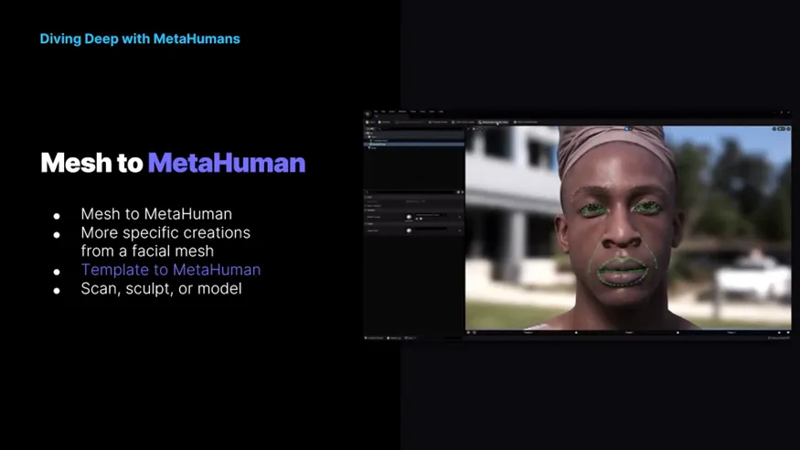

我们实际上可以为MetaHuman弄很多奇形怪状的脸型，包括眼睛之类的，但是这些调整都是有限的，如何想要更风格化或者更动漫一些的脸型，MetaHuman还是有一定的局限性的。如果想更细致调整MetaHuman的Mesh，后面会讲到一个叫做DNA Calibration的开源项目。

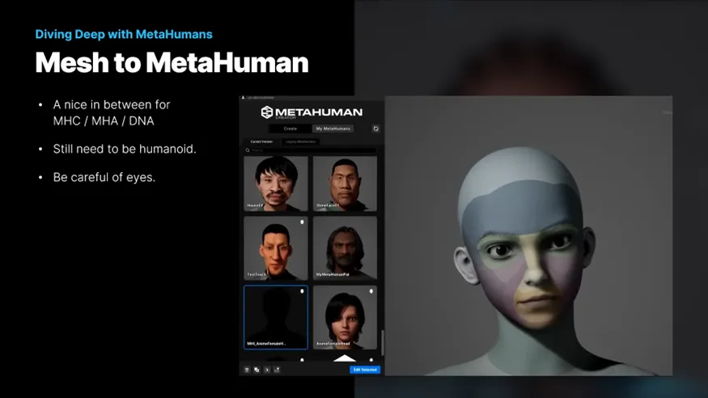

当我们上传自己的自定义模型到MetaHuman创建器中，我们其实可以调整MetaHuman某个部位与自定义模型的吻合程度，保证创建出来的脸型是符合需求并且自然的。

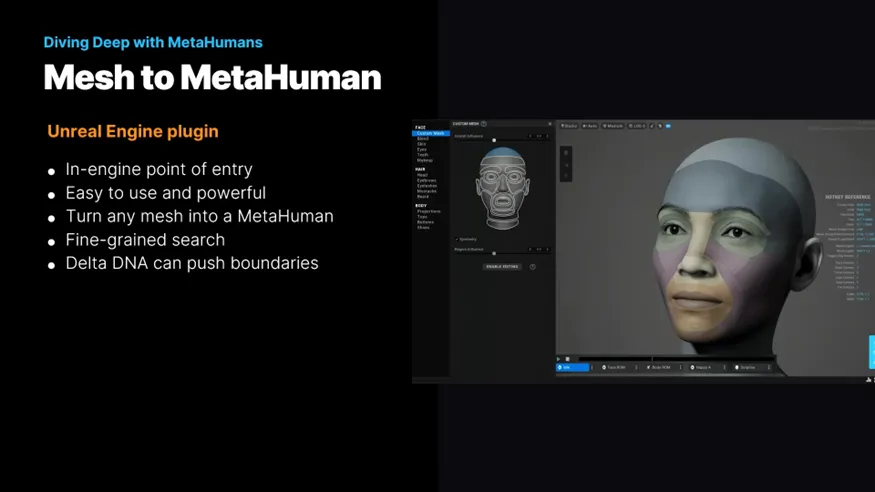

## **二、使用自定义模型创建MetaHuman步骤**  

### **2.1. 创建角色模型并导出** 

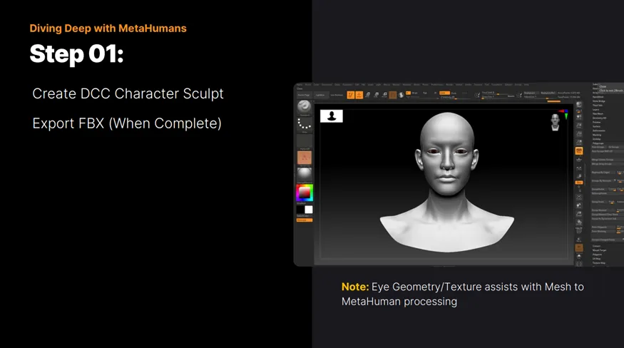

### 

### **2.2. 创建MetaHuman Identity资产** 

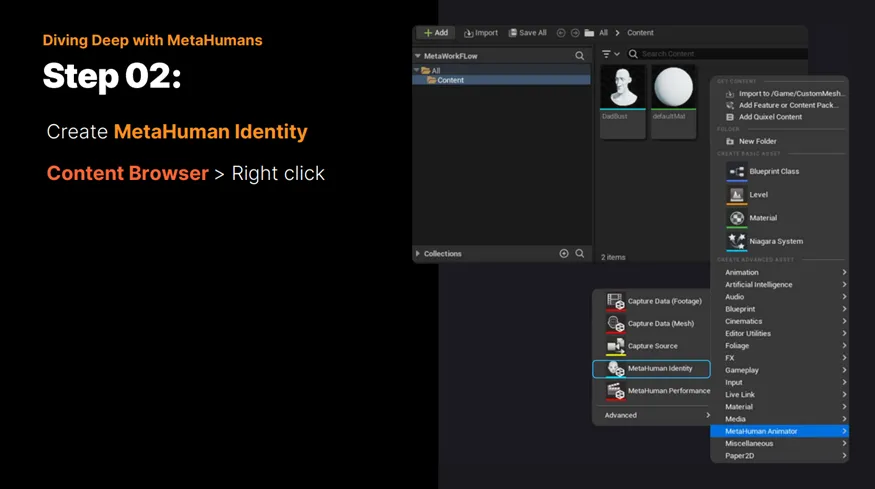

### 

### **2.3. 打开资产，添加模型，生成追踪点** 

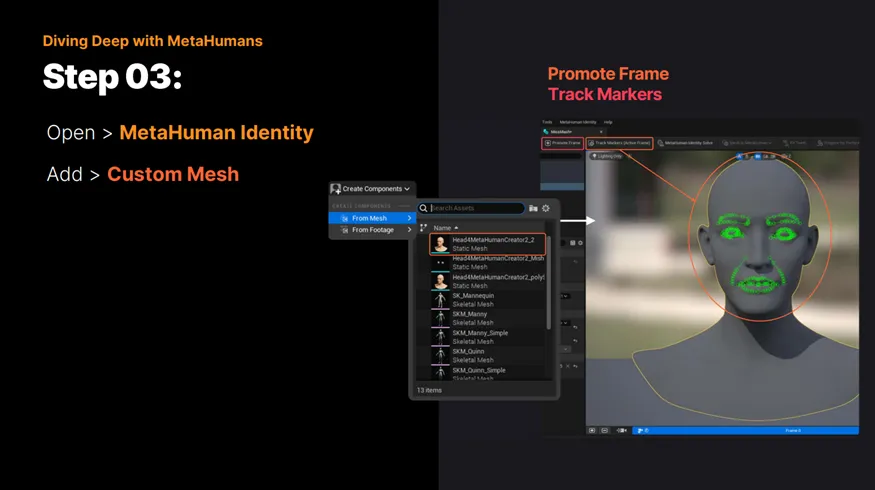

### 

### **2.4. 调整追踪点并运行解算，检查差异** 

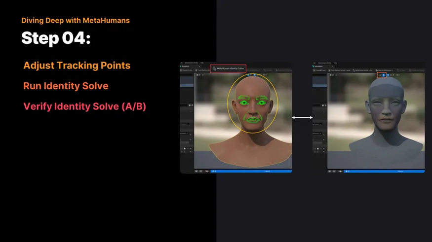

### 

### **2.5. 选择身体，调整好后运行自动绑定流程** 

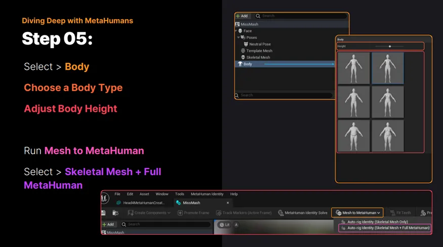

### 

### **2.6. 最后在MetaHuman创建器中进行更多调整** 

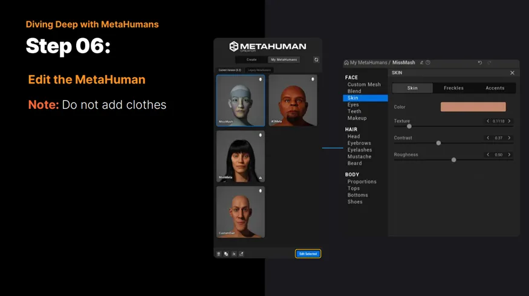

## **三、MetaHuman面部动画制作** 

我们可以使用带有深度传感器的手机或者设备进行MetaHuman的面部捕捉，并在几分钟之内便可生成一段高质量的MetaHuman面部动画。

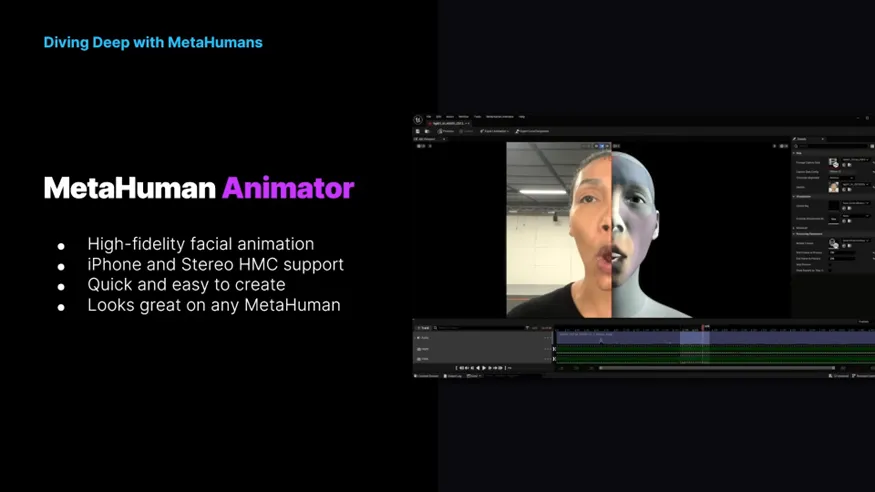

接下来我们将会详细讲讲如何自己动手搞一段高质量的MetaHuman面部动画。

### 

### **3.1. 建个工程，打开MetaHuman插件** 

保证在启用插件之后重启编辑器。

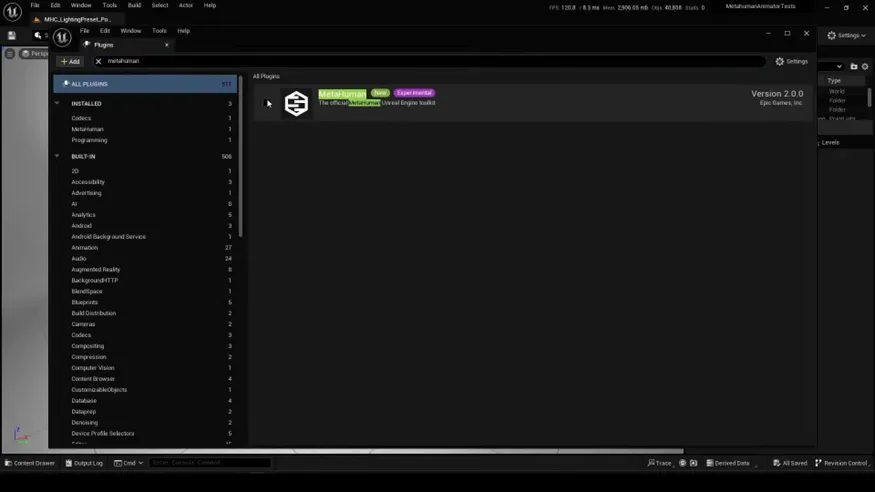

### 

### **3.2. 用iPhone打开Live Link Face软件进行设置** 

可以在设置中打开预览深度选项，看看深度图是否正常，如果有问题，可以尝试让自己站在一个空白背景墙前并且光线充足的环境中。然后我们就可以录制一段视频，保证视频中有您放松的表情、左看右看的表情以及露出牙齿的表情，这段素材可以帮助我们进行MetaHuman脸型创建的识别流程。

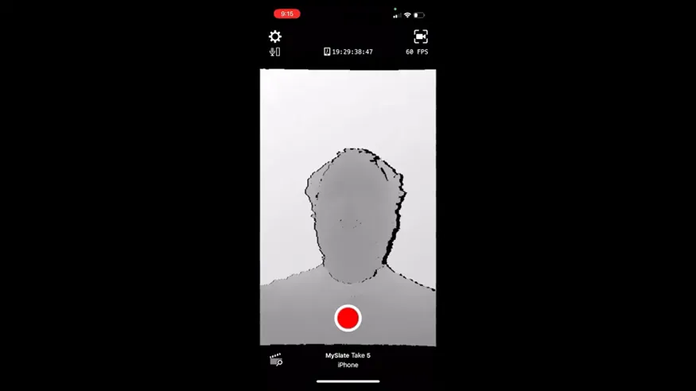

### 

### **3.3. 将素材发送到电脑上** 

我们可以把素材打包发到电脑上，或者使用Live Link实时捕捉镜头。在MetaHuman蓝图中设置Live Link设备就能完成实时捕捉设置，届时我们就能看到屏幕中的MetaHuman将做着与我们相同的面部表情与头部动作。

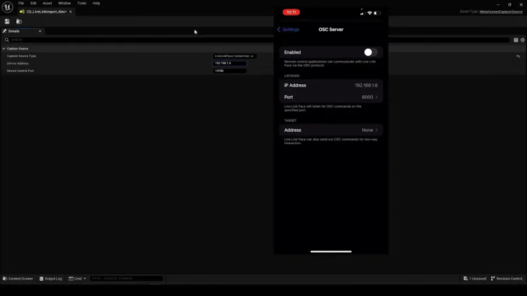

### 

### **3.4. 创建新的Identity文件** 

这一步骤是可选的，旨在将我们的脸型与MetaHuman的脸型相匹配。打开Identity编辑器并导入刚刚Capture好的素材，将识别追踪点绑定好，然后我们就可以开始识别并处理了。就像刚刚使用自定义Mesh创建MetaHuman一样，我们也可以通过录制好的视频创建属于我们自己的MetaHuman，不过我们也可以使用已经创建好的MetaHuman，毕竟这个过程十分吃配置，并且比较缓慢。

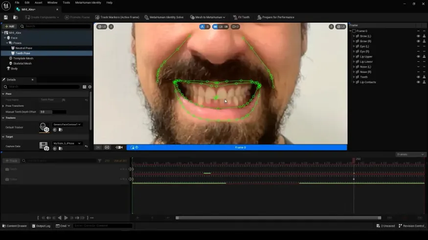

### 

### **3.5. 输出MetaHuman的表演文件** 

打开文件我们就能看到匹配程度极高的MetaHuman面部表情动画。

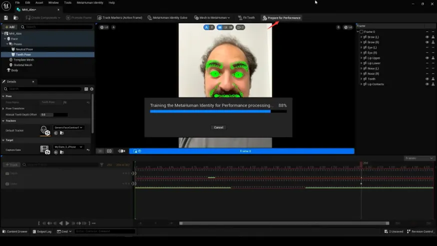

### 

### **3.6. 通过表演文件的后续工作**  

当我们有了这段表演文件之后，就可以通过这个文件导出关卡序列或者是动画序列，并且在游戏或者影视中使用这些高质量的面部动画了。

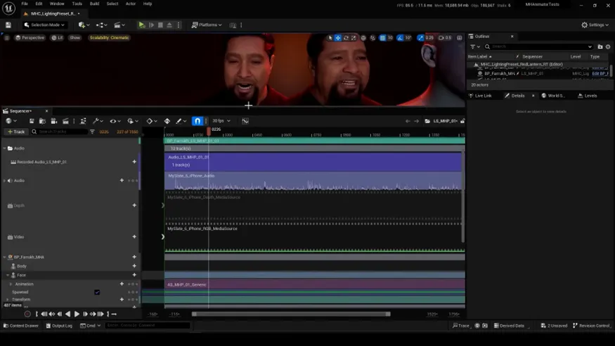

## **四、DNA校准库（DNA Calibration）** 

我们可以通过这个开源的库去对我们的MetaHuman进行更高级更细致的调整。比如在Maya中打开这个MetaHuman模型，调整骨架绑定与BlendShapes等。

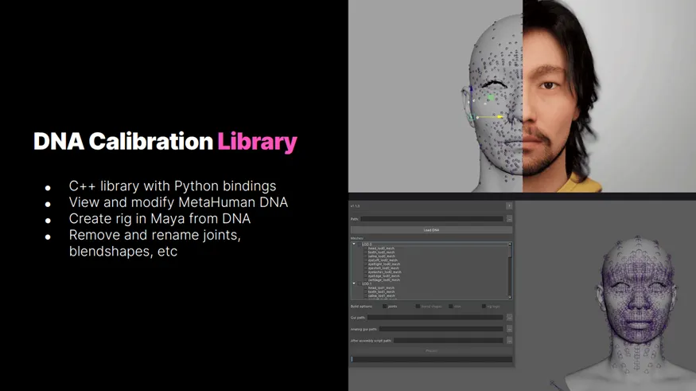

## **五、通过Quixel Bridge下载MetaHuman** 

当我们在Quixel Bridge中下载MetaHuman的时候，我们可以选择模型质量，有低中高三个质量可以选择下载。如果我们希望在VR或者移动平台中使用MetaHuman，可以选择低质量，但即便是低质量也能有很棒的视觉表现。

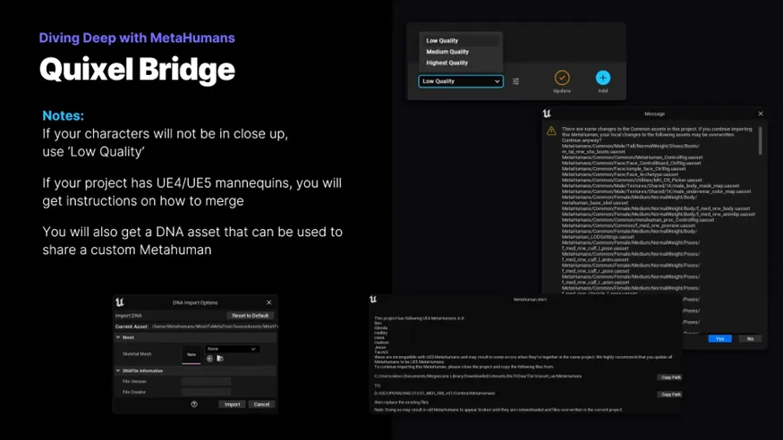

## **六、降低纹理的大小** 

如果我们的MetaHuman并不是使用在需要高保真的影视级生产中，并且希望自己的项目能小一些，运行得流畅一些，可以考虑降低MetaHuman的纹理大小。

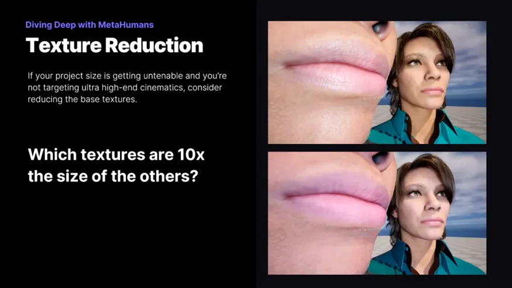

这里讲者给我们演示了如何使用IrfanView这个免费软件来批量降低分辨率，我们也根据自己的工作流为我们的纹理降低分辨率。首先我们需要在MetaHuman的角色文件夹中使用过滤器过滤出纹理类型文件，然后通过列表视图将所有超过4k的纹理选择并批量导出成源文件，再通过软件降低分辨率到2k。最后将相同文件结构的纹理拖回项目的资源管理器中，我们会发现这些资源被更新了。需要说明的是，降低到何等分辨率根据开发者对质量的接受程度以及对应平台而定。

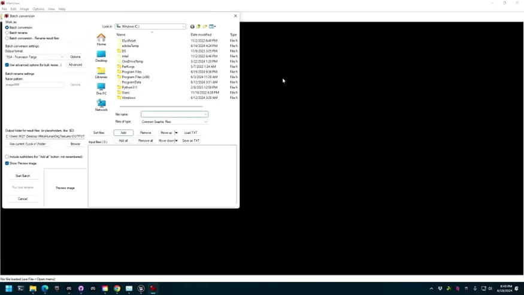

## **七、MetaHuman身体动画** 

我们可以像之前修改角色动画一样，修改MetaHuman的动画。并且我们还可以打开显示不兼容骨架动画勾选框使用其他骨架的动画。

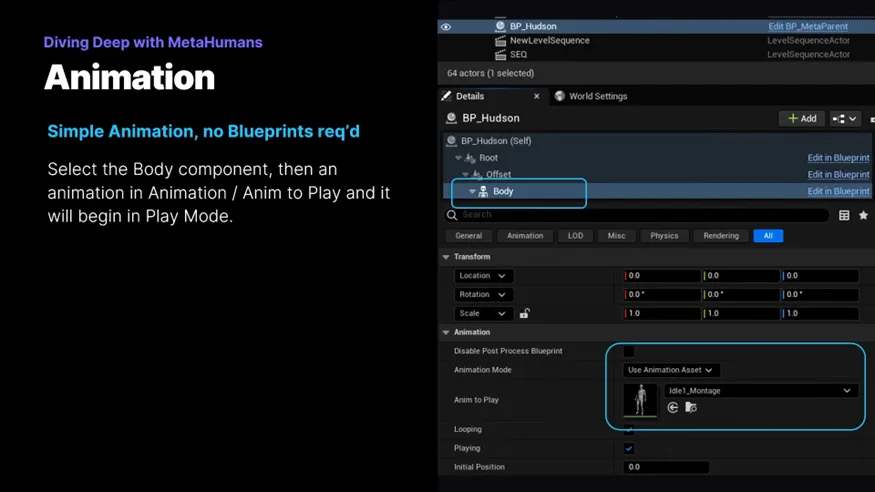

当我们将MetaHuman的蓝图拖入Sequencer的时候，我们可以得到MetaHuman的身体Control Rig和脸部Control Rig帮助我们制作动画。如果我们希望循环播放一些带有根动画的动画时，可以尝试批量修改资产属性，给这些动画关闭根运动并且打开强制根锁定，当循环动画用。

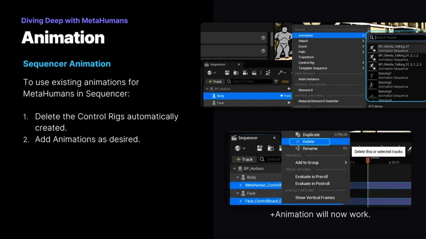

我们可以给各种不同的MetaHuman制作一个随机动画播放器。

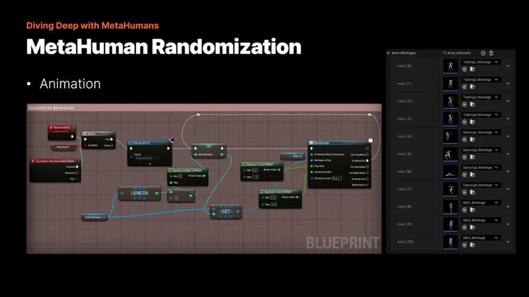

还有随机头发！

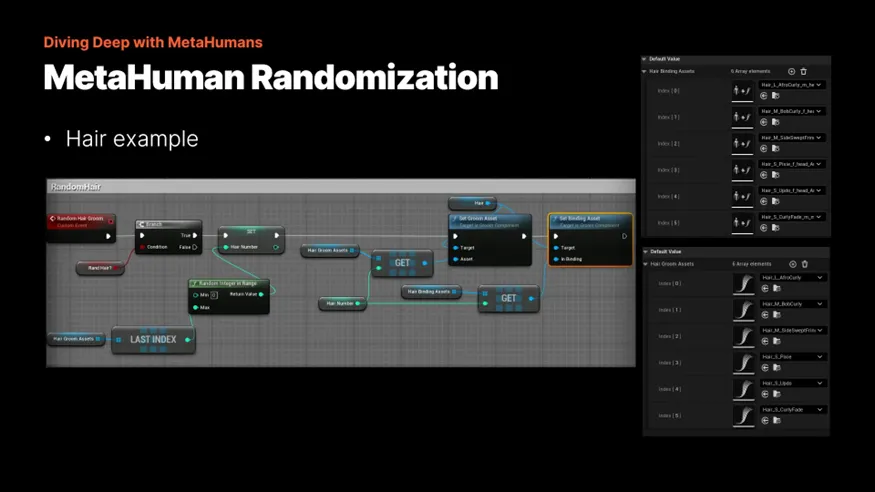

搭配身形随机与衣物随机，我们便能快速创建出一堆截然不同的MetaHu man，并用在Mass中。例如City Sample中的MetaHuman人群。

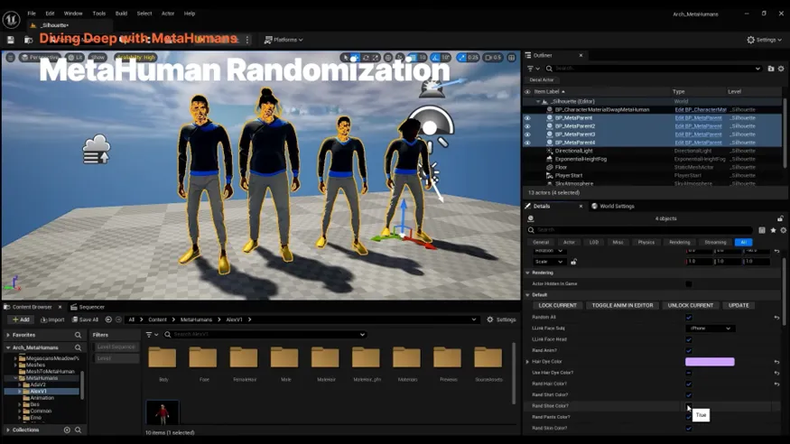

如果我们希望在编辑器中能看到角色动画，就需要用到这些节点。

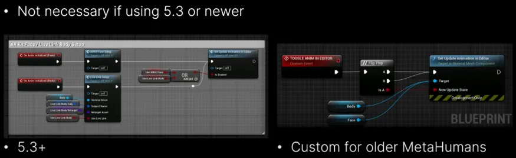

我们可以通过Live Link实时面部。不过假如我们希望看到已经有了的面部动画，就需要播放脸部的蒙太奇了。

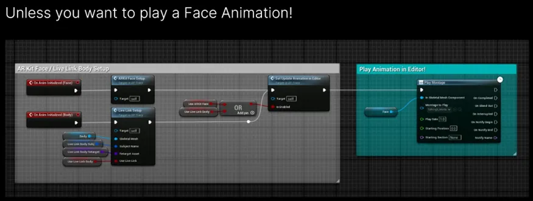

## **八、MetaHuman优化** 

### **8.1. LOD** 

由于MetaHuman由多个骨骼网格体构成，并且这些网格体的LOD个数可能也不同，所以我们引入了一个LOD同步功能来帮助我们调整MetaHuman各部分的LOD层级。比如下图所示，我们可以通过设置LOD个数，这个LOD同步组件就会根据距离选择不同的LOD等级，然后根据LOD等级和对应的数组值选择网格体对应的LOD层级。

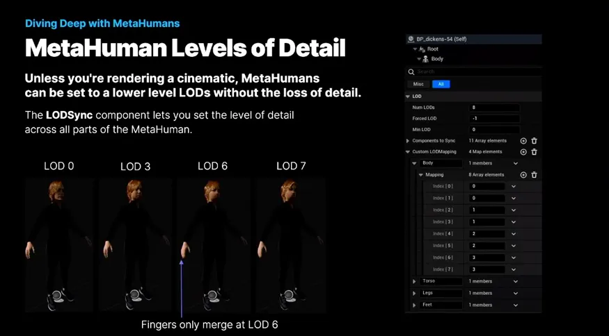

假如我们希望强制LOD只选择LOD3，我们可以将Num LODs设置为4，Forced LOD和Min LOD设置为3，这样就可以强制选择LOD3对应的LOD层级了。下图为错误示范。

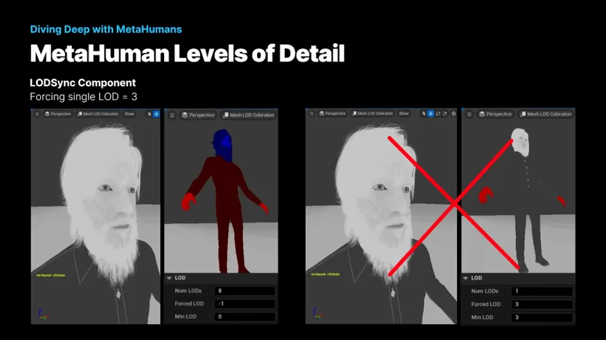

假如我们希望强制限制LOD范围为4到6，我们可以这么填参数，由上到下分别是7、-1、4，熟悉LOD的小伙伴们应该能很容易理解这些参数的含义。解释一下，这些参数的意思是，我们将有7个LOD（LOD0~LOD6），并且最小LOD至少是LOD4，并且强制LOD为-1，代表着组件不会强制选择LOD，所以就会在LOD4到LOD6中选择。

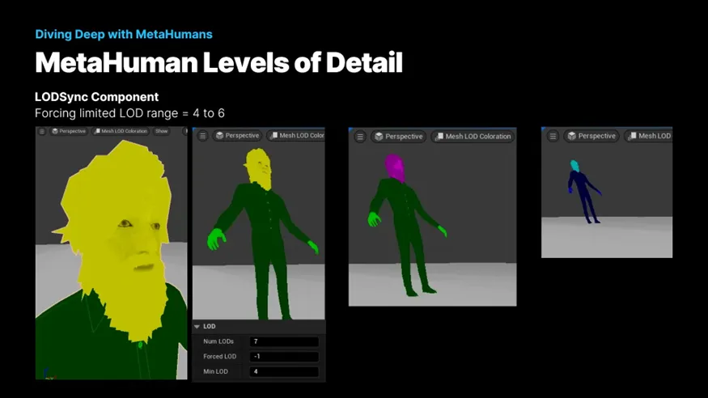

我们刚刚聊了LODSync的组件，而除了这个组件外，本身单独的骨骼网格体也能调整LOD设置，如果要聊这些的话，估计一个小时也聊不完。总之我们可以根据自己的目标平台和项目需求自己调整单独的骨骼网格体LOD流送机制，还可以通过LODSync组件调整MetaHuman整体的LOD表现。

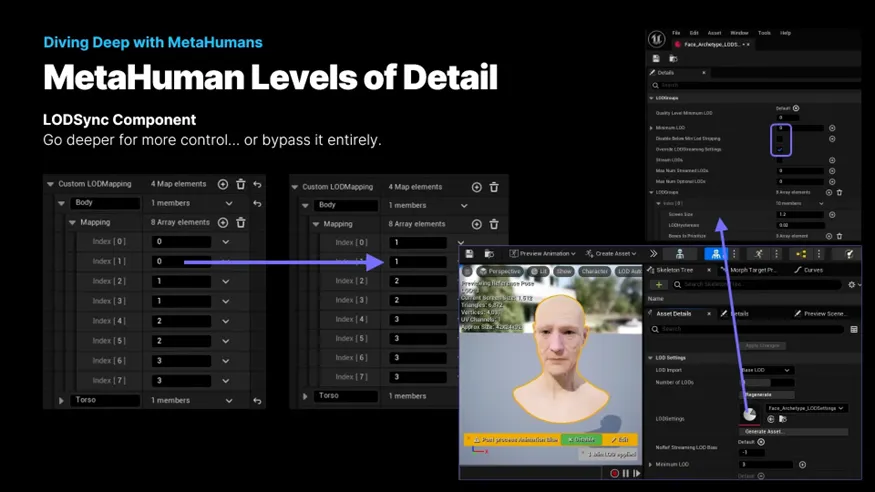

### 

### **8.2. 头发的优化** 

Groom可能太耗性能了，所以我们可以根据平台和目标考虑使用面片头发。

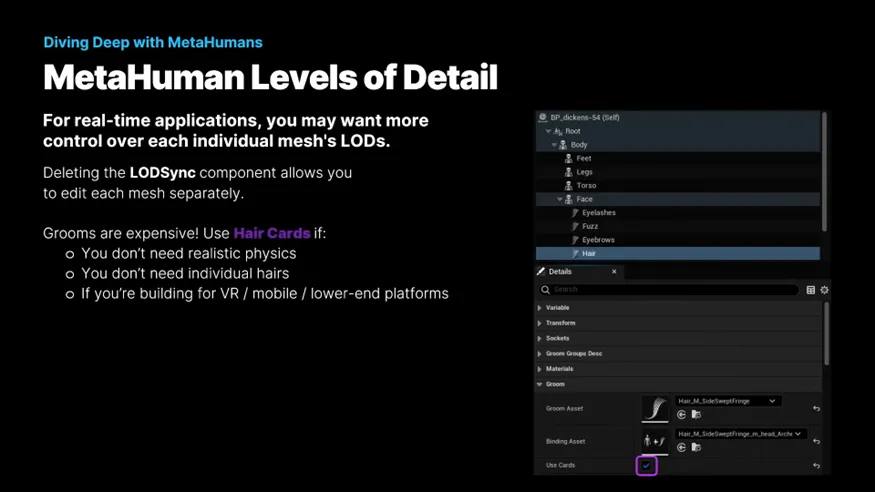

我们甚至还可以把头发的骨骼网格体删掉，直接使用对应的头发面片模型来当做静态网格体使用，附着在角色的头上。    

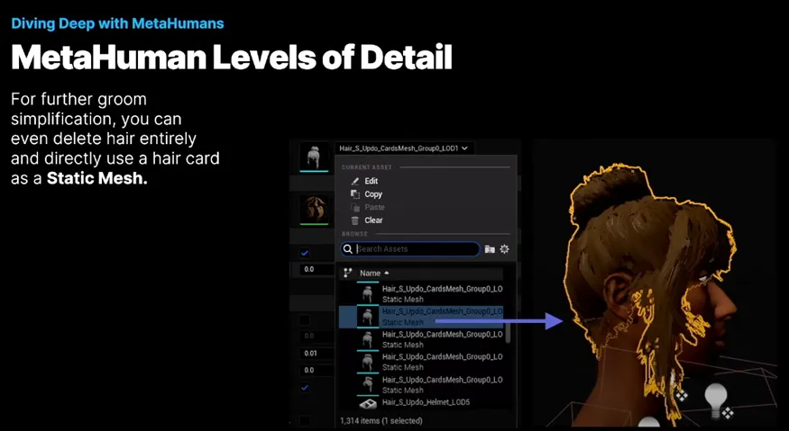

### 

### **8.3. 材质的优化**  

虽然MetaHuman以高保真高质量著称，但是我们可以随便捣鼓MetaHuman的材质，让MetaHuman显得更风格化一点。而由于材质变得更风格化了，所以我们没必要让MetaHuman有太高细节的LOD，所以可以强制这些MetaHuman使用更低面数的LOD。

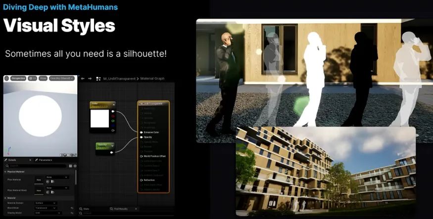

比如下图带描边的场景。

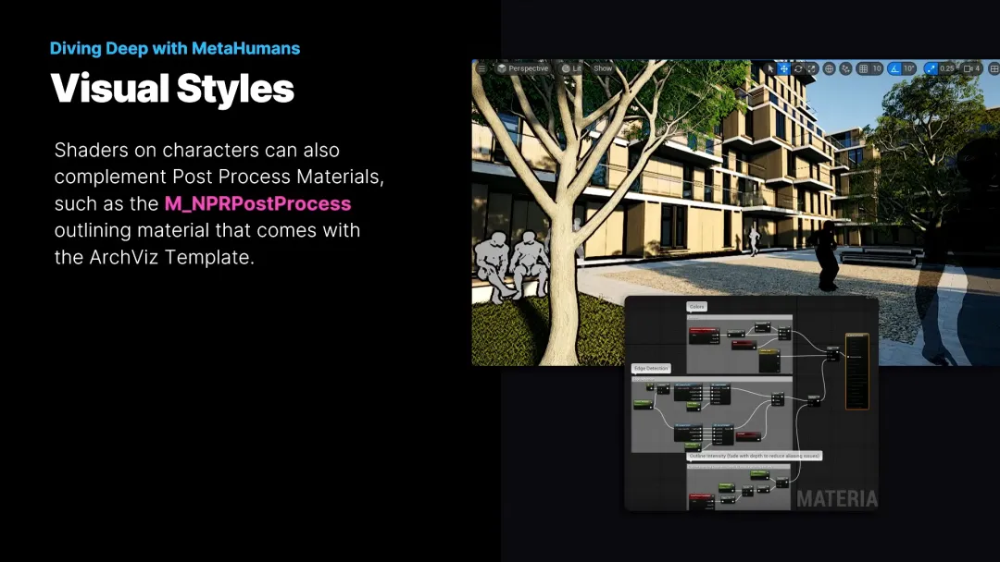

记得降低MetaHuman的着色器复杂度喔！MetaHuman的原版材质采样了很多纹理，我们可以适当的调整一下材质。比如将一些参数从纹理采样变成简单的浮点数，然后将纹理采样方法调整成Shared Wrap，保证GPU在采样纹理时能够共享这些纹理数据，避免重新采样。    

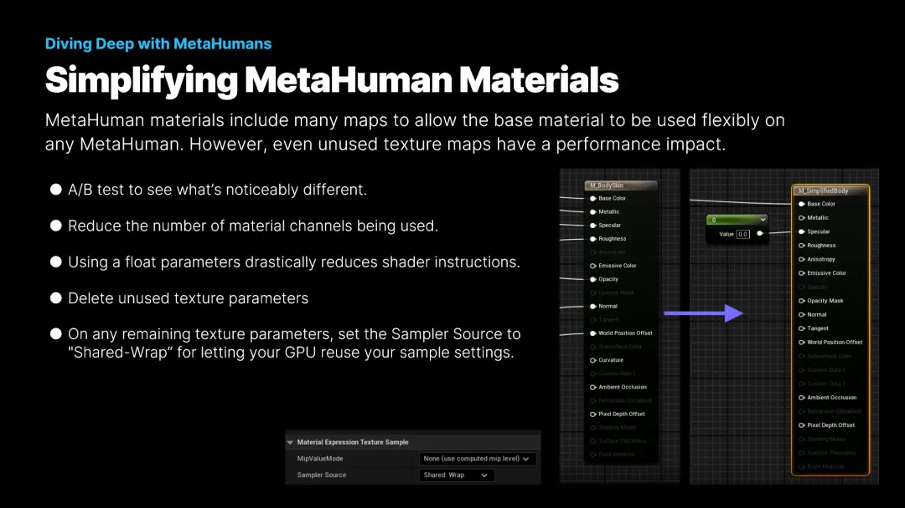

降低材质复杂度后Be Like。需要注意的是，降低材质复杂度的同时也要保证降低的质量也是我们能接受的哦。

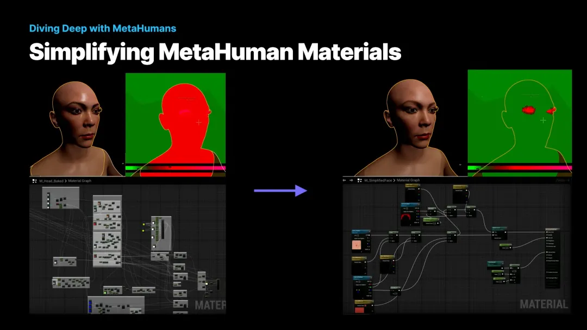

这些MetaHuman的Mesh有很多插槽，这样可能会占用很多DrawCall，所以我们可以尝试减少使用的材质实例。比如将一些不起眼的材质换成同一种材质。    

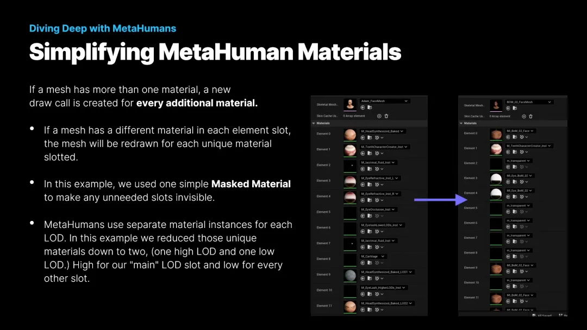

### 

### **8.4. 网格体的优化** 

关于网格体方面的优化，我们会在这个演讲中细讲，感兴趣的小伙伴可以自行查阅。

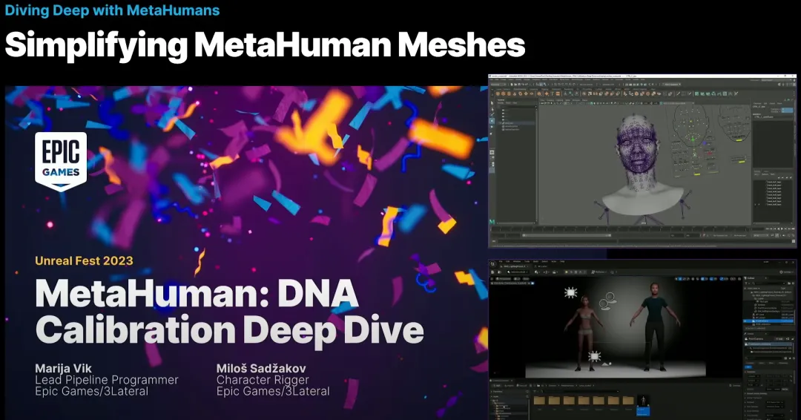    

### **8.5. 一些有用的控制台指令** 

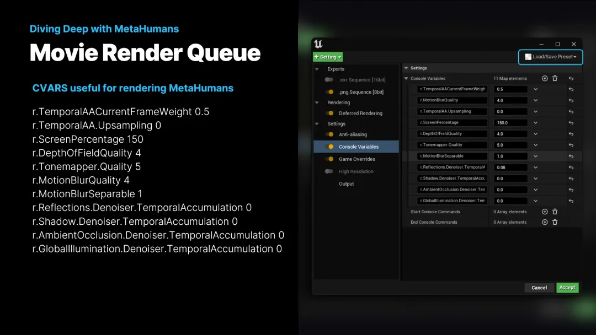

## **九、一些小问题与修复方案** 

### **9.1. Lumen光影噪点** 

一些像头部和身体分离之类的问题，在虚幻5.4已经被修复了。但是现在我们仍然会遇到的一个问题是启用Lumen渲染MetaHuman时会有一些光影噪点。    

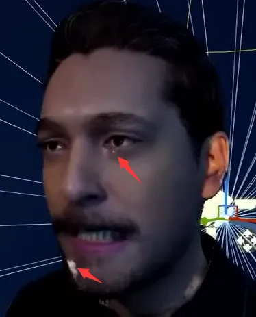

这时我们调整一下光源的接触阴影长度就能解决这个问题。    

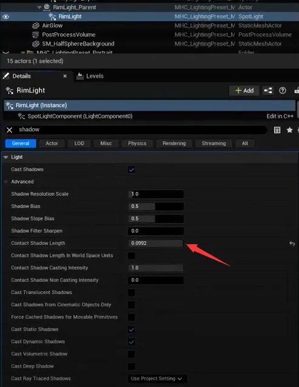

### 

### **9.2. 恐怖的脸部变形**  

如果我们正在尝试将4.27的MetaHuman迁移到5.3或者更新的引擎版本，并使用新版本的MetaHuman插件，也就是MetaHuman资产与引擎版本不符就会出现这种问题。还有另外一种情况就是，我们正在尝试播放另一个LOD录制好的动画，以为不同LOD的骨架可能不同。解决这个问题的方案可能会比较玄学，有时候关闭然后启用后期处理动画蓝图可以解决；有时候重新开一下Sequencer就能解决；有时候重启电脑就能解决。总之想要解决这个问题，可以尝试重启各种东西，重启解决99.9%的问题。    

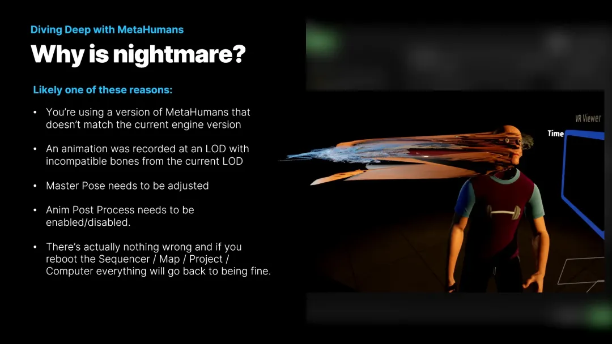

### 

### **9.3. 与引擎版本不匹配的MetaHuman** 

我们现在可以很方便地升级MetaHuman到对应的引擎版本中，这一切虚幻引擎都能帮我们自动批量完成！

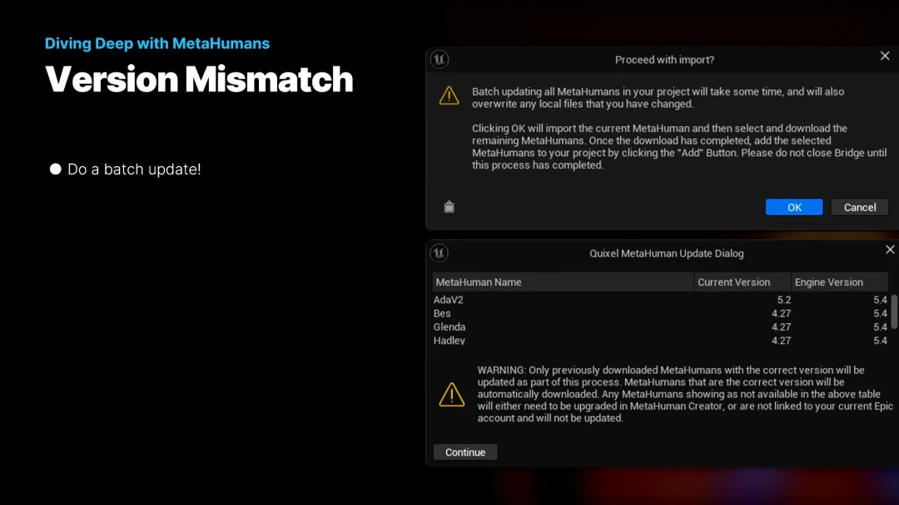    

### **9.4. 因为LOD导致的恐怖面部变形** 

有些动画不能在低面数LOD中播放，所以解决这个的方案是锁定脸部模型的LOD为LOD0，但这样就会更消耗性能。

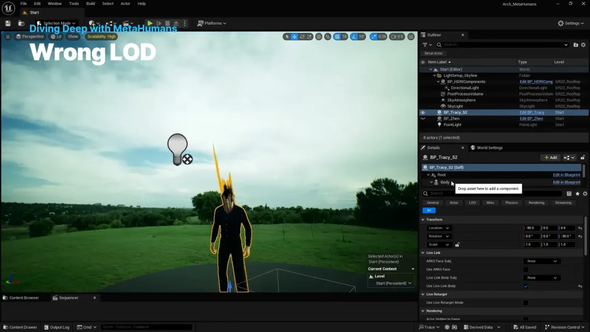

### 

### **9.5. 身体模型有奇怪的动画表现** 

这种情况一般由于我们将某一部分模型作为“动画领导者”，并且这些模型的LOD不一样，导致骨架结构不一样，最终动画表现会出现一些意想不到的情况。解决这个有两个方法，要么为MetaHuman的不同模型设置动画；要么将不同模型合并成一个骨架，保证骨架结构一致。

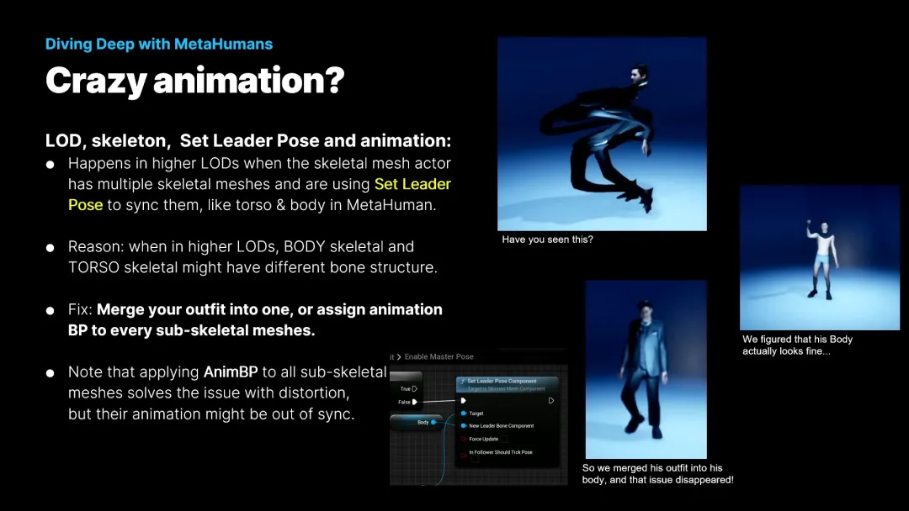    

### **9.6. 使用了不兼容骨架的动画** 

有时候不兼容骨架的动画在MetaHuman上播放并没有什么问题，但是更多时候我们还是不使用这些动画的，以免出现问题。

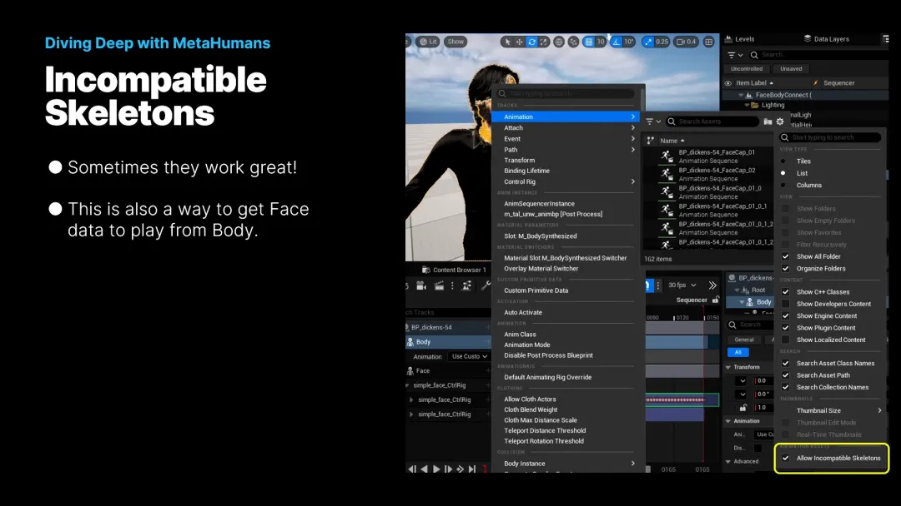

## **十、VR全身追踪** 

我们可以参考这个示例工程设置我们的VR全身追踪，让我们在游戏中也能控制人物的双手双腿。

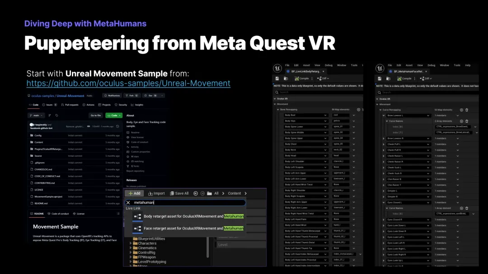    

我们还可以使用这个全身追踪和Take Record工具去录制一段演出或者动画，实现一套低成本的动作捕捉。

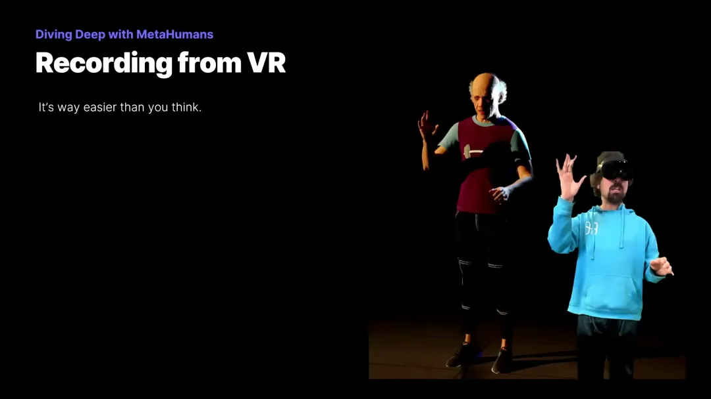

## **十一、附加提示** 

我们也可以在UEFN中使用MetaHuman，就和UE编辑器中一样简单，只需要打开MetaHuman Importor，然后从Bridge中下载。当我们将MetaHuman拖入场景，也可以获得一套和UE编辑器一样的Control Rig，并且还能直接使用堡垒之夜人物模型的动画，无需经过重定向。

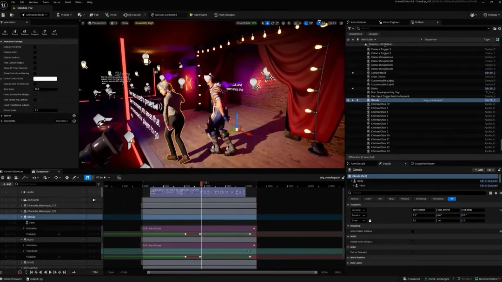    

虚幻引擎现在为我们提供了一套极为方便的重定向工具，我们可以使用这套重定向工具将Mannequin的动画重定向到MetaHuman上，从而替代Mannequin。

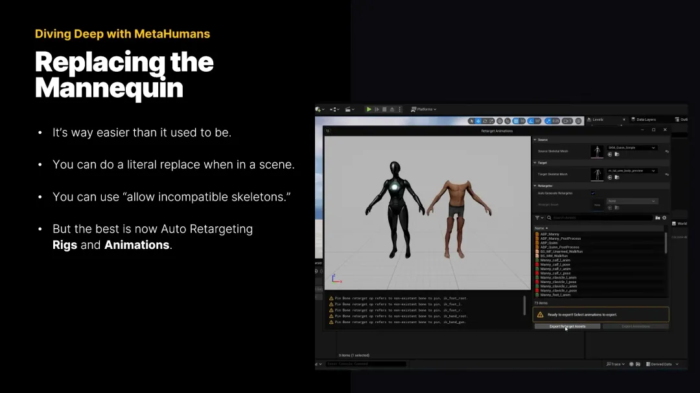

除了在Mixamo之类的网站上获取动画之外，也可以试试我们新的动画系统实例工程，将您的MetaHuman重定向进去。这套拥有500+个动画采样、运动匹配以及基础移动能力的工程可以让我们的MetaHuman更加栩栩如生。

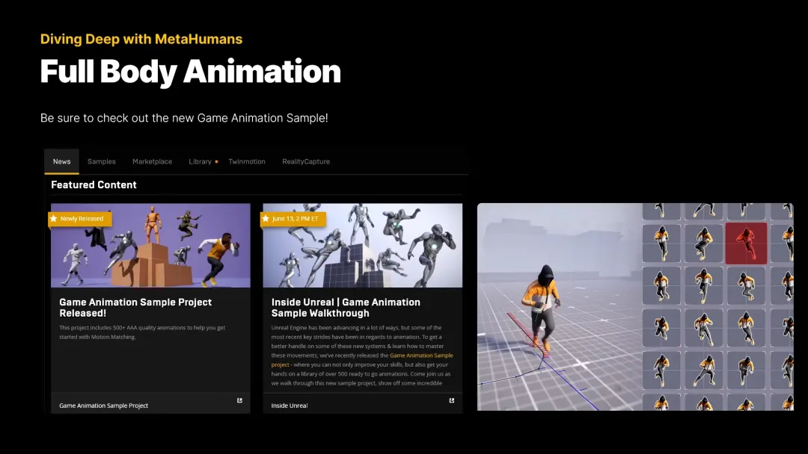

如果我们不想花时间去重定向一个个动画序列，我们还可以试试Live Retarget功能。只需要将MetaHuman蓝图拖入我们的角色蓝图中，然后让MetaHuman蓝图作为网格体的子对象，然后勾选上Live Retarget Mode就能实时重定向动画了。    

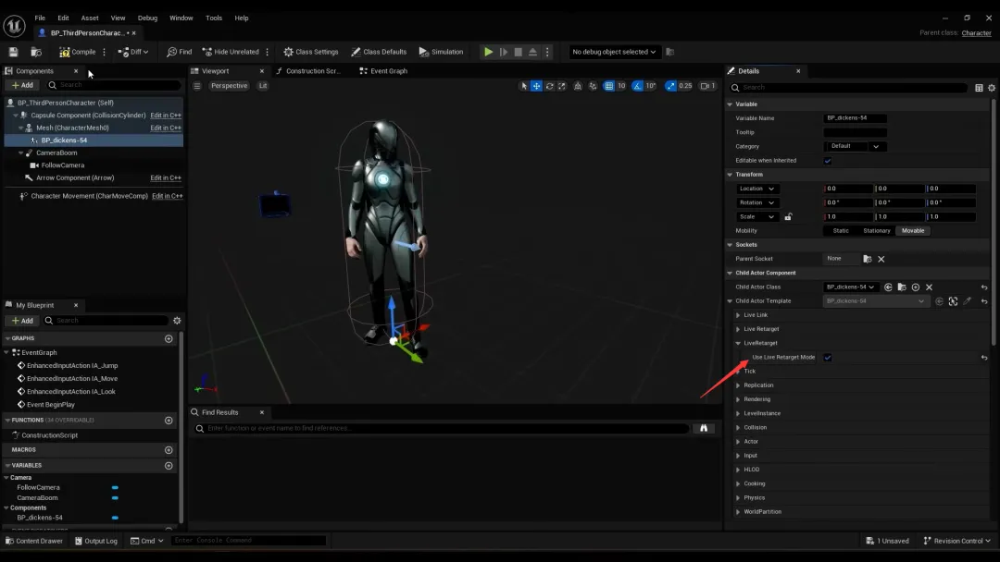

不过需要注意的是，假如我们希望只看到MetaHuman，记得将角色原来的Mesh隐藏，并且将骨架刷新模式调整成总是刷新姿势与骨骼位置，才能正常重定向。

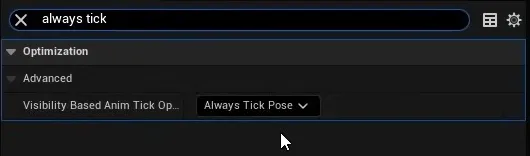

# **结语** 

以上便是今天要与大家分享的，关于MetaHuman的相关使用技巧。从创建MetaHuman，到MetaHuman的优化处理，再到动画录制与使用，几乎涵盖了我们在使用MetaHuman可能涉及到的场景。希望今天的MetaHuman内容分享可以帮到您，祝工作顺利，创作愉快