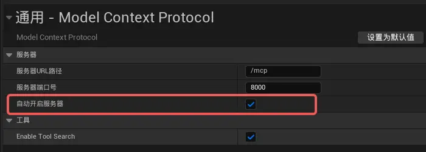
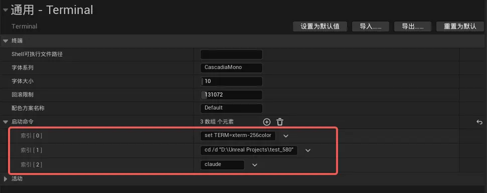
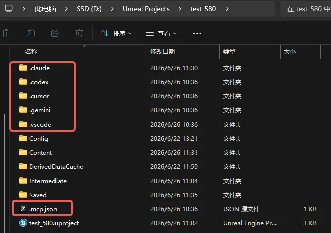
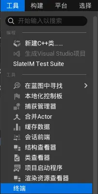
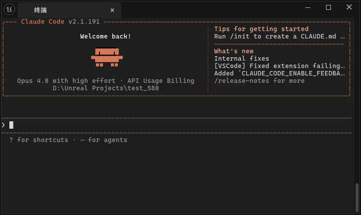
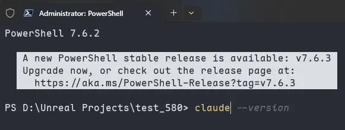
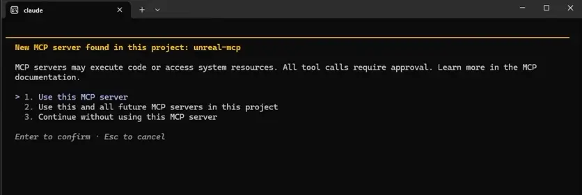
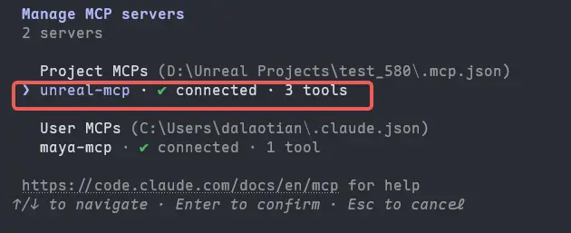

# 概述
在UE5.8中内置了UnrealMCP，本内容是介绍如何开启MCP并利用ClaudeCode调用MCP

# 步骤
## 开启插件
- 开启UnrealMCP插件，也可以同时开启Terminal终端插件和EditorToolSet插件，EditorToolSet插件用于连接终端和AiAgent


## 设置插件
- 在编辑器偏好设置中设置MCP常驻
- 
- 在编辑器偏好设置中设置终端启动命令，终端在启动后会自动执行这三行
```powershell
# 设置颜色
set TERM=xterm-256color 
# 设置工程路径
cd /d "D:\Unreal Projects\test_580" 
# 启动ClaudeCode
claude
```
- 
- 在命令行中依次执行以下命令
```
# 启用ClaudeCodeMCP
ModelContextProtocol.GenerateClientConfig ClaudeCode 
# 启用所有MCP，包含ClaudeCode、OpenAI、Germini等
ModelContextProtocol.GenerateClientConfig All 
# 开启MCP服务
ModelContextProtocol.StartServer
```
- 执行命令之后，会在项目根路径下生成mcp文件
- 
# 启动AiAgent
## 在UE终端中启动
- 启动UE终端
- 
- 
- 注意：UE的这个终端贼烂，貌似不能输入中文，还经常出乱码。
## 在Windows终端中启动
- 在项目根目录执行终端，并在终端开启ClaudeCode
- 
- 开启MCP调用
- 
- 键入`/mcp`查看MCP状态
- 
- 现在可以愉快的使用UnrealMCP了