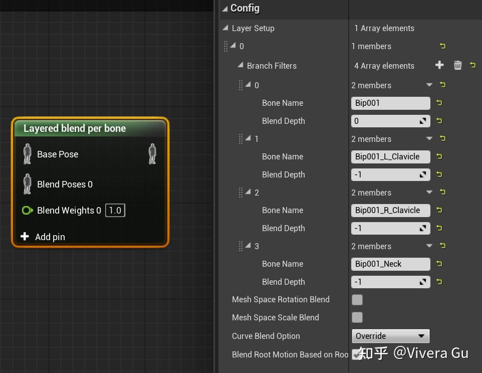
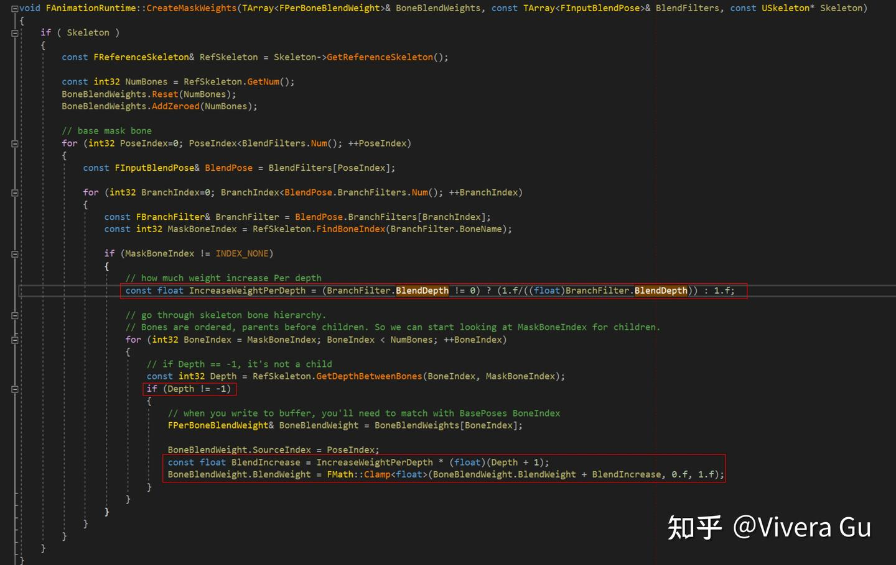
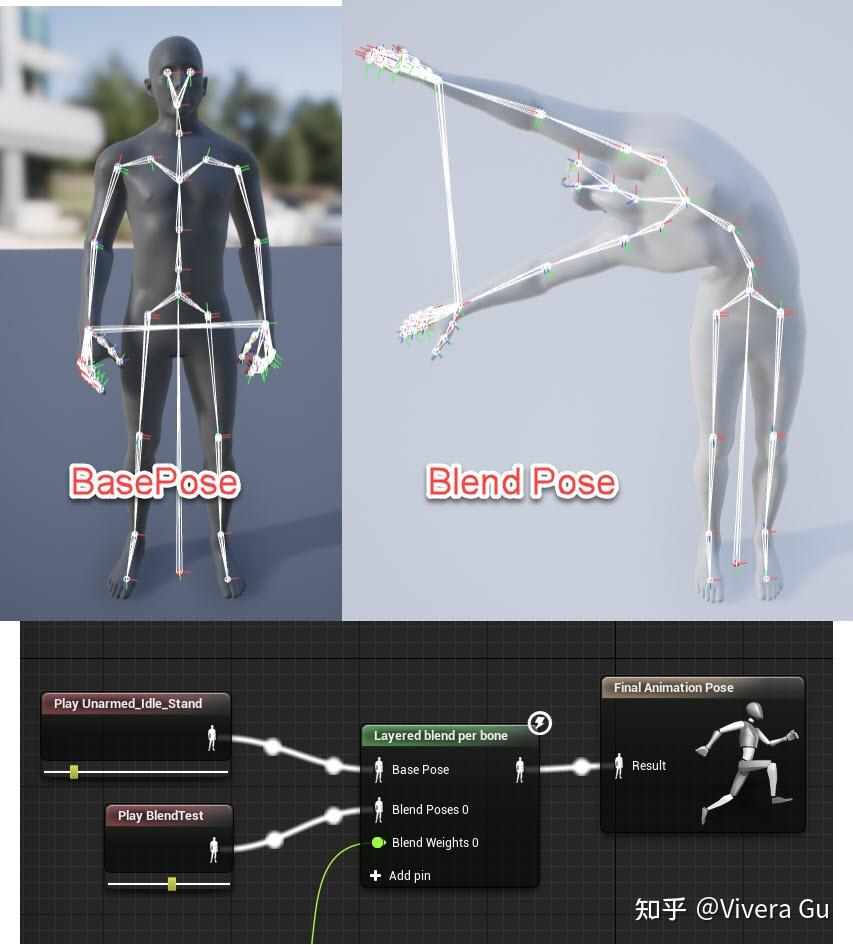
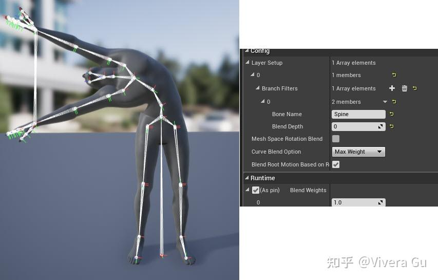
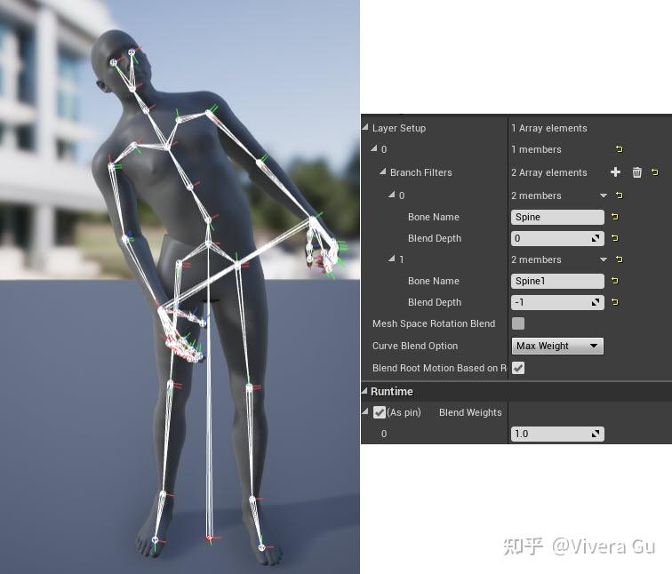
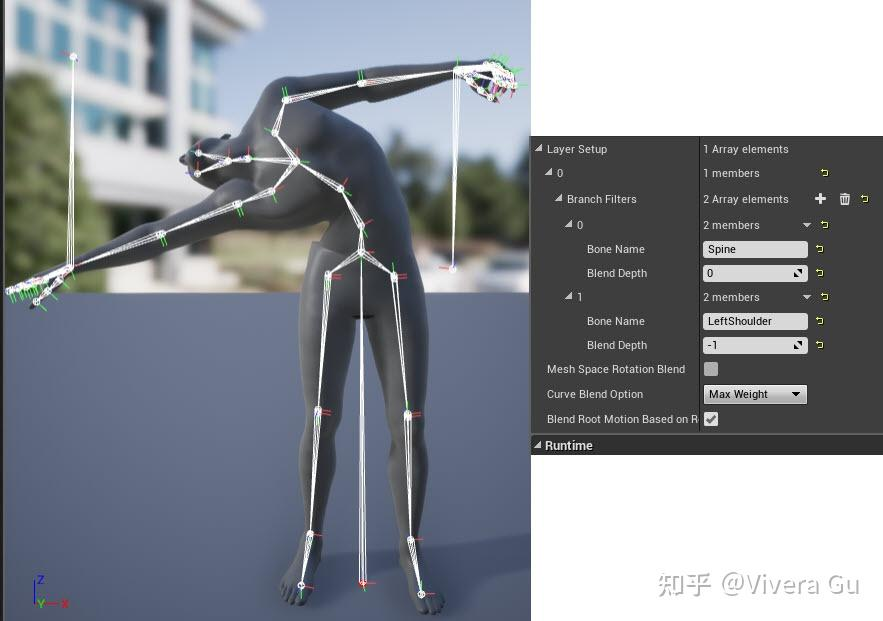
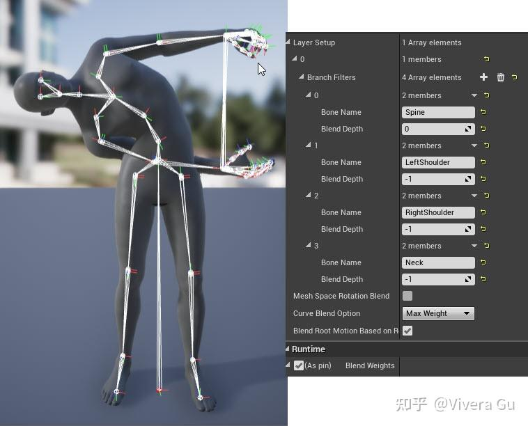

https://zhuanlan.zhihu.com/p/428242048



[UE4](https://zhida.zhihu.com/search?content_id=183294223&content_type=Article&match_order=1&q=UE4&zhida_source=entity)动画蓝图中在使用[分层混合节点](https://zhida.zhihu.com/search?content_id=183294223&content_type=Article&match_order=1&q=%E5%88%86%E5%B1%82%E6%B7%B7%E5%90%88%E8%8A%82%E7%82%B9&zhida_source=entity)时的一些设置：

_Layered Blend Per Bone_是根据骨骼层级混合不同动画的节点，需要注意的是_[Blend Depth](https://zhida.zhihu.com/search?content_id=183294223&content_type=Article&match_order=1&q=Blend+Depth&zhida_source=entity)_和_[Blend Weights](https://zhida.zhihu.com/search?content_id=183294223&content_type=Article&match_order=1&q=Blend+Weights&zhida_source=entity)_是不同的，_Blend Weights_控制的是这个节点混合不同_pose_的权重。官方文档中对_Blend Depth_的定义介绍很少，因此从源码里找了一下这个参数的设定：



当 _BlendDepth_!=0时，将 _IncreaseWeightPerDepth_ 设置为1/_BlendDepth_ ，当 _BlendDepth_ ==0时，设置为1.0。然后在 _NumBones_ 上循环， _BlendWeight_ +（ _IncreaseWeightPerDepth_ · （_Depth_+1））被clamp到(0.0,1.0)，负值将会被clamp到0，即子骨骼都不参与混合。

  
简单来说就是：

- 当 _Blend Depth_ 为0时，整条骨骼链完全参与混合
- 当 _Blend Depth_ 为 _N_ 时，从指定骨骼起，到 _N_ 层子骨骼为止，逐渐混入动作

- 比如设为3的时候，第一层混33%，第二层66%，第三层100%

- 当 _Blend Depth_ 为-1时，子骨骼以下所有骨骼都不参与混合，仅自己混，类似于block

论坛上有一个非常直观的例子，一个简单的角色，骨架层级如下：

```text
`spine` 
`spine1` 
`spine2` 
`LeftShoulder` 
`(left arm bones)` 
`RightShoulder` 
`(right arm bones)` 
`Neck` 
`Head`
```

下面是要混合的_Base Pose_和_Blend Pose_，_Blend Pose_在_Base Pose_基础上扭转了_spine_骨骼链并且_shoulder_朝上转，_neck_和_head_向后转：



假设我们的目标是仅混合_spine_->_spine_1->_spine_2骨骼链。添加一个_Branch Filter_，对_spine_骨骼进行深度为0的混合，结果是_spine_及其所有子骨骼都混合了这个鬼畜的动作：



再增加一个_Branch Filter_，设定_spine_1深度为-1，此时只有_spine_骨骼有混合动作，_spine_1及其所有子骨骼都不参与混合，所以-1类似于被屏蔽（block）了：



这时把屏蔽从_spine_1改成_LeftShoulder_，结果是第一节_spine_骨骼的所有子骨骼都有混合动作，除了_LeftShoulder_及其所有子骨骼（左臂）：



最后，回到我们的目标，仅混合_spine_骨骼链，如下图所示完成设置：



这样我们就完成了 _spine_ 骨骼链的混合设置。

另外还有一个选项的设定要留意一下：  
_Mesh Space Rotation Blend_ 设置以 _mesh space_ 还是 _local space_ 来混合骨骼旋转值，ALS中推荐的方法是手臂部分用 _local space_ 更好，动作可以更还原 _spine_ 引起的旋转。