# 虚拟骨骼

通过将 Virtual Bones 与 IK 结合使用来解决分层动画问题。

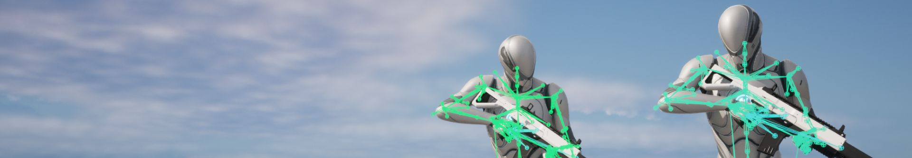

在构建复杂的混合、分层或压缩动画系统时，这可能会导致角色肢体（通常是手和脚）上出现额外和不需要的运动（称为“游泳”）。 虚拟骨骼 ，与 IK 节点 结合使用 ，可用于更正这种不需要的行为。
## 虚拟骨骼概述

虚拟骨骼是跟随另一个骨骼变换的骨骼，但在不同的骨骼空间中。在大多数情况下，这意味着 虚拟骨骼 将是 根骨骼 的父级，但遵循 结束骨骼 ，如手或脚。换句话说，虚拟骨骼可以直接跟随目标骨骼，而不会接收通向该目标的所有关节的正向运动学 （FK） 层次结构的额外效果。使用此功能，您可以设置反向运动学 （IK） 系统，使角色肢体跟随虚拟骨骼，从而解决复杂动画系统中的“游泳”和其他肢体摆动问题。

在此示例中，使用带有 IK 的虚拟骨骼在播放附加头视动画时保持步枪和手部位置。没有它，手和武器会 “游动” 导致意外移动。

|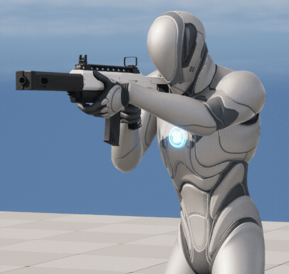||
|使用虚拟骨骼|无虚拟骨骼|

### 与传统 IK 的区别

Virtual Bones 的主要方面之一是它们跟随目标骨骼。这样，你仍然可以播放目标骨骼可以移动的动画，从而更改虚拟骨骼的位置。这种设置可能优于传统的仅 IK 系统，在后者中，IK 可能会干扰动画。例如，如果要设置一个系统，其中手部被 IK 附加到武器上，则必须执行额外的步骤才能在某些情况下禁用 IK，例如重新装填。

在此示例中，具有 IK 的虚拟骨骼仍然能够允许基础手相对于另一个对象移动，即使正在播放附加动画也是如此。尽管传统的 IK 设置可能会解决“游泳”问题，但结果会始终将手固定在原位，迫使您创建额外的逻辑来在这种情况下关闭 IK。

|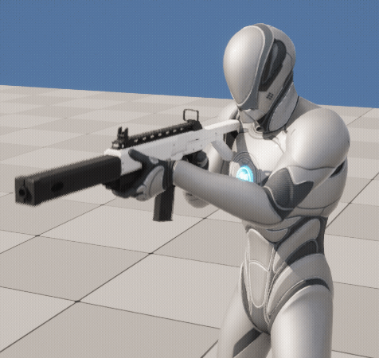|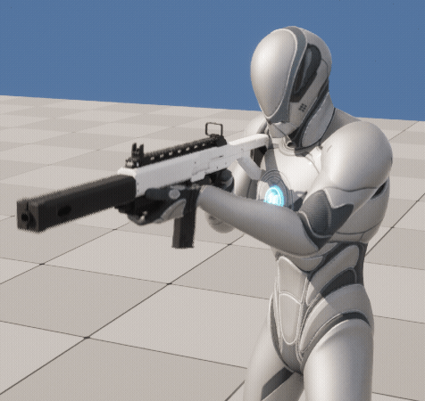|
|允许基础手部移动的虚拟骨骼|仅 IK 设置，将手固定到位|

## 创建虚拟骨骼

您可以在 Animation Editor 的 Skeleton Tree 中创建虚拟骨骼。右键单击 骨骼（将成为父骨骼），然后选择 添加虚拟骨骼（Add Virtual Bone） 。从此列表中选择一个 骨骼 以指定 目标 。在此示例中，正在创建一个以根骨骼为父级的虚拟骨骼 ，然后以hand_l骨骼为目标 。

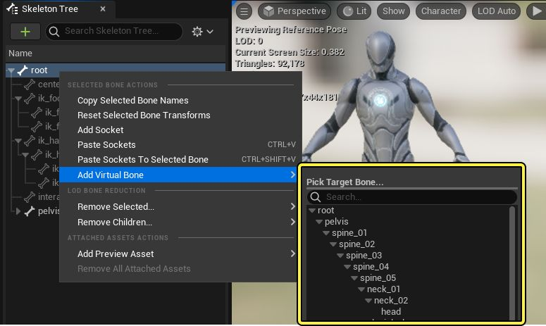

创建后，你现在应该会看到 虚拟骨骼 作为父骨骼 的子项 ，但与目标骨骼的变换匹配 。默认情况下，虚拟骨骼会自动按照`VB <Parent>_<Target>`其命名约定进行命名。

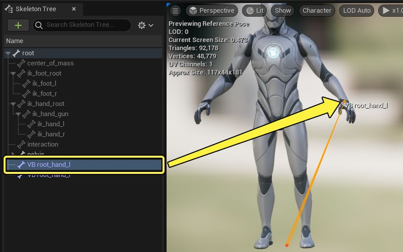

你还可以预览动画序列，并在动画的持续时间内观察虚拟骨骼跟随目标骨骼。

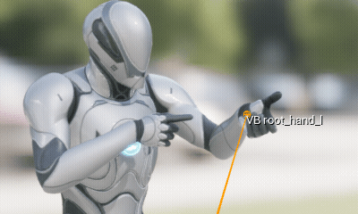

## 动画蓝图设置

创建虚拟骨骼后，您可以在 动画蓝图 中为它们设置逻辑。由于 Virtual Bones 的任意性，你可以通过多种不同的方式使用它们。本节将演示如何为 Virtual Bones 创建基本的武器覆盖和附加动画设置。

### 插槽设置

首先，在 动画蓝图动画图表 中，创建两个 插槽（Slot） 节点。插槽是动画蓝图中的代理区域，您可以在其中插入一次性动画，并将用于区分基础动画层和附加动画层。

在 动画图表（Anim Graph） 中单击右键，然后选择 蒙太奇（Montage） > 插槽 'DefaultSlot' （默认插槽）' 以创建插槽。

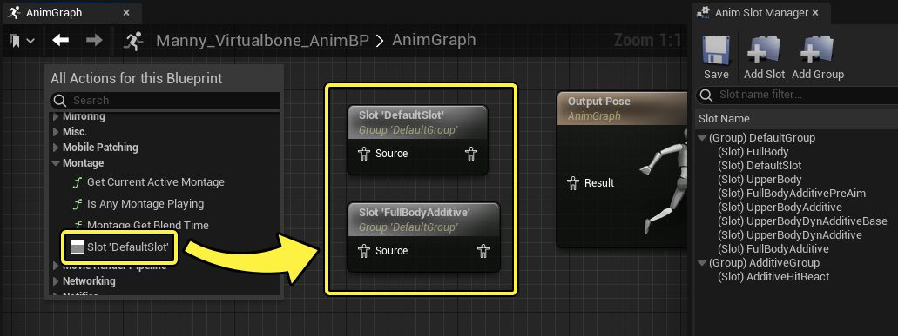

对于第二个 插槽（Slot），选择它，并将 细节（Details） 面板中的 插槽名称（Slot Name） 属性设置为除 DefaultSlot 以外的其他值，以便动画正确发散。

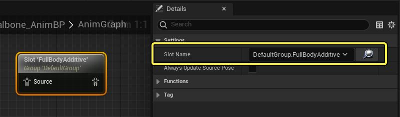

将 插槽（Slots） 连接到 Apply Additive 节点，将默认插槽连接到 基础（Base） 引脚，将附加插槽连接到 Additive引脚。

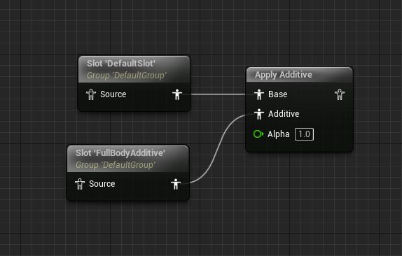

### 排除虚拟骨骼

接下来，你需要创建一个 混合遮罩（Blend Mask），以便从你的附加插槽中排除虚拟骨骼的求值范围。

在 Animation Editor 的 Skeleton Tree 中，单击 Options 下拉菜单，然后选择 Add Blend Mask 。为其命名，然后按 Enter 键 。

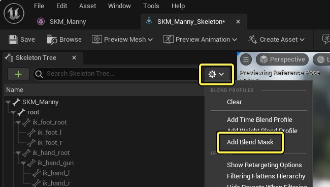

接下来，导航到你的 虚拟骨骼（Virtual Bones） 并将其混合值设置为 0.0 。

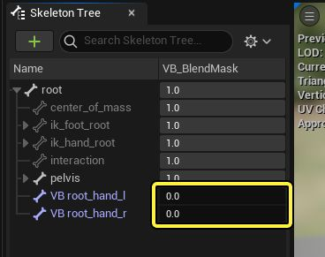

返回 Anim Graph （动画图表），创建一个 Layered Blend per Bone 节点，并在其上设置以下属性：

- 将 混合模式 设置为 混合蒙版 。
- 将 Blend Masks （混合遮罩） 设置为不含虚拟骨骼的 Blend Mask。

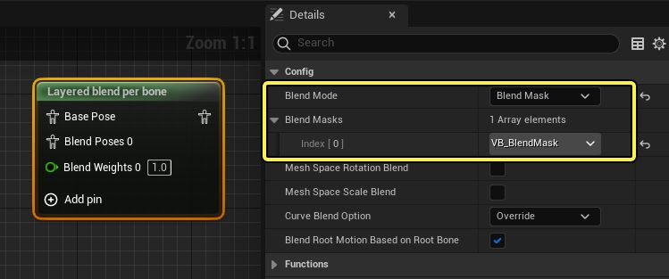

连接此节点，使其位于你的 additive Slot 和 Apply to Additive 节点之间，仅将 Slot 连接到 Blend Poses 引脚。现在，当动画从这个附加插槽播放时，Blend Mask 将导致附加动画不会影响虚拟骨骼。

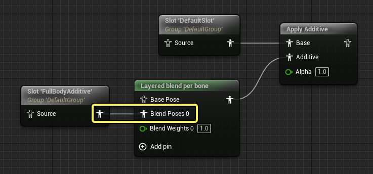

### IK 设置

最后，你需要创建一个 IK 设置，使肢体跟随虚拟骨骼，而附加层将排除任何额外的虚拟骨骼运动。

创建一个 Two Bone IK 节点，并在 Details （细节） 面板中为其设置以下属性：

- 将 IKBone 设置为此肢体的结束目标骨骼。
- 将 执行器位置空间 设置为 骨骼空间 。
- 启用 从效应器空间获取旋转（Take Rotation from Effector Space） ，这将向 IK 骨骼添加旋转。
- 将 Effector Target 设置为此肢体的 Virtual Bone。
- 将 Joint Target Location Space 设置为 Parent Bone Space 。
- 将 关节目标（Joint Target） 设置为 IKBone 的相同值。

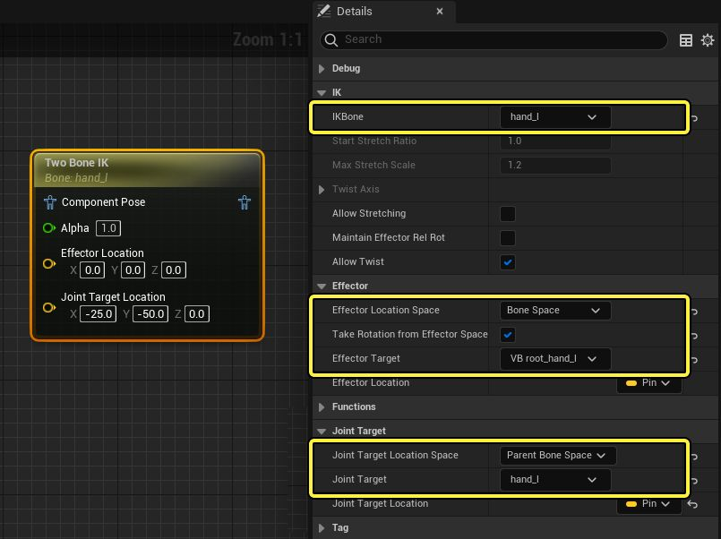

Joint Target Location 用于定义 IK Pole Vector，应将其设置为肘部后面的位置。根据角色的关节，该值可能会有所不同。对于默认的 Unreal Engine 人体模型，此值设置为：

1. **X：-25.0**
2. **Y：-50.0**
3. **从： 0.0**

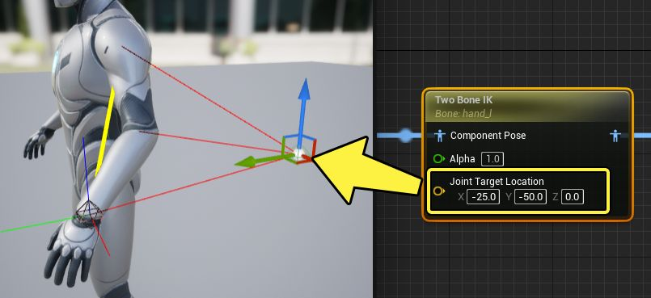

为要与虚拟骨骼匹配的每个肢体创建额外的 Two Bone IK 节点。

### 查看结果

完全完成后，您的 Anim Graph 应如下所示，其中：

1. 基础动画层和附加动画层的插槽节点
2. 插槽连接到 Apply Additive 节点，并且 Layered Blend per Bone 节点用于使用 Blend Mask 从 Additive 层中排除虚拟骨骼。
3. IK 节点在肢体上使用，以附加到最终的 Virtual Bone 位置，该位置将使用基础动画层。

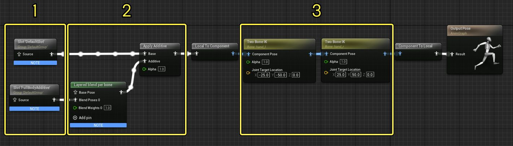

现在，在此框架中播放动画时，您应该能看到角色的肢体遵循 Virtual Bone 位置，同时在播放附加动画时不会受到影响。

- [动画](https://dev.epicgames.com/community/search?query=animation)