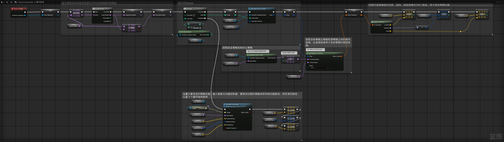

# MatchingIKJoints
## 蓝图截图

## 蓝图代码
```Blueprint
Begin Object Class=/Script/BlueprintGraph.K2Node_Event Name="K2Node_Event_0" ExportPath="/Script/BlueprintGraph.K2Node_Event'/Game/BluePrint/Character/Animation/AnimModifiers/AM_MatchIKJoints.AM_MatchIKJoints:EventGraph.K2Node_Event_0'"
   EventReference=(MemberParent="/Script/CoreUObject.Class'/Script/AnimationModifiers.AnimationModifier'",MemberName="OnApply")
   bOverrideFunction=True
   NodePosX=-640
   NodePosY=256
   NodeGuid=9BE902E642CFF700F00258BA38B624D4
   CustomProperties Pin (PinId=159706354865887866DF7CB0B6B62994,PinName="OutputDelegate",Direction="EGPD_Output",PinType.PinCategory="delegate",PinType.PinSubCategory="",PinType.PinSubCategoryObject=None,PinType.PinSubCategoryMemberReference=(MemberParent="/Script/CoreUObject.Class'/Script/AnimationModifiers.AnimationModifier'",MemberName="OnApply"),PinType.PinValueType=(),PinType.ContainerType=None,PinType.bIsReference=False,PinType.bIsConst=False,PinType.bIsWeakPointer=False,PinType.bIsUObjectWrapper=False,PinType.bSerializeAsSinglePrecisionFloat=False,PersistentGuid=00000000000000000000000000000000,bHidden=False,bNotConnectable=False,bDefaultValueIsReadOnly=False,bDefaultValueIsIgnored=False,bAdvancedView=False,bOrphanedPin=False,)
   CustomProperties Pin (PinId=A046EF78476DE50E1D7CC58BC7D0454C,PinName="then",Direction="EGPD_Output",PinType.PinCategory="exec",PinType.PinSubCategory="",PinType.PinSubCategoryObject=None,PinType.PinSubCategoryMemberReference=(),PinType.PinValueType=(),PinType.ContainerType=None,PinType.bIsReference=False,PinType.bIsConst=False,PinType.bIsWeakPointer=False,PinType.bIsUObjectWrapper=False,PinType.bSerializeAsSinglePrecisionFloat=False,LinkedTo=(K2Node_VariableSet_15 C4E711394D3BD45EE047439EF06D2304,),PersistentGuid=00000000000000000000000000000000,bHidden=False,bNotConnectable=False,bDefaultValueIsReadOnly=False,bDefaultValueIsIgnored=False,bAdvancedView=False,bOrphanedPin=False,)
   CustomProperties Pin (PinId=0673F6444F795422AA6B188ACD332B09,PinName="AnimationSequence",PinToolTip="Animation Sequence\n动画序列 对象引用",Direction="EGPD_Output",PinType.PinCategory="object",PinType.PinSubCategory="",PinType.PinSubCategoryObject="/Script/CoreUObject.Class'/Script/Engine.AnimSequence'",PinType.PinSubCategoryMemberReference=(),PinType.PinValueType=(),PinType.ContainerType=None,PinType.bIsReference=False,PinType.bIsConst=False,PinType.bIsWeakPointer=False,PinType.bIsUObjectWrapper=False,PinType.bSerializeAsSinglePrecisionFloat=False,LinkedTo=(K2Node_VariableSet_15 1B6D4E5442E18EBBE381D39327DFCEB2,),PersistentGuid=00000000000000000000000000000000,bHidden=False,bNotConnectable=False,bDefaultValueIsReadOnly=False,bDefaultValueIsIgnored=False,bAdvancedView=False,bOrphanedPin=False,)
End Object
Begin Object Class=/Script/BlueprintGraph.K2Node_VariableSet Name="K2Node_VariableSet_15" ExportPath="/Script/BlueprintGraph.K2Node_VariableSet'/Game/BluePrint/Character/Animation/AnimModifiers/AM_MatchIKJoints.AM_MatchIKJoints:EventGraph.K2Node_VariableSet_15'"
   VariableReference=(MemberName="Anim Sequence",MemberGuid=4BA6A2E04DAA9788AE9131A617AA6C47,bSelfContext=True)
   NodePosX=-352
   NodePosY=272
   NodeGuid=5B8B77654FFFC03BA6C8BB99D2D591C8
   CustomProperties Pin (PinId=C4E711394D3BD45EE047439EF06D2304,PinName="execute",PinType.PinCategory="exec",PinType.PinSubCategory="",PinType.PinSubCategoryObject=None,PinType.PinSubCategoryMemberReference=(),PinType.PinValueType=(),PinType.ContainerType=None,PinType.bIsReference=False,PinType.bIsConst=False,PinType.bIsWeakPointer=False,PinType.bIsUObjectWrapper=False,PinType.bSerializeAsSinglePrecisionFloat=False,LinkedTo=(K2Node_Event_0 A046EF78476DE50E1D7CC58BC7D0454C,),PersistentGuid=00000000000000000000000000000000,bHidden=False,bNotConnectable=False,bDefaultValueIsReadOnly=False,bDefaultValueIsIgnored=False,bAdvancedView=False,bOrphanedPin=False,)
   CustomProperties Pin (PinId=1DB606DD44645AD92D9BDA8708841BC9,PinName="then",Direction="EGPD_Output",PinType.PinCategory="exec",PinType.PinSubCategory="",PinType.PinSubCategoryObject=None,PinType.PinSubCategoryMemberReference=(),PinType.PinValueType=(),PinType.ContainerType=None,PinType.bIsReference=False,PinType.bIsConst=False,PinType.bIsWeakPointer=False,PinType.bIsUObjectWrapper=False,PinType.bSerializeAsSinglePrecisionFloat=False,LinkedTo=(K2Node_CallFunction_0 A0D04356401B266C2EF510B5D63EF9C5,),PersistentGuid=00000000000000000000000000000000,bHidden=False,bNotConnectable=False,bDefaultValueIsReadOnly=False,bDefaultValueIsIgnored=False,bAdvancedView=False,bOrphanedPin=False,)
   CustomProperties Pin (PinId=1B6D4E5442E18EBBE381D39327DFCEB2,PinName="Anim Sequence",PinType.PinCategory="object",PinType.PinSubCategory="",PinType.PinSubCategoryObject="/Script/CoreUObject.Class'/Script/Engine.AnimSequence'",PinType.PinSubCategoryMemberReference=(),PinType.PinValueType=(),PinType.ContainerType=None,PinType.bIsReference=False,PinType.bIsConst=False,PinType.bIsWeakPointer=False,PinType.bIsUObjectWrapper=False,PinType.bSerializeAsSinglePrecisionFloat=False,LinkedTo=(K2Node_Event_0 0673F6444F795422AA6B188ACD332B09,),PersistentGuid=00000000000000000000000000000000,bHidden=False,bNotConnectable=False,bDefaultValueIsReadOnly=False,bDefaultValueIsIgnored=False,bAdvancedView=False,bOrphanedPin=False,)
   CustomProperties Pin (PinId=A1A4302B476D50C705B545A14DD97E5F,PinName="Output_Get",PinToolTip="获得变量的值，可代替单独的Get节点使用",Direction="EGPD_Output",PinType.PinCategory="object",PinType.PinSubCategory="",PinType.PinSubCategoryObject="/Script/CoreUObject.Class'/Script/Engine.AnimSequence'",PinType.PinSubCategoryMemberReference=(),PinType.PinValueType=(),PinType.ContainerType=None,PinType.bIsReference=False,PinType.bIsConst=False,PinType.bIsWeakPointer=False,PinType.bIsUObjectWrapper=False,PinType.bSerializeAsSinglePrecisionFloat=False,PersistentGuid=00000000000000000000000000000000,bHidden=False,bNotConnectable=False,bDefaultValueIsReadOnly=False,bDefaultValueIsIgnored=False,bAdvancedView=False,bOrphanedPin=False,)
   CustomProperties Pin (PinId=2F787B8246F5924071C7FF818D24784A,PinName="self",PinFriendlyName=NSLOCTEXT("K2Node", "Target", "Target"),PinType.PinCategory="object",PinType.PinSubCategory="",PinType.PinSubCategoryObject="/Script/Engine.BlueprintGeneratedClass'/Game/BluePrint/Character/Animation/AnimModifiers/AM_MatchIKJoints.AM_MatchIKJoints_C'",PinType.PinSubCategoryMemberReference=(),PinType.PinValueType=(),PinType.ContainerType=None,PinType.bIsReference=False,PinType.bIsConst=False,PinType.bIsWeakPointer=False,PinType.bIsUObjectWrapper=False,PinType.bSerializeAsSinglePrecisionFloat=False,PersistentGuid=00000000000000000000000000000000,bHidden=True,bNotConnectable=False,bDefaultValueIsReadOnly=False,bDefaultValueIsIgnored=False,bAdvancedView=False,bOrphanedPin=False,)
End Object
Begin Object Class=/Script/BlueprintGraph.K2Node_VariableGet Name="K2Node_VariableGet_0" ExportPath="/Script/BlueprintGraph.K2Node_VariableGet'/Game/BluePrint/Character/Animation/AnimModifiers/AM_MatchIKJoints.AM_MatchIKJoints:EventGraph.K2Node_VariableGet_0'"
   VariableReference=(MemberName="BonesToMatch",MemberGuid=78F4E1A7422D1976DF49C1BC44D52F44,bSelfContext=True)
   NodePosX=-96
   NodePosY=416
   NodeGuid=E606A38B4608F8F8C1AA2C9CBF8F44D5
   CustomProperties Pin (PinId=7F5CBB574956AE4E0A7145BEF80D007F,PinName="BonesToMatch",Direction="EGPD_Output",PinType.PinCategory="name",PinType.PinSubCategory="",PinType.PinSubCategoryObject=None,PinType.PinSubCategoryMemberReference=(),PinType.PinValueType=(TerminalCategory="name"),PinType.ContainerType=Map,PinType.bIsReference=False,PinType.bIsConst=False,PinType.bIsWeakPointer=False,PinType.bIsUObjectWrapper=False,PinType.bSerializeAsSinglePrecisionFloat=False,LinkedTo=(K2Node_CallFunction_0 97F5FB7F4D60096EF8C0398BDCAB840C,K2Node_CallFunction_9 0EF21367410BB327A87DE3BF126C3802,),PersistentGuid=00000000000000000000000000000000,bHidden=False,bNotConnectable=False,bDefaultValueIsReadOnly=False,bDefaultValueIsIgnored=False,bAdvancedView=False,bOrphanedPin=False,)
   CustomProperties Pin (PinId=12FD16C84E058AE4CEBEC7B21736B0D9,PinName="self",PinFriendlyName=NSLOCTEXT("K2Node", "Target", "Target"),PinType.PinCategory="object",PinType.PinSubCategory="",PinType.PinSubCategoryObject="/Script/Engine.BlueprintGeneratedClass'/Game/BluePrint/Character/Animation/AnimModifiers/AM_MatchIKJoints.AM_MatchIKJoints_C'",PinType.PinSubCategoryMemberReference=(),PinType.PinValueType=(),PinType.ContainerType=None,PinType.bIsReference=False,PinType.bIsConst=False,PinType.bIsWeakPointer=False,PinType.bIsUObjectWrapper=False,PinType.bSerializeAsSinglePrecisionFloat=False,PersistentGuid=00000000000000000000000000000000,bHidden=True,bNotConnectable=False,bDefaultValueIsReadOnly=False,bDefaultValueIsIgnored=False,bAdvancedView=False,bOrphanedPin=False,)
End Object
Begin Object Class=/Script/BlueprintGraph.K2Node_CallFunction Name="K2Node_CallFunction_0" ExportPath="/Script/BlueprintGraph.K2Node_CallFunction'/Game/BluePrint/Character/Animation/AnimModifiers/AM_MatchIKJoints.AM_MatchIKJoints:EventGraph.K2Node_CallFunction_0'"
   FunctionReference=(MemberParent="/Script/CoreUObject.Class'/Script/Engine.BlueprintMapLibrary'",MemberName="Map_Keys")
   NodePosX=-80
   NodePosY=272
   NodeGuid=E37BBF8B455D9804D43B60BC8E517044
   CustomProperties Pin (PinId=A0D04356401B266C2EF510B5D63EF9C5,PinName="execute",PinToolTip="\n执行",PinType.PinCategory="exec",PinType.PinSubCategory="",PinType.PinSubCategoryObject=None,PinType.PinSubCategoryMemberReference=(),PinType.PinValueType=(),PinType.ContainerType=None,PinType.bIsReference=False,PinType.bIsConst=False,PinType.bIsWeakPointer=False,PinType.bIsUObjectWrapper=False,PinType.bSerializeAsSinglePrecisionFloat=False,LinkedTo=(K2Node_VariableSet_15 1DB606DD44645AD92D9BDA8708841BC9,),PersistentGuid=00000000000000000000000000000000,bHidden=False,bNotConnectable=False,bDefaultValueIsReadOnly=False,bDefaultValueIsIgnored=False,bAdvancedView=False,bOrphanedPin=False,)
   CustomProperties Pin (PinId=C0F0AAC3493D131F836227A516E45168,PinName="then",PinToolTip="\n执行",Direction="EGPD_Output",PinType.PinCategory="exec",PinType.PinSubCategory="",PinType.PinSubCategoryObject=None,PinType.PinSubCategoryMemberReference=(),PinType.PinValueType=(),PinType.ContainerType=None,PinType.bIsReference=False,PinType.bIsConst=False,PinType.bIsWeakPointer=False,PinType.bIsUObjectWrapper=False,PinType.bSerializeAsSinglePrecisionFloat=False,LinkedTo=(K2Node_MacroInstance_0 906401274F7F54EB56F4FCB5192907F4,),PersistentGuid=00000000000000000000000000000000,bHidden=False,bNotConnectable=False,bDefaultValueIsReadOnly=False,bDefaultValueIsIgnored=False,bAdvancedView=False,bOrphanedPin=False,)
   CustomProperties Pin (PinId=F6E323E3443D0A5FFEB392A4A8D6FCC1,PinName="self",PinFriendlyName=NSLOCTEXT("K2Node", "Target", "Target"),PinToolTip="Target\n蓝图地图库 对象引用",PinType.PinCategory="object",PinType.PinSubCategory="",PinType.PinSubCategoryObject="/Script/CoreUObject.Class'/Script/Engine.BlueprintMapLibrary'",PinType.PinSubCategoryMemberReference=(),PinType.PinValueType=(),PinType.ContainerType=None,PinType.bIsReference=False,PinType.bIsConst=False,PinType.bIsWeakPointer=False,PinType.bIsUObjectWrapper=False,PinType.bSerializeAsSinglePrecisionFloat=False,DefaultObject="/Script/Engine.Default__BlueprintMapLibrary",PersistentGuid=00000000000000000000000000000000,bHidden=True,bNotConnectable=False,bDefaultValueIsReadOnly=False,bDefaultValueIsIgnored=False,bAdvancedView=False,bOrphanedPin=False,)
   CustomProperties Pin (PinId=97F5FB7F4D60096EF8C0398BDCAB840C,PinName="TargetMap",PinToolTip="Target Map\n命名 到 命名 的映射\n\n获取键列表的映射",PinType.PinCategory="name",PinType.PinSubCategory="",PinType.PinSubCategoryObject=None,PinType.PinSubCategoryMemberReference=(),PinType.PinValueType=(TerminalCategory="name"),PinType.ContainerType=Map,PinType.bIsReference=True,PinType.bIsConst=True,PinType.bIsWeakPointer=False,PinType.bIsUObjectWrapper=False,PinType.bSerializeAsSinglePrecisionFloat=False,LinkedTo=(K2Node_VariableGet_0 7F5CBB574956AE4E0A7145BEF80D007F,),PersistentGuid=00000000000000000000000000000000,bHidden=False,bNotConnectable=False,bDefaultValueIsReadOnly=False,bDefaultValueIsIgnored=True,bAdvancedView=False,bOrphanedPin=False,)
   CustomProperties Pin (PinId=D74C9E1244B5FBE5E857E59197026F71,PinName="Keys",PinToolTip="Keys\n命名数组\n\n映射中展现的所有键",Direction="EGPD_Output",PinType.PinCategory="name",PinType.PinSubCategory="",PinType.PinSubCategoryObject=None,PinType.PinSubCategoryMemberReference=(),PinType.PinValueType=(),PinType.ContainerType=Array,PinType.bIsReference=False,PinType.bIsConst=False,PinType.bIsWeakPointer=False,PinType.bIsUObjectWrapper=False,PinType.bSerializeAsSinglePrecisionFloat=False,LinkedTo=(K2Node_MacroInstance_0 07B6672844AAC2673C65B89A538303F1,),PersistentGuid=00000000000000000000000000000000,bHidden=False,bNotConnectable=False,bDefaultValueIsReadOnly=False,bDefaultValueIsIgnored=False,bAdvancedView=False,bOrphanedPin=False,)
End Object
Begin Object Class=/Script/BlueprintGraph.K2Node_MacroInstance Name="K2Node_MacroInstance_0" ExportPath="/Script/BlueprintGraph.K2Node_MacroInstance'/Game/BluePrint/Character/Animation/AnimModifiers/AM_MatchIKJoints.AM_MatchIKJoints:EventGraph.K2Node_MacroInstance_0'"
   MacroGraphReference=(MacroGraph="/Script/Engine.EdGraph'/Engine/EditorBlueprintResources/StandardMacros.StandardMacros:ForEachLoop'",GraphBlueprint="/Script/Engine.Blueprint'/Engine/EditorBlueprintResources/StandardMacros.StandardMacros'",GraphGuid=99DBFD5540A796041F72A5A9DA655026)
   NodePosX=144
   NodePosY=256
   NodeGuid=BDCEABF8406175FD46471C9549C2D916
   CustomProperties Pin (PinId=906401274F7F54EB56F4FCB5192907F4,PinName="Exec",PinType.PinCategory="exec",PinType.PinSubCategory="",PinType.PinSubCategoryObject=None,PinType.PinSubCategoryMemberReference=(),PinType.PinValueType=(),PinType.ContainerType=None,PinType.bIsReference=False,PinType.bIsConst=False,PinType.bIsWeakPointer=False,PinType.bIsUObjectWrapper=False,PinType.bSerializeAsSinglePrecisionFloat=False,LinkedTo=(K2Node_CallFunction_0 C0F0AAC3493D131F836227A516E45168,),PersistentGuid=00000000000000000000000000000000,bHidden=False,bNotConnectable=False,bDefaultValueIsReadOnly=False,bDefaultValueIsIgnored=False,bAdvancedView=False,bOrphanedPin=False,)
   CustomProperties Pin (PinId=07B6672844AAC2673C65B89A538303F1,PinName="Array",PinType.PinCategory="name",PinType.PinSubCategory="",PinType.PinSubCategoryObject=None,PinType.PinSubCategoryMemberReference=(),PinType.PinValueType=(),PinType.ContainerType=Array,PinType.bIsReference=False,PinType.bIsConst=False,PinType.bIsWeakPointer=False,PinType.bIsUObjectWrapper=False,PinType.bSerializeAsSinglePrecisionFloat=False,LinkedTo=(K2Node_CallFunction_0 D74C9E1244B5FBE5E857E59197026F71,),PersistentGuid=00000000000000000000000000000000,bHidden=False,bNotConnectable=False,bDefaultValueIsReadOnly=False,bDefaultValueIsIgnored=False,bAdvancedView=False,bOrphanedPin=False,)
   CustomProperties Pin (PinId=BFF2FF3E48948E30CDBDA68091B42B9E,PinName="LoopBody",Direction="EGPD_Output",PinType.PinCategory="exec",PinType.PinSubCategory="",PinType.PinSubCategoryObject=None,PinType.PinSubCategoryMemberReference=(),PinType.PinValueType=(),PinType.ContainerType=None,PinType.bIsReference=False,PinType.bIsConst=False,PinType.bIsWeakPointer=False,PinType.bIsUObjectWrapper=False,PinType.bSerializeAsSinglePrecisionFloat=False,LinkedTo=(K2Node_VariableSet_3 E39352544B6E8BB752C7D9890A412615,),PersistentGuid=00000000000000000000000000000000,bHidden=False,bNotConnectable=False,bDefaultValueIsReadOnly=False,bDefaultValueIsIgnored=False,bAdvancedView=False,bOrphanedPin=False,)
   CustomProperties Pin (PinId=48BA759847A4BE88DC1708B9206F75E8,PinName="Array Element",Direction="EGPD_Output",PinType.PinCategory="name",PinType.PinSubCategory="",PinType.PinSubCategoryObject=None,PinType.PinSubCategoryMemberReference=(),PinType.PinValueType=(),PinType.ContainerType=None,PinType.bIsReference=False,PinType.bIsConst=False,PinType.bIsWeakPointer=False,PinType.bIsUObjectWrapper=False,PinType.bSerializeAsSinglePrecisionFloat=False,LinkedTo=(K2Node_CallFunction_9 61445C4A4088501D89F5949BD9F1AE46,K2Node_VariableSet_3 4551F48E4FDF2F73BDD223A6F3FA4E3B,),PersistentGuid=00000000000000000000000000000000,bHidden=False,bNotConnectable=False,bDefaultValueIsReadOnly=False,bDefaultValueIsIgnored=False,bAdvancedView=False,bOrphanedPin=False,)
   CustomProperties Pin (PinId=A5CAB03A4B54958FA33E0A9B144DDFBF,PinName="Array Index",Direction="EGPD_Output",PinType.PinCategory="int",PinType.PinSubCategory="",PinType.PinSubCategoryObject=None,PinType.PinSubCategoryMemberReference=(),PinType.PinValueType=(),PinType.ContainerType=None,PinType.bIsReference=False,PinType.bIsConst=False,PinType.bIsWeakPointer=False,PinType.bIsUObjectWrapper=False,PinType.bSerializeAsSinglePrecisionFloat=False,PersistentGuid=00000000000000000000000000000000,bHidden=False,bNotConnectable=False,bDefaultValueIsReadOnly=False,bDefaultValueIsIgnored=False,bAdvancedView=False,bOrphanedPin=False,)
   CustomProperties Pin (PinId=44D8D267432FCAB9102D8CBC43434D9A,PinName="Completed",Direction="EGPD_Output",PinType.PinCategory="exec",PinType.PinSubCategory="",PinType.PinSubCategoryObject=None,PinType.PinSubCategoryMemberReference=(),PinType.PinValueType=(),PinType.ContainerType=None,PinType.bIsReference=False,PinType.bIsConst=False,PinType.bIsWeakPointer=False,PinType.bIsUObjectWrapper=False,PinType.bSerializeAsSinglePrecisionFloat=False,PersistentGuid=00000000000000000000000000000000,bHidden=False,bNotConnectable=False,bDefaultValueIsReadOnly=False,bDefaultValueIsIgnored=False,bAdvancedView=False,bOrphanedPin=False,)
End Object
Begin Object Class=/Script/BlueprintGraph.K2Node_CallFunction Name="K2Node_CallFunction_2" ExportPath="/Script/BlueprintGraph.K2Node_CallFunction'/Game/BluePrint/Character/Animation/AnimModifiers/AM_MatchIKJoints.AM_MatchIKJoints:EventGraph.K2Node_CallFunction_2'"
   bDefaultsToPureFunc=True
   FunctionReference=(MemberParent="/Script/CoreUObject.Class'/Script/AnimationBlueprintLibrary.AnimationBlueprintLibrary'",MemberName="GetNumFrames")
   NodePosX=976
   NodePosY=480
   NodeGuid=AED28939411E29B97C574B8CC2434C3A
   CustomProperties Pin (PinId=D0F4F76040E5CA5EAE7F89882815E4D4,PinName="self",PinFriendlyName=NSLOCTEXT("K2Node", "Target", "Target"),PinToolTip="Target\n动画蓝图库 对象引用",PinType.PinCategory="object",PinType.PinSubCategory="",PinType.PinSubCategoryObject="/Script/CoreUObject.Class'/Script/AnimationBlueprintLibrary.AnimationBlueprintLibrary'",PinType.PinSubCategoryMemberReference=(),PinType.PinValueType=(),PinType.ContainerType=None,PinType.bIsReference=False,PinType.bIsConst=False,PinType.bIsWeakPointer=False,PinType.bIsUObjectWrapper=False,PinType.bSerializeAsSinglePrecisionFloat=False,DefaultObject="/Script/AnimationBlueprintLibrary.Default__AnimationBlueprintLibrary",PersistentGuid=00000000000000000000000000000000,bHidden=True,bNotConnectable=False,bDefaultValueIsReadOnly=False,bDefaultValueIsIgnored=False,bAdvancedView=False,bOrphanedPin=False,)
   CustomProperties Pin (PinId=0317AC8B4FC2193CFAA4A5AC7C3EA33A,PinName="AnimationSequenceBase",PinToolTip="Animation Sequence Base\n动画序列基础 对象引用",PinType.PinCategory="object",PinType.PinSubCategory="",PinType.PinSubCategoryObject="/Script/CoreUObject.Class'/Script/Engine.AnimSequenceBase'",PinType.PinSubCategoryMemberReference=(),PinType.PinValueType=(),PinType.ContainerType=None,PinType.bIsReference=False,PinType.bIsConst=True,PinType.bIsWeakPointer=False,PinType.bIsUObjectWrapper=False,PinType.bSerializeAsSinglePrecisionFloat=False,LinkedTo=(K2Node_VariableGet_3 1698766B426A2C2A8875E7960B5C18D5,),PersistentGuid=00000000000000000000000000000000,bHidden=False,bNotConnectable=False,bDefaultValueIsReadOnly=False,bDefaultValueIsIgnored=False,bAdvancedView=False,bOrphanedPin=False,)
   CustomProperties Pin (PinId=D27CA747441E46421CB1F9B3DF13B7B6,PinName="NumFrames",PinToolTip="Num Frames\n整数",Direction="EGPD_Output",PinType.PinCategory="int",PinType.PinSubCategory="",PinType.PinSubCategoryObject=None,PinType.PinSubCategoryMemberReference=(),PinType.PinValueType=(),PinType.ContainerType=None,PinType.bIsReference=False,PinType.bIsConst=False,PinType.bIsWeakPointer=False,PinType.bIsUObjectWrapper=False,PinType.bSerializeAsSinglePrecisionFloat=False,DefaultValue="0",AutogeneratedDefaultValue="0",LinkedTo=(K2Node_PromotableOperator_1 72F3C8EE4398F1B2C8442587E060C88B,),PersistentGuid=00000000000000000000000000000000,bHidden=False,bNotConnectable=False,bDefaultValueIsReadOnly=False,bDefaultValueIsIgnored=False,bAdvancedView=False,bOrphanedPin=False,)
End Object
Begin Object Class=/Script/BlueprintGraph.K2Node_PromotableOperator Name="K2Node_PromotableOperator_1" ExportPath="/Script/BlueprintGraph.K2Node_PromotableOperator'/Game/BluePrint/Character/Animation/AnimModifiers/AM_MatchIKJoints.AM_MatchIKJoints:EventGraph.K2Node_PromotableOperator_1'"
   OperationName="Subtract"
   bDefaultsToPureFunc=True
   FunctionReference=(MemberParent="/Script/CoreUObject.Class'/Script/Engine.KismetMathLibrary'",MemberName="Subtract_IntInt")
   NodePosX=1056
   NodePosY=400
   NodeGuid=EBD3B36E48179EAC8BEB68B20EB41F7C
   CustomProperties Pin (PinId=72F3C8EE4398F1B2C8442587E060C88B,PinName="A",PinToolTip="A\n整数",PinType.PinCategory="int",PinType.PinSubCategory="",PinType.PinSubCategoryObject=None,PinType.PinSubCategoryMemberReference=(),PinType.PinValueType=(),PinType.ContainerType=None,PinType.bIsReference=False,PinType.bIsConst=False,PinType.bIsWeakPointer=False,PinType.bIsUObjectWrapper=False,PinType.bSerializeAsSinglePrecisionFloat=False,LinkedTo=(K2Node_CallFunction_2 D27CA747441E46421CB1F9B3DF13B7B6,),PersistentGuid=00000000000000000000000000000000,bHidden=False,bNotConnectable=False,bDefaultValueIsReadOnly=False,bDefaultValueIsIgnored=False,bAdvancedView=False,bOrphanedPin=False,)
   CustomProperties Pin (PinId=406BA6EB46A85A17044F90B86386EF19,PinName="B",PinToolTip="B\n整数",PinType.PinCategory="int",PinType.PinSubCategory="",PinType.PinSubCategoryObject=None,PinType.PinSubCategoryMemberReference=(),PinType.PinValueType=(),PinType.ContainerType=None,PinType.bIsReference=False,PinType.bIsConst=False,PinType.bIsWeakPointer=False,PinType.bIsUObjectWrapper=False,PinType.bSerializeAsSinglePrecisionFloat=False,DefaultValue="1",PersistentGuid=00000000000000000000000000000000,bHidden=False,bNotConnectable=False,bDefaultValueIsReadOnly=False,bDefaultValueIsIgnored=False,bAdvancedView=False,bOrphanedPin=False,)
   CustomProperties Pin (PinId=F09160384B0E440A0363E3AE1A3B72C4,PinName="ReturnValue",PinToolTip="Return Value\n整数\n\n相减（A - B）",Direction="EGPD_Output",PinType.PinCategory="int",PinType.PinSubCategory="",PinType.PinSubCategoryObject=None,PinType.PinSubCategoryMemberReference=(),PinType.PinValueType=(),PinType.ContainerType=None,PinType.bIsReference=False,PinType.bIsConst=False,PinType.bIsWeakPointer=False,PinType.bIsUObjectWrapper=False,PinType.bSerializeAsSinglePrecisionFloat=False,LinkedTo=(K2Node_MacroInstance_1 147F2E0C479C57C472E327993D9D96EC,),PersistentGuid=00000000000000000000000000000000,bHidden=False,bNotConnectable=False,bDefaultValueIsReadOnly=False,bDefaultValueIsIgnored=False,bAdvancedView=False,bOrphanedPin=False,)
End Object
Begin Object Class=/Script/BlueprintGraph.K2Node_MacroInstance Name="K2Node_MacroInstance_1" ExportPath="/Script/BlueprintGraph.K2Node_MacroInstance'/Game/BluePrint/Character/Animation/AnimModifiers/AM_MatchIKJoints.AM_MatchIKJoints:EventGraph.K2Node_MacroInstance_1'"
   MacroGraphReference=(MacroGraph="/Script/Engine.EdGraph'/Engine/EditorBlueprintResources/StandardMacros.StandardMacros:ForLoop'",GraphBlueprint="/Script/Engine.Blueprint'/Engine/EditorBlueprintResources/StandardMacros.StandardMacros'",GraphGuid=55C904AF4B45FE1761FB55A8DB9FB801)
   NodePosX=1024
   NodePosY=256
   NodeGuid=5D642B2E4E1AFDBEFCA4038A25C7FCE1
   CustomProperties Pin (PinId=51E90A43473FF1860AD2DAAA471A76D4,PinName="execute",PinType.PinCategory="exec",PinType.PinSubCategory="",PinType.PinSubCategoryObject=None,PinType.PinSubCategoryMemberReference=(),PinType.PinValueType=(),PinType.ContainerType=None,PinType.bIsReference=False,PinType.bIsConst=False,PinType.bIsWeakPointer=False,PinType.bIsUObjectWrapper=False,PinType.bSerializeAsSinglePrecisionFloat=False,LinkedTo=(K2Node_VariableSet_4 A353A6E44FBF51784882BD9579D1B3D5,),PersistentGuid=00000000000000000000000000000000,bHidden=False,bNotConnectable=False,bDefaultValueIsReadOnly=False,bDefaultValueIsIgnored=False,bAdvancedView=False,bOrphanedPin=False,)
   CustomProperties Pin (PinId=EF146EEF4F438193D012039D339D5892,PinName="FirstIndex",PinType.PinCategory="int",PinType.PinSubCategory="",PinType.PinSubCategoryObject=None,PinType.PinSubCategoryMemberReference=(),PinType.PinValueType=(),PinType.ContainerType=None,PinType.bIsReference=False,PinType.bIsConst=False,PinType.bIsWeakPointer=False,PinType.bIsUObjectWrapper=False,PinType.bSerializeAsSinglePrecisionFloat=False,PersistentGuid=00000000000000000000000000000000,bHidden=False,bNotConnectable=False,bDefaultValueIsReadOnly=False,bDefaultValueIsIgnored=False,bAdvancedView=False,bOrphanedPin=False,)
   CustomProperties Pin (PinId=147F2E0C479C57C472E327993D9D96EC,PinName="LastIndex",PinType.PinCategory="int",PinType.PinSubCategory="",PinType.PinSubCategoryObject=None,PinType.PinSubCategoryMemberReference=(),PinType.PinValueType=(),PinType.ContainerType=None,PinType.bIsReference=False,PinType.bIsConst=False,PinType.bIsWeakPointer=False,PinType.bIsUObjectWrapper=False,PinType.bSerializeAsSinglePrecisionFloat=False,LinkedTo=(K2Node_PromotableOperator_1 F09160384B0E440A0363E3AE1A3B72C4,),PersistentGuid=00000000000000000000000000000000,bHidden=False,bNotConnectable=False,bDefaultValueIsReadOnly=False,bDefaultValueIsIgnored=False,bAdvancedView=False,bOrphanedPin=False,)
   CustomProperties Pin (PinId=308BE5CD4F6D6B4FFF9774A3B7F69443,PinName="LoopBody",Direction="EGPD_Output",PinType.PinCategory="exec",PinType.PinSubCategory="",PinType.PinSubCategoryObject=None,PinType.PinSubCategoryMemberReference=(),PinType.PinValueType=(),PinType.ContainerType=None,PinType.bIsReference=False,PinType.bIsConst=False,PinType.bIsWeakPointer=False,PinType.bIsUObjectWrapper=False,PinType.bSerializeAsSinglePrecisionFloat=False,LinkedTo=(K2Node_VariableSet_1 BE8BB5F149EDE86051BD6D925815246D,),PersistentGuid=00000000000000000000000000000000,bHidden=False,bNotConnectable=False,bDefaultValueIsReadOnly=False,bDefaultValueIsIgnored=False,bAdvancedView=False,bOrphanedPin=False,)
   CustomProperties Pin (PinId=DA1C8C5E459E53CDD0DAF59676AEA3E0,PinName="Index",Direction="EGPD_Output",PinType.PinCategory="int",PinType.PinSubCategory="",PinType.PinSubCategoryObject=None,PinType.PinSubCategoryMemberReference=(),PinType.PinValueType=(),PinType.ContainerType=None,PinType.bIsReference=False,PinType.bIsConst=False,PinType.bIsWeakPointer=False,PinType.bIsUObjectWrapper=False,PinType.bSerializeAsSinglePrecisionFloat=False,LinkedTo=(K2Node_VariableSet_1 5FA5DFB94640ACAF9FD3AE8E17A60822,),PersistentGuid=00000000000000000000000000000000,bHidden=False,bNotConnectable=False,bDefaultValueIsReadOnly=False,bDefaultValueIsIgnored=False,bAdvancedView=False,bOrphanedPin=False,)
   CustomProperties Pin (PinId=15254FBB4C8C402228C806AFD4BC0F73,PinName="Completed",Direction="EGPD_Output",PinType.PinCategory="exec",PinType.PinSubCategory="",PinType.PinSubCategoryObject=None,PinType.PinSubCategoryMemberReference=(),PinType.PinValueType=(),PinType.ContainerType=None,PinType.bIsReference=False,PinType.bIsConst=False,PinType.bIsWeakPointer=False,PinType.bIsUObjectWrapper=False,PinType.bSerializeAsSinglePrecisionFloat=False,LinkedTo=(K2Node_CallFunction_13 6A80F2FA49EBFFCD6C27DDB5DBE92FE8,),PersistentGuid=00000000000000000000000000000000,bHidden=False,bNotConnectable=False,bDefaultValueIsReadOnly=False,bDefaultValueIsIgnored=False,bAdvancedView=False,bOrphanedPin=False,)
End Object
Begin Object Class=/Script/BlueprintGraph.K2Node_VariableSet Name="K2Node_VariableSet_1" ExportPath="/Script/BlueprintGraph.K2Node_VariableSet'/Game/BluePrint/Character/Animation/AnimModifiers/AM_MatchIKJoints.AM_MatchIKJoints:EventGraph.K2Node_VariableSet_1'"
   VariableReference=(MemberName="Frame",MemberGuid=7FB906244B6668149BC8B28183CCB96C,bSelfContext=True)
   NodePosX=1408
   NodePosY=272
   NodeGuid=8B9837C149C02D177BC503916C3D7C33
   CustomProperties Pin (PinId=BE8BB5F149EDE86051BD6D925815246D,PinName="execute",PinType.PinCategory="exec",PinType.PinSubCategory="",PinType.PinSubCategoryObject=None,PinType.PinSubCategoryMemberReference=(),PinType.PinValueType=(),PinType.ContainerType=None,PinType.bIsReference=False,PinType.bIsConst=False,PinType.bIsWeakPointer=False,PinType.bIsUObjectWrapper=False,PinType.bSerializeAsSinglePrecisionFloat=False,LinkedTo=(K2Node_MacroInstance_1 308BE5CD4F6D6B4FFF9774A3B7F69443,),PersistentGuid=00000000000000000000000000000000,bHidden=False,bNotConnectable=False,bDefaultValueIsReadOnly=False,bDefaultValueIsIgnored=False,bAdvancedView=False,bOrphanedPin=False,)
   CustomProperties Pin (PinId=70238B8243A3E29D8051C5B9391A39D9,PinName="then",Direction="EGPD_Output",PinType.PinCategory="exec",PinType.PinSubCategory="",PinType.PinSubCategoryObject=None,PinType.PinSubCategoryMemberReference=(),PinType.PinValueType=(),PinType.ContainerType=None,PinType.bIsReference=False,PinType.bIsConst=False,PinType.bIsWeakPointer=False,PinType.bIsUObjectWrapper=False,PinType.bSerializeAsSinglePrecisionFloat=False,LinkedTo=(K2Node_CallFunction_3 266FA46E428C6E5BA35EB883D5AF0F2C,),PersistentGuid=00000000000000000000000000000000,bHidden=False,bNotConnectable=False,bDefaultValueIsReadOnly=False,bDefaultValueIsIgnored=False,bAdvancedView=False,bOrphanedPin=False,)
   CustomProperties Pin (PinId=5FA5DFB94640ACAF9FD3AE8E17A60822,PinName="Frame",PinType.PinCategory="int",PinType.PinSubCategory="",PinType.PinSubCategoryObject=None,PinType.PinSubCategoryMemberReference=(),PinType.PinValueType=(),PinType.ContainerType=None,PinType.bIsReference=False,PinType.bIsConst=False,PinType.bIsWeakPointer=False,PinType.bIsUObjectWrapper=False,PinType.bSerializeAsSinglePrecisionFloat=False,DefaultValue="0",AutogeneratedDefaultValue="0",LinkedTo=(K2Node_MacroInstance_1 DA1C8C5E459E53CDD0DAF59676AEA3E0,),PersistentGuid=00000000000000000000000000000000,bHidden=False,bNotConnectable=False,bDefaultValueIsReadOnly=False,bDefaultValueIsIgnored=False,bAdvancedView=False,bOrphanedPin=False,)
   CustomProperties Pin (PinId=24E115C84691427AD7EAB59E8C601EC9,PinName="self",PinFriendlyName=NSLOCTEXT("K2Node", "Target", "Target"),PinType.PinCategory="object",PinType.PinSubCategory="",PinType.PinSubCategoryObject="/Script/Engine.BlueprintGeneratedClass'/Game/BluePrint/Character/Animation/AnimModifiers/AM_MatchIKJoints.AM_MatchIKJoints_C'",PinType.PinSubCategoryMemberReference=(),PinType.PinValueType=(),PinType.ContainerType=None,PinType.bIsReference=False,PinType.bIsConst=False,PinType.bIsWeakPointer=False,PinType.bIsUObjectWrapper=False,PinType.bSerializeAsSinglePrecisionFloat=False,PersistentGuid=00000000000000000000000000000000,bHidden=True,bNotConnectable=False,bDefaultValueIsReadOnly=False,bDefaultValueIsIgnored=False,bAdvancedView=False,bOrphanedPin=False,)
   CustomProperties Pin (PinId=67A442AD4302FB728CDBABACC1FDB7EB,PinName="Output_Get",PinToolTip="获得变量的值，可代替单独的Get节点使用",Direction="EGPD_Output",PinType.PinCategory="int",PinType.PinSubCategory="",PinType.PinSubCategoryObject=None,PinType.PinSubCategoryMemberReference=(),PinType.PinValueType=(),PinType.ContainerType=None,PinType.bIsReference=False,PinType.bIsConst=False,PinType.bIsWeakPointer=False,PinType.bIsUObjectWrapper=False,PinType.bSerializeAsSinglePrecisionFloat=False,DefaultValue="0",AutogeneratedDefaultValue="0",LinkedTo=(K2Node_CallFunction_3 F3C346754C9EEE97F11890AEF5244604,),PersistentGuid=00000000000000000000000000000000,bHidden=False,bNotConnectable=False,bDefaultValueIsReadOnly=False,bDefaultValueIsIgnored=False,bAdvancedView=False,bOrphanedPin=False,)
End Object
Begin Object Class=/Script/BlueprintGraph.K2Node_CallFunction Name="K2Node_CallFunction_3" ExportPath="/Script/BlueprintGraph.K2Node_CallFunction'/Game/BluePrint/Character/Animation/AnimModifiers/AM_MatchIKJoints.AM_MatchIKJoints:EventGraph.K2Node_CallFunction_3'"
   FunctionReference=(MemberParent="/Script/CoreUObject.Class'/Script/AnimationBlueprintLibrary.AnimPoseExtensions'",MemberName="GetAnimPoseAtFrame")
   NodePosX=1648
   NodePosY=256
   NodeGuid=3BDBFC8F41285268D5CFBD807A139C0E
   CustomProperties Pin (PinId=266FA46E428C6E5BA35EB883D5AF0F2C,PinName="execute",PinToolTip="\n执行",PinType.PinCategory="exec",PinType.PinSubCategory="",PinType.PinSubCategoryObject=None,PinType.PinSubCategoryMemberReference=(),PinType.PinValueType=(),PinType.ContainerType=None,PinType.bIsReference=False,PinType.bIsConst=False,PinType.bIsWeakPointer=False,PinType.bIsUObjectWrapper=False,PinType.bSerializeAsSinglePrecisionFloat=False,LinkedTo=(K2Node_VariableSet_1 70238B8243A3E29D8051C5B9391A39D9,),PersistentGuid=00000000000000000000000000000000,bHidden=False,bNotConnectable=False,bDefaultValueIsReadOnly=False,bDefaultValueIsIgnored=False,bAdvancedView=False,bOrphanedPin=False,)
   CustomProperties Pin (PinId=D5E9F6994406847AFD9612B08D7D3454,PinName="then",PinToolTip="\n执行",Direction="EGPD_Output",PinType.PinCategory="exec",PinType.PinSubCategory="",PinType.PinSubCategoryObject=None,PinType.PinSubCategoryMemberReference=(),PinType.PinValueType=(),PinType.ContainerType=None,PinType.bIsReference=False,PinType.bIsConst=False,PinType.bIsWeakPointer=False,PinType.bIsUObjectWrapper=False,PinType.bSerializeAsSinglePrecisionFloat=False,LinkedTo=(K2Node_VariableSet_2 B1F0030746480DD306967CBE63414A89,),PersistentGuid=00000000000000000000000000000000,bHidden=False,bNotConnectable=False,bDefaultValueIsReadOnly=False,bDefaultValueIsIgnored=False,bAdvancedView=False,bOrphanedPin=False,)
   CustomProperties Pin (PinId=EACA3F6B436715E7F092538BC70D8E22,PinName="self",PinFriendlyName=NSLOCTEXT("K2Node", "Target", "Target"),PinToolTip="Target\n动画姿势扩展 对象引用",PinType.PinCategory="object",PinType.PinSubCategory="",PinType.PinSubCategoryObject="/Script/CoreUObject.Class'/Script/AnimationBlueprintLibrary.AnimPoseExtensions'",PinType.PinSubCategoryMemberReference=(),PinType.PinValueType=(),PinType.ContainerType=None,PinType.bIsReference=False,PinType.bIsConst=False,PinType.bIsWeakPointer=False,PinType.bIsUObjectWrapper=False,PinType.bSerializeAsSinglePrecisionFloat=False,DefaultObject="/Script/AnimationBlueprintLibrary.Default__AnimPoseExtensions",PersistentGuid=00000000000000000000000000000000,bHidden=True,bNotConnectable=False,bDefaultValueIsReadOnly=False,bDefaultValueIsIgnored=False,bAdvancedView=False,bOrphanedPin=False,)
   CustomProperties Pin (PinId=04922C564F1BE5AAB656049F0E778EF5,PinName="AnimationSequenceBase",PinToolTip="Animation Sequence Base\n动画序列基础 对象引用\n\n计算姿势的动画序列基础",PinType.PinCategory="object",PinType.PinSubCategory="",PinType.PinSubCategoryObject="/Script/CoreUObject.Class'/Script/Engine.AnimSequenceBase'",PinType.PinSubCategoryMemberReference=(),PinType.PinValueType=(),PinType.ContainerType=None,PinType.bIsReference=False,PinType.bIsConst=True,PinType.bIsWeakPointer=False,PinType.bIsUObjectWrapper=False,PinType.bSerializeAsSinglePrecisionFloat=False,LinkedTo=(K2Node_VariableGet_1 5E13D316457F427DD11A0597BFB038A6,),PersistentGuid=00000000000000000000000000000000,bHidden=False,bNotConnectable=False,bDefaultValueIsReadOnly=False,bDefaultValueIsIgnored=False,bAdvancedView=False,bOrphanedPin=False,)
   CustomProperties Pin (PinId=F3C346754C9EEE97F11890AEF5244604,PinName="FrameIndex",PinToolTip="Frame Index\n整数\n\n应计算姿势的具体帧",PinType.PinCategory="int",PinType.PinSubCategory="",PinType.PinSubCategoryObject=None,PinType.PinSubCategoryMemberReference=(),PinType.PinValueType=(),PinType.ContainerType=None,PinType.bIsReference=False,PinType.bIsConst=False,PinType.bIsWeakPointer=False,PinType.bIsUObjectWrapper=False,PinType.bSerializeAsSinglePrecisionFloat=False,DefaultValue="0",AutogeneratedDefaultValue="0",LinkedTo=(K2Node_VariableSet_1 67A442AD4302FB728CDBABACC1FDB7EB,),PersistentGuid=00000000000000000000000000000000,bHidden=False,bNotConnectable=False,bDefaultValueIsReadOnly=False,bDefaultValueIsIgnored=False,bAdvancedView=False,bOrphanedPin=False,)
   CustomProperties Pin (PinId=D05BEFCA437C6324B878A09FD8F03CDF,PinName="EvaluationOptions",PinToolTip="Evaluation Options\n动画姿势计算选项 结构\n\n决定姿势计算方式的选项",PinType.PinCategory="struct",PinType.PinSubCategory="",PinType.PinSubCategoryObject="/Script/CoreUObject.ScriptStruct'/Script/AnimationBlueprintLibrary.AnimPoseEvaluationOptions'",PinType.PinSubCategoryMemberReference=(),PinType.PinValueType=(),PinType.ContainerType=None,PinType.bIsReference=False,PinType.bIsConst=False,PinType.bIsWeakPointer=False,PinType.bIsUObjectWrapper=False,PinType.bSerializeAsSinglePrecisionFloat=False,LinkedTo=(K2Node_VariableGet_2 D77C41D143F814D50373A796BCB8FEFC,),PersistentGuid=00000000000000000000000000000000,bHidden=False,bNotConnectable=False,bDefaultValueIsReadOnly=False,bDefaultValueIsIgnored=False,bAdvancedView=False,bOrphanedPin=False,)
   CustomProperties Pin (PinId=DED8839549E12B752948819F95F31887,PinName="Pose",PinToolTip="Pose\n动画姿势 结构\n\n保存计算数据的动画姿势",Direction="EGPD_Output",PinType.PinCategory="struct",PinType.PinSubCategory="",PinType.PinSubCategoryObject="/Script/CoreUObject.ScriptStruct'/Script/AnimationBlueprintLibrary.AnimPose'",PinType.PinSubCategoryMemberReference=(),PinType.PinValueType=(),PinType.ContainerType=None,PinType.bIsReference=False,PinType.bIsConst=False,PinType.bIsWeakPointer=False,PinType.bIsUObjectWrapper=False,PinType.bSerializeAsSinglePrecisionFloat=False,LinkedTo=(K2Node_VariableSet_2 569F338E46A0F965B73A9FAFF0144926,),PersistentGuid=00000000000000000000000000000000,bHidden=False,bNotConnectable=False,bDefaultValueIsReadOnly=False,bDefaultValueIsIgnored=False,bAdvancedView=False,bOrphanedPin=False,)
End Object
Begin Object Class=/Script/BlueprintGraph.K2Node_VariableGet Name="K2Node_VariableGet_1" ExportPath="/Script/BlueprintGraph.K2Node_VariableGet'/Game/BluePrint/Character/Animation/AnimModifiers/AM_MatchIKJoints.AM_MatchIKJoints:EventGraph.K2Node_VariableGet_1'"
   VariableReference=(MemberName="Anim Sequence",MemberGuid=4BA6A2E04DAA9788AE9131A617AA6C47,bSelfContext=True)
   NodePosX=1408
   NodePosY=368
   NodeGuid=79867F254C79EEA541CD8EB39534D464
   CustomProperties Pin (PinId=5E13D316457F427DD11A0597BFB038A6,PinName="Anim Sequence",Direction="EGPD_Output",PinType.PinCategory="object",PinType.PinSubCategory="",PinType.PinSubCategoryObject="/Script/CoreUObject.Class'/Script/Engine.AnimSequence'",PinType.PinSubCategoryMemberReference=(),PinType.PinValueType=(),PinType.ContainerType=None,PinType.bIsReference=False,PinType.bIsConst=False,PinType.bIsWeakPointer=False,PinType.bIsUObjectWrapper=False,PinType.bSerializeAsSinglePrecisionFloat=False,LinkedTo=(K2Node_CallFunction_3 04922C564F1BE5AAB656049F0E778EF5,),PersistentGuid=00000000000000000000000000000000,bHidden=False,bNotConnectable=False,bDefaultValueIsReadOnly=False,bDefaultValueIsIgnored=False,bAdvancedView=False,bOrphanedPin=False,)
   CustomProperties Pin (PinId=71A39EAD46B06CB11F8097B944196551,PinName="self",PinFriendlyName=NSLOCTEXT("K2Node", "Target", "Target"),PinType.PinCategory="object",PinType.PinSubCategory="",PinType.PinSubCategoryObject="/Script/Engine.BlueprintGeneratedClass'/Game/BluePrint/Character/Animation/AnimModifiers/AM_MatchIKJoints.AM_MatchIKJoints_C'",PinType.PinSubCategoryMemberReference=(),PinType.PinValueType=(),PinType.ContainerType=None,PinType.bIsReference=False,PinType.bIsConst=False,PinType.bIsWeakPointer=False,PinType.bIsUObjectWrapper=False,PinType.bSerializeAsSinglePrecisionFloat=False,PersistentGuid=00000000000000000000000000000000,bHidden=True,bNotConnectable=False,bDefaultValueIsReadOnly=False,bDefaultValueIsIgnored=False,bAdvancedView=False,bOrphanedPin=False,)
End Object
Begin Object Class=/Script/BlueprintGraph.K2Node_VariableGet Name="K2Node_VariableGet_2" ExportPath="/Script/BlueprintGraph.K2Node_VariableGet'/Game/BluePrint/Character/Animation/AnimModifiers/AM_MatchIKJoints.AM_MatchIKJoints:EventGraph.K2Node_VariableGet_2'"
   VariableReference=(MemberName="Evaluation Options",MemberGuid=613D717048FDC33DC9AC15BBBFA00090,bSelfContext=True)
   NodePosX=1408
   NodePosY=432
   NodeGuid=CD5043D246C03470202B048C9F82C7C6
   CustomProperties Pin (PinId=D77C41D143F814D50373A796BCB8FEFC,PinName="Evaluation Options",Direction="EGPD_Output",PinType.PinCategory="struct",PinType.PinSubCategory="",PinType.PinSubCategoryObject="/Script/CoreUObject.ScriptStruct'/Script/AnimationBlueprintLibrary.AnimPoseEvaluationOptions'",PinType.PinSubCategoryMemberReference=(),PinType.PinValueType=(),PinType.ContainerType=None,PinType.bIsReference=False,PinType.bIsConst=False,PinType.bIsWeakPointer=False,PinType.bIsUObjectWrapper=False,PinType.bSerializeAsSinglePrecisionFloat=False,LinkedTo=(K2Node_CallFunction_3 D05BEFCA437C6324B878A09FD8F03CDF,),PersistentGuid=00000000000000000000000000000000,bHidden=False,bNotConnectable=False,bDefaultValueIsReadOnly=False,bDefaultValueIsIgnored=False,bAdvancedView=False,bOrphanedPin=False,)
   CustomProperties Pin (PinId=837789A84515454825F254879B632C1F,PinName="self",PinFriendlyName=NSLOCTEXT("K2Node", "Target", "Target"),PinType.PinCategory="object",PinType.PinSubCategory="",PinType.PinSubCategoryObject="/Script/Engine.BlueprintGeneratedClass'/Game/BluePrint/Character/Animation/AnimModifiers/AM_MatchIKJoints.AM_MatchIKJoints_C'",PinType.PinSubCategoryMemberReference=(),PinType.PinValueType=(),PinType.ContainerType=None,PinType.bIsReference=False,PinType.bIsConst=False,PinType.bIsWeakPointer=False,PinType.bIsUObjectWrapper=False,PinType.bSerializeAsSinglePrecisionFloat=False,PersistentGuid=00000000000000000000000000000000,bHidden=True,bNotConnectable=False,bDefaultValueIsReadOnly=False,bDefaultValueIsIgnored=False,bAdvancedView=False,bOrphanedPin=False,)
End Object
Begin Object Class=/Script/BlueprintGraph.K2Node_VariableSet Name="K2Node_VariableSet_2" ExportPath="/Script/BlueprintGraph.K2Node_VariableSet'/Game/BluePrint/Character/Animation/AnimModifiers/AM_MatchIKJoints.AM_MatchIKJoints:EventGraph.K2Node_VariableSet_2'"
   VariableReference=(MemberName="Pose",MemberGuid=8BA3C0D2479AC4EDBEA4B98D06CE1F37,bSelfContext=True)
   NodePosX=1984
   NodePosY=272
   NodeGuid=7E07142A47C1ADD5C60A0FB1BD432D3C
   CustomProperties Pin (PinId=B1F0030746480DD306967CBE63414A89,PinName="execute",PinType.PinCategory="exec",PinType.PinSubCategory="",PinType.PinSubCategoryObject=None,PinType.PinSubCategoryMemberReference=(),PinType.PinValueType=(),PinType.ContainerType=None,PinType.bIsReference=False,PinType.bIsConst=False,PinType.bIsWeakPointer=False,PinType.bIsUObjectWrapper=False,PinType.bSerializeAsSinglePrecisionFloat=False,LinkedTo=(K2Node_CallFunction_3 D5E9F6994406847AFD9612B08D7D3454,),PersistentGuid=00000000000000000000000000000000,bHidden=False,bNotConnectable=False,bDefaultValueIsReadOnly=False,bDefaultValueIsIgnored=False,bAdvancedView=False,bOrphanedPin=False,)
   CustomProperties Pin (PinId=14A681144620D0FCBA4FF7A1F6075D26,PinName="then",Direction="EGPD_Output",PinType.PinCategory="exec",PinType.PinSubCategory="",PinType.PinSubCategoryObject=None,PinType.PinSubCategoryMemberReference=(),PinType.PinValueType=(),PinType.ContainerType=None,PinType.bIsReference=False,PinType.bIsConst=False,PinType.bIsWeakPointer=False,PinType.bIsUObjectWrapper=False,PinType.bSerializeAsSinglePrecisionFloat=False,LinkedTo=(K2Node_VariableSet_5 31E3A90743D42647271B2C9333C52D42,),PersistentGuid=00000000000000000000000000000000,bHidden=False,bNotConnectable=False,bDefaultValueIsReadOnly=False,bDefaultValueIsIgnored=False,bAdvancedView=False,bOrphanedPin=False,)
   CustomProperties Pin (PinId=569F338E46A0F965B73A9FAFF0144926,PinName="Pose",PinType.PinCategory="struct",PinType.PinSubCategory="",PinType.PinSubCategoryObject="/Script/CoreUObject.ScriptStruct'/Script/AnimationBlueprintLibrary.AnimPose'",PinType.PinSubCategoryMemberReference=(),PinType.PinValueType=(),PinType.ContainerType=None,PinType.bIsReference=False,PinType.bIsConst=False,PinType.bIsWeakPointer=False,PinType.bIsUObjectWrapper=False,PinType.bSerializeAsSinglePrecisionFloat=False,LinkedTo=(K2Node_CallFunction_3 DED8839549E12B752948819F95F31887,),PersistentGuid=00000000000000000000000000000000,bHidden=False,bNotConnectable=False,bDefaultValueIsReadOnly=False,bDefaultValueIsIgnored=False,bAdvancedView=False,bOrphanedPin=False,)
   CustomProperties Pin (PinId=A11A0C8B454B07F861FC7D97B1A4D089,PinName="self",PinFriendlyName=NSLOCTEXT("K2Node", "Target", "Target"),PinType.PinCategory="object",PinType.PinSubCategory="",PinType.PinSubCategoryObject="/Script/Engine.BlueprintGeneratedClass'/Game/BluePrint/Character/Animation/AnimModifiers/AM_MatchIKJoints.AM_MatchIKJoints_C'",PinType.PinSubCategoryMemberReference=(),PinType.PinValueType=(),PinType.ContainerType=None,PinType.bIsReference=False,PinType.bIsConst=False,PinType.bIsWeakPointer=False,PinType.bIsUObjectWrapper=False,PinType.bSerializeAsSinglePrecisionFloat=False,PersistentGuid=00000000000000000000000000000000,bHidden=True,bNotConnectable=False,bDefaultValueIsReadOnly=False,bDefaultValueIsIgnored=False,bAdvancedView=False,bOrphanedPin=False,)
   CustomProperties Pin (PinId=3C7ADAB644268E0290DB44AC716C4C49,PinName="Output_Get",PinToolTip="获得变量的值，可代替单独的Get节点使用",Direction="EGPD_Output",PinType.PinCategory="struct",PinType.PinSubCategory="",PinType.PinSubCategoryObject="/Script/CoreUObject.ScriptStruct'/Script/AnimationBlueprintLibrary.AnimPose'",PinType.PinSubCategoryMemberReference=(),PinType.PinValueType=(),PinType.ContainerType=None,PinType.bIsReference=False,PinType.bIsConst=False,PinType.bIsWeakPointer=False,PinType.bIsUObjectWrapper=False,PinType.bSerializeAsSinglePrecisionFloat=False,LinkedTo=(K2Node_CallFunction_11 0C33C13E42095E95FC39F2940FB05965,),PersistentGuid=00000000000000000000000000000000,bHidden=False,bNotConnectable=False,bDefaultValueIsReadOnly=False,bDefaultValueIsIgnored=False,bAdvancedView=False,bOrphanedPin=False,)
End Object
Begin Object Class=/Script/BlueprintGraph.K2Node_CallFunction Name="K2Node_CallFunction_9" ExportPath="/Script/BlueprintGraph.K2Node_CallFunction'/Game/BluePrint/Character/Animation/AnimModifiers/AM_MatchIKJoints.AM_MatchIKJoints:EventGraph.K2Node_CallFunction_9'"
   bDefaultsToPureFunc=True
   FunctionReference=(MemberParent="/Script/CoreUObject.Class'/Script/Engine.BlueprintMapLibrary'",MemberName="Map_Find")
   NodePosX=432
   NodePosY=416
   NodeGuid=6CAD2A9949661833110709800D1BBF85
   CustomProperties Pin (PinId=2EC58DF4479A95730E40BFB6043EAF51,PinName="self",PinFriendlyName=NSLOCTEXT("K2Node", "Target", "Target"),PinToolTip="Target\n蓝图地图库 对象引用",PinType.PinCategory="object",PinType.PinSubCategory="",PinType.PinSubCategoryObject="/Script/CoreUObject.Class'/Script/Engine.BlueprintMapLibrary'",PinType.PinSubCategoryMemberReference=(),PinType.PinValueType=(),PinType.ContainerType=None,PinType.bIsReference=False,PinType.bIsConst=False,PinType.bIsWeakPointer=False,PinType.bIsUObjectWrapper=False,PinType.bSerializeAsSinglePrecisionFloat=False,DefaultObject="/Script/Engine.Default__BlueprintMapLibrary",PersistentGuid=00000000000000000000000000000000,bHidden=True,bNotConnectable=False,bDefaultValueIsReadOnly=False,bDefaultValueIsIgnored=False,bAdvancedView=False,bOrphanedPin=False,)
   CustomProperties Pin (PinId=0EF21367410BB327A87DE3BF126C3802,PinName="TargetMap",PinToolTip="Target Map\n命名 到 命名 的映射\n\n执行查找的映射",PinType.PinCategory="name",PinType.PinSubCategory="",PinType.PinSubCategoryObject=None,PinType.PinSubCategoryMemberReference=(),PinType.PinValueType=(TerminalCategory="name"),PinType.ContainerType=Map,PinType.bIsReference=True,PinType.bIsConst=True,PinType.bIsWeakPointer=False,PinType.bIsUObjectWrapper=False,PinType.bSerializeAsSinglePrecisionFloat=False,LinkedTo=(K2Node_VariableGet_0 7F5CBB574956AE4E0A7145BEF80D007F,),PersistentGuid=00000000000000000000000000000000,bHidden=False,bNotConnectable=False,bDefaultValueIsReadOnly=False,bDefaultValueIsIgnored=True,bAdvancedView=False,bOrphanedPin=False,)
   CustomProperties Pin (PinId=61445C4A4088501D89F5949BD9F1AE46,PinName="Key",PinToolTip="Key\n命名（按引用）\n\n将用于查找值的键",PinType.PinCategory="name",PinType.PinSubCategory="",PinType.PinSubCategoryObject=None,PinType.PinSubCategoryMemberReference=(),PinType.PinValueType=(),PinType.ContainerType=None,PinType.bIsReference=True,PinType.bIsConst=True,PinType.bIsWeakPointer=False,PinType.bIsUObjectWrapper=False,PinType.bSerializeAsSinglePrecisionFloat=False,LinkedTo=(K2Node_MacroInstance_0 48BA759847A4BE88DC1708B9206F75E8,),PersistentGuid=00000000000000000000000000000000,bHidden=False,bNotConnectable=False,bDefaultValueIsReadOnly=False,bDefaultValueIsIgnored=False,bAdvancedView=False,bOrphanedPin=False,)
   CustomProperties Pin (PinId=C554FE21460805A37071FAA7F2108678,PinName="Value",PinToolTip="Value\n命名\n\n与键相关的值，如未找到键则默认构建",Direction="EGPD_Output",PinType.PinCategory="name",PinType.PinSubCategory="",PinType.PinSubCategoryObject=None,PinType.PinSubCategoryMemberReference=(),PinType.PinValueType=(),PinType.ContainerType=None,PinType.bIsReference=False,PinType.bIsConst=False,PinType.bIsWeakPointer=False,PinType.bIsUObjectWrapper=False,PinType.bSerializeAsSinglePrecisionFloat=False,LinkedTo=(K2Node_VariableSet_4 F4379C064000B7BBA839448B910917CC,),PersistentGuid=00000000000000000000000000000000,bHidden=False,bNotConnectable=False,bDefaultValueIsReadOnly=False,bDefaultValueIsIgnored=False,bAdvancedView=False,bOrphanedPin=False,)
   CustomProperties Pin (PinId=A77071C5428DEA821A4525A02C571577,PinName="ReturnValue",PinToolTip="Return Value\n布尔\n\n如找到项目则返回True（如映射中没有内容使用提供的键，则返回False）",Direction="EGPD_Output",PinType.PinCategory="bool",PinType.PinSubCategory="",PinType.PinSubCategoryObject=None,PinType.PinSubCategoryMemberReference=(),PinType.PinValueType=(),PinType.ContainerType=None,PinType.bIsReference=False,PinType.bIsConst=False,PinType.bIsWeakPointer=False,PinType.bIsUObjectWrapper=False,PinType.bSerializeAsSinglePrecisionFloat=False,DefaultValue="false",AutogeneratedDefaultValue="false",PersistentGuid=00000000000000000000000000000000,bHidden=False,bNotConnectable=False,bDefaultValueIsReadOnly=False,bDefaultValueIsIgnored=False,bAdvancedView=False,bOrphanedPin=False,)
End Object
Begin Object Class=/Script/BlueprintGraph.K2Node_VariableSet Name="K2Node_VariableSet_3" ExportPath="/Script/BlueprintGraph.K2Node_VariableSet'/Game/BluePrint/Character/Animation/AnimModifiers/AM_MatchIKJoints.AM_MatchIKJoints:EventGraph.K2Node_VariableSet_3'"
   VariableReference=(MemberName="TargetBoneName",MemberGuid=C746A40B4B972E72A0C7C5AF963CA5DA,bSelfContext=True)
   NodePosX=432
   NodePosY=272
   NodeGuid=DC7D9A5349DD054C44BD6089E0F688A9
   CustomProperties Pin (PinId=E39352544B6E8BB752C7D9890A412615,PinName="execute",PinType.PinCategory="exec",PinType.PinSubCategory="",PinType.PinSubCategoryObject=None,PinType.PinSubCategoryMemberReference=(),PinType.PinValueType=(),PinType.ContainerType=None,PinType.bIsReference=False,PinType.bIsConst=False,PinType.bIsWeakPointer=False,PinType.bIsUObjectWrapper=False,PinType.bSerializeAsSinglePrecisionFloat=False,LinkedTo=(K2Node_MacroInstance_0 BFF2FF3E48948E30CDBDA68091B42B9E,),PersistentGuid=00000000000000000000000000000000,bHidden=False,bNotConnectable=False,bDefaultValueIsReadOnly=False,bDefaultValueIsIgnored=False,bAdvancedView=False,bOrphanedPin=False,)
   CustomProperties Pin (PinId=3C687BB44C6ED7D208EFC880B5AA996A,PinName="then",Direction="EGPD_Output",PinType.PinCategory="exec",PinType.PinSubCategory="",PinType.PinSubCategoryObject=None,PinType.PinSubCategoryMemberReference=(),PinType.PinValueType=(),PinType.ContainerType=None,PinType.bIsReference=False,PinType.bIsConst=False,PinType.bIsWeakPointer=False,PinType.bIsUObjectWrapper=False,PinType.bSerializeAsSinglePrecisionFloat=False,LinkedTo=(K2Node_VariableSet_4 32DCEFD14C08A87A57A0FEA907411918,),PersistentGuid=00000000000000000000000000000000,bHidden=False,bNotConnectable=False,bDefaultValueIsReadOnly=False,bDefaultValueIsIgnored=False,bAdvancedView=False,bOrphanedPin=False,)
   CustomProperties Pin (PinId=4551F48E4FDF2F73BDD223A6F3FA4E3B,PinName="TargetBoneName",PinType.PinCategory="name",PinType.PinSubCategory="",PinType.PinSubCategoryObject=None,PinType.PinSubCategoryMemberReference=(),PinType.PinValueType=(),PinType.ContainerType=None,PinType.bIsReference=False,PinType.bIsConst=False,PinType.bIsWeakPointer=False,PinType.bIsUObjectWrapper=False,PinType.bSerializeAsSinglePrecisionFloat=False,DefaultValue="None",AutogeneratedDefaultValue="None",LinkedTo=(K2Node_MacroInstance_0 48BA759847A4BE88DC1708B9206F75E8,),PersistentGuid=00000000000000000000000000000000,bHidden=False,bNotConnectable=False,bDefaultValueIsReadOnly=False,bDefaultValueIsIgnored=False,bAdvancedView=False,bOrphanedPin=False,)
   CustomProperties Pin (PinId=A00ED939479C38CC0352D58D2E46052F,PinName="self",PinFriendlyName=NSLOCTEXT("K2Node", "Target", "Target"),PinType.PinCategory="object",PinType.PinSubCategory="",PinType.PinSubCategoryObject="/Script/Engine.BlueprintGeneratedClass'/Game/BluePrint/Character/Animation/AnimModifiers/AM_MatchIKJoints.AM_MatchIKJoints_C'",PinType.PinSubCategoryMemberReference=(),PinType.PinValueType=(),PinType.ContainerType=None,PinType.bIsReference=False,PinType.bIsConst=False,PinType.bIsWeakPointer=False,PinType.bIsUObjectWrapper=False,PinType.bSerializeAsSinglePrecisionFloat=False,PersistentGuid=00000000000000000000000000000000,bHidden=True,bNotConnectable=False,bDefaultValueIsReadOnly=False,bDefaultValueIsIgnored=False,bAdvancedView=False,bOrphanedPin=False,)
   CustomProperties Pin (PinId=1CDE0AF24B66B919E4A0C3818C4F3A57,PinName="Output_Get",PinToolTip="获得变量的值，可代替单独的Get节点使用",Direction="EGPD_Output",PinType.PinCategory="name",PinType.PinSubCategory="",PinType.PinSubCategoryObject=None,PinType.PinSubCategoryMemberReference=(),PinType.PinValueType=(),PinType.ContainerType=None,PinType.bIsReference=False,PinType.bIsConst=False,PinType.bIsWeakPointer=False,PinType.bIsUObjectWrapper=False,PinType.bSerializeAsSinglePrecisionFloat=False,DefaultValue="None",AutogeneratedDefaultValue="None",PersistentGuid=00000000000000000000000000000000,bHidden=False,bNotConnectable=False,bDefaultValueIsReadOnly=False,bDefaultValueIsIgnored=False,bAdvancedView=False,bOrphanedPin=False,)
End Object
Begin Object Class=/Script/BlueprintGraph.K2Node_VariableSet Name="K2Node_VariableSet_4" ExportPath="/Script/BlueprintGraph.K2Node_VariableSet'/Game/BluePrint/Character/Animation/AnimModifiers/AM_MatchIKJoints.AM_MatchIKJoints:EventGraph.K2Node_VariableSet_4'"
   VariableReference=(MemberName="SoureBoneName",MemberGuid=E061C64A4C2365906DEB65B8274D2473,bSelfContext=True)
   NodePosX=720
   NodePosY=272
   NodeGuid=56C8FF0740009C984FA62F88B52F0AD3
   CustomProperties Pin (PinId=32DCEFD14C08A87A57A0FEA907411918,PinName="execute",PinType.PinCategory="exec",PinType.PinSubCategory="",PinType.PinSubCategoryObject=None,PinType.PinSubCategoryMemberReference=(),PinType.PinValueType=(),PinType.ContainerType=None,PinType.bIsReference=False,PinType.bIsConst=False,PinType.bIsWeakPointer=False,PinType.bIsUObjectWrapper=False,PinType.bSerializeAsSinglePrecisionFloat=False,LinkedTo=(K2Node_VariableSet_3 3C687BB44C6ED7D208EFC880B5AA996A,),PersistentGuid=00000000000000000000000000000000,bHidden=False,bNotConnectable=False,bDefaultValueIsReadOnly=False,bDefaultValueIsIgnored=False,bAdvancedView=False,bOrphanedPin=False,)
   CustomProperties Pin (PinId=A353A6E44FBF51784882BD9579D1B3D5,PinName="then",Direction="EGPD_Output",PinType.PinCategory="exec",PinType.PinSubCategory="",PinType.PinSubCategoryObject=None,PinType.PinSubCategoryMemberReference=(),PinType.PinValueType=(),PinType.ContainerType=None,PinType.bIsReference=False,PinType.bIsConst=False,PinType.bIsWeakPointer=False,PinType.bIsUObjectWrapper=False,PinType.bSerializeAsSinglePrecisionFloat=False,LinkedTo=(K2Node_MacroInstance_1 51E90A43473FF1860AD2DAAA471A76D4,),PersistentGuid=00000000000000000000000000000000,bHidden=False,bNotConnectable=False,bDefaultValueIsReadOnly=False,bDefaultValueIsIgnored=False,bAdvancedView=False,bOrphanedPin=False,)
   CustomProperties Pin (PinId=F4379C064000B7BBA839448B910917CC,PinName="SoureBoneName",PinType.PinCategory="name",PinType.PinSubCategory="",PinType.PinSubCategoryObject=None,PinType.PinSubCategoryMemberReference=(),PinType.PinValueType=(),PinType.ContainerType=None,PinType.bIsReference=False,PinType.bIsConst=False,PinType.bIsWeakPointer=False,PinType.bIsUObjectWrapper=False,PinType.bSerializeAsSinglePrecisionFloat=False,DefaultValue="None",AutogeneratedDefaultValue="None",LinkedTo=(K2Node_CallFunction_9 C554FE21460805A37071FAA7F2108678,),PersistentGuid=00000000000000000000000000000000,bHidden=False,bNotConnectable=False,bDefaultValueIsReadOnly=False,bDefaultValueIsIgnored=False,bAdvancedView=False,bOrphanedPin=False,)
   CustomProperties Pin (PinId=48A0BA7640042158B6B98A859528C894,PinName="self",PinFriendlyName=NSLOCTEXT("K2Node", "Target", "Target"),PinType.PinCategory="object",PinType.PinSubCategory="",PinType.PinSubCategoryObject="/Script/Engine.BlueprintGeneratedClass'/Game/BluePrint/Character/Animation/AnimModifiers/AM_MatchIKJoints.AM_MatchIKJoints_C'",PinType.PinSubCategoryMemberReference=(),PinType.PinValueType=(),PinType.ContainerType=None,PinType.bIsReference=False,PinType.bIsConst=False,PinType.bIsWeakPointer=False,PinType.bIsUObjectWrapper=False,PinType.bSerializeAsSinglePrecisionFloat=False,PersistentGuid=00000000000000000000000000000000,bHidden=True,bNotConnectable=False,bDefaultValueIsReadOnly=False,bDefaultValueIsIgnored=False,bAdvancedView=False,bOrphanedPin=False,)
   CustomProperties Pin (PinId=934A101447E15C1AD43B97A394F4A627,PinName="Output_Get",PinToolTip="获得变量的值，可代替单独的Get节点使用",Direction="EGPD_Output",PinType.PinCategory="name",PinType.PinSubCategory="",PinType.PinSubCategoryObject=None,PinType.PinSubCategoryMemberReference=(),PinType.PinValueType=(),PinType.ContainerType=None,PinType.bIsReference=False,PinType.bIsConst=False,PinType.bIsWeakPointer=False,PinType.bIsUObjectWrapper=False,PinType.bSerializeAsSinglePrecisionFloat=False,DefaultValue="None",AutogeneratedDefaultValue="None",PersistentGuid=00000000000000000000000000000000,bHidden=False,bNotConnectable=False,bDefaultValueIsReadOnly=False,bDefaultValueIsIgnored=False,bAdvancedView=False,bOrphanedPin=False,)
End Object
Begin Object Class=/Script/BlueprintGraph.K2Node_VariableGet Name="K2Node_VariableGet_3" ExportPath="/Script/BlueprintGraph.K2Node_VariableGet'/Game/BluePrint/Character/Animation/AnimModifiers/AM_MatchIKJoints.AM_MatchIKJoints:EventGraph.K2Node_VariableGet_3'"
   VariableReference=(MemberName="Anim Sequence",MemberGuid=4BA6A2E04DAA9788AE9131A617AA6C47,bSelfContext=True)
   NodePosX=1072
   NodePosY=560
   NodeGuid=A0FC9847414F38C51718CEBD2ACB68D0
   CustomProperties Pin (PinId=1698766B426A2C2A8875E7960B5C18D5,PinName="Anim Sequence",Direction="EGPD_Output",PinType.PinCategory="object",PinType.PinSubCategory="",PinType.PinSubCategoryObject="/Script/CoreUObject.Class'/Script/Engine.AnimSequence'",PinType.PinSubCategoryMemberReference=(),PinType.PinValueType=(),PinType.ContainerType=None,PinType.bIsReference=False,PinType.bIsConst=False,PinType.bIsWeakPointer=False,PinType.bIsUObjectWrapper=False,PinType.bSerializeAsSinglePrecisionFloat=False,LinkedTo=(K2Node_CallFunction_2 0317AC8B4FC2193CFAA4A5AC7C3EA33A,),PersistentGuid=00000000000000000000000000000000,bHidden=False,bNotConnectable=False,bDefaultValueIsReadOnly=False,bDefaultValueIsIgnored=False,bAdvancedView=False,bOrphanedPin=False,)
   CustomProperties Pin (PinId=D1991BE84FA33E142D46269462D2BEBB,PinName="self",PinFriendlyName=NSLOCTEXT("K2Node", "Target", "Target"),PinType.PinCategory="object",PinType.PinSubCategory="",PinType.PinSubCategoryObject="/Script/Engine.BlueprintGeneratedClass'/Game/BluePrint/Character/Animation/AnimModifiers/AM_MatchIKJoints.AM_MatchIKJoints_C'",PinType.PinSubCategoryMemberReference=(),PinType.PinValueType=(),PinType.ContainerType=None,PinType.bIsReference=False,PinType.bIsConst=False,PinType.bIsWeakPointer=False,PinType.bIsUObjectWrapper=False,PinType.bSerializeAsSinglePrecisionFloat=False,PersistentGuid=00000000000000000000000000000000,bHidden=True,bNotConnectable=False,bDefaultValueIsReadOnly=False,bDefaultValueIsIgnored=False,bAdvancedView=False,bOrphanedPin=False,)
End Object
Begin Object Class=/Script/BlueprintGraph.K2Node_VariableGet Name="K2Node_VariableGet_4" ExportPath="/Script/BlueprintGraph.K2Node_VariableGet'/Game/BluePrint/Character/Animation/AnimModifiers/AM_MatchIKJoints.AM_MatchIKJoints:EventGraph.K2Node_VariableGet_4'"
   VariableReference=(MemberName="Anim Sequence",MemberGuid=4BA6A2E04DAA9788AE9131A617AA6C47,bSelfContext=True)
   NodePosX=1424
   NodePosY=704
   NodeGuid=03CE395548F88619698C91B9961058A6
   CustomProperties Pin (PinId=C08A5CB54AD340F0759AA2AF4ECEEE03,PinName="Anim Sequence",Direction="EGPD_Output",PinType.PinCategory="object",PinType.PinSubCategory="",PinType.PinSubCategoryObject="/Script/CoreUObject.Class'/Script/Engine.AnimSequence'",PinType.PinSubCategoryMemberReference=(),PinType.PinValueType=(),PinType.ContainerType=None,PinType.bIsReference=False,PinType.bIsConst=False,PinType.bIsWeakPointer=False,PinType.bIsUObjectWrapper=False,PinType.bSerializeAsSinglePrecisionFloat=False,LinkedTo=(K2Node_CallFunction_10 441A88854ECCA211C821E5B4EDAE8A0F,),PersistentGuid=00000000000000000000000000000000,bHidden=False,bNotConnectable=False,bDefaultValueIsReadOnly=False,bDefaultValueIsIgnored=False,bAdvancedView=False,bOrphanedPin=False,)
   CustomProperties Pin (PinId=544E18E54324E4BC47C677939EEC439B,PinName="self",PinFriendlyName=NSLOCTEXT("K2Node", "Target", "Target"),PinType.PinCategory="object",PinType.PinSubCategory="",PinType.PinSubCategoryObject="/Script/Engine.BlueprintGeneratedClass'/Game/BluePrint/Character/Animation/AnimModifiers/AM_MatchIKJoints.AM_MatchIKJoints_C'",PinType.PinSubCategoryMemberReference=(),PinType.PinValueType=(),PinType.ContainerType=None,PinType.bIsReference=False,PinType.bIsConst=False,PinType.bIsWeakPointer=False,PinType.bIsUObjectWrapper=False,PinType.bSerializeAsSinglePrecisionFloat=False,PersistentGuid=00000000000000000000000000000000,bHidden=True,bNotConnectable=False,bDefaultValueIsReadOnly=False,bDefaultValueIsIgnored=False,bAdvancedView=False,bOrphanedPin=False,)
End Object
Begin Object Class=/Script/BlueprintGraph.K2Node_CallFunction Name="K2Node_CallFunction_10" ExportPath="/Script/BlueprintGraph.K2Node_CallFunction'/Game/BluePrint/Character/Animation/AnimModifiers/AM_MatchIKJoints.AM_MatchIKJoints:EventGraph.K2Node_CallFunction_10'"
   bDefaultsToPureFunc=True
   FunctionReference=(MemberParent="/Script/CoreUObject.Class'/Script/AnimationBlueprintLibrary.AnimationBlueprintLibrary'",MemberName="FindBonePathToRoot")
   NodePosX=1632
   NodePosY=700
   bCommentBubbleVisible=True
   NodeComment="查找从给定骨骼到根骨骼的路径"
   NodeGuid=DAE9608048136402680A00BA29BE5AD4
   CustomProperties Pin (PinId=22D2FB76436FA16C0854128A5ABA87A2,PinName="self",PinFriendlyName=NSLOCTEXT("K2Node", "Target", "Target"),PinToolTip="Target\n动画蓝图库 对象引用",PinType.PinCategory="object",PinType.PinSubCategory="",PinType.PinSubCategoryObject="/Script/CoreUObject.Class'/Script/AnimationBlueprintLibrary.AnimationBlueprintLibrary'",PinType.PinSubCategoryMemberReference=(),PinType.PinValueType=(),PinType.ContainerType=None,PinType.bIsReference=False,PinType.bIsConst=False,PinType.bIsWeakPointer=False,PinType.bIsUObjectWrapper=False,PinType.bSerializeAsSinglePrecisionFloat=False,DefaultObject="/Script/AnimationBlueprintLibrary.Default__AnimationBlueprintLibrary",PersistentGuid=00000000000000000000000000000000,bHidden=True,bNotConnectable=False,bDefaultValueIsReadOnly=False,bDefaultValueIsIgnored=False,bAdvancedView=False,bOrphanedPin=False,)
   CustomProperties Pin (PinId=441A88854ECCA211C821E5B4EDAE8A0F,PinName="AnimationSequenceBase",PinToolTip="Animation Sequence Base\n动画序列基础 对象引用",PinType.PinCategory="object",PinType.PinSubCategory="",PinType.PinSubCategoryObject="/Script/CoreUObject.Class'/Script/Engine.AnimSequenceBase'",PinType.PinSubCategoryMemberReference=(),PinType.PinValueType=(),PinType.ContainerType=None,PinType.bIsReference=False,PinType.bIsConst=True,PinType.bIsWeakPointer=False,PinType.bIsUObjectWrapper=False,PinType.bSerializeAsSinglePrecisionFloat=False,LinkedTo=(K2Node_VariableGet_4 C08A5CB54AD340F0759AA2AF4ECEEE03,),PersistentGuid=00000000000000000000000000000000,bHidden=False,bNotConnectable=False,bDefaultValueIsReadOnly=False,bDefaultValueIsIgnored=False,bAdvancedView=False,bOrphanedPin=False,)
   CustomProperties Pin (PinId=F0CB5A7640DA913CEDA5BA92340638DE,PinName="BoneName",PinToolTip="Bone Name\n命名",PinType.PinCategory="name",PinType.PinSubCategory="",PinType.PinSubCategoryObject=None,PinType.PinSubCategoryMemberReference=(),PinType.PinValueType=(),PinType.ContainerType=None,PinType.bIsReference=False,PinType.bIsConst=False,PinType.bIsWeakPointer=False,PinType.bIsUObjectWrapper=False,PinType.bSerializeAsSinglePrecisionFloat=False,DefaultValue="None",AutogeneratedDefaultValue="None",LinkedTo=(K2Node_VariableGet_5 71CEEE9A4C04AA8D5E9E0A9043446A5B,),PersistentGuid=00000000000000000000000000000000,bHidden=False,bNotConnectable=False,bDefaultValueIsReadOnly=False,bDefaultValueIsIgnored=False,bAdvancedView=False,bOrphanedPin=False,)
   CustomProperties Pin (PinId=420D5B304131F6DFB0E3BB8B3C8CFD72,PinName="BonePath",PinToolTip="Bone Path\n命名数组",Direction="EGPD_Output",PinType.PinCategory="name",PinType.PinSubCategory="",PinType.PinSubCategoryObject=None,PinType.PinSubCategoryMemberReference=(),PinType.PinValueType=(),PinType.ContainerType=Array,PinType.bIsReference=False,PinType.bIsConst=False,PinType.bIsWeakPointer=False,PinType.bIsUObjectWrapper=False,PinType.bSerializeAsSinglePrecisionFloat=False,LinkedTo=(K2Node_GetArrayItem_0 B31271024517D4E9CC24A88C5623FA2A,),PersistentGuid=00000000000000000000000000000000,bHidden=False,bNotConnectable=False,bDefaultValueIsReadOnly=False,bDefaultValueIsIgnored=False,bAdvancedView=False,bOrphanedPin=False,)
End Object
Begin Object Class=/Script/BlueprintGraph.K2Node_VariableGet Name="K2Node_VariableGet_5" ExportPath="/Script/BlueprintGraph.K2Node_VariableGet'/Game/BluePrint/Character/Animation/AnimModifiers/AM_MatchIKJoints.AM_MatchIKJoints:EventGraph.K2Node_VariableGet_5'"
   VariableReference=(MemberName="TargetBoneName",MemberGuid=C746A40B4B972E72A0C7C5AF963CA5DA,bSelfContext=True)
   NodePosX=1408
   NodePosY=784
   NodeGuid=028B31834503D9A342EB4E82EB7E0175
   CustomProperties Pin (PinId=71CEEE9A4C04AA8D5E9E0A9043446A5B,PinName="TargetBoneName",Direction="EGPD_Output",PinType.PinCategory="name",PinType.PinSubCategory="",PinType.PinSubCategoryObject=None,PinType.PinSubCategoryMemberReference=(),PinType.PinValueType=(),PinType.ContainerType=None,PinType.bIsReference=False,PinType.bIsConst=False,PinType.bIsWeakPointer=False,PinType.bIsUObjectWrapper=False,PinType.bSerializeAsSinglePrecisionFloat=False,DefaultValue="None",AutogeneratedDefaultValue="None",LinkedTo=(K2Node_CallFunction_10 F0CB5A7640DA913CEDA5BA92340638DE,),PersistentGuid=00000000000000000000000000000000,bHidden=False,bNotConnectable=False,bDefaultValueIsReadOnly=False,bDefaultValueIsIgnored=False,bAdvancedView=False,bOrphanedPin=False,)
   CustomProperties Pin (PinId=9E9F79BD47E769937DBB51BB0136F7CD,PinName="self",PinFriendlyName=NSLOCTEXT("K2Node", "Target", "Target"),PinType.PinCategory="object",PinType.PinSubCategory="",PinType.PinSubCategoryObject="/Script/Engine.BlueprintGeneratedClass'/Game/BluePrint/Character/Animation/AnimModifiers/AM_MatchIKJoints.AM_MatchIKJoints_C'",PinType.PinSubCategoryMemberReference=(),PinType.PinValueType=(),PinType.ContainerType=None,PinType.bIsReference=False,PinType.bIsConst=False,PinType.bIsWeakPointer=False,PinType.bIsUObjectWrapper=False,PinType.bSerializeAsSinglePrecisionFloat=False,PersistentGuid=00000000000000000000000000000000,bHidden=True,bNotConnectable=False,bDefaultValueIsReadOnly=False,bDefaultValueIsIgnored=False,bAdvancedView=False,bOrphanedPin=False,)
End Object
Begin Object Class=/Script/BlueprintGraph.K2Node_GetArrayItem Name="K2Node_GetArrayItem_0" ExportPath="/Script/BlueprintGraph.K2Node_GetArrayItem'/Game/BluePrint/Character/Animation/AnimModifiers/AM_MatchIKJoints.AM_MatchIKJoints:EventGraph.K2Node_GetArrayItem_0'"
   bReturnByRefDesired=False
   NodePosX=1968
   NodePosY=722
   bCommentBubbleVisible=True
   NodeComment="获取给定骨骼父骨骼"
   NodeGuid=D0FAE8614C58A7B2E8CC8C8A19B47E9C
   CustomProperties Pin (PinId=B31271024517D4E9CC24A88C5623FA2A,PinName="Array",PinType.PinCategory="name",PinType.PinSubCategory="",PinType.PinSubCategoryObject=None,PinType.PinSubCategoryMemberReference=(),PinType.PinValueType=(),PinType.ContainerType=Array,PinType.bIsReference=False,PinType.bIsConst=False,PinType.bIsWeakPointer=False,PinType.bIsUObjectWrapper=False,PinType.bSerializeAsSinglePrecisionFloat=False,LinkedTo=(K2Node_CallFunction_10 420D5B304131F6DFB0E3BB8B3C8CFD72,),PersistentGuid=00000000000000000000000000000000,bHidden=False,bNotConnectable=False,bDefaultValueIsReadOnly=False,bDefaultValueIsIgnored=False,bAdvancedView=False,bOrphanedPin=False,)
   CustomProperties Pin (PinId=7B177DE442F8BB3318A3588DC240F03C,PinName="Dimension 1",PinType.PinCategory="int",PinType.PinSubCategory="",PinType.PinSubCategoryObject=None,PinType.PinSubCategoryMemberReference=(),PinType.PinValueType=(),PinType.ContainerType=None,PinType.bIsReference=False,PinType.bIsConst=False,PinType.bIsWeakPointer=False,PinType.bIsUObjectWrapper=False,PinType.bSerializeAsSinglePrecisionFloat=False,DefaultValue="1",AutogeneratedDefaultValue="0",PersistentGuid=00000000000000000000000000000000,bHidden=False,bNotConnectable=False,bDefaultValueIsReadOnly=False,bDefaultValueIsIgnored=False,bAdvancedView=False,bOrphanedPin=False,)
   CustomProperties Pin (PinId=CBBD01114207A9B5DAA303BA198D7769,PinName="Output",Direction="EGPD_Output",PinType.PinCategory="name",PinType.PinSubCategory="",PinType.PinSubCategoryObject=None,PinType.PinSubCategoryMemberReference=(),PinType.PinValueType=(),PinType.ContainerType=None,PinType.bIsReference=False,PinType.bIsConst=False,PinType.bIsWeakPointer=False,PinType.bIsUObjectWrapper=False,PinType.bSerializeAsSinglePrecisionFloat=False,LinkedTo=(K2Node_CallFunction_11 F0AE4CDE474595013A0AADABFAA24972,),PersistentGuid=00000000000000000000000000000000,bHidden=False,bNotConnectable=False,bDefaultValueIsReadOnly=False,bDefaultValueIsIgnored=False,bAdvancedView=False,bOrphanedPin=False,)
End Object
Begin Object Class=/Script/BlueprintGraph.K2Node_CallFunction Name="K2Node_CallFunction_11" ExportPath="/Script/BlueprintGraph.K2Node_CallFunction'/Game/BluePrint/Character/Animation/AnimModifiers/AM_MatchIKJoints.AM_MatchIKJoints:EventGraph.K2Node_CallFunction_11'"
   bDefaultsToPureFunc=True
   FunctionReference=(MemberParent="/Script/CoreUObject.Class'/Script/AnimationBlueprintLibrary.AnimPoseExtensions'",MemberName="GetRelativeTransform")
   NodePosX=2208
   NodePosY=688
   bCommentBubbleVisible=True
   NodeComment="两个骨骼之间的相对变换"
   NodeGuid=C579673D4B1309713D41C38A4BBDD36E
   CustomProperties Pin (PinId=52A2CB804F0EDDC8CAE390B03F7F9143,PinName="self",PinFriendlyName=NSLOCTEXT("K2Node", "Target", "Target"),PinToolTip="Target\n动画姿势扩展 对象引用",PinType.PinCategory="object",PinType.PinSubCategory="",PinType.PinSubCategoryObject="/Script/CoreUObject.Class'/Script/AnimationBlueprintLibrary.AnimPoseExtensions'",PinType.PinSubCategoryMemberReference=(),PinType.PinValueType=(),PinType.ContainerType=None,PinType.bIsReference=False,PinType.bIsConst=False,PinType.bIsWeakPointer=False,PinType.bIsUObjectWrapper=False,PinType.bSerializeAsSinglePrecisionFloat=False,DefaultObject="/Script/AnimationBlueprintLibrary.Default__AnimPoseExtensions",PersistentGuid=00000000000000000000000000000000,bHidden=True,bNotConnectable=False,bDefaultValueIsReadOnly=False,bDefaultValueIsIgnored=False,bAdvancedView=False,bOrphanedPin=False,)
   CustomProperties Pin (PinId=0C33C13E42095E95FC39F2940FB05965,PinName="Pose",PinToolTip="Pose\n动画姿势 结构（按引用）\n\n要获取变换的动画姿势",PinType.PinCategory="struct",PinType.PinSubCategory="",PinType.PinSubCategoryObject="/Script/CoreUObject.ScriptStruct'/Script/AnimationBlueprintLibrary.AnimPose'",PinType.PinSubCategoryMemberReference=(),PinType.PinValueType=(),PinType.ContainerType=None,PinType.bIsReference=True,PinType.bIsConst=True,PinType.bIsWeakPointer=False,PinType.bIsUObjectWrapper=False,PinType.bSerializeAsSinglePrecisionFloat=False,LinkedTo=(K2Node_VariableSet_2 3C7ADAB644268E0290DB44AC716C4C49,),PersistentGuid=00000000000000000000000000000000,bHidden=False,bNotConnectable=False,bDefaultValueIsReadOnly=False,bDefaultValueIsIgnored=True,bAdvancedView=False,bOrphanedPin=False,)
   CustomProperties Pin (PinId=F0AE4CDE474595013A0AADABFAA24972,PinName="FromBoneName",PinToolTip="From Bone Name\n命名\n\n要获取变换相关的源骨骼的名称",PinType.PinCategory="name",PinType.PinSubCategory="",PinType.PinSubCategoryObject=None,PinType.PinSubCategoryMemberReference=(),PinType.PinValueType=(),PinType.ContainerType=None,PinType.bIsReference=False,PinType.bIsConst=False,PinType.bIsWeakPointer=False,PinType.bIsUObjectWrapper=False,PinType.bSerializeAsSinglePrecisionFloat=False,DefaultValue="None",AutogeneratedDefaultValue="None",LinkedTo=(K2Node_GetArrayItem_0 CBBD01114207A9B5DAA303BA198D7769,),PersistentGuid=00000000000000000000000000000000,bHidden=False,bNotConnectable=False,bDefaultValueIsReadOnly=False,bDefaultValueIsIgnored=False,bAdvancedView=False,bOrphanedPin=False,)
   CustomProperties Pin (PinId=79EB323246A516BA0E2A0C8EC6A98989,PinName="ToBoneName",PinToolTip="To Bone Name\n命名\n\n要获取变换相关的目标骨骼的名称",PinType.PinCategory="name",PinType.PinSubCategory="",PinType.PinSubCategoryObject=None,PinType.PinSubCategoryMemberReference=(),PinType.PinValueType=(),PinType.ContainerType=None,PinType.bIsReference=False,PinType.bIsConst=False,PinType.bIsWeakPointer=False,PinType.bIsUObjectWrapper=False,PinType.bSerializeAsSinglePrecisionFloat=False,DefaultValue="None",AutogeneratedDefaultValue="None",LinkedTo=(K2Node_VariableGet_6 4CCEC43042FCD07E14CCBC91D8C23C93,),PersistentGuid=00000000000000000000000000000000,bHidden=False,bNotConnectable=False,bDefaultValueIsReadOnly=False,bDefaultValueIsIgnored=False,bAdvancedView=False,bOrphanedPin=False,)
   CustomProperties Pin (PinId=EF091CBB49BD7A2913AEECBFBA257D69,PinName="Space",PinToolTip="Space\nEAnimPoseSpaces枚举值\n\n应获取变换的所处空间",PinType.PinCategory="byte",PinType.PinSubCategory="",PinType.PinSubCategoryObject="/Script/CoreUObject.Enum'/Script/AnimationBlueprintLibrary.EAnimPoseSpaces'",PinType.PinSubCategoryMemberReference=(),PinType.PinValueType=(),PinType.ContainerType=None,PinType.bIsReference=False,PinType.bIsConst=False,PinType.bIsWeakPointer=False,PinType.bIsUObjectWrapper=False,PinType.bSerializeAsSinglePrecisionFloat=False,DefaultValue="World",AutogeneratedDefaultValue="Local",PersistentGuid=00000000000000000000000000000000,bHidden=False,bNotConnectable=False,bDefaultValueIsReadOnly=False,bDefaultValueIsIgnored=False,bAdvancedView=False,bOrphanedPin=False,)
   CustomProperties Pin (PinId=B1C73FAA4CE6BAD99389B59ED473BFB8,PinName="ReturnValue",PinToolTip="Return Value\n变换\n\n如果找到，则返回骨骼请求空间的相对变换，否则返回恒等变换",Direction="EGPD_Output",PinType.PinCategory="struct",PinType.PinSubCategory="",PinType.PinSubCategoryObject="/Script/CoreUObject.ScriptStruct'/Script/CoreUObject.Transform'",PinType.PinSubCategoryMemberReference=(),PinType.PinValueType=(),PinType.ContainerType=None,PinType.bIsReference=False,PinType.bIsConst=False,PinType.bIsWeakPointer=False,PinType.bIsUObjectWrapper=False,PinType.bSerializeAsSinglePrecisionFloat=False,LinkedTo=(K2Node_VariableSet_5 35A400A94D812CE0423ADDA075CF9BE1,),PersistentGuid=00000000000000000000000000000000,bHidden=False,bNotConnectable=False,bDefaultValueIsReadOnly=False,bDefaultValueIsIgnored=False,bAdvancedView=False,bOrphanedPin=False,)
End Object
Begin Object Class=/Script/BlueprintGraph.K2Node_VariableGet Name="K2Node_VariableGet_6" ExportPath="/Script/BlueprintGraph.K2Node_VariableGet'/Game/BluePrint/Character/Animation/AnimModifiers/AM_MatchIKJoints.AM_MatchIKJoints:EventGraph.K2Node_VariableGet_6'"
   VariableReference=(MemberName="SoureBoneName",MemberGuid=E061C64A4C2365906DEB65B8274D2473,bSelfContext=True)
   NodePosX=2016
   NodePosY=912
   NodeGuid=BBC96F654408E61A17C7B6B8F6F47B72
   CustomProperties Pin (PinId=4CCEC43042FCD07E14CCBC91D8C23C93,PinName="SoureBoneName",Direction="EGPD_Output",PinType.PinCategory="name",PinType.PinSubCategory="",PinType.PinSubCategoryObject=None,PinType.PinSubCategoryMemberReference=(),PinType.PinValueType=(),PinType.ContainerType=None,PinType.bIsReference=False,PinType.bIsConst=False,PinType.bIsWeakPointer=False,PinType.bIsUObjectWrapper=False,PinType.bSerializeAsSinglePrecisionFloat=False,DefaultValue="None",AutogeneratedDefaultValue="None",LinkedTo=(K2Node_CallFunction_11 79EB323246A516BA0E2A0C8EC6A98989,),PersistentGuid=00000000000000000000000000000000,bHidden=False,bNotConnectable=False,bDefaultValueIsReadOnly=False,bDefaultValueIsIgnored=False,bAdvancedView=False,bOrphanedPin=False,)
   CustomProperties Pin (PinId=5B82ED22407E5187EE9CA9B3409F320B,PinName="self",PinFriendlyName=NSLOCTEXT("K2Node", "Target", "Target"),PinType.PinCategory="object",PinType.PinSubCategory="",PinType.PinSubCategoryObject="/Script/Engine.BlueprintGeneratedClass'/Game/BluePrint/Character/Animation/AnimModifiers/AM_MatchIKJoints.AM_MatchIKJoints_C'",PinType.PinSubCategoryMemberReference=(),PinType.PinValueType=(),PinType.ContainerType=None,PinType.bIsReference=False,PinType.bIsConst=False,PinType.bIsWeakPointer=False,PinType.bIsUObjectWrapper=False,PinType.bSerializeAsSinglePrecisionFloat=False,PersistentGuid=00000000000000000000000000000000,bHidden=True,bNotConnectable=False,bDefaultValueIsReadOnly=False,bDefaultValueIsIgnored=False,bAdvancedView=False,bOrphanedPin=False,)
End Object
Begin Object Class=/Script/BlueprintGraph.K2Node_VariableSet Name="K2Node_VariableSet_5" ExportPath="/Script/BlueprintGraph.K2Node_VariableSet'/Game/BluePrint/Character/Animation/AnimModifiers/AM_MatchIKJoints.AM_MatchIKJoints:EventGraph.K2Node_VariableSet_5'"
   VariableReference=(MemberName="BoneTransform",MemberGuid=C130F3164AE1000AF723659FA7BC035B,bSelfContext=True)
   NodePosX=2576
   NodePosY=272
   ErrorType=3
   ErrorMsg="不能解析  Bone Transform  的默认值\'None’。属性：BoneTransform。"
   NodeGuid=BA6B06CD44C26919B549F0B42FB01522
   CustomProperties Pin (PinId=31E3A90743D42647271B2C9333C52D42,PinName="execute",PinType.PinCategory="exec",PinType.PinSubCategory="",PinType.PinSubCategoryObject=None,PinType.PinSubCategoryMemberReference=(),PinType.PinValueType=(),PinType.ContainerType=None,PinType.bIsReference=False,PinType.bIsConst=False,PinType.bIsWeakPointer=False,PinType.bIsUObjectWrapper=False,PinType.bSerializeAsSinglePrecisionFloat=False,LinkedTo=(K2Node_VariableSet_2 14A681144620D0FCBA4FF7A1F6075D26,),PersistentGuid=00000000000000000000000000000000,bHidden=False,bNotConnectable=False,bDefaultValueIsReadOnly=False,bDefaultValueIsIgnored=False,bAdvancedView=False,bOrphanedPin=False,)
   CustomProperties Pin (PinId=2F40E6E6454657CEC3A77096063057FA,PinName="then",Direction="EGPD_Output",PinType.PinCategory="exec",PinType.PinSubCategory="",PinType.PinSubCategoryObject=None,PinType.PinSubCategoryMemberReference=(),PinType.PinValueType=(),PinType.ContainerType=None,PinType.bIsReference=False,PinType.bIsConst=False,PinType.bIsWeakPointer=False,PinType.bIsUObjectWrapper=False,PinType.bSerializeAsSinglePrecisionFloat=False,LinkedTo=(K2Node_CallArrayFunction_7 768092F042349B95B62DA5B9A5C7BCE3,),PersistentGuid=00000000000000000000000000000000,bHidden=False,bNotConnectable=False,bDefaultValueIsReadOnly=False,bDefaultValueIsIgnored=False,bAdvancedView=False,bOrphanedPin=False,)
   CustomProperties Pin (PinId=35A400A94D812CE0423ADDA075CF9BE1,PinName="BoneTransform",PinType.PinCategory="struct",PinType.PinSubCategory="",PinType.PinSubCategoryObject="/Script/CoreUObject.ScriptStruct'/Script/CoreUObject.Transform'",PinType.PinSubCategoryMemberReference=(),PinType.PinValueType=(),PinType.ContainerType=None,PinType.bIsReference=False,PinType.bIsConst=False,PinType.bIsWeakPointer=False,PinType.bIsUObjectWrapper=False,PinType.bSerializeAsSinglePrecisionFloat=False,LinkedTo=(K2Node_CallFunction_11 B1C73FAA4CE6BAD99389B59ED473BFB8,),PersistentGuid=00000000000000000000000000000000,bHidden=False,bNotConnectable=False,bDefaultValueIsReadOnly=False,bDefaultValueIsIgnored=False,bAdvancedView=False,bOrphanedPin=False,)
   CustomProperties Pin (PinId=1C2438844B286AC1703ABBA6FFCC3451,PinName="self",PinFriendlyName=NSLOCTEXT("K2Node", "Target", "Target"),PinType.PinCategory="object",PinType.PinSubCategory="",PinType.PinSubCategoryObject="/Script/Engine.BlueprintGeneratedClass'/Game/BluePrint/Character/Animation/AnimModifiers/AM_MatchIKJoints.AM_MatchIKJoints_C'",PinType.PinSubCategoryMemberReference=(),PinType.PinValueType=(),PinType.ContainerType=None,PinType.bIsReference=False,PinType.bIsConst=False,PinType.bIsWeakPointer=False,PinType.bIsUObjectWrapper=False,PinType.bSerializeAsSinglePrecisionFloat=False,PersistentGuid=00000000000000000000000000000000,bHidden=True,bNotConnectable=False,bDefaultValueIsReadOnly=False,bDefaultValueIsIgnored=False,bAdvancedView=False,bOrphanedPin=False,)
   CustomProperties Pin (PinId=A025E12C41F75651600163A8F1B9A542,PinName="Output_Get",PinToolTip="获得变量的值，可代替单独的Get节点使用",Direction="EGPD_Output",PinType.PinCategory="struct",PinType.PinSubCategory="",PinType.PinSubCategoryObject="/Script/CoreUObject.ScriptStruct'/Script/CoreUObject.Transform'",PinType.PinSubCategoryMemberReference=(),PinType.PinValueType=(),PinType.ContainerType=None,PinType.bIsReference=False,PinType.bIsConst=False,PinType.bIsWeakPointer=False,PinType.bIsUObjectWrapper=False,PinType.bSerializeAsSinglePrecisionFloat=False,LinkedTo=(K2Node_CallFunction_12 9E5CC070483E95A48BF137BF462F701C,),PersistentGuid=00000000000000000000000000000000,bHidden=False,bNotConnectable=False,bDefaultValueIsReadOnly=False,bDefaultValueIsIgnored=False,bAdvancedView=False,bOrphanedPin=False,)
End Object
Begin Object Class=/Script/UnrealEd.EdGraphNode_Comment Name="EdGraphNode_Comment_4" ExportPath="/Script/UnrealEd.EdGraphNode_Comment'/Game/BluePrint/Character/Animation/AnimModifiers/AM_MatchIKJoints.AM_MatchIKJoints:EventGraph.EdGraphNode_Comment_4'"
   CommentColor=(R=0.150000,G=0.150000,B=0.150000,A=0.500000)
   bCommentBubbleVisible_InDetailsPanel=False
   NodePosX=-160
   NodePosY=192
   NodeWidth=1088
   NodeHeight=336
   bCommentBubblePinned=False
   bCommentBubbleVisible=False
   NodeComment="遍历骨骼名称映射获取要对齐的目标骨骼和源骨骼"
   NodeGuid=AA1BB92E430AEEF6A6FB2E8C1C302B23
End Object
Begin Object Class=/Script/UnrealEd.EdGraphNode_Comment Name="EdGraphNode_Comment_5" ExportPath="/Script/UnrealEd.EdGraphNode_Comment'/Game/BluePrint/Character/Animation/AnimModifiers/AM_MatchIKJoints.AM_MatchIKJoints:EventGraph.EdGraphNode_Comment_5'"
   CommentColor=(R=0.150000,G=0.150000,B=0.150000,A=0.500000)
   bCommentBubbleVisible_InDetailsPanel=False
   NodePosX=1392
   NodePosY=624
   NodeWidth=768
   NodeHeight=256
   bCommentBubblePinned=False
   bCommentBubbleVisible=False
   NodeComment="获取给定骨骼名称的父骨骼"
   NodeGuid=102EEBA54A46BE10515A71A6F13B3994
End Object
Begin Object Class=/Script/UnrealEd.EdGraphNode_Comment Name="EdGraphNode_Comment_6" ExportPath="/Script/UnrealEd.EdGraphNode_Comment'/Game/BluePrint/Character/Animation/AnimModifiers/AM_MatchIKJoints.AM_MatchIKJoints:EventGraph.EdGraphNode_Comment_6'"
   CommentColor=(R=0.150000,G=0.150000,B=0.150000,A=0.500000)
   bCommentBubbleVisible_InDetailsPanel=False
   NodePosX=2192
   NodePosY=544
   NodeWidth=464
   NodeHeight=352
   bCommentBubblePinned=False
   bCommentBubbleVisible=False
   NodeComment="获取目标骨骼父骨骼和源骨骼之间的相对变换，此变换就是用于目标骨骼的局部变换。"
   NodeGuid=D4686B5C4EE06EB499E113B83B206303
End Object
Begin Object Class=/Script/UnrealEd.EdGraphNode_Comment Name="EdGraphNode_Comment_7" ExportPath="/Script/UnrealEd.EdGraphNode_Comment'/Game/BluePrint/Character/Animation/AnimModifiers/AM_MatchIKJoints.AM_MatchIKJoints:EventGraph.EdGraphNode_Comment_7'"
   CommentColor=(R=0.150000,G=0.150000,B=0.150000,A=0.500000)
   bCommentBubbleVisible_InDetailsPanel=False
   NodePosX=952
   NodePosY=186
   NodeWidth=1200
   NodeHeight=432
   bCommentBubblePinned=False
   bCommentBubbleVisible=False
   NodeComment="遍历逐帧pose"
   NodeGuid=8B05831F4B445AE4DA5652AC4B1474BF
End Object
Begin Object Class=/Script/BlueprintGraph.K2Node_CallFunction Name="K2Node_CallFunction_12" ExportPath="/Script/BlueprintGraph.K2Node_CallFunction'/Game/BluePrint/Character/Animation/AnimModifiers/AM_MatchIKJoints.AM_MatchIKJoints:EventGraph.K2Node_CallFunction_12'"
   bDefaultsToPureFunc=True
   FunctionReference=(MemberParent="/Script/CoreUObject.Class'/Script/Engine.KismetMathLibrary'",MemberName="BreakTransform")
   NodePosX=2832
   NodePosY=384
   NodeGuid=4E9A64FB494A8484F034C39234F65AFA
   CustomProperties Pin (PinId=FA3455424AE04D85D023AABE191A6475,PinName="self",PinFriendlyName=NSLOCTEXT("K2Node", "Target", "Target"),PinToolTip="Target\nKismet数学库 对象引用",PinType.PinCategory="object",PinType.PinSubCategory="",PinType.PinSubCategoryObject="/Script/CoreUObject.Class'/Script/Engine.KismetMathLibrary'",PinType.PinSubCategoryMemberReference=(),PinType.PinValueType=(),PinType.ContainerType=None,PinType.bIsReference=False,PinType.bIsConst=False,PinType.bIsWeakPointer=False,PinType.bIsUObjectWrapper=False,PinType.bSerializeAsSinglePrecisionFloat=False,DefaultObject="/Script/Engine.Default__KismetMathLibrary",PersistentGuid=00000000000000000000000000000000,bHidden=True,bNotConnectable=False,bDefaultValueIsReadOnly=False,bDefaultValueIsIgnored=False,bAdvancedView=False,bOrphanedPin=False,)
   CustomProperties Pin (PinId=9E5CC070483E95A48BF137BF462F701C,PinName="InTransform",PinToolTip="In Transform\n变换（按引用）",PinType.PinCategory="struct",PinType.PinSubCategory="",PinType.PinSubCategoryObject="/Script/CoreUObject.ScriptStruct'/Script/CoreUObject.Transform'",PinType.PinSubCategoryMemberReference=(),PinType.PinValueType=(),PinType.ContainerType=None,PinType.bIsReference=True,PinType.bIsConst=True,PinType.bIsWeakPointer=False,PinType.bIsUObjectWrapper=False,PinType.bSerializeAsSinglePrecisionFloat=False,LinkedTo=(K2Node_VariableSet_5 A025E12C41F75651600163A8F1B9A542,),PersistentGuid=00000000000000000000000000000000,bHidden=False,bNotConnectable=False,bDefaultValueIsReadOnly=False,bDefaultValueIsIgnored=True,bAdvancedView=False,bOrphanedPin=False,)
   CustomProperties Pin (PinId=8C5DFDAC4C74025218884AA2E16D8C6E,PinName="Location",PinToolTip="Location\n向量",Direction="EGPD_Output",PinType.PinCategory="struct",PinType.PinSubCategory="",PinType.PinSubCategoryObject="/Script/CoreUObject.ScriptStruct'/Script/CoreUObject.Vector'",PinType.PinSubCategoryMemberReference=(),PinType.PinValueType=(),PinType.ContainerType=None,PinType.bIsReference=False,PinType.bIsConst=False,PinType.bIsWeakPointer=False,PinType.bIsUObjectWrapper=False,PinType.bSerializeAsSinglePrecisionFloat=False,DefaultValue="0, 0, 0",AutogeneratedDefaultValue="0, 0, 0",LinkedTo=(K2Node_CallArrayFunction_7 11EE6FBB4F43135D58DBE2B13FF17C24,),PersistentGuid=00000000000000000000000000000000,bHidden=False,bNotConnectable=False,bDefaultValueIsReadOnly=False,bDefaultValueIsIgnored=False,bAdvancedView=False,bOrphanedPin=False,)
   CustomProperties Pin (PinId=E2F80BE3476F837C98E07D96FC2B6055,PinName="Rotation",PinToolTip="Rotation\n旋转体",Direction="EGPD_Output",PinType.PinCategory="struct",PinType.PinSubCategory="",PinType.PinSubCategoryObject="/Script/CoreUObject.ScriptStruct'/Script/CoreUObject.Rotator'",PinType.PinSubCategoryMemberReference=(),PinType.PinValueType=(),PinType.ContainerType=None,PinType.bIsReference=False,PinType.bIsConst=False,PinType.bIsWeakPointer=False,PinType.bIsUObjectWrapper=False,PinType.bSerializeAsSinglePrecisionFloat=False,DefaultValue="0, 0, 0",AutogeneratedDefaultValue="0, 0, 0",LinkedTo=(K2Node_CallFunction_14 6DDCBF16453A27579146AAB61FEC9D7B,),PersistentGuid=00000000000000000000000000000000,bHidden=False,bNotConnectable=False,bDefaultValueIsReadOnly=False,bDefaultValueIsIgnored=False,bAdvancedView=False,bOrphanedPin=False,)
   CustomProperties Pin (PinId=6160E16E457DD30CA2271294A412913A,PinName="Scale",PinToolTip="Scale\n向量",Direction="EGPD_Output",PinType.PinCategory="struct",PinType.PinSubCategory="",PinType.PinSubCategoryObject="/Script/CoreUObject.ScriptStruct'/Script/CoreUObject.Vector'",PinType.PinSubCategoryMemberReference=(),PinType.PinValueType=(),PinType.ContainerType=None,PinType.bIsReference=False,PinType.bIsConst=False,PinType.bIsWeakPointer=False,PinType.bIsUObjectWrapper=False,PinType.bSerializeAsSinglePrecisionFloat=False,DefaultValue="0, 0, 0",AutogeneratedDefaultValue="0, 0, 0",LinkedTo=(K2Node_Knot_1 8B5DB68F4C49EC926F90F8AA22BE59AB,),PersistentGuid=00000000000000000000000000000000,bHidden=False,bNotConnectable=False,bDefaultValueIsReadOnly=False,bDefaultValueIsIgnored=False,bAdvancedView=False,bOrphanedPin=False,)
End Object
Begin Object Class=/Script/BlueprintGraph.K2Node_VariableGet Name="K2Node_VariableGet_7" ExportPath="/Script/BlueprintGraph.K2Node_VariableGet'/Game/BluePrint/Character/Animation/AnimModifiers/AM_MatchIKJoints.AM_MatchIKJoints:EventGraph.K2Node_VariableGet_7'"
   VariableReference=(MemberName="PositionalKeys",MemberGuid=83DC35414171CA0625A0B1ACFAE488D7,bSelfContext=True)
   NodePosX=2912
   NodePosY=320
   ErrorType=3
   ErrorMsg="不能解析  Positional Keys  的默认值\'0, 0, 0’。属性：PositionalKeys。"
   NodeGuid=7E113B2A4850D91FBE9C3C8F630BA6D5
   CustomProperties Pin (PinId=3DCE3F5342C5619281A4EFB896CF0E15,PinName="PositionalKeys",Direction="EGPD_Output",PinType.PinCategory="struct",PinType.PinSubCategory="",PinType.PinSubCategoryObject="/Script/CoreUObject.ScriptStruct'/Script/CoreUObject.Vector'",PinType.PinSubCategoryMemberReference=(),PinType.PinValueType=(),PinType.ContainerType=Array,PinType.bIsReference=False,PinType.bIsConst=False,PinType.bIsWeakPointer=False,PinType.bIsUObjectWrapper=False,PinType.bSerializeAsSinglePrecisionFloat=False,LinkedTo=(K2Node_CallArrayFunction_7 771CAE71402231A54EE8B182EB067EB7,),PersistentGuid=00000000000000000000000000000000,bHidden=False,bNotConnectable=False,bDefaultValueIsReadOnly=False,bDefaultValueIsIgnored=False,bAdvancedView=False,bOrphanedPin=False,)
   CustomProperties Pin (PinId=A88AE18F453E3FE03C898EAB1C0F3BA7,PinName="self",PinFriendlyName=NSLOCTEXT("K2Node", "Target", "Target"),PinType.PinCategory="object",PinType.PinSubCategory="",PinType.PinSubCategoryObject="/Script/Engine.BlueprintGeneratedClass'/Game/BluePrint/Character/Animation/AnimModifiers/AM_MatchIKJoints.AM_MatchIKJoints_C'",PinType.PinSubCategoryMemberReference=(),PinType.PinValueType=(),PinType.ContainerType=None,PinType.bIsReference=False,PinType.bIsConst=False,PinType.bIsWeakPointer=False,PinType.bIsUObjectWrapper=False,PinType.bSerializeAsSinglePrecisionFloat=False,PersistentGuid=00000000000000000000000000000000,bHidden=True,bNotConnectable=False,bDefaultValueIsReadOnly=False,bDefaultValueIsIgnored=False,bAdvancedView=False,bOrphanedPin=False,)
End Object
Begin Object Class=/Script/BlueprintGraph.K2Node_CallArrayFunction Name="K2Node_CallArrayFunction_7" ExportPath="/Script/BlueprintGraph.K2Node_CallArrayFunction'/Game/BluePrint/Character/Animation/AnimModifiers/AM_MatchIKJoints.AM_MatchIKJoints:EventGraph.K2Node_CallArrayFunction_7'"
   FunctionReference=(MemberParent="/Script/CoreUObject.Class'/Script/Engine.KismetArrayLibrary'",MemberName="Array_Add")
   NodePosX=3136
   NodePosY=272
   NodeGuid=D9A37DE14226C3171888B79ECEC6D465
   CustomProperties Pin (PinId=768092F042349B95B62DA5B9A5C7BCE3,PinName="execute",PinToolTip="\n执行",PinType.PinCategory="exec",PinType.PinSubCategory="",PinType.PinSubCategoryObject=None,PinType.PinSubCategoryMemberReference=(),PinType.PinValueType=(),PinType.ContainerType=None,PinType.bIsReference=False,PinType.bIsConst=False,PinType.bIsWeakPointer=False,PinType.bIsUObjectWrapper=False,PinType.bSerializeAsSinglePrecisionFloat=False,LinkedTo=(K2Node_VariableSet_5 2F40E6E6454657CEC3A77096063057FA,),PersistentGuid=00000000000000000000000000000000,bHidden=False,bNotConnectable=False,bDefaultValueIsReadOnly=False,bDefaultValueIsIgnored=False,bAdvancedView=False,bOrphanedPin=False,)
   CustomProperties Pin (PinId=352D6FB34AE6E4BBB2476FB38CEBBCC5,PinName="then",PinToolTip="\n执行",Direction="EGPD_Output",PinType.PinCategory="exec",PinType.PinSubCategory="",PinType.PinSubCategoryObject=None,PinType.PinSubCategoryMemberReference=(),PinType.PinValueType=(),PinType.ContainerType=None,PinType.bIsReference=False,PinType.bIsConst=False,PinType.bIsWeakPointer=False,PinType.bIsUObjectWrapper=False,PinType.bSerializeAsSinglePrecisionFloat=False,LinkedTo=(K2Node_CallArrayFunction_10 1C04F6DE4F4FD61E8DBD33BD1082FA11,),PersistentGuid=00000000000000000000000000000000,bHidden=False,bNotConnectable=False,bDefaultValueIsReadOnly=False,bDefaultValueIsIgnored=False,bAdvancedView=False,bOrphanedPin=False,)
   CustomProperties Pin (PinId=4428D8D0448C8FD3DE92CB8E31C70432,PinName="self",PinFriendlyName=NSLOCTEXT("K2Node", "Target", "Target"),PinToolTip="Target\nKismet阵列库 对象引用",PinType.PinCategory="object",PinType.PinSubCategory="",PinType.PinSubCategoryObject="/Script/CoreUObject.Class'/Script/Engine.KismetArrayLibrary'",PinType.PinSubCategoryMemberReference=(),PinType.PinValueType=(),PinType.ContainerType=None,PinType.bIsReference=False,PinType.bIsConst=False,PinType.bIsWeakPointer=False,PinType.bIsUObjectWrapper=False,PinType.bSerializeAsSinglePrecisionFloat=False,DefaultObject="/Script/Engine.Default__KismetArrayLibrary",PersistentGuid=00000000000000000000000000000000,bHidden=True,bNotConnectable=False,bDefaultValueIsReadOnly=False,bDefaultValueIsIgnored=False,bAdvancedView=False,bOrphanedPin=False,)
   CustomProperties Pin (PinId=771CAE71402231A54EE8B182EB067EB7,PinName="TargetArray",PinToolTip="Target Array\n向量数组\n\n添加项目的数组",PinType.PinCategory="struct",PinType.PinSubCategory="",PinType.PinSubCategoryObject="/Script/CoreUObject.ScriptStruct'/Script/CoreUObject.Vector'",PinType.PinSubCategoryMemberReference=(),PinType.PinValueType=(),PinType.ContainerType=Array,PinType.bIsReference=True,PinType.bIsConst=True,PinType.bIsWeakPointer=False,PinType.bIsUObjectWrapper=False,PinType.bSerializeAsSinglePrecisionFloat=False,LinkedTo=(K2Node_VariableGet_7 3DCE3F5342C5619281A4EFB896CF0E15,),PersistentGuid=00000000000000000000000000000000,bHidden=False,bNotConnectable=False,bDefaultValueIsReadOnly=False,bDefaultValueIsIgnored=True,bAdvancedView=False,bOrphanedPin=False,)
   CustomProperties Pin (PinId=11EE6FBB4F43135D58DBE2B13FF17C24,PinName="NewItem",PinToolTip="New Item\n向量（按引用）\n\n添加至数组的项目",PinType.PinCategory="struct",PinType.PinSubCategory="",PinType.PinSubCategoryObject="/Script/CoreUObject.ScriptStruct'/Script/CoreUObject.Vector'",PinType.PinSubCategoryMemberReference=(),PinType.PinValueType=(),PinType.ContainerType=None,PinType.bIsReference=True,PinType.bIsConst=True,PinType.bIsWeakPointer=False,PinType.bIsUObjectWrapper=False,PinType.bSerializeAsSinglePrecisionFloat=False,LinkedTo=(K2Node_CallFunction_12 8C5DFDAC4C74025218884AA2E16D8C6E,),PersistentGuid=00000000000000000000000000000000,bHidden=False,bNotConnectable=False,bDefaultValueIsReadOnly=False,bDefaultValueIsIgnored=False,bAdvancedView=False,bOrphanedPin=False,)
   CustomProperties Pin (PinId=284941014ED857986676D69CE9E74663,PinName="ReturnValue",PinToolTip="Return Value\n整数\n\n新添加项目的索引",Direction="EGPD_Output",PinType.PinCategory="int",PinType.PinSubCategory="",PinType.PinSubCategoryObject=None,PinType.PinSubCategoryMemberReference=(),PinType.PinValueType=(),PinType.ContainerType=None,PinType.bIsReference=False,PinType.bIsConst=False,PinType.bIsWeakPointer=False,PinType.bIsUObjectWrapper=False,PinType.bSerializeAsSinglePrecisionFloat=False,DefaultValue="0",AutogeneratedDefaultValue="0",PersistentGuid=00000000000000000000000000000000,bHidden=False,bNotConnectable=False,bDefaultValueIsReadOnly=False,bDefaultValueIsIgnored=False,bAdvancedView=False,bOrphanedPin=False,)
End Object
Begin Object Class=/Script/BlueprintGraph.K2Node_VariableGet Name="K2Node_VariableGet_9" ExportPath="/Script/BlueprintGraph.K2Node_VariableGet'/Game/BluePrint/Character/Animation/AnimModifiers/AM_MatchIKJoints.AM_MatchIKJoints:EventGraph.K2Node_VariableGet_9'"
   VariableReference=(MemberName="ScalingKeys",MemberGuid=C0DDA13145CECEC66E21929F8F617F86,bSelfContext=True)
   NodePosX=3648
   NodePosY=320
   ErrorType=3
   ErrorMsg="不能解析  Scaling Keys  的默认值\'0, 0, 0’。属性：ScalingKeys。"
   NodeGuid=24FCC07D4443957C42C186B42E06D6A7
   CustomProperties Pin (PinId=1C4912BA459C6623D4EE68982FE4DD60,PinName="ScalingKeys",Direction="EGPD_Output",PinType.PinCategory="struct",PinType.PinSubCategory="",PinType.PinSubCategoryObject="/Script/CoreUObject.ScriptStruct'/Script/CoreUObject.Vector'",PinType.PinSubCategoryMemberReference=(),PinType.PinValueType=(),PinType.ContainerType=Array,PinType.bIsReference=False,PinType.bIsConst=False,PinType.bIsWeakPointer=False,PinType.bIsUObjectWrapper=False,PinType.bSerializeAsSinglePrecisionFloat=False,LinkedTo=(K2Node_CallArrayFunction_9 5486D9304E5B86B13FBA59B2540055FF,),PersistentGuid=00000000000000000000000000000000,bHidden=False,bNotConnectable=False,bDefaultValueIsReadOnly=False,bDefaultValueIsIgnored=False,bAdvancedView=False,bOrphanedPin=False,)
   CustomProperties Pin (PinId=7DF814FE4757A5E1FB62B5A89BA44009,PinName="self",PinFriendlyName=NSLOCTEXT("K2Node", "Target", "Target"),PinType.PinCategory="object",PinType.PinSubCategory="",PinType.PinSubCategoryObject="/Script/Engine.BlueprintGeneratedClass'/Game/BluePrint/Character/Animation/AnimModifiers/AM_MatchIKJoints.AM_MatchIKJoints_C'",PinType.PinSubCategoryMemberReference=(),PinType.PinValueType=(),PinType.ContainerType=None,PinType.bIsReference=False,PinType.bIsConst=False,PinType.bIsWeakPointer=False,PinType.bIsUObjectWrapper=False,PinType.bSerializeAsSinglePrecisionFloat=False,PersistentGuid=00000000000000000000000000000000,bHidden=True,bNotConnectable=False,bDefaultValueIsReadOnly=False,bDefaultValueIsIgnored=False,bAdvancedView=False,bOrphanedPin=False,)
End Object
Begin Object Class=/Script/BlueprintGraph.K2Node_CallArrayFunction Name="K2Node_CallArrayFunction_9" ExportPath="/Script/BlueprintGraph.K2Node_CallArrayFunction'/Game/BluePrint/Character/Animation/AnimModifiers/AM_MatchIKJoints.AM_MatchIKJoints:EventGraph.K2Node_CallArrayFunction_9'"
   FunctionReference=(MemberParent="/Script/CoreUObject.Class'/Script/Engine.KismetArrayLibrary'",MemberName="Array_Add")
   NodePosX=3840
   NodePosY=272
   NodeGuid=1F830CC941AD7AC83D8CD6A01E68CEE5
   CustomProperties Pin (PinId=BFAE604C4E5ECD65E1B9B3A3EE02AA27,PinName="execute",PinToolTip="\n执行",PinType.PinCategory="exec",PinType.PinSubCategory="",PinType.PinSubCategoryObject=None,PinType.PinSubCategoryMemberReference=(),PinType.PinValueType=(),PinType.ContainerType=None,PinType.bIsReference=False,PinType.bIsConst=False,PinType.bIsWeakPointer=False,PinType.bIsUObjectWrapper=False,PinType.bSerializeAsSinglePrecisionFloat=False,LinkedTo=(K2Node_CallArrayFunction_10 06919DF14291372D3F63488002FF8BC6,),PersistentGuid=00000000000000000000000000000000,bHidden=False,bNotConnectable=False,bDefaultValueIsReadOnly=False,bDefaultValueIsIgnored=False,bAdvancedView=False,bOrphanedPin=False,)
   CustomProperties Pin (PinId=EA7E2226407E5D904B5BB78A6C94E563,PinName="then",PinToolTip="\n执行",Direction="EGPD_Output",PinType.PinCategory="exec",PinType.PinSubCategory="",PinType.PinSubCategoryObject=None,PinType.PinSubCategoryMemberReference=(),PinType.PinValueType=(),PinType.ContainerType=None,PinType.bIsReference=False,PinType.bIsConst=False,PinType.bIsWeakPointer=False,PinType.bIsUObjectWrapper=False,PinType.bSerializeAsSinglePrecisionFloat=False,PersistentGuid=00000000000000000000000000000000,bHidden=False,bNotConnectable=False,bDefaultValueIsReadOnly=False,bDefaultValueIsIgnored=False,bAdvancedView=False,bOrphanedPin=False,)
   CustomProperties Pin (PinId=876CBC664E579985B1CFCB94A34A9D59,PinName="self",PinFriendlyName=NSLOCTEXT("K2Node", "Target", "Target"),PinToolTip="Target\nKismet阵列库 对象引用",PinType.PinCategory="object",PinType.PinSubCategory="",PinType.PinSubCategoryObject="/Script/CoreUObject.Class'/Script/Engine.KismetArrayLibrary'",PinType.PinSubCategoryMemberReference=(),PinType.PinValueType=(),PinType.ContainerType=None,PinType.bIsReference=False,PinType.bIsConst=False,PinType.bIsWeakPointer=False,PinType.bIsUObjectWrapper=False,PinType.bSerializeAsSinglePrecisionFloat=False,DefaultObject="/Script/Engine.Default__KismetArrayLibrary",PersistentGuid=00000000000000000000000000000000,bHidden=True,bNotConnectable=False,bDefaultValueIsReadOnly=False,bDefaultValueIsIgnored=False,bAdvancedView=False,bOrphanedPin=False,)
   CustomProperties Pin (PinId=5486D9304E5B86B13FBA59B2540055FF,PinName="TargetArray",PinToolTip="Target Array\n向量数组\n\n添加项目的数组",PinType.PinCategory="struct",PinType.PinSubCategory="",PinType.PinSubCategoryObject="/Script/CoreUObject.ScriptStruct'/Script/CoreUObject.Vector'",PinType.PinSubCategoryMemberReference=(),PinType.PinValueType=(),PinType.ContainerType=Array,PinType.bIsReference=True,PinType.bIsConst=True,PinType.bIsWeakPointer=False,PinType.bIsUObjectWrapper=False,PinType.bSerializeAsSinglePrecisionFloat=False,LinkedTo=(K2Node_VariableGet_9 1C4912BA459C6623D4EE68982FE4DD60,),PersistentGuid=00000000000000000000000000000000,bHidden=False,bNotConnectable=False,bDefaultValueIsReadOnly=False,bDefaultValueIsIgnored=True,bAdvancedView=False,bOrphanedPin=False,)
   CustomProperties Pin (PinId=8706E60C4D6B40A46CF32297236DC883,PinName="NewItem",PinToolTip="New Item\n向量（按引用）\n\n添加至数组的项目",PinType.PinCategory="struct",PinType.PinSubCategory="",PinType.PinSubCategoryObject="/Script/CoreUObject.ScriptStruct'/Script/CoreUObject.Vector'",PinType.PinSubCategoryMemberReference=(),PinType.PinValueType=(),PinType.ContainerType=None,PinType.bIsReference=True,PinType.bIsConst=True,PinType.bIsWeakPointer=False,PinType.bIsUObjectWrapper=False,PinType.bSerializeAsSinglePrecisionFloat=False,LinkedTo=(K2Node_Knot_1 DE5FD27D4C925940447115969475B2CA,),PersistentGuid=00000000000000000000000000000000,bHidden=False,bNotConnectable=False,bDefaultValueIsReadOnly=False,bDefaultValueIsIgnored=False,bAdvancedView=False,bOrphanedPin=False,)
   CustomProperties Pin (PinId=7769EBCE47AD122D46AF3F93E1A798D0,PinName="ReturnValue",PinToolTip="Return Value\n整数\n\n新添加项目的索引",Direction="EGPD_Output",PinType.PinCategory="int",PinType.PinSubCategory="",PinType.PinSubCategoryObject=None,PinType.PinSubCategoryMemberReference=(),PinType.PinValueType=(),PinType.ContainerType=None,PinType.bIsReference=False,PinType.bIsConst=False,PinType.bIsWeakPointer=False,PinType.bIsUObjectWrapper=False,PinType.bSerializeAsSinglePrecisionFloat=False,DefaultValue="0",AutogeneratedDefaultValue="0",PersistentGuid=00000000000000000000000000000000,bHidden=False,bNotConnectable=False,bDefaultValueIsReadOnly=False,bDefaultValueIsIgnored=False,bAdvancedView=False,bOrphanedPin=False,)
End Object
Begin Object Class=/Script/BlueprintGraph.K2Node_Knot Name="K2Node_Knot_1" ExportPath="/Script/BlueprintGraph.K2Node_Knot'/Game/BluePrint/Character/Animation/AnimModifiers/AM_MatchIKJoints.AM_MatchIKJoints:EventGraph.K2Node_Knot_1'"
   NodePosX=3680
   NodePosY=480
   NodeGuid=AA445DD945E07A3BCD46BBBB8FA75498
   CustomProperties Pin (PinId=8B5DB68F4C49EC926F90F8AA22BE59AB,PinName="InputPin",PinType.PinCategory="struct",PinType.PinSubCategory="",PinType.PinSubCategoryObject="/Script/CoreUObject.ScriptStruct'/Script/CoreUObject.Vector'",PinType.PinSubCategoryMemberReference=(),PinType.PinValueType=(),PinType.ContainerType=None,PinType.bIsReference=False,PinType.bIsConst=False,PinType.bIsWeakPointer=False,PinType.bIsUObjectWrapper=False,PinType.bSerializeAsSinglePrecisionFloat=False,LinkedTo=(K2Node_CallFunction_12 6160E16E457DD30CA2271294A412913A,),PersistentGuid=00000000000000000000000000000000,bHidden=False,bNotConnectable=False,bDefaultValueIsReadOnly=False,bDefaultValueIsIgnored=True,bAdvancedView=False,bOrphanedPin=False,)
   CustomProperties Pin (PinId=DE5FD27D4C925940447115969475B2CA,PinName="OutputPin",Direction="EGPD_Output",PinType.PinCategory="struct",PinType.PinSubCategory="",PinType.PinSubCategoryObject="/Script/CoreUObject.ScriptStruct'/Script/CoreUObject.Vector'",PinType.PinSubCategoryMemberReference=(),PinType.PinValueType=(),PinType.ContainerType=None,PinType.bIsReference=False,PinType.bIsConst=False,PinType.bIsWeakPointer=False,PinType.bIsUObjectWrapper=False,PinType.bSerializeAsSinglePrecisionFloat=False,LinkedTo=(K2Node_CallArrayFunction_9 8706E60C4D6B40A46CF32297236DC883,),PersistentGuid=00000000000000000000000000000000,bHidden=False,bNotConnectable=False,bDefaultValueIsReadOnly=False,bDefaultValueIsIgnored=False,bAdvancedView=False,bOrphanedPin=False,)
End Object
Begin Object Class=/Script/UnrealEd.EdGraphNode_Comment Name="EdGraphNode_Comment_8" ExportPath="/Script/UnrealEd.EdGraphNode_Comment'/Game/BluePrint/Character/Animation/AnimModifiers/AM_MatchIKJoints.AM_MatchIKJoints:EventGraph.EdGraphNode_Comment_8'"
   CommentColor=(R=0.150000,G=0.150000,B=0.150000,A=0.500000)
   bCommentBubbleVisible_InDetailsPanel=False
   NodePosX=2794
   NodePosY=206
   NodeWidth=1216
   NodeHeight=320
   bCommentBubblePinned=False
   bCommentBubbleVisible=False
   NodeComment="将相对变换每帧的位移、旋转、缩放值填充为3个数组，用于修改骨骼动画"
   NodeGuid=C6CDF4734D8823818750C2ABA3A91503
End Object
Begin Object Class=/Script/BlueprintGraph.K2Node_CallFunction Name="K2Node_CallFunction_13" ExportPath="/Script/BlueprintGraph.K2Node_CallFunction'/Game/BluePrint/Character/Animation/AnimModifiers/AM_MatchIKJoints.AM_MatchIKJoints:EventGraph.K2Node_CallFunction_13'"
   FunctionReference=(MemberParent="/Script/CoreUObject.Class'/Script/Engine.AnimationDataController'",MemberName="SetBoneTrackKeys")
   NodePosX=1408
   NodePosY=1184
   NodeGuid=F0F886E54C332966D0AA66B7862472D0
   CustomProperties Pin (PinId=6A80F2FA49EBFFCD6C27DDB5DBE92FE8,PinName="execute",PinToolTip="\n执行",PinType.PinCategory="exec",PinType.PinSubCategory="",PinType.PinSubCategoryObject=None,PinType.PinSubCategoryMemberReference=(),PinType.PinValueType=(),PinType.ContainerType=None,PinType.bIsReference=False,PinType.bIsConst=False,PinType.bIsWeakPointer=False,PinType.bIsUObjectWrapper=False,PinType.bSerializeAsSinglePrecisionFloat=False,LinkedTo=(K2Node_MacroInstance_1 15254FBB4C8C402228C806AFD4BC0F73,),PersistentGuid=00000000000000000000000000000000,bHidden=False,bNotConnectable=False,bDefaultValueIsReadOnly=False,bDefaultValueIsIgnored=False,bAdvancedView=False,bOrphanedPin=False,)
   CustomProperties Pin (PinId=28294582419BA734F9628D8DEB451FF2,PinName="then",PinToolTip="\n执行",Direction="EGPD_Output",PinType.PinCategory="exec",PinType.PinSubCategory="",PinType.PinSubCategoryObject=None,PinType.PinSubCategoryMemberReference=(),PinType.PinValueType=(),PinType.ContainerType=None,PinType.bIsReference=False,PinType.bIsConst=False,PinType.bIsWeakPointer=False,PinType.bIsUObjectWrapper=False,PinType.bSerializeAsSinglePrecisionFloat=False,LinkedTo=(K2Node_CallArrayFunction_11 62FF4D4841308827D6B73985A700642A,),PersistentGuid=00000000000000000000000000000000,bHidden=False,bNotConnectable=False,bDefaultValueIsReadOnly=False,bDefaultValueIsIgnored=False,bAdvancedView=False,bOrphanedPin=False,)
   CustomProperties Pin (PinId=0847246A46C67C4E05E2C285A963DDC6,PinName="self",PinFriendlyName=NSLOCTEXT("K2Node", "Target", "Target"),PinToolTip="Target\n动画数据控制器 接口",PinType.PinCategory="interface",PinType.PinSubCategory="",PinType.PinSubCategoryObject="/Script/CoreUObject.Class'/Script/Engine.AnimationDataController'",PinType.PinSubCategoryMemberReference=(),PinType.PinValueType=(),PinType.ContainerType=None,PinType.bIsReference=False,PinType.bIsConst=False,PinType.bIsWeakPointer=False,PinType.bIsUObjectWrapper=False,PinType.bSerializeAsSinglePrecisionFloat=False,LinkedTo=(K2Node_VariableGet_11 7446E86147DC3D2ACF0A1781534BC1E3,),PersistentGuid=00000000000000000000000000000000,bHidden=False,bNotConnectable=False,bDefaultValueIsReadOnly=False,bDefaultValueIsIgnored=False,bAdvancedView=False,bOrphanedPin=False,)
   CustomProperties Pin (PinId=C6B07C22467E90BBB432F386EC55B65E,PinName="BoneName",PinToolTip="Bone Name\n命名\n\n应设置键的轨道的骨骼的命名",PinType.PinCategory="name",PinType.PinSubCategory="",PinType.PinSubCategoryObject=None,PinType.PinSubCategoryMemberReference=(),PinType.PinValueType=(),PinType.ContainerType=None,PinType.bIsReference=False,PinType.bIsConst=False,PinType.bIsWeakPointer=False,PinType.bIsUObjectWrapper=False,PinType.bSerializeAsSinglePrecisionFloat=False,DefaultValue="None",AutogeneratedDefaultValue="None",LinkedTo=(K2Node_VariableGet_12 398AA40D4AA8677899C713A869BD37EA,),PersistentGuid=00000000000000000000000000000000,bHidden=False,bNotConnectable=False,bDefaultValueIsReadOnly=False,bDefaultValueIsIgnored=False,bAdvancedView=False,bOrphanedPin=False,)
   CustomProperties Pin (PinId=FEDDB29E430AC705AF4149AE2EB549D7,PinName="PositionalKeys",PinToolTip="Positional Keys\n向量数组\n\n平移组件的键的数组",PinType.PinCategory="struct",PinType.PinSubCategory="",PinType.PinSubCategoryObject="/Script/CoreUObject.ScriptStruct'/Script/CoreUObject.Vector'",PinType.PinSubCategoryMemberReference=(),PinType.PinValueType=(),PinType.ContainerType=Array,PinType.bIsReference=True,PinType.bIsConst=True,PinType.bIsWeakPointer=False,PinType.bIsUObjectWrapper=False,PinType.bSerializeAsSinglePrecisionFloat=False,LinkedTo=(K2Node_VariableGet_14 2D554997433A764C8E94E8BC8D7751E3,),PersistentGuid=00000000000000000000000000000000,bHidden=False,bNotConnectable=False,bDefaultValueIsReadOnly=False,bDefaultValueIsIgnored=True,bAdvancedView=False,bOrphanedPin=False,)
   CustomProperties Pin (PinId=2BBF62E149231031A108DB93F54B7446,PinName="RotationalKeys",PinToolTip="Rotational Keys\n四元数 结构数组\n\n旋转组件的键的数组",PinType.PinCategory="struct",PinType.PinSubCategory="",PinType.PinSubCategoryObject="/Script/CoreUObject.ScriptStruct'/Script/CoreUObject.Quat'",PinType.PinSubCategoryMemberReference=(),PinType.PinValueType=(),PinType.ContainerType=Array,PinType.bIsReference=True,PinType.bIsConst=True,PinType.bIsWeakPointer=False,PinType.bIsUObjectWrapper=False,PinType.bSerializeAsSinglePrecisionFloat=False,LinkedTo=(K2Node_VariableGet_16 E4F284694D25B41ED1687FA5775C8184,),PersistentGuid=00000000000000000000000000000000,bHidden=False,bNotConnectable=False,bDefaultValueIsReadOnly=False,bDefaultValueIsIgnored=True,bAdvancedView=False,bOrphanedPin=False,)
   CustomProperties Pin (PinId=0F3626674A8922DE68BDDABA20CF60D8,PinName="ScalingKeys",PinToolTip="Scaling Keys\n向量数组\n\n缩放组件的键的数组",PinType.PinCategory="struct",PinType.PinSubCategory="",PinType.PinSubCategoryObject="/Script/CoreUObject.ScriptStruct'/Script/CoreUObject.Vector'",PinType.PinSubCategoryMemberReference=(),PinType.PinValueType=(),PinType.ContainerType=Array,PinType.bIsReference=True,PinType.bIsConst=True,PinType.bIsWeakPointer=False,PinType.bIsUObjectWrapper=False,PinType.bSerializeAsSinglePrecisionFloat=False,LinkedTo=(K2Node_VariableGet_15 7E99379848AB21798ED68E99FBD8E67E,),PersistentGuid=00000000000000000000000000000000,bHidden=False,bNotConnectable=False,bDefaultValueIsReadOnly=False,bDefaultValueIsIgnored=True,bAdvancedView=False,bOrphanedPin=False,)
   CustomProperties Pin (PinId=CE4669A945CFA5DFB36FB7BBB2DC0FC5,PinName="bShouldTransact",PinToolTip="Should Transact\n布尔\n\n是否应该生成撤销/恢复变更",PinType.PinCategory="bool",PinType.PinSubCategory="",PinType.PinSubCategoryObject=None,PinType.PinSubCategoryMemberReference=(),PinType.PinValueType=(),PinType.ContainerType=None,PinType.bIsReference=False,PinType.bIsConst=False,PinType.bIsWeakPointer=False,PinType.bIsUObjectWrapper=False,PinType.bSerializeAsSinglePrecisionFloat=False,DefaultValue="true",AutogeneratedDefaultValue="true",PersistentGuid=00000000000000000000000000000000,bHidden=False,bNotConnectable=False,bDefaultValueIsReadOnly=False,bDefaultValueIsIgnored=False,bAdvancedView=False,bOrphanedPin=False,)
   CustomProperties Pin (PinId=2A92D97447DD6C29F2CEA9BFF6F2D472,PinName="ReturnValue",PinToolTip="Return Value\n布尔\n\n键是否成功设置",Direction="EGPD_Output",PinType.PinCategory="bool",PinType.PinSubCategory="",PinType.PinSubCategoryObject=None,PinType.PinSubCategoryMemberReference=(),PinType.PinValueType=(),PinType.ContainerType=None,PinType.bIsReference=False,PinType.bIsConst=False,PinType.bIsWeakPointer=False,PinType.bIsUObjectWrapper=False,PinType.bSerializeAsSinglePrecisionFloat=False,DefaultValue="false",AutogeneratedDefaultValue="false",PersistentGuid=00000000000000000000000000000000,bHidden=False,bNotConnectable=False,bDefaultValueIsReadOnly=False,bDefaultValueIsIgnored=False,bAdvancedView=False,bOrphanedPin=False,)
End Object
Begin Object Class=/Script/BlueprintGraph.K2Node_VariableGet Name="K2Node_VariableGet_10" ExportPath="/Script/BlueprintGraph.K2Node_VariableGet'/Game/BluePrint/Character/Animation/AnimModifiers/AM_MatchIKJoints.AM_MatchIKJoints:EventGraph.K2Node_VariableGet_10'"
   VariableReference=(MemberName="Anim Sequence",MemberGuid=4BA6A2E04DAA9788AE9131A617AA6C47,bSelfContext=True)
   NodePosX=1104
   NodePosY=1152
   NodeGuid=74C82FDA4B700BE080F4988D7437BA19
   CustomProperties Pin (PinId=CC90987041D4DDDBE8A38293464540FF,PinName="Anim Sequence",Direction="EGPD_Output",PinType.PinCategory="object",PinType.PinSubCategory="",PinType.PinSubCategoryObject="/Script/CoreUObject.Class'/Script/Engine.AnimSequence'",PinType.PinSubCategoryMemberReference=(),PinType.PinValueType=(),PinType.ContainerType=None,PinType.bIsReference=False,PinType.bIsConst=False,PinType.bIsWeakPointer=False,PinType.bIsUObjectWrapper=False,PinType.bSerializeAsSinglePrecisionFloat=False,LinkedTo=(K2Node_VariableGet_11 9E64C22F42ED82B7C13DF5BAA0F73C95,),PersistentGuid=00000000000000000000000000000000,bHidden=False,bNotConnectable=False,bDefaultValueIsReadOnly=False,bDefaultValueIsIgnored=False,bAdvancedView=False,bOrphanedPin=False,)
   CustomProperties Pin (PinId=540BCA384D0629A04CE113B88C9EF205,PinName="self",PinFriendlyName=NSLOCTEXT("K2Node", "Target", "Target"),PinType.PinCategory="object",PinType.PinSubCategory="",PinType.PinSubCategoryObject="/Script/Engine.BlueprintGeneratedClass'/Game/BluePrint/Character/Animation/AnimModifiers/AM_MatchIKJoints.AM_MatchIKJoints_C'",PinType.PinSubCategoryMemberReference=(),PinType.PinValueType=(),PinType.ContainerType=None,PinType.bIsReference=False,PinType.bIsConst=False,PinType.bIsWeakPointer=False,PinType.bIsUObjectWrapper=False,PinType.bSerializeAsSinglePrecisionFloat=False,PersistentGuid=00000000000000000000000000000000,bHidden=True,bNotConnectable=False,bDefaultValueIsReadOnly=False,bDefaultValueIsIgnored=False,bAdvancedView=False,bOrphanedPin=False,)
End Object
Begin Object Class=/Script/BlueprintGraph.K2Node_VariableGet Name="K2Node_VariableGet_11" ExportPath="/Script/BlueprintGraph.K2Node_VariableGet'/Game/BluePrint/Character/Animation/AnimModifiers/AM_MatchIKJoints.AM_MatchIKJoints:EventGraph.K2Node_VariableGet_11'"
   VariableReference=(MemberParent="/Script/CoreUObject.Class'/Script/Engine.AnimSequenceBase'",MemberName="Controller")
   SelfContextInfo=NotSelfContext
   NodePosX=1072
   NodePosY=1216
   NodeGuid=7F145B8A40222EFF0819EB9CB43A348D
   CustomProperties Pin (PinId=7446E86147DC3D2ACF0A1781534BC1E3,PinName="Controller",PinFriendlyName=NSLOCTEXT("UObjectDisplayNames", "AnimSequenceBase:Controller", "Controller"),Direction="EGPD_Output",PinType.PinCategory="interface",PinType.PinSubCategory="",PinType.PinSubCategoryObject="/Script/CoreUObject.Class'/Script/Engine.AnimationDataController'",PinType.PinSubCategoryMemberReference=(),PinType.PinValueType=(),PinType.ContainerType=None,PinType.bIsReference=False,PinType.bIsConst=False,PinType.bIsWeakPointer=False,PinType.bIsUObjectWrapper=True,PinType.bSerializeAsSinglePrecisionFloat=False,LinkedTo=(K2Node_CallFunction_13 0847246A46C67C4E05E2C285A963DDC6,),PersistentGuid=00000000000000000000000000000000,bHidden=False,bNotConnectable=False,bDefaultValueIsReadOnly=False,bDefaultValueIsIgnored=False,bAdvancedView=False,bOrphanedPin=False,)
   CustomProperties Pin (PinId=9E64C22F42ED82B7C13DF5BAA0F73C95,PinName="self",PinFriendlyName=NSLOCTEXT("K2Node", "Target", "Target"),PinType.PinCategory="object",PinType.PinSubCategory="",PinType.PinSubCategoryObject="/Script/CoreUObject.Class'/Script/Engine.AnimSequenceBase'",PinType.PinSubCategoryMemberReference=(),PinType.PinValueType=(),PinType.ContainerType=None,PinType.bIsReference=False,PinType.bIsConst=False,PinType.bIsWeakPointer=False,PinType.bIsUObjectWrapper=False,PinType.bSerializeAsSinglePrecisionFloat=False,LinkedTo=(K2Node_VariableGet_10 CC90987041D4DDDBE8A38293464540FF,),PersistentGuid=00000000000000000000000000000000,bHidden=False,bNotConnectable=False,bDefaultValueIsReadOnly=False,bDefaultValueIsIgnored=False,bAdvancedView=False,bOrphanedPin=False,)
End Object
Begin Object Class=/Script/BlueprintGraph.K2Node_VariableGet Name="K2Node_VariableGet_12" ExportPath="/Script/BlueprintGraph.K2Node_VariableGet'/Game/BluePrint/Character/Animation/AnimModifiers/AM_MatchIKJoints.AM_MatchIKJoints:EventGraph.K2Node_VariableGet_12'"
   VariableReference=(MemberName="TargetBoneName",MemberGuid=C746A40B4B972E72A0C7C5AF963CA5DA,bSelfContext=True)
   NodePosX=1088
   NodePosY=1280
   NodeGuid=6D6930DA4E2DE8FD30DD33870054E279
   CustomProperties Pin (PinId=398AA40D4AA8677899C713A869BD37EA,PinName="TargetBoneName",Direction="EGPD_Output",PinType.PinCategory="name",PinType.PinSubCategory="",PinType.PinSubCategoryObject=None,PinType.PinSubCategoryMemberReference=(),PinType.PinValueType=(),PinType.ContainerType=None,PinType.bIsReference=False,PinType.bIsConst=False,PinType.bIsWeakPointer=False,PinType.bIsUObjectWrapper=False,PinType.bSerializeAsSinglePrecisionFloat=False,DefaultValue="None",AutogeneratedDefaultValue="None",LinkedTo=(K2Node_CallFunction_13 C6B07C22467E90BBB432F386EC55B65E,),PersistentGuid=00000000000000000000000000000000,bHidden=False,bNotConnectable=False,bDefaultValueIsReadOnly=False,bDefaultValueIsIgnored=False,bAdvancedView=False,bOrphanedPin=False,)
   CustomProperties Pin (PinId=B9E6690C42365487EF204084AC552F27,PinName="self",PinFriendlyName=NSLOCTEXT("K2Node", "Target", "Target"),PinType.PinCategory="object",PinType.PinSubCategory="",PinType.PinSubCategoryObject="/Script/Engine.BlueprintGeneratedClass'/Game/BluePrint/Character/Animation/AnimModifiers/AM_MatchIKJoints.AM_MatchIKJoints_C'",PinType.PinSubCategoryMemberReference=(),PinType.PinValueType=(),PinType.ContainerType=None,PinType.bIsReference=False,PinType.bIsConst=False,PinType.bIsWeakPointer=False,PinType.bIsUObjectWrapper=False,PinType.bSerializeAsSinglePrecisionFloat=False,PersistentGuid=00000000000000000000000000000000,bHidden=True,bNotConnectable=False,bDefaultValueIsReadOnly=False,bDefaultValueIsIgnored=False,bAdvancedView=False,bOrphanedPin=False,)
End Object
Begin Object Class=/Script/BlueprintGraph.K2Node_VariableGet Name="K2Node_VariableGet_14" ExportPath="/Script/BlueprintGraph.K2Node_VariableGet'/Game/BluePrint/Character/Animation/AnimModifiers/AM_MatchIKJoints.AM_MatchIKJoints:EventGraph.K2Node_VariableGet_14'"
   VariableReference=(MemberName="PositionalKeys",MemberGuid=83DC35414171CA0625A0B1ACFAE488D7,bSelfContext=True)
   NodePosX=1104
   NodePosY=1344
   NodeGuid=ADFDC0344CF999712318CA92DC70C956
   CustomProperties Pin (PinId=2D554997433A764C8E94E8BC8D7751E3,PinName="PositionalKeys",Direction="EGPD_Output",PinType.PinCategory="struct",PinType.PinSubCategory="",PinType.PinSubCategoryObject="/Script/CoreUObject.ScriptStruct'/Script/CoreUObject.Vector'",PinType.PinSubCategoryMemberReference=(),PinType.PinValueType=(),PinType.ContainerType=Array,PinType.bIsReference=False,PinType.bIsConst=False,PinType.bIsWeakPointer=False,PinType.bIsUObjectWrapper=False,PinType.bSerializeAsSinglePrecisionFloat=False,LinkedTo=(K2Node_CallFunction_13 FEDDB29E430AC705AF4149AE2EB549D7,),PersistentGuid=00000000000000000000000000000000,bHidden=False,bNotConnectable=False,bDefaultValueIsReadOnly=False,bDefaultValueIsIgnored=False,bAdvancedView=False,bOrphanedPin=False,)
   CustomProperties Pin (PinId=32D0CC4A47BB8D2E9A7459814BF00D41,PinName="self",PinFriendlyName=NSLOCTEXT("K2Node", "Target", "Target"),PinType.PinCategory="object",PinType.PinSubCategory="",PinType.PinSubCategoryObject="/Script/Engine.BlueprintGeneratedClass'/Game/BluePrint/Character/Animation/AnimModifiers/AM_MatchIKJoints.AM_MatchIKJoints_C'",PinType.PinSubCategoryMemberReference=(),PinType.PinValueType=(),PinType.ContainerType=None,PinType.bIsReference=False,PinType.bIsConst=False,PinType.bIsWeakPointer=False,PinType.bIsUObjectWrapper=False,PinType.bSerializeAsSinglePrecisionFloat=False,PersistentGuid=00000000000000000000000000000000,bHidden=True,bNotConnectable=False,bDefaultValueIsReadOnly=False,bDefaultValueIsIgnored=False,bAdvancedView=False,bOrphanedPin=False,)
End Object
Begin Object Class=/Script/BlueprintGraph.K2Node_VariableGet Name="K2Node_VariableGet_15" ExportPath="/Script/BlueprintGraph.K2Node_VariableGet'/Game/BluePrint/Character/Animation/AnimModifiers/AM_MatchIKJoints.AM_MatchIKJoints:EventGraph.K2Node_VariableGet_15'"
   VariableReference=(MemberName="ScalingKeys",MemberGuid=C0DDA13145CECEC66E21929F8F617F86,bSelfContext=True)
   NodePosX=1104
   NodePosY=1472
   NodeGuid=9CD8BE424E6318A24471A5A82697AC8F
   CustomProperties Pin (PinId=7E99379848AB21798ED68E99FBD8E67E,PinName="ScalingKeys",Direction="EGPD_Output",PinType.PinCategory="struct",PinType.PinSubCategory="",PinType.PinSubCategoryObject="/Script/CoreUObject.ScriptStruct'/Script/CoreUObject.Vector'",PinType.PinSubCategoryMemberReference=(),PinType.PinValueType=(),PinType.ContainerType=Array,PinType.bIsReference=False,PinType.bIsConst=False,PinType.bIsWeakPointer=False,PinType.bIsUObjectWrapper=False,PinType.bSerializeAsSinglePrecisionFloat=False,LinkedTo=(K2Node_CallFunction_13 0F3626674A8922DE68BDDABA20CF60D8,),PersistentGuid=00000000000000000000000000000000,bHidden=False,bNotConnectable=False,bDefaultValueIsReadOnly=False,bDefaultValueIsIgnored=False,bAdvancedView=False,bOrphanedPin=False,)
   CustomProperties Pin (PinId=ED51487845729BF10D17C4A9D73F165A,PinName="self",PinFriendlyName=NSLOCTEXT("K2Node", "Target", "Target"),PinType.PinCategory="object",PinType.PinSubCategory="",PinType.PinSubCategoryObject="/Script/Engine.BlueprintGeneratedClass'/Game/BluePrint/Character/Animation/AnimModifiers/AM_MatchIKJoints.AM_MatchIKJoints_C'",PinType.PinSubCategoryMemberReference=(),PinType.PinValueType=(),PinType.ContainerType=None,PinType.bIsReference=False,PinType.bIsConst=False,PinType.bIsWeakPointer=False,PinType.bIsUObjectWrapper=False,PinType.bSerializeAsSinglePrecisionFloat=False,PersistentGuid=00000000000000000000000000000000,bHidden=True,bNotConnectable=False,bDefaultValueIsReadOnly=False,bDefaultValueIsIgnored=False,bAdvancedView=False,bOrphanedPin=False,)
End Object
Begin Object Class=/Script/BlueprintGraph.K2Node_VariableGet Name="K2Node_VariableGet_16" ExportPath="/Script/BlueprintGraph.K2Node_VariableGet'/Game/BluePrint/Character/Animation/AnimModifiers/AM_MatchIKJoints.AM_MatchIKJoints:EventGraph.K2Node_VariableGet_16'"
   VariableReference=(MemberName="Rotational Keys",MemberGuid=59A28B6545FA01926A3FAD84BC387931,bSelfContext=True)
   NodePosX=1104
   NodePosY=1408
   NodeGuid=12BFB2014AFF977F2440D5BBC13C872E
   CustomProperties Pin (PinId=E4F284694D25B41ED1687FA5775C8184,PinName="Rotational Keys",Direction="EGPD_Output",PinType.PinCategory="struct",PinType.PinSubCategory="",PinType.PinSubCategoryObject="/Script/CoreUObject.ScriptStruct'/Script/CoreUObject.Quat'",PinType.PinSubCategoryMemberReference=(),PinType.PinValueType=(),PinType.ContainerType=Array,PinType.bIsReference=False,PinType.bIsConst=False,PinType.bIsWeakPointer=False,PinType.bIsUObjectWrapper=False,PinType.bSerializeAsSinglePrecisionFloat=False,LinkedTo=(K2Node_CallFunction_13 2BBF62E149231031A108DB93F54B7446,),PersistentGuid=00000000000000000000000000000000,bHidden=False,bNotConnectable=False,bDefaultValueIsReadOnly=False,bDefaultValueIsIgnored=False,bAdvancedView=False,bOrphanedPin=False,)
   CustomProperties Pin (PinId=AED14D7243A412BAFCE1B2AB766320B1,PinName="self",PinFriendlyName=NSLOCTEXT("K2Node", "Target", "Target"),PinType.PinCategory="object",PinType.PinSubCategory="",PinType.PinSubCategoryObject="/Script/Engine.BlueprintGeneratedClass'/Game/BluePrint/Character/Animation/AnimModifiers/AM_MatchIKJoints.AM_MatchIKJoints_C'",PinType.PinSubCategoryMemberReference=(),PinType.PinValueType=(),PinType.ContainerType=None,PinType.bIsReference=False,PinType.bIsConst=False,PinType.bIsWeakPointer=False,PinType.bIsUObjectWrapper=False,PinType.bSerializeAsSinglePrecisionFloat=False,PersistentGuid=00000000000000000000000000000000,bHidden=True,bNotConnectable=False,bDefaultValueIsReadOnly=False,bDefaultValueIsIgnored=False,bAdvancedView=False,bOrphanedPin=False,)
End Object
Begin Object Class=/Script/BlueprintGraph.K2Node_VariableGet Name="K2Node_VariableGet_17" ExportPath="/Script/BlueprintGraph.K2Node_VariableGet'/Game/BluePrint/Character/Animation/AnimModifiers/AM_MatchIKJoints.AM_MatchIKJoints:EventGraph.K2Node_VariableGet_17'"
   VariableReference=(MemberName="Rotational Keys",MemberGuid=59A28B6545FA01926A3FAD84BC387931,bSelfContext=True)
   NodePosX=3280
   NodePosY=320
   NodeGuid=3FE1EFB14371AA7C7928ECBBDB5CFD34
   CustomProperties Pin (PinId=123DC6DA4718302E5203D8B1D7D93E9B,PinName="Rotational Keys",Direction="EGPD_Output",PinType.PinCategory="struct",PinType.PinSubCategory="",PinType.PinSubCategoryObject="/Script/CoreUObject.ScriptStruct'/Script/CoreUObject.Quat'",PinType.PinSubCategoryMemberReference=(),PinType.PinValueType=(),PinType.ContainerType=Array,PinType.bIsReference=False,PinType.bIsConst=False,PinType.bIsWeakPointer=False,PinType.bIsUObjectWrapper=False,PinType.bSerializeAsSinglePrecisionFloat=False,LinkedTo=(K2Node_CallArrayFunction_10 91C142BA47C80974397D19AD9A0F01A6,),PersistentGuid=00000000000000000000000000000000,bHidden=False,bNotConnectable=False,bDefaultValueIsReadOnly=False,bDefaultValueIsIgnored=False,bAdvancedView=False,bOrphanedPin=False,)
   CustomProperties Pin (PinId=F254BDC140A62A2F4C344F8E62F1CB5A,PinName="self",PinFriendlyName=NSLOCTEXT("K2Node", "Target", "Target"),PinType.PinCategory="object",PinType.PinSubCategory="",PinType.PinSubCategoryObject="/Script/Engine.BlueprintGeneratedClass'/Game/BluePrint/Character/Animation/AnimModifiers/AM_MatchIKJoints.AM_MatchIKJoints_C'",PinType.PinSubCategoryMemberReference=(),PinType.PinValueType=(),PinType.ContainerType=None,PinType.bIsReference=False,PinType.bIsConst=False,PinType.bIsWeakPointer=False,PinType.bIsUObjectWrapper=False,PinType.bSerializeAsSinglePrecisionFloat=False,PersistentGuid=00000000000000000000000000000000,bHidden=True,bNotConnectable=False,bDefaultValueIsReadOnly=False,bDefaultValueIsIgnored=False,bAdvancedView=False,bOrphanedPin=False,)
End Object
Begin Object Class=/Script/BlueprintGraph.K2Node_CallArrayFunction Name="K2Node_CallArrayFunction_10" ExportPath="/Script/BlueprintGraph.K2Node_CallArrayFunction'/Game/BluePrint/Character/Animation/AnimModifiers/AM_MatchIKJoints.AM_MatchIKJoints:EventGraph.K2Node_CallArrayFunction_10'"
   FunctionReference=(MemberParent="/Script/CoreUObject.Class'/Script/Engine.KismetArrayLibrary'",MemberName="Array_Add")
   NodePosX=3472
   NodePosY=272
   NodeGuid=D092C8B84C08689AD8C3D98D5A241014
   CustomProperties Pin (PinId=1C04F6DE4F4FD61E8DBD33BD1082FA11,PinName="execute",PinToolTip="\n执行",PinType.PinCategory="exec",PinType.PinSubCategory="",PinType.PinSubCategoryObject=None,PinType.PinSubCategoryMemberReference=(),PinType.PinValueType=(),PinType.ContainerType=None,PinType.bIsReference=False,PinType.bIsConst=False,PinType.bIsWeakPointer=False,PinType.bIsUObjectWrapper=False,PinType.bSerializeAsSinglePrecisionFloat=False,LinkedTo=(K2Node_CallArrayFunction_7 352D6FB34AE6E4BBB2476FB38CEBBCC5,),PersistentGuid=00000000000000000000000000000000,bHidden=False,bNotConnectable=False,bDefaultValueIsReadOnly=False,bDefaultValueIsIgnored=False,bAdvancedView=False,bOrphanedPin=False,)
   CustomProperties Pin (PinId=06919DF14291372D3F63488002FF8BC6,PinName="then",PinToolTip="\n执行",Direction="EGPD_Output",PinType.PinCategory="exec",PinType.PinSubCategory="",PinType.PinSubCategoryObject=None,PinType.PinSubCategoryMemberReference=(),PinType.PinValueType=(),PinType.ContainerType=None,PinType.bIsReference=False,PinType.bIsConst=False,PinType.bIsWeakPointer=False,PinType.bIsUObjectWrapper=False,PinType.bSerializeAsSinglePrecisionFloat=False,LinkedTo=(K2Node_CallArrayFunction_9 BFAE604C4E5ECD65E1B9B3A3EE02AA27,),PersistentGuid=00000000000000000000000000000000,bHidden=False,bNotConnectable=False,bDefaultValueIsReadOnly=False,bDefaultValueIsIgnored=False,bAdvancedView=False,bOrphanedPin=False,)
   CustomProperties Pin (PinId=1B0C7A34476E4BC0FF4C399C551A895A,PinName="self",PinFriendlyName=NSLOCTEXT("K2Node", "Target", "Target"),PinToolTip="Target\nKismet阵列库 对象引用",PinType.PinCategory="object",PinType.PinSubCategory="",PinType.PinSubCategoryObject="/Script/CoreUObject.Class'/Script/Engine.KismetArrayLibrary'",PinType.PinSubCategoryMemberReference=(),PinType.PinValueType=(),PinType.ContainerType=None,PinType.bIsReference=False,PinType.bIsConst=False,PinType.bIsWeakPointer=False,PinType.bIsUObjectWrapper=False,PinType.bSerializeAsSinglePrecisionFloat=False,DefaultObject="/Script/Engine.Default__KismetArrayLibrary",PersistentGuid=00000000000000000000000000000000,bHidden=True,bNotConnectable=False,bDefaultValueIsReadOnly=False,bDefaultValueIsIgnored=False,bAdvancedView=False,bOrphanedPin=False,)
   CustomProperties Pin (PinId=91C142BA47C80974397D19AD9A0F01A6,PinName="TargetArray",PinToolTip="Target Array\n四元数 结构数组\n\n添加项目的数组",PinType.PinCategory="struct",PinType.PinSubCategory="",PinType.PinSubCategoryObject="/Script/CoreUObject.ScriptStruct'/Script/CoreUObject.Quat'",PinType.PinSubCategoryMemberReference=(),PinType.PinValueType=(),PinType.ContainerType=Array,PinType.bIsReference=True,PinType.bIsConst=True,PinType.bIsWeakPointer=False,PinType.bIsUObjectWrapper=False,PinType.bSerializeAsSinglePrecisionFloat=False,LinkedTo=(K2Node_VariableGet_17 123DC6DA4718302E5203D8B1D7D93E9B,),PersistentGuid=00000000000000000000000000000000,bHidden=False,bNotConnectable=False,bDefaultValueIsReadOnly=False,bDefaultValueIsIgnored=True,bAdvancedView=False,bOrphanedPin=False,)
   CustomProperties Pin (PinId=F1AB7C80424258244AE5B7B440C40A19,PinName="NewItem",PinToolTip="New Item\n四元数 结构（按引用）\n\n添加至数组的项目",PinType.PinCategory="struct",PinType.PinSubCategory="",PinType.PinSubCategoryObject="/Script/CoreUObject.ScriptStruct'/Script/CoreUObject.Quat'",PinType.PinSubCategoryMemberReference=(),PinType.PinValueType=(),PinType.ContainerType=None,PinType.bIsReference=True,PinType.bIsConst=True,PinType.bIsWeakPointer=False,PinType.bIsUObjectWrapper=False,PinType.bSerializeAsSinglePrecisionFloat=False,LinkedTo=(K2Node_CallFunction_14 C2F9E9A945D7C142AF8CA2957995F7B8,),PersistentGuid=00000000000000000000000000000000,bHidden=False,bNotConnectable=False,bDefaultValueIsReadOnly=False,bDefaultValueIsIgnored=False,bAdvancedView=False,bOrphanedPin=False,)
   CustomProperties Pin (PinId=9B69E4E140314DEB26F44AA46DECAC09,PinName="ReturnValue",PinToolTip="Return Value\n整数\n\n新添加项目的索引",Direction="EGPD_Output",PinType.PinCategory="int",PinType.PinSubCategory="",PinType.PinSubCategoryObject=None,PinType.PinSubCategoryMemberReference=(),PinType.PinValueType=(),PinType.ContainerType=None,PinType.bIsReference=False,PinType.bIsConst=False,PinType.bIsWeakPointer=False,PinType.bIsUObjectWrapper=False,PinType.bSerializeAsSinglePrecisionFloat=False,DefaultValue="0",AutogeneratedDefaultValue="0",PersistentGuid=00000000000000000000000000000000,bHidden=False,bNotConnectable=False,bDefaultValueIsReadOnly=False,bDefaultValueIsIgnored=False,bAdvancedView=False,bOrphanedPin=False,)
End Object
Begin Object Class=/Script/BlueprintGraph.K2Node_CallFunction Name="K2Node_CallFunction_14" ExportPath="/Script/BlueprintGraph.K2Node_CallFunction'/Game/BluePrint/Character/Animation/AnimModifiers/AM_MatchIKJoints.AM_MatchIKJoints:EventGraph.K2Node_CallFunction_14'"
   bDefaultsToPureFunc=True
   FunctionReference=(MemberParent="/Script/CoreUObject.Class'/Script/Engine.KismetMathLibrary'",MemberName="Conv_RotatorToQuaternion")
   NodePosX=3264
   NodePosY=432
   NodeGuid=588E19A14B103F83064A579542DC400B
   CustomProperties Pin (PinId=3A5D037A44F1C8AF459C4A9C3DEAC095,PinName="self",PinFriendlyName=NSLOCTEXT("K2Node", "Target", "Target"),PinToolTip="Target\nKismet数学库 对象引用",PinType.PinCategory="object",PinType.PinSubCategory="",PinType.PinSubCategoryObject="/Script/CoreUObject.Class'/Script/Engine.KismetMathLibrary'",PinType.PinSubCategoryMemberReference=(),PinType.PinValueType=(),PinType.ContainerType=None,PinType.bIsReference=False,PinType.bIsConst=False,PinType.bIsWeakPointer=False,PinType.bIsUObjectWrapper=False,PinType.bSerializeAsSinglePrecisionFloat=False,DefaultObject="/Script/Engine.Default__KismetMathLibrary",PersistentGuid=00000000000000000000000000000000,bHidden=True,bNotConnectable=False,bDefaultValueIsReadOnly=False,bDefaultValueIsIgnored=False,bAdvancedView=False,bOrphanedPin=False,)
   CustomProperties Pin (PinId=6DDCBF16453A27579146AAB61FEC9D7B,PinName="InRot",PinToolTip="In Rot\n旋转体",PinType.PinCategory="struct",PinType.PinSubCategory="",PinType.PinSubCategoryObject="/Script/CoreUObject.ScriptStruct'/Script/CoreUObject.Rotator'",PinType.PinSubCategoryMemberReference=(),PinType.PinValueType=(),PinType.ContainerType=None,PinType.bIsReference=False,PinType.bIsConst=False,PinType.bIsWeakPointer=False,PinType.bIsUObjectWrapper=False,PinType.bSerializeAsSinglePrecisionFloat=False,DefaultValue="0, 0, 0",AutogeneratedDefaultValue="0, 0, 0",LinkedTo=(K2Node_CallFunction_12 E2F80BE3476F837C98E07D96FC2B6055,),PersistentGuid=00000000000000000000000000000000,bHidden=False,bNotConnectable=False,bDefaultValueIsReadOnly=False,bDefaultValueIsIgnored=False,bAdvancedView=False,bOrphanedPin=False,)
   CustomProperties Pin (PinId=C2F9E9A945D7C142AF8CA2957995F7B8,PinName="ReturnValue",PinToolTip="Return Value\n四元数 结构\n\n转换为这个旋转体的四元数表示。",Direction="EGPD_Output",PinType.PinCategory="struct",PinType.PinSubCategory="",PinType.PinSubCategoryObject="/Script/CoreUObject.ScriptStruct'/Script/CoreUObject.Quat'",PinType.PinSubCategoryMemberReference=(),PinType.PinValueType=(),PinType.ContainerType=None,PinType.bIsReference=False,PinType.bIsConst=False,PinType.bIsWeakPointer=False,PinType.bIsUObjectWrapper=False,PinType.bSerializeAsSinglePrecisionFloat=False,LinkedTo=(K2Node_CallArrayFunction_10 F1AB7C80424258244AE5B7B440C40A19,),PersistentGuid=00000000000000000000000000000000,bHidden=False,bNotConnectable=False,bDefaultValueIsReadOnly=False,bDefaultValueIsIgnored=False,bAdvancedView=False,bOrphanedPin=False,)
End Object
Begin Object Class=/Script/BlueprintGraph.K2Node_VariableGet Name="K2Node_VariableGet_18" ExportPath="/Script/BlueprintGraph.K2Node_VariableGet'/Game/BluePrint/Character/Animation/AnimModifiers/AM_MatchIKJoints.AM_MatchIKJoints:EventGraph.K2Node_VariableGet_18'"
   VariableReference=(MemberName="PositionalKeys",MemberGuid=83DC35414171CA0625A0B1ACFAE488D7,bSelfContext=True)
   NodePosX=1793
   NodePosY=1264
   NodeGuid=68E9AE8747E11312C08D578CF5E4032A
   CustomProperties Pin (PinId=DE2F246E40A52AF2335D67B53CDE2D87,PinName="PositionalKeys",Direction="EGPD_Output",PinType.PinCategory="struct",PinType.PinSubCategory="",PinType.PinSubCategoryObject="/Script/CoreUObject.ScriptStruct'/Script/CoreUObject.Vector'",PinType.PinSubCategoryMemberReference=(),PinType.PinValueType=(),PinType.ContainerType=Array,PinType.bIsReference=False,PinType.bIsConst=False,PinType.bIsWeakPointer=False,PinType.bIsUObjectWrapper=False,PinType.bSerializeAsSinglePrecisionFloat=False,LinkedTo=(K2Node_CallArrayFunction_11 CE9450934A48C9B0F9E8AAADC3B1C40E,),PersistentGuid=00000000000000000000000000000000,bHidden=False,bNotConnectable=False,bDefaultValueIsReadOnly=False,bDefaultValueIsIgnored=False,bAdvancedView=False,bOrphanedPin=False,)
   CustomProperties Pin (PinId=EDAD115E46087EC30672D2AC6EF71836,PinName="self",PinFriendlyName=NSLOCTEXT("K2Node", "Target", "Target"),PinType.PinCategory="object",PinType.PinSubCategory="",PinType.PinSubCategoryObject="/Script/Engine.BlueprintGeneratedClass'/Game/BluePrint/Character/Animation/AnimModifiers/AM_MatchIKJoints.AM_MatchIKJoints_C'",PinType.PinSubCategoryMemberReference=(),PinType.PinValueType=(),PinType.ContainerType=None,PinType.bIsReference=False,PinType.bIsConst=False,PinType.bIsWeakPointer=False,PinType.bIsUObjectWrapper=False,PinType.bSerializeAsSinglePrecisionFloat=False,PersistentGuid=00000000000000000000000000000000,bHidden=True,bNotConnectable=False,bDefaultValueIsReadOnly=False,bDefaultValueIsIgnored=False,bAdvancedView=False,bOrphanedPin=False,)
End Object
Begin Object Class=/Script/BlueprintGraph.K2Node_VariableGet Name="K2Node_VariableGet_19" ExportPath="/Script/BlueprintGraph.K2Node_VariableGet'/Game/BluePrint/Character/Animation/AnimModifiers/AM_MatchIKJoints.AM_MatchIKJoints:EventGraph.K2Node_VariableGet_19'"
   VariableReference=(MemberName="Rotational Keys",MemberGuid=59A28B6545FA01926A3FAD84BC387931,bSelfContext=True)
   NodePosX=1792
   NodePosY=1328
   NodeGuid=C3A212034B12E2DDC1BCD89228C6EF27
   CustomProperties Pin (PinId=19D9AE174F1CDD8B157BFA9687F6CD9D,PinName="Rotational Keys",Direction="EGPD_Output",PinType.PinCategory="struct",PinType.PinSubCategory="",PinType.PinSubCategoryObject="/Script/CoreUObject.ScriptStruct'/Script/CoreUObject.Quat'",PinType.PinSubCategoryMemberReference=(),PinType.PinValueType=(),PinType.ContainerType=Array,PinType.bIsReference=False,PinType.bIsConst=False,PinType.bIsWeakPointer=False,PinType.bIsUObjectWrapper=False,PinType.bSerializeAsSinglePrecisionFloat=False,LinkedTo=(K2Node_CallArrayFunction_12 4A1448864CB64D5F2A93849F3C9A331F,),PersistentGuid=00000000000000000000000000000000,bHidden=False,bNotConnectable=False,bDefaultValueIsReadOnly=False,bDefaultValueIsIgnored=False,bAdvancedView=False,bOrphanedPin=False,)
   CustomProperties Pin (PinId=BDC021BC410B97B9677E3A9553EF8C09,PinName="self",PinFriendlyName=NSLOCTEXT("K2Node", "Target", "Target"),PinType.PinCategory="object",PinType.PinSubCategory="",PinType.PinSubCategoryObject="/Script/Engine.BlueprintGeneratedClass'/Game/BluePrint/Character/Animation/AnimModifiers/AM_MatchIKJoints.AM_MatchIKJoints_C'",PinType.PinSubCategoryMemberReference=(),PinType.PinValueType=(),PinType.ContainerType=None,PinType.bIsReference=False,PinType.bIsConst=False,PinType.bIsWeakPointer=False,PinType.bIsUObjectWrapper=False,PinType.bSerializeAsSinglePrecisionFloat=False,PersistentGuid=00000000000000000000000000000000,bHidden=True,bNotConnectable=False,bDefaultValueIsReadOnly=False,bDefaultValueIsIgnored=False,bAdvancedView=False,bOrphanedPin=False,)
End Object
Begin Object Class=/Script/BlueprintGraph.K2Node_VariableGet Name="K2Node_VariableGet_20" ExportPath="/Script/BlueprintGraph.K2Node_VariableGet'/Game/BluePrint/Character/Animation/AnimModifiers/AM_MatchIKJoints.AM_MatchIKJoints:EventGraph.K2Node_VariableGet_20'"
   VariableReference=(MemberName="ScalingKeys",MemberGuid=C0DDA13145CECEC66E21929F8F617F86,bSelfContext=True)
   NodePosX=1802
   NodePosY=1392
   NodeGuid=4F555FA04A91DA1E0E0EBCA856D4889D
   CustomProperties Pin (PinId=46EB9E1E46CAE0538093538CE49B21E1,PinName="ScalingKeys",Direction="EGPD_Output",PinType.PinCategory="struct",PinType.PinSubCategory="",PinType.PinSubCategoryObject="/Script/CoreUObject.ScriptStruct'/Script/CoreUObject.Vector'",PinType.PinSubCategoryMemberReference=(),PinType.PinValueType=(),PinType.ContainerType=Array,PinType.bIsReference=False,PinType.bIsConst=False,PinType.bIsWeakPointer=False,PinType.bIsUObjectWrapper=False,PinType.bSerializeAsSinglePrecisionFloat=False,LinkedTo=(K2Node_CallArrayFunction_13 EB524F6C46AB6F18B97D779F4EFB1A24,),PersistentGuid=00000000000000000000000000000000,bHidden=False,bNotConnectable=False,bDefaultValueIsReadOnly=False,bDefaultValueIsIgnored=False,bAdvancedView=False,bOrphanedPin=False,)
   CustomProperties Pin (PinId=1552DE1C4DD6AA1946FD93863E243271,PinName="self",PinFriendlyName=NSLOCTEXT("K2Node", "Target", "Target"),PinType.PinCategory="object",PinType.PinSubCategory="",PinType.PinSubCategoryObject="/Script/Engine.BlueprintGeneratedClass'/Game/BluePrint/Character/Animation/AnimModifiers/AM_MatchIKJoints.AM_MatchIKJoints_C'",PinType.PinSubCategoryMemberReference=(),PinType.PinValueType=(),PinType.ContainerType=None,PinType.bIsReference=False,PinType.bIsConst=False,PinType.bIsWeakPointer=False,PinType.bIsUObjectWrapper=False,PinType.bSerializeAsSinglePrecisionFloat=False,PersistentGuid=00000000000000000000000000000000,bHidden=True,bNotConnectable=False,bDefaultValueIsReadOnly=False,bDefaultValueIsIgnored=False,bAdvancedView=False,bOrphanedPin=False,)
End Object
Begin Object Class=/Script/BlueprintGraph.K2Node_CallArrayFunction Name="K2Node_CallArrayFunction_11" ExportPath="/Script/BlueprintGraph.K2Node_CallArrayFunction'/Game/BluePrint/Character/Animation/AnimModifiers/AM_MatchIKJoints.AM_MatchIKJoints:EventGraph.K2Node_CallArrayFunction_11'"
   FunctionReference=(MemberParent="/Script/CoreUObject.Class'/Script/Engine.KismetArrayLibrary'",MemberName="Array_Clear")
   NodePosX=1984
   NodePosY=1216
   NodeGuid=25493B6240D459518302BAADEDC5922F
   CustomProperties Pin (PinId=62FF4D4841308827D6B73985A700642A,PinName="execute",PinToolTip="\n执行",PinType.PinCategory="exec",PinType.PinSubCategory="",PinType.PinSubCategoryObject=None,PinType.PinSubCategoryMemberReference=(),PinType.PinValueType=(),PinType.ContainerType=None,PinType.bIsReference=False,PinType.bIsConst=False,PinType.bIsWeakPointer=False,PinType.bIsUObjectWrapper=False,PinType.bSerializeAsSinglePrecisionFloat=False,LinkedTo=(K2Node_CallFunction_13 28294582419BA734F9628D8DEB451FF2,),PersistentGuid=00000000000000000000000000000000,bHidden=False,bNotConnectable=False,bDefaultValueIsReadOnly=False,bDefaultValueIsIgnored=False,bAdvancedView=False,bOrphanedPin=False,)
   CustomProperties Pin (PinId=169FB5B743B08E270FCDC4918B8FDBD4,PinName="then",PinToolTip="\n执行",Direction="EGPD_Output",PinType.PinCategory="exec",PinType.PinSubCategory="",PinType.PinSubCategoryObject=None,PinType.PinSubCategoryMemberReference=(),PinType.PinValueType=(),PinType.ContainerType=None,PinType.bIsReference=False,PinType.bIsConst=False,PinType.bIsWeakPointer=False,PinType.bIsUObjectWrapper=False,PinType.bSerializeAsSinglePrecisionFloat=False,LinkedTo=(K2Node_CallArrayFunction_12 B1CA15F547021F2361812D9B504F75C1,),PersistentGuid=00000000000000000000000000000000,bHidden=False,bNotConnectable=False,bDefaultValueIsReadOnly=False,bDefaultValueIsIgnored=False,bAdvancedView=False,bOrphanedPin=False,)
   CustomProperties Pin (PinId=DF35A54D4C61495C222904837A43234B,PinName="self",PinFriendlyName=NSLOCTEXT("K2Node", "Target", "Target"),PinToolTip="Target\nKismet阵列库 对象引用",PinType.PinCategory="object",PinType.PinSubCategory="",PinType.PinSubCategoryObject="/Script/CoreUObject.Class'/Script/Engine.KismetArrayLibrary'",PinType.PinSubCategoryMemberReference=(),PinType.PinValueType=(),PinType.ContainerType=None,PinType.bIsReference=False,PinType.bIsConst=False,PinType.bIsWeakPointer=False,PinType.bIsUObjectWrapper=False,PinType.bSerializeAsSinglePrecisionFloat=False,DefaultObject="/Script/Engine.Default__KismetArrayLibrary",PersistentGuid=00000000000000000000000000000000,bHidden=True,bNotConnectable=False,bDefaultValueIsReadOnly=False,bDefaultValueIsIgnored=False,bAdvancedView=False,bOrphanedPin=False,)
   CustomProperties Pin (PinId=CE9450934A48C9B0F9E8AAADC3B1C40E,PinName="TargetArray",PinToolTip="Target Array\n向量数组\n\n要清除的数组",PinType.PinCategory="struct",PinType.PinSubCategory="",PinType.PinSubCategoryObject="/Script/CoreUObject.ScriptStruct'/Script/CoreUObject.Vector'",PinType.PinSubCategoryMemberReference=(),PinType.PinValueType=(),PinType.ContainerType=Array,PinType.bIsReference=True,PinType.bIsConst=True,PinType.bIsWeakPointer=False,PinType.bIsUObjectWrapper=False,PinType.bSerializeAsSinglePrecisionFloat=False,LinkedTo=(K2Node_VariableGet_18 DE2F246E40A52AF2335D67B53CDE2D87,),PersistentGuid=00000000000000000000000000000000,bHidden=False,bNotConnectable=False,bDefaultValueIsReadOnly=False,bDefaultValueIsIgnored=True,bAdvancedView=False,bOrphanedPin=False,)
End Object
Begin Object Class=/Script/BlueprintGraph.K2Node_CallArrayFunction Name="K2Node_CallArrayFunction_12" ExportPath="/Script/BlueprintGraph.K2Node_CallArrayFunction'/Game/BluePrint/Character/Animation/AnimModifiers/AM_MatchIKJoints.AM_MatchIKJoints:EventGraph.K2Node_CallArrayFunction_12'"
   FunctionReference=(MemberParent="/Script/CoreUObject.Class'/Script/Engine.KismetArrayLibrary'",MemberName="Array_Clear")
   NodePosX=1984
   NodePosY=1296
   NodeGuid=765716194AA503700CF1898026E57862
   CustomProperties Pin (PinId=B1CA15F547021F2361812D9B504F75C1,PinName="execute",PinToolTip="\n执行",PinType.PinCategory="exec",PinType.PinSubCategory="",PinType.PinSubCategoryObject=None,PinType.PinSubCategoryMemberReference=(),PinType.PinValueType=(),PinType.ContainerType=None,PinType.bIsReference=False,PinType.bIsConst=False,PinType.bIsWeakPointer=False,PinType.bIsUObjectWrapper=False,PinType.bSerializeAsSinglePrecisionFloat=False,LinkedTo=(K2Node_CallArrayFunction_11 169FB5B743B08E270FCDC4918B8FDBD4,),PersistentGuid=00000000000000000000000000000000,bHidden=False,bNotConnectable=False,bDefaultValueIsReadOnly=False,bDefaultValueIsIgnored=False,bAdvancedView=False,bOrphanedPin=False,)
   CustomProperties Pin (PinId=5BE5DEB84464CB26F0E69E8080B7E126,PinName="then",PinToolTip="\n执行",Direction="EGPD_Output",PinType.PinCategory="exec",PinType.PinSubCategory="",PinType.PinSubCategoryObject=None,PinType.PinSubCategoryMemberReference=(),PinType.PinValueType=(),PinType.ContainerType=None,PinType.bIsReference=False,PinType.bIsConst=False,PinType.bIsWeakPointer=False,PinType.bIsUObjectWrapper=False,PinType.bSerializeAsSinglePrecisionFloat=False,LinkedTo=(K2Node_CallArrayFunction_13 D99FCFD243A2E6E1B84E7EBDF788B4B3,),PersistentGuid=00000000000000000000000000000000,bHidden=False,bNotConnectable=False,bDefaultValueIsReadOnly=False,bDefaultValueIsIgnored=False,bAdvancedView=False,bOrphanedPin=False,)
   CustomProperties Pin (PinId=93E94F9345379D9BB19F7C9EAE7C699E,PinName="self",PinFriendlyName=NSLOCTEXT("K2Node", "Target", "Target"),PinToolTip="Target\nKismet阵列库 对象引用",PinType.PinCategory="object",PinType.PinSubCategory="",PinType.PinSubCategoryObject="/Script/CoreUObject.Class'/Script/Engine.KismetArrayLibrary'",PinType.PinSubCategoryMemberReference=(),PinType.PinValueType=(),PinType.ContainerType=None,PinType.bIsReference=False,PinType.bIsConst=False,PinType.bIsWeakPointer=False,PinType.bIsUObjectWrapper=False,PinType.bSerializeAsSinglePrecisionFloat=False,DefaultObject="/Script/Engine.Default__KismetArrayLibrary",PersistentGuid=00000000000000000000000000000000,bHidden=True,bNotConnectable=False,bDefaultValueIsReadOnly=False,bDefaultValueIsIgnored=False,bAdvancedView=False,bOrphanedPin=False,)
   CustomProperties Pin (PinId=4A1448864CB64D5F2A93849F3C9A331F,PinName="TargetArray",PinToolTip="Target Array\n四元数 结构数组\n\n要清除的数组",PinType.PinCategory="struct",PinType.PinSubCategory="",PinType.PinSubCategoryObject="/Script/CoreUObject.ScriptStruct'/Script/CoreUObject.Quat'",PinType.PinSubCategoryMemberReference=(),PinType.PinValueType=(),PinType.ContainerType=Array,PinType.bIsReference=True,PinType.bIsConst=True,PinType.bIsWeakPointer=False,PinType.bIsUObjectWrapper=False,PinType.bSerializeAsSinglePrecisionFloat=False,LinkedTo=(K2Node_VariableGet_19 19D9AE174F1CDD8B157BFA9687F6CD9D,),PersistentGuid=00000000000000000000000000000000,bHidden=False,bNotConnectable=False,bDefaultValueIsReadOnly=False,bDefaultValueIsIgnored=True,bAdvancedView=False,bOrphanedPin=False,)
End Object
Begin Object Class=/Script/BlueprintGraph.K2Node_CallArrayFunction Name="K2Node_CallArrayFunction_13" ExportPath="/Script/BlueprintGraph.K2Node_CallArrayFunction'/Game/BluePrint/Character/Animation/AnimModifiers/AM_MatchIKJoints.AM_MatchIKJoints:EventGraph.K2Node_CallArrayFunction_13'"
   FunctionReference=(MemberParent="/Script/CoreUObject.Class'/Script/Engine.KismetArrayLibrary'",MemberName="Array_Clear")
   NodePosX=1984
   NodePosY=1376
   NodeGuid=00B7D9784F7FDE3F3AE9F185900C144D
   CustomProperties Pin (PinId=D99FCFD243A2E6E1B84E7EBDF788B4B3,PinName="execute",PinToolTip="\n执行",PinType.PinCategory="exec",PinType.PinSubCategory="",PinType.PinSubCategoryObject=None,PinType.PinSubCategoryMemberReference=(),PinType.PinValueType=(),PinType.ContainerType=None,PinType.bIsReference=False,PinType.bIsConst=False,PinType.bIsWeakPointer=False,PinType.bIsUObjectWrapper=False,PinType.bSerializeAsSinglePrecisionFloat=False,LinkedTo=(K2Node_CallArrayFunction_12 5BE5DEB84464CB26F0E69E8080B7E126,),PersistentGuid=00000000000000000000000000000000,bHidden=False,bNotConnectable=False,bDefaultValueIsReadOnly=False,bDefaultValueIsIgnored=False,bAdvancedView=False,bOrphanedPin=False,)
   CustomProperties Pin (PinId=FCD50021475EA7A8F5F325A8D20100E8,PinName="then",PinToolTip="\n执行",Direction="EGPD_Output",PinType.PinCategory="exec",PinType.PinSubCategory="",PinType.PinSubCategoryObject=None,PinType.PinSubCategoryMemberReference=(),PinType.PinValueType=(),PinType.ContainerType=None,PinType.bIsReference=False,PinType.bIsConst=False,PinType.bIsWeakPointer=False,PinType.bIsUObjectWrapper=False,PinType.bSerializeAsSinglePrecisionFloat=False,PersistentGuid=00000000000000000000000000000000,bHidden=False,bNotConnectable=False,bDefaultValueIsReadOnly=False,bDefaultValueIsIgnored=False,bAdvancedView=False,bOrphanedPin=False,)
   CustomProperties Pin (PinId=F7F897F54C6C343034B21E93CAB92BE2,PinName="self",PinFriendlyName=NSLOCTEXT("K2Node", "Target", "Target"),PinToolTip="Target\nKismet阵列库 对象引用",PinType.PinCategory="object",PinType.PinSubCategory="",PinType.PinSubCategoryObject="/Script/CoreUObject.Class'/Script/Engine.KismetArrayLibrary'",PinType.PinSubCategoryMemberReference=(),PinType.PinValueType=(),PinType.ContainerType=None,PinType.bIsReference=False,PinType.bIsConst=False,PinType.bIsWeakPointer=False,PinType.bIsUObjectWrapper=False,PinType.bSerializeAsSinglePrecisionFloat=False,DefaultObject="/Script/Engine.Default__KismetArrayLibrary",PersistentGuid=00000000000000000000000000000000,bHidden=True,bNotConnectable=False,bDefaultValueIsReadOnly=False,bDefaultValueIsIgnored=False,bAdvancedView=False,bOrphanedPin=False,)
   CustomProperties Pin (PinId=EB524F6C46AB6F18B97D779F4EFB1A24,PinName="TargetArray",PinToolTip="Target Array\n向量数组\n\n要清除的数组",PinType.PinCategory="struct",PinType.PinSubCategory="",PinType.PinSubCategoryObject="/Script/CoreUObject.ScriptStruct'/Script/CoreUObject.Vector'",PinType.PinSubCategoryMemberReference=(),PinType.PinValueType=(),PinType.ContainerType=Array,PinType.bIsReference=True,PinType.bIsConst=True,PinType.bIsWeakPointer=False,PinType.bIsUObjectWrapper=False,PinType.bSerializeAsSinglePrecisionFloat=False,LinkedTo=(K2Node_VariableGet_20 46EB9E1E46CAE0538093538CE49B21E1,),PersistentGuid=00000000000000000000000000000000,bHidden=False,bNotConnectable=False,bDefaultValueIsReadOnly=False,bDefaultValueIsIgnored=True,bAdvancedView=False,bOrphanedPin=False,)
End Object
Begin Object Class=/Script/UnrealEd.EdGraphNode_Comment Name="EdGraphNode_Comment_9" ExportPath="/Script/UnrealEd.EdGraphNode_Comment'/Game/BluePrint/Character/Animation/AnimModifiers/AM_MatchIKJoints.AM_MatchIKJoints:EventGraph.EdGraphNode_Comment_9'"
   CommentColor=(R=0.150000,G=0.150000,B=0.150000,A=0.500000)
   bCommentBubbleVisible_InDetailsPanel=False
   NodePosX=1011
   NodePosY=1066
   NodeWidth=1168
   NodeHeight=480
   bCommentBubblePinned=False
   bCommentBubbleVisible=False
   NodeComment="设置计算完成的骨骼动画，输入参数为动画控制器、要修改动画的骨骼名称和帧动画数组，用完清空数组，以备下个循环继续使用"
   NodeGuid=6B9F0CBF4BA3A2BEAEE331BD69EB4A88
End Object

```