# 基本布料资产处理
## 绘制遮罩
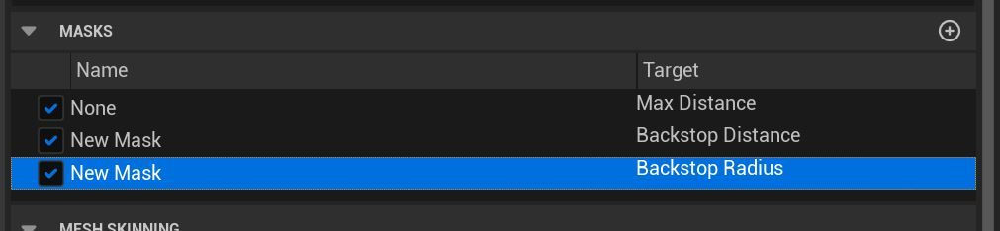
### Max Distance（最大距离）

**Max Distance** 是指布料顶点在初始位置的基础上可以移动的最大距离。这决定了布料的柔软度和动态范围。

- **用法**：
    - 通过权重图设置不同顶点的最大移动距离。权重值越高，布料可以移动的距离越大。
    - 对于需要大幅度摆动的布料部分（如裙摆或袖子），设置较大的 Max Distance 值。
    - 对于需要保持形状的布料部分（如肩膀或领子），设置较小的 Max Distance 值。
### Backstop

在 UE5 的 **Chaos Cloth** 系统（当前主流布料求解器）中，**Backstop** 机制的主要目的是防止布料粒子穿透进**动画网格（skinned/animated mesh）**的内部，尤其是在衣服紧贴身体的区域，或者身体快速运动时防止布料“陷进去”。

官方文档（Clothing Tool）对这两个参数的经典描述是：

- **Backstop Radius**： 以**动画网格（参考网格）的顶点**为中心，使用一个**球体半径**。 这个球体与 **Max Distance** 球体（以同一顶点为中心，半径为 Max Distance）做**交集**，交集以外的区域布料粒子**不允许进入**。 → 简单说就是在动画顶点周围画一个“禁区球”，布料不能穿进这个球里。
- **Backstop Distance**： 是**偏移量**（offset），它把上面那个“禁区球”的**中心点**沿着**顶点法线反方向**（通常是向身体内部）移动一段距离。 → 换句话说，Backstop Distance 越大，禁区球就往身体里面推得越深，布料就越不容易穿模，但也可能让布料显得更“硬”、更贴着动画网格。

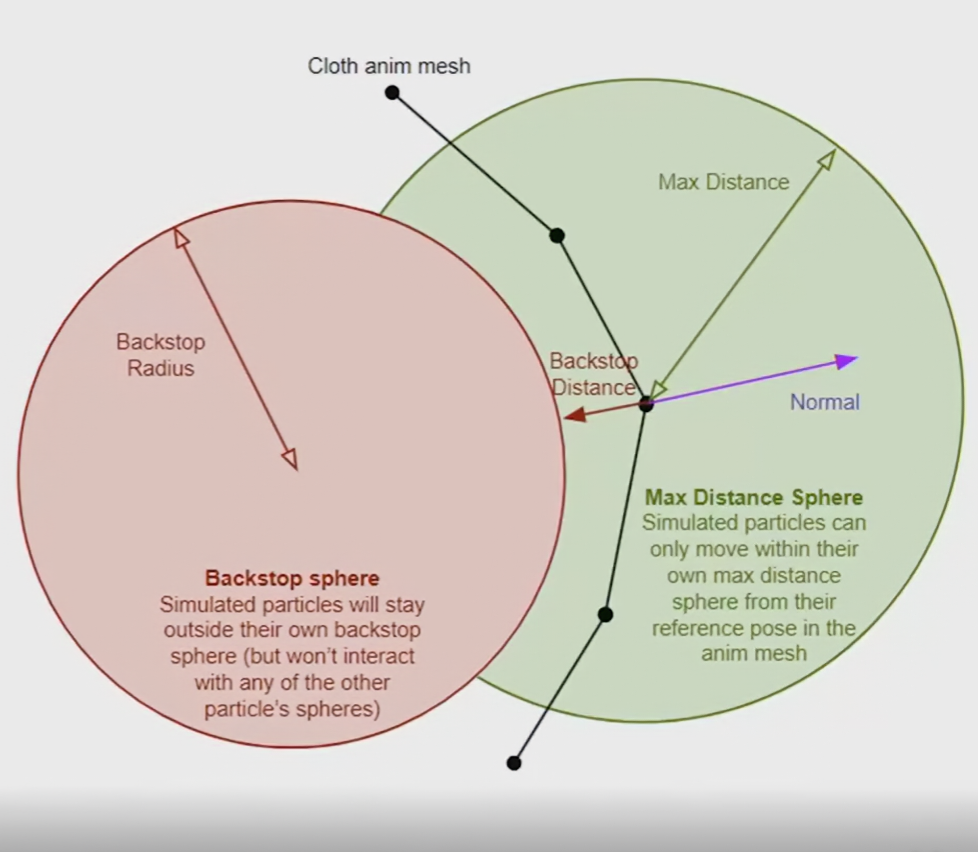
**最形象的理解方式**（社区和文档里最常用的说法）：

- 在动画网格的每个顶点处，先画一个以该顶点为球心、半径 = Max Distance 的球 → 布料粒子最多只能在这个大球里运动。
- 再以同一顶点为参考，向**法线反方向**偏移 BackstopDistance 的距离，得到一个新的球心。
- 以这个新球心 + Backstop Radius 作为半径画一个小球 → 这个小球就是**完全禁止布料粒子进入的区域**（backstop volume）。
- 这样就能有效防止布料穿进身体，尤其在腋下、裆部、肘部内侧等容易陷进去的地方。
## 遮罩绘制技巧
### 1. 先建立基准（不要直接调 Backstop）

在开始调 Backstop 前，确保下面几项基本合理，否则调 Backstop 会很痛苦：

- **Max Distance**（最大偏移距离）已经合理 → 紧身衣 0.5～3 cm，宽松 T 恤/裙子 5～15 cm（单位 cm，视模型比例）
- 动画网格（skinned reference pose）的**皮肤权重**干净 → 肩膀、腋下、裆部等区域权重过渡不合理会导致 Backstop 失效或过度
- **Substep** / **Solver Iteration** 足够（尤其是快速动作） → 至少 3–5 substeps，迭代次数 8–16（性能允许的情况下）
- 布料网格**分辨率合适**（粒子间距 1–4 cm 常见）

### 2. Backstop 调优核心思路（最常用流程）

|问题现象|推荐先调哪个参数|典型值范围 (cm)|效果说明|注意事项 / 副作用|
|---|---|---|---|---|
|布料明显穿进身体|**先增大 Backstop Radius**|1.0 → 3.0 → 5.0+|禁区球变大，最直接防穿模|太大 → 布料变硬、出现明显“鼓包”或不自然贴合|
|穿模已解决，但布料太硬、贴得死板|**减小 Backstop Radius** 或 **增大 Backstop Distance**|Radius 1.5–3.0 Distance 0.5–2.5|Distance 往里推禁区中心，让布料有更多活动空间|Distance 太大 → 又开始穿模（矛盾点）|
|只在某些区域（如腋下）穿模|使用 **Backstop Distance / Radius Mask**|局部画 0.0～1.0（黑白图）|只在穿模严重处加强 Backstop，其他地方保持柔软|必须用蒙版！全局统一值基本不可用|
|快速运动时突然穿模|Radius 稍微加大 + 提高迭代 / 子步数|Radius +0.5～1.0|单纯靠 Backstop 很难完全解决快速穿模，需配合提高求解精度|性能代价较高|
|布料看起来“浮”在身体外|**减小 Backstop Distance**（甚至到 0.2～0.8）|Distance 0.3–1.2|禁区中心不往里推那么多，布料更贴皮肤|容易在弯曲时重新穿模，需要蒙版配合|

**最推荐的实际工作流（80% 项目适用）**：

1. 先把 **Backstop Radius 全局设成 2.0～3.5 cm**（作为安全起点）
2. **Backstop Distance 全局先设 0.8～1.5 cm**
3. 播放动画，找到最严重的穿模区域
4. 在 Clothing Editor 用 **Mask** 工具：
    - 创建 Backstop Distance Mask → 在穿模处刷白（1.0 = 完全生效）
    - 创建 Backstop Radius Mask → 在同一区域刷 0.3～0.8（不要刷满 1.0）
5. 反复测试：快速跑、跳、转体、坐下、抬臂等极端动作
6. 如果某些地方还是穿 → 局部 Radius Mask 再加 0.5～1.0
7. 如果布料看起来太“塑料”/鼓包 → 对应区域把 Distance Mask 刷高（1.5～3.0），把禁区往身体里推深

### 3. 常见经验值参考（不同类型服装）

- **紧身衣 / 运动服 / 皮衣**：Radius 1.2–2.5 cm，Distance 0.4–1.2 cm（偏小 + 蒙版加强关键区域）
- **T恤 / 衬衫**：Radius 2.5–4.0 cm，Distance 1.0–2.5 cm
- **裙子 / 宽松外套**：Radius 可以做到 5.0+ cm，Distance 2.0–4.0 cm（但裙摆通常不需要强 Backstop）
- **胸部 / 臀部 / 裆部**（最难搞区域）：Radius Mask 0.6–1.0 + Distance Mask 1.5–3.0
## 设置碰撞
- 设置物理资产用于布料碰撞模拟
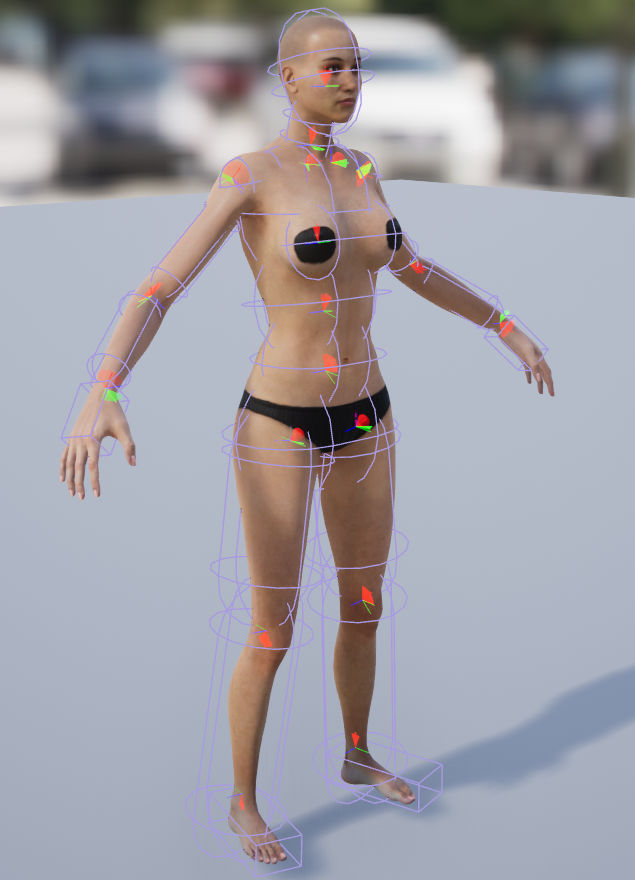
- 当使用较长的刚体链时，质量是一个重要的考虑因素！我们总是将父体设置为比子体重以稳定链条。链中某个物体下方的所有模拟物体的总和不应超过父物体的质量。
	- 例如，在 3 节链中，如果体 1 质量设置为 100，则体 2 和 3 的总和不应超过 100。
	- 沿着链的质量减少应该减少，但为了最好地防止抖动，所有子项的总和应始终小于父项。
	- 最简单的方法是使用 2 的倍数，从最后一根骨头开始，沿着链向上进行 1、2、4、8、16 等.
	- 马尾辫，尾巴推荐使用100-50-20-10-5-2-1
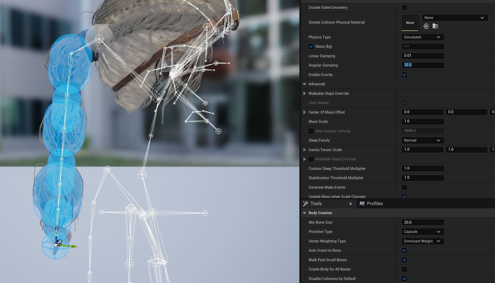
## 调整布料属性
- 设置布料属性
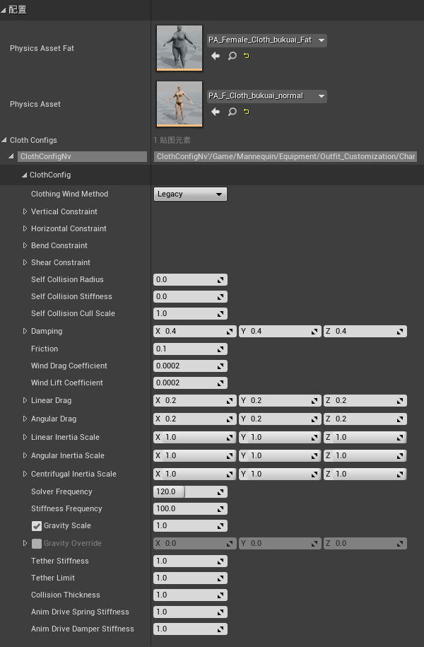
- 一般布料属性:
- Burlap：麻布，Silk：丝绸，Rubber：橡胶，Heavy Leather： 厚皮革。
- UE5:
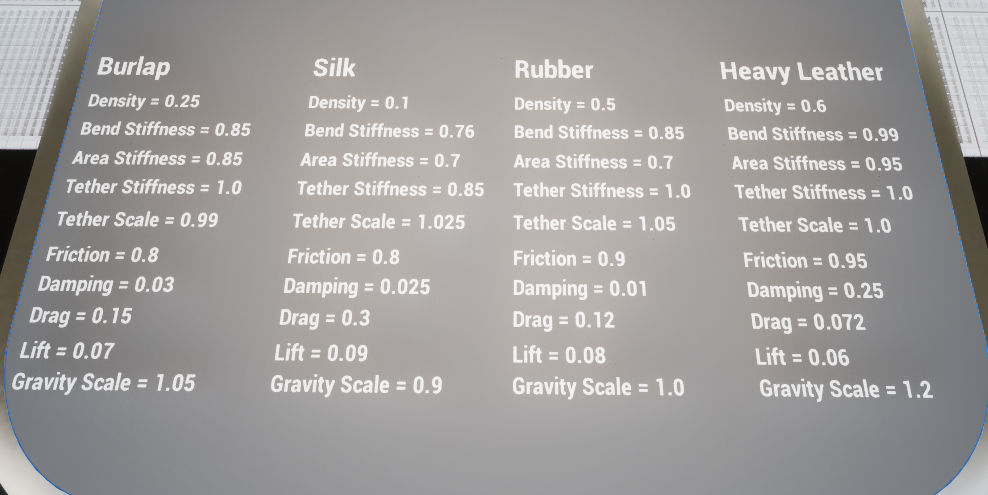
- UE4:
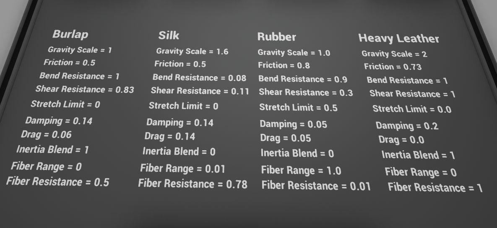

# 代理布料资产处理
## 用法：
- 代理布料资产一般用于低面数布料驱动高面数布料（以减少布料显存开销），或者简单模型布料驱动复杂模型布料（面片布料资产驱动插片布料资产）。
## 步骤：
- 在DCC软件中制作布料代理模型并蒙皮，添加必要的混合变形。
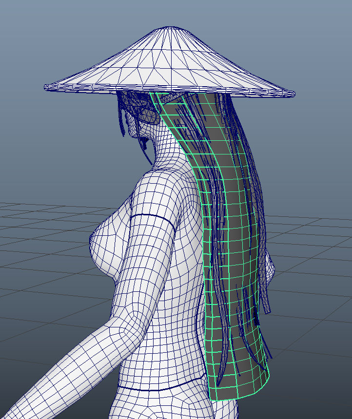
- 代理模型可以跟主体模型一起导出也可以分别导出。模型如果带有BlendShape,建议采用一起导出的方式，反之则分别导出。
- 如果代理模型和主体模型一起导出，则选中代理模型section创建布料，并在主体模型应用布料。注意：在创建布料时不要勾选Remove From Mesh（不要移除代理网格，后面还要用代理网格生成LOD布料）
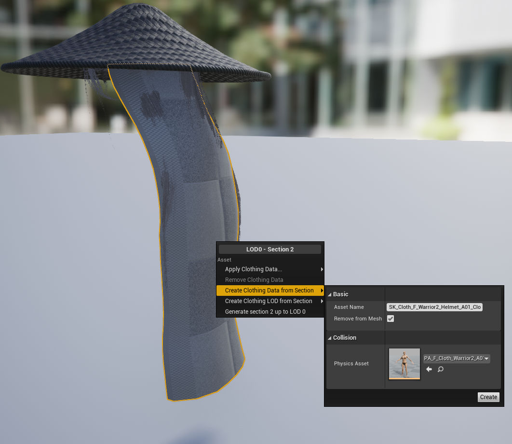

- 如果代理模型和主体模型分别导出，则在代理模型中创建布料，在主体模型的布料选项卡中点击“Copy Clothing from SkeletalMesh”，并选择代理模型，即可将代理模型布料信息复制到主体模型并应用。
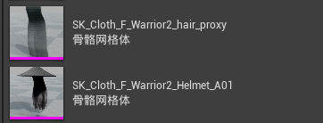

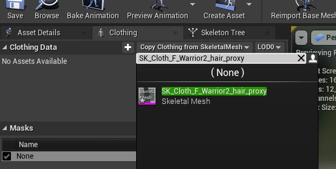
# 布料资产LOD处理
- 在LOD0级别上创建布料（不要Remove From Mesh）
- 切换到LOD1级别，选中要创建布料的section（代理网格），右键选择“从分段创建LOD”。注意：要勾选Remap Parameters。
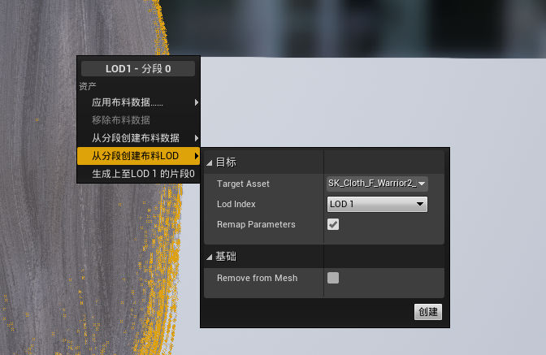
- 最后应用LOD布料。
- LOD布料制作完成之后，再Disable代理网格的Section（隐藏代理网格）
> [!WARNING] WARNING
> - 利用代理模型生成LOD0布料后，再减LOD1时要用代理模型生成LOD1布料再应用到主模型LOD1，不可以直接用主模型生成LOD1布料，会因据错误（数LOD1的布料顶点数高于LOD0的布料顶点数）而导致客户端崩溃。
> - 用代理模型生成LOD1布料再应用到主模型LOD1，有几率导致布料效果不佳，这种情况下建议所有LOD级别共用LOD0级别的布料，因为代理模型已经是简模了，无需LOD再减。
# Kawaii技术和布料技术混用案例
- 在美术资产中有时会遇到有些链状结构不适合应用布料，需要物理结算，而有些片状结构适合用布料结算，这就牵扯到布料资产和kawaii骨骼动画之间的碰撞效果。
- 解决方案如图所示
- 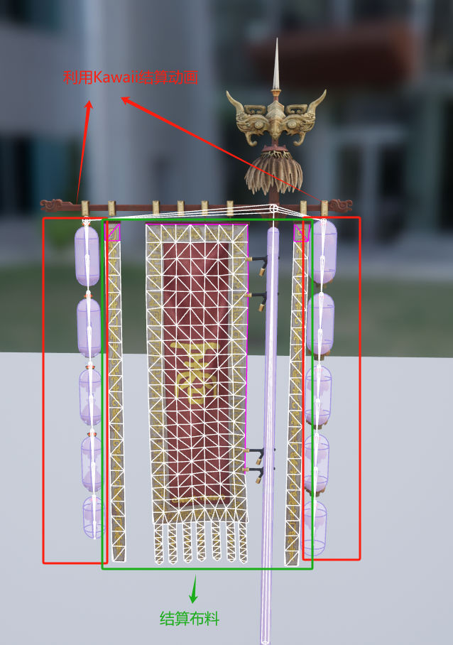
> [!INFO] 原理
> - kawaii插件结算骨骼链动画，骨骼链动画带动物理资产运动，物理资产对布料资产产生碰撞效果。