# 概述
- [【UE】从零开始！Chaos布料系统究极上手指南_哔哩哔哩_bilibili](https://www.bilibili.com/video/BV1FYhbzVEFn/?spm_id_from=333.337.search-card.all.click&vd_source=0f765d25b29efef66dd4ff586509e026)
- https://www.bilibili.com/video/BV1UHtczNEFV/?spm_id_from=333.337.search-card.all.click&vd_source=0f765d25b29efef66dd4ff586509e026
- https://www.youtube.com/watch?v=1ty5-RlBlVQ&t=1249s
- https://www.youtube.com/watch?v=wq0lY7vhF5w&t=631s
# 原理
- ChaosCloth的基本原理是基于低多边形的顶点位置通过模拟粒子驱动渲染模型，通过包裹变形器实现物理模型驱动渲染模型
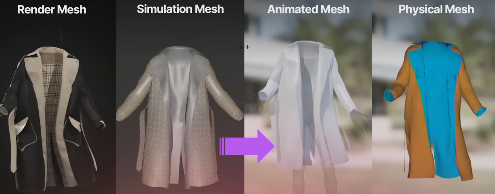
- Render Mesh：服装的高模
- Simulation Mesh：服装的低模代理模型
- Animated Mesh：Simulation Mesh 绑定到骨骼后的 skinned 版本
- Physical Mesh：真正参与 Chaos 粒子物理模拟的网格。从 Animated Mesh每个顶点模拟粒子计算得到。
- 他们之间的关系为：
    - Simulation Mesh（低模代理模型） -> 蒙皮 -> Animated Mesh（动画模型）->模拟粒子 -> Physical Mesh（物理模型）-> 包裹变形 -> Render Mesh（渲染模型）
    - Simulation Mesh 通过蒙皮生成 Animated Mesh，Animated Mesh 通过顶点模拟粒子生成 Physical Mesh，Physical Mesh就是布料模拟模型，Physical Mesh 通过包裹变形 Render Mesh，使得Render Mesh跟随变形，得到最终看到的布料动态。

# 布料模型设计原则
- 避免出现重叠在一起或挤压的模型区域，要求模型清晰分隔

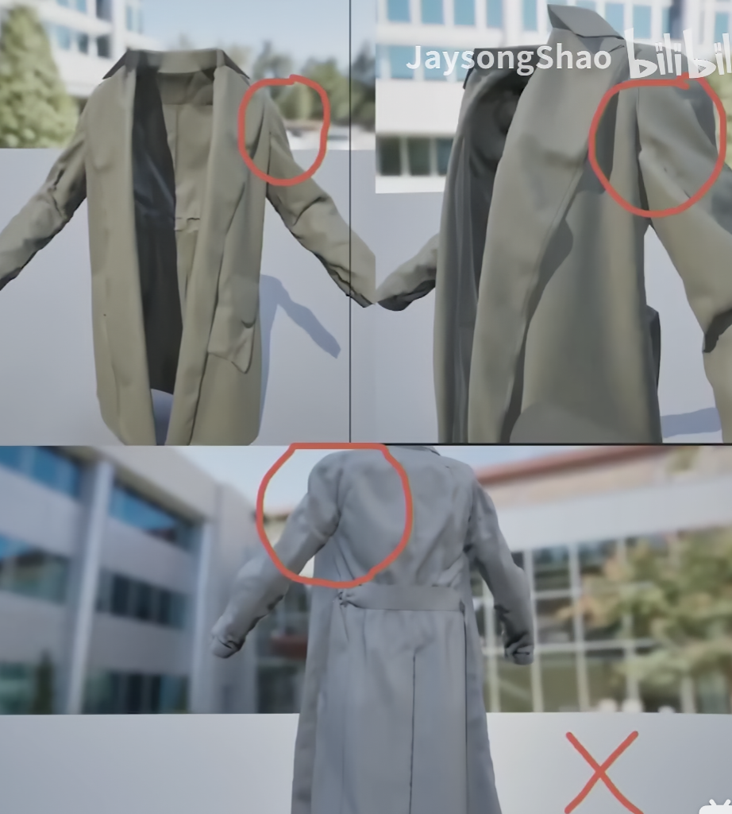

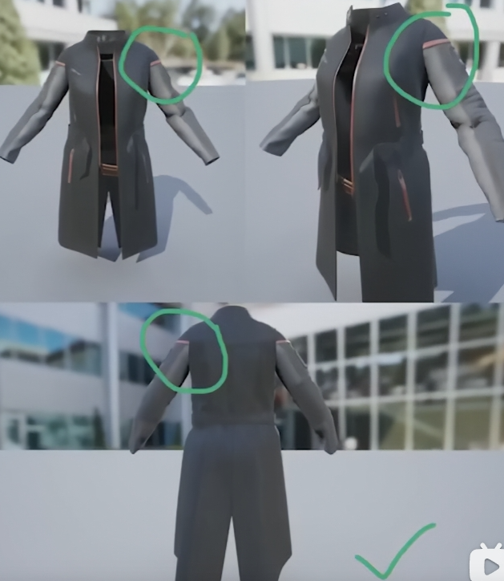
- 避免模型区域堆叠，上图中的腰带和口袋，下图中的翻领和衣领

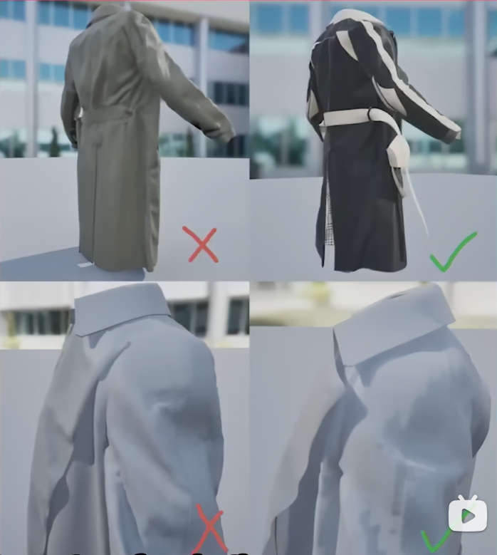
- 避免在布料表面附着刚性物体：镶钻和铆钉

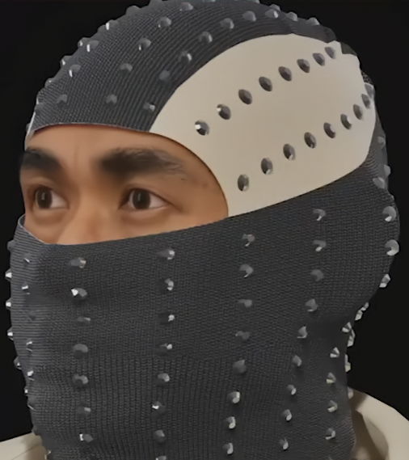
- 在静止姿态下所有的悬垂物体，不能出现自我折叠和扭曲。因为在静止姿态都会出现这个问题，那么所有约束都回试图维持这个形状，应该让布料系统来实现这些弯曲和褶皱。

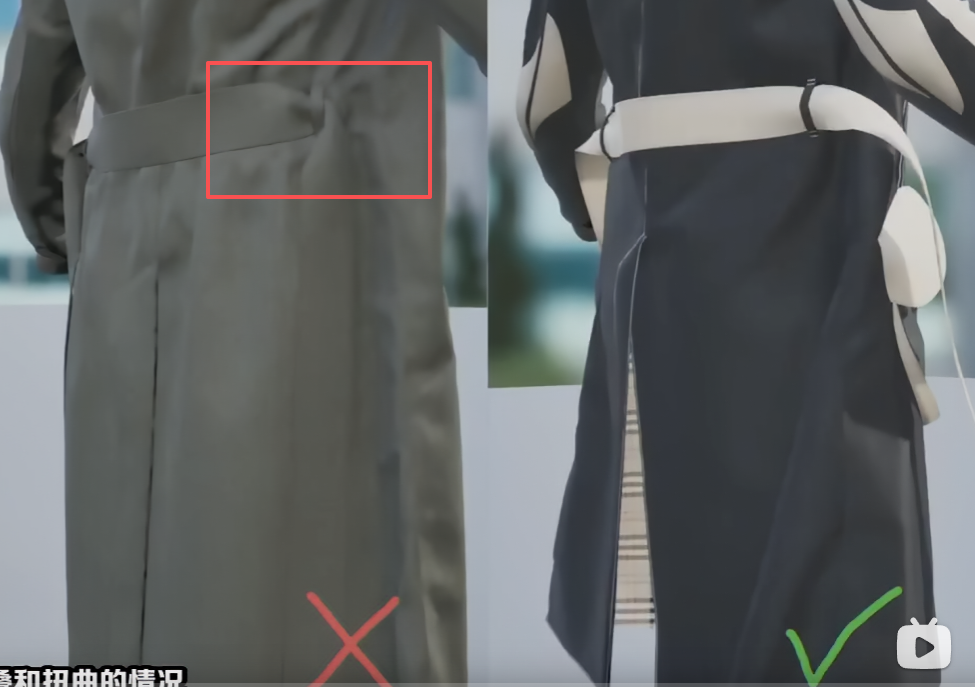
- 在处理皮带环等附件，我们要提高网格数量和厚度。

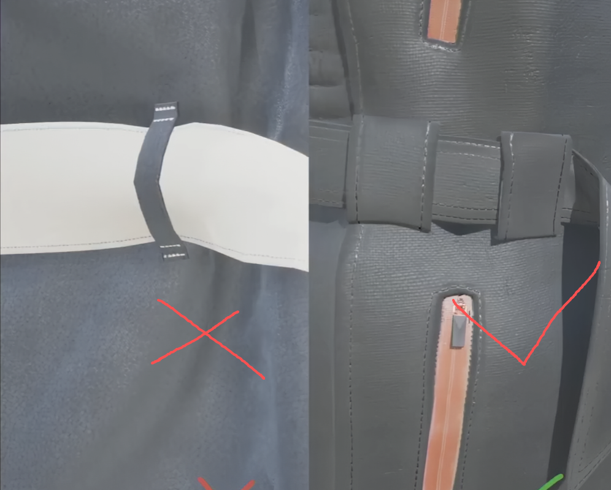
- 代理模型的面数要足够少，以减少消耗。拓扑结构同样重要。

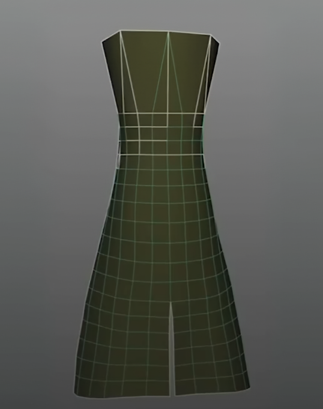
# 模拟性能
- 想要提高模拟性能，使模拟低于1ms
	- 200-600模拟顶点，越多的顶点需要越多的迭代和子步，模拟顶点大于1000可以获得更好的模拟效果，但是肯定会超过1ms。
	- PS5平台：350个模拟顶点的情况（巫师4 Ciri 披风）
		- 1迭代次数，1子步数：0.3ms
		- 2迭代次数，2子步数：0.8ms
	- 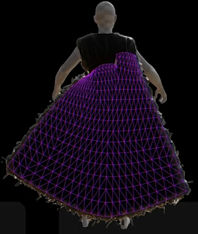
	- mobile/switch平台：200顶点
		- 1迭代次数，1子步数：1ms
- SimulationSolverConfig节点
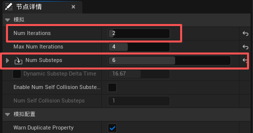
- subStep(子步数)和Iterations（迭代次数）	
	- subStep（子步数）是每帧计算布料状态的次数，增加该值可修复缺失身体碰撞，提高收敛性（抗拉伸，抗弯曲），降低阻尼。
	- Iterations（迭代次数）是在每个子步内计算约束和碰撞的次数，增加该值提高收敛性（效果较小但成本更低）
	- 他们共同作用来改善稳定性减少不真实拉伸，同时改善碰撞检测

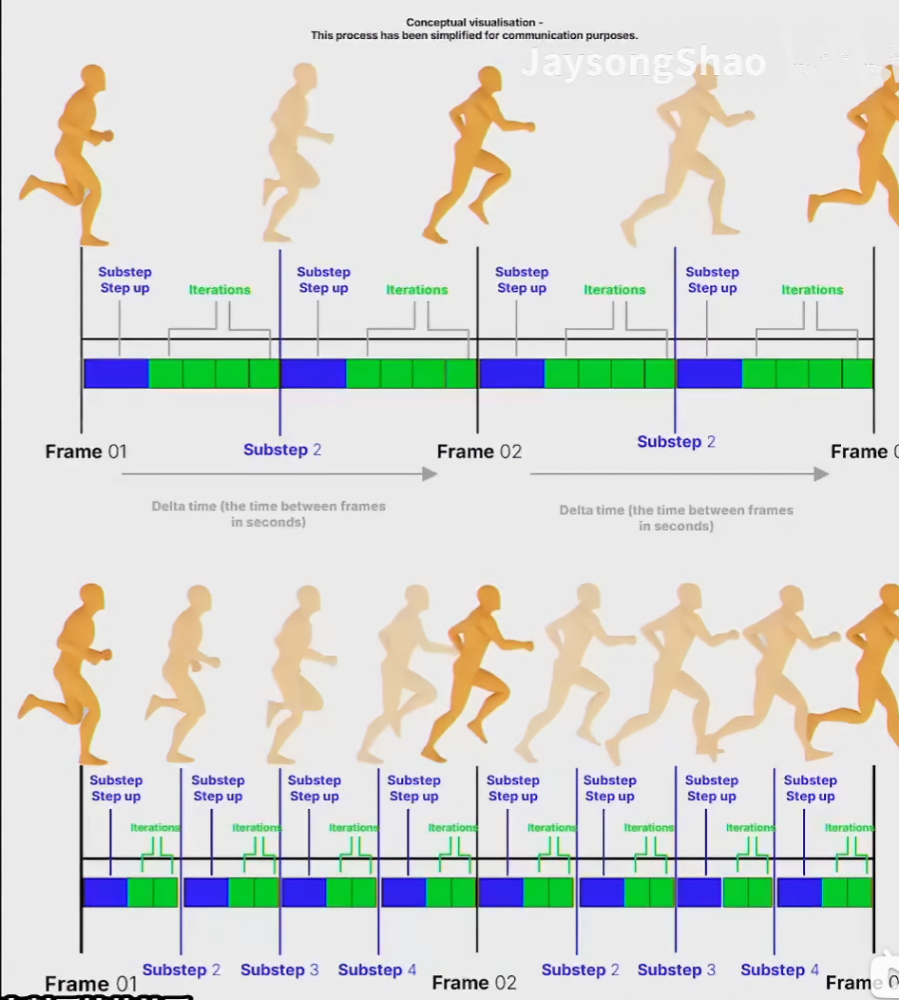

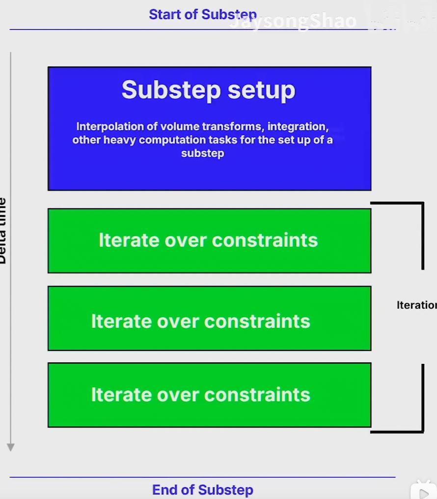
- 加 NumSubsteps 和 NumIterations = 让约束求解更“彻底” → 约束被强制更好地遵守 → 布料的物理行为更接近“刚性约束” → 整体刚度感知上升（布料会更硬）→ 调整弯曲刚性和阻尼
- Substeps 成本 ≈ Iterations × 1.5～2 倍，所以通常优先堆 Iterations。
- NumSubsteps：3～6（太高吃性能，但稳定性好）
- NumIterations：8～16（最影响“硬度”感知）
- Max Num Iterations：20～30（防低帧率爆炸）
# 核心流程

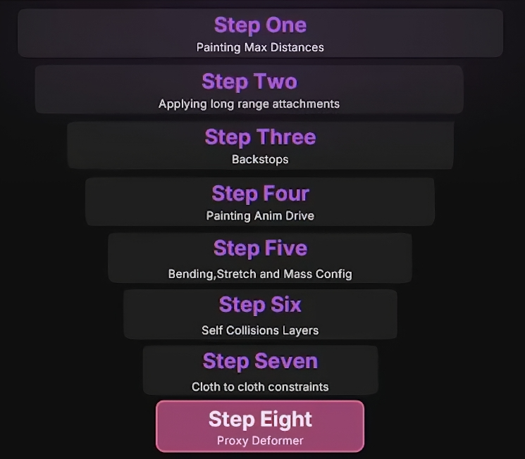
## MaxDistance

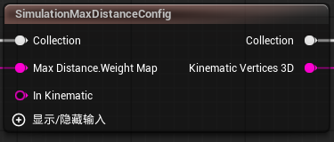
- 最大距离，定点可移动的最大距离

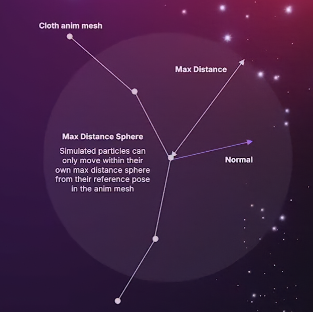
## LongRangeAttachments
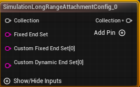
- 长距离附着，布料的拉伸效果，能对抗低子步数下产生的不真实拉伸。在最大距离之后设置。
- 使用长距离附着时拓扑结构很重要，因为他是通过最短路径算法找到相应顶点的。
- 本质是弹簧约束，将动态顶点约束到其最近的静态顶点。
- 
- 有两种模式：
	- UseGeodesicTethers：用测地线替代欧几里德法来进行长范围附加约束的距离计算，开销较大，但能更准确地建立系链的正确位置和长度，因此在模拟时不易出现瑕疵。
	- EnableCustomTetherGeneration：通过自定义选择集对系绳生成进行更精细的控制。否则所有动态粒子将连接到FixedEndSet定义的最近运动顶点
	- FixedEndData：用作固定系绳末端的顶点选择集的名称。可以自选。
	- 
## backStops

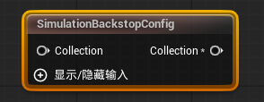
- 是一个补充碰撞系统，为追求性能使用低子步数和低迭代次数，所以需要这样的补充碰撞系统。会在最大距离内实现逐顶点碰撞，每个顶点都有独立的后止，每个顶点都与自己的后止交互。
- backStopRadius会在动画网格顶点生成一个碰撞球，防止物理网格穿透动画网格
- backStopDistance会控制动画网格顶点到碰撞球的偏移距离，这个偏移是沿着顶点的**法线方向**（Normal）进行的。将碰撞球内推或外推。

- BackStopRadius会在动画网格顶点生成一个碰撞球，并使用BackStopDistance将碰撞球向内（正值）或向外（负值）推。用来与SimulationMesh碰撞。
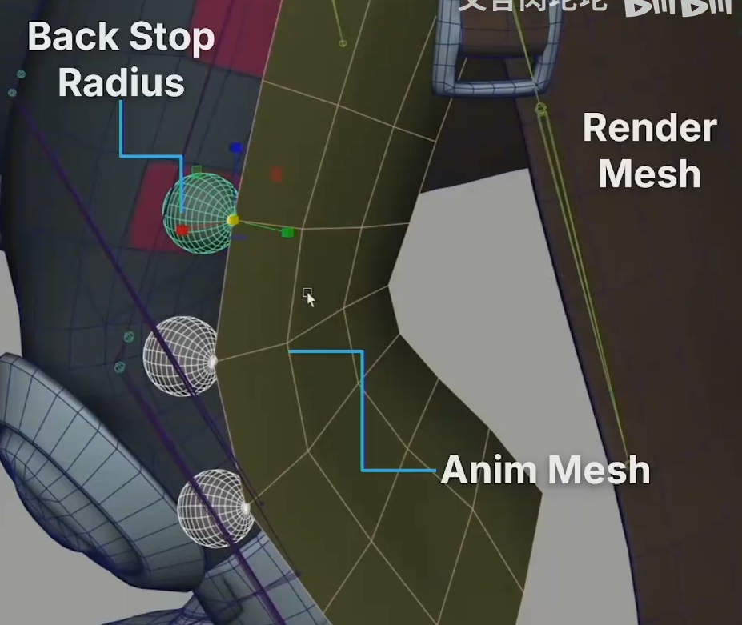
- 下图中紫色的是动画网格，灰色的是物理网格

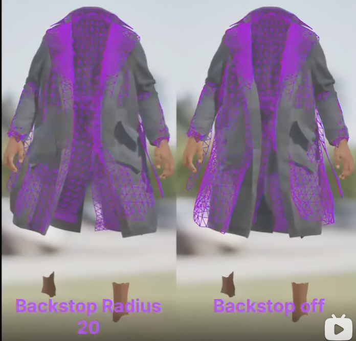
- 可以通过绘制贴图的方式来控制backstop，一般来说DIstance越大，Radius也越大大。
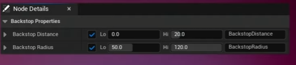
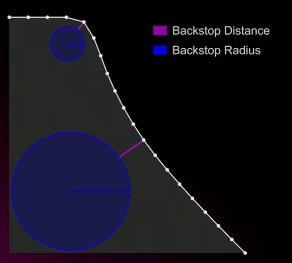
- 对于宽松的服装，BackStop会使布料看上去被无形的物体阻挡了，因此可以在角色移动速度快的时候开启BackStop，移动速度慢的时候关闭BackStop。
- 
## AnimDrive

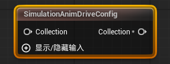
- 动画驱动是从动画网格到物理网格的弹簧约束，是对最大距离属性的补充。用于微调布料行为和解决穿透问题
- 这个值是非线性的，是弹簧约束的强度，中间值大约在0.25而不是0.5。

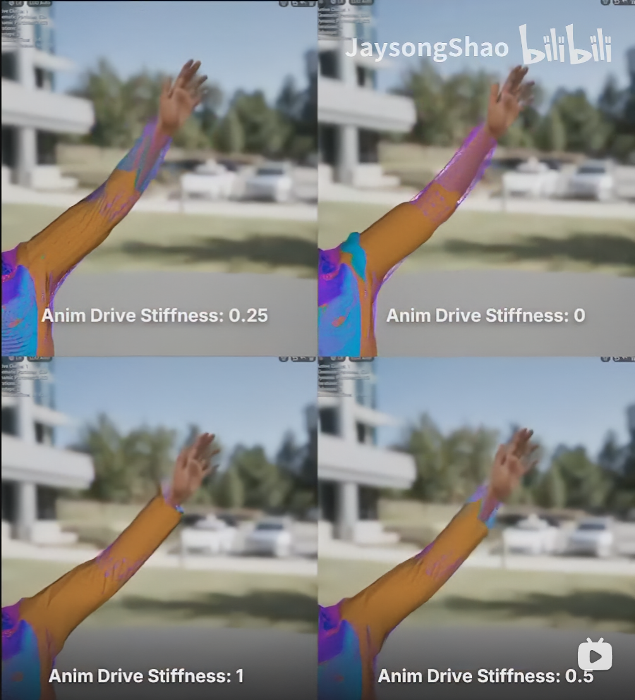
## Bending、Stretch和Mass

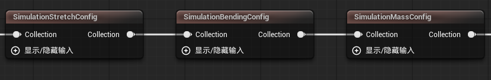
- 抗弯曲能力
- 弯曲度和拉伸度都支持基于位置的动力学系统PBD,以及扩展版XPBD系统
	- XPBD结算器开销略高，但是不用开启更高的子步数和迭代数。他的数值更有物理意义（420， 200）N/Cm，而不是 0-1.可以将DCC软件（MarvelousDesigner）中创建的模拟数据（弯曲和拉伸属性）以USD格式导入。可以调整阻尼和各向异性
	- PBD结算器值域为 0-1。无法调整阻尼和各向异性。 受到子步数和迭代数的影响更大，越多的迭代，布料越硬。
- BendConfig有两种约束类型：
	- HingeAngle（铰链角度）最真实支持起皱和折叠，原理是在相邻三角面之间强制新的静止角度，并抵抗新静止状态的改变。物理精度更高，开销略大。适合硬质材料。在高强度拉伸下稳定性较差，需要配合AreaConstraint使用（角度约束）
	- FaceSpring（面弹簧）比铰链角度开销小，但物理精度较低，不支持起皱效果。更适合柔性材料。（弹簧约束）
	- 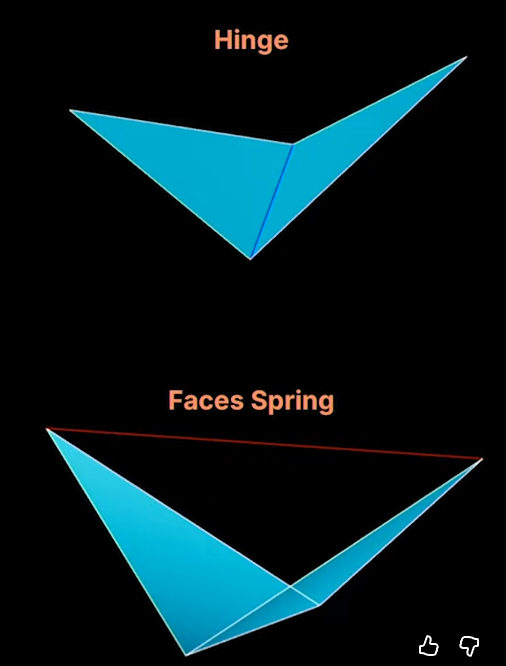
	- 有三个属性：
		- BendingStiffness：控制相邻三角面间的 弯曲抵抗力。高值=布料硬、直、不易折；低值=软、易弯曲/流动。
		- BucklingRatio：褶皱比率，决定布料从“正常弯曲”切换到“屈曲状态”的弯曲角度阈值。折到多大角度开始“啪”一下永久变形。
			- 切换阈值 = BucklingRatio × 静止角（rest angle）。
			- 0 = **从不 buckling**（布料永不塌陷，像硬板）。
			- 1 = **极易 buckling**（轻微弯曲就起皱）。 
			- 超过阈值后，自动从 BendingStiffness **切换到 BucklingStiffness**。
		- BucklingStiffness：褶皱刚度，仅在“buckling”触发后生效。用于压缩/过度弯曲时的 塌陷行为。通常设 低于 BendingStiffness（让褶皱“锁死”），模拟真实布料起皱/折叠。
		- 调整思路：
			- 先把 BendingStiffness 推到想要的“基础抗弯”水平。
			- 再调 BucklingRatio 决定“何时开始塌陷”。
			- 最后调 BucklingStiffness 决定“塌陷后多硬/多软”。
			- 高褶皱比与低褶皱刚度：柔软、飘逸、悬垂性好,有更多细小褶皱丝绸、人造纤维、针织布...
				- BendingStiffness：3.0
				- BucklingRatio：0.9
				- BucklingStiffness：0.5
			- 低褶皱比与高褶皱刚度：(通常仍低于弯曲刚度)更硬挺、更厚实、更脆、更有弹性皮革、羊毛...
				- BendingStiffness：3.0
				- BucklingRatio：0.4
				- BucklingStiffness：2.5

- StretchConfig是抗拉伸能力
	- StretchStiffness（拉伸刚度）：拉伸约束的强度
	- AreaStiffness（区域刚度）：区域刚度的强度
	- 这些数值非常敏感，微调就能产生很大效果
- Mass是质量配置。推荐使用密度

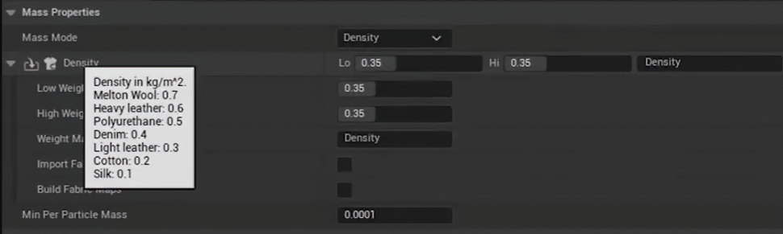
### 参数具体调优表（以 PBD + HingeAngles + Use3DRestAngles 为例，最常见硬布配置）

|布料类型|BendingStiffness (0~1)|BucklingStiffness (0~1)|BucklingRatio (0~1)|为什么这样调 & 额外Tips|
|---|---|---|---|---|
|**极硬 / 结构折痕** (军装皮革、肩章)|0.92 ~ 1.0|0.7 ~ 0.98|0.0 ~ 0.25|Ratio 低 → 几乎不 buckle，最大保留 3D rest angles。Buckling 高 → 一旦微 buckle 也硬挺。加 Iterations 18~25。|
|**硬 / 粗褶** (牛仔、厚外套)|0.85 ~ 0.96|0.5 ~ 0.85|0.2 ~ 0.45|Ratio 中低 → buckling 阈值不高，但 buckle 后“卡住”粗大折痕。Buckling 略低于 Bending 让褶皱自然不弹回。|
|**中等 / 自然褶** (棉 T恤、衬衫)|0.65 ~ 0.85|0.3 ~ 0.6|0.5 ~ 0.75|Ratio 中等 → 正常弯曲就 buckle，Buckling 低让褶皱柔软不僵。加 Bending Damping 100+ 防抖。|
|**软 / 细碎流动** (丝绸、雪纺)|0.35 ~ 0.6|0.05 ~ 0.3|0.75 ~ 1.0|Ratio 高 → 极易 buckle，Buckling 很低 → 褶皱塌陷快、流动强。降低 Iterations 8~12 让它更“偷懒”软。|
### 参数具体调优表（以 XPBD 为例，常见配置）
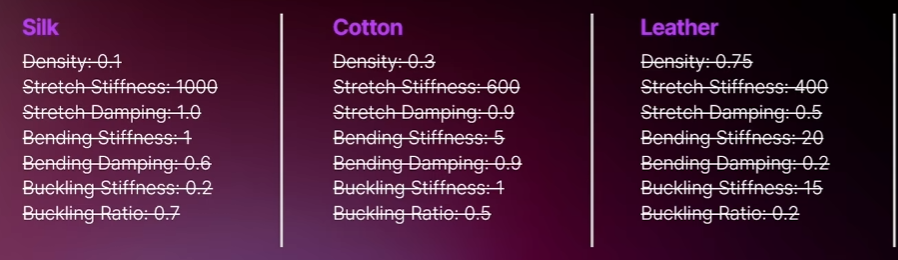

| Fabric（XPBD）      | Silk | Cotton | Leather |
| ----------------- | ---- | ------ | ------- |
| Density           | 0.1  | 0.3    | 0.75    |
| StretchStiffness  | 1000 | 600    | 400     |
| StretchDamping    | 1.0  | 0.9    | 0.5     |
| BendingStiffness  | 1    | 5      | 20      |
| BendingDamping    | 0.6  | 0.9    | 0.2     |
| BucklingStiffness | 0.2  | 1      | 15      |
| BucklingRatio     | 0.7  | 0.5    | 0.2     |

## VelocityScale

- 是速度矢量缩放，用于弱化布料资产在世界空间中变换所产生的影响。防止布料资产在世界空间中快速变换造成拉扯和撕裂。
- 主要包含两个属性：
	- LinearVelocityScale，线性速度缩放，推荐0.5-0.75
		- MaxLinearVelocity，最大线性速度，推荐400-500
		- MaxLinearAcceleration，最大线性加速度，推荐10000-12000
	- AngularVelocityScale，角度速度缩放，推荐0.5-0.75
		- MaxAngularVelocity，最大角度速度，推荐100-300
		- MaxAngularAcceleration，最大角度加速度，推荐5000-12000
## SelfCollision
- SelfCollision：SelfCollision和Intersections（自碰撞和自相交）是最为昂贵的自碰撞解决方案，可能超出亚毫秒级的开销预算。
- 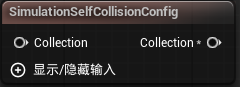

- SelfCollisionSpheres：自碰撞球是开销较低的解决方案，但是会遇到顶点相互传过无法解开的问题。这就需要Cloth-ClothConstraint来解决。
- 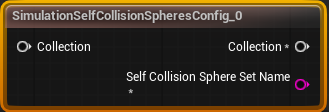
- Cloth-ClothConstraint：在两个布料之间生成弹簧，独立的压缩和拉伸刚度可以使各部
分保持分离,同时允许自由运动。SimulationClothVertexSpring下面会讲到。

- 可以在SolverConfig中开启自碰撞子步，该子步专门用于自碰撞，两种自碰撞都支持。
- 
## SelfCollisionLayers

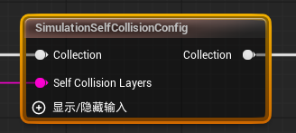
- 自碰撞层，本质上是分层选择节点的系统

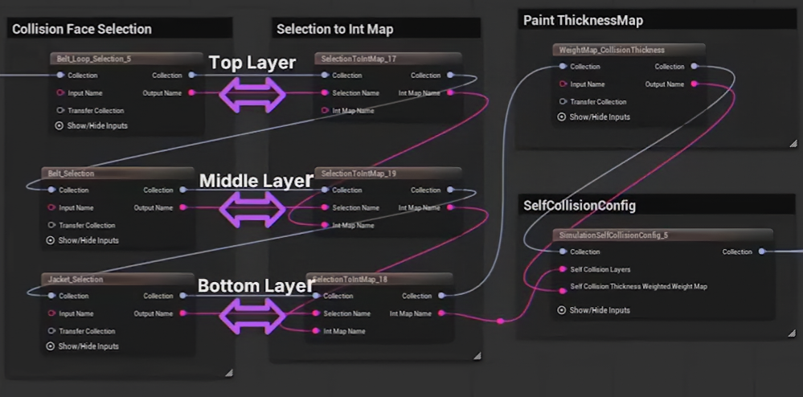
- 先选择面然后命名，将其提升为整形映射，同样给他一个新名称，然后要应用一个值，数字较小的数字会推动数字较大的数字，也就是月外层数值越大。最后将数值连接到SelfCollisionLayers
- 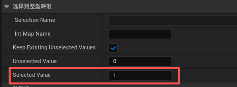
- 反选获得未被设置层的顶点，连接到SelfCollisionDisableFace，可获得性能提升

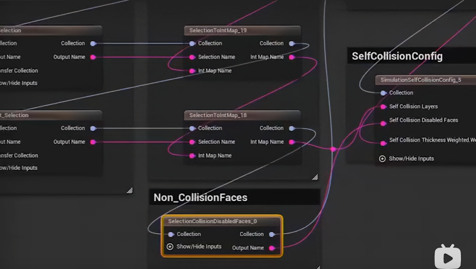
  - 完成这些后绘制CollisionThickness（碰撞厚度）
## VertexConstraint

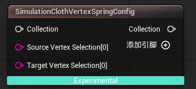
- 顶点到顶点约束系统：定义两组顶点集，在两组顶点集之间执行弹簧约束。以更低成本模拟碰撞效果，不实用胶囊碰撞更高效。
- 比如你在外套里穿着毛衣，那么可以选择外套内测和毛衣外侧所有顶点创建布料间约束，这样毛衣始终与外套保持排斥
- 布料间约束有两种类型
	- SimulationClothVertexSpringConfig：使用顶点
	- SimulationClothVertexFaceSpringConfig：使用用面
- 下面案例：衣领会塌陷到肩膀里，我们不必使用开销更大的碰撞层系统，而是使用布料间约束系统

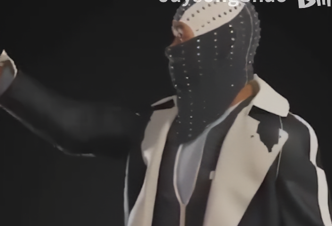
- 创建源和目标选集，源选集是胸口所有顶点，目标选集是衣领所有顶点

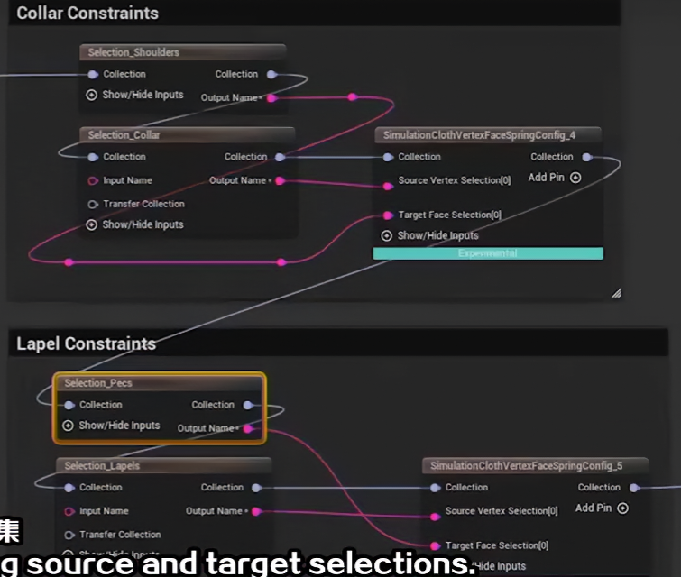
- 节点设置，勾选四边形排斥

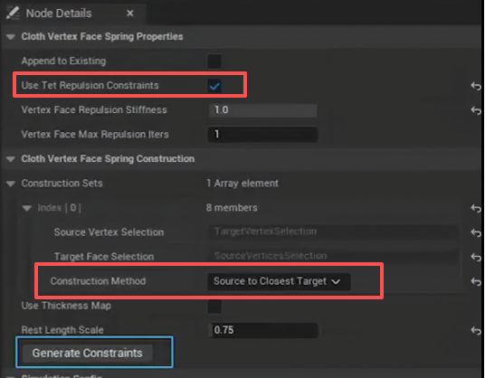
## AeroDynamics
- 布料的风场效果
- Drag: 平行/与相对气流方向相反；一个使织物与风向对齐的稳定器.
- Lift: 垂直于该相对气流；一个搅动器, 使其颤动.
- OutDrag/List：将布料的正面和背面的风动效果分开；如果降低，则减少将布料推向身体的风力，防止布料穿模。
- 
## ProxyDeformer

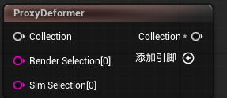
- 代理变形器：定义模拟网格如何驱动渲染网格

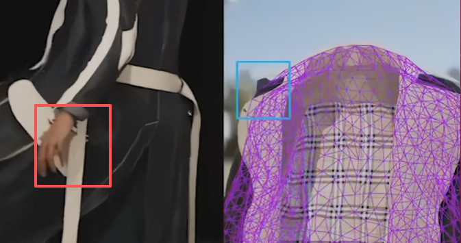
- 这里变形器将口袋部分当做了腰带部分，将肩膀部分当做了衣领部分
- 要解决这个问题，需要多组配对来定义这种关系，选择模拟网格部分和渲染网格部分将他们配对输入到代理变形器节点。告诉系统这就是驱动者和被驱动者。

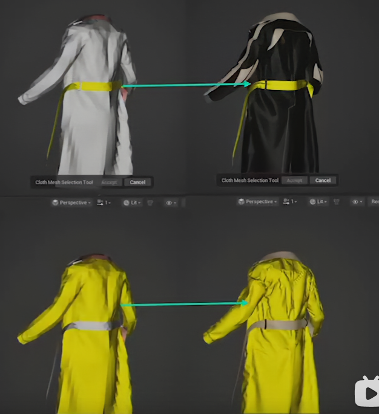

## SkinningBlend
- **`SkinningBlend`（蒙皮融合）节点**是一个非常核心的组件。它主要用于**处理布料的纯物理模拟状态（Dynamic）与骨骼动画蒙皮状态（Kinematic）之间的权重过渡**。
### 1. `SkinningBlend` 节点的核心功能

在Chaos Cloth的计算流中，顶点通常有两种运动模式：

- **Kinematic（运动学）**：完全由角色的Skeletal Mesh蒙皮权重（Skin Weights）计算出的动画位置。
- **Dynamic（动力学）**：由Chaos物理求解器计算出的自由落体、碰撞、随风飘动的位置。

`SkinningBlend` 节点的作用就是获取并计算这两者之间的混合比率。它会将读取到的蒙皮权重数据（或你通过Weight Map绘制的遮罩）映射到物理粒子上，告诉求解器：“哪些顶点应该像钢板一样跟着骨骼动，哪些顶点应该像丝绸一样飘，以及中间的平滑过渡”。

### 2. 节点的前置依赖项（关键点）

在Dataflow中连接此节点时，有一个容易卡住的坑：**它强依赖于 `ProxyDeformer`（代理变形器）节点的数据。**

- 根据Epic的官方规范，即使你没有明确定义复杂的变形器配对逻辑，输入到 `SkinningBlend` 节点的 `ClothCollection`（布料数据集合）上，也**必须提前存在ProxyDeformer的映射数据**。
- **为什么？** 因为Chaos解算通常在低模（Simulation Mesh/Proxy）上进行，而蒙皮动画是在高模（Render Mesh）上进行的。`ProxyDeformer` 建立了这两者顶点之间的包裹/绑定关系，`SkinningBlend` 必须依赖这层关系才能知道如何把蒙皮动画的位移传递给模拟顶点。
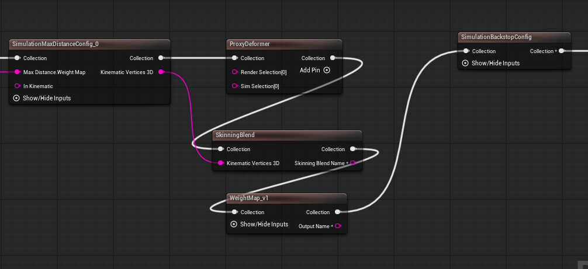
- 其中WeightMap_v1节点属性：
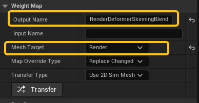
## SkinedTriangleMeshCollision
- 蒙皮三角网格碰撞，是UE5.7新增的精细碰撞功能
- 在物理资产中移除所有胶囊体和盒体碰撞
- 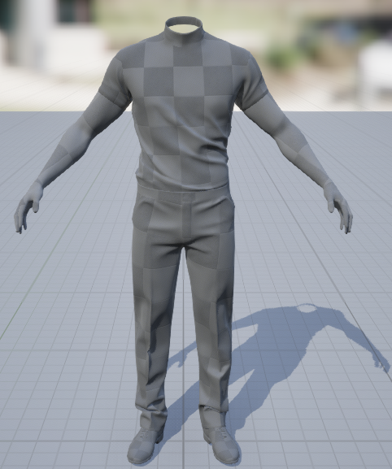
- 在空白处点右键，选择GenerateSkinnedTriangleMesh
- 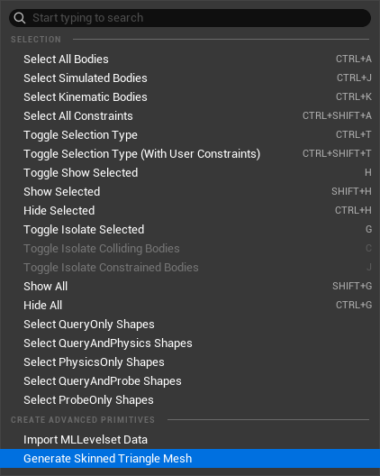
- 便会生成一个蒙皮模型碰撞
- 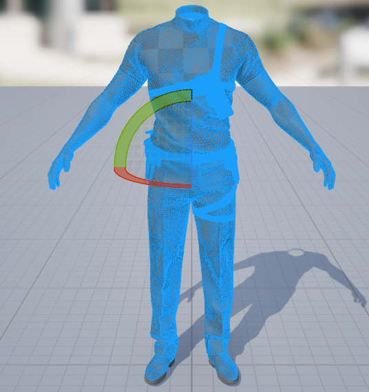
- 在布料资产中调用物理资产
- 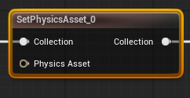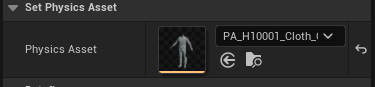
- 并模拟碰撞，勾选EnableSkinnedTriangleMeshCollision
- 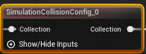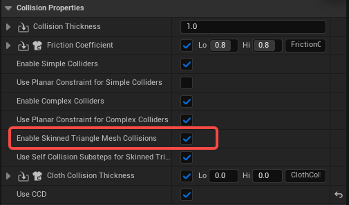

# ClothComponent和ClothInteractor
- 布料组件和布料交互器
- 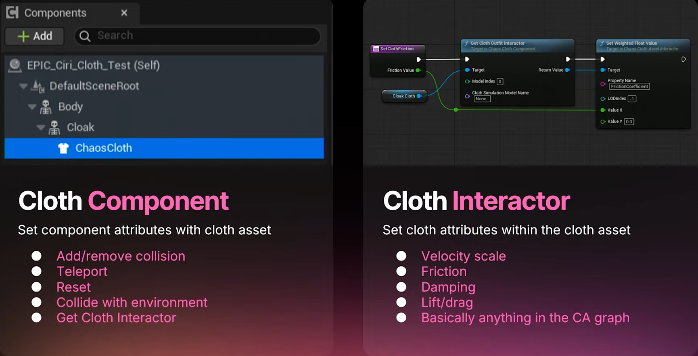
- 布料组件是影响整个布料的组件级资产
	- 增加和移除碰撞
	- 传送
	- 重置
	- 环境碰撞
	- 获取布料交互器
- 布料交互器用于动态的设置布料属性，基本上可以控制所有的布料属性
# clothControllerFunction
- 这是布料设置的心脏，基本上是一个布料的状态机，本质上是一个动画蓝图。
- 为何需要clothControllerFunction
	- 因为一个属性值无法满足角色布料的所有运动情景，静止待机和高速奔跑，需要不同的布料属性来控制。
- 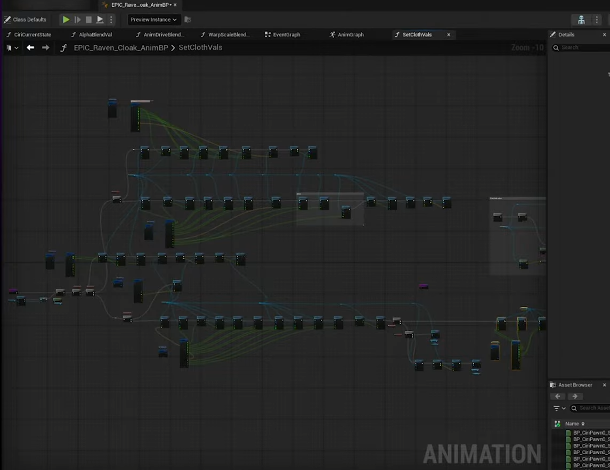
- 可以通过结构体（Struct）为每一个运动状态赋值
- 在结构体中增加你需要控制的属性值
- 在动画蓝图中使用该结构体为运动状态赋值
- 也可以直接在动画蓝图中为运动状态赋值
- 在特定地点设置触发盒，触发布料风场节点
- 骑马的时候动态的添加马匹的碰撞，下马之后移除马匹碰撞
- 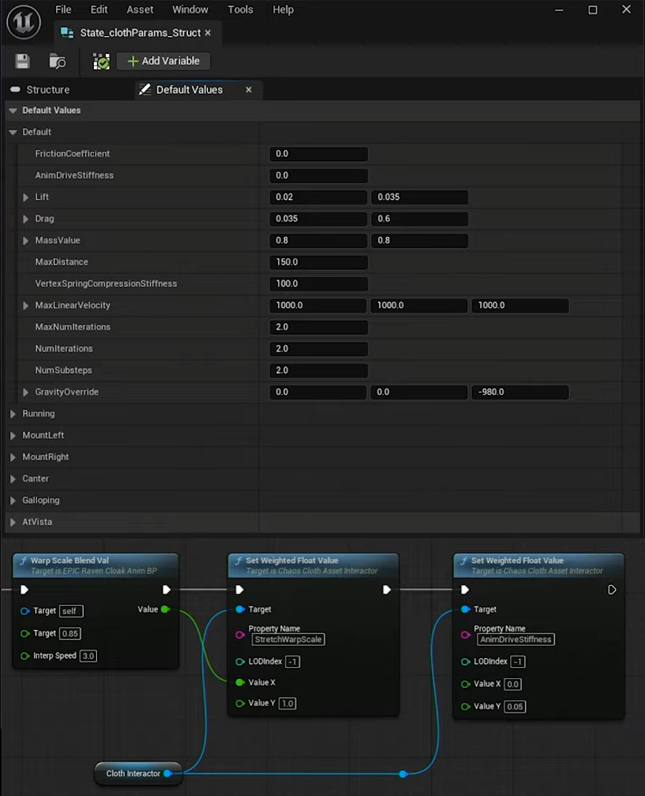
# Debug
- 开启布料DEBUG命令行：`p.Chaos.DebugDraw.Enabled 1`
- 绘制碰撞：`p.ChaosCloth.DebugDrawCollision 1`
- 绘制动画网格：`p.ChaosCloth.DebugDrawAnimMeshWired 1`
- 绘制传送重置：`p.ChaosCloth.DebugDrawTeleportReset 1`，如果传送，会显示绿色网格，如果重置绘制红色网格
- 是否在前景绘制：`p.ChaosClothVisualization.DrawInForeground 0`
- 控制播放速度：`t.OverrideFPS 60`
- 重置播放速度：`t.OverrideFPS -1`
## 可以将他们设置为编辑器工具控件（EditorUtilityWidet）
- 
- 
# 兜帽跟随ControlRig
- 头上戴兜帽时兜帽跟随头部
- 摘下兜帽，兜帽跟随脊椎
- 
# 过场动画
- 镜头开始前永远增加前置pose，使物理结算充分完整后再播放动画
- 时间栏中要对布料属性进行修改（Teleport、Reset...），建议使用EventTracks，在时间栏上剋帧可能不会被评估。
- Teleport/Reset
	- Teleport：效果没有损失。传送会消除任何外力,本质上是暂停当前姿势，然后在传送后以相同姿势恢复。这在大多数情况下都应该有效。不会造成损失。
	- Reset：效果更具戏剧性。重置将根据动画网格姿势重新启动您的模拟。对于动画姿势的重大差异,请使用此功能。请确保您的动画网格姿势良好。
	- 仍然无法正常结算：全局阻尼，创建一个函数，将全局阻尼提升至1，然后逐渐降至0。这本质上是传送,只是有更多的控制。这样做完全合理。